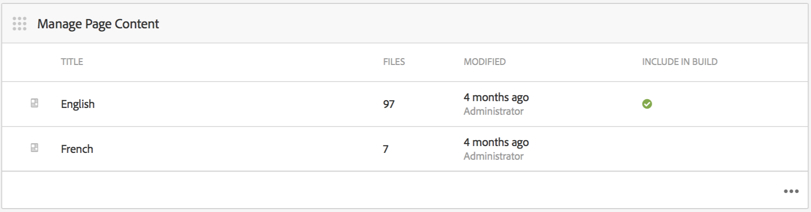

# Criação e gerenciamento do conteúdo do aplicativo{#creating-and-managing-app-content}

>[!NOTE]
>
>A Adobe recomenda usar o Editor de SPA para projetos que exigem renderização do lado do cliente com base em estrutura de aplicativo de página única (por exemplo, React). [Saiba mais](/help/sites-developing/spa-overview.md).

O gerenciamento de conteúdo do aplicativo requer um esforço coletivo da [desenvolvedores](#developer), conteúdo [autores](#author) e [administradores](#administrator). Os autores manipulam páginas, que por sua vez são baseadas em modelos e componentes gerados por desenvolvedores de aplicativos.

Por fim, os administradores publicam estrategicamente o conteúdo atualizado do aplicativo.

>[!NOTE]
>
>**Pré-requisitos**:
>
>Em [Implantação e manutenção](/help/sites-deploying/deploy.md), os desenvolvedores se familiarizaram com AEM sistema de componentes e modelos.

## O mosaico Gerenciar conteúdo da página {#the-manage-page-content-tile}

>[!CAUTION]
>
>Se você não estiver usando um modelo de aplicativo pronto para uso, para habilitar o novo conteúdo do aplicativo para ser publicado no OTA, é necessário configurar um manipulador de Sincronização de conteúdo.
>
>Consulte [Móvel com sincronização de conteúdo](/help/mobile/phonegap-contentsync.md) na seção do Desenvolvedor para obter mais detalhes.

Aqui, o conteúdo pode ser criado, editado e excluído no AEM Mobile da mesma forma que no AEM Sites.

O **Gerenciar bloco de conteúdo da página** exibe o número de páginas de conteúdo gerenciado e a última modificação para uma carga útil específica. Você pode detalhar o conteúdo para criar, copiar, mover, excluir e atualizar páginas clicando em cada registro no bloco.

Depois que o conteúdo é atualizado, os administradores podem publicar uma carga de atualização de conteúdo sobre o ar (OTA) para os clientes por meio da variável **Gerenciar blocos de conteúdo .**

Selecione um dos pacotes de conteúdo listados para criar ou editar conteúdo, como criar, editar ou remover páginas, alterar a navegação e a ordem da página, criar ou atualizar conteúdo, como cópia (texto) e mídia.

Observação *tudo é conteúdo*, o que significa estilos de aplicativo, cópia (texto), mídia, páginas, navegação e direcionamento de conteúdo pode ser editado e atualizado no OTA, sem uma viagem a uma loja de aplicativos.

Para editar conteúdo do AEM Mobile, *AEM autores *precisarão de uma compreensão sólida AEM interface de edição de conteúdo: [Criação de páginas em AEM.](/help/sites-authoring/qg-page-authoring.md)

## O mosaico Gerenciar pacotes de conteúdo {#the-manage-content-packages-tile}

Aqui, *Administradores de AEM* O pode atualizar seus aplicativos de forma rápida e fácil para fornecer experiências envolventes e conteúdo atualizado, a fim de impulsionar o envolvimento da marca e atingir objetivos comerciais, tudo sem precisar reenviar o desenvolvedor ou a loja de aplicativos.

Uma vez *Autores do AEM* tiverem adicionado ou modificado conteúdo por meio do Bloco Gerenciar conteúdo , *Administradores de AEM* podem enviar essas alterações para clientes com uma atualização de Pacotes de conteúdo .

A ação Pacote de conteúdo permite que o *Autor do AEM* para criar e editar conteúdo da página enquanto a equipe de desenvolvimento faz alterações em um design e implementação do aplicativo host, incluindo navegação, estilo, lógica do lado do servidor, modelos e componentes e, em seguida, envia essas alterações para os clientes do OTA, sem precisar reenviar para as várias lojas para distribuição.

**Para publicar conteúdo novo ou atualizado**

Selecione um pacote de conteúdo do bloco, neste exemplo, o pacote inglês. Observe que uma caixa de diálogo de atualização de conteúdo lista os *Sincronização de conteúdo* configuração. Se o conteúdo do aplicativo tiver sido modificado desde uma atualização anterior, o status será exibido *Pending*, conforme mostrado abaixo.

Em seguida, selecione o **Fase** na parte superior direita para criar a nova atualização de conteúdo. Adicione as informações de atualização apropriadas e pressione Concluído.

O *Sincronização de conteúdo* em seguida, o manipulador cria os pacotes necessários formando um delta (um pacote de *only* o que mudou). Depois de concluído, este pacote de conteúdo de atualização foi preparado conforme mostrado abaixo.

O armazenamento temporário de uma atualização de conteúdo permite que várias atualizações sejam feitas antes de serem publicadas no OTA para dispositivos móveis.

>[!NOTE]
>
>O conteúdo preparado pode ser verificado usando o aplicativo AEM Verificar antes de publicar.
>
>Consulte [Início rápido móvel para verificação de AEM](/help/mobile/phonegap-mobile-quickstart.md) para obter mais detalhes sobre AEM verificar aplicativo.

Quando estiver pronto para fornecer novo conteúdo aos usuários do seu aplicativo com Content Sync OTA, selecione **Publicar** conforme mostrado abaixo.

### Próximas etapas {#the-next-steps}

Depois de saber mais sobre Criação e gerenciamento de conteúdo do aplicativo no painel do aplicativo, consulte os seguintes recursos para outras funções de criação:

* [O Bloco Gerenciar Aplicativo](/help/mobile/phonegap-app-details-tile.md)
* [Edição de metadados do aplicativo](/help/mobile/phonegap-editmetadata.md)
* [Definições do aplicativo](/help/mobile/phonegap-app-definitions.md)
* [Criação de um novo aplicativo usando o Assistente para criação de aplicativo](/help/mobile/phonegap-create-new-app.md)
* [Importar um aplicativo híbrido existente](/help/mobile/phonegap-adding-content-to-imported-app.md)

### Recursos adicionais {#additional-resources}

Para saber mais sobre as funções e responsabilidades de um Administrador e Desenvolvedor, consulte os recursos abaixo:

* [Desenvolvimento para Adobe PhoneGap Enterprise com AEM](/help/mobile/developing-in-phonegap.md)
* [Administração de conteúdo para Adobe PhoneGap Enterprise com AEM](/help/mobile/administer-phonegap.md)
