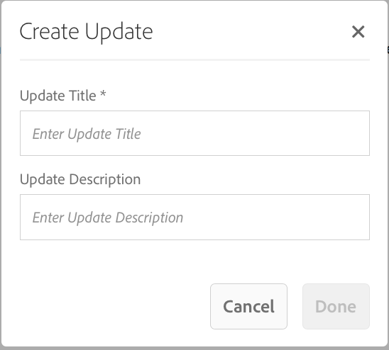

# Criação e gerenciamento de conteúdo do aplicativo{#creating-and-managing-app-content}

>[!NOTE]
>
>A Adobe recomenda usar o Editor SPA para projetos que exigem renderização do lado do cliente baseada em estrutura de aplicativo de página única (por exemplo, Reagir). [Saiba mais](/help/sites-developing/spa-overview.md).

O gerenciamento de conteúdo do aplicativo requer um esforço coletivo de [desenvolvedores](#developer), [autores](#author) de conteúdo e [administradores](#administrator). Os autores manipulam as páginas, que por sua vez são baseadas em modelos e componentes gerados pelos desenvolvedores do aplicativo.

Finalmente, os administradores publicam estrategicamente o conteúdo atualizado do aplicativo.

>[!NOTE]
>
>**Pré-requisitos**:
>
>Na [implantação e manutenção](/help/sites-deploying/deploy.md), os desenvolvedores se familiarizaram com o sistema de componentes e modelos do AEM.

## O bloco Gerenciar conteúdo da página {#the-manage-page-content-tile}

>[!CAUTION]
>
>Se você não estiver usando um modelo de aplicativo predefinido, para permitir que o novo conteúdo do aplicativo seja publicado no OTA, é necessário configurar um manipulador de Sincronização de conteúdo.
>
>Consulte [Mobile with Content Sync](/help/mobile/phonegap-contentsync.md) na seção do desenvolvedor para obter mais detalhes.

Aqui, o conteúdo pode ser criado, editado e excluído no AEM Mobile da mesma forma que você faria no AEM Sites.

O bloco **** Gerenciar conteúdo da página exibe o número de páginas do conteúdo gerenciado e a última modificação para uma carga específica. É possível detalhar o conteúdo para criar, copiar, mover, excluir e atualizar páginas clicando em cada registro no bloco.

Depois que o conteúdo é atualizado, os administradores podem publicar uma carga de atualização de conteúdo no ar (OTA) para clientes por meio do bloco **Gerenciar pacotes de conteúdo.**

Selecione um dos pacotes de conteúdo listados para criar ou editar conteúdo, como criar, editar ou remover páginas, alterar a navegação e a ordem da página, criar ou atualizar conteúdo, como copiar (texto) e mídia.

Observe que *tudo é conteúdo*, ou seja, estilos de aplicativo, copiar (texto), mídia, páginas, navegação e direcionamento de conteúdo podem ser todos editados e atualizados no OTA, sem uma viagem a uma loja de aplicativos.

Para editar o conteúdo do AEM Mobile, *os autores do AEM *precisarão de uma sólida compreensão da interface de edição de conteúdo do AEM: Páginas de [criação no AEM.](/help/sites-authoring/qg-page-authoring.md)

## O bloco Gerenciar pacotes de conteúdo {#the-manage-content-packages-tile}

Aqui, os administradores *do* AEM podem atualizar rápida e facilmente seus aplicativos para fornecer experiências envolventes e conteúdo atualizado para impulsionar o envolvimento da marca e atingir objetivos de negócios, tudo isso sem a necessidade de uma nova solicitação de desenvolvedor ou loja de aplicativos.

Depois que os autores *do* AEM adicionarem ou modificarem o conteúdo por meio do bloco Gerenciar conteúdo, os administradores *do* AEM poderão encaminhar essas alterações para clientes com uma atualização de pacotes de conteúdo.

A ação Pacote de conteúdo permite que o autor *do* AEM crie e edite o conteúdo da página enquanto a equipe de desenvolvimento altera o design e a implementação de um aplicativo host, incluindo navegação, estilo, lógica do lado do servidor, modelos e componentes, e então envia essas alterações para os clientes sem precisar reenviar para as várias lojas para distribuição.

**Para publicar conteúdo novo ou atualizado**

Selecione um pacote de conteúdo do bloco, neste exemplo, o pacote em inglês. Observe que uma caixa de diálogo de atualização de conteúdo lista a configuração relevante da *Sincronização* de conteúdo. Se o conteúdo do aplicativo tiver sido modificado desde uma atualização anterior, o status será exibido *Pendente*, como mostrado abaixo.

Em seguida, selecione a ação **Stage** na parte superior direita para criar a nova atualização de conteúdo. Adicione as informações de atualização apropriadas e pressione Concluído.

O manipulador de sincronização *de* conteúdo cria os pacotes necessários formando um delta (um pacote que *só* altera). Depois de concluído, este pacote de conteúdo de atualização foi preparado conforme mostrado abaixo.

O armazenamento temporário de uma atualização no conteúdo permite que várias atualizações sejam feitas antes de serem publicadas na OTA para dispositivos móveis.

>[!NOTE]
>
>O conteúdo preparado pode ser verificado usando o aplicativo AEM Verify antes da publicação.
>
>Consulte Início rápido [móvel para verificação](/help/mobile/phonegap-mobile-quickstart.md) do AEM para obter mais detalhes sobre o aplicativo AEM Verify.

Quando estiver pronto para fornecer novo conteúdo para os usuários do aplicativo com Content Sync OTA, selecione **Publicar** como mostrado abaixo.

### Próximas etapas {#the-next-steps}

Depois de saber mais sobre Criar e gerenciar conteúdo do aplicativo no painel do aplicativo, consulte os seguintes recursos para outras funções de criação:

* [O bloco Gerenciar aplicativo](/help/mobile/phonegap-app-details-tile.md)
* [Editar metadados do aplicativo](/help/mobile/phonegap-editmetadata.md)
* [Definições do aplicativo](/help/mobile/phonegap-app-definitions.md)
* [Criar um novo aplicativo usando o Assistente para criação de aplicativo](/help/mobile/phonegap-create-new-app.md)
* [Importar um aplicativo híbrido existente](/help/mobile/phonegap-adding-content-to-imported-app.md)

### Additional Resources {#additional-resources}

Para saber mais sobre as funções e responsabilidades de um Administrador e Desenvolvedor, consulte os recursos abaixo:

* [Desenvolvimento para Adobe PhoneGap Enterprise com AEM](/help/mobile/developing-in-phonegap.md)
* [Administração de conteúdo para Adobe PhoneGap Enterprise com AEM](/help/mobile/administer-phonegap.md)
