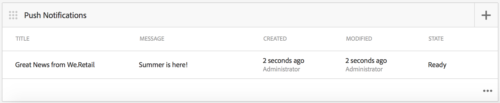

# Notificações push{#push-notifications}

>[!NOTE]
>
>A Adobe recomenda o uso do Editor de SPA para projetos que exigem renderização do cliente baseada em estrutura de aplicativo de página única (por exemplo, Reagir). [Saiba mais](/help/sites-developing/spa-overview.md).

Ser capaz de alertar instantaneamente os usuários do aplicativo AEM Mobile com notificações importantes é fundamental para o valor de um aplicativo móvel e suas campanhas de marketing. Aqui, descrevemos as etapas que precisam ser seguidas para permitir que seu aplicativo receba notificações por push e como configurar e enviar permissões da AEM Mobile para o aplicativo instalado no telefone. Além disso, esta seção descreve como configurar o recurso [Deep Linking](#deeplinking) para suas notificações por push.

>[!NOTE]
>
>*As notificações por push não garantem o delivery; eles são mais como anúncios. É feito o melhor para garantir que todos os cidadãos os recebam, mas não se trata de um mecanismo de delivery garantido. Além disso, o tempo para enviar um push pode variar de menos de um segundo a até meia hora.*

O uso de notificações por push com AEM requer algumas tecnologias diferentes. Primeiro, um provedor de serviço de notificação por push deve ser usado para gerenciar notificações e dispositivos (AEM ainda não faz isso). Dois provedores são configurados prontos para uso com AEM: [Serviço de Notificação Simples da Amazon](https://aws.amazon.com/sns/) (ou SNS) e [Pushwoosh](https://www.pushwoosh.com/). Em segundo lugar, a tecnologia push para o SO móvel em questão deve passar pelo serviço apropriado. Serviço de notificação por push (ou APNS) da Apple para dispositivos iOS; e Google Cloud Messaging (ou GCM) para dispositivos Android. Embora AEM não se comunique diretamente com esses serviços específicos da plataforma, algumas informações de configuração relacionadas devem ser fornecidas por AEM juntamente com as notificações para que esses serviços executem o push.

Depois de instalado e configurado (conforme explicado abaixo), ele funciona assim:

1. Uma notificação por push é criada no AEM e enviada ao provedor de serviço (Amazon SNS ou Pushwoosh).
1. O provedor de serviço o recebe e o envia para o provedor principal (APNS ou GCM).
1. O provedor principal envia a notificação para todos os dispositivos registrados para esse push. Para cada dispositivo, ele usa a rede de dados celulares ou WiFi, o que estiver disponível no momento no dispositivo.
1. A notificação é exibida no dispositivo se o aplicativo para o qual está registrado não estiver sendo executado. Um usuário que toca na notificação start o aplicativo e exibe a notificação no aplicativo. Caso o aplicativo já esteja em execução, somente a notificação no aplicativo será exibida.

Esta versão do AEM é compatível com dispositivos móveis iOS e Android.

## Visão geral e procedimento {#overview-and-procedure}

Para usar notificações por push em um aplicativo AEM Mobile, as seguintes etapas de alto nível devem ser realizadas.

Normalmente, um desenvolvedor AEM:

1. Registrar-se nos serviços de mensagens da Apple e do Google
1. Registre-se com um serviço de mensagens de push e configure-o
1. Adicionar suporte por push ao aplicativo
1. Preparar um telefone para teste

Enquanto um administrador AEM:

1. Configurar push em aplicativos AEM
1. Criar e implantar o aplicativo
1. Enviar uma notificação por push
1. Configurar deep linking *(opcional)*

### Etapa 1: Registre-se nos serviços de mensagens da Apple e do Google {#step-register-with-apple-and-google-messaging-services}

#### Usando o Serviço de notificação por push da Apple (APNS) {#using-the-apple-push-notification-service-apns}

Vá para a página da Apple [here](https://developer.apple.com/library/ios/documentation/NetworkingInternet/Conceptual/RemoteNotificationsPG/Chapters/ApplePushService.html) para se familiarizar com o Serviço de notificação por push da Apple.

Para usar o APNS, você precisará de um arquivo **Certificate** (um arquivo .cer), uma **Chave privada** (um arquivo .p12) e uma **Senha da chave privada** da Apple. As instruções sobre como fazer isso podem ser encontradas [aqui](https://developer.apple.com/library/ios/documentation/NetworkingInternet/Conceptual/RemoteNotificationsPG/Chapters/ProvisioningDevelopment.html).

#### Usando o serviço GCM (Google Cloud Messaging) {#using-the-google-cloud-messaging-gcm-service}

>[!NOTE]
>
>O Google está substituindo o GCM por um serviço semelhante chamado Firebase Cloud Messaging (FCM). Para obter mais informações sobre o FCM, clique [aqui](https://developers.google.com/cloud-messaging/faq).

Vá para a página do Google [here](https://developer.android.com/google/gcm/index.html) para se familiarizar com o Google Cloud Messaging for Android.

Você precisará seguir as etapas [here](https://developer.android.com/google/gcm/gs.html) para **Criar um projeto de API do Google**, **Ativar o Serviço GCM** e **Obter uma chave de API**. Você precisará da **chave da API** para enviar notificações por push para dispositivos Android. Além disso, registre seu **Número do projeto**, que também é chamado às vezes de **Id do remetente do GCM**.

As etapas a seguir mostram um método diferente de criação de chaves de API GCM:

1. Faça logon no google e vá para a [página do Desenvolvedor do Google](https://developers.google.com/mobile/add?platform=android&amp;cntapi=gcm).
1. Escolha seu aplicativo na lista (ou crie um novo).
1. Em Nome do pacote do Android, insira a ID do aplicativo, ou seja, `com.adobe.cq.mobile.weretail.outdoorsapp`. (Se isso não funcionar, tente novamente com &quot;test.test&quot;.)
1. Clique em **Continuar a escolher e configurar serviços**
1. Selecione Cloud Messaging e clique em **Ativar Google Cloud Messaging**.
1. A nova Chave API do servidor e a (nova ou existente) ID do remetente serão exibidas.

>[!NOTE]
>
>Registre a Server API Key. Esse valor é inserido no site do provedor de push.

### Etapa 2: Registrar e configurar um serviço de mensagens de push {#step-register-and-configure-a-push-messaging-service}

AEM está configurado para usar um dos três serviços para notificações por push:

* Amazon SNS
* Pushwoosh
* Adobe Mobile Services

*As configurações Amazon* SNSe  ** Pushwooshirão permitir que você envie mensagens enviadas de dentro AEM telas.

*A configuração* do Adobe Mobile Services permite configurar e enviar notificações por push do Adobe Mobile Services usando uma conta Adobe Analytics (mas o aplicativo precisa ser criado com esse conjunto de configurações para habilitar notificações por push do AMS).

#### Usando o serviço de mensagens SNS da Amazon {#using-the-amazon-sns-messaging-service}

>[!NOTE]
>
>*Informações sobre o Amazon SNS e um link para criar uma nova conta AWS podem ser encontradas  [aqui](https://aws.amazon.com/sns/). Você pode obter uma conta gratuita por um ano.*

Se você não quiser usar o Amazon SNS, ignore essas etapas.

Siga estas etapas para configurar o Amazon SNS para notificações por push:

1. **Registrar-se no Amazon SNS**

   1. Registre sua ID de conta. O formato deve ter doze dígitos sem espaços ou traços, ou seja, &quot;123456789012&quot;.
   1. Certifique-se de estar na região &quot;us-East&quot; ou &quot;eu&quot;, como uma etapa posterior (Criação de pool de identidade) requer uma dessas.
   1. Depois de se registrar, faça logon no console de gerenciamento e selecione [SNS](https://console.aws.amazon.com/sns/) (Serviço de notificação por push). Clique em &quot;Introdução&quot; se for exibido.

1. **Criar chave de acesso e ID**

   1. Clique no nome de logon no canto superior direito da tela e escolha Credenciais de segurança no menu.
   1. Clique em Teclas de acesso e, no espaço abaixo, clique em **Criar nova chave de acesso**.
   1. Clique em **Mostrar chave de acesso** e copie e salve a ID da chave de acesso e a chave de acesso secreta mostradas. Se você escolher a opção para baixar as teclas, você obterá um arquivo csv que contém esses mesmos valores.
   1. Outros certificados relacionados à segurança, entre outros, podem ser gerenciados nesta página.

   >[!NOTE]
   >
   >Uma Chave de acesso pode ser usada para vários aplicativos.

   Para organizações que usam uma conta &quot;AWS Sandbox&quot;, as etapas são muito semelhantes e descritas aqui:

   1. Clique no nome de logon no canto superior direito da tela e escolha Minhas credenciais de segurança no menu.
   1. Clique em Usuários na lista esquerda de ações e escolha seu nome de usuário.
   1. Clique na guia Credenciais de segurança.
   1. Aqui você vê suas chaves e cria novas chaves. Salve as teclas para uso posterior.

1. **Criar um tópico**

   1. Clique em **Criar tópico** e escolha um nome de tópico. Registre todos os campos como Topic ARN (Tópico ARN), Topic Owner (Proprietário do tópico), Region (Região) e Display name (Nome de exibição).
   1. Clique em **Outras ações de tópico** > **Editar política de tópicos**. Em **Permitir que esses usuários se inscrevam neste tópico**, selecione **Todos.**
   1. Clique em **Atualizar Política**.

   >[!NOTE]
   >
   >Você pode criar vários tópicos para diferentes cenários, como desenvolvimento, teste, demonstração e assim por diante. O restante da configuração SNS pode permanecer o mesmo. Crie o aplicativo com um tópico diferente; as notificações por push enviadas para esse tópico serão recebidas somente pelo aplicativo criado com esse tópico.

1. **Criar aplicativos da plataforma**

   1. Clique em Aplicativos e, em seguida, em Criar aplicativo da plataforma. Escolha um nome e selecione uma plataforma (APNS para iOS, GCM para Android). Dependendo da plataforma, outros campos precisarão ser preenchidos:

      1. Para o APNS, um arquivo P12, uma senha, um certificado e uma chave privada devem ser inseridos. Eles devem ter sido obtidos na etapa *Usando o Apple Push Notification Service (APNS)* acima.
      1. Para o GCM, uma chave de API deve ser inserida. Isso deve ter sido obtido na etapa *Usar o serviço GCM (Google Cloud Messaging)* acima.
   1. Repita a etapa acima uma vez para cada plataforma compatível. Para poder enviar para iOS e Android, dois aplicativos de plataforma devem ser criados.

1. **Criar um pool de identidade**

   1. Use [Cognito](https://console.aws.amazon.com/cognito) para criar um Pool de Identidades, que armazenará dados básicos de usuários não autenticados. Observe que, neste momento, somente as regiões &quot;us-East&quot; e &quot;eu&quot; são suportadas pelo Amazon Cognito.
   1. Dê um nome a ele e marque a caixa &quot;Ativar acesso a identidades não autenticadas&quot;.
   1. Na próxima página (&quot;*Suas identidades Cognito requerem acesso aos seus recursos*&quot;), clique em Permitir.
   1. No canto superior direito da página, clique no link &quot;*Editar pool de identidade&quot;*. A ID do pool de identidade é exibida. Salve este texto para mais tarde.
   1. Na mesma página, escolha a lista suspensa ao lado de &quot;Função não autenticada&quot; e verifique se ela tem a função Cognito_&lt;nome do pool>UnauthRole selecionada. Salve as alterações.

1. **Configurar acesso**

   1. Faça logon em [Gerenciamento de identidade e acesso](https://console.aws.amazon.com/iam/home) (IAM)
   1. Selecionar funções
   1. Clique na função criada na etapa anterior, chamada Cognito_&lt;yourIdentityPoolName>Unauth_Role. Registre a mensagem &quot;Role ARN&quot; exibida.
   1. Abra &quot;Políticas embutidas&quot; se ainda não estiver aberto. Você deve ver uma política com um nome como oneClick_Cognito_&lt;yourIdentityPoolName>Unauth_Role_1234567890123.
   1. Clique em &quot;Editar política&quot;. Substitua o conteúdo do Documento de Política por este snippet do JSON:

   <table>
    <tbody>
     <tr>
     <td>
 
 
{
 
 "Versão": "2012-10-17",
 
 "Declaração": [
 
 {
 
 "Ação": [
 
 "mobileanalytics:PutEvents",
 
 "cognito-sync:*",
 
 "SNS:CreatePlatformEndpoint",
 
 "SNS:Assinar"
 
 ],
 
 "Efeito": "Permitir",
 
 "Recurso": [
 
 "*"
 
 ]
 
 }
 
 ]
 
}
 
 
 </td>
     </tr>
    </tbody>
    </table>

   1. Clique em **Aplicar Política**

#### Usando o serviço de mensagens Pushwoosh {#using-the-pushwoosh-messaging-service}

Se não quiser usar o Pushwoosh, ignore esta etapa.

Para utilizar Pushwoosh:

1. **Registrar-se em Pushwoosh**

   1. Vá para pushwoosh.com e crie uma nova conta.

1. **Criar um Token de acesso de API**

   1. No site Pushwoosh, vá para o item de menu Acesso à API para gerar um Token de acesso da API. Você precisará gravar isso com segurança.

1. **Criar um novo aplicativo**

   1. Para suporte ao Android, é necessário fornecer sua chave de API do GCM.
   1. Ao configurar o aplicativo, escolha Cordova como a estrutura.
   1. Para suporte ao iOS, é necessário fornecer o arquivo de Certificado (.cer), o Certificado de push (.p12) e a senha da chave privada; eles devem ter sido obtidos no site APNS da Apple. Para Framework, escolha Cordova.
   1. O Pushwoosh gerará uma ID de aplicativo para esse aplicativo, no formato &quot;XXXXX-XXXXX&quot;, onde cada X é um valor hexadecimal (0 a F).

>[!NOTE]
>
>*Se um segundo aplicativo estiver configurado em AEM com a mesma ID do aplicativo (e outros valores relacionados): TOKEN DE ACESSO da API e ID do GCM), todas as notificações por push enviadas pelo segundo aplicativo no AEM serão enviadas para qualquer outro aplicativo com essa ID do aplicativo.*

### Etapa 3: Adicionar suporte por push ao aplicativo {#step-add-push-support-to-the-app}

#### Adicionar configuração do ContentSync {#add-contentsync-configuration}

Crie dois nós de conteúdo (um em app-config e outro em app-config-dev) chamados notificationsConfig:

* /content/`<your app>`/shell/jcr:content/pge-app/app-config-dev/notificationsConfig
* /content/`<your app>`/shell/jcr:content/pge-app/app-config/notificationsConfig

Com essas propriedades (arquivos .content.xml):
&lt;jcr:root xmlns:jcr=&quot; [https://www.jcp.org/jcr/1.0](https://www.jcp.org/jcr/1.0)&quot; xmlns:nt=&quot; [https://www.jcp.org/jcr/nt/1.0](https://www.jcp.org/jcr/nt/1.0)&quot;
jcr:PrimaryType=&quot;nt:unstructure&quot;
excludeProperties=&quot;[appAPIAccessToken]&quot;
path=&quot;../../.../...&quot;
targetRootDirectory=&quot;www&quot;
type=&quot;notificationssconfig&quot;/>

>[!NOTE]
>
>O manipulador de sincronização de conteúdo procura esses nós e, se eles não estiverem lá, ele não grava o arquivo pge-notifications-config.json.

#### Adicionar bibliotecas de clientes {#add-client-libraries}

As bibliotecas de cliente de notificação por push devem ser adicionadas ao aplicativo seguindo estas etapas:

No CRXDE Lite:

1. Navegue até */etc/designs/phonegap/&lt;nome do aplicativo>/clientlibsall.*
1. Clique no duplo na seção incorporada no painel de propriedades.
1. Na caixa de diálogo exibida, adicione uma nova biblioteca de cliente clicando no botão +.
1. No novo campo de texto, adicione &quot;cq.mobile.push&quot; e clique em OK.
1. Adicione mais um chamado cq.mobile.push.amazon e clique em OK.
1. Salve as alterações.

>[!NOTE]
>
>Se as notificações por push forem removidas ou não forem usadas, por questões de espaço no aplicativo e para evitar mensagens de erro do console, remova essas clientlibs do aplicativo.

### Etapa 4: Preparar um telefone para testar {#step-prepare-a-phone-for-testing}

>[!NOTE]
>
>*Para notificações por push, é necessário testar em um dispositivo real, pois os emuladores não podem receber notificações por push.*

#### IOS {#ios}

Para iOS, você precisará usar um computador Mac OS e precisará ingressar no [Programa de desenvolvedor iOS](https://developer.apple.com/programs/ios/). Algumas empresas possuem licenças corporativas que podem estar disponíveis para todos os desenvolvedores.

Com o XCode 8.1, antes de usar as Notificações por push, você deve ir para a guia Recursos do projeto e ativar as Notificações por push.

#### Android {#android}

Para instalar o aplicativo em um telefone Android usando a CLI (consulte abaixo: **Etapa 6 - Crie e implante o aplicativo**), primeiro coloque o telefone em &quot;modo desenvolvedor&quot;. Consulte [Ativando as opções de desenvolvedor no dispositivo](https://developer.android.com/tools/device.html#developer-device-options) para obter detalhes sobre como fazer isso.

### Etapa 5: Configurar push em aplicativos AEM {#step-configure-push-on-aem-apps}

Antes de criar e implantar em seu dispositivo móvel configurado, é necessário definir as configurações de notificação para o serviço de mensagens que você decidiu usar.

1. Crie os grupos de autorização apropriados para notificações por push.
1. Faça logon para AEM como o usuário apropriado, clique na guia Aplicativos.
1. Clique no aplicativo.
1. Localize o bloco Gerenciar Cloud Services e clique no lápis para modificar as configurações da nuvem.
1. Selecione Amazon SNS Connection, Pushwoosh Connection ou Adobe Mobile Services como a configuração de notificação.
1. Insira as propriedades do provedor e clique em Enviar para salvá-las e em Concluído. Não são verificados remotamente nesta fase, exceto no caso do AMS.
1. Agora você deve ver a configuração que acabou de inserir no bloco Gerenciar Cloud Services.

### Etapa 6: Crie e implante o aplicativo {#step-build-and-deploy-the-app}

**Observação:** consulte também nossas instruções   aqui sobre como criar aplicativos PhoneGap.

Há duas maneiras de criar e implantar seu aplicativo usando o PhoneGap.

**Observação:** para testes de notificação por push, os emuladores não serão suficientes porque as notificações por push usam um protocolo diferente entre o provedor de push (Apple ou Google) e o dispositivo. O hardware e os emuladores atuais do Mac/PC não suportam isso.

1. *O PhoneGap* Builder é um serviço oferecido pelo PhoneGap que criará seu aplicativo para você em seus servidores e permitirá que você baixe-o diretamente no seu dispositivo. Consulte a [documentação do PhoneGap Build](https://build.phonegap.com/) para saber como configurar e usar o PhoneGap Build.

1. *A CLI (Command Line Interface* ) do PhoneGap permite que você use um conjunto avançado de comandos PhoneGap na linha de comando para criar, depurar e implantar seu aplicativo. Consulte a [documentação do desenvolvedor do PhoneGap](https://docs.phonegap.com/en/edge/guide_cli_index.md.html#The%20Command-Line%20Interface) para saber como configurar e usar a CLI do PhoneGap.

### Etapa 7: Enviar uma notificação por push {#step-send-a-push-notification}

Para criar uma nova notificação e enviá-la, siga estas etapas.

1. Criar uma nova notificação

   * No painel do aplicativo AEM Mobile, localize o bloco Notificações por push.
   * No menu no canto superior direito, escolha &quot;Criar&quot;. Observe que esse botão não estará disponível até que a configuração da nuvem seja definida pela primeira vez.
   * No Assistente para criação de notificações, insira um título e uma mensagem e clique no botão &quot;Criar&quot;. Sua notificação agora está pronta para ser enviada imediatamente ou posteriormente. Pode ser editado e a mensagem e/ou o título podem ser alterados e salvos.

1. Enviar a notificação

   * No painel Aplicativos, localize o bloco Notificações por push.
   * Selecione a notificação ou clique no botão de detalhes na parte inferior direita (. . .), para mostrar a lista das notificações. Essa lista também indica se uma notificação está pronta para ser enviada, já foi enviada ou se ocorreu um erro durante o envio.
   * Marque a caixa de seleção de uma notificação (somente) e clique no botão &quot;Enviar notificação&quot; acima da lista. Você terá uma chance de &quot;Cancelar&quot; ou &quot;Enviar&quot; a notificação na caixa de diálogo exibida.

1. Tratamento dos resultados

   * Se o serviço de notificação por push (Amazon SNS ou Pushwoosh) receber a solicitação Enviar, confirmá-la como válida e enviá-la aos provedores nativos (APNS e GCM) com êxito, a caixa de diálogo Enviar será fechada sem nenhuma mensagem. Na lista de notificação, o status dessa notificação será listado como Enviado.
   * Se o envio por push falhar, a caixa de diálogo mostrará uma mensagem indicando o problema. Na lista de notificação, o status dessa notificação será listado como Erro, mas se o problema for corrigido, a notificação poderá ser enviada novamente. No evento de um erro, informações adicionais de erro devem aparecer no log de erros do servidor.
   * Observe que há algumas diferenças de plataforma entre as notificações por push do iOS e do Android. Entre eles:

      * Construir com a CLI start o aplicativo depois que ele for implantado no Android. No iOS, é necessário start-lo manualmente. Como a etapa de registro por push acontece na inicialização, os aplicativos Android podem receber notificações por push imediatamente (já que ela será iniciada e registrada) enquanto os aplicativos iOS não receberão.
      * No Android, o texto do botão OK está em todas as letras maiúsculas (e em qualquer outro botão adicionado na notificação no aplicativo), enquanto no iOS não está.

Para notificações por push do AMS, as notificações devem ser compostas e enviadas pelo servidor AMS. O AMS fornece recursos adicionais de notificação por push além daqueles fornecidos por notificações AEM com AWS e Pushwoosh.

>[!NOTE]
>
>*As notificações por push não garantem o delivery; eles são mais como anúncios. É feito um melhor esforço para assegurar que todos ouçam, mas não se trata de um mecanismo de delivery garantido. Além disso, o tempo para enviar um push pode variar de menos de um segundo a até meia hora.*

### Configuração de deep links com notificações por push {#configuring-deep-linking-with-push-notifications}

O que é Deep Linking? No contexto de uma notificação por push, é um meio de permitir que um aplicativo seja aberto ou direcionado (se aberto) para um local especificado dentro do aplicativo.

Como funciona? O autor de uma notificação por push adiciona opcionalmente um rótulo de botão (isto é, &quot;Mostre-me!&quot;) à notificação e escolhe a página que deseja vincular na notificação, por meio de um navegador de caminho visual. Quando enviado, o push ocorre normalmente, exceto que na mensagem no aplicativo, o botão OK é substituído por um botão &quot;Dismiss&quot; e o novo botão especificado (&quot;Show me!&quot;) também é exibido. Clicar no novo botão fará com que o aplicativo vá para a página especificada dentro do aplicativo. Clicar em Dismiss o apenas ignorará a mensagem.

Se o aplicativo não estiver aberto, a sombra aparecerá normalmente. Tomar uma ação na notificação à sombra abrirá o aplicativo e apresentará ao usuário os botões de deep link com base no que foi configurado na notificação por push.

Crie a notificação, adicione um texto de botão e um caminho de link para o deep link opcional:

>[!CAUTION]
>
>.Para acessar o bloco Notificação por push no seu painel, siga as etapas abaixo.

1. Clique na edição no canto superior direito do bloco **Gerenciar Cloud Services**.

   

1. Selecione **Ligação Pushwoosh**. Clique em **Avançar**.

   

1. Insira os detalhes das propriedades e clique em **Enviar**.

   

   Quando você enviar sua configuração, o bloco **Notificações por push** será exibido no painel.

   

### Criar assistente de notificação {#create-notification-wizard}

Quando o bloco **Notificações por push** for exibido no seu painel, use o assistente de criação de notificação para adicionar o conteúdo:

1. Clique no símbolo de adição no canto superior direito do bloco **Notificações por push** para abrir o **Assistente de criação de notificação**.

   

1. Clicar no ícone Procurar no caminho do link apresenta ao usuário a estrutura de conteúdo do aplicativo.

   Depois de selecionar o caminho, clique no ícone de seleção.

   

   >[!NOTE]
   >
   >O Texto do botão Link é limitado a 20 caracteres.
   >
   >Se o usuário final não tiver a versão mais recente do aplicativo e o caminho vinculado não estiver disponível, confirmar a ação do deep link levará o usuário para a página principal do aplicativo.

1. Digite **Detalhes do Texto** no **Assistente para Criar Notificação** e clique em **Criar**.

   

   Abra os detalhes clicando na notificação por push que você criou no bloco **Notificações por push**.

   É possível editar propriedades, enviar notificações ou excluir a notificação.

   

>[!NOTE]
>
>**Informações adicionais**:
>
>O Pushwoosh e o Amazon SNS não serão suportados após a versão 6.4 e estarão disponíveis como um complemento do compartilhamento de pacote.

### Próximas etapas {#the-next-steps}

Depois de compreender os detalhes das notificações por push do aplicativo, consulte [AEM Mobile Content Personalization](/help/mobile/phonegap-aem-mobile-content-personalization.md).

