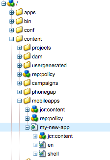

# Estruturar um aplicativo{#structure-an-app}

>[!NOTE]
>
>A Adobe recomenda o uso do Editor SPA para projetos que exigem renderização no lado do cliente baseada em estrutura de aplicativo de página única (por exemplo, React). [Saiba mais](/help/sites-developing/spa-overview.md).

Um projeto do AEM Mobile envolve um conjunto diverso de tipos de conteúdo, incluindo páginas, bibliotecas de clientes JavaScript e CSS, componentes AEM reutilizáveis, configurações de sincronização de conteúdo e conteúdo do shell do aplicativo PhoneGap. Basear seu novo aplicativo AEM Mobile no [Starter Kit](https://github.com/Adobe-Marketing-Cloud-Apps/aem-phonegap-starter-kit) O é uma boa maneira de incluir todos os diferentes tipos de conteúdo em nossa estrutura recomendada para facilitar a portabilidade e a manutenção a longo prazo.

## Conteúdo da página {#page-content}

As páginas do aplicativo devem estar localizadas abaixo de /content/mobileapps para serem reconhecidas pelo console do AEM Mobile.

Por convenção do AEM, a primeira página do aplicativo deve ser um redirecionamento para um de seus filhos que serve como idioma padrão do aplicativo (&quot;en&quot; nos casos de Geometrixx e Starter Kit). A página de local de nível superior normalmente herda do componente &quot;página inicial&quot; da base (/libs/mobileapps/components/splash-page) que cuida da inicialização necessária para oferecer suporte à instalação de atualizações de sincronização de conteúdo ao ar livre (o código contentInit pode ser encontrado em /etc/clientlibs/mobile/content-sync/js/contentInit.js).

## Modelos e componentes {#templates-and-components}

O modelo e o código do componente para seu aplicativo devem estar em /apps/&lt;brand name=&quot;&quot;>/&lt;app name=&quot;&quot;>. De acordo com a convenção, você deve colocar seu modelo e código de componente em /apps/&lt;brand name=&quot;&quot;>/&lt;app name=&quot;&quot;>. Esse padrão deve ser familiar aos desenvolvedores que já trabalharam com o Site no AEM. Normalmente, é seguido como /apps/ e bloqueado para acesso anônimo por padrão em instâncias de publicação. Assim, seu código JSP bruto está oculto de possíveis invasores.

Os modelos específicos do aplicativo podem ser configurados para serem apresentados somente usando o `allowedPaths` nó de propriedade no próprio modelo e definindo seu valor como &#39;/content/mobileapps(/.&amp;ast;)?&#39; - ou até mesmo algo mais específico se o modelo só puder ser usado para um único aplicativo. A variável `allowedParents` e `allowedChildren` as propriedades também podem ser usadas para controle refinado de quais modelos estão disponíveis para um autor com base no local em que a nova página está sendo criada.

Ao criar um componente da página de aplicativo do zero, é recomendável definir suas `sling:resourceSuperType` para &#39;mobileapps/components/angular/ng-page&#39;. Isso configura a página para criação e renderização como um aplicativo de página única e permite que você sobreponha quaisquer arquivos .jsp que o componente possa precisar alterar. Como a ng-página não inclui nenhuma estrutura de interface do usuário, um desenvolvedor geralmente acaba sobrepondo (pelo menos) &#39;template.jsp&#39; (sobreposto de /libs/mobileapps/components/angular/ng-page/template.jsp).

Os componentes de página autoráveis, que desejam usar o AngularJS, têm um `sling:resourceSuperType` componente em /libs/mobileapps/components/angular/ng-component que pode ser sobreposto e personalizado da mesma maneira.

## Clientlibs JavaScript e CSS {#javascript-and-css-clientlibs}

Nas bibliotecas de clientes, há algumas opções disponíveis para o desenvolvedor de onde colocá-las no repositório. O seguinte padrão é oferecido para orientação, mas não é um requisito difícil.

Se o código do lado do cliente puder ser usado sozinho e não estiver relacionado a um componente específico do aplicativo (o que significa que ele pode ser reutilizado em outros aplicativos), o Adobe recomenda armazená-lo em /etc/clientlibs/&lt;brand name=&quot;&quot;>/&lt;lib name=&quot;&quot;>. Por outro lado, se clientlib for específico para um único aplicativo, você poderá aninhá-lo como filho do nó de design do seu aplicativo; /etc/designs/phonegap/&lt;brand name=&quot;&quot;>/&lt;app name=&quot;&quot;>/clientlibs. Não use a categoria desta clientlib com outras bibliotecas; em vez disso, incorpore outras bibliotecas conforme necessário. Seguir esse padrão evita que o desenvolvedor tenha que adicionar novas configurações de sincronização de conteúdo sempre que uma biblioteca do cliente for adicionada ao aplicativo. Em vez disso, basta atualizar a propriedade &quot;embeds&quot; da clientlib de design do aplicativo. Por exemplo, verifique o nó de configuração da sincronização de conteúdo Geometrixx clientlibs-all em /content/phonegap/geometrixx-outdoors/en/jcr:content/page-app/app-config/clientlibs-all.

Se o código do lado do cliente estiver totalmente acoplado a um componente específico, coloque-o em uma biblioteca do cliente aninhada abaixo do local do componente em /apps/ e incorpore a categoria à clientlib &quot;design&quot; do aplicativo.

## Configuração do PhoneGap {#phonegap-configuration}

Cada aplicativo AEM Mobile contém um diretório que hospeda os arquivos de configuração usados pelo PhoneGap [interface de linha de comando](https://github.com/phonegap/phonegap-cli) e PhoneGap build em `https://build.phonegap.com/` para transformar seu conteúdo da web em um aplicativo executável. Na amostra do Geometrixx, por exemplo, esse diretório (/content/phonegap/geometrixx-outdoors/shell/jcr:content/page-app/app-content) está localizado como parte do Shell; uma decisão de design foi tomada porque ele contém apenas conteúdo que não pode ser atualizado ao ar, como plug-ins que lidam com APIs de dispositivo e a configuração do próprio aplicativo.

Nesse diretório, você também encontrará alguns [Ganchos Cordova](https://cordova.apache.org/docs/en/dev/guide/appdev/hooks/index.html#Hooks%20Guide) que pode ser usado para instalar plug-ins, colocar arquivos de recurso em seus locais específicos da plataforma e outras ações que devem ser executadas como parte da build. Observação: como alternativa ao download de cada plug-in como parte da criação, você pode seguir o padrão do aplicativo Coletor de cozinha e incluir o código-fonte do plug-in<!-- THIS URL IS 404 (https://github.com/blefebvre/aem-phonegap-kitchen-sink/tree/master/content/src/main/content/jcr_root/content/phonegap/kitchen-sink/shell/_jcr_content/pge-app/app-content/phonegap/plugins) --> com o restante do projeto de aplicativo.

## Próximas etapas {#the-next-steps}

Depois de saber mais sobre a estrutura do aplicativo, consulte [Criação e edição de aplicativos usando o console de aplicativos](/help/mobile/phonegap-apps-console.md).
