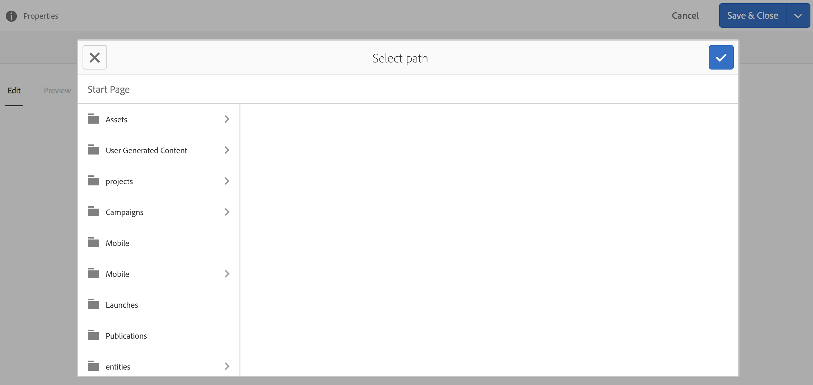

# Espaços e Entidades{#spaces-and-entities}

>[!NOTE]
>
>A Adobe recomenda o uso do Editor de SPA para projetos que exigem renderização do cliente baseada em estrutura de aplicativo de página única (por exemplo, Reagir). [Saiba mais](/help/sites-developing/spa-overview.md).

Um Espaço é um local conveniente para armazenar entidades expostas por meio da Content Services REST API. Isso é especialmente útil porque um aplicativo (ou qualquer canal) pode ser associado a várias entidades. Forçar as Entidades a estarem dentro de um Espaço força a prática recomendada de agrupar os requisitos de um aplicativo. Como opção, você pode associar um aplicativo em AEM a um pequeno número de Espaços.

>[!NOTE]
>
>Para disponibilizar algo para qualquer canal do Content Services, é necessário que ele esteja em um espaço.

## Criação de um espaço {#creating-a-space}

Se o usuário quiser expor um monte de conteúdo e ativos a um aplicativo móvel, o usuário cria o espaço usando o painel AEM Mobile.

Pela primeira vez, o usuário que não configurou os serviços de conteúdo para trabalhar com espaços, o painel AEM Mobile exibe somente os Aplicativos depois de selecionar **Serviços de conteúdo**.

>[!CAUTION]
>
>**Pré-requisitos para adicionar um espaço**
>
>Marque **Habilitar AEM Content Services** para trabalhar com o Spaces e habilitá-lo no painel do aplicativo AEM Mobile.
>
>Consulte [Administração do Content Services](/help/mobile/developing-content-services.md) para obter mais detalhes.

Depois de configurar os Espaços no painel, siga estas etapas para criar Espaços:

1. Escolha **Espaços** no Content Services.

   

1. Escolha **Criar** para criar um espaço. Digite **Title**, **Nome** e **Descrição** para o espaço.

   Clique em **Criar**.

   

## Gerenciamento de um espaço {#managing-a-space}

Depois de criar um espaço, clique à esquerda para gerenciar o espaço na lista.

Você pode visualização propriedades do espaço, excluir o espaço ou publicar o espaço e seu conteúdo em uma instância de publicação AEM.

**Propriedades de exibição e edição de um espaço**

1. Selecione o espaço da lista
1. Escolha **Propriedades** na barra de ferramentas
1. Clique em **Fechar** quando terminar

**Publicando um** espaçoQuando um espaço é publicado, todas as pastas e entidades nesse espaço também são publicadas.

1. Selecione o espaço clicando em seu ícone na lista Console de Espaço
1. Escolha **Árvore de publicação**

>[!NOTE]
>
>Você pode **Cancelar a publicação** em um Espaço, que remove o espaço da instância de publicação.
>
>A imagem a seguir ilustra as ações que podem ser executadas depois que você publicar o espaço.

## Trabalhar com pastas em um espaço {#working-with-folders-in-a-space}

Os espaços podem incluir pastas para ajudar a organizar ainda mais o conteúdo e os ativos do espaço. Os usuários podem criar sua própria hierarquia em um espaço.

### Criação de uma pasta {#creating-a-folder}

1. Clique no espaço na lista no console de espaço e clique em **Criar pasta**

   

1. Digite o **Título**, **Nome,** e **Descrição** da pasta

   

1. Clique em **Criar** para criar a pasta em um espaço

## Cópia de idioma {#language-copy}

>[!CAUTION]
>
>A Cópia de idioma não está totalmente funcional para esta versão. Ela só estabelece a estrutura.

O recurso **Language Copy** permite que os autores copiem sua Cópia de Idioma principal e, em seguida, criem um Projeto e um Fluxo de Trabalho para traduzir automaticamente o conteúdo. A Cópia de idioma cria a estrutura correta. Depois de adicionar uma pasta em um espaço, você pode adicionar uma Cópia de idioma ao seu espaço.

>[!NOTE]
>
>É recomendável que qualquer conteúdo que possa ser traduzido seja colocado sob o nó Cópia de idioma.

### Adicionando cópia de idioma {#adding-language-copy}

1. Depois de criar espaço, clique nesse espaço para criar uma cópia de idioma.

   Clique em **Criar** e escolha **Cópia de Idioma**.

   

   >[!NOTE]
   >
   >Os nós de Cópia de Idioma só podem existir como um filho direto do Espaço.

1. Escolha **Idioma do Pacote de Conteúdo;ast;** e insira a caixa de diálogo **Título&amp;ast;** em **Criar Cópia de Idioma**.

   Clique em **Criar**.

   

1. Depois de criar uma Cópia de idioma, ela aparecerá em seu espaço em **Mestres de idioma**.

   

   >[!NOTE]
   >
   >Selecione **Mestres de Idioma** para visualização das pastas de cópia de idioma.

### Removendo uma pasta do espaço {#removing-a-folder-from-the-space}

1. Selecione a pasta da lista de conteúdo de espaço
1. Clique em **Excluir** na barra de ferramentas

   >[!NOTE]
   >
   >Para navegar até uma pasta e ver seu conteúdo ou adicionar uma subpasta ou entidade, clique no título da pasta na lista de conteúdo do espaço.

## Trabalhar com Entidades em um Espaço {#working-with-entities-in-a-space}

As entidades representam o conteúdo exposto pelo ponto de extremidade do serviço da Web. As entidades são armazenadas em espaços para que possam ser facilmente encontradas e sejam mantidas independentes da estrutura do repositório AEM que armazena seu conteúdo relacionado.

Talvez você queira agrupar entidades em algum encontro lógico. Para fazer isso, você pode criar qualquer número de pastas.

Se os filhos da entidade, que são outras entidades, forem coletados para modelagem de dados, o usuário desenvolvedor poderá criar &quot;Modelos de grupo&quot; específicos do tipo de modelo &quot;Grupo de entidades&quot;, fornecido prontamente.

>[!NOTE]
>
>As entidades são sempre associadas a um espaço, de modo que a maior parte da interface do usuário da entidade é acessada por meio do console de espaço.

### Criando uma Entidade {#creating-an-entity}

1. Abra o console Espaço e clique no título do espaço.

   Como opção, você pode navegar até a pasta clicando no título da pasta na lista.

   

1. Escolha o modelo para a entidade. Esse é o tipo de entidade que você deseja criar. Clique em Avançar.

   

   >[!NOTE]
   >
   >Você tem a opção de escolher **Modelo de ativos**, **Modelo de páginas** ou um modelo de tipo de entidade criado anteriormente.
   >
   >Consulte [Criando um Modelo](/help/mobile/administer-mobile-apps.md) para criar sua entidade personalizada.

1. Digite um **Título**, **Nome**, **Descrição** e **Tags** para a entidade. Clique em **Criar**.

   

   Quando terminar, a entidade aparecerá nos descendentes de seu espaço.

### Editando uma entidade {#editing-an-entity}

1. Depois de criar uma entidade, vá para sua pasta ou espaço e escolha sua entidade no console Espaço para editar.

   

1. Selecione uma entidade para edição e clique em **Editar**.

   

   >[!CAUTION]
   >
   >Dependendo do modelo que você escolher para criar sua entidade, a interface do usuário será diferente para ambas, para editar e exibir as propriedades da sua entidade. Consulte as etapas abaixo para obter mais detalhes.

   ***Se você escolher o modelo para criar a entidade como Modelos*** de ativos, clicar em  **** Editar permitirá que você adicione ativos, como mostrado na figura abaixo:

   

   Como alternativa, você pode clicar em **Pré-visualização** para visualização do link json.

   

   ***Se você escolher o modelo para criar a entidade como Modelos*** de páginas, clicar em  **** Editar permitirá que você adicione ativos conforme mostrado na figura abaixo:

   

   Clique no ícone no **Caminho** para adicionar um ativo

   

   >[!NOTE]
   >
   >Depois de adicionar uma entidade, ela deve ser salva para que o link de Pré-visualização funcione. Para visualização da pré-visualização, clique em **Salvar**. Clicar na Pré-visualização **** mostra a json do ativo adicionado, como mostra a figura abaixo:

   

   >[!NOTE]
   >
   >Quando terminar de adicionar ativos à sua entidade, você pode escolher **Salvar** para salvar as alterações ou escolher **Salvar e fechar** para salvar e redirecionar para a lista do console Espaço em que as entidades são definidas.

   Além disso, selecione uma entidade na lista do console de espaço e clique em **Propriedades** para visualização e editar as propriedades de uma entidade definida.

   

   Você pode editar o título, a descrição, as tags e adicionar os ativos à sua entidade.

   

### Removendo uma Entidade {#removing-an-entity}

1. Selecione a entidade da lista de conteúdo de espaço

   

1. Clique em **Excluir** na barra de ferramentas para remover a entidade específica do espaço

### Publicando uma entidade {#publishing-an-entity}

Você tem a opção de escolher **Publicar árvore** ou **Publicação rápida** para publicar sua entidade.

1. Selecione uma entidade na lista do console de espaço e clique em **Árvore de publicação **para publicar essa entidade e seus filhos.

   

   **Ou**,

   Clique em **Publicação rápida** para publicar essa entidade específica.
