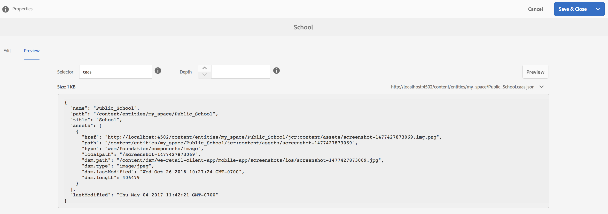

# Espaços e Entidades{#spaces-and-entities}

>[!NOTE]
>
>A Adobe recomenda usar o Editor SPA para projetos que exigem renderização do lado do cliente baseada em estrutura de aplicativo de página única (por exemplo, Reagir). [Saiba mais](/help/sites-developing/spa-overview.md).

Um Espaço é um local conveniente para armazenar entidades expostas por meio da Content Services REST API. Isso é especialmente útil porque um aplicativo (ou qualquer canal) pode ser associado a várias entidades. Forçar as Entidades a estarem em um Espaço força a prática recomendada de agrupar os requisitos de um aplicativo. Como opção, você pode associar um aplicativo no AEM a um pequeno número de Espaços.

>[!NOTE]
>
>Para disponibilizar algo para qualquer canal do Content Services, ele precisa estar em um espaço.

## Criação de um espaço {#creating-a-space}

Se o usuário quiser expor um monte de conteúdo e ativos a um aplicativo móvel, o usuário criará o espaço usando o painel do AEM Mobile.

Pela primeira vez, o usuário que não configurou os serviços de conteúdo para trabalhar com espaços, o painel do AEM Mobile exibirá somente os Aplicativos depois de selecionar os Serviços **de** conteúdo.

>[!CAUTION]
>
>**Pré-requisitos para adicionar um espaço**
>
>Marque a opção **Permitir que o AEM Content Services** funcione com o Spaces e ative-o no painel do aplicativo do AEM Mobile.
>
>Consulte [Administração de serviços](/help/mobile/developing-content-services.md) de conteúdo para obter mais detalhes.

Depois de configurar os Espaços no painel, siga estas etapas para criar Espaços:

1. Escolha **Espaços** no Content Services.

   

1. Escolha **Criar** para criar um espaço. Digite **Título**, **Nome** e **Descrição** para o espaço.

   Clique em **Criar**.

   

## Gerenciamento de um espaço {#managing-a-space}

Depois de criar um espaço, clique à esquerda para gerenciar o espaço na lista.

É possível exibir as propriedades do espaço, excluir o espaço ou publicar o espaço e seu conteúdo em uma instância de publicação do AEM.

**Propriedades de exibição e edição de um espaço**

1. Selecione o espaço na lista
1. Choose **Properties** from the toolbar
1. Clique em **Fechar** quando terminar

**Publicando um espaço** Quando um espaço é publicado, todas as pastas e entidades nesse espaço também são publicadas.

1. Selecione o espaço clicando em seu ícone na lista Console de Espaço
1. Escolher árvore **de publicação**

>[!NOTE]
>
>Você pode **Cancelar a publicação** de um Espaço, que remove o espaço da instância de publicação.
>
>A imagem a seguir ilustra as ações que podem ser executadas depois que você publicar o espaço.

## Trabalhar com pastas em um espaço {#working-with-folders-in-a-space}

Os espaços podem incluir pastas para ajudar a organizar ainda mais o conteúdo e os ativos do espaço. Os usuários podem criar sua própria hierarquia em um espaço.

### Creating a Folder {#creating-a-folder}

1. Clique no espaço na lista no console de espaço e clique em **Criar pasta**

   

1. Digite o **Título**, **o** Nome e a **Descrição** da pasta

   

1. Clique em **Criar** para criar a pasta em um espaço

## Cópia de idioma {#language-copy}

>[!CAUTION]
>
>A Cópia de idioma não está totalmente funcional para esta versão. Ela só estabelece a estrutura.

O recurso Cópia **de** idioma permite que os autores copiem sua Cópia de idioma mestre e, em seguida, criem um Projeto e um Fluxo de trabalho para traduzir automaticamente o conteúdo. A Cópia de idioma cria a estrutura correta. Depois de adicionar uma pasta em um espaço, você pode adicionar uma Cópia de idioma ao seu espaço.

>[!NOTE]
>
>É recomendável que qualquer conteúdo que possa ser traduzido seja colocado sob o nó Cópia de idioma.

### Adicionando cópia de idioma {#adding-language-copy}

1. Depois de criar espaço, clique nesse espaço para criar uma cópia de idioma.

   Clique em **Criar** e escolha Cópia **** de idioma.

   

   >[!NOTE]
   >
   >Os nós de Cópia de Idioma só podem existir como um filho direto do Espaço.

1. **** Escolher o Idioma do Pacote **de Conteúdo;ast; e inserir o** Carimbo;ast; na caixa de diálogo **Criar cópia** de idioma.

   Clique em **Criar**.

   

1. Depois que você criar uma Cópia de idioma, ela aparecerá em seu espaço em Mestres de **idiomas**.

   

   >[!NOTE]
   >
   >Selecione Mestres **de** idioma para exibir as pastas de cópia de idioma.

### Remoção de uma pasta do espaço {#removing-a-folder-from-the-space}

1. Selecione a pasta na lista de conteúdos de espaço
1. Clique em **Excluir** na barra de ferramentas

   >[!NOTE]
   >
   >Para navegar até uma pasta e ver seu conteúdo ou adicionar uma subpasta ou entidade, clique no título da pasta na lista de conteúdo do espaço.

## Trabalhar com Entidades em um Espaço {#working-with-entities-in-a-space}

As entidades representam o conteúdo exposto pelo ponto de extremidade do serviço da Web. As entidades são armazenadas em espaços para que possam ser facilmente encontradas e sejam mantidas independentes da estrutura do repositório do AEM que armazena seu conteúdo relacionado.

Talvez você queira agrupar entidades em algum encontro lógico. Para fazer isso, você pode criar qualquer número de pastas.

Se os filhos da entidade, que são outras entidades, forem coletados para modelagem de dados, o usuário desenvolvedor poderá criar &quot;Modelos de grupo&quot; específicos do tipo de modelo &quot;Grupo de entidades&quot;, fornecido prontamente.

>[!NOTE]
>
>As entidades são sempre associadas a um espaço, de modo que a maior parte da interface do usuário da entidade é acessada pelo console de espaço.

### Criando uma entidade {#creating-an-entity}

1. Abra o console Espaço e clique no título do espaço.

   Como opção, você pode navegar até a pasta clicando no título da pasta na lista.

   

1. Escolha o modelo para a entidade. Esse é o tipo de entidade que você deseja criar. Clique emAvançar.

   

   >[!NOTE]
   >
   >Você tem a opção de escolher o Modelo **de** ativos, o Modelo **de** páginas ou um modelo de tipo de entidade criado anteriormente.
   >
   >Consulte [Criação de um modelo](/help/mobile/administer-mobile-apps.md)para criar sua entidade personalizada.

1. Informe um **Título**, **Nome**, **Descrição** e **Tags** para a entidade. Clique em **Criar**.

   

   Quando terminar, a entidade aparecerá nos descendentes de seu espaço.

### Editando uma entidade {#editing-an-entity}

1. Depois de criar uma entidade, vá para sua pasta ou espaço e escolha sua entidade no console Espaço para editar.

   

1. Selecione uma entidade para edição e clique em **Editar**.

   

   >[!CAUTION]
   >
   >Dependendo do modelo que você escolher para criar sua entidade, a interface do usuário será diferente para ambas, para editar e exibir as propriedades da sua entidade. Consulte as etapas abaixo para obter mais detalhes.

   ***Se você escolher o modelo para criar a entidade como Modelos*** de ativos, clicar em **Editar** permitirá que você adicione ativos, como mostrado na figura abaixo:

   

   Como alternativa, você pode clicar em **Visualizar** para exibir o link json.

   

   ***Se você escolher o modelo para criar a entidade como Modelos*** de páginas, clicar em **Editar** permitirá que você adicione ativos conforme mostrado na figura abaixo:

   

   Clique no ícone no **Caminho** para adicionar um ativo

   

   >[!NOTE]
   >
   >Depois de adicionar uma entidade, ela deve ser salva para que o link Visualizar funcione. Para exibir a visualização, clique em **Salvar**. Clicar em **Visualizar** mostra a experiência do ativo adicionado, como mostra a figura abaixo:

   

   >[!NOTE]
   >
   >Quando terminar de adicionar ativos à sua entidade, você pode escolher **Salvar** para salvar as alterações ou escolher **Salvar e fechar** para salvar e redirecionar para a lista do console Espaço na qual as entidades são definidas.

   Além disso, selecione uma entidade na lista do console de espaço e clique em **Propriedades** para exibir e editar as propriedades de uma entidade definida.

   

   Você pode editar o título, a descrição, as tags e adicionar os ativos à sua entidade.

   

### Removendo uma entidade {#removing-an-entity}

1. Selecione a entidade na lista de conteúdos de espaço

   

1. Clique em **Excluir** na barra de ferramentas para remover a entidade específica do espaço

### Publicar uma entidade {#publishing-an-entity}

Você tem a opção de escolher **Publicar árvore** ou Publicar **** rapidamente para publicar sua entidade.

1. Selecione uma entidade na lista do console de espaço e clique em **Árvore de publicação **para publicar essa entidade e seus filhos.

   

   **Ou**,

   Clique em Publicação **rápida** para publicar essa entidade específica.
