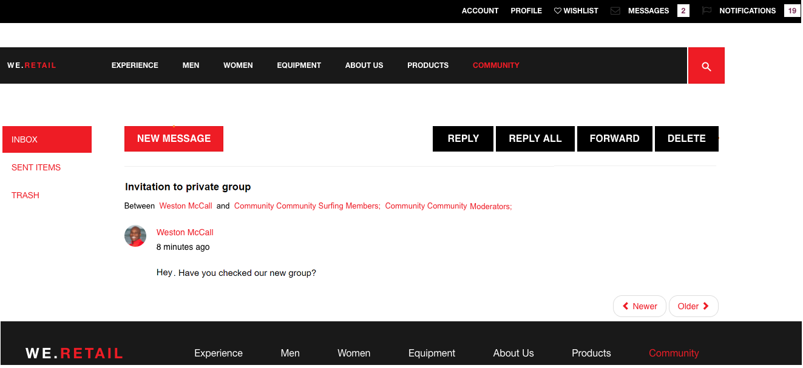

# AEM Communities release notes {#aem-communities-release-notes}

Leia sobre as melhorias no AEM Communities desde a versão 6.4. Para saber sobre os novos recursos mais detalhadamente, consulte o [Guia do usuário das comunidades do AEM 6.5](https://helpx.adobe.com/br/experience-manager/6-4/communities/user-guide.html).

To obtain the latest release, see the [Deploying Communities](https://helpx.adobe.com/in/experience-manager/6-4/help/communities/deploy-communities.html#LatestReleases) section of the documentation.

## Principais melhorias {#major-enhancements}

### Melhorias na participação da comunidade {#enhancements-to-community-engagement}

**O suporte** a @Menções agora permite que os usuários registrados marcem (mencionem) outros membros registrados para chamar sua atenção, em Conteúdo gerado pelo usuário. Os membros marcados (mencionados) são então notificados, com links para o Conteúdo gerado pelo usuário. No entanto, os usuários podem optar por desabilitar/habilitar as notificações da Web e de email.

Os usuários da comunidade não precisam procurar seu nome, sobrenome ou nome de usuário para ver se alguém contatou eles ou precisa de sua atenção. Além disso, ele permite que os autores UGC procurem respostas de usuários registrados específicos que podem atender melhor o problema e adicionar entradas.

The community administrators need to **Enable Mention** on community components to allow registered users use the functionality on those components.

**Mensagens em grupo**

Membros registrados da comunidade agora podem enviar mensagens diretas em massa para grupos por meio de uma única composição de email, em vez de enviar a mesma mensagem individualmente aos membros do grupo. Para permitir [mensagem em grupo](/help/communities/configure-messaging.md), habilite as duas instâncias do [Serviço de operações de mensagens](/help/communities/messaging.md#group-messaging).

### Aprimoramentos na moderação em massa {#enhancements-to-bulk-moderation}

filtros personalizados na Moderação em massa

[filtros](/help/communities/moderation.md#custom-filters) personalizados agora podem ser desenvolvidos e adicionados à interface de usuário de moderação em massa.

Um [projeto de amostra](https://github.com/Adobe-Marketing-Cloud/aem-communities-extensions/tree/master/aem-communities-moderation-filter) que demonstra a filtragem por meio de marcas está disponível no [Github](https://github.com/Adobe-Marketing-Cloud/aem-communities-extensions/tree/master/aem-communities-moderation-filter). Esse projeto pode ser usado como base para desenvolver filtros personalizados análogos.

**Exibição em lista na moderação em massa**

Uma nova exibição em lista com interface do usuário aprimorada foi oferecida na moderação em massa para exibir entradas de Conteúdo gerado pelo usuário.

### Melhorias no gerenciamento de site e de grupos {#enhancements-to-site-and-group-management}

**Site do lado do autor e administradores de grupo**

As comunidades, do AEM 6.5 em diante, permitem a administração descentralizada (e gerenciamento) de diferentes sites e grupos de comunidades/ grupos aninhados. As organizações que hospedam vários sites de comunidade e grupos aninhados agora podem selecionar membros para funções de administrador no lado do autor no momento de criação do site (e grupo).

Os administradores de sites podem criar um grupo em qualquer nível de hierarquia e se tornar os administradores padrão. Posteriormente, esses administradores podem ser removidos por outros administradores de grupo. Os administradores de grupo podem gerenciar o grupo G1 e criar um subgrupo aninhado em G1.

### Melhorias na ativação {#enhancements-to-enablement}

**Suporte SCORM 2017.1**

The enablement functionality of AEM 6.5 Communities support Shareable Content Object Reference Model [(SCORM) 2017.1](https://rusticisoftware.com/blog/scorm-engine-2017-released/) engine.

* Suporte à navegação do teclado nos componentes de ativação
* Os componentes de ativação (por exemplo, Catálogo e Reprodução do curso, Atribuições, Biblioteca de arquivos) no AEM Communities suportam a navegação pelo teclado para melhorar a acessibilidade.

### Outras melhorias {#other-enhancements}

* Suporte para Solr 7
* AEM 6.5 Communities suporta a versão Apache Solr 7.0 da plataforma de pesquisa ao configurar MSRP e DSRP.
