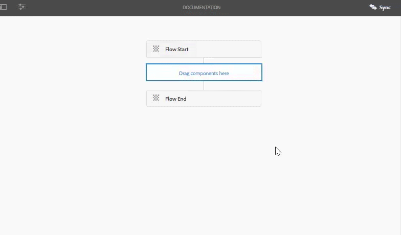

# Novidades do Adobe Experience Manager 6.5 Service Pack 7 {#aem-whats-new-service-pack}

[!DNL Adobe Experience Manager] 6.5 os service packs fornecem novos recursos, melhorias solicitadas pelo cliente e melhorias de desempenho, estabilidade e segurança em intervalos trimestrais. A disponibilidade trimestral facilita o acesso e a adoção de novos recursos e inovações.

Este artigo destaca os recursos incluídos no Service Pack 6.5 mais recente, [os principais recursos incluídos nos pacotes de serviços 6.5 anteriores](#key-features-previous-service-packs) e as versões de [chave AEM desde a última versão do service pack](#key-releases-since-last-sp).

## Adobe [!DNL Experience Manager Sites] {#aem-sites}

### Classificar as páginas da Live Copy disponíveis para implantação {#sort-livecopy-pages}

Agora você pode classificar as páginas de Live Copy disponíveis para implantação usando as propriedades [!UICONTROL Name], [!UICONTROL Data da última modificação] e [!UICONTROL Data da última implantação]. A [!UICONTROL Data da última implementação] de uma página é uma nova propriedade introduzida nesta versão.

### Disponibilidade de movimentações de página e implantações de MSM como operações assíncronas {#page-moves-msm-asynchronous}

Agora é possível executar as movimentações de página e as implantações de MSM como operações assíncronas para reduzir seu impacto no desempenho do tempo de execução. Você pode programar as operações para execução imediata ou posterior. O status das tarefas associadas e das etapas do processo é exibido em um console, que é útil para monitorar implantações de MSM em larga escala.

## [!DNL Adobe Experience Manager Assets] {#aem-assets}

* [!DNL Assets] e  [!DNL Dynamic Media] oferecem várias melhorias de acessibilidade. Os aprimoramentos estão relacionados à navegação do teclado, ao uso de leitores de tela, a melhorias semelhantes para permitir o uso de tecnologias de assistência (AT). Consulte [[!DNL Assets] aprimoramentos](/help/release-notes/sp-release-notes.md#assets-6570) e [[!DNL Dynamic Media] aprimoramentos](/help/release-notes/sp-release-notes.md#dynamic-media-6570).

* Os usuários podem classificar ativos digitais em visualizações de cartão e coluna.

## [!DNL Adobe Experience Manager Forms] {#aem-forms}

>[!NOTE]
>
>[!DNL Experience Manager Forms] os pacotes de complementos são disponibilizados uma semana após a versão programada do  [!DNL Experience Manager] Service Pack. [!DNL Experience Manager] 6.5 O Service Pack 7 (6.5.7.0) está programado para lançamento em 26 de novembro de 2020.

## Principais recursos dos pacotes de serviços anteriores [!DNL Experience Manager] 6.5 {#key-features-previous-service-packs}

### [!DNL Experience Manager Sites] {#aem-sites-previous-service-packs}

#### Disponibilidade da operação Mover página no modo assíncrono (6.5.6.0) {#page-move-asynchronous}

A operação Mover página agora está disponível no modo assíncrono. Além da execução imediata, você também pode agendar a operação Mover página para execução posterior.

#### Aprimoramentos de acessibilidade (6.5.5.0) {#accessibility-sites}

* Relatórios de erro aprimorado ao adicionar informações de texto.

* O foco da interface do usuário foi aprimorado durante a navegação do teclado.

* Melhoria na taxa de contraste para vários elementos da interface do usuário.

* Consistência aprimorada de atributos alternativos para imagens de página.

* Consistência aprimorada das etiquetas dos Aplicativos de Internet Avançados Acessíveis (ARIA).

* Aprimoramento dos recursos de NVDA (Non-Visual Desktop Access).

* Aprimoramento do suporte ao leitor de tela.

#### Outras melhorias importantes (6.5.5.0) {#other-enhancements-sites}

* O acesso anônimo ao CRXDE Lite não é permitido para melhorar a segurança. Em vez disso, os usuários são direcionados para a tela de logon. Consulte [Desenvolvimento com CRXDE Lite](/help/sites-developing/developing-with-crxde-lite.md).

* Ao copiar ou colar uma árvore de página, agora você tem a opção de colar a página raiz ou colar a página raiz com as subpáginas da árvore.

* [!DNL Adobe Experience Manager Experience Fragments] exportados para  [!DNL Adobe Target] espaços de trabalho agora são exibidos como tipos de oferta exclusivos e fontes de oferta em  [!DNL Target].

* Gerenciador de vários sites - o acionador Publicar agora exclui um componente da página publicada se um componente for excluído da página de origem.

* Gerenciador de vários sites - quando o nome de um componente local em uma [!UICONTROL Live Copy] é idêntico ao nome de um componente no blueprint e o componente é lançado do blueprint, o termo `_msm_moved` agora é adicionado ao nome do componente local.

#### Aprimoramentos do sistema de estilo (6.5.4.0) {#style-system-enhancements}

Agora é possível selecionar estilos na caixa de diálogo do componente usando o Sistema de estilo aprimorado.

#### Melhorias no desempenho em várias áreas (6.5.4.0) {#performance-improvements}

* Redução do tempo para carregar e inicializar o ContextHub em um site (`contexthub.kernel.js`). Isso resulta em cargas de página mais rápidas durante uma visita ao site.

* Reduziu o tempo para atualizar uma página depois de arrastar [!DNL Experience Fragments] para [!DNL Sites] o Editor de páginas.

* Tempo de carregamento reduzido para entradas em uma página [!DNL Sites] com mais de 200 cópias online em **[!UICONTROL Visão geral da Live Copy]**.

* Manuseio aprimorado de URLs incompletos ou inválidos. Tais URLs podem atrasar o Editor de modelos.

### [!DNL Adobe Experience Manager Assets] {#aem-assets-previous-service-packs}

#### Aprimoramentos de acessibilidade (6.5.6.0) {#accessibility-assets-6560}

* **Foco aprimorado na interface do usuário durante a navegação** do teclado, por exemplo, foco em:

   * `x` ícone na caixa de diálogo  [!UICONTROL Visualização da ] versão de um ativo na  [!UICONTROL Linha do tempo].

   * Opções acionáveis da interface do usuário.

   * Campo de email na caixa de diálogo [!UICONTROL Compartilhar link] e campo para adicionar um grupo de usuários fechado na guia [!UICONTROL Permissão] da pasta [!UICONTROL Propriedades].

* **Funcionalidade aprimorada usando teclas do teclado**

   Os usuários podem usar teclas de teclado para arrastar controles no Editor de formulário de Schema de metadados no modo de navegação do leitor de tela.

* **Melhor utilização para usuários** de leitores de tela, devido ao seguinte:

   * Os leitores de tela anunciam a finalidade dos players de vídeo e áudio.

   * Os leitores de tela anunciam a finalidade das opções da interface do usuário para remover as tags selecionadas usando [!UICONTROL caixa de diálogo de seleção de tags] no ativo [!UICONTROL Propriedades].

   * Os leitores de tela anunciam os cabeçalhos de linha e os itens de linha das tabelas, para que os usuários saibam quais entradas pertencem à mesma linha.

   * Título descritivo e significativo da página de pesquisa.

   * Os leitores de tela anunciam as opções no painel do filtro de pesquisa como acordeões expansíveis.

#### Outros aprimoramentos em [!DNL Assets] (6.5.6.0) {#other-enhancements-assets-6560}

* Os grupos de usuários associados às pastas (privadas e não privadas) agora são removidos do repositório na [exclusão dessas pastas](/help/assets/private-folder.md#delete-private-folder). No entanto, os grupos de usuários redundantes, órfãos, não utilizados e gerados automaticamente existentes podem ser removidos do repositório usando JMX.

#### Aprimoramentos de acessibilidade em [!DNL Assets] (6.5.5.0) {#assets-accessibility}

[!DNL Experience Manager Assets] agora está mais acessível em conformidade com as Diretrizes de acessibilidade do conteúdo da Web (WCAG). A acessibilidade melhorou devido aos seguintes aprimoramentos:

* Muitos elementos, controles, páginas e caixas de diálogo da interface do usuário são compatíveis com o leitor de tela.

* Muitos elementos da interface do usuário, controles e campos de formulário de entrada podem ser acessados usando o teclado.

* A cor e o contraste de alguns elementos da interface do usuário são atualizados para que os usuários com visão limitada ou usuários sem percepção de cor possam distinguir esses elementos da interface do usuário. Por exemplo, a cor dos ícones de classificação de estrelas (como na seção [!UICONTROL Classificação] da guia [!UICONTROL Avançado] no ativo [!UICONTROL Propriedades] ou na visualização do cartão) é alterada para contraste adequado.

   

#### Manuseio de exceção aprimorado (6.5.5.0) {#exception-handling}

[!DNL Assets] o fluxo da interface do usuário tem melhor tratamento de exceções. Se um ativo não tiver um tipo para sua dimensão, a exceção observada será registrada nos arquivos de log.

#### Suporte para ativos 3D em [!DNL Dynamic Media] (6.5.5.0) {#support-for-3d}

O suporte para imagens 3D em [!DNL Dynamic Media] permite que os clientes publiquem e adicionem conteúdo 3D a páginas da Web e aplicativos. O suporte inclui:

* Publique formatos comuns de ativos 3D e gere um URL de ativo que possa ser usado em páginas da Web e outros aplicativos.

* Um Visualizador da Web 3D, acionado por [!DNL Adobe Dimension], para visualização interativa dos ativos 3D publicados.

* Publique e visualização ativos 3D comuns em [!DNL Experience Manager Sites] páginas usando o componente [!DNL Sites] WCM.

#### Configure [!DNL Experience Manager Assets] com [!DNL Brand Portal] (6.5.4.0) {#configure-assets-bp}

O canal de autorização entre [!DNL Experience Manager Assets] e [!DNL Brand Portal] foi alterado. Anteriormente, [!DNL Brand Portal] era configurado na interface clássica por meio do Gateway OAuth herdado, que usa a troca de token JWT para obter um Token de acesso IMS para autorização. [!DNL Experience Manager Assets] agora está configurado com  [!DNL Brand Portal] a Adobe I/O, que obtém um token IMS para autorização do seu  [!DNL Brand Portal] locatário.

As etapas para configurar [!DNL Experience Manager Assets] com [!DNL Brand Portal] são diferentes dependendo da versão [!DNL Experience Manager] e se você está configurando pela primeira vez ou atualizando as configurações existentes. Consulte [Configurar ativos do Experience Manager com o Portal de marcas](https://docs.adobe.com/content/help/br/experience-manager-brand-portal/using/publish/configure-aem-assets-with-brand-portal.html) para obter detalhes.

#### Aprimoramentos de acessibilidade (6.5.4.0) {#accessibility-enhancements}

[!DNL Experience Manager Assets] inclui os seguintes aprimoramentos de acessibilidade:

* Teclas de seta no teclado podem ser usadas para mover e deslocar áreas em imagens ampliadas. Para obter mais informações, consulte [ativos de pré-visualização usando apenas teclas do teclado](../assets/manage-assets.md#previewing-assets).

* As caixas de seleção de estado misto (nas quais, a menos que você marque todos os predicados aninhados, as caixas de seleção de primeiro nível não serão selecionadas e passarão por elas) no painel Filtros poderão ser lidas pelos leitores de tela.

* As restrições de formato de data e hora são fornecidas nos rótulos de campo dos campos de data, para permitir que os usuários digitem a data no formato correto usando o teclado.
Por exemplo, `On Time (MM-DD-YYYY HH:mm)`. Aqui MM é mês em formato de dois dígitos, AAAA é ano, DD é dia em formato de dois dígitos, HH é hora em formato militar de 24 horas e mm é minuto.

* Os leitores de tela anunciam a opção de remover as tags selecionadas (`X` símbolo) e o número das tags selecionadas.

#### Coluna classificável para a data de criação dos ativos na visualização de lista (6.5.3.0) {#sortable-date-created-column}

Uma nova coluna classificável para a data de criação dos ativos é adicionada na visualização de lista DAM e nos resultados da pesquisa de ativos na visualização de listas.

#### Pesquisa visual por [!DNL Adobe Experience Manager Assets] (6.5.2.0) {#visual-search}

[!DNL Assets]Os usuários do podem pesquisar imagens visualmente semelhantes. O Experience Manager exibe as imagens com tags inteligentes do repositório DAM que são semelhantes a uma imagem selecionada pelo usuário. Consulte [Pesquisa visual](../assets/search-assets.md).

### Dynamic Media {#dynamic-media-previous-service-packs}

#### Invalidar conteúdo em cache CDN (6.5.6.0) {#invalidate-cdn-cached-content}

Agora você pode usar a interface do usuário [!DNL Dynamic Media] para invalidar o conteúdo em cache da Rede de Delivery de Conteúdo (CDN). Como resultado, os ativos atualizados estão disponíveis instantaneamente em vez de aguardar a expiração do cache. Você pode invalidar o CDN ao:

* Criando um modelo de invalidação CDN: Selecionar ativos e URLs baseados em modelo associados a formulários

* Selecionar ativos e predefinições associadas por meio do seletor de ativos

* Adicionar URLs completos de ativos

#### Publicação seletiva de ativos para [!DNL Experience Manager] e [!DNL Dynamic Media] (6.5.6.0) {#selective-publishing}

Agora você pode optar por publicar ou cancelar a publicação seletiva de ativos [!DNL Experience Manager] ou [!DNL Dynamic Media] usando o assistente [!UICONTROL Publicação rápida] ou [!UICONTROL Gerenciar publicação]. Você também pode definir o modo `Publish` ou `Unpublish` no nível da pasta.

#### Imagem inteligente para Dynamic Media {#smart-imaging}

A geração de imagens inteligentes usa as características de exibição exclusivas de cada usuário para fornecer automaticamente as imagens certas, otimizadas para sua experiência, resultando em melhor desempenho e envolvimento. A geração de imagens inteligentes funciona com as predefinições de imagens existentes e usa inteligência no último milissegundo do delivery para reduzir ainda mais o tamanho do arquivo de imagem com base na velocidade do navegador ou da conexão de rede. Consulte [Imagens inteligentes](../assets/imaging-faq.md).

#### Recorte inteligente em perfis de vídeo para Dynamic Media (6.5.3.0) {#smart-crop-video}

Recorte inteligente para vídeo e recurso opcional disponível em Perfis de vídeo - é uma ferramenta que usa o poder da inteligência artificial no Adobe Sensei para detectar e recortar automaticamente o ponto focal em qualquer vídeo adaptável ou vídeo progressivo que você tenha carregado, independentemente do tamanho. Consulte [Sobre como usar o recorte inteligente em perfis de vídeo](../assets/video-profiles.md).

### Formulários do Experience Manager {#aem-forms-previous-service-packs}

#### Preencha previamente um formulário adaptável no cliente (6.5.6.0) {#prefill-merge-data-at-client}

Quando você preenche um formulário adaptável, o servidor [!DNL Experience Manager Forms] une os dados a um formulário adaptável e entrega o formulário preenchido a você. Por padrão, a ação de união de dados ocorre no servidor.
Agora você pode configurar o servidor [!DNL Experience Manager Forms] para [executar a ação de união de dados no cliente](../../help/forms/using/prepopulate-adaptive-form-fields.md) em vez do servidor. Reduz significativamente o tempo necessário para preencher e renderizar formulários adaptáveis.

#### Integração do modelo de dados de formulário com APIs RESTful em um servidor com implementação SSL bidirecional (6.5.6.0) {#fdm-integration-rest-apis-two-way-ssl}

[!DNL Experience Manager Forms] o modelo de dados de formulário agora pode  [se integrar com RESTful APIs em um servidor que tenha um SSL bidirecional implementado nele](../../help/forms/using/configure-data-sources.md).

#### Adicionado suporte para [!DNL Adobe Sign] Tags de texto no Serviço de Automated forms conversion (6.5.6.0) {#sign-integration-acroform-afcs}

Se um AcroForm incluir [!DNL Adobe Sign] Tags de texto, esses campos agora serão reconhecidos e representados como campos [!DNL Adobe Sign] no formulário adaptável convertidos usando [!DNL Automated Forms Conversion service]. Um assinante pode preencher esses campos ao assinar o formulário adaptável.

#### Suporte para converter PDF forms coloridos em formulários adaptáveis (6.5.6.0) {#colored-PDF-forms}

Você pode usar [!DNL Automated Forms Conversion service] para converter PDF forms coloridos em formulários adaptáveis.

#### Suporte para protocolos SMB 2 e SMB 3 (6.5.6.0) {#smb-support}

[!DNL Experience Manager Forms] agora suporta os protocolos SMB 2 e SMB 3.

#### Aprimoramento do cache para páginas de formulário adaptável traduzidas (6.5.6.0) {#enhanced-caching-translated-adaptive-forms}

Agora é possível especificar [locale como seletor no URL do formulário adaptável em vez de um argumento em URL](../../help/forms/using/supporting-new-language-localization.md) na forma adaptável. Ajuda a colocar formulários adaptáveis traduzidos em cache em [!DNL Experience Manager Dispatcher]. Não era possível armazenar em cache o formulário adaptável traduzido em versões anteriores. Para obter informações detalhadas sobre como configurar o cache para usar a localidade como seletor no URL do formulário adaptável, consulte [Configurar o cache do formulário adaptável no dispatcher](../../help/forms/using/configure-adaptive-forms-cache.md).

#### Salvar a saída do serviço de modelo de dados de formulário em uma variável (6.5.6.0) {#save-fdm-service-to-variable}

O modelo de dados de formulário permite salvar a saída de um serviço de modelo de dados de formulário em uma variável. [!DNL Experience Manager Forms] agora mapeia automaticamente o tipo de serviço de modelo de dados de formulário para o tipo de variável.

#### Anexar vários arquivos para o componente Anexo de arquivo (6.5.6.0) {#attach-multiple-files}

Agora você pode [anexar vários arquivos](../../help/forms/using/introduction-forms-authoring.md) ao componente [!UICONTROL Anexo de arquivo] dos formulários adaptáveis.

#### Personalizar as colunas da Caixa de entrada do Adobe Experience Manager (6.5.5.0) {#customize-aem-inbox-columns}

Você pode personalizar uma [!DNL Experience Manager] Caixa de entrada para alterar o título padrão de uma coluna, reordenar a posição de uma coluna e exibir colunas adicionais com base nos dados de um fluxo de trabalho. Os membros do grupo `administrators` ou `workflow-administrators` podem personalizar as colunas. Para obter mais informações, consulte [Admin Control](../sites-authoring/inbox.md#inbox-admin-control).

#### Salvar Comunicações Interativas como rascunho (6.5.5.0) {#save-as-draft}

Você pode usar a interface do agente para salvar um ou mais rascunhos para cada Comunicação interativa e recuperar o rascunho posteriormente para continuar trabalhando nele. Você pode especificar um nome diferente para cada rascunho para identificá-lo. Para obter mais informações, consulte [Salvar Comunicações Interativas como rascunho](../forms/using/prepare-send-interactive-communication.md#save-as-draft).

#### [!DNL Oracle WebLogic] suporte ao servidor de aplicativos (6.5.5.0)  {#weblogic-support}

A Adobe Experience Manager Forms adicionou suporte para [!DNL Oracle WebLogic 12] para Adobe Experience Manager Forms em JEE. Você pode atualizar de uma versão anterior ou configurar um novo Experience Manager 6.5 Forms no servidor JEE em [!DNL Oracle WebLogic] 12.2.1.4 e posterior. Mais tarde corresponde às alterações de versão secundária, em que x em 12.2.1.x é substituído por um número de versão.

#### Aprimoramentos de acessibilidade (6.5.5.0) {#accessibility-improvements}

A Adobe Experience Manager Forms inclui os seguintes aprimoramentos de acessibilidade:

* Quando um usuário pré-visualização um formulário adaptável como um formulário HTML, o campo [!UICONTROL Assinatura do script] retém o foco da guia.

* As mensagens de erro exibidas ao enviar um formulário adaptável agora contêm o atributo `aria-describedBy`. O atributo é anexado aos campos mencionados na mensagem de erro. O atributo `aria-describedby` indica IDs dos elementos que descrevem o objeto. Ajuda a estabelecer uma relação entre widgets ou grupos e texto que os descreveu.

* Se um formulário adaptável tiver alguns campos obrigatórios, o atributo obrigatório será definido como `True` para esses campos no schema de acessibilidade ARIA.

#### Autenticação baseada em certificado X-509 para serviços Web baseados em SOAP no modelo de dados de formulário (6.5.5.0) {#x509-based-authentication-soap}

O modelo de dados de formulário agora oferece suporte à autenticação baseada em certificado X-509 ao usar serviços Web SOAP como fonte de dados. Para obter mais informações, consulte [Configurar serviços Web SOAP](../forms/using/configure-data-sources.md#configure-soap-web-services).

#### Outras melhorias importantes (6.5.5.0) {#other-improvements}

* O Experience Manager 6.5 Forms no JEE Documento Security agora é baseado em [!DNL Apache Struts 2].

* Adicionado suporte para [!DNL Oracle Real Applications Cluster (RAC) 19c].

#### Gerar saída imprimível em workflows Experience Manager Forms (6.5.4.0) {#generate-printable-output}

A etapa de fluxo de trabalho Gerar saída imprimível permite integrar um arquivo de modelo de origem a um arquivo de dados. Essa integração permite que você imprima ou salve cópias diferentes do arquivo de modelo. A etapa gera uma saída PCL, PostScript, ZPL, IPL, TPCL ou DPL. Para obter mais informações sobre esse recurso, consulte [Fluxo de trabalho centrado na Forms em OSGi - Step Reference](../forms/using/aem-forms-workflow-step-reference.md).

#### Suporte a várias colunas para formulários adaptáveis e comunicações interativas no modo Layout (6.5.4.0) {#multi-column-adaptive-forms}

Agora é possível definir o número de colunas para um painel em formulários adaptáveis e comunicações interativas. Alterne para o modo de layout para usar a nova opção de várias colunas. Para obter mais informações, consulte [Usar o modo Layout para redimensionar componentes](../forms/using/resize-using-layout-mode.md).

#### Personalizações da Caixa de entrada do Experience Manager (6.5.4.0) {#aem-inbox}

A nova opção Controle de administrador permite que os administradores:

* Personalize o texto e o logotipo do cabeçalho.

* Controlar a exibição de links de navegação disponíveis no cabeçalho.

A opção Controle de administrador está visível somente para os membros do grupo `administrators` ou `workflow-administrators`. Para obter mais informações sobre esse recurso, consulte [Sua Caixa de entrada](../sites-authoring/inbox.md).

#### Suporte a Rich Text em formulários HTML5 (6.5.4.0) {#rich-text-support}

Converta um campo de texto em um formulário XFA em um campo de texto formatado em um formulário HTML5. Para obter mais informações, consulte [Criar modelos de formulário para formulários HTML5](../forms/using/designing-form-template.md).

#### Aprimoramentos de acessibilidade (6.5.4.0) {#forms-accessibility-enhancements-6540}

O Experience Manager Forms inclui os seguintes aprimoramentos de acessibilidade:

* Os leitores de tela anunciam as caixas de seleção, os links, o Seletor de data e os campos de Entrada de data corretamente em um formulário adaptável.

* Cada página de um formulário adaptável agora inclui um título e um rótulo principal.

#### Compartilhar e solicitar acesso aos itens da Caixa de entrada de um usuário do Experience Manager Forms (6.5.3.0) {#share-request-access}

Você pode compartilhar seus itens da Caixa de entrada com outro usuário. Quando outro usuário tiver acesso aos itens da Caixa de entrada, ele poderá solicitar e tomar as medidas apropriadas nos itens compartilhados. Da mesma forma, você pode solicitar acesso a itens da Caixa de entrada de outros usuários. Consulte [Compartilhar e solicitar acesso aos itens da Caixa de entrada de um usuário](../forms/using/configure-shared-queues-osgi.md).

#### Defina as configurações de saída do escritório para itens da Caixa de entrada de um usuário do Experience Manager Forms (6.5.3.0) {#configure-out-of-office}

Se planeja estar fora do escritório, você pode especificar o que acontece com os itens que lhe são atribuídos para esse período.
Você tem a opção de especificar uma data e hora de start e uma data e hora de término para que suas configurações de fora do escritório entrem em vigor. Você pode definir uma pessoa padrão para a qual todos os itens serão enviados. Consulte [Configurar definições de Fora do Escritório](../forms/using/configure-out-of-office-settings.md).

#### Gerar várias comunicações interativas usando a API de lote para Experience Manager Forms (6.5.3.0) {#generate-multiple-ic}

Você pode usar a API de lote para produzir várias comunicações interativas a partir de um modelo. O modelo é uma comunicação interativa sem dados. A API de lote combina dados com um modelo para produzir uma comunicação interativa. A API é útil na produção em massa de comunicações interativas. Por exemplo, contas telefônicas, declarações de cartão de crédito para vários clientes. Consulte [Gerar várias comunicações interativas usando a API de lote](../forms/using/generate-multiple-interactive-communication-using-batch-api.md).

## Versões de chave desde o Adobe Experience Manager 6.5 SP6 {#key-releases-since-last-sp}

Entre 3 de setembro de 2020 e 26 de novembro de 2020, a Adobe lançou o seguinte, além dos service packs e dos pacotes de correção cumulativos:

* [!DNL Adobe Experience Manager] como Cloud Service  [2020.9.0](https://experienceleague.adobe.com/docs/experience-manager-cloud-service/release-notes/release-notes/release-notes-2020-9-0.html?lang=en#release-notes) e  [2020.10.0](https://experienceleague.adobe.com/docs/experience-manager-cloud-service/release-notes/release-notes/release-notes-2020-10-0.html?lang=en#release-notes).

* [[!DNL Experience Manager] aplicativo para desktop 2.0 (2.0.3.2)](https://experienceleague.adobe.com/docs/experience-manager-desktop-app/using/release-notes.html).

* [Site de referência WKND - 0.0.6](https://github.com/adobe/aem-guides-wknd/releases/tag/aem-guides-wknd-0.0.6)

* [Experience Manager Screens: Feature Pack 202008](https://experienceleague.adobe.com/docs/experience-manager-screens/user-guide/release-notes/release-notes-fp-202008.html)

* [Link do ativo do Adobe v2.2](https://helpx.adobe.com/enterprise/admin-guide.html/enterprise/using/adobe-asset-link.ug.html)

>[!MORELIKETHIS]
>
>* [[!DNL Adobe Experience Manager] 6.5 Documentação](../user-guide/home.md)
>* [Notas gerais de versão para [!DNL Adobe Experience Manager]  a versão 6.5](release-notes.md)
>* [Notas de versão do Service Pack para [!DNL Adobe Experience Manager]  6.5](sp-release-notes.md)

