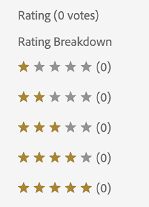

# Novidades do Adobe Experience Manager 6.5 Service Pack 5 {#aem-whats-new-service-pack-5}

Os service packs do Adobe Experience Manager 6.5 oferecem novos recursos, melhorias solicitadas pelo cliente e melhorias de desempenho, estabilidade e segurança em intervalos trimestrais. A disponibilidade trimestral facilita o acesso e a adoção de novos recursos e inovações.

Este artigo destaca os recursos incluídos no Service Pack 6.5 mais recente, os recursos [principais incluídos nos Service Packs](#key-features-previous-service-packs)6.5 anteriores e algumas das versões [principais desde a versão de Experience Manager 6.5.4.0](#key-releases-since-last-sp) .

## Adobe Experience Manager Sites {#aem-sites}

### Aprimoramentos de acessibilidade {#accessibility-sites}

* relatórios de erro aprimorado ao adicionar informações de texto.

* O foco da interface do usuário foi aprimorado durante a navegação do teclado.

* Melhoria na taxa de contraste para vários elementos da interface do usuário.

* Consistência aprimorada de atributos alternativo para imagens de página.

* Consistência aprimorada das etiquetas dos Aplicativos de Internet Avançados Acessíveis (ARIA).

* Aprimoramento dos recursos de NVDA (Non-Visual Desktop Access).

* Aprimoramento do suporte ao leitor de tela.

### Outras melhorias importantes {#other-enhancements-sites}

* Ao copiar ou colar uma árvore de página, agora você tem a opção de colar a página raiz ou colar a página raiz com as subpáginas da árvore.

* [!DNL Adobe Experience Manager Experience Fragments] exportados para [!DNL Adobe Target] espaços de trabalho agora são exibidos como tipos de oferta exclusivos e fontes de oferta em [!DNL Target].

* Gerenciador de vários sites - o acionador Publicar agora exclui um componente da página publicada se um componente for excluído da página de origem.

* Gerenciador de vários sites - quando o nome de um componente local em uma [!UICONTROL Live Copy] é idêntico ao nome de um componente no blueprint e o componente é lançado do blueprint, o termo `_msm_moved` é adicionado ao nome do componente local.

## [!DNL Adobe Experience Manager Assets] {#aem-assets}

### Aprimoramentos de acessibilidade em [!DNL Assets] {#assets-accessibility}

[!DNL Experience Manager Assets] agora está mais acessível em conformidade com as Diretrizes de acessibilidade do conteúdo da Web (WCAG). A acessibilidade melhorou devido aos seguintes aprimoramentos:

* Muitos elementos, controles, páginas e caixas de diálogo da interface do usuário são compatíveis com o leitor de tela.

* Muitos elementos da interface do usuário, controles e campos de formulário de entrada podem ser acessados usando o teclado.

* A cor e o contraste de alguns elementos da interface do usuário são atualizados para que os usuários com visão limitada ou usuários sem percepção de cor possam distinguir esses elementos da interface do usuário. For example, the color of star rating icons (such as in [!UICONTROL Rating] section of [!UICONTROL Advanced] tab in asset [!UICONTROL Properties] or in card view) is changed for appropriate contrast.

   

### Funcionamento de exceção aprimorado {#exception-handling}

[!DNL Assets] o fluxo da interface do usuário tem melhor tratamento de exceções. Se um ativo não tiver um tipo para sua dimensão, a exceção observada será registrada nos arquivos de log.

### Suporte para ativos 3D em [!DNL Dynamic Media] {#support-for-3d}

O suporte para imagens 3D em [!DNL Dynamic Media] permite que os clientes publiquem e adicionem conteúdo 3D a páginas da Web e aplicativos. O suporte inclui:

* Publique formatos comuns de ativos 3D e gere um URL de ativo que possa ser usado em páginas da Web e outros aplicativos.

* Um Visualizador da Web 3D, acionado por [!DNL Adobe Dimension], para visualização interativa dos ativos 3D publicados.

* Publique e visualização ativos 3D comuns em [!DNL Experience Manager Sites] páginas usando o componente [!DNL Sites] WCM.

## Adobe Experience Manager Forms {#aem-forms}

### Personalizar as colunas da Caixa de entrada do Adobe Experience Manager {#customize-aem-inbox-columns}

Você pode personalizar uma [!DNL Experience Manager] Caixa de entrada para alterar o título padrão de uma coluna, reordenar a posição de uma coluna e exibir colunas adicionais com base nos dados de um fluxo de trabalho. Os membros do `administrators` ou do `workflow-administrators` grupo podem personalizar as colunas. Para obter mais informações, consulte Controle [de](../sites-authoring/inbox.md#inbox-admin-control)administração.

### Salvar comunicações interativas como rascunho {#save-as-draft}

Você pode usar a interface do agente para salvar um ou mais rascunhos para cada Comunicação interativa e recuperar o rascunho posteriormente para continuar trabalhando nele. Você pode especificar um nome diferente para cada rascunho para identificá-lo. Para obter mais informações, consulte [Salvar comunicações interativas como rascunho](../forms/using/prepare-send-interactive-communication.md#save-as-draft).

### [!DNL Oracle WebLogic] suporte ao servidor de aplicativos {#weblogic-support}

O Adobe Experience Manager Forms adicionou suporte para [!DNL Oracle WebLogic 12] o Adobe Experience Manager Forms no JEE. Você pode atualizar de uma versão anterior ou configurar um novo Experience Manager 6.5 Forms no servidor JEE em [!DNL Oracle WebLogic] 12.2.1.4 e posterior. Mais tarde corresponde às alterações de versão secundária, em que x em 12.2.1.x é substituído por um número de versão.

### Aprimoramentos de acessibilidade {#accessibility-improvements}

O Adobe Experience Manager Forms inclui os seguintes aprimoramentos de acessibilidade:

* Quando um usuário pré-visualização um formulário adaptável como um formulário HTML, o campo Assinatura [!UICONTROL em] script retém o foco da guia.

* As mensagens de erro exibidas ao enviar um formulário adaptável agora contêm o `aria-describedBy` atributo. O atributo é anexado aos campos mencionados na mensagem de erro. O `aria-describedby` atributo indica IDs dos elementos que descrevem o objeto. Ajuda a estabelecer uma relação entre widgets ou grupos e texto que os descreveu.

* Se um formulário adaptável tiver alguns campos obrigatórios, o atributo obrigatório será definido como `True` para esses campos no schema de acessibilidade ARIA.

### Autenticação baseada em certificado X-509 para serviços Web baseados em SOAP no modelo de dados de formulário {#x509-based-authentication-soap}

O modelo de dados de formulário agora oferece suporte à autenticação baseada em certificado X-509 ao usar serviços Web SOAP como fonte de dados. Para obter mais informações, consulte [Configurar serviços](../forms/using/configure-data-sources.md#configure-soap-web-services)da Web SOAP.

### Outras melhorias importantes {#other-improvements}

* O Experience Manager 6.5 Forms no JEE Documento Security agora é baseado em [!DNL Apache Struts 2].

* Adicionado suporte para [!DNL Oracle Real Applications Cluster (RAC) 19c].

## Principais recursos dos Service Packs anteriores do Experience Manager 6.5 {#key-features-previous-service-packs}

### Sites do Experience Manager {#aem-sites-previous-service-packs}

#### Aprimoramentos do sistema de estilo (6.5.4.0) {#style-system-enhancements}

Agora é possível selecionar estilos na caixa de diálogo do componente usando o Sistema de estilo aprimorado.

#### Melhorias no desempenho em várias áreas (6.5.4.0) {#performance-improvements}

* Redução do tempo para carregar e inicializar o ContextHub em um site (`contexthub.kernel.js`). Isso resulta em cargas de página mais rápidas durante uma visita ao site.

* Redução do tempo para atualizar uma página depois de arrastar [!DNL Experience Fragments] para o Editor [!DNL Sites] de páginas.

* O tempo de carregamento das entradas em uma [!DNL Sites] página com mais de 200 cópias online foi encurtado na Visão geral **** do Live Copy.

* Funcionamento aprimorado de URLs incompletos ou inválidos. Tais URLs podem atrasar o Editor de modelos.

### [!DNL Adobe Experience Manager Assets] {#aem-assets-previous-service-packs}

#### Configurar [!DNL Experience Manager Assets] com [!DNL Brand Portal] (6.5.4.0) {#configure-assets-bp}

O canal de autorização entre [!DNL Experience Manager Assets] e [!DNL Brand Portal] é alterado. Anteriormente, [!DNL Brand Portal] era configurado na interface clássica via Gateway OAuth herdado, que usa a troca de token JWT para obter um Token de acesso IMS para autorização. [!DNL Experience Manager Assets] agora está configurado com [!DNL Brand Portal] a Adobe I/O, que obtém um token IMS para autorização do seu [!DNL Brand Portal] locatário.

As etapas para configurar [!DNL Experience Manager Assets] com [!DNL Brand Portal] são diferentes dependendo da sua [!DNL Experience Manager] versão e se você está configurando pela primeira vez ou atualizando as configurações existentes. Consulte [Configurar ativos de Experience Manager com o Portal](https://docs.adobe.com/content/help/br/experience-manager-brand-portal/using/publish/configure-aem-assets-with-brand-portal.html) de marcas para obter detalhes.

#### Accessibility enhancements (6.5.4.0) {#accessibility-enhancements}

[!DNL Experience Manager Assets] inclui os seguintes aprimoramentos de acessibilidade:

* Teclas de seta no teclado podem ser usadas para mover e deslocar áreas em imagens ampliadas. Para obter mais informações, consulte [pré-visualizações usando apenas](../assets/managing-assets-touch-ui.md#previewing-assets)teclas de teclado.

* As caixas de seleção de estado misto (nas quais, a menos que você marque todos os predicados aninhados, as caixas de seleção de primeiro nível não serão selecionadas e passarão por elas) no painel Filtros poderão ser lidas pelos leitores de tela.

* As restrições de formato de data e hora são fornecidas nos rótulos de campo dos campos de data, para permitir que os usuários digitem a data no formato correto usando o teclado.
Por exemplo, `On Time (MM-DD-YYYY HH:mm)`. Aqui MM é mês em formato de dois dígitos, AAAA é ano, DD é dia em formato de dois dígitos, HH é hora em formato militar de 24 horas e mm é minuto.

* Os leitores de tela agora anunciam o `X` símbolo para remover as tags selecionadas junto com o número de tags selecionadas.

#### Pesquisa visual por [!DNL Adobe Experience Manager Assets] (6.5.2.0) {#visual-search}

[!DNL Assets]Os usuários do podem pesquisar imagens visualmente semelhantes. O Experience Manager exibe as imagens com tags inteligentes do repositório DAM que são semelhantes a uma imagem selecionada pelo usuário. See [Visual search](../assets/search-assets.md).

### Dynamic Media {#dynamic-media-previous-service-packs}

#### Imagem inteligente para Dynamic Media {#smart-imaging}

A geração de imagens inteligentes usa as características de exibição exclusivas de cada usuário para fornecer automaticamente as imagens certas, otimizadas para sua experiência, resultando em melhor desempenho e envolvimento. A geração de imagens inteligentes funciona com as predefinições de imagens existentes e usa inteligência no último milissegundo do delivery para reduzir ainda mais o tamanho do arquivo de imagem com base na velocidade do navegador ou da conexão de rede. Consulte Imagem [inteligente](../assets/imaging-faq.md).

#### Recorte inteligente em perfis de vídeo para Dynamic Media (6.5.3.0) {#smart-crop-video}

Recorte inteligente para vídeo e recurso opcional disponível em Perfis de vídeo - é uma ferramenta que usa o poder da inteligência artificial no Adobe Sensei para detectar e recortar automaticamente o ponto focal em qualquer vídeo adaptável ou progressivo que você tenha carregado, independentemente do tamanho. Consulte [Sobre como usar o recorte inteligente em perfis](../assets/video-profiles.md)de vídeo.

### Formulários do Experience Manager {#aem-forms-previous-service-packs}

#### Gerar saída imprimível em workflows do Experience Manager Forms (6.5.4.0) {#generate-printable-output}

A etapa de fluxo de trabalho Gerar saída imprimível permite integrar um arquivo de modelo de origem a um arquivo de dados. Essa integração permite que você imprima ou salve cópias diferentes do arquivo de modelo. A etapa gera uma saída PCL, PostScript, ZPL, IPL, TPCL ou DPL. Para obter mais informações sobre esse recurso, consulte Fluxo de trabalho centrado no [Forms em OSGi - Referência](../forms/using/aem-forms-workflow-step-reference.md)de etapas.

#### Suporte para várias colunas para formulários adaptáveis e comunicações interativas no modo Layout (6.5.4.0) {#multi-column-adaptive-forms}

Agora é possível definir o número de colunas para um painel em formulários adaptáveis e comunicações interativas. Alterne para o modo de layout para usar a nova opção de várias colunas. Para obter mais informações, consulte [Usar o modo Layout para redimensionar componentes](../forms/using/resize-using-layout-mode.md).

#### Personalizações da Caixa de entrada do Experience Manager (6.5.4.0) {#aem-inbox}

A nova opção Controle de administrador permite que os administradores:

* Personalize o texto e o logotipo do cabeçalho.

* Controlar a exibição de links de navegação disponíveis no cabeçalho.

A opção Controle de administrador está visível somente para os membros do `administrators` grupo ou do `workflow-administrators` grupo. Para obter mais informações sobre esse recurso, consulte [Sua Caixa de entrada](../sites-authoring/inbox.md).

#### Suporte a Rich Text em formulários HTML5 (6.5.4.0) {#rich-text-support}

Converta um campo de texto em um formulário XFA em um campo de texto formatado em um formulário HTML5. Para obter mais informações, consulte [Criar modelos de formulário para formulários](../forms/using/designing-form-template.md)HTML5.

#### Accessibility enhancements (6.5.4.0) {#forms-accessibility-enhancements-6540}

O Experience Manager Forms inclui os seguintes aprimoramentos de acessibilidade:

* Os leitores de tela anunciam as caixas de seleção, os links, o Seletor de data e os campos de Entrada de data corretamente em um formulário adaptável.

* Cada página de um formulário adaptável agora inclui um título e um rótulo principal.

#### Compartilhar e solicitar acesso aos itens da Caixa de entrada de um usuário do Experience Manager Forms (6.5.3.0) {#share-request-access}

Você pode compartilhar seus itens da Caixa de entrada com outro usuário. Quando outro usuário tiver acesso aos itens da Caixa de entrada, ele poderá solicitar e tomar as medidas apropriadas nos itens compartilhados. Da mesma forma, você pode solicitar acesso a itens da Caixa de entrada de outros usuários. Consulte [Compartilhar e solicitar acesso aos itens da Caixa de entrada de um usuário](../forms/using/configure-shared-queues-osgi.md).

#### Definir as configurações de saída do escritório para itens da Caixa de entrada de um usuário do AEM Forms (6.5.3.0) {#configure-out-of-office}

Se planeja estar fora do escritório, você pode especificar o que acontece com os itens que lhe são atribuídos para esse período.
Você tem a opção de especificar uma data e hora de start e uma data e hora de término para que suas configurações de fora do escritório entrem em vigor. Você pode definir uma pessoa padrão para a qual todos os itens serão enviados. Consulte [Configurar configurações](../forms/using/configure-out-of-office-settings.md)fora do escritório.

#### Gerar várias comunicações interativas usando a API de lote para AEM Forms (6.5.3.0) {#generate-multiple-ic}

Você pode usar a API de lote para produzir várias comunicações interativas a partir de um modelo. O modelo é uma comunicação interativa sem dados. A API de lote combina dados com um modelo para produzir uma comunicação interativa. A API é útil na produção em massa de comunicações interativas. Por exemplo, contas telefônicas, declarações de cartão de crédito para vários clientes. Consulte [Gerar várias comunicações interativas usando a API](../forms/using/generate-multiple-interactive-communication-using-batch-api.md)de lote.

## Versões de chave desde o Adobe Experience Manager 6.5 SP4 {#key-releases-since-last-sp}

Entre 05 de março de 2020 e 04 de junho de 2020, a Adobe lançou o seguinte, além dos service packs e dos pacotes de correção cumulativos:

* [O portal](https://experience.adobe.com/#/downloads/content/software-distribution/en/aem.html) de distribuição de software está disponível para download de service packs de Experience Manager, pacotes cumulativos de correções, hot fixes e pacotes de recursos.

* [!DNL Adobe Experience Manager Cloud Manager] [2020.3.0](https://docs.adobe.com/content/help/en/experience-manager-cloud-manager/using/release-notes/release-notes-2020-3-0.html), [2020.4.0](https://docs.adobe.com/content/help/en/experience-manager-cloud-manager/using/release-notes/release-notes-2020-4-0.html)e [2020.5.0](https://docs.adobe.com/content/help/en/experience-manager-cloud-manager/using/release-notes/release-notes-current.html).

* [aplicativo para desktop Experience Manager 2.0.2.0](https://docs.adobe.com/content/help/pt-BR/experience-manager-desktop-app/using/release-notes.html).

* [Telas de Experience Manager: Feature Pack 202004](https://docs.adobe.com/content/help/en/experience-manager-screens/user-guide/release-notes/release-notes-fp-202004.html).

>[!MORELIKETHIS]
>
>* [Documentação do Adobe Experience Manager 6.5](../user-guide/home.md)
>* [Notas de versão gerais do Adobe Experience Manager 6.5](release-notes.md)
>* [Notas de versão do Service Pack para o Adobe Experience Manager 6.5](sp-release-notes.md)

