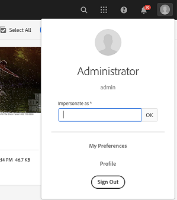

# Hotfixes e Feature Packs incluídos nos service packs anteriores {#hotfixes-and-feature-packs-included-in-previous-service-packs}

## [!DNL Adobe Experience Manager] 6.5.9.0 {#experience-manager-6590}

[!DNL Adobe Experience Manager] A versão 6.5.9.0 inclui novos recursos, principais melhorias solicitadas pelo cliente e melhorias de desempenho, estabilidade e segurança, lançadas desde a disponibilização da versão 6.5 em abril de 2019. O service pack é instalado em [!DNL Adobe Experience Manager] 6.5.

Os principais recursos e aprimoramentos introduzidos no [!DNL Adobe Experience Manager] 6.5.9.0 são:

* [!DNL Experience Manager Sites] O componente Dynamic Media Foundation agora permite ativar ou desativar a otimização para dispositivos de resolução mais alta ao usar uma predefinição de imagem responsiva ou Recorte inteligente.

* Para melhorar o desempenho, a condição `hidden=false` é movida da consulta JCR para o avaliador [!UICONTROL QueryBuilder]. Para verificar se um predicado oculto está funcionando após a alteração, [!DNL Experience Manager] verifica se qualquer pasta oculta não é exibida.

* Capacidade de restaurar páginas e árvore excluídas em uma página [!DNL Experience Manager Sites].

* Suporte para um novo usuário atualizar o token de acesso usando um token de atualização para o serviço de configuração do remetente.

* [Suporte ao mecanismo SMTP XOAUTH2](/help/sites-administering/notification.md#setting-up-oauth) para o serviço de configuração de email.

* Suporte para [!DNL MongoDB] versões 4.2 e 4.4.

* Ocorrências de nomes relacionados a Hong Kong, Macau e Taiwan são atualizadas de acordo com as novas convenções de nomenclatura para localidades e regiões chinesas.

* Aprimoramentos de acessibilidade em [!DNL Experience Manager] [[!DNL Assets]](#assets-accessibility-6590) e [[!DNL Dynamic Media]](#accessibility-dm-6590).

* O Smart Imaging DPR (Device Pixel Ratio) e a otimização da largura de banda da rede permitem fornecer imagens de melhor qualidade com eficiência; em dispositivos com telas de alta resolução e largura de banda de rede restrita. Para obter detalhes e a linha do tempo, consulte [perguntas frequentes sobre a geração inteligente de imagens](/help/assets/imaging-faq.md).

* [!DNL Dynamic Media] delivery (modificador de `fmt` URL) suporta o formato de imagem de próxima geração AVIF (formato AV1 Image ). Para obter mais detalhes e linha do tempo, consulte [image service and rendering API fmt](https://experienceleague.adobe.com/docs/dynamic-media-developer-resources/image-serving-api/image-serving-api/http-protocol-reference/command-reference/r-is-http-fmt.html).

* Capacidade de enviar um email de notificação para um grupo usando a etapa do fluxo de trabalho [!UICONTROL Atribuir tarefa] .

* Capacidade de recuperar um rascunho de Comunicação Interativa após modificar a Comunicação Interativa de origem.

* Defina o nome de domínio personalizado para carregar, renderizar e validar o serviço reCAPTCHA em [!DNL Experience Manager Forms].

* Aprimoramentos de dados de entrada para [!UICONTROL Invoke Form Data Model Service] etapa do fluxo de trabalho.

* Capacidade de usar várias páginas principais em um modelo de Documento de registro em [!DNL Experience Manager Forms].

* A página de suporte é interrompida no Documento de registro em [!DNL Experience Manager Forms].

* O repositório integrado (Apache Jackrabbit Oak) foi atualizado para 1.22.7.

Para obter uma lista completa dos recursos e aprimoramentos introduzidos no [!DNL Experience Manager] 6.5.9.0, consulte [novidades no [!DNL Adobe Experience Manager] 6.5 Service Pack 9](new-features-latest-service-pack.md).

>[!NOTE]
>
>A partir do Service Pack 9, [!DNL Experience Manager] os clientes podem desenvolver e operar seus aplicativos [!DNL Experience Manager] com distribuições dos [!DNL Azul Zulu] builds of OpenJDK, compatíveis com padrões do Java™ SE.
>O suporte para [!DNL Azul Zulu] JDKs também é fornecido pelo Adobe aos clientes [!DNL Experience Manager].
>Você pode baixar as versões relevantes dos JDKs [!DNL Azul Zulu] de [Adobe Software Distribution](https://experience.adobe.com/#/downloads/content/software-distribution/br/aem.html).
>Os direitos de uso da tecnologia Oracle Java™, conforme distribuída pela Adobe, expirarão no final de dezembro de 2022. [!DNL Experience Manager] os clientes do são incentivados a planejar e implementar o uso dos  [!DNL Azul Zulu] JDKs mais recentes até essa data. Para obter mais informações sobre o uso da tecnologia [!DNL Oracle Java™] e da tecnologia [!DNL Azul Zulu], consulte as [Perguntas frequentes](https://experienceleague.adobe.com/docs/experience-manager-65/assets/adobe-azul-openjdk-license-agreement.pdf) associadas.

Esta é a lista de correções fornecidas na versão [!DNL Experience Manager] 6.5.9.0.

### [!DNL Sites] {#sites-6590}

* As páginas publicadas com a propriedade Requisito de autenticação ativada não redirecionam para a página de logon e retornam a mensagem de erro 404 (NPR-36354).

* Ao criar um hiperlink, a opção para pesquisar um link não funciona no componente de texto (NPR-35849).

* Uma consulta transversal é acionada ao usar a API `com.day.cq.wcm.commons.ReferenceSearch`. Isso afeta o desempenho do servidor [!DNL Experience Manager] (NPR-36407).

* O contêiner de layout aninhado dentro de outro contêiner de layout redimensionado mostra um número incorreto de colunas para seus componentes filhos, resultando em esses componentes não serem alinhados à grade (NPR-36359).

* O Linkchecker externo exibe links externos válidos como links inválidos (NPR-36289).

* Depois de exibir referências por algum tempo, o painel de referências começa a mostrar uma mensagem de erro (NPR-36167).

* Ao mover um componente, o parsys criado automaticamente não tem o nó `sling:resourceType` (NPR-36165).

* Ao tentar sincronizar uma live-copy (ao usar configurações de implantação [!UICONTROL Ativar na ativação do Blueprint] e [!UICONTROL Desativar na ativação do Blueprint]) se um componente for excluído na livecopy principal, a sincronização falhará e um `NullPointerException` será registrado (NPR-36127).

* Quando um usuário digita o texto improvisado para a tag (tag que não existe no sistema) e pressiona Enter, a tag aparece sob o campo, mas quando o Fragmento de conteúdo é salvo e reaberto, a tag improvisada desaparece (NPR-36132).

* A Caixa de entrada não tem a opção de exibir o status de Operações assíncronas (NPR-36104).

* Um componente duplicado é criado após a restauração da herança (NPR-36000).

* Ao usar o `RemoteContentRenderingService`, a solicitação para o `RemoteContentRendererRequestHandler.getRequest` sempre inclui a página raiz para o `ComponentExporter`, mas não inclui a página solicitada se não estiver incluída no modelo raiz com base na profundidade de passagem e no conjunto de opções de filtragem. The request must always include the requested page so that the SPA has enough information to render a response (NPR-35961).

* Os itens onTime/offTime não ativam/desativam no onTime/offTime esperado (NPR-35936).

* Ao publicar uma página contendo um Fragmento de experiência que não tem propriedade `cq:lastModified`, ocorre um `NullPointerException` (NPR-35914).

* Ao tentar redimensionar um componente dentro de um contêiner, não é possível redimensionar de volta ao tamanho original. Quando o tamanho do contêiner do componente é reduzido, não é possível definir o tamanho de volta para o original (NPR-35809).

* In the rollout dialog, either triggered in the editor or from the Live Copy Overview, the status icons for detached, suspended, or not created pages is wrong (NPR-35691).

* A implementação das propriedades na página do Multi-Site Manager de página principal ignora a página de implantação e a caixa de seleção de subpáginas (NPR-35634).

* A funcionalidade de árvore de restauração, disponível na interface clássica, está ausente da interface do usuário de toque (CQ-4315352, CQ-4309415).

* Problemas ao reverter a herança e ao rolar a página em uma página [!DNL Experience Manager Sites] (NPR-36033).

### [!DNL Assets] {#assets-6590}

Os seguintes aprimoramentos na experiência do usuário são feitos em [!DNL Assets]:

* Para exibir ativos não classificados com base em qualquer um dos parâmetros [!UICONTROL Create], [!UICONTROL Modify] ou [!UICONTROL Name], [!DNL Adobe Experience Manager] oferece uma opção [!UICONTROL None] dentro das opções [!UICONTROL Sort by]. A opção [!UICONTROL None] garante que os ativos na interface do usuário do Assets (na exibição Cartão, Coluna e Insights) estejam na mesma ordem em que existem no nó JCR (NPR-36356).

* Para tornar a ID de email em minúsculas na resposta da API ACP de [!DNL Adobe Experience Manager] uma configuração opcional é introduzida; como os usuários [!DNL Adobe Asset Link] não poderiam fazer check-in de ativos se a ID não tivesse todos os caracteres em minúsculas. O painel [!DNL Adobe Asset Link] consome a resposta da API ACP de [!DNL Adobe Experience Manager] (CQ-4317704).

Os seguintes aprimoramentos de acessibilidade estão disponíveis em [!DNL Assets] como parte do service pack 9:

O contraste (com o plano de fundo) do texto e dos ícones a seguir é aprimorado para que os usuários com visão e percepção de cor limitadas possam compreender:

* Título do ativo na página [!UICONTROL Propriedades] (NPR-35967).
* Ícones de classificação de estrelas nas seções [!UICONTROL Classificação] em vários lugares (NPR-36009).
* Text on the asset and folder Card view (NPR-35966).
* Texto do espaço reservado na exibição [!UICONTROL Linha do tempo] (NPR-35965).
* Asset names on the asset search results (NPR-35964).
* Texto de espaço reservado na caixa de diálogo [!UICONTROL Compartilhamento de link] (NPR-35963).
* [!UICONTROL Metadata], [!UICONTROL Status], and [!UICONTROL Other] text in [!UICONTROL List] option in the [!UICONTROL View Settings] dialog (NPR-35910).
*  Localização e  [!UICONTROL Tipo para ] pesquisar textos de espaço reservado na pesquisa global (NPR-35909).
* Expanda e recolha ícones em [!UICONTROL Árvore de conteúdo] (NPR-35908).
* O texto [!UICONTROL Assets] na página em que as pastas de ativos são exibidas (NPR-35905).
* Texto em [!UICONTROL Metadados do ativo], [!UICONTROL Estatísticas de uso] na opção [!UICONTROL Visão geral] na página Detalhes do ativo (NPR-35904).
* Texto para teclas de atalho para as opções [!UICONTROL properties] e [!UICONTROL edit] na página Detalhes do ativo (NPR-35904).

As seguintes correções de erros estão disponíveis em [!DNL Assets] como parte do service pack 9:

* As tags criadas a partir de um elemento de seleção de tag em um formulário [!UICONTROL Folder Metadata Schema] não são salvas (NPR-36119).

* Quando uma pequena elipse é usada para anotar ativos, a elipse se sobrepõe ao número da anotação na versão impressa (NPR-36114).

* Às vezes, na exibição em Coluna, [!DNL Experience Manager] não solicita conflito de ativos duplicados quando um ativo duplicado é carregado (NPR-36048).

* A caixa de diálogo Compartilhar link não é fechada clicando no botão Fechar se ele estiver aberto e nenhuma alteração for feita (NPR-36030).

* Quando vários ativos são selecionados para atualizar as propriedades, às vezes ocorre um erro ou as propriedades de um ativo desmarcado são atualizadas (NPR-36002).

* Quando os espaços em branco de upload de ativos são adicionados no início ou no fim dos nomes de arquivos de ativos, com os caracteres restantes iguais ao nome de um ativo existente no repositório, o ativo existente é substituído sem registrar nenhum erro (NPR-36001).

* Quando o vídeo é reproduzido na página de detalhes do ativo, as opções de reprodução e pausa não funcionam (NPR-35999).

* Ao cancelar a publicação de ativos em massa, o Brand Portal gera um erro sugerindo que o URI da solicitação é muito longo (NPR-35954).

* Quando um ativo com texto de anotação longo é impresso, o texto da anotação é cortado, mesmo se espaço estiver disponível (NPR-35948).

* A opção para mover para a Próxima página está desativada ao selecionar a página na exibição Modelos selecionada na página Criar catálogo (CQ-4315462).

* Quando o fluxo de trabalho de atualização do ativo é iniciado no ativo de vídeo, a página é atualizada repetidamente (CQ-4313375).

* As pastas DAM não podem ser excluídas ou movidas, e uma exceção é registrada (NPR-35942).

### [!DNL Dynamic Media] {#dynamic-media-6590}

Em [!DNL Adobe Experience Manager] 6.5.9.0, as seguintes melhorias de acessibilidade estão disponíveis em [!DNL Dynamic Media]:

* Ao abrir a caixa de diálogo para adicionar ativos usando teclas do teclado no editor [!UICONTROL Conjunto de imagens]:
   * Os leitores de tela registram que a caixa de diálogo está aberta.
   * O foco do teclado é movido para a caixa de diálogo quando ele é aberto.
   * O foco do teclado volta para a opção Adicionar ativo quando a caixa de diálogo é fechada (CQ-4312134).

* Agora é possível adicionar e editar Pontos de acesso em ativos usando teclas de teclado no editor de ponto de acesso (CQ-4305965).

* Agora você pode colocar hiperlink no ponto de acesso por meio do gerenciamento de pontos de acesso usando teclas do teclado. O foco do leitor de tela agora é movido para o campo para editar Caminho do URL e a opção para Abrir caixa de diálogo de seleção (CQ-4290735).

* O contraste (com fundo) do texto e os controles na página Editor do conjunto de imagens são aprimorados, para que os usuários com visão e percepção de cor limitadas possam ser compreendidos (CQ-4290733).

* Agora é possível navegar até as opções de compartilhamento de ativos no Editor de predefinições do visualizador e recolher a opção de compartilhamento expandida usando teclas de teclado (CQ-4290724).

* Agora é possível navegar e exibir dicas de ferramentas nos ícones de informações e de alerta nas guias Básico e Avançado da página Editar codificação de vídeo usando as teclas do teclado (CQ-4290722).

* Os leitores de tela agora narram as instruções para vários campos na guia Aparência e na guia Comportamento no Editor de predefinições do visualizador (CQ-4290721).

* Ao navegar pela página Editar predefinição de imagem no modo Formulário , o leitor de tela narra a finalidade e os nomes de vários campos e controles (CQ-4290717).

* Ao navegar na página de detalhes de ativos, os leitores de tela agora descrevem a finalidade de várias opções em Visualizadores (CQ-4290716).

* O contraste (com o plano de fundo) do texto de espaço reservado Todas as representações na opção Representações da página de detalhes do ativo é aprimorado, para que os usuários com visão limitada e percepção de cor possam compreender (CQ-4290713).

* O asterisco visual para indicar o campo obrigatório agora é fornecido no campo Título do ativo no Editor do conjunto de imagens, e os leitores de tela anunciam as informações necessárias para o campo (CQ-4290712).

* Agora, os leitores de tela podem acessar e registrar a finalidade de várias opções interativas nos Visualizadores na página Detalhes do ativo (CQ-4290708).

Os ativos Adobe Experience Manager 6.5.9.0 corrigem os seguintes problemas em [!DNL Dynamic Media]:

* O Custom ViewerPresets e o CSS não são replicados para [!DNL Dynamic Media] quando [!DNL Dynamic Media] é ativado seletivamente e desativado por [default](https://experienceleague.adobe.com/docs/experience-manager-cloud-service/assets/dynamicmedia/config-dm.html#troubleshoot-dm-config) (NPR-36232).

* Ao tentar visualizar representações de vídeo na página de detalhes do ativo, os vídeos são lentos e carregados (CQ-4320122).

* A página do navegador não responde e fica lenta ao fazer upload de mais de 200 ativos com o Detector de ativos duplicados ativado (CQ-4319633).

* Quando um ativo de imagem panorâmica é adicionado ao componente de mídia panorâmica em uma página, um erro de referência não captada é registrado (CQ-4317666).

* Quando o visualizador de mídia interativa é implementado com o Fragmento de experiência, o Fragmento de experiência não é aberto no publicador e um erro é registrado (CQ-4317655).

* [!UICONTROL A opção Publicar no Dynamic ] Media não está disponível nas opções  [!UICONTROL de ] Publicação rápida em   Properties (CQ-4317199).

* Os autores do site com permissões somente leitura podem usar a funcionalidade de recorte inteligente em ativos e editar as representações recortadas inteligentes (CQ-4316450).

* As anotações de vídeo não funcionam para caminhos de pastas onde a configuração [!DNL Dynamic Media] não está ativada, mesmo se a instância [!DNL Experience Manager] estiver configurada no modo [!DNL Dynamic Media] (CQ-4314950).

* Quando o título do ativo tem caracteres de byte duplo, byte múltiplo, ASCII alto, cirílico, par substituto, hebraico, árabe e GB18030, em seguida, ao publicar no Dynamic Media o título do ativo tem um ponto de interrogação (?) (CQ-4311872).

>Problemas conhecidos de reprodução de vídeo no Dynamic Media *somente no Experience Manager 6.5.9.0*:
>
>* 

   <!-- CQDOC-18116 -->You cannot play video renditions from the asset's Details page on Experience Manager - Dynamic Media running in hybrid mode.
>* 

   <!-- CQDOC-18116 -->You cannot stream videos on Experience Manager - Dynamic Media running in hybrid mode.


### Plataforma {#platform-6590}

* Ao gerar uma miniatura para um blueprint e implantar as alterações na live copy, a herança de alguns campos não funciona (CQ-4319517).

* Ao criar uma pasta, selecione a propriedade Orderable e adicione mais de 20 ativos à pasta, selecionar todos os ativos na pasta exibe uma contagem incorreta (CQ-4316243).

* Quando você atualiza uma página, a classificação de pastas ou ativos não exibe os resultados apropriados (CQ-4316200).

* A biblioteca JavaScript do Handlebars é atualizada ao v4.7.7 (NPR-36375).

* Pacotes personalizados não são atualizados ao instalar um novo pacote de código usando o Gerenciador de pacotes (NPR-35949).

* Um pacote `resourceresolver` Sling está causando falha na consulta `Sling:alias` (NPR-35335).

* O caminho do contexto é removido ao configurar o SSL no Experience Manager (NPR-35294).

* A exceção `SegmentNotFound` é retornada após uma sessão de longa duração (NPR-36405).

### Integrações {#integrations-6590}

* Não é possível salvar as propriedades da página com a herança ativada para Fragmentos de experiência do Cloud Services (NPR-36107).

* A paginação da interface do usuário IMS e o carregamento lento não exibem os resultados apropriados (NPR-36046).

* Ao criar a configuração do A4T do Target e selecionar a fonte de relatórios como [!DNL Adobe Analytics], não há conjuntos de relatórios habilitados para Adobe Target disponíveis na lista suspensa (NPR-36006).

### Projetos {#projects-6590}

* Não é possível salvar as propriedades de um projeto, pois o caminho JCR para o projeto não foi resolvido devido a uma barra (`/`) extra anexada ao caminho do projeto (NPR-36191).

### Screens {#screens-6590}

* [!DNL Experience Manager Screens] os players não podem autenticar se um manipulador de autenticação de dois fatores personalizado for usado (NPR-35854).

### Commerce {#commerce-6590}

* O assistente [!UICONTROL Commerce Catalog] falha ao carregar mais de 40 itens na exibição em Coluna (CQ-4318379).

### Projetos de tradução {#translation-6590}

* As opções Atualizar ou Substituir não são exibidas durante a retradução de uma página `es` para `es_es` (NPR-36170).

* Quando a opção de aprovação automática é selecionada para um projeto com tradução humana, o status da tarefa é exibido como `Unknown` (NPR-35981).

* Quando você está traduzindo uma página, o caminho de referência [!DNL Experience Fragments] não é atualizado para o caminho de referência [!DNL Experience Fragment] de destino (NPR-35911).

* Ao fazer alterações nas páginas pai e filho e enviar a página pai para tradução, as páginas filho também são traduzidas incorretamente (NPR-35896).

* Quando há vários projetos de tradução simultâneos para uma página selecionada, a opção [!UICONTROL Ir para projetos] não vincula ao projeto de tradução mais recente (NPR-35454).

* Ao publicar ativos em [!DNL Dynamic Media], [!DNL Experience Manager] exibe uma mensagem incorreta para tags não publicadas (CQ-4315914, CQ-4315913).

* Quando você abre um trabalho excluído, [!DNL Experience Manager] exibe uma mensagem incorreta (CQ-4315910).

### Fluxo de trabalho {#workflow-6590}

* Quando você clica nas ações Concluir, Delegar ou Abrir para os itens disponíveis na Caixa de entrada, não há pista visual para a conclusão dessas ações (NPR-36317).

### [!DNL Communities] {#communities-6590}

* Na filtragem de spam, o sistema consome 100% do espaço de heap Java™, tornando o servidor Experience Manager não responsivo (NPR-36316, NPR-36493).
* Nos fóruns, os dados das sessões do JCR originados de `SearchCommentSocialComponentListProvider` vazam (NPR-36235).
* Abrir uma mensagem de caixa de entrada específica reflete todas as mensagens com paginação inadequada e outros problemas (NPR-35917).

### [!DNL Brand Portal] {#brandportal-6590}

* O sinalizador de recurso de origem de ativos é habilitado automaticamente ao configurar [!DNL Experience Manager Assets] com [!DNL Brand Portal] (NPR-36010).

### [!DNL Forms] {#forms-6590}

>[!NOTE]
>
>* O [!DNL Experience Manager Forms] lança os pacotes complementares uma semana após a data programada de lançamento do [!DNL Experience Manager] Service Pack.


**Formulários adaptáveis**

* Problemas de inicialização de idioma em [!DNL Experience Manager Forms] 6.5.7.0 ao gerar vários dicionários de tradução (NPR-36439).
* Ao adicionar um anexo ao fragmento de formulário adaptável e enviar o formulário, [!DNL Experience Manager Forms] exibe a seguinte mensagem de erro (NPR-36195):

   ```TXT
    POST /content/forms/af/attachmentissue/jcr:content/guideContainer.af.submit.jsp HTTP/1.1] com.adobe.aemds.guide.servlet.GuideSubmitServlet [AF] Invalid file name or mime type for file resulted in submission failure
   ```

* Quando você usa a tradução humana para atualizar um dicionário e, em seguida, visualizar um formulário adaptável, as modificações não são exibidas (NPR-36035).

**Comunicações interativas**

* Ao fazer upload de uma imagem usando o canal de Impressão de Comunicações interativas e editá-la, a imagem não estará mais visível (NPR-36518).

* Ao editar um ativo de texto e preencher um espaço reservado, todos os elementos interativos são removidos do painel de navegação (NPR-35991).

**Fluxo de trabalho**

* Quando você chama o terminal REST de um serviço [!DNL Experience Manager Forms] no JBoss®, [!DNL Experience Manager] exibe a seguinte mensagem de erro (NPR-36305):

   ```TXT
   Invalid input. The maximum length of 2000 characters was exceeded.
   ```

**BackendIntegration**

* Não é possível salvar um modelo de dados de formulário ao vincular o argumento de serviço de Leitura a um valor literal que contém um traço (NPR-36366).

**Segurança de documentos**

* Ao definir a certificação e o HSM para GlobalSign, [!DNL Experience Manager Forms] exibe as mensagens de erro `Unsuported Algorithm` e `Invalid TSA Certificate` ao adicionar um carimbo de data e hora ao LTV (NPR-36026, NPR-36025).

**Serviços de documento**

* Atualizações da biblioteca [!DNL Gibson] para integração com [!DNL Experience Manager Forms] (NPR-36211).

**Foundation JEE**

* Quando você seleciona Gerenciamento de ponto de extremidade na interface do usuário do administrador, [!DNL Experience Manager Forms] exibe a mensagem de erro `endpoint registry failure` (CQ-4320249).

Para obter informações sobre atualizações de segurança, consulte a [[!DNL Experience Manager] página de marcadores de segurança](https://helpx.adobe.com/security/products/experience-manager.html).

### Problemas conhecidos no Experience Manager 6.5.9.0 {#known-issues-6590}

* Se estiver atualizando sua instância [!DNL Experience Manager] da versão 6.5 para 6.5.10.0, você poderá visualizar as exceções `RRD4JReporter` no arquivo `error.log`. Para resolver o problema, reinicie a instância.

* Se você instalar o [!DNL Experience Manager] 6.5 Service Pack 5 ou um service pack anterior no [!DNL Experience Manager] 6.5, a cópia em tempo de execução do modelo de fluxo de trabalho personalizado de ativos (criado em `/var/workflow/models/dam`) será excluída.
Para recuperar a cópia de tempo de execução, o Adobe recomenda sincronizar a cópia de tempo de design do modelo de fluxo de trabalho personalizado com a cópia de tempo de execução usando a API HTTP:
   `<designModelPath>/jcr:content.generate.json`.

* Users can rename a folder in a hierarchy in [!DNL Assets] and publish a nested folder to [!DNL Brand Portal]. No entanto, o título da pasta não é atualizado em [!DNL Brand Portal] até que a pasta raiz seja republicada.

* Quando um usuário seleciona configurar um campo pela primeira vez em um formulário adaptável, a opção para salvar uma configuração não é exibida no Navegador de propriedades. Selecionar para configurar outro campo do formulário adaptável no mesmo editor resolve o problema.

* Os seguintes erros e mensagens de aviso podem ser exibidos durante a instalação do Experience Manager 6.5.x.x:
   * &quot;Quando a integração do Adobe Target é configurada no Experience Manager usando a API do Target Standard (autenticação IMS), a exportação dos Fragmentos de experiência para o Target resulta na criação de tipos de ofertas incorretos. Em vez do tipo &quot;Fragmento de experiência&quot;/fonte &quot;Adobe Experience Manager&quot;, o Target cria várias ofertas com o tipo &quot;HTML&quot;/fonte &quot;Adobe Target Classic&quot;.
   * `com.adobe.granite.maintenance.impl.TaskScheduler`: Nenhuma janela de manutenção encontrada em granite/operations/maintenance.
   * A validação do lado do servidor do Adaptive Form falha quando funções agregadas, como SUM, MAX e MIN são usadas (CQ-4274424).
   * `com.adobe.granite.maintenance.impl.TaskScheduler` - Nenhuma janela de manutenção encontrada em granite/operations/maintenance.
   * O ponto de acesso em uma imagem interativa do Dynamic Media não é visível ao visualizar o ativo por meio do visualizador de Banner de compra.
   * `com.adobe.cq.social.cq-social-jcr-provider bundle com.adobe.cq.social.cq-social-jcr-provider:1.3.5 (395)[com.adobe.cq.social.provider.jcr.impl.SpiSocialJcrResourceProviderImpl(2302)]` : Tempo limite aguardando a conclusão da alteração de reg não registrada.

## [!DNL Adobe Experience Manager] 6.5.8.0 {#experience-manager-6580}

[!DNL Adobe Experience Manager] A versão 6.5.8.0 inclui novos recursos, principais melhorias solicitadas pelo cliente e melhorias de desempenho, estabilidade e segurança, lançadas desde a disponibilização da versão 6.5 em abril de 2019. O service pack é instalado em [!DNL Adobe Experience Manager] 6.5.

Os principais recursos e aprimoramentos introduzidos em [!DNL Adobe Experience Manager] 6.5.8.0 são:

<!-- TBD:
* Using the Connected Assets functionality, it is now possible to connect up to 3 [!DNL Sites] instances with 1 [!DNL Assets] instances. The configuration user interface now allows the administrators to provide the details of these [!DNL Sites] instances. -->

* When using [Connected Assets functionality](/help/assets/use-assets-across-connected-assets-instances.md), you can now view a list of all the [!DNL Sites] pages that use the asset. Essas referências a um ativo estão disponíveis na página [!UICONTROL Propriedades] de um ativo. Isso permite que administradores, profissionais de marketing e bibliotecas tenham uma visão completa do uso dos ativos, permitindo um melhor rastreamento, gerenciamento e consistência da marca.

* Ao excluir um ativo referenciado em uma página da Web, [!DNL Experience Manager] [exibe um aviso](/help/assets/use-assets-across-connected-assets-instances.md#asset-usage-references). É possível forçar a exclusão de um ativo referenciado ou verificar e modificar as referências exibidas na página [!DNL Properties] do ativo. Clicar nas referências abre as páginas [!DNL Sites] locais e remotas.

* Sorting the Live Copy pages available for rollout using the [!UICONTROL Name], [!UICONTROL Last modified date,] and [!UICONTROL Last rollout date] properties.

* O repositório integrado (Apache Jackrabbit Oak) foi atualizado para 1.22.6. <!-- TBD: Mention the version -->

Para obter uma lista completa dos recursos e aprimoramentos introduzidos em [!DNL Experience Manager] 6.5.8.0, consulte [novidades no [!DNL Adobe Experience Manager] 6.5 Service Pack 8](new-features-latest-service-pack.md).

Esta é a lista de correções fornecidas na versão [!DNL Experience Manager] 6.5.8.0.

### [!DNL Sites] {#sites-6580}

* Quando uma página é movida para o blueprint, o destino dos links não é atualizado (NPR-35724).
* O reprodutor baseado em Tizen não é autenticado em determinados navegadores. O problema ocorre em navegadores que não aceitam o atributo samesite=none (NPR-35589).
* Um contêiner responsivo desbloqueado não exibe componentes permitidos (NPR-35565).
* Ao criar uma live copy de uma página recém-adicionada, o idioma principal cria duas cópias para cada domínio (NPR-35545).
* Deadlock no Registro do Componente SCR quando muitos threads são bloqueados devido ao temporizador `org.apache.felix.scr.impl.ComponentRegistry`. Como resultado, [!DNL Experience Manager] pára de responder por um tempo indefinido (GRANITE-33125,FELIX-6252).
* Quando você pesquisa um ativo específico no painel lateral, o resultado contém alguns ativos não pesquisados (NPR-35524).
* Ao ativar o SSL para uma instância do Experience Manager, o caminho do contexto é removido (NPR-35477).
* When you create a list, add some text as the first element, add a table as the second element, and add a list inside the table, the parent list distorts (NPR-35465).
* Quando você usa plug-ins diferentes em itens de lista consecutivos, uma tag <br> extra é adicionada aos itens da lista (NPR-35464).
* Quando uma lista é colocada entre dois parágrafos, não é possível adicionar uma tabela à lista (NPR-35356).
* Quando você inicia uma atualização de instância de AEM do AEM 6.3 para o AEM 6.5, a instância de atualização demora mais para ser iniciada (NPR-35323).
* Ao replicar um ativo de AEM que inclui um colchete (). no nome, a replicação falha (GRANITE-27004, NPR-35315).
* Quando você adiciona cabeçalhos a um Editor de Rich Text, o botão de parágrafo é desativado (NPR-35256).
* Quando você adiciona um item a uma lista existente, ele exclui a lista de opções ou que pode ser recolhida (NPR-35206).
* Quando a opção Rollout page é selecionada, uma caixa de diálogo com todas as live copies disponíveis é exibida e a implantação automática ocorre. As cópias ao vivo das páginas são distribuídas para todas as regiões geográficas sem ação do usuário (NPR-35138).
* Ao usar a opção incluir filhos, a opção Gerenciar publicação não lista todas as páginas. Apenas 22 páginas estão listadas (NPR-35086).
* Quando uma política é editada, o componente de texto não retém as alterações de política (NPR-35070).
* Ao recuar alguns itens em uma lista numerada, todos os itens mantêm o mesmo número, embora a numeração deva começar de 1 para itens com o mesmo recuo (CQ-4313011).
* Quando a minificação estiver ativada, você não poderá editar nenhuma página ou componente. Os problemas começaram após a instalação do AEM 6.5 Service Pack 7 (CQ-4311133).
* A pesquisa Omni e os filtros de ativos retornam irrelevantes ou nenhum resultado (CQ-4312322, NPR-35793).
* Quando várias páginas acessam simultaneamente uma biblioteca do cliente, o gerenciador da biblioteca de HTML falha ao carregar a biblioteca do cliente. Isso leva à renderização incorreta das páginas (NPR-35538).
* O caminho de contexto é removido automaticamente ao configurar um SSL em [!DNL Experience Manager] (NPR-35294).
* O gerenciador de pacotes não faz logoff dos usuários depois de clicar na opção Logout (NPR-35160).

### [!DNL Assets] {#assets-6580}

[!DNL Adobe Experience Manager] A versão 6.5.8.0  [!DNL Assets] corrige os seguintes problemas e oferece os seguintes aprimoramentos.

* Ao restaurar uma versão anterior de um ativo, o evento DamEvent.Type RESTORED não é acionado no console OSGi (NPR-35789).
* `IndexWriter.merge` causa  `OutOfMemoryError` erro, pois a funcionalidade de marcação inteligente cria grandes  `/oak:index/lucene` e  `/oak:index/ntBaseLucene` índices (NPR-35651).
* Uma mensagem de erro é exibida ao tentar salvar uma pasta do tipo [!UICONTROL Contribuição do ativo] com caracteres multibyte no nome (NPR-35605).
* Quando campos de subtipo de metadados em cascata são usados, ocorre um erro incorreto de &quot;Preencha este campo&quot; (NPR-35643).
* Quando um ativo existente é arrastado na interface do usuário [!DNL Assets] e uma nova versão é criada, as alterações nos metadados não são persistentes (NPR-34940).
* Ao criar regras no editor de esquema de metadados para um menu em cascata, a opção [!UICONTROL Dependant On] repete o mesmo nome (NPR-35596).
* A pesquisa de similaridade não funciona após editar [!UICONTROL Painel de pesquisa do administrador de ativos] (NPR-35588).
* Em uma pasta, se você abrir a pesquisa de ativos no painel à esquerda clicando em [!UICONTROL Filtro], o filtro em [!UICONTROL Status] > [!UICONTROL Check-out] > [!UICONTROL Check-out] não funcionará (NPR-35530).
* Se você tentar excluir todas as Tags inteligentes de um ativo e salvar as alterações, as tags não serão removidas. No entanto, a interface do usuário indica que as alterações foram salvas (NPR-35519).
* Os usuários não podem reorganizar ou classificar ativos na exibição em lista em uma pasta que pode ser solicitada (NPR-35516).
* Se você editar o esquema de metadados padrão, o campo de tags na página [!UICONTROL Propriedades] do ativo será alterado para um campo de texto. A alteração permite que usuários não conscientes adicionem tags sob demanda e as tags são armazenadas como uma string no repositório (NPR-35478).
* Ao baixar um ativo, se você fornecer um nome que não tenha um endereço de email válido, a opção de download ficará indisponível. No entanto, se outra opção na caixa de diálogo de download for selecionada, o botão será ativado, mas um email não será enviado (NPR-35365).
* Os usuários não podem fazer check-in de ativos depois de editá-los em [!DNL Adobe InDesign] e receber um erro sobre falta de permissões (NPR-35341).
* A biblioteca JavaScript do Handlebars é atualizada à v4.7.6 (NPR-35333).
* A interface do editor de metadados para de funcionar conforme esperado ao iniciar a partir de itens de edição e cancelamento de seleção de metadados em massa até que um único item permaneça selecionado (NPR-35144).
* A navegação global não abre o console correto quando clicado de dentro da página `assets.html` (CQ-4312311).
* [!DNL Assets] não exibe a representação de RGB para um ativo que tem a representação de RGB (CQ-4310190).
* A opção [!UICONTROL Relate] no menu não é exibida corretamente na página [!UICONTROL Propriedades] (CQ-4310188).
* Se o filtro de tipo de arquivo para documentos for usado para pesquisar ativos e criar uma coleção inteligente, o filtro não será aplicado quando a coleção for acessada. Em vez disso, todos os tipos de ativos são exibidos na pesquisa (NPR-35759).
* Não é possível arrastar e adicionar ativos em um Lightbox da interface do usuário [!DNL Assets] (NPR-35901).
* Quando uma nova versão de um ativo existente é criada após resolver o conflito de nomes, os metadados do ativo original são substituídos (CQ-4313594).
* Ao filtrar a pesquisa de ativos por meio de um filtro de pesquisa ou predicado, abrir um ativo para exibi-lo ou editá-lo e voltar à página de resultados da pesquisa, o filtro não funcionará. Todos os ativos pesquisados são listados como não filtrados (NPR-35913).

#### [!DNL Dynamic Media] {#dynamic-media-6580}

* A opção URL da predefinição de imagem RESS é ativada na página de detalhes do ativo. Agora, as opções de URL e RESS estão disponíveis na página de detalhes do ativo quando a predefinição de imagem RESS é selecionada na seção representações dinâmicas . (CQ-4311241)
* Componente de mídia interativa - o vídeo interativo não funcionará se o usuário tiver [!DNL Experience Manager] com configuração de publicação seletiva (CQ-4311054).
* Se você mover ativos entre pastas, a sincronização entre [!DNL Experience Manager] e [!DNL Dynamic Media–Scene7] por meio da API será muito lenta (CQ-4310001).
* Ao usar o Omnisearch, o tamanho dos logs aumenta significativamente (CQ-4309153).
* Quando a sincronização seletiva está ativada e um ativo é copiado (não movido) para uma pasta de sincronização, ele não sincroniza como esperado (CQ-4307122).
* Para ativos carregados que são publicados automaticamente no DM, o status não exibe Publicado no AEM. Além disso, a coluna Dynamic Media Publish status não mostra o status publicado correto (CQ-4306415).
* Se um ativo for publicado em [!DNL Experience Manager] e estiver definido para publicar em [!DNL Dynamic Media] na ativação, o valor de metadados `scene7FileStatus` não será atualizado conforme esperado (CQ-4308269).
* Ao editar o perfil de vídeo, [!DNL Experience Manager] não exibe os valores de altura e taxa de bits definidos para a predefinição de vídeo. Os campos aparecem em branco (CQ-4311828).

### [!DNL Commerce] {#commerce-6580}

* Não é possível criar uma tag personalizada para todos os produtos no Commerce (CQ-4310682).

* A atualização de referência de ativo do produto faz com que os threads de replicação estejam no estado de espera até que o thread ProductAssetListener complete seus compromissos com o JCR (NPR-35269).

### Plataforma {#platform-6580}

* Quando você usa um componente Exibição de guia do Coral sem guias e, em seguida, aciona um validador do Foundation, ocorre o seguinte erro (NPR-35636):

   ```TXT
    Uncaught TypeError: Cannot set property 'invalid' of undefined
     at enable (foundation.js:10703)
     at foundation.js:10710
   ```

* A replicação de encaminhamento do SCD falha para eventos de exclusão para nós que incluem uma vírgula no nome (NPR-35191).

* Após a atualização para o AEM 6.5.7, as builds começam a falhar. O motivo é, uma versão antiga ou nenhum jackson-core é incorporado no uber-jar (GRANITE-33006).

### Interface do usuário {#ui-6580}

* Ao alternar da exibição Cartão para a exibição em Lista de documentos em uma pasta no console Ativos, a classificação não funciona adequadamente (NPR-35842).

* Quando você faz o hiperlink do texto em um componente de texto, o recurso de pesquisa não exibe os resultados apropriados (NPR-35849).

* Quando um valor não é fornecido a um campo oculto marcado como obrigatório, ele o impede de salvar um componente (NPR-35219).

### Integrações {#integrations-6580}

* Quando você usa valores diferentes para ID de locatário IMS e código de cliente do Target, [!DNL Experience Manager] falha ao integrar com [!DNL Adobe Target] (NPR-35342).

### Projetos de tradução {#translation-6580}

* Problemas ao exportar ou importar um trabalho de tradução em [!DNL Experience Manager] (NPR-35259).

### Campaign {#campaign-6580}

* Ao criar uma página de campanha usando um modelo pronto para uso na interface do usuário de toque e abrir a guia Email na caixa de diálogo de propriedades da página, a variável de personalização dos campos de assunto e corpo permanece desativada (CQ-4312388).

### [!DNL Communities] {#communities-6580}

* Ao adicionar uma estrutura de página a um grupo da comunidade, o título do [!UICONTROL Group] na navegação estrutural é alterado para o título da primeira [!UICONTROL Page] (NPR-35803).
* Ao contrário dos moderadores, um membro padrão da comunidade não pode acessar e editar nenhuma publicação de rascunho (NPR-35339).
* Controle de acesso quebrado e negação de serviço com `DSRPReindexServlet`, o que faz com que o site de comunidades fique inativo até que a indexação seja concluída (NPR-35591).
* Remover [!UICONTROL Todos os Usuários] do campo [!UICONTROL Administradores] não os remove realmente do back-end (NPR-35592, NPR-35611).
* O componente [!UICONTROL Compor mensagem] não retorna nenhum resultado quando o texto inserido é uma correspondência parcial (NPR-35666).

* Você pode notar algum impacto no desempenho e lentidão ao tentar adicionar tags a um novo blog selecionando **[!UICONTROL Adicionar tags]**. Para melhorar o desempenho, instale o hotfix [cqTagLucene-0.0.1.zip](https://experience.adobe.com/#/downloads/content/software-distribution/en/aem.html?package=/content/software-distribution/en/details.html/content/dam/aem/public/adobe/packages/cq650/hotfix/cqTagLucene-0.0.1.zip).

### [!DNL Brand Portal] {#brandportal-6580}

* Adicionar um membro a uma pasta do tipo [!UICONTROL Contribuição do ativo] mostra a legenda [!UICONTROL Adicionar usuário ou grupo] na interface do usuário, embora somente os usuários ativos do Brand Portal sejam suportados e não os grupos (NPR-35332).

### [!DNL Forms] {#forms-6580}

>[!NOTE]
>
>O [!DNL Experience Manager Forms] lança os pacotes complementares uma semana após a data programada de lançamento do [!DNL Experience Manager] Service Pack.

**Formulários adaptáveis**

* Ao inserir uma tabela com uma linha repetível em um painel repetível que tenha várias instâncias em um formulário adaptável, a tabela sempre é adicionada à primeira instância do painel (NPR-35635).

* Quando o foco da guia atinge o componente CAPTCHA novamente depois de verificá-lo com êxito uma vez em um formulário adaptável, [!DNL Experience Manager Forms] exibe a mensagem de erro `Provide Captcha phrase to proceed` (NPR-35539).

**Comunicação interativa**

* Ao enviar um formulário traduzido, as mensagens de envio são exibidas em inglês e não são traduzidas para o idioma apropriado (NPR-35808).

* Quando você inclui uma condição de ocultação no XDP ou fragmentos de documento anexados, a Comunicação interativa falha ao carregar (NPR-35745).

**Gerenciamento de correspondência**

* Ao editar uma carta, os módulos com condições levam mais tempo para serem carregados (NPR-35325).

* Quando você seleciona um ativo do painel de navegação esquerdo que não está incluído em uma carta e, em seguida, seleciona o próximo ativo, o realce azul não é removido do ativo selecionado anteriormente (NPR-35851).

* Ao editar campos de texto em uma carta, [!DNL Experience Manager Forms] exibe a mensagem de erro `Text Edit Failed` (CQ-4313770).

**Fluxo de trabalho**

* Quando você tenta abrir um formulário adaptável em um aplicativo móvel [!DNL Experience Manager Forms] para o iOS, o aplicativo para de responder (CQ-4314825).

* A guia [!UICONTROL To-do] no espaço de trabalho do HTML exibe caracteres HTML (NPR-35298).

**XMLFM**

* Ao gerar um documento XML usando o Serviço de Saída, o erro `OutputServiceException` ocorre para alguns arquivos XML (CQ-4311341, CQ-4313893).

* Ao aplicar propriedade de sobrescrito ao primeiro caractere do marcador, o tamanho do marcador fica menor (CQ-4306476).

* Os PDF forms gerados usando o Serviço de saída não incluem bordas (CQ-4312564).

**Designer**

* Ao abrir um arquivo XDP no [!DNL Experience Manager Forms] Designer, um arquivo designer.log é gerado na mesma pasta do arquivo XDP (CQ-4309427, CQ-4310865).

**Formulários HTML5**

* Ao marcar uma caixa de seleção em um formulário adaptável no [!DNL Safari] navegador da Web para [!DNL iOS 14.1 or 14.2], campos adicionais não serão exibidos (NPR-35652).

**Gerenciamento Forms**

* Nenhuma mensagem de confirmação para indicar o upload em massa bem-sucedido de arquivos XDP no repositório CRX (NPR-35546).

**Segurança de documentos**

* Vários problemas relatados para a opção [!UICONTROL Editar Política] na Interface do usuário do administrador (NPR-35747).

### Problemas conhecidos no Experience Manager 6.5.8.0 {#known-issues-6580}

* Se estiver atualizando sua instância [!DNL Experience Manager] da versão 6.5 para a 6.5.8.0, você poderá visualizar as exceções `RRD4JReporter` no arquivo `error.log`. Reinicie a instância para resolver o problema.

* Se você instalar o [!DNL Experience Manager] 6.5 Service Pack 5 ou um service pack anterior no [!DNL Experience Manager] 6.5, a cópia em tempo de execução do modelo de fluxo de trabalho personalizado de ativos (criado em `/var/workflow/models/dam`) será excluída.
Para recuperar a cópia de tempo de execução, o Adobe recomenda sincronizar a cópia de tempo de design do modelo de fluxo de trabalho personalizado com a cópia de tempo de execução usando a API HTTP:
   `<designModelPath>/jcr:content.generate.json`.

* Entre em contato com o Suporte ao Cliente do Adobe em caso de problemas ao editar e criar regras em cascata no [!UICONTROL Editor Forms do Esquema de Metadados da Pasta] e [!UICONTROL Editor Forms do Esquema de Metadados] usando a caixa de diálogo [!UICONTROL Definir Regra]. As regras que já foram criadas e salvas estão funcionando como esperado.

* Se uma pasta na hierarquia for renomeada em [!DNL Experience Manager Assets] e a pasta aninhada contendo um ativo for publicada em [!DNL Brand Portal], o título da pasta não será atualizado em [!DNL Brand Portal] até que a pasta raiz seja publicada novamente.

* Quando um usuário seleciona configurar um campo pela primeira vez em um formulário adaptável, a opção para salvar uma configuração não é exibida no Navegador de propriedades. Selecionar para configurar outro campo do formulário adaptável no mesmo editor resolve o problema.

* Se o assistente [!UICONTROL Connected assets configuration] retornar uma mensagem de erro 404 após a instalação, reinstale manualmente os pacotes `cq-remotedam-client-ui-content` e `cq-remotedam-client-ui-components` usando o Gerenciador de pacotes.

* Os seguintes erros e mensagens de aviso podem ser exibidos durante a instalação do Experience Manager 6.5.x.x:
   * &quot;Quando a integração do Adobe Target é configurada no Experience Manager usando a API do Target Standard (autenticação IMS), a exportação dos Fragmentos de experiência para o Target resulta na criação de tipos de ofertas incorretos. Em vez do tipo &quot;Fragmento de experiência&quot;/fonte &quot;Adobe Experience Manager&quot;, o Target cria várias ofertas com o tipo &quot;HTML&quot;/fonte &quot;Adobe Target Classic&quot;.
   * `com.adobe.granite.maintenance.impl.TaskScheduler`: Nenhuma janela de manutenção encontrada em granite/operations/maintenance.
   * A validação do lado do servidor do Adaptive Form falha quando funções agregadas, como SUM, MAX e MIN são usadas (CQ-4274424).
   * `com.adobe.granite.maintenance.impl.TaskScheduler` - Nenhuma janela de manutenção encontrada em granite/operations/maintenance.
   * O ponto de acesso em uma imagem interativa do Dynamic Media não é visível ao visualizar o ativo por meio do visualizador de Banner de compra.
   * `com.adobe.cq.social.cq-social-jcr-provider bundle com.adobe.cq.social.cq-social-jcr-provider:1.3.5 (395)[com.adobe.cq.social.provider.jcr.impl.SpiSocialJcrResourceProviderImpl(2302)]` : Tempo limite aguardando a conclusão da alteração de reg não registrada.

## [!DNL Adobe Experience Manager] 6.5.7.0 {#experience-manager-6570}

[!DNL Adobe Experience Manager] A 6.5.7.0 é uma atualização importante que inclui novos recursos, principais melhorias solicitadas pelo cliente e melhorias de desempenho, estabilidade e segurança, lançadas desde a disponibilização da versão 6.5 em abril de 2019. O Service Pack é instalado em [!DNL Adobe Experience Manager] 6.5.

Os principais recursos e aprimoramentos introduzidos no [!DNL Adobe Experience Manager] 6.5.7.0 incluem:

* A execução de movimentações de página e implantações de MSM como operações assíncronas para reduzir seu impacto no desempenho do tempo de execução.

* Os usuários podem classificar ativos digitais nas visualizações de Cartão e Coluna.

* [!DNL Assets] e  [!DNL Dynamic Media] oferecem várias melhorias de acessibilidade. Os aprimoramentos estão relacionados à navegação do teclado, ao uso de leitores de tela e à habilitação de usuários para o uso de tecnologia de assistência semelhante (AT). Consulte [[!DNL Assets] aprimoramentos](#assets-6570) e [[!DNL Dynamic Media] aprimoramentos](#dynamic-media-6570).

* [Modelo de dados de formulário Configuração do cliente HTTP ](../../help/forms/using/configure-data-sources.md#fdm-http-client-configuration) para otimizar o desempenho.

* [Disponibilidade da opção de redefinição para cada ](../../help/forms/using/resize-using-layout-mode.md#resize-components) componente no modo Layout

* [!DNL Experience Manager] 6.5 O Service Pack 7 do Forms melhora o desempenho para:

   * Validação dos valores de campo no servidor ao enviar um formulário adaptável.

   * Conversão de um formulário PDF para um formulário adaptável usando o [!DNL Automated Forms Conversion service].

* Suporte para [!DNL Microsoft SQL Server] 2019 em [!DNL Experience Manager Forms].

* Suporte para [!DNL Microsoft] grupos de disponibilidade Always On do SQL Server 2016 para Alta Disponibilidade para implantações OSGi.

* O repositório integrado (Apache Jackrabbit Oak) foi atualizado para a versão 1.22.5.

Para obter uma lista completa dos recursos e aprimoramentos introduzidos em [!DNL Experience Manager] 6.5.7.0, consulte [Novidades em [!DNL Adobe Experience Manager] 6.5 Service Pack 7](new-features-latest-service-pack.md).

Esta é a lista de correções fornecidas na versão [!DNL Experience Manager] 6.5.7.0.

### [!DNL Sites] {#sites-6570}

* Quando você abre a opção [!UICONTROL Timewrap] de uma página, mantém a opção do painel lateral Linha do tempo aberta e navega até o console [!UICONTROL Sites], o erro `Failed to Load` ocorre (NPR-34951).

* A opção [!UICONTROL Timewrap] não exibe imagens para a data e o intervalo de tempo selecionados (NPR-34951).

* Quando um filtro chama `getHeader()` de uma página contendo um Fragmento de conteúdo, o erro `java.lang.AbstractMethodError` ocorre (NPR-34942).

* Quando o caminho de uma página contém várias subsequências de conteúdo, as visualizações não são renderizadas e a função de comparação de versão também falha (NPR-34740).

* Ao definir um valor numérico para a propriedade de rótulo do tipo `String` de um componente, você pode excluir o componente e desfazer a operação de exclusão. No entanto, após desfazer a exclusão, a propriedade de rótulo muda de `String` para `Long` (NPR-34739).

* A seguinte exceção ocorre ao adicionar um Fragmento de experiência com base em um modelo com um layout bloqueado a uma página (NPR-34632):

   ```TXT
   org.apache.sling.api.SlingException: Cannot get DefaultSlingScript: org.apache.sling.api.SlingException: Cannot get DefaultSlingScript: org.mozilla.javascript.EcmaError: TypeError: Cannot call method "getChildren" of null
   ```

* Ao mover uma pasta, isso resulta em problemas de travessia e o seguinte erro ocorre (NPR-34554):

   ```TXT
   org.apache.sling.api.SlingException: Cannot get DefaultSlingScript. org.apache.jackrabbit.oak.query.RuntimeNodeTraversalException: The query read or traversed more than 100000 nodes. To avoid affecting other tasks, processing was stopped
   ```

* Quando novos ativos são criados, publicados e movidos para um novo local, o workflow `Request to complete move operation` é criado e resulta em um estado Abortado. Fazer upload de um novo ativo e executar uma operação `move` resulta na criação do workflow `Request to complete move operation` no estado pendente (NPR-34543).

* Quando você exporta um Fragmento de experiência de [!DNL Experience Manager] 6.5.2 para [!DNL Target] Padrão, a chamada da API falha porque a propriedade do espaço de trabalho não está disponível para [!DNL Target] Padrão (NPR-34557).

* Os usuários não podem publicar páginas por meio da opção [!UICONTROL gerenciar publicação] porque a opção [!UICONTROL Publicar] desaparece (NPR-34542).

* Quando você adiciona alguns estilos ao texto, uma tag `<div>` é adicionada ao texto e o estilo não pode mais ser aplicado ao texto (NPR-34531).

* Ao selecionar um item em um menu pop-up e atualizar os arquivos necessários, ele não permite salvar valores da caixa de diálogo, pois o outro menu tem um campo obrigatório vazio (NPR-34529).

* Ao criar uma página a partir de um modelo personalizado e movê-la dentro da hierarquia do blueprint, os componentes excluídos anteriormente da página começam a aparecer na página dentro da hierarquia de live copy (NPR-34527).

* Depois que um estilo de artigo é aplicado a um conteúdo, ele não pode ser removido (NPR-34486).

* Todas as cópias ao vivo e cópias de um Fragmento de experiência apontam para a mesma [!DNL Adobe Target] ID da oferta (NPR-34469).

* Itens de lista com marcadores são exibidos além da lista numerada (NPR-34455).

* A opção de comparação com a origem não mostra a diferença entre a página de origem e a versão editada de uma página (NPR-34285).

* Ao excluir uma página, os detalhes de controle de versão não são configuráveis (NPR-34159).

* Quando um usuário seleciona a opção de diálogo [!UICONTROL Abrir seleção], o foco do teclado se move para o controle oculto presente na página (CQ-4307779, CQ-4293601).

* Ao mover uma pasta publicada no Autor, os caminhos da pasta não são atualizados adequadamente na instância de publicação (CQ-4305144).

* Quando um usuário seleciona a tecla `Enter` na opção [!UICONTROL Selecionar tudo], o foco do teclado não se move para a opção [!UICONTROL Criar controle] (CQ-4293599).

* Quando você seleciona a tecla `Esc`, o foco não é restaurado para o controle pai (CQ-4293593, CQ-4293590).

* Aprimorada a conformidade da WCAG para [!DNL Sites] interface do usuário e componentes principais (CQ-4293448).

*  As funções de Zoom e   Escalonamento estão desativadas para a  [!DNL Sites Editor] página (CQ-4282353).

* Depois de usar a opção Girar para a direita, o leitor de tela para de narrar a rotação ou o estado de virar atual (CQ-4282128).

* Concluído e Cancelar configuração Os botões de diálogo têm muitas paradas de guia (CQ-4274601).

* Não é permitido mover páginas com um nome semelhante no mesmo nível (NPR-35041).

* Após selecionar a opção Limpar (x), o foco do teclado não se move para o campo [!UICONTROL Filtro] (CQ-4293581).

* Ao atualizar para [!DNL Experience Manager] 6.5.6.0, o comportamento do sistema de parágrafo herdado muda e não funciona corretamente (NPR-35117).

* Os usuários de teclado não podem alternar o foco da guia em uma ordem apropriada depois de selecionar a seção [!UICONTROL Action] em uma página [!DNL AEM Sites] (CQ-4307786).

* Depois de selecionar uma opção na lista de menu de destino do link da barra de ferramentas do RTE ao editar um fragmento de conteúdo, a caixa de diálogo do autor do fragmento de conteúdo começa a cintilar (CQ-4305532).

* Os usuários de teclado não podem selecionar as opções na lista suspensa [!UICONTROL Adicionar componente] usando a tecla de seta para baixo (CQ-4295097).

* O foco da guia não é alternado em uma ordem apropriada ao selecionar uma data no menu Calendário na guia [!UICONTROL Assets] de uma página [!DNL Sites] (CQ-4293600).

* O foco da guia não se desloca para as opções anteriores ou seguintes de usuários de teclado depois de excluir as opções de Link ou Texto disponíveis ao editar uma página de Sites (CQ-4293597).

* Os usuários de teclado não podem retornar o foco da guia para Mais opções na seção [!UICONTROL Actions] depois de visualizar as opções disponíveis e pressionar a tecla `Esc` (CQ-4293592).

* Quando você ativa a opção [!UICONTROL Girar] para uma imagem no modo [!UICONTROL Editar], o foco da guia, em vez de permanecer em Girar, passa para a opção [!UICONTROL Refazer] para os usuários do teclado (CQ-4293587).

* Na caixa de diálogo [!UICONTROL Abrir seleção] disponível na guia [!UICONTROL Link e Ações], o foco da guia muda para elementos ocultos na página depois da opção [!UICONTROL Cancelar] (CQ-4293579).

* Quando os usuários de teclado editarem uma imagem, navegarem até a opção [!UICONTROL Finish] e pressionarem a tecla Enter, os leitores de tela não anunciarão a conclusão (CQ-4282351).

* As opções Mover para cima e Mover para baixo disponíveis na caixa de diálogo [!UICONTROL Link e Ações] não estão disponíveis para os usuários de leitores de tela e de teclado (CQ-4281120).

* Os usuários de teclado não podem restaurar o foco da guia após navegar até a opção Fechar (X) na página [!UICONTROL Propriedades] (CQ-4293581, NPR-34653).

### [!DNL Assets] {#assets-6570}

[!DNL Adobe Experience Manager] A versão 6.5.7.0  [!DNL Assets] corrige os seguintes problemas e oferece os seguintes aprimoramentos.

* Os seguintes aprimoramentos são feitos para acessibilidade em [!DNL Experience Manager Assets] nesta versão. Para obter mais informações, consulte [recursos de acessibilidade em [!DNL Assets]](/help/assets/accessibility.md).

   * Ao navegar na linha do tempo usando um teclado, a tecla `Esc` pode recolher a opção [!UICONTROL Mostrar tudo] sem perder o foco (CQ-4293598).
   * Ao navegar usando a tecla de guia do teclado, depois de remover a última tag das tags adicionadas, o campo de tag retém o foco (NPR-35109).
   * [!DNL Experience Manager] os componentes agora contêm as informações apropriadas para o nome, a função e o valor a serem usados pelos leitores de tela (NPR-34255).
   * Após excluir a caixa de combinação Tipo/Tamanho, a caixa de combinação Link, a caixa de combinação Idioma ou a caixa de edição Texto, o foco do teclado retorna para os elementos da interface do usuário seguinte ou anterior ou para um elemento da interface do usuário mais relevante (CQ-4293585).
   * Ao passar o ponteiro do mouse sobre as opções, dicas como Selecionar e Download são exibidas. Os usuários que usam uma lente de aumento de tela podem não ver as miniaturas do arquivo por causa dessas dicas. Agora, é possível preservar o foco, após remover a opção usando a tecla `Escape`. (CQ-4293554).
   * Ao selecionar uma célula de grade da grade presente na página, o foco passa para a barra de ação que aparece na tela (CQ-4282127).
   * Os usuários visuais podem diferenciar entre um texto normal e um link, já que as pistas visuais (ícone sublinhado e divisa) são exibidas para links para todas as soluções na [!DNL Experience Manager] home page (CQ-4282072).

* O seguinte aprimoramento da experiência do usuário é feito em [!DNL Assets]:

   * Habilite a classificação de ativos na exibição de cartão e coluna (NPR-35097).

* Após a atualização para o 6.5, se um arquivo JSON for gerado usando a API HTTP do Assets, há problemas com a codificação usada no arquivo (NPR-35129).

* Os usuários de um grupo que não tem permissão para criar Coleções (a opção Criar coleção não está disponível) ainda podem criar coleções acessando diretamente o URL `https://[aem_server]:[port]/mnt/overlay/dam/gui/content/collections/createcollectionwizard.html/content/dam/collections?contentPath=/content/dam/collections` (NPR-35115).

* Quando classificados por nome, os ativos pesquisados são classificados de maneira que diferencia maiúsculas e minúsculas. Isso cria duas listas separadas separadas com base na classificação que aparece de maneira ordenada nos resultados da pesquisa (NPR-35068).

* Quando um Fragmento de conteúdo é aberto no editor, mensagens de aviso (`Invalid value specified for a metadata property`) são registradas nos logs de erro (NPR-35012).

* Os usuários sem privilégio de administrador podem editar ativos expirados usando o aplicativo de desktop [Experience Manager]. (NPR-34993).

* Quando o mesmo ativo é arrastado na interface do usuário do Assets e uma nova versão é criada, as alterações nos metadados não são persistentes (NPR-34940).

* Ao editar Coleções, um usuário pode excluir o título da Coleção e salvar as alterações com êxito (NPR-34889).

* Ao carregar uma imagem duplicada, uma opção de exclusão é apresentada. Selecionar excluir permite que as imagens sejam carregadas. O fluxo de trabalho do Ativo de atualização DAM também é acionado (NPR-34744).

* Ao usar [!DNL Adobe Asset Link] com [!DNL Adobe InDesign], os resultados da pesquisa não contêm pastas e coleções, mas contêm apenas ativos (NPR-34699, CQ-430366).

* Passar o ponteiro sobre a exibição de cartão faz com que a tela role como resultado do foco (automático) nas ações rápidas disponíveis no cartão (NPR-34514).

* Ao editar as propriedades de vários ativos em massa, selecionar a opção [!UICONTROL Salvar] fecha a visualização do editor em massa e redireciona para a página principal [!DNL Assets]. Esse comportamento é igual ao comportamento da opção [!UICONTROL Salvar e fechar] e não é esperado (NPR-34546).

* A coleção inteligente não apresenta a configuração correta da interface do usuário após salvar. O query é salvo corretamente, mas a interface sempre exibe o último predicado de Opção adicionado (NPR-34539).

* Ao adicionar ativos a [!DNL Experience Manager], os metadados sem um namespace não são importados (NPR-34530).

* Ao arrastar um ativo em uma pasta para movê-lo, a interface do usuário também exibe a opção para [!UICONTROL Soltar no Lightbox] e [!UICONTROL Soltar na coleção]. Mesmo que a operação de movimentação seja cancelada, a interface do usuário continua exibindo as duas últimas opções (NPR-34526).

* O símbolo `%>` é exibido na página de coleções (NPR-34499).

* Na exibição de coluna, [!DNL Assets] exibe nomes de pastas e ativos duplicados ao rolar para cima e para baixo antes que todos os ativos sejam exibidos (NPR-34464).

* Se você criar uma pasta privada imediatamente após criar uma pasta pública, a pasta pública usará as configurações da pasta privada (NPR-34415).

* Na exibição de cartão, os cartões não estão listados em ordem alfabética e os cartões não podem ser classificados alfabeticamente (NPR-34234).

* Ao reabrir regras em cascata, as opções não são mantidas na interface do usuário (CQ-4301452).

#### [!DNL Dynamic Media] {#dynamic-media-6570}

* Os seguintes aprimoramentos são feitos para acessibilidade em [!DNL Dynamic Media] (CQ-4290306). Para obter detalhes, consulte [recursos de acessibilidade em [!DNL Dynamic Media]](/help/assets/accessibility-dm.md).

   * Leitores de tela (JAWS, Narrador) narram o nome, a função e o estado dos itens de menu na opção de menu Incorporar tamanho (CQ-4290927).
   * Os usuários podem navegar na caixa de diálogo Email link usando a chave `Tab` (CQ-4290926).
   * O fluxo de trabalho para criar perfis de codificação de vídeo é mais fácil de usar em virtude do aprimoramento do leitor de tela (CQ-4290623, CQ-4290622).
   * Ao navegar usando a chave `Tab`, o foco é movido para os elementos apropriados da interface do usuário no fluxo de trabalho para criar um vídeo interativo (CQ-4290621, CQ-4290620, CQ-4290619).
   * A página Publicar, Editar ativo, Editar recortes inteligentes e a página Editor do conjunto de imagens são aprimoradas para estar em conformidade com os padrões da Web. Os usuários da tecnologia assistiva (AT) agora podem navegar facilmente nessas páginas e realizar ações como recortar imagens (CQ-4290617, CQ-4290616, CQ-4290613, CQ-4290612, CQ-429 0610, CQ-4290614).
   * Os visualizadores são aprimorados para permitir que os usuários naveguem usando um teclado (CQ-4290615).
   * Os usuários de teclado e leitor de tela podem usar a funcionalidade de corte (CQ-4290609).
   * Os usuários de teclado podem gerenciar melhor os pontos de conexão (CQ-4290604, CQ-4290603).

* Os Conjuntos de Imagens Remotos não são editáveis em [!DNL Experience Manager] se o nome e o nome da pasta da empresa forem iguais (NPR-31340).

* A ordem do índice z está incorreta quando você tenta visualizar a saída após adicionar um ponto de acesso a uma imagem [!DNL Dynamic Media] ou após editar um vídeo [!DNL Dynamic Media] ou [!DNL Experience Fragment] com uma imagem (CQ-4307267).

* [!DNL Dynamic Media] a sincronização falha quando os conjuntos de mídia mista são reprocessados (CQ-4307184).

* Se um ativo for movido para uma pasta na qual a sincronização automática para [!DNL Dynamic Media] é configurada, o ativo não será sincronizado (CQ-4307122).

* [!DNL Dynamic Media] video is not playing on iOS devices with the native HTML5 video controls (CQ-4306977, CQ-4306727).

* Não é possível baixar imagens nas quais o SmartCrop é aplicado (CQ-4304558).

* Não é possível publicar seletivamente pastas no Dynamic Media (CQ-4304526).

* Desfazer a publicação de um arquivo de vídeo de [!DNL Experience Manager] não desfaz a publicação do Conjunto de vídeos adaptáveis de uma implantação configurada do Scene7 (CQ-4304405).

* Adicionar um ativo de imagem panorâmica em um componente de mídia panorâmica e atualizar a página resulta em `Uncaught ReferenceError: $ is not defined` erro (CQ-4302810).

* No [!UICONTROL Editor de predefinições do visualizador], ao editar [!UICONTROL PanorâmicaImage/PanorâmicaImage_VR] predefinição, no componente `PanoramicView`, o rótulo do modificador `PANORAMICVIEW_AUTOROTATE` não está disponível (CQ-4302443).

* As legendas de vídeo não são exibidas se o vídeo não for o primeiro em um MixedMediaSet (CQ-4298161).

* Visualizador de eCatalog do HTML5 em dispositivos móveis iPhones não podem virar as páginas ou virar as páginas (CQ-4296611).

* Ao rolar amostras em um dispositivo móvel, as amostras rolam para a direita e para fora da área visível por alguns segundos antes de rolar de volta para a exibição (CQ-4296439).

* Quando um Registro Principal da predefinição do visualizador é criado, o CSS e a arte-final não são publicados e somente a predefinição do visualizador é publicada (CQ-4262205).

* Ao tentar vincular um Fragmento de experiência para um determinado ponto de acesso no componente [!UICONTROL Vídeo/Imagens interativas], ele não mostra o caminho do Fragmento de experiência selecionado. Em vez disso, retorna um valor vazio do campo de caminho (NPR-35146, CQ-4298136).

* Não é possível visualizar um Fragmento de experiência no Editor IVV (CQ-4308560).

* Ao adicionar um ponto de acesso a uma imagem e selecionar um Fragmento de experiência, não é possível selecionar as subpastas e as variantes do Fragmento de experiência (CQ-4307455).

* Os ativos que não são de imagem não são exibidos como publicados após o upload (CQ-4306415).

#### [!DNL Experience Manager] Ativos 3D {#three-d-assets-6570}

* `DAM CQ MIME Type` O serviço aplica tipos MIME incorretos a ativos 3D, resultando em renderização incorreta (NPR-34731).

### [!DNL Commerce] {#commerce-6570}

* A interface do usuário da coleção de produtos Commerce não lista mais de 15 produtos em uma coleção (NPR-34502).

### Plataforma {#platform-6570}

* Uma sessão HTTP por HTTPS não é invalidada (NPR-35083).
* Um `NullPointerException` é retornado ao iniciar tarefas de manutenção diárias ou semanais na interface do usuário (NPR-34953).
* O validador do W3C relata avisos para arquivos JavaScript da biblioteca do cliente compatível (NPR-34898).
* A função `AudienceOmniSearchHandler` usa um índice obsoleto (NPR-34870).
* Fazer logoff do Experience Manager não limpa os cookies (NPR-34743).
* A função `findByTitle` da API `TagManager` não funcionará se o nome da tag contiver um caractere especial (NPR-34357).
* O processo para importar o pacote de sincronização do usuário falha (NPR-34399).
* Adição de suporte para as propriedades `ariaLabel` e `ariaLabelledby` no componente `Coral.Masonry` (GRANITE-29962).
* O cache do Dispatcher não é atualizado para páginas com fragmentos de conteúdo após instalar os pacotes de componentes principais mais recentes (CQ-4306788).
* Nomes de tags localizados com aspas (`"`) não são exibidos corretamente na interface do usuário (CQ-4305439).

### Interface do usuário {#ui-6570}

* O campo [!UICONTROL Link to] nas propriedades do componente exibe sugestões de preenchimento automático que não correspondem à string especificada (NPR-34865).

* AEM exibe a seguinte mensagem de erro quando você agenda uma janela de manutenção diária distribuída entre 2 dias (NPR-35280):

   ```TXT
   ERROR The start time must precede (be less than) the end time
   ```

### Integrações {#integrations-6570}

* Falha na edição de uma configuração [!DNL Adobe Launch] existente (NPR-35045).
* Não é possível exportar [!DNL Experience Fragments] para [!DNL Adobe Target] se estiver usando a configuração IMS e o ambiente [!DNL Adobe Target Standard] (NPR-34555).
* A opção [!UICONTROL Create] aparece na página [!UICONTROL Audiences] ao navegar de uma pasta para a página [!UICONTROL Audiences] (NPR-35151).

### Sling {#sling-6570}

* A verificação de integridade de logon padrão valida as credenciais de um usuário que não existe (NPR-34686).

### Projetos de tradução {#translation-6570}

* Ao cancelar um projeto de tradução em [!DNL Experience Manager], a solicitação para cancelá-la não é enviada ao provedor de tradução (NPR-34433).

### [!DNL Communities] {#communities-6570}

* Todas as instâncias de terminologia não equitativa no produto são substituídas por equivalentes aceitos (NPR-34311).
* [!DNL Google+] O é removido da lista de opções de compartilhamento social (NPR-33877).

### [!DNL Brand Portal] {#brandportal-6570}

* A interface do usuário não responde ao selecionar os ativos na [!UICONTROL Exibição de lista] (NPR-34728).

### [!DNL Forms] {#forms-6570}

>[!NOTE]
>
>O [!DNL Experience Manager Forms] lança os pacotes complementares uma semana após a data programada de lançamento do [!DNL Experience Manager] Service Pack.

>[!NOTE]
>
>[!DNL Experience Manager] O Service Pack não inclui correções para  [!DNL Forms]. Eles são entregues usando um pacote complementar [!DNL Forms] separado. Além disso, é lançado um instalador cumulativo que inclui correções para [!DNL Experience Manager Forms] no JEE. Para obter mais informações, consulte [Instalar o complemento AEM Forms](#install-aem-forms-add-on-package) e [Instalar o AEM Forms no JEE](#install-aem-forms-jee-installer).

**Formulários adaptáveis**

* Não é possível editar um formulário adaptável usando a interface clássica após aplicar o [!DNL Experience Manager] Service Pack 6 (NPR-35126).

* Ao converter um PDF para um formulário adaptável, não é possível definir um valor para um painel aninhado usando um modelo de dados de formulário no layout de guias. Além disso, há problemas ao definir um valor para Grupos de botões de opção dinamicamente com uma matriz estática usando o editor de código (NPR-35062).

* Ao inserir caracteres japoneses em um componente de campo de texto em um formulário adaptável, é possível especificar mais caracteres do que o limite máximo de 35 caracteres (NPR-35039).

* O formulário adaptável exibe parâmetros indesejados, como `owner` e `status`, na página **[!UICONTROL Thank you]** exibida após enviar o formulário (NPR-34989).

* A caixa de diálogo [!UICONTROL File Selection] do componente [!UICONTROL Attachment] exibe os tipos de arquivos não suportados, bem como para a seleção, resultando em erro durante o envio do formulário adaptável (NPR-34970).

* Ao inserir um formulário adaptável em uma página [!DNL Experience Manager Sites] que inclui texto antes do formulário, o foco do cursor se move diretamente para o formulário, em vez do texto antes do formulário (NPR-34947).

* [!UICONTROL A opção Visualizar com ] dados para preencher previamente um formulário adaptável usando um arquivo XML de dados  [!DNL Experience Manager] 6.2 não funciona adequadamente (NPR-35087).

* Ao atualizar o dicionário de dados para um formulário adaptável, o formulário não é traduzido, pois o formulário adaptável retorna valores em cache (NPR-34845).

* Os fragmentos levam mais tempo para carregar em um formulário adaptável devido à invalidação do cache (NPR-34567).

* A navegação por guias não funciona adequadamente para leitores de tela em um formulário adaptável (NPR-34544).

**Gerenciamento de correspondência**

* Não é possível salvar valores para tags XML com dados numéricos, que incluem tipo flutuante, como rascunho (NPR-35050).

* When you migrate the assets from ES3, the assets include two non-editable default conditions (NPR-34972).

* Ao editar um dicionário de dados em uma letra, a seção [!UICONTROL Conteúdo concedido] exibe retângulos giratórios em vez de informações úteis (NPR-34853).

**Comunicação interativa**

* O nome da configuração de implementação da Comunicação Interativa, disponível após instalar o pacote complementar [!DNL Forms], duplica o nome da configuração de implementação padrão (NPR-34976).

**Segurança de documentos**

* Ao salvar uma nova política de segurança de documento, o Experience Manager Forms exibe a mensagem de erro `Relative validity period is required` (NPR-34679).

* A segurança de documentos não pode proteger o documento do PDF 2.0 (CQ-4305851).

Para obter informações sobre atualizações de segurança, consulte a página [Boletins de segurança do Experience Manager](https://helpx.adobe.com/security/products/experience-manager.html).

## [!DNL Adobe Experience Manager] 6.5.6.0 {#experience-manager-6560}

O Adobe Experience Manager 6.5.6.0 é uma atualização importante que inclui novos recursos, principais melhorias solicitadas pelo cliente e melhorias de desempenho, estabilidade e segurança, lançadas desde a disponibilização geral da versão 6.5 em **abril de 2019**. Ele pode ser instalado além do Adobe Experience Manager 6.5.

Os principais recursos e aprimoramentos introduzidos no Adobe Experience Manager 6.5.6.0 incluem:

* Publique ou cancele a publicação seletiva de ativos em [!DNL Experience Manager] ou [!DNL Dynamic Media] usando o assistente [!UICONTROL Publicação rápida] ou [!UICONTROL Gerenciar publicação].

* Use a interface do usuário [!DNL Dynamic Media] para invalidar o conteúdo em cache da Rede de entrega de conteúdo (CDN).

* A publicação das pastas de contribuição de ativos do Brand Portal para o Experience Manager Assets agora é compatível também por meio do servidor proxy.

* Os grupos gerados automaticamente de pasta privada agora são excluídos na exclusão da pasta privada em [!DNL Experience Manager Assets].

* As descrições dos modificadores no editor de predefinição [!UICONTROL Visualizador] de vídeo foram atualizadas em [!DNL Dynamic Media].

* Uma nova configuração de empresa é fornecida para refletir o status do conector [!DNL Dynamic Media].

* As opções padrão para `test` e `aiprocess` são atualizadas para `Thumbnail`, de `Rasterize` anteriormente no Dynamic Media, para garantir que os usuários precisem criar apenas miniatura e ignorar a extração de página e a extração de palavra-chave.

* [Preencha previamente um formulário adaptável no cliente](../../help/forms/using/prepopulate-adaptive-form-fields.md#prefill-at-client).

* [Integração do modelo de dados de formulário com APIs RESTful em um servidor com implementação](../../help/forms/using/configure-data-sources.md) SSL bidirecional.

* [Armazenamento em cache aprimorado para páginas](../../help/forms/using/configure-adaptive-forms-cache.md) de formulários adaptáveis traduzidas.

* Suporte para [Tags de texto do Adobe Sign no Automated forms conversion Service](https://experienceleague.adobe.com/docs/aem-forms-automated-conversion-service/using/convert-existing-forms-to-adaptive-forms.html).

* Suporte para [converter formulários coloridos em formulários adaptáveis](https://experienceleague.adobe.com/docs/aem-forms-automated-conversion-service/using/convert-existing-forms-to-adaptive-forms.html) usando [!DNL Automated Forms Conversion service].

* Suporte para protocolos SMB 2 e SMB 3.

* O repositório integrado (Apache Jackrabbit Oak) foi atualizado para a versão 1.22.4.

Para obter uma lista completa dos recursos e aprimoramentos introduzidos no Experience Manager 6.5.6.0, consulte [Novidades do Adobe Experience Manager 6.5 Service Pack 6](new-features-latest-service-pack.md).

Esta é a lista de correções fornecidas na versão [!DNL Experience Manager] 6.5.6.0.

### [!DNL Sites] {#sites-6560}

* Em [!DNL Sites] ou [!DNL Screens], selecione um Projeto e clique em [!UICONTROL Publicações de Gerenciamento]. Os usuários não podem avançar no assistente [!UICONTROL Gerenciar publicação] devido a erros na interface do usuário. Especificamente, a opção [!UICONTROL Publish] não funciona (NPR-34099).
* A posição do iParsys (Sistema de parágrafo herdado) não é revertida para a posição padrão original após desmarcar [!UICONTROL Cancelar herança] ou [!UICONTROL Desativar herança] opções (NPR-34097).
* Se o `RolloutConfigManagerFactoryImpl` não conseguir carregar uma configuração de implementação, ele não tentará carregar as configurações ausentes. Retorna as configurações em cache (NPR-34092).
* No componente principal de Texto, depois de usar a opção de edição HTML de origem, a classe da tag `em` é removida (NPR-34081).
* Após a atualização do Experience Manager 6.3.3 para o Experience Manager 6.5.3, o processo de implantação leva muito mais tempo e a implantação falha com um erro de tempo limite (NPR-34049).
* O `htmlwriter` não codifica os valores do atributo. A marcação presente na marcação XF é exportada com valores de atributo decodificados (ou seja, `"` em vez de `&#34`). Isso causa problemas no lado do Target com o Visual Experience Composer que usa o XF exportado (NPR-34048).
* Ao mover páginas em [!DNL Experience Manager Sites], aprimore o registro para capturar a falha de criação da versão com o motivo (NPR-34014).
* Em [!DNL Rich Text Editor] se todo o texto for removido, a tag do parágrafo também será removida (NPR-33976).
* Quando a página `siteadmin` (na interface clássica) é aberta ou atualizada, as opções no menu `New` são desativadas (NPR-33949).

   

* Um [!DNL Content Fragment] não pode ser usado como um `TemplatedResource`, pois falha em `ContentFragmentUsePojo` (NPR-33911).
* Operações de movimentação síncronas e assíncronas podem levar a erros devido a transferências simultâneas. As operações de movimentação de página são restritas somente a movimentação assíncrona. Impede a movimentação simultânea de páginas (NPR-33875).
* [!UICONTROL A operação Gerenciar ] publicação para replicar o conteúdo da instância Autor para publicação falha e gera um erro de JavaScript (NPR-33872).
* Quando várias páginas ou ativos são selecionados para criar versões, a nova versão é criada somente para a última página ou ativo selecionado (NPR-33866).
* Mova uma página do blueprint com live copies para outra pasta. Ao movê-la para a pasta original, a operação de movimentação falha sem nenhum erro (NPR-33864).
* Quando a ação de mover é usada para renomear uma página da Web no Console [!DNL Sites], ela exibe duas caixas de diálogo sobrepostas na última etapa do assistente (NPR-33831).

   

* As propriedades `cq:acLinks` e `cq:acUUID` para [!DNL Adobe Campaign] na cópia são removidas durante a operação de copiar e colar (NPR-33794).
* Ao tentar uma implantação em uma página filho de uma live copy pai desanexada, [!DNL Experience Manager] gera uma exceção de ponteiro nulo (NPR-33676).
* Os componentes [!DNL RTE] em um contêiner de layout não ficam visíveis quando o contêiner de layout é copiado e colado novamente na página. Os componentes [!DNL RTE] não são editáveis, mas são exibidos em uma atualização de página (NPR-33662).
* Ao redimensionar um componente de layout para diferentes pontos de interrupção (médio e grande), o layout não se comporta conforme o esperado (NPR-33608).
* No modo de edição em linha em [!DNL RTE], arrastar uma imagem não funciona para o componente de Texto (NPR-33602).
* É possível criar um componente em uma página do blueprint com o mesmo nome do nome da página. Durante a implantação, `_msm_moved` é o sufixo para renomear o componente. O componente é movido para o final do [!UICONTROL Sistema de parágrafo] (NPR-33535).
* Quando OffTime ou onTime é definido em muitas páginas ou ativos, ele consome muitos recursos e retarda o sistema durante a inicialização e o desligamento (NPR-33482).
* Um usuário com permissões de CRUD em `/content/experience-fragment` não pode excluir uma pasta (NPR-33436).
* Você pode selecionar [!UICONTROL HTML &amp; JSON] como a opção para [!UICONTROL Adobe Target export format] em uma pasta principal na seção [!DNL Experience Fragments]. As mesmas propriedades são exibidas na interface habilitada para toque para as subpastas dessa pasta pai. No entanto, no CRXDE, para `cq:adobeTargetExportFormat`, ele exibe apenas HTML em vez de exibir `html,json` (NPR-33423).
* Não há suporte para Publicar ou Cancelar publicação de um alias de página. Remova a opção que parece reivindicar o contrário (NPR-33415).
* Uma tag específica pode ser movida de um local para outro em [!DNL Experience Manager]. Também pode ser aplicado a páginas diferentes antes e depois de mover. Ao editar as propriedades das páginas, a tag não é exibida para edição, mesmo que a tag seja a mesma (NPR-33353).
* Um modelo de página não é renderizado adequadamente quando um contêiner de layout é excluído de um modelo que contém vários contêineres de layout (NPR-33347).
* No editor de modelo, tente excluir um modelo que seja usado por mais de 100000 páginas em `/content/`. Um erro é exibido sem qualquer mensagem de erro (NPR-33312).
* O redirecionamento para a página [!DNL Experience Manager] com âncora não funciona na instância do autor, pois `PageRedirectServlets` coloca a sequência de consulta após um fragmento de URL ou uma âncora (NPR-34288).
* Criar uma marca em `/content/campaign` resulta em uma estrutura que não permite criar campanhas. [!UICONTROL Criar ] Ramificação deixa a marca recém-criada sem capacidade de criar  [!UICONTROL Ofertas e ] Atividades, pois não há   opção Criar (NPR-34113).
* Você pode suspender o [!DNL Live Copy] de uma página e a herança são quebradas conforme visto no modo Editor . Nas propriedades da página, o ícone que representa a herança indica incorretamente que a herança existe e não está quebrada (NPR-34017).
* As páginas com muitas referências não podem ser movidas de forma assíncrona e, às vezes, a operação de movimentação falha (CQ-4297969).
* Uma página da Web com `/` caractere no URL fica sem resposta durante a criação. Quando um componente é adicionado durante a criação, o uso da CPU aumenta e o navegador para de responder (CQ-4295749).
* No modo de navegação, o NVDA não narra um valor selecionado na opção de menu Tipo/Tamanho. O foco visual não está no elemento selecionado. O usuário que depende de um leitor de tela não pode usar o modo de navegação (CQ-4294993).
* Ao criar uma página da Web, os usuários podem selecionar o modelo [!UICONTROL Página de conteúdo] . Na guia [!UICONTROL Mídia social], os usuários selecionam uma [!UICONTROL Variação preferida de XF]. Para selecionar um Fragmento de experiência no modo de navegação NVDA, os usuários não podem usar teclas do teclado (CQ-4292669).
* Atualização da biblioteca de handlebars para a v4.7.3 mais segura (NPR-34484).
* Várias instâncias de script entre sites em componentes [!DNL Experience Manager Sites] (NPR-33925).
* O campo de nome da pasta ao criar uma nova pasta é vulnerável ao script entre sites armazenado (GRANITE-30094).
* Os resultados da pesquisa na página [!UICONTROL  Welcome] e o modelo de conclusão de caminho são vulneráveis a scripts entre sites (NPR-33719, NPR-33718).
* Criar uma propriedade binária em um nó não estruturado resulta em scripts entre sites na caixa de diálogo de propriedade binária (NPR-33717).
* Script entre sites ao usar a opção [!UICONTROL Teste de Controle de Acesso] na interface CRX DE (NPR-33716).
* As entradas do usuário não são adequadamente codificadas para vários componentes ao enviar informações para o cliente (NPR-33695).
* Script entre sites na exibição Calendário da Caixa de entrada do Experience Manager (NPR-33545).
* Um URL que termina com `childrenlist.html` exibe uma HTML page em vez de uma resposta 404. Esses URLs são vulneráveis a scripts entre sites (NPR-33441).


### [!DNL Assets] {#assets-6560}

**Aprimoramentos de acessibilidade no Experience Manager Assets**

* Usando as teclas de teclado, os usuários agora podem acessar e se concentrar nas opções interativas da interface do usuário na lista [!UICONTROL Referências] de ativos (NPR-34115).

* O leitor de tela agora anuncia a ação pretendida dos predicados na página de pesquisa (NPR-34104).

* A página de pesquisa e a página de resultados da pesquisa agora têm títulos mais informativos para compreender melhor os usuários de leitores de tela (NPR-34093).

* Os leitores de tela agora anunciam as opções para excluir as tags selecionadas na guia [!UICONTROL Basic] da página [!UICONTROL Properties] do ativo (NPR-33972).

* Os elementos em cada linha na exibição de lista agora são anunciados como os elementos da mesma linha por leitores de tela (NPR-33932).

* O foco do usuário ao navegar usando a tecla `Tab` agora é movido para a opção fechar na visualização da versão (NPR-33863).

* O foco do usuário agora é movido para o ícone de pesquisa depois que o Omnisearch é fechado (NPR-33705).

* As opções acionáveis da interface do usuário agora têm foco visual mais proeminente com contraste aprimorado ao navegar usando teclas do teclado. Os usuários de teclado podem identificar as áreas focadas (NPR-33542).

* A funcionalidade de arrastar usando teclado agora funciona no [!UICONTROL Editor de esquema de metadados] no modo de navegação do leitor de tela (CQ-4296326).

* Na caixa de diálogo de compartilhamento de link, ao navegar no modo de navegação, um leitor de tela,

   * Não narra as informações da tabela assim que a caixa de diálogo é carregada.

   * É possível navegar até todas as sugestões automáticas listadas.

   * Narra as sugestões automáticas exibidas para [!UICONTROL Adicionar endereço de email/Pesquisar] (CQ-4294232).

* Usar a tecla `Esc` para remover os ícones de ação rápida da exibição de cartão não remove mais o foco do teclado do último item focado (CQ-4293554).

* Para opções interativas na interface do usuário, o leitor de tela agora anuncia sua finalidade em vez dos nomes literais dos ícones (CQ-4272943).

* Keyboard focus now successfully moves to [!UICONTROL Flyout], [!UICONTROL InlineZoom], [!UICONTROL Shoppable_Banner], [!UICONTROL Zoom_dark], [!UICONTROL Zoom_light], [!UICONTROL ZoomVertical_dark], and [!UICONTROL ZoomVertical_light] options when navigating using keyboard Tab key in asset details [!UICONTROL Viewers] in [!DNL Dynamic Media] (CQ-4290605).

* [!UICONTROL A opção Salvar e ] fechar em   Propriedades do ativo agora pode ser acessada usando teclas do teclado (NPR-34107).

* Error messages due to incorrect user name and password combinations on login page are now announced by screen readers each time the error occurs (NPR-33722).

* Na seção [!DNL Experience Manager] cabeçalho, ao navegar no modo de navegação, o leitor de tela agora anuncia:

   * Sugestões editadas automaticamente em [!UICONTROL Digite para pesquisar] no Omnisearch.

   * O estado foi expandido ou recolhido para as opções [!UICONTROL Solutions], [!UICONTROL Help], [!UICONTROL Inbox] e [!UICONTROL User].

   * A mensagem de status [!UICONTROL Pesquisando Ajuda] que é exibida quando o usuário insere uma string de pesquisa no campo [!UICONTROL Pesquisar Ajuda] sob a opção [!UICONTROL Ajuda].

   

   *Figura:  [!UICONTROL Procure por ] Helpin   Helpmenu .*

   * A mensagem de erro se um valor incorreto for inserido no campo [!UICONTROL Representar como] na opção [!UICONTROL Usuário] e o foco for movido corretamente para o campo de texto (NPR-33804).

   

   *Figura:  [!UICONTROL Represente ] um campo no   menu Usuário no cabeçalho.*

* Agora, o usuário pode alterar o foco usando o teclado dentro de:

   * [!UICONTROL Pesquisar/adicionar ] endereço de email na caixa de diálogo  [!UICONTROL Compartilhamento de ] links .

   * [!UICONTROL Adicionar usuário ou ] campo de grupo em  [!UICONTROL Grupo de usuários fechado ] guia   Permissões das  [!UICONTROL propriedades]  da pasta (NPR-34452).

**Problemas corrigidos no Experience Manager Assets**

[!DNL Adobe Experience Manager] A 6.5.6.0  [!DNL Assets] fornece correções para os seguintes problemas:

* As anotações não são realçadas quando selecionadas na linha do tempo do ativo (CQ-4302422).

* A visualização de ativos de garantia de marketing (como Brochure, Flyer e Business card) criados usando o modelo [!DNL Adobe InDesign] não exibe quebras de linha e quebras de parágrafo (NPR-34268).

* A extração de texto e, portanto, a pesquisa de texto completo dos arquivos PDF carregados não funcionam (NPR-34164). To fix it, restart the [!DNL sAdobe Experience Manager] deployment after installing Service Pack 6.

* A linha do tempo de ativos de várias páginas exibe anotações aplicadas a todos os ativos secundários ao navegar pelo ativo na exibição Linha do tempo, em vez de exibir as anotações específicas aos ativos secundários específicos (NPR-34100).

* As pastas de ativos não estão sendo publicadas usando a opção [!UICONTROL Gerenciar publicação] se as pastas contiverem recursos nos formatos de arquivo JavaScript, CSS ou JSON (NPR-34090).

* Desmarcar ou remover as tags ou filtros aplicados no Omnisearch executa a consulta de pesquisa várias vezes, o que leva a um aumento no tempo de pesquisa (NPR-34078).

* Na exibição de cartão, quando um fluxo de trabalho (em um ativo em uma pasta) está em andamento ou pendente, a página é recarregada até que o fluxo de trabalho seja concluído ou encerrado. Portanto, os autores não podem trabalhar nesses ativos na pasta para a qual têm de rolar para baixo (NPR-33986).

* Se o usuário mover um ativo publicado para um novo local, o ativo será republicado mesmo se a opção [!UICONTROL Republicar] estiver desmarcada. Isso leva a muitos ativos órfãos que estão na instância de publicação. O comportamento padrão, no entanto, é que a operação de movimentação em um ativo publicado o cancela automaticamente; esse ativo será republicado se o autor selecionar a opção [!UICONTROL Republicar] ao mover o ativo (NPR-33934).

* A página [!UICONTROL Mover ativos] para ativos em coleções não carrega todo o conteúdo do HTML, como a opção [!UICONTROL Ajustar/ Republicar]. Portanto, os usuários não podem concluir a operação de movimentação (NPR-33860).

* Mover um ativo e adicionar caracteres especiais no nome e no título dos ativos movidos cria uma pasta extra (com o mesmo nome) no novo local do ativo (NPR-33826).

*  O botão Download de um ativo é desativado quando a opção   Email é selecionada na caixa de   diálogo Download (NPR-33730).

* O erro &quot;Request-URI too long&quot; é observado na execução de operações em massa em ativos, como a edição de metadados em massa (NPR-33723).

* O erro de JavaScript é observado e os usuários não podem selecionar ou excluir as opções geradas no campo [!UICONTROL Suspenso] pela funcionalidade [!UICONTROL Adicionar por caminho JSON] no [!UICONTROL Editor de formulário de esquema de metadados da pasta], se o arquivo JSON carregado tiver espaço ou caracteres especiais no valor (NPR-33712).

* As representações estáticas de ativos não são atualizadas quando o ativo é atualizado usando a opção [!UICONTROL Abrir] em [!DNL desktop app] ou [!DNL Adobe Asset Link] e são sincronizadas de volta para [!DNL Adobe Experience Manager] (CQ-4296279).

* Na exibição de coluna, a operação de movimentação em um conjunto de ativos também move os ativos que foram selecionados antes de usar a opção [!UICONTROL Filtrar] para eles. Observe que o uso da opção [!UICONTROL Filter] desmarca a seleção anterior (NPR-34018).

* As barras invertidas são adicionadas antes de caracteres especiais nas sugestões de pesquisa de ativos, que têm caracteres especiais em seu nome (NPR-33834).

* Ao criar regras para a lista suspensa em [!UICONTROL Formulário de esquema de metadados da pasta], o usuário não pode selecionar valores na coluna [!UICONTROL Opções de campo] (CQ-4297530).

* A cópia de tempo de execução do modelo de fluxo de trabalho personalizado de ativos (criado em `/var/workflow/models/dam`) é excluída ao instalar o [!DNL Experience Manager] 6.5 Service Pack 5 ou uma versão anterior no [!DNL Experience Manager] 6.5 (NPR-34532). Para recuperar a cópia de tempo de execução, sincronize a cópia de tempo de design do modelo de fluxo de trabalho com a cópia de tempo de execução usando a API HTTP:
   `<designModelPath>/jcr:content.generate.json`.

**Problemas corrigidos no Dynamic Media**

* Se o usuário definir as configurações de codificação nas edições depois de criar o perfil de vídeo, as configurações de recorte inteligente serão removidas dos perfis de vídeo (CQ-4299177).

* Os ativos cintilam no carregamento da página quando o usuário alterna entre as opções do painel lateral (por exemplo, [!UICONTROL Visão geral], [!UICONTROL Linha do tempo], [!UICONTROL Visualizadores]) na página Detalhes do ativo (NPR-34235).

* Os seguintes problemas são observados com o trabalho de reprocessamento:

   * A ID do trabalho está ausente no identificador de trabalho retornado pelo trabalho de reprocessamento.

   * Reprocessar trabalho para logs de vídeo somente nome de arquivo e não caminho completo.

   * O trabalho de reprocessamento não tem a opção de definir o tipo de ativo como estático.

   * `ExcludeFromAVS` não é fornecida (CQ-4298401).

* A funcionalidade Recorte inteligente falha com um erro quando o perfil de imagem é adicionado a uma pasta com várias (por exemplo, 11) proporções (NPR-34082).

* O fluxo de trabalho de ativos de atualização do DAM é acionado quando o usuário rolar para baixo na página [!UICONTROL Arquivo de fluxo de trabalho] na guia [!UICONTROL Fluxo de trabalho] dentro de [!UICONTROL Ferramentas] em [!DNL Adobe Experience Manager] configurado com o Dynamic Media Scene7 (CQ-4299727).

* Os símbolos na guia [!UICONTROL Behavior] do [!UICONTROL Editor de predefinição do visualizador] não estão localizados (CQ-4299026).

* A exibição principal exibe a imagem no layout incorreto que não se encaixa no visualizador, se o visualizador estiver no modo responsivo (CQ-4298293).

* As alterações nas predefinições de imagens em [!UICONTROL Adobe Experience Manager] não são sincronizadas com o Scene7 Publishing System (CQ-4299713).

### [!DNL Commerce] {#commerce-6560}

* Os links para ativos de produtos não são refatorados quando os ativos são movidos (NPR-34098).

### Plataforma {#platform-6560}

* Não é possível baixar logs usando a ferramenta Diagnosis em uma instância do Experience Manager atualizada (NPR-34336).
* A atualização falha com um erro devido às dependências em uma versão específica do pacote de base `cq-wcm-api` (CQ-4300520).
* Os valores padrão para as configurações de **[!UICONTROL Tempo limite de conexão]** e **[!UICONTROL Tempo limite de soquete]** para a configuração do Agente padrão (publicação) não são especificados (NPR-33707).
* As atualizações para a configuração de mapeamento em `/etc/map.publish` não refletem nas páginas do site (NPR-34015).
* [A ](https://helpx.adobe.com/experience-manager/6-5/sites/developing/using/reference-materials/javadoc/com/day/cq/tagging/package-summary.html) documentação de referência da API não inclui a documentação do  `com.day.cq.tagging` pacote (CQ-4295864).

### Interface do usuário {#ui-6560}

* A interface do Navegador de descarregamento não exibe todos os tópicos de trabalho (NPR-34308).
* A interface [Navegador de configuração](/help/sites-administering/configurations.md) não exibe todas as configurações (NPR-33644).
* Ao pressionar a tecla `Esc` ao procurar usuários para representar, a caixa de diálogo **[!UICONTROL Usuário]** é fechada em vez da lista de usuários (NPR-34084).

### Integrações {#integrations-6560}

* Atividades com nomes longos não são sincronizadas com [!DNL Adobe Target] (NPR-34254).

* Selecionar uma propriedade ao criar uma nova configuração do Adobe Launch resulta na seguinte mensagem de erro (NPR-33947):

   ```javascript
   GET http://hostname:Port/libs/cq/dtm-reactor/content/configurations/createcloudconfigwizard/jcr:content/body/items/form/items/wizard/items/general/items/fixedcolumns/items/container/items/general/items/property/data.html?query=&start=0&end=25&imsConfigurationId=Adobe%20Launch&companyId=&_charset_=utf-8 400 (Bad Request)
   ```

### Projetos de tradução {#translation-6560}

* Um projeto de tradução não é criado se o `authorizableID` do usuário incluir caracteres especiais (NPR-33828).

### Sling {#sling-6560}

* A Verificação de integridade e o Detector de padrões têm funcionalidade sobreposta. Como resultado, a verificação de integridade é removida do produto (NPR-33928).

### WCM {#wcm-6560}

* Componentes de base - Ao adicionar um componente de imagem de base a uma página e fazer referência a uma imagem, a operação `Undo` não funciona (NPR-34516).

* Não é possível usar a operação Mover página (CQ-4303028).

### [!DNL Communities] {#communities-6560}

* O compartilhamento de uma publicação em redes sociais está mostrando uma opção obsoleta Google+ (NPR-33877).

* O membro da comunidade não pode modificar o modelo de grupo ou outras configurações de Função de Grupo (NPR-33530).

* Tags de hiperlink em imagens não são geradas corretamente em uma publicação do fórum (NPR-33464).

* As falhas de acessibilidade são identificadas no recurso Atribuição de comunidade (NPR-33442).

* Os usuários existentes de um grupo da comunidade adicionados pelo Admin Console são removidos da lista de usuários em qualquer modificação no console de grupo da comunidade (NPR-34315).

* O `TagFilterServlet` vaza dados potencialmente confidenciais (NPR-33868).

<!--
* Tag filters are vulnerable to sensitive information disclosure (NPR-33868).
-->

### [!DNL Forms] {#forms-6560}

>[!NOTE]
>
>[!DNL Experience Manager] O Service Pack não inclui correções para  [!DNL Forms]. Eles são entregues usando um pacote complementar [!DNL Forms] separado. Além disso, é lançado um instalador cumulativo que inclui correções para [!DNL Experience Manager Forms] no JEE. Para obter mais informações, consulte [Instalar o complemento AEM Forms](#install-aem-forms-add-on-package) e [Instalar o AEM Forms no JEE](#install-aem-forms-jee-installer).

Depois de instalar o pacote complementar [!DNL Experience Manager Forms] 6.5.6.0:

* Pare a instância [!DNL Experience Manager Forms].

* Exclua `bcpkix-1.51`, `bcmail-1.51` e `bcprov-1.51` arquivos JAR do diretório `crx-repository\launchpad\ext`.

* Exclua a propriedade ` sling.bootdelegation.class.org.bouncycastle.jce.provider.BouncyCastleProvider` do arquivo `sling.properties`.

* Reinicie a instância [!DNL Experience Manager Forms].

**Formulários adaptáveis**

* Quando há um fragmento de formulário adaptável ausente, o formulário adaptável não é renderizado (NPR-34302).

* A descrição do conteúdo da ajuda para campos de formulário adaptáveis exibe uma tag HTML de parágrafo (NPR-34116).

* Quando você seleciona a propriedade **[!UICONTROL Revalidar em Server]**, o formulário adaptável falha ao enviar (NPR-33876).

* A ação de envio **[!UICONTROL Enviar para o endpoint REST]** não funciona para um formulário adaptável (CQ-4299044).

* Acessibilidade: Ao tentar enviar um formulário adaptável sem fazer upload de um anexo para um campo obrigatório, o foco não é alternado para o campo de anexo automaticamente (CQ-4298065).

* Ao adicionar linhas a uma tabela de um formulário adaptável, as opções **[!UICONTROL Adicionar ao topo]** e **[!UICONTROL Adicionar ao fundo]** não exibem os resultados apropriados (CQ-4297511).

* O script [!UICONTROL Value Commit] é acionado incorretamente, o que resulta em perda de dados em um formulário adaptável (CQ-4296874).

* O Seletor de data não funciona corretamente em formulários adaptáveis localizados (NPR-34333).

* Quando há um sublinhado ou espaço no nome do arquivo, você não pode anexar o arquivo a um formulário adaptável (CQ-4301001).

* Quando um painel repetível aninhado tem mais ocorrências do que seu pai, todas as ocorrências desse painel repetível aninhado não conseguem preencher previamente (NPR-33666).

* Os formulários adaptáveis têm alguns resolvedores de recursos abertos. Isso leva a falhas de envio. O problema ocorre intermitentemente (CQ-4299407).

* Ao abrir a configuração do campo pela primeira vez, o ícone de propriedades não é exibido (CQ-4296284).

* Os usuários podem editar metadados de envio, como `afPath`, `afSubmissionTime` e `signers`, ao enviar um formulário adaptável. Para resolver o problema, os valores de metadados são removidos dos dados de envio do formulário no lado do cliente. Os usuários podem usar o objeto `FormSubmitInfo` para recuperar esses valores do servidor (NPR-33654).

* As entradas do usuário não são codificadas adequadamente para componentes [!DNL Forms] ao enviar informações para o cliente (NPR-33611).

**Fluxo de trabalho**

* Quando um aprovador de workflow faz upload de um anexo, o anexo é renomeado para `undefined` (NPR-33699).

* [!DNL Experience Manager] A operação de limpeza de workflow falha e exibe a seguinte mensagem de erro (NPR-33575):

   `java.lang.UnsupportedOperationException: The query read more than 500000 nodes in memory`

* [!DNL Experience Manager Forms] o aplicativo para  [!DNL Windows] pára de responder após enviar um formulário (NPR-34409).

* Quando você instala AEM Service Pack, a lista de itens **To Do** não é exibida como links. O texto para os itens **Para fazer** inclui tags HTML (NPR-34317).

**Comunicação interativa**

* Ao incluir um fragmento de documento de texto com componentes repetíveis aninhados, a Comunicação interativa não é salva (NPR-34095).

**Gerenciamento de correspondência**

* Ao modificar um fragmento de documento de texto que inclui valores de dicionário de dados, a interface do usuário do agente para de responder (NPR-33930).

* Copiar e colar o conteúdo de um documento [!DNL Microsoft Word] em um fragmento de documento de texto em uma carta resulta em problemas de formatação (NPR-33536).

**Serviços de documento**

* Ao gerar um arquivo PDF de um arquivo XDP usando serviços de Saída e Forms, isso resulta em texto ausente e sobreposto (NPR-34237, CQ-4299331).

* Ao converter um arquivo HTML para PDF, o atributo `MaxReuseCount` não é configurável (NPR-33470).

* Ao baixar um arquivo do PDF que inclui recursos interativos de extensões do Reader, não é possível adicionar um anexo ao arquivo do PDF usando [!DNL Adobe Reader] (NPR-33729).

**Segurança de documentos**

* Unable to execute the Sign operation with HSM-based certificates in a PDF file after installing [!DNL Experience Manager] Service Pack (NPR-34310).

**Designer**

* Não é possível abrir o XForms no Designer versão 6.5.x (CQ-4295322).

* When you open Designer, the Welcome screen displays an incorrect year (CQ-4295289).

* Ao instalar [!DNL Acrobat DC] no servidor, a opção **[!UICONTROL Distribuir formulário]** fica inativa (CQ-4296304).

Para obter informações sobre atualizações de segurança, consulte a página [Boletins de segurança do Experience Manager](https://helpx.adobe.com/security/products/experience-manager.html).

## [!DNL Adobe Experience Manager] 6.5.5.0 {#experience-manager-6550}

O Adobe Experience Manager 6.5.5.0 é uma atualização importante que inclui novos recursos, principais melhorias solicitadas pelo cliente e melhorias de desempenho, estabilidade e segurança, lançadas desde a disponibilização geral da versão 6.5 em **abril de 2019**. Ele pode ser instalado além do Adobe Experience Manager 6.5.

Alguns recursos e aprimoramentos importantes introduzidos no [!DNL Adobe Experience Manager] 6.5.5.0 incluem:

* Não é permitido o acesso anônimo ao CRXDE Lite. Em vez disso, os usuários são direcionados para a tela de logon. See [Developing with CRXDE Lite](/help/sites-developing/developing-with-crxde-lite.md).

* Personalize os nomes das colunas que são exibidas na Caixa de entrada [!DNL Adobe Experience Manager].

* Acessibilidade aprimorada em várias áreas do Gerenciamento de conteúdo na Web do Experience Manager (WCM), como Editor de página, Componentes principais, RTE e interface do usuário do Administrador.

* Salve um [!DNL Interactive Communication] como rascunho.

* Suporte para [!DNL Oracle WebLogic 12] para Experience Manager Forms no JEE.

* Foi aprimorado o tratamento de exceções no fluxo [!DNL Adobe Experience Manager Assets] da interface do usuário.

* Para obter o URL de publicação do Dynamic Media Scene7, um novo método `getRemoteAssetPublishURL` é adicionado à interface `com.day.cq.dam.api.s7dam.scene7.ImageUrlApi`.

* [Accessibility enhancements](#assets-6550) in [!DNL Adobe Experience Manager Assets] in compliance with Web Content Accessibility Guidelines (WCAG).

* Remoção da integração de Compartilhamento de pacotes do Adobe Experience Manager.

* O repositório integrado (Apache Jackrabbit Oak) foi atualizado para a versão 1.22.3.

Para obter uma lista completa de recursos, principais destaques, principais recursos introduzidos no Experience Manager 6.5 Service Pack 5, consulte [Novidades no Adobe Experience Manager 6.5 Service Pack 5](new-features-latest-service-pack.md) .

Esta é a lista de correções fornecidas na versão [!DNL Experience Manager] 6.5.5.0.

### [!DNL Sites] {#sites-6550}

* O Experience Manager Sites fornece uma opção para publicar ou desfazer a publicação de uma página do alias. A opção não funciona (NPR-33415).
* Quando um contêiner de layout é excluído de um modelo que contém vários modelos, o modelo não é renderizado corretamente (NPR-33347).
* Quando uma página do Experience Manager Sites faz parte de um grande conjunto de conteúdo com várias live-copies, a visualização do histórico da versão da página não é carregada (NPR-33311).
* Ao usar o comando Mover para renomear uma página do Experience Manager Sites, o título da página não é atualizado (NPR-33264).
* Quando você move páginas pela exibição de coluna, as colunas desaparecem (NPR-33216).
* Quando o nome de um componente local em uma cópia de idioma é idêntico ao nome de um componente no blueprint e o componente é implementado a partir do blueprint, o termo `_msm_moved` não é adicionado ao nome do componente local (NPR-33208).
* O servlet de Redirecionamento de página anexa o .html a um URL do Experience Manager Sites, onde ResourceType não é `cq:Page` (NPR-33176).
* Ao colar uma subárvore, não há opção para decidir se as subpáginas correspondentes devem ser coladas ou não (NPR-33149).
* O número de resultados no uso ao vivo de um componente é limitado ao número 49 (NPR-33058).
* Ao basear um Fragmento de conteúdo em um esquema e ele contiver uma área de texto obrigatória ou um campo de caminho, o Fragmento de conteúdo não será salvo (NPR-33007).
* When you create a custom component using the default Experience Fragment component and use it in Experience Manager Sites pages, Experience Manager does not display references (usage) for the custom component (NPR-32852).
* Ao renomear uma pasta com um grande número de referências, muitas referências à pasta não são atualizadas (NPR-32765).
* Ao ativar a opção de edição de origem, ela fica disponível para opções de tela cheia em linha, mas permanece ausente na caixa de diálogo de edição e nas opções de tela cheia do editor de rich text (NPR-32763).
* Se você tiver um campo múltiplo e ele contiver um campo obrigatório (como um menu suspenso ou um campo de caminho) nas propriedades da página de um blueprint, quando uma página contendo esse campo múltiplo for implantada, as propriedades da página da live copy não serão salvas (NPR-32751).
* Os leitores de tela não podem usar a estrutura de cabeçalho para navegar em uma página. Além disso, a guia Componentes tem o rótulo errado (NPR-32648).
* Quando a paginação é iniciada, o Seletor de fragmentos de experiência não carrega todos os itens (NPR-32605).
* Permissões de autor para ler, modificar, criar e excluir cópias em tempo real são revogadas. Cada autor tinha que fornecer permissões de leitura e modificação explícitas para mover páginas em um Blueprint (NPR-32550).
* Os autores de conteúdo não criam o Launch para uma página que tenha uma integração com o Adobe Analytics (NPR-32548).
* Quando um usuário retoma a herança com a sincronização, a live copy da página pai não sincroniza com o blueprint e exibe um status incorreto (NPR-32500).
* A página do editor do Experience Manager Sites leva mais de 15 segundos para ser carregada (NPR-32413).
* Determinados campos não exibem a opção Cancelar herança (NPR-32362).
* Ao selecionar um caminho para um componente de Fragmento de experiência e a caixa de seleção Abrir caixa de diálogo de seleção, você não navega até o caminho selecionado no Navegador de caminhos (NPR-32308).
* Ao atualizar do Experience Manager 6.2 para o Experience Manager 6.5, o componente Parsys de modelos estáticos não é exibido corretamente. A altura do componente Parsys é definida como 0 e os componentes dentro dele não ficam visíveis (NPR-33663).
* Quando um usuário copia e cola um Contêiner de layout na mesma página, os componentes de um Contêiner de layout não são exibidos (NPR-33648).
* A verificação de integridade do Dispatcher exibe a mensagem de aviso `Invalid cookie header` nos arquivos de log (NPR-33629).
* XSS refletido em PreferencesServlet (NPR-33438).
* Os usuários anônimos podem acessar os recursos do CRXDE Lite (GRANITE-27790).

### [!DNL Assets] {#assets-6550}

>[!IMPORTANT]
>
>Os usuários do Windows [!DNL Experience Manager desktop app] são aconselhados a atualizar para [aplicativo de desktop versão 2.0.3.2](https://experienceleague.adobe.com/docs/experience-manager-desktop-app/using/release-notes.html#what-is-new) para acessar o repositório DAM na instância [!DNL Adobe Experience Manager 6.5.5.0]. Como eles podem encontrar problemas ao acessar o repositório DAM na instância [!DNL Adobe Experience Manager] 6.5.5.0 usando o aplicativo de desktop versão 2.0.2.

**Aprimoramentos de acessibilidade no Experience Manager Assets**

* Agora é possível trazer o foco do teclado para a lista [!UICONTROL Comentários] e a opção clicável para [!UICONTROL Criar] comentários da versão em [!UICONTROL Criar nova versão] no painel [!UICONTROL Linha do tempo] de ativos (NPR-33424).

* Agora é possível acessar a opção [!UICONTROL Configurações de exibição] para ativos e alterar configurações na caixa de diálogo [!UICONTROL Configurações de exibição] usando teclas de teclado (NPR-33420).

* O pop-up de caixa de listagem da caixa de combinação (em vários campos em páginas diferentes) agora mostra entradas como uma lista de opções que podem ser anunciadas por leitores de tela (NPR-33516).

* A funcionalidade de classificação dos cabeçalhos classificáveis (na exibição de lista, [!UICONTROL Linha do tempo] e [!UICONTROL Gerenciar publicação] página) agora são anunciadas por leitores de tela e os controles de classificação nos cabeçalhos de coluna são acessíveis por meio do teclado (NPR-32979).

* Os elementos clicáveis, como cartões de comentário, atualizações de versão, caixas de combinação e ícones de divisa dos menus, agora podem ser focalizados e interagidos com o uso de um teclado (NPR-33514).

* A funcionalidade (ou finalidade de ação) dos ícones de insights (para uso, impressões e cliques) no [!UICONTROL Visualização de insights] agora são anunciados corretamente por leitores de tela (NPR-33513).

* Campos de formulário somente leitura (por exemplo, campos desativados em [!UICONTROL Guia Básico] do ativo [!UICONTROL Propriedades]) agora são focalizáveis usando teclado (NPR-33493, CQ-4273031).

* Rótulos em vários campos de entrada agora são rótulos permanentes (portanto, acessíveis) e não apenas rótulos de espaço reservado, que desapareceram quando o texto foi inserido (NPR-33475).

* Níveis de cabeçalho diferentes (como títulos de página e cabeçalhos de seção) agora são percebidos como cabeçalhos com níveis diferentes para usuários de leitores de tela (NPR-33471).

* Os elementos interativos da interface do usuário, como links e opções (no cabeçalho e opções de zoom da página de ativos, navegação de pastas), agora são acessíveis por meio de um teclado (NPR-33468, CQ-4271412).

* Os indicadores de progresso [!UICONTROL Options], [!UICONTROL Scope] e [!UICONTROL Workflows] na página [!UICONTROL Gerenciar publicação] agora são lidos corretamente pelos leitores de tela como indicadores de progresso, em vez de guias (NPR-33416).

* A cor dos ícones de classificação de estrelas (como na seção [!UICONTROL Classificação] da guia [!UICONTROL Avançado] no ativo [!UICONTROL Propriedades] ou na exibição de cartão) é alterada para que o contraste apropriado seja visível para os usuários com visão limitada e sem percepção de cor (NPR-33414).

* Acesse a seta para cima ao lado do campo [!UICONTROL Comment] na página de detalhes do ativo, usando as teclas do teclado (NPR-33397).

* Os estados expandidos e recolhidos da caixa de diálogo [!UICONTROL Tags] no ativo [!UICONTROL Propriedades] e na navegação do painel à esquerda (na interface do usuário do assets) agora são anunciados corretamente por leitores de tela (NPR-33396).

* Os títulos de todas as páginas do [!DNL Adobe Experience Manager] Assets agora são exclusivos (NPR-33343).

* Ao navegar pela estrutura de árvore, vários elementos do controle de visualização de árvore agora são anunciados corretamente por leitores de tela (NPR-33304).

* Diferentes versões de ativos na exibição [!UICONTROL Linha do tempo] na página de detalhes do ativo agora podem ser acessadas usando teclas de teclado (NPR-33283).

* Nomes de sugestões de pesquisa que aparecem na caixa de combinação do Omnisearch são anunciados por leitores de tela ao usar a funcionalidade de pesquisa (NPR-33280).

* Os elementos clicáveis e [!UICONTROL Ir para link] no [!UICONTROL Trilho de referências] agora são anunciados pelos leitores de tela como elementos clicáveis (NPR-33278).

* As informações da estrutura da tabela (como linha 1, célula 1, tabela) da caixa de diálogo [!UICONTROL Compartilhar link] não são mais anunciadas pelos leitores de tela, quando a caixa de diálogo é aberta (NPR-33268).

* A finalidade de vários elementos de caixa de combinação (como o campo Caminho e a opção para abrir a caixa de diálogo Seleção na guia Básico das Propriedades do ativo) agora são anunciados corretamente por leitores de tela (NPR-33235).

* As informações de que as linhas na tabela de exibição de lista são selecionáveis agora são comunicadas aos usuários de leitores de tela quando o foco do teclado está neles. Quando um ponteiro posiciona nas linhas, os leitores de tela anunciam as informações (NPR-33234).

* As opções (tendo [!UICONTROL x]) para remover cada uma das tags selecionadas abaixo do campo [!UICONTROL Tags] na guia [!UICONTROL Basic] de [!UICONTROL Properties] agora estão acessíveis aos leitores de tela (NPR-33206).

* O seletor de datas do calendário agora é focalizável e acionável usando teclado por usuários de leitores de tela e usuários de teclado com visão (NPR-33200).

* A alternância entre exibição de lista e exibição de cartão agora expõe corretamente sua funcionalidade (de ajustar visualizações) ao leitor de tela (NPR-33069).

* O menu no painel esquerdo está acessível. A funcionalidade e a finalidade de expandir o menu são anunciadas adequadamente por leitores de tela (NPR-33068).

* Caixa de listagem e muitos outros elementos da interface do usuário agora são acessíveis para usuários sem visão de leitores de tela e as seguintes informações sobre eles são anunciadas por leitores de tela (NPR-33040):

   * se a entrada do usuário é necessária em um elemento antes do envio do formulário.
   * se um elemento não é editável.
   * se um widget está selecionado ou não.

* A opção para abrir a barra lateral do filtro agora pode ser acessada usando o teclado (NPR-32842, CQ-4273018).

* O controle de caixa de seleção no cabeçalho da coluna da exibição de lista agora está acessível e a finalidade de usar o controle é anunciada por leitores de tela (NPR-32722, NPR-33005).

* Rótulos para campos de horas (HH) e minutos (mm) no seletor de datas do calendário agora são rótulos permanentes em vez de rótulos de espaço reservado, e não desaparecem quando o usuário insere texto nesses campos (NPR-32720).

* O texto dos links das notificações (que aparecem depois de clicar no ícone de sino) agora é anunciado aos usuários de leitores de tela, que usam a guia para acessar cada link (NPR-32645).

* [!UICONTROL Selecione],  [!UICONTROL Download],  [!UICONTROL Propriedades] e  [!UICONTROL Mais ] ações opções em cartões de ativos no  [!UICONTROL Insights ] Visualizador agora podem ser acessadas usando teclado (NPR-32609).

* O conteúdo oculto visualmente (como o conteúdo da barra de menu do cabeçalho em resultados de pesquisa) não é mais anunciado pelos leitores de tela quando acessado por teclado (NPR-32606).

* A finalidade dos rótulos nos controles para avançar para os meses seguinte e anterior no seletor de datas do calendário agora é anunciada por leitores de tela (NPR-32604).

* Os ícones de classificação de estrelas agora são focalizáveis e acionáveis usando as teclas do teclado (NPR-32513).

* A funcionalidade para controlar o volume de vídeo agora pode ser acessada por meio de guias (para focalizar no controle deslizante do volume) e teclas de seta (para ajustar o volume) no teclado (NPR-32065).

* A finalidade dos campos de entrada de limite inferior ([!UICONTROL From]) e limite superior ([!UICONTROL To]) do filtro Tamanho de arquivo agora é anunciada para usuários de leitores de tela sem visão (NPR-32064).

* O menu [!UICONTROL Languages] no formulário [!UICONTROL Create and Translate] agora é acessível aos leitores de tela no modo de navegação (CQ-4293906).

* O painel [!UICONTROL Referências] agora pode ser acessado com os seguintes aprimoramentos (NPR-33261, CQ-4293798):

   * No modo de navegação, o foco do leitor de tela não se move mais para campos de edição ocultos de várias linhas nas seções [!UICONTROL Referências do site], [!UICONTROL Referências de ativos], [!UICONTROL Cópias] e [!UICONTROL Referências de formulário].

   * Os leitores de tela agora anunciam a função dos elementos [!UICONTROL Referências do site] e [!UICONTROL Cópias de idioma].

   * O foco dos leitores de tela no modo de navegação muda em uma sequência significativa para vários elementos.

* [!UICONTROL A página ] Editor de esquema de metadados e seus elementos agora são acessíveis com o teclado e podem ser usados facilmente com leitores de tela (CQ-4290962, CQ-4272953).

* A finalidade do símbolo `X` para remover as tags selecionadas agora é anunciada pelos leitores de tela, juntamente com o número de tags selecionadas (CQ-4273017).

* Para evitar confusão entre usuários sem visão usando leitor de tela, ícones decorativos e imagens agora são ignorados por leitores de tela (CQ-4272944).

**Problemas corrigidos no Experience Manager Assets**

[!DNL Adobe Experience Manager] 6.5.5.0 Os ativos fornecem correções para os seguintes problemas:

*  A inicialização na caixa de diálogo  [!UICONTROL Criar ] fluxo de trabalho para ativos em uma coleção é desativada, impedindo que o fluxo de trabalho seja acionado (NPR-32471).

* Ao usar um pop-up em cascata em esquemas de metadados, ao selecionar e salvar uma opção suspensa contendo um apóstrofo (do menu suspenso filho), a opção de apóstrofe selecionada desaparece após reabrir o ativo [!UICONTROL Propriedades] (NPR-32649).

* [!UICONTROL O Assets Insights sincroniza ] Jobstops e falha se encontrar entradas inválidas (no lado do Analytics) em vez de passar para a próxima entrada (NPR-32674).

* O giroscópio não é funcional, pois os sensores de movimento são desativados por padrão em navegadores móveis no visualizador panorâmico (CQ-4272937).

* [!UICONTROL O assistente de ] configuração de ativos conectados falha ao funcionar com o erro 404, ao instalar a 6.5.3 na 6.5.1 (NPR-32730).

* Durante o processo de write-back de XMP, todas as propriedades personalizadas de metadados do namespace alteram o prefixo do namespace personalizado para ns2, em vez do prefixo do namespace configurado (NPR-32748).

* O carregamento lento não é acionado e apenas 100 ativos são exibidos ao selecionar para revisar as tarefas da caixa de entrada de notificações (NPR-32750).

* `NullPointerException` for observado devido à falta de preferências de nó no perfil de usuário recém-criado (SAML/SSO). Esse erro impede que usuários recém-conectados usem a integração [!DNL Adobe Experience Manager Stock] (NPR-32777).

* Avisos transversais são observados em logs ao abrir uma coleção inteligente contendo mais de 10.000 ativos (NPR-32980).

* Os nomes dos ativos são alterados para minúsculas ao mover ativos de uma pasta para outra em [!DNL Adobe Experience Manager] trabalhando no modo de execução do Dynamic Media Scene7 (NPR-32995).

* Um ativo pesquisado não pode ser excluído após navegar para suas propriedades a partir dos resultados da pesquisa e depois voltar para os resultados da pesquisa para excluí-lo (NPR-32998).

*  A anexação permanece desativada ao selecionar a pasta de destino na interface  [!UICONTROL Mover ] ativos (NPR-33356).

*  A próxima opção não é habilitada ao selecionar o nó pai (onde uma única pasta filho está visível) e, em seguida, selecionar a pasta filho (NPR-33275).

* As permissões de check-in e check-out são desativadas no Adobe Asset Link (AAL) para usuários com permissão de exclusão, mesmo se outras permissões, como ler, criar ou modificar, forem concedidas (NPR-33272).

* As representações de Recorte inteligente não estão disponíveis na caixa de diálogo de download de ativos (NPR-33167).

* Exception is observed in logs on opening renditions rail for a PDF under a folder with smart crop profile (CQ-4294201).

* As predefinições de imagem não são publicadas, se o [!UICONTROL modo de sincronização Dynamic Media] estiver desativado por padrão no Experience Manager com o modo de execução Dynamic Media Scene7 (CQ-4294200).

* O processamento de ativos enquanto o upload em massa fica travado e a instância do fluxo de trabalho mostra instâncias paralisadas do ativo de atualização DAM (CQ-4293916).

* Criar uma configuração do Dynamic Media no Experience Manager funciona, mas na interface do usuário nada acontece ao selecionar Salvar (CQ-4292442).

* A visualização de ativos de vídeo F4V não está funcionando na reprodução progressiva no Safari/Mac (CQ-4289844).

* A pasta extra é criada no recorte inteligente de um ativo que está dentro de uma pasta principal com um caractere de ponto `.` em seu nome (CQ-4289337).

* A miniatura está quebrada e o banner de processamento de vídeo não é exibido quando um vídeo é copiado (CQ-4284125).

* O visualizador dimensional exibe incorretamente miniaturas vazias no Firefox para alguns modelos com visualizações de câmera vazias (CQ-4283447).

* Problemas de desempenho corrigidos em 6.5.5.0 são (CQ-4279206):

   * Demora muito para carregar binários grandes nos servidores de Processamento de Imagem da Dynamic Media.

   * O tempo de geração de miniaturas no Experience Manager aumenta por causa da arquitetura do Dynamic Media Scene7.

* Os problemas de migração do Dynamic Media Scene7 falham para clientes com um grande número de ativos (CQ-4279206).

* O layout do visualizador de vídeo 360 é quebrado se `setVideo` for usado e o vídeo é alternado para baixo ao usar `video= modifier` (CQ-4263201).

* Uma mensagem de erro é exibida durante a instalação do pacote Experience Manager SDL (NPR-33175).

* Vulnerabilidade SSRF no Experience Manager (NPR-33435).

### Plataforma {#platform-6550}

* O filtro [!DNL Sling] não é chamado se a entrada do mapa `sling:match` for criada em `/etc/maps` (NPR-33362).
* O Experience Manager falha devido a falha de segmentação com [!DNL Apache Lucene] (NPR-32988).
* [!DNL Jackson] pacote principal ausente do arquivo Experience Manager uberjar (NPR-32848).
* O CRXDE Lite não carrega o conteúdo para usuários sem permissão de leitura na propriedade `jcr:primaryType` de um nó (NPR-32611).
* [!DNL Granite] maintenance task scheduler re-initializes too often during Experience Manager deployments (CQ-4294627).
* Quando uma consulta SQL é executada por um longo tempo, por exemplo, 7 horas, o Experience Manager para de responder (NPR-33044).

### Interface do usuário {#ui-6550}

* A seleção de botões de opção não persiste em um multicampo (NPR-33309).
* O limite de carregamento lento não funciona para a exibição de lista (NPR-33124).
* A página de resultados do Omnisearch não exibe uma mensagem se não houver correspondências (NPR-32974).
* O filtro Omnisearch retorna todas as correspondências no nó `/content` ignorando o local selecionado (NPR-32849).

### Integrações {#integrations-6550}

* O cache interno é limpo quando uma página com um componente do Adobe Target é publicada (NPR-33162).
* A integração com o Adobe Target não funciona em [!DNL Windows Internet Explorer] 11 (NPR-33111).
* Ao configurar o Adobe Target, os campos [!UICONTROL Company] e [!UICONTROL Report Suite] não aparecem ao selecionar uma fonte de relatórios (NPR-32502).
* Ao exportar [!DNL Experience Fragments] usando [!DNL Adobe I/O], metadados como Produto de origem não são exportados para o Adobe Target (NPR-32159).
* Usuários do IMS autorizados no grupo de administração do Experience Manager local não podem criar ou modificar configurações do IMS (NPR-33045).
* A página Configurações do Adobe Launch não exibe todos os registros (NPR-33011).
* Users in content-authors group cannot edit properties of an Adobe Target component due to JavaScript error (NPR-32996).
* Script entre sites para JSON (NPR-32744).

### Projetos de tradução {#translation-6550}

* As tags traduzidas não são importadas para o Experience Manager de serviços de tradução de terceiros (NPR-33154).
* A página Configuração de tradução exibe um provedor de tradução incorreto do que o usado para a tradução (NPR-32971).
* Adicionar uma pasta de fragmento de experiência a um projeto de tradução existente cria um novo projeto (NPR-32843).
* Um erro `NullPointerException` é visto nos logs ao executar um trabalho de tradução (NPR-32628).

### WCM {#wcm-6550}

* Editor de páginas - O [!DNL Sites] Editor de páginas não permite que usuários somente de teclado pulem para o conteúdo principal em vez de alternar o foco da guia por todas as opções disponíveis no cabeçalho (CQ-4293883).
* Editor de páginas - Os painéis que usam o componente Bem e incluem dados salvos não são exibidos devido a atualizações nas versões [!DNL Chrome] e [!DNL Firefox] (CQ-4292995).
* MSM - A exclusão de um componente da página não exclui o componente da versão publicada da página (CQ-4292360).

### [!DNL Brand Portal] {#assets-brand-portal-6550}

* Remover um esquema de metadados publicado de [!DNL Brand Portal] resulta em um erro (CQ-4292063).
* Se um administrador configurar [!DNL Experience Manager Assets] 6.5.4 com o Brand Portal por meio do Console do Desenvolvedor do Adobe, o usuário [!DNL Brand Portal] não poderá publicar o ativo de uma pasta de contribuição de [!DNL Brand Portal] para [!DNL Experience Manager] (NPR-33046).
* Replicação duplicada das pastas pai que causam conflitos (NPR-33001).

### [!DNL Communities] {#communities-6550}

* Não é possível excluir um cartão no console de moderação usando a opção de menu de edição rápida (NPR-33117).
* Ocorre um erro ao acessar a página [!UICONTROL Fluxo de atividade] (NPR-33146).
* Grupos excluídos na instância do autor não são removidos de todas as instâncias de publicação (NPR-33199).
* Após criar um novo grupo, os autores não são redirecionados para a seção [!UICONTROL Community Group] em [!DNL Internet Explorer] 11 (NPR-33205).
* O acesso a uma mensagem na Caixa de entrada do Experience Manager não altera o status da mensagem para Lido (NPR-32764).
* Editar um grupo [!DNL Communities] e alterar a imagem em miniatura não atualiza a imagem em miniatura do grupo (NPR-32599).
* Um usuário não pode enviar um email para outro usuário em uma comunidade (NPR-32598).
* Um blog enviado não é exibido até que o usuário atualize a página (NPR-32391).
* Ao criar uma versão de notificações e assinaturas de Conteúdo gerado pelo usuário (UGC), uma ID incorreta da página de origem é armazenada (CQ-4279355, CQ-4289703).
* Problema de script entre sites (NPR-33203).

### Fluxo de trabalho {#workflow-6550}

* A opção [!UICONTROL Linha do tempo] no painel esquerdo leva mais tempo para carregar do que o esperado (NPR-32851).
* Após reiniciar uma instância do Experience Manager, o email para a tarefa de revisão de uma coleção inclui um link de carga incorreto (NPR-32774).

### [!DNL Forms] {#forms-6550}

>[!NOTE]
>
>O Experience Manager Service Pack não inclui correções para [!DNL Forms]. Eles são entregues usando um pacote complementar separado do Forms. Além disso, é lançado um instalador cumulativo que inclui correções para o AEM Forms no JEE. Para obter mais informações, consulte [Instalar o complemento Experience Manager Forms](/help/release-notes/sp-release-notes.md#install-aem-forms-add-on-package) e [Instalar o Experience Manager Forms no JEE](/help/release-notes/sp-release-notes.md#install-aem-forms-jee-installer).

* Gerenciamento de correspondência: A ordem dos ativos em uma área de destino é embaralhada após enviar uma carta (NPR-33359, NPR-33153).
* Forms adaptável: Quando um usuário edita um formulário adaptável, a opção [!UICONTROL Iniciar fluxo de trabalho] disponível no menu [!UICONTROL Informações da página] não funciona (NPR-33004).
* Forms adaptável: O usuário não pode salvar um formulário adaptável com mais de um anexo (NPR-32997).
* Forms adaptável: Alterar o layout do painel em um formulário adaptável resulta em um erro (CQ-4293880).
* Forms adaptável: Uma nova linha em uma sequência de caracteres em um dicionário de formulários adaptáveis adiciona caracteres `&#xa;` ao dicionário (NPR-33266).
* Acessibilidade adaptável ao Forms: Quando um usuário visualiza um formulário adaptável como um formulário HTML, o campo [!UICONTROL Scribble Signature] não pode reter o foco da guia (NPR-33159).
* Acessibilidade adaptável ao Forms: As mensagens de erro exibidas ao enviar um formulário adaptável não vinculam a um atributo `aria-describedBy` (NPR-33071).
* Acessibilidade adaptável ao Forms: Os campos marcados como obrigatórios em um formulário adaptável não têm o atributo obrigatório definido como True no schema de acessibilidade ARIA (NPR-33070).
* Serviço PDFG: Quando um usuário converte um arquivo de texto em um PDF, os caracteres japoneses não são renderizados corretamente (NPR-33238).
* Serviço PDFG: A operação `CreatePDF` falha ao converter um arquivo PDF para o formato PDF OCR (NPR-32994).
* Serviço PDFG: A conversão de PDF falha para a 200ª instância de um documento [!DNL OpenOffice] (NPR-32766).
* BackendIntegration: As solicitações do modelo de dados de formulário falham, pois o token de atualização expira devido ao estado inativo incorreto (NPR-33169).
* Designer: Os leitores de tela executam a ordem de tabulação com base na ordem geográfica padrão em vez da ordem de tabulação personalizada definida no arquivo XDP (NPR-32160).
* Designer: Se a opção de marcação estiver ativada, a borda do subformulário desaparecerá na saída do PDF gerado (NPR-32778).
* XSS armazenado com o GuideSOMProviderServlet (NPR-32700).

## Adobe Experience Manager 6.5.4.0 {#experience-manager-6540}

O Adobe Experience Manager 6.5.4.0 é uma atualização importante que inclui novos recursos, principais melhorias solicitadas pelo cliente e desempenho, estabilidade, melhorias de segurança, lançadas desde a disponibilização geral da versão 6.5 em **abril de 2019**. Ele pode ser instalado além do Adobe Experience Manager 6.5.

Alguns recursos e aprimoramentos importantes introduzidos no Adobe Experience Manager 6.5.4.0 incluem:

* O Adobe Experience Manager Assets agora está configurado com o Brand Portal por meio do Console [!DNL Adobe I/O].

* Uma nova etapa [Generate printable Output](../forms/using/aem-forms-workflow-step-reference.md) agora está disponível para workflows do Adobe Experience Manager Forms.

* [Suporte a várias colunas ](../forms/using/resize-using-layout-mode.md) para o modo de layout para formulários adaptáveis e Comunicações interativas.

* Suporte para [Rich Text](../forms/using/designing-form-template.md) em formulários HTML5.

* [](new-features-latest-service-pack.md#accessibility-enhancements) Aprimoramentos de acessibilidade no Experience Manager Assets.

* O repositório integrado (Apache Jackrabbit Oak) foi atualizado para a versão 1.10.8.

* Agora você pode sincronizar subárvores de conteúdo seletivo para *Dynamic Media - Modo Scene7* em vez de todas disponíveis em `content/dam`.

* A integração do modelo de dados de formulário com o serviço da Web SOAP agora é compatível com grupos de opções ou atributos em elementos.

* A entrada ou saída SOAP e estruturas de dados complexas agora oferecem suporte à Substituição de Grupo Dinâmico.

Para obter uma lista completa dos recursos e dos principais destaques introduzidos nos Service Packs mais recentes, consulte [Novidades nos Service Packs do Adobe Experience Manager 6.5](new-features-latest-service-pack.md).

### Sites {#sites-fixes}

* Quando um URL de uma página do Adobe Experience Manager Sites contém dois pontos (`:`) ou símbolo de porcentagem (`%`), o navegador para de responder e picos de uso da CPU (NPR-32369, NPR-31918).

* Quando uma página do Experience Manager Sites é aberta para edição e um componente é copiado, a ação de colar permanece indisponível para alguns espaços reservados (NPR-32317).

* Quando o assistente Gerenciar publicação é aberto, um Fragmento de experiência vinculado a um Componente principal não é exibido nas listas de referências publicadas (NPR-32233).

* A visão geral da Live Copy na interface do usuário de toque demora muito mais do que a interface clássica para renderizar (NPR-32149).

* Quando o horário do servidor e o horário da máquina estão em fusos horários diferentes, o horário de publicação agendado exibe o horário do servidor na interface do usuário de toque, enquanto na interface do usuário clássica, o horário da máquina é exibido (NPR-32077).

* O Experience Manager Sites não abre uma página com um sufixo no URL (NPR-32072).

* Quando um usuário edita um Fragmento de conteúdo, uma variação excluída do Fragmento de conteúdo é restaurada (NPR-32062).

* Os usuários podem salvar um Fragmento de conteúdo sem fornecer informações nos campos obrigatórios (NPR-31988).

* kernel.js e ui.js não são pré-cumpridos ou armazenados em cache. Ele leva a mais tempo na renderização de páginas (NPR-31891).

* Quando PageEventAuditListener está ativado, o comprimento da fila de commit aumenta. Isso afeta o desempenho de muitas operações, como publicação em massa, navegação, movimentação de ativos em massa (NPR-31890).

* Quando os Fragmentos de experiência são arrastados, o tempo de resposta é alto (NPR-31878).

* Quando você seleciona a opção Arrastar componente aqui no espaço reservado de uma grade responsiva, uma solicitação do GET é enviada e a solicitação resulta em erro HTTP 403 (NPR-31845).

* Ao mover o conteúdo na mesma pasta, a opção de movimentação da página é desativada (NPR-31840).

* No modo de estrutura de modelos editáveis, a lista de componentes permitidos no contêiner de layout exibe resultados incorretos. Somente os componentes com caixa de diálogo de design são exibidos no contêiner de layout (NPR-31816).

* Quando uma página tem permissões somente leitura para um usuário, a opção Abrir propriedades fica visível em sites.html , mas não em editor.html (NPR-31770).

* Quando um usuário clica no botão Create , a opção de página não está disponível (NPR-31756).

* Não é possível sincronizar a campanha no Adobe Campaign contendo o componente de importador de design OOTB (pronto para uso) (NPR-31728).

* Ao tentar alterar uma lista de marcadores para lista numerada, apenas os dois primeiros itens da lista são alterados (NPR-31636).

* Quando uma página não é criada e o nó filho é selecionado, a caixa de diálogo de seleção ainda exibe o nó inicial. Quando a página é criada e o usuário clica em navegar, a página redireciona para o nó raiz em vez do nó criado (NPR-31618).

* A caixa de diálogo de configuração de exibição não funciona corretamente no recurso de fluxo de trabalho de personalização da caixa de entrada (NPR-32503 e NPR-32492).

* Uma mensagem de erro é exibida ao visualizar informações do fluxo de trabalho usando a Caixa de entrada (CQ-4282168).

### Ativos {#assets-6540-enhancements}

* O botão para acionar o fluxo de trabalho na página de coleção de ativos está desativado (NPR-32471).

* Uma pasta sem nome é criada no SPS (Scene7 Publishing System) ao mover um ativo de uma pasta para outra no Experience Manager com a configuração do Dynamic Media Scene7 (NPR-32440).

* A ação para mover todos os ativos (usando Selecionar tudo e, em seguida, mover) para uma pasta contendo ativos publicados falha com erro (NPR-32366).

* Geração de representação para ativos com ${extension} falha (NPR-32294).

* Os URLs do histórico de versão são exibidos no campo Referenciado por na página Propriedade de ativos (NPR-31889).

* O arquivo ZIP baixado do DAM não pode ser aberto usando WinZip (NPR-32293).

* As permissões originais de uma pasta são atualizadas quando as Configurações da pasta são abertas para alterar o título da pasta ou a imagem em miniatura e, em seguida, salvas (NPR-32292).

* O ícone de calendário para ativação agendada não é exibido na coluna Status (na interface clássica da lista de ativos do DAM) para ativos cuja ativação está agendada para uma data e hora posteriores (NPR-32291).

* A criação de trechos usando modelos de trecho dá erro ao procurar coleções durante o processo de criação do trecho (NPR-32290).

* Várias consultas de pesquisa são acionadas quando várias tags são selecionadas no filtro de pesquisa (NPR-32143).

* A interface do usuário do Experience Manager Assets exibe nomes de arquivo truncados quando ativos com mais de 50 caracteres no nome do arquivo são carregados (NPR-32054).

* Todas as caixas de seleção no painel Filtro são desmarcadas quando a primeira e a segunda caixas de seleção são desmarcadas, quando as caixas de seleção de nível dois da árvore de caixas de seleção no Adobe Stock foram selecionadas (NPR-31919).

* A pesquisa de arquivos e pastas usando facetas do Omnisearch dá exceção (NPR-31872).

* O realce de campo para a seleção obrigatória de campo no editor de metadados não é removido mesmo após selecionar o campo obrigatório, quando as regras de dependência são definidas no formulário de esquema de metadados correspondente (NPR-31834).

* Nomes completos de tags de nível de folha (da hierarquia de tags) não são exibidos na página Propriedades do ativo (NPR-31820).

* O uso do comando back da página Propriedades do ativo no navegador Safari dá o erro (NPR-31753).

* A pesquisa da interface do usuário de toque (feita pelo Omnisearch) resulta a rolagem automaticamente para cima e perde a posição de rolagem do usuário (NPR-31307).

* A página de detalhes de ativos dos ativos PDF não mostra botões de ação exceto os botões Coleta e Adicionar representação no Experience Manager que está sendo executado no modo de execução Dynamic Media Scene7 (CQ-4286705).

* Os ativos demoram muito para serem processados por meio do processo de upload em lote do Scene7 (CQ-4286445).

* O botão Salvar não importa o Conjunto Remoto quando o usuário não tiver feito alterações no Editor de conjunto no Dynamic Media Client (CQ-4285690).

* A miniatura de ativos 3D não é informativa, quando um modelo 3D suportado é assimilado no Experience Manager (CQ-4283701).

* O status não processado da predefinição do visualizador de vídeo de recorte inteligente aparece duas vezes no texto do banner ao lado do nome predefinido (CQ-4283517).

* A altura incorreta do contêiner de um modelo 3D carregado visualizado no visualizador 3D é observada na página de detalhes do ativo (CQ-4283309).

* O Editor de carrossel não abre no IE 11 no modo Híbrido do Experience Manager Dynamic Media (CQ-4255590).

* O foco do teclado fica preso na lista suspensa Email na caixa de diálogo Download, nos navegadores Chrome e Safari (NPR-32067).

* A caixa de seleção Sincronizar todo o conteúdo não está habilitada por padrão ao tentar adicionar a configuração da nuvem do DM no Experience Manager (CQ-4288533).

### Interface do usuário do Foundation {#foundation-ui-6540}

* O controle do mouse muda para o campo de filtro anterior, em vez de permanecer no campo de filtro existente ao pesquisar ativos usando o painel Filtro (NPR-32538).

* Marcação da plataforma: Pesquise por tags digitando nos campos de tag mostra tags fora dos limites raiz e não respeita a propriedade `rootPath` de campos de tag (NPR-31895).

* Interface do usuário da plataforma: O navegador de caminho é interrompido se um caminho inválido for adicionado no campo de texto (NPR-31884).

* A notificação fica oculta atrás de um menu fixo na seleção da página (NPR-31628).

### Plataforma {#platform-sling-6540}

* (HTL) Os sublinhados substituem dois pontos na seção de caminho do URL (NPR-32231).

### Projetos {#projects-6540}

* O botão Criar não fica visível para o usuário, mesmo se ele tiver permissão para criar projeto na subpasta (NPR-31832).

### Tradução de projetos {#projects-translation-6540}

* A criação do projeto de tradução interrompe a interface do usuário quando a opção Trim Spaces é ativada em `Apache Sling JSP Script Handler` (NPR-32154).

* Um erro na interface do usuário e a exceção de ponto nulo em logs de erro são observadas quando qualquer tag, a ser traduzida, é adicionada a um projeto de tradução (NPR-31896).

### Integrações {#integrations-6540}

* A geração do URL da biblioteca do Launch é baseada apenas nos valores `path` e `library_name` da API do Launch e não é baseada no valor `library_path` (NPR-31550).

* Uma mensagem de erro é exibida durante o processamento de itens relacionados ao LiveFyre (FYR-12420).

* ReportSuitesServlet está vulnerável a SSRF (NPR-32156).

### Editor de modelo WCM {#wcm-template-editor-6540}

* No modo de estrutura de modelos editáveis, a lista de componentes permitidos no contêiner de layout não está exibindo o componente de botão de link (CQ-4282099).

### Editor de página WCM {#wcm-page-editor-6540}

* Um erro é observado ao selecionar uma sobreposição e depois selecionar componentes de grade responsivos Arraste aqui (CQ-4283342).

### Campaign - Direcionamento {#campaign-targeting-6540}

* A configuração da nuvem do Target falha com o erro de falha na solicitação de obtenção de mboxes (CQ-4279880).

### Brand Portal {#assets-brand-portal-6540}

* Os usuários da Brand Portal não podem publicar ativos da pasta de contribuição em [!DNL Assets] ao atualizar para [!DNL Adobe I/O] no Experience Manager 6.5.4 (CQDOC-15655). Para uma correção imediata no Experience Manager 6.5.4, é recomendável [baixar o hotfix](https://www.adobeaemcloud.com/content/marketplace/marketplaceProxy.html?packagePath=/content/companies/public/adobe/packages/cq650/hotfix/cq-6.5.0-hotfix-33041) e instalar na instância do autor.

* Os valores pop-up do esquema de metadados não estão visíveis nas propriedades do ativo (CQ-4283287).

* O subesquema de metadados não exibe guias com base nos tipos MIME nas propriedades de ativos (CQ-4283288).

* Cancelar a publicação do esquema de metadados preenche uma mensagem de erro, embora o esquema seja removido no back-end.

* A imagem de visualização não é exibida para um ativo publicado (CQ-4285886).

* O usuário não pode publicar ou cancelar a publicação de ativos contendo aspas simples no nome (CQ-4272686).

* Os termos e condições não são exibidos ao baixar vários ativos (CQ-4281224).

* Solucionadas pequenas vulnerabilidades de segurança.

### Communities {#communities-6540}

* O formulário Criar Membro é exibido como uma página em branco (NPR-31997).

* O usuário não pode exibir o relatório do Analytics na instância do autor (NPR-30913).

### Oak - Indexação e Consultas {#oak-indexing-6540}

* Os documentos do MS Word e do MS Excel, que contêm a imagem JPEG, quando analisados com o analisador Tika não conseguem analisar e o erro de classe não encontrada é observado (NPR-31952).

### Forms {#forms-6540}

>[!NOTE]
>
>O Experience Manager Service Pack não inclui correções para o Experience Manager Forms. Eles são entregues usando um pacote complementar separado do Forms. Além disso, é lançado um instalador cumulativo que inclui correções para o Adobe Experience Manager Forms no JEE. Para obter mais informações, consulte [Instalar o complemento Experience Manager Forms](/help/release-notes/sp-release-notes.md#install-aem-forms-add-on-package) e [Instalar o Experience Manager Forms no JEE](/help/release-notes/sp-release-notes.md#install-aem-forms-jee-installer).

* Gerenciamento de correspondência: As letras exibem caracteres extras após o envio para workflows do processo de publicação (NPR-32626).

* Gerenciamento de correspondência: As letras exibem um espaço reservado suspenso como um componente de texto após o envio para workflows pós-processo (NPR-32539).

* Gerenciamento de correspondência: Os valores padrão definidos no modelo de letra não são exibidos no modo de Visualização (NPR-32511).

* Forms móvel: O botão Enviar é exibido como expandido em tamanho ao renderizar um formulário XDP em uma versão HTML (NPR-32514).

* Serviços de documento: Problemas de acesso a URL para Cartas e outras páginas após a aplicação do Service Pack 2 (NPR-32508, NPR-32509).

* Serviços de documento: Se o número de transações em um servidor exceder um limite específico, a conversão HTML para PDF falhará e as configurações de tipo de arquivo serão removidas do servidor [!DNL Forms] (NPR-32204).

* Forms adaptável: A ferramenta de acessibilidade do navegador relata falhas em formulários adaptáveis de acordo com as diretrizes do Nível AA da WCAG2 (NPR-32312, NPR-32309, CQ-4285439).

* Forms adaptável: A ferramenta de acessibilidade do navegador Chrome relata uma falha de prática recomendada (NPR-32310).

* Forms adaptável: Problemas de tradução ao configurar um formulário adaptável incorporado em uma página do Experience Manager Sites (NPR-32168).

* Workbench: Uma mensagem de erro é exibida ao usar a operação Obter propriedades do PDF para o serviço Utilitários do PDF (NPR-32150).

* Segurança de documento: Um arquivo PDF protegido não abre offline com a opção DisableGlobalOfflineSynchronizationData definida como True (NPR-32078).

* Designer: Se a opção de marcação estiver ativada, a borda do subformulário desaparecerá na saída do PDF gerado (NPR-32547, NPR-31983, NPR-31950).

* Designer: Se houver células unidas em uma tabela, o teste de acessibilidade falhará para o arquivo PDF de saída convertido de um formulário XDP usando o serviço de saída (CQ-4285372).

* Foundation JEE: Se um servidor Experience Manager Forms for desconectado de um cluster, os problemas de armazenamento em cache impedirão que ele se reconecte ao servidor (NPR-32412).

## Adobe Experience Manager 6.5.3.0 {#experience-manager-6530}

[!DNL Adobe Experience Manager] A versão 6.5.3.0 é uma versão importante que inclui correções e aprimoramentos de desempenho, estabilidade, segurança e essenciais para o cliente lançados desde a disponibilização geral da versão 6.5 em  **abril de 2019**. Ele pode ser instalado além de [!DNL Adobe Experience Manager] 6.5.

Alguns destaques principais desta versão do Service Pack são:

* O repositório integrado (Apache Jackrabbit Oak) foi atualizado para a versão 1.10.6.

* [!DNL Experience Manager Assets] agora oferece suporte a arquivos ZIP criados com o algoritmo Deflate64.

* A nova coluna para a data criada, que é classificável, foi adicionada na exibição de lista DAM e nos resultados da pesquisa de ativos na exibição de lista.

* A classificação de ativos com base na coluna Nome foi ativada na exibição em Lista.

* [!DNL Dynamic Media] O agora é compatível com ativos de vídeo Smart Crop. O Recorte inteligente é um recurso orientado por máquina que recorta novamente um vídeo enquanto move o quadro para seguir o ponto focal da cena.

* [!DNL Dynamic Media] suporta Smart Imaging.

* Capacidade de [definir preferências de Ausência Temporária](../forms/using/configure-out-of-office-settings.md) em [!DNL Experience Manager] workflows.

* Capacidade de [compartilhar itens da Caixa de entrada ou da Caixa de entrada](../forms/using/configure-shared-queues-osgi.md) com outros usuários em [!DNL Experience Manager] workflows.

* Capacidade de [gerar Comunicações interativas em um modo de lote](../forms/using/generate-multiple-interactive-communication-using-batch-api.md).

* Versão atualizada do jQuery fornecida no ContextHub para 3.4.1.

### Ativos {#assets-6530-enhancements}

**Aprimoramentos do produto**

* [!DNL Experience Manager Assets] agora oferece suporte a arquivos ZIP criados com o algoritmo Deflate64 (NPR-27573).

* Nova coluna para a data criada, que é classificável, é adicionada na exibição de lista DAM e nos resultados da pesquisa de ativos na exibição de lista (NPR-31312).

* Na exibição de lista, os usuários podem classificar a lista de ativos usando a coluna [!UICONTROL Name] (NPR-31299).

* Os arquivos GLB, GLTF, OBJ e STL podem ser visualizados na página [!UICONTROL Detalhes do ativo] no DAM (CQ-4282277).

* `ReplicationOnModifyListener` O evento é acionado para nós de segmento durante o upload do chunk no  [!DNL Dynamic Media] (CQ-4281279).

* [!DNL Dynamic Media] O agora é compatível com ativos de vídeo Smart Crop. O Smart Crop é um recurso orientado por aprendizado de máquina que recorta um vídeo enquanto move o quadro para seguir o ponto focal da cena (CQ-4278995).

* [!DNL Dynamic Media] suporta Smart Imaging (CQ-422249).

* A exibição de pesquisa ou navegação é definida como a exibição padrão no seletor de Fundação se os parâmetros de consulta forem transmitidos na solicitação (NPR-31601).

**Correções**

* Os metadados de alguns documentos do PDF não são atualizados e salvos no PDF quando seu título é modificado (NPR-31629).

* O compartilhamento de ativos não funciona para um ativo que tem o caractere de adição (`+`) no nome do arquivo (NPR-31547).

* As edições no formulário de pesquisa padrão do Painel de pesquisa do administrador de ativos não funcionam como esperado (NPR-31502).

* As sugestões não são exibidas ao usar o Omnisearch na visualização de ativos para pesquisar ativos (NPR-31496).

* As referências de ativos em coleções não são atualizadas quando os ativos referenciados são movidos para outro local, nos casos em que os mesmos ativos são referenciados por uma coleção diferente por usuários diferentes (NPR-31486).

* Tags IPTC duplicadas são adicionadas aos metadados do ativo (NPR-31328).

* A contagem dos resultados da pesquisa não é atualizada com precisão quando uma pesquisa é acionada no painel de filtro (NPR-31316).

* Todas as caixas de seleção são desmarcadas ao desmarcar as caixas de seleção de segundo nível no filtro Tipo de arquivo , e o texto na barra de pesquisa não está sincronizado com as propriedades selecionadas ou desmarcadas (NPR-31287).

* Não é possível remover todos os membros (utilizadores/grupos) da seção Membros de uma pasta; ao tentar remover todos os usuários, o usuário conectado é adicionado à lista (NPR-31171).

* Os ativos com o símbolo de mais (`+`) no nome do arquivo não podem ser excluídos (NPR-31162).

* Crie o menu suspenso, que está visível no menu superior ao selecionar uma pasta, não mostra &quot;Pasta&quot; como uma opção de criação (NPR-30877).

* Seleção de pasta Criar > item de ação FileUpload está ausente quando a ACL para Negar `jcr:removeChildNodes` e `jcr:removeNode` no caminho é aplicada para um usuário (NPR-30840).

* Os fluxos de trabalho do DAM entram em estado obsoleto quando determinados ativos mp4 são carregados, fazendo com que todos os fluxos de trabalho restantes entrem em estado obsoleto (NPR-30662).

* Um erro de falta de memória é observado quando um grande PDF (de vários Gigabytes) é carregado no DAM e seus sub-ativos são processados (NPR-30614).

* A movimentação em massa de ativos está falhando e exibindo a mensagem de aviso (NPR-30610).

* Os nomes dos ativos são alterados para letras minúsculas ao mover ativos de uma pasta para outra em [!DNL Experience Manager] em execução no modo [!DNL Dynamic Media]-Scene7 (NPR-31630).

* Um erro é observado ao editar um conjunto de imagens remoto, para a imagem que reside na pasta nomeada como o nome da empresa Scene7 (NPR-31340).

* [!DNL Dynamic Media] ativos que contêm referências não estão sendo publicados (NPR-31180).

* Os uploads do modo [!DNL Dynamic Media]7-Scene7 para [!DNL Dynamic Media Classic] estão demorando muito para serem concluídos (NPR-31048).

* O ponto de acesso adicionado a um ativo de imagem não é visível por meio do Visualizador de imagem interativa na página de detalhes do ativo (NPR-30979).

* Grandes tarefas de sling são criadas e o banner Processamento é exibido novamente quando as ações feitas em ativos [!DNL Experience manager Assets] são passadas para o Scene7 (NPR-30947).

* Ocorre um conflito ao criar a Cópia de idioma dos ativos e ativos que não são carregados no Scene7 (NPR-30932).

* As representações dinâmicas baixadas de [!DNL Experience Manager] em execução no modo [!DNL Dynamic Media]-Híbrido são quebradas (são do tipo de texto com conteúdo &#39;não é possível encontrar imagem&#39; em vez do tipo de conteúdo de imagem) (NPR-30876).

* [!DNL Dynamic Media] O fluxo de trabalho Codificar vídeo está falhando ao gerar a miniatura do vídeo que foi migrado do modo  [!DNL Dynamic Media Classic] para o  [!DNL Dynamic Media]Scene7 no Adobe Experience Manager (CQ-4282011).

* IpsApiException observado ao migrar ativos de uma instância para outra usando IDs de empresa diferentes da Scene7 (CQ-4280548).

* A miniatura de ativo 3D não é informativa, quando um modelo 3D suportado é assimilado em [!DNL Experience Manager] (CQ-4283701).

* Os botões de rolagem são exibidos no visualizador, se um ativo 3D tiver poucas exibições de câmera (CQ-4283322).

* Altura incorreta do contêiner de um modelo 3D carregado visualizado no DimensionalViewer na página Detalhes do ativo (CQ-4283309).

* Os vídeos não podem ser reproduzidos com o SmartCropVideoViewer no Internet Explorer 11 e no Safari (CQ-4281422).

* O uso do botão Mover para mover vários ativos, de uma pasta para outra, falha em [!DNL Experience Manager] em execução no [!DNL Dynamic Media]-Scene7 runmode (CQ-4280384).

* Vídeo distorcido é visto nos detalhes do ativo quando o tipo MIME é diferente de MP4 (CQ-4279704).

* Os vídeos recém-assimilados em pastas com perfil de vídeo permanecem no estado de processamento mesmo após a porcentagem de codificação ser concluída em 100% (CQ-4279389).

* Mover ativos de uma pasta cria grandes números de tarefas do sling (chamadas da API do Scene7) do que é idealmente necessário (CQ-4278664).

* Os nomes do conjunto de imagens são alterados para letras minúsculas no Scene7, quando o conjunto de imagens (ou conjunto de mídia) é criado e nomeado com a convenção de nomenclatura apropriada no DAM (CQ-4281112).

* O Scene7 Migrator define o estado de publicação incorretamente (CQ-4263492).

* A pesquisa da interface do usuário de toque (feita pelo Omnisearch) resulta a rolagem automaticamente e perde a posição de rolagem do usuário nos Fragmentos do conteúdo (CQ-4282898).

* Os arquivos PDF não são indexados e o conteúdo no não é pesquisável (CQ-4278916).

* Um erro &quot;Grupo não listado pelo seletor de usuários: &quot;false to equal true&quot; esperado é observado ao adicionar o Closed User Group com `principalName` e `authorizableId` diferentes (CQ-4278177).

* A exibição em coluna da interface do usuário do Assets está mostrando todos os caminhos, independentemente do caminho raiz dam do locatário específico (CQ-4278175).

* A pesquisa do seletor de ativos não está funcionando como esperado (CQ-4275886).

* Os workflows de representação estão falhando (CQ-4271928).

* A limpeza de eventos do DAM exclui os dados de eventos mais recentes (`maxSavedActivities`) e retém os dados criados anteriormente (NPR-31336).

* A pesquisa da interface do usuário de toque (feita pelo Omnisearch) resulta a rolagem automaticamente para cima e perde a posição de rolagem do usuário (NPR-31307).

* A barra de ações e a contagem de ativos não são atualizadas ao selecionar todos e depois desmarcar alguns itens (pastas/ativos individuais) na interface do usuário de toque (NPR-31118).

* Uma exceção é exibida em [!DNL Experience Manager] durante a pesquisa por detalhes de trabalho de um Ativo (CQ-4283569).

### Sites

* Se a herança da LiveCopy estiver quebrada, as páginas de Live Copy exibem links de cópia de idioma em vez de links da LiveCopy (NPR-30980).
* Para um novo Blueprint, se o número de registros for superior a 40, somente os primeiros 40 registros serão exibidos. Blueprint exibe linhas em branco para o resto dos registros (NPR-31182).
* Quando um usuário adiciona caracteres japoneses ou coreanos na propriedade de descrição de um menu, o menu exibe caracteres distorcidos para o texto em japonês e coreano (NPR-31331).
* O Editor de Rich Text (RTE) não permite inserir uma Tabela incorporada como um item de lista (NPR-30879).
* Pronto para uso, scaffolding Rich Text Editor (RTE). aplica o tamanho da fonte embutida a elementos, inesperadamente (NPR-31284).
* Quando um usuário foca nos campos do painel à esquerda e usa um atalho do teclado para colar o conteúdo, ele cola o conteúdo da área de transferência do editor de páginas em vez do conteúdo copiado dos campos do painel à esquerda (NPR-31172).
* Quando um usuário adiciona um campo File Upload a um vários campos, o caminho da imagem é armazenado no nó do componente, em vez do nó de vários campos (NPR-30882).
* A API `ResponsiveGridExporter` não retorna a interface `com.day.cq.wcm.foundation.model.impl.export.AllowedComponentsExporter`. O pacote `com.day.cq.wcm.foundation.model.impl` é declarado como um pacote privado (NPR-31398).

<!-- Review: NPR-31398 has fixVersion as 6530. However, it is mentioned twice in 6530 and 6520 as fixed. 
Remove one mention of this fix.
-->

* Quando uma página contendo alguns Fragmentos de experiência é aberta no modo não editor (no Autor sem o prefixo `editor.html` e `wcmmode=disabled` ou no Editor)., a solicitação termina no código de erro de status HTTP `500` (NPR-30743).
* Os usuários não podem alterar a senha e acessar a página de perfil (NPR-31161).

### Pesquisar e interface do usuário {#ui-interface-and-search}

* Ao alternar da exibição de cartão para a exibição de lista em uma página de resultados de pesquisa, há um atraso antes que a página possa ser rolada (NPR-31286).

* A caixa de seleção [!UICONTROL Selecionar tudo] fica oculta na exibição de lista na interface do usuário [!DNL Sites] (NPR-31614).

* A contagem [!UICONTROL Selecionar Tudo] em uma página de resultado da pesquisa está incorreta (NPR-31120).

* O editor de metadados exibe tags que não existem (NPR-31119).

### Tradução {#translation}

* Dois pop-ups de calendário são exibidos ao selecionar a opção Data de vencimento em um trabalho de tradução (NPR-31270).

### Plataforma

* A opção Mime type no console da Web não funciona (NPR-31108).

* O certificado do cliente não é aceito ao configurar o logon único (NPR-31165).

* As atualizações na configuração de tamanho do buffer do serviço HTTP baseado em Java não são salvas (NPR-30925).

* O QueryBuilder agora oferece suporte a orderby `fn:name()` em consultas xpath (NPR-31322).

* A árvore de ativação duplicada é criada ao atualizar de [!DNL Experience Manager] 6.3 (NPR-31513).

* As solicitações encaminhadas não preservam os cabeçalhos de resposta que são definidos durante a autenticação do sling (NPR-30013).

* A pesquisa nos componentes do seletor não funciona (NPR-31692).

* Um erro é exibido ao anexar um arquivo ZIP a uma postagem [!DNL Experience Manager Communities] devido a diferentes versões do POI do Apache e do pacote Apache Tika (NPR-31018).

* O pacote `org.apache.sling.distribution.api` está oculto no gerenciador de configuração e, portanto, não está disponível para pacotes personalizados (NPR-31720).

### Projetos

* A alternância de exibições de calendário não funciona (NPR-31271).

### Brand Portal {#assets-brand-portal-6530}

**Aprimoramentos do produto**

* O fluxo de trabalho de importação de origem de ativos em [!DNL Experience Manager Assets] é modificado para buscar apenas os ativos recém-criados de [!DNL Brand Portal] para [!DNL Experience Manager] e ignorar os ativos que já existem na pasta NEW para evitar a replicação (CQ-4278527).

**Correções**

* Incorrect icon appears on creating a new Contribution folder in Asset Sourcing feature (CQ-4282825).
* Ao criar uma nova pasta Contribuição, uma ou ambas as subpastas (NOVO e COMPARTILHADO) não aparecem na pasta Contribuição (CQ-4282424).
* O sistema gera uma exceção se o usuário tentar republicar a pasta Contribuição de [!DNL Experience Manager] para [!DNL Brand Portal] depois de receber novos ativos na pasta Contribuição do [!DNL Brand Portal] fim (CQ-4279740).
* A criação da pasta Contribuição em uma pasta Contribuição (pasta aninhada) é proibida para evitar a complexidade (CQ-4278391).
* O sistema gera uma exceção ao fazer upload da lista de usuários [!DNL Brand Portal] (arquivo .csv) importada do Admin Console [!DNL Experience Manager]. Somente os campos Email, FirstName e LastName no arquivo .csv são obrigatórios (CQ-4278390).

### Comunidades {#communities-6530}

**Correções**

* Os links rápidos para gerenciar grupos (Abrir/Editar/Publicar/Excluir Grupos) não estão visíveis nos administradores da Comunidade (Administrador de grupo/Administrador de site) (NPR-31627).
* Um blog enviado não é exibido, a menos que a página seja atualizada/recarregada manualmente (NPR-31599).
* A consulta JCR usada pelo recurso &quot;Menções&quot; diferencia maiúsculas de minúsculas e leva muito tempo para retornar resultados (NPR-31475).
* [!DNL Experience Manager] 6.5 O arquivo UberJar gera uma exceção,  `cq-social-translation` pacote ausente do arquivo  [!DNL Experience Manager] 6.5 UberJar (NPR-31186).
* Bibliotecas de dados Jackson atualizadas para a versão 2.9.9.3 para lidar com novas vulnerabilidades (NPR-30967).
* Os títulos Atividades e Notificações são inconsistentes (NPR-30941).
* A paginação não está funcionando corretamente em [!DNL Communities] Blogs (NPR-30914).
* Os relatórios do Analytics não são preenchidos no [!DNL Experience Manager] ambiente do autor, uma página em branco é exibida (NPR-30913).

### Oak {#oak}

* Lucene index updates causing author server to slow down (NPR-31548).

### Forms {#forms-6530}

>[!NOTE]
>
>[!DNL Experience Manager] O Service Pack não inclui correções para  [!DNL Experience Manager Forms]. Eles são entregues usando um pacote complementar separado do Forms. In addition, a cumulative installer is released that includes fixes for [!DNL Experience Manager Forms] on JEE. Para obter mais informações, consulte [Instalar o complemento Experience Manager Forms](/help/release-notes/sp-release-notes.md#install-aem-forms-add-on-package) e [Instalar o Experience Manager Forms no JEE](/help/release-notes/sp-release-notes.md#install-aem-forms-jee-installer).

#### Pacote complementar do Forms {#forms-add-on-package-6530}

**Formulários adaptáveis**

* As cadeias de caracteres contêm a chave do dicionário ao localizar formulários adaptáveis (NPR-31110).

**Comunicação interativa**

* **MissingNode.toString()** retorna resultados imprecisos após atualizar bibliotecas Jackson para 2.10.0 (NPR-31549).

* O editor de texto remove aleatoriamente caracteres de espaço do texto copiado do Microsoft Word (NPR-31113).

**Gerenciamento de correspondência**

* Legendas e dicas de ferramentas não são exibidas ao migrar cartas do LiveCycle ES4SP1 para [!DNL Experience Manager] 6.5 (NPR-31615).

* **A formatação do fluxo de texto não oferece mais** suporte à exibição de mensagens de erro ao salvar letras como rascunhos (NPR-30463).

**Fluxo de trabalho**

* O fluxo de trabalho do OSGi falha devido à utilização da CPU em 100% (NPR-31233).

**Formulários HTML5**

* Gerar a visualização HTML5 de um formulário XDP mostra uma oscilação ao adicionar instâncias de um formulário secundário (NPR-30909).

#### Forms no instalador JEE {#forms-jee-installer-6530}

**Forms - Serviços de documentos**

* O serviço Web SOAP usando MTOM em um projeto .NET exibe exceções para a chamada AssemblerServiceClient e métodos HtmlToPDF2 (NPR-4281771).

* Vulnerabilidade de segurança 2012-5784 e 2014-3596 encontradas com o jar AXIS 1.4 e correção fornecida com [AXIS1.4.1 jar](https://helpx.adobe.com/br/aem-forms/quick-fixes/6-5/jee-patch-0014.html) (NPR-31015).

**Foundation JEE**

* A configuração de ação não carrega os nomes do processo para Invoke a Forms Workflow submit action (NPR-31478).

### Feature Packs incluídos {#feature-packs-included-6530}

>[!NOTE]
>
>Para clientes [!DNL Experience Manager Forms], é essencial instalar o pacote complementar [!DNL Experience Manager Forms] após instalar qualquer [!DNL Experience Manager] Service Pack, Cumulative Fix Pack ou Feature Pack.

#### Forms - Foundation JEE {#forms-foundation-jee-feature}

* [!DNL Experience Manager] Suporte da Forms para o Oracle 18c (NPR-29155).

## Adobe Experience Manager 6.5.2.0 {#experience-manager-6520}

[!DNL Adobe Experience Manager] O 6.5.2.0 é uma versão importante que inclui correções e aprimoramentos de desempenho, estabilidade, segurança e essenciais para o cliente lançados desde a disponibilização geral do  [!DNL Adobe Experience Manager] 6.5 em  **abril de 2019**. Ele pode ser instalado além de [!DNL Experience Manager] 6.5.

Alguns destaques principais desta versão do Service Pack são:

* O repositório integrado (Apache Jackrabbit Oak) foi atualizado para a versão 1.10.3.
* Adição de uma propriedade de configuração para permitir a exportação de Fragmentos de experiência diretamente para espaços de trabalho definidos pelo usuário do [!DNL Adobe Target].
* Os usuários do Assets podem pesquisar imagens visualmente semelhantes. [!DNL Experience Manager]O exibe as imagens com tags inteligentes do repositório DAM que são semelhantes a uma imagem selecionada pelo usuário. Consulte [pesquisa visual](../assets/search-assets.md#visualsearch).

* Aprimoramento da funcionalidade Ativos conectados para adicionar suporte à busca de documentos a partir de implantações remotas do DAM. Os autores do site agora podem pesquisar e filtrar tipos de documentos compatíveis no Localizador de conteúdo. Os documentos remotos podem ser adicionados ao Componente de download em páginas da Web. Consulte [usar ativos conectados](../assets/use-assets-across-connected-assets-instances.md).

* Aprimorar filtros de tipo de documento com mais tipos MIME para oferecer suporte a opções de vários valores.
* Introdução de um fluxo de trabalho externo de reprocessamento para oferecer suporte a vários recursos.
* Otimizado o desempenho [!DNL Dynamic Media] usando filtros de ativos padrão para replicação.
* Restauração das opções de edição de cortar/girar ativos para o DMS7.
* Implementação de uma opção para silenciar um vídeo quando carregado no VideoPlayer.
* Correção para garantir que a exibição da coluna da interface do usuário do ativo mostre somente conteúdo específico do locatário.
* Correção para permitir que as alterações de acordeão de estilo reflitam nos resultados de pesquisa.

### Ativos

**Aprimoramentos do produto**

* Aprimoramento da funcionalidade Ativos conectados para adicionar suporte à busca de documentos a partir de implantações remotas do DAM. Os autores do site agora podem pesquisar e filtrar tipos de documentos compatíveis no Localizador de conteúdo. Os documentos remotos podem ser adicionados ao Componente de download em páginas da Web. Hotfix do CQ-4270245. Consulte [usar ativos conectados](/help/assets/use-assets-across-connected-assets-instances.md).

* [!DNL Experience Manager Assets]Os usuários do podem pesquisar imagens visualmente semelhantes. [!DNL Experience Manager]O exibe as imagens com tags inteligentes do repositório DAM que são semelhantes a uma imagem selecionada pelo usuário. Consulte [pesquisa visual](../assets/search-assets.md#visualsearch).

**Correções**

* Os caminhos de ativos nos metadados de URLs e de pastas gerados pela API ACP não são codificados por URL. GRANITE-26198: Hotfix do CQ-4271814
* Descompactar um arquivo com uma pasta com um sinal de porcentagem (%) em seu nome não pode ser aberto usando a interface [!DNL Experience Manager Assets]. NPR-29989: Hotfix do CQ-4270467
* Interface do usuário de toque: Durante o assistente de gestão de publicação, as referências são adicionadas após a página no corpo da solicitação de publicação, fazendo com que todos os ativos sejam publicados depois da página e, quando a página é renderizada, alguns dos ativos na instância de publicação são perdidos. NPR-29985: Hotfix do CQ-4270724
* O recurso Ativo não relacionado não funciona para ativos relacionados que têm caracteres especiais (caracteres que se tornam codificados por URI) no nome. NPR-30387: Hotfix do CQ-4274446
* Ao editar um fragmento do conteúdo, a versão é criada com o usuário errado.
* Falha durante a criação de coleções no sistema baseado em Locatário. NPR-30114: Hotfix do CQ-4272948
* A exibição em coluna da interface do usuário do ativo não respeita o caminho DAM raiz do locatário atual, mas acessa todos os caminhos DAM do locatário. NPR-30636: Hotfix do CQ-4275481
* Possível ataque de script entre sites (XSS) por meio da janela de alerta de arquivo restrito, pois a imagem injetada pode ser vista. NPR-30617: Hotfix do CQ-4270133
* Multilocatário: Os locatários que salvam as propriedades da pasta observam o prompt de sucesso e a mensagem de erro que descreve a ação não foi bem-sucedida, &quot;Não é possível editar as propriedades. Permissões insuficientes.&quot; Os confundido. NPR-30545: Hotfix do CQ-4275333
* A caixa de diálogo do seletor de ativos não permite a seleção de ativos. Portanto, não é possível atualizar a fonte usando a funcionalidade de substituição da fonte relacionada. NPR-30502: Hotfix do CQ-4275029
* [!UICONTROL DAM Update ] Assetworkflow - No estado obsoleto ao carregar arquivos mp4 de grande tamanho. NPR-30480: Hotfix do CQ-4271352
* A funcionalidade Criar tarefa de revisão não funciona devido a uma carga nula que faz com que todas as ações subsequentes relacionadas à tarefa de revisão falhem. NPR-30468: Hotfix do CQ-4274263
* Problema de conectividade com o Adobe Smart Tag por meio do Datapower. NPR-30026: Hotfix do CQ-4269457
* A exibição em coluna da interface do usuário do Assets emite um erro ao tentar abrir os filtros que saíram do painel. NPR-30501: Hotfix do CQ-4273862
* Ao adicionar grupos sincronizados do LDAP nas propriedades de Grupo de usuários fechado (CUG) de uma Pasta de ativos, o grupo não é salvo e recuperado. NPR-30615: Hotfix do CQ-4274689
* Os campos de estilo de pesquisa e orientação de filtros não aplicam o valor preenchido automaticamente à consulta de pesquisa. NPR-30620: Hotfix do CQ-4275724
* O link de compartilhamento de ativos de uma pasta com espaço e o caractere &quot;&amp;&quot; no nome exibe cartões cinza em branco para alguns ativos. NPR-30557: Hotfix do CQ-4270187
* O formulário de esquema de metadados da pasta não detecta automaticamente o tipo de dados e, portanto, não cria o TypeHint relacionado no envio do formulário. NPR-30599: Hotfix do CQ-4275227
* As opções de edição Recortar e Girar do ativo estão desativadas na interface do usuário de criação do DMS7. NPR-30118: Hotfix do CQ-4273221
* O recurso Compartilhar link não está funcionando na instância [!DNL Experience Manager] com a configuração do DMS7. NPR-30080, NPR-30492: Hotfix do CQ-4273651
* Adicionar o componente [!DNL Dynamic Media]-Scene7 à página e, em seguida, publicar a página não aciona a configuração dmscene7 sempre. NPR-30641: Hotfix do CQ-4275962
* Adição de um IPSJobJournal em [!DNL Experience Manager] para criar apenas uma tarefa de Sistemas de Prevenção de Intrusão (IPS) por perfil de processamento. NPR-30490: Hotfix do CQ-4273614
* [!DNL Dynamic Media]: Adição de filtros padrão para excluir ativos de serem replicados no nó de  [!DNL Experience Manager] publicação. NPR-30538: Hotfix do CQ-4274678
* Introdução de um fluxo de trabalho externo de reprocessamento para suporte a vários recursos de forma a permitir a pasta como uma carga. O fluxo de trabalho tem duas etapas: reprocessa ativos não manuseados pelo mapa de metadados para a próxima etapa e recarrega todos os ativos não manuseados para S7 em um único trabalho IPS. Para obter mais detalhes, consulte Configuração de [!DNL Dynamic Media] Cloud Services. NPR-30489: Hotfix do CQ-4272903
* Carregar um CSV incorreto após o CSV correto apaga o CSV correto. Hotfix do CQ-4277694, CQ-4277814
* O ícone incorreto específico das pastas de contribuição a serem removidas. Hotfix do CQ-4277580
* Ao selecionar um usuário no seletor de usuários da guia Contribuição do ativo, o nome do usuário não aparece na tabela e a caixa de diálogo Excluir usuário na página de propriedades mostra o texto errado. Hotfix do CQ-4277875
* Os contribuidores não podem ser adicionados à pasta de contribuição do ativo no seletor de usuários ao selecionar o usuário e clicar em adicionar. Hotfix do CQ-4277824, CQ-4278087
* A pesquisa por nome de usuário em letras minúsculas não funciona no seletor de usuários. Hotfix do CQ-4277958, CQ-4277930
* Os não administradores podem publicar ativos em uma nova pasta de uma pasta de contribuição de ativos. Hotfix do CQ-4278200
* O dam-user (não administrador) não tem a opção de adicionar contribuidores à pasta de contribuição do ativo. Hotfix do CQ-4278192
* O botão &quot;Criar&quot; está visível na pasta Contribuição do ativo. Hotfix do CQ-4277560
* A classificação da consulta de pesquisa por relevância retorna documentos [!DNL InDesign] junto com modelos [!DNL InDesign]. Hotfix do CQ-4273864
* Se o usuário tiver uma ID de email em letras maiúsculas, os usuários não poderão fazer check-in nos ativos cujo check-out foi feito anteriormente. Hotfix do CQ-4276575
* A operação Excluir se aplica somente às predefinições selecionadas e, se a tela atualizar automaticamente a lista após a operação, ela mostrará outras predefinições que já foram atualizadas. Hotfix do CQ-4261461
* Configurar [!DNL Dynamic Media] Cloud Services no [!DNL Dynamic Media]-Modo híbrido resulta em vários conjuntos de relatórios vazios criados em [!DNL Analytics] e sem nenhuma ID de conjunto de relatórios armazenada em [!DNL Experience Manager], resultando em duplicação de conjunto de relatórios. Hotfix do CQ-4249780
* Rename operation in [!DNL Experience Manager] asset to duplicated name fails to synchronize to Scene7. Hotfix do CQ-4276763
* O conteúdo gerado pelo usuário é exibido incorretamente no painel Filtro de pesquisa. Hotfix do CQ-4273875
* A opção Localizar semelhante não está disponível para imagens TIFF. Hotfix do CQ-4278238
* Implementação da opção para silenciar o vídeo quando carregado no VideoPlayer. Hotfix do CQ-4266465
* Visualizadores - Visualizador de vídeo: poster=none funciona incorretamente no caso de um vídeo externo usado. Hotfix do CQ-4265536
* O ícone Aguardar fica visível durante a reprodução do vídeo nos navegadores IE11 e MS Edge. Hotfix do CQ-4251539
* Os arquivos README dos visualizadores 3.8 e 5.13 do SDK não são atualizados e contêm informações de versões anteriores. Hotfix do CQ-4273737
* O Fragmento do conteúdo recebe controle de versão mesmo antes de salvar as alterações. NPR-30616: Hotfix do CQ-4273088
* Substitua Asset#getMetadata(String) por Asset#getMetadataValueFromJcr(String) no processo de miniatura. NPR-30491: Hotfix do CQ-4273067
* O upload do jpg causa várias instâncias da mensagem: &quot;ReplicateOnModifyWorker Replicating UPDATED&quot; para cada ativo, causando degradação do desempenho.
* Descompactar o arquivo zip usando o recurso &#39;Extrair arquivo&#39; causa problemas nas pastas cujo nome contém a porcentagem (%) no título. NPR-29990: Hotfix do CQ-4270467

### Sites {#sites-6520}

* If the LiveCopy inheritance is broken, live copy pages display language copy links instead of LiveCopy links (NPR-30980).
* Para um novo Blueprint, se o número de registros for superior a 40, somente os primeiros 40 registros serão exibidos. Blueprint exibe linhas em branco para o resto dos registros (NPR-31182).
* O plug-in do Editor de Rich Text (RTE) do componente de texto exibe caracteres distorcidos para o texto em japonês e coreano (NPR-31331).
* O Editor de Rich Text (RTE) não permite inserir uma Tabela incorporada como um item de lista (NPR-30879).
* O Editor de Rich Text (RTE) de scaffolding pronto para uso aplica o tamanho da fonte em linha a elementos, inesperadamente (NPR-31284).
* Quando um usuário foca nos campos do painel à esquerda e usa o atalho do teclado para colar o conteúdo, ele cola o conteúdo da área de transferência do editor de páginas em vez do conteúdo copiado dos campos do painel à esquerda (NPR-31172).
* Quando um usuário adiciona um campo File Upload a um vários campos, o caminho da imagem é armazenado no nó do componente, em vez do nó de vários campos (NPR-30882).
* A API `ResponsiveGridExporter` não retorna a interface `com.day.cq.wcm.foundation.model.impl.export.AllowedComponentsExporter`. O pacote `com.day.cq.wcm.foundation.model.impl` é declarado como pacote privado (NPR-31398).
* Quando uma página contendo alguns Fragmentos de experiência é aberta no modo não editor (em Autor sem o prefixo `editor.html` e `wcmmode=disabled`, ou em Editor), a solicitação termina no código de erro de status HTTP 500 (NPR-30743).

### WCM - Editor de páginas {#wcm-page-editor-6520}

**Aprimoramentos do produto**

* `EnhanceDocument` digite filtros com mais tipos MIME para oferecer suporte a opções de vários valores. Hotfix do CQ-4270694

### Gerenciamento de fragmentos de conteúdo {#content-fragment-management-6520}

* A consulta usada pela interface do usuário de modelos do Fragmento do conteúdo é muito lenta e, eventualmente, resulta em um erro. Hotfix do CQ-4270807

### IU - Foundation {#ui-foundation}

* Os atalhos são acionados o que impede que o usuário use &#39;m,&#39; &#39;p,&#39; &#39;e&#39; em interfaces do usuário específicas. NPR-30355: Hotfix do GRANITE-26346
* Fechar [!DNL Experience Manager Assets] a interface do usuário de pesquisa não redefine o painel esquerdo para Seleção de conteúdo, impedindo que o usuário abra o painel de filtro na segunda vez em seguida. NPR-30509: Hotfix do CQ-4274716
* Ambiente de vários locatários: [!DNL Experience Manager Assets] A navegação superior da interface do usuário não está disponível e está gerando um erro de JavaScript. NPR-30104: Hotfix do GRANITE-26344

### Tradução {#translation-6520}

* Problema de tradução - somente alguns componentes estão sendo traduzidos pela tradução automática. NPR-30079: Hotfix do CQ-4273764

### Plataforma {#platform-6520}

* [!DNL Experience Manager]O remetente de email padrão do não pode enviar emails para um servidor SMTP remoto por TLS v1.2. NPR-30476: Hotfix do GRANITE-26605

### Projetos {#projects-6520}

* Os valores dam:folderThumbnailPaths não são atualizados e exibem miniaturas antigas mesmo depois de excluir os ativos dentro da pasta. NPR-30424: Hotfix do CQ-4273667
* Ao concluir a opção &quot;mover&quot;, o Título e o Nome do ativo permanecem inalterados. NPR-30647: Hotfix do CQ-4276265

### Comunidades {#communities-6520}

* O Diagnóstico de sincronização do usuário está completamente quebrado e falha ao funcionar. NPR-30004, NPR-29943: Hotfix do CQ-4270287, CQ-4271348

### Sling {#sling}

* A atualização da instância de 6.3.3.2 para 6.5 resulta em configurações OSGi duplicadas. NPR-30130: Hotfix do CQ-4274016

### Integração

* O conteúdo personalizado não é exibido corretamente na instância de publicação até a reinicialização da instância. NPR-30377: Hotfix do CQ-4273706
* Ao configurar o Launch em um site, o endereço da biblioteca tem uma barra (/) anexada, sempre causando intervenção manual. NPR-30694: Hotfix do CQ-4275501

### Forms {#forms-6520}

>[!NOTE]
>
>[!DNL Experience Manager] O Service Pack não inclui correções para  [!DNL Experience Manager Forms]. Eles são entregues usando um pacote complementar [!DNL Forms] separado. Além disso, é lançado um instalador cumulativo que inclui correções para [!DNL Experience Manager Forms] no JEE. Para obter mais informações, consulte [Instalar o complemento Experience Manager Forms](/help/release-notes/sp-release-notes.md#install-aem-forms-add-on-package) e [Instalar o Experience Manager Forms no JEE](/help/release-notes/sp-release-notes.md#install-aem-forms-jee-installer).

Os principais destaques dos formulários [!DNL Experience Manager] 6.5.2.0 são:

* Adição da configuração &quot;Auto&quot; a `RenderAtClient` na API `PDFFormRenderOptions` para [!DNL Experience Manager] Forms OSGi.

#### Pacote complementar do Forms

**Integração de back-end**

* Não é possível configurar o Modelo de dados de formulário usando um URL com balanceamento de carga hospedado no AWS. NPR-30123: Hotfix do CQ-4273359
* Ao criar o FDM (Form Data Model) com a Linguagem de definição de serviço da Web (WSDL), a mensagem de erro `Caused by: com.adobe.aem.dermis.exception.DermisException: java.lang.Exception: Unable to handle content type` é retornada: NPR-30477: Hotfix do CQ-4272921

**Gerenciamento de correspondência**

* &quot;A representação Criar interface do usuário de correspondência (CCR UI) falha intermitentemente com o erro abaixo no console:
   `- Uncaught Error: variable [object Object]is already known the letter`- NPR-30127

**Comunicação interativa**

* Um campo marcado como obrigatório no modelo de dados de formulário é exibido conforme solicitado em Criar interface do usuário de correspondência (CCR UI). NPR-30623: Hotfix do CQ-4274902

**Forms - Fluxo de trabalho**

* Variáveis de saída não mapeadas em Pastas vigiadas causam falha na chamada. Hotfix do CQ-4264451

**Formulários HTML5**

* Quando o código ou projeto personalizado é implantado pela segunda vez, a página não é renderizada e ocorre o seguinte erro:

   `org.apache.sling.scripting.sightly.SightlyException.`

   NPR-30539: Hotfix do CQ-4272509

* Ao usar o NonVisual Desktop Access no modo Procurar para ler um formulário HTML5, o navegador Chrome lê &quot;gráfico&quot; antes de cada Gráfico de vetor escalonável (SVG) no design do formulário. NPR-30449: Hotfix do CQ-4274732

#### Instalador do Forms JEE

**Forms - Segurança de documentos**

* A aplicação de uma assinatura com carimbo de data e hora falha com erro: ALC-DSC-003-000: com.adobe.idp.dsc.DSCInvocationException: erro de chamada. NPR-30820: Hotfix do CQ-4275852

**Forms - Serviços de documentos**

* Se &quot;SubmitURL&quot; contiver um E comercial (&amp;), erros de análise serão vistos no log quando a solicitação de POST for feita ao servlet `renderpdf`. NPR-30865: Hotfix do CQ-4278232

**Forms - Foundation JEE**

* O serviço HTMLtoPDF não mostra maxReuseCount no console JMX. NPR-30134, NPR-30304: Hotfix do CQ-4273763
* Adicionar ou editar uma conexão de serviço da Web chamando serviços da Web do [!DNL Experience Manager Forms] Workbench gera um erro: ClassNotFoundException org.apache.axis.message.SOAPBodyElement. NPR-30105: Hotfix do CQ-4273217

### Feature Packs incluídos

>[!NOTE]
>
>Para clientes [!DNL Experience Manager Forms], é essencial instalar o pacote complementar [!DNL Experience Manager Forms] após instalar qualquer [!DNL Experience Manager] Service Pack, Cumulative Fix Pack ou Feature Pack.

#### Sites {#sites-feature-packs-included}

* Adição de uma propriedade de configuração para permitir a exportação de Fragmentos de experiência diretamente para espaços de trabalho definidos pelo usuário do [!DNL Adobe Target]. NPR-29189: Hotfix do CQ-4249782

#### Forms - Serviços de documentos {#forms-document-services-1}

* Adição da configuração &quot;Auto&quot; a `RenderAtClient` na API `PDFFormRenderOptions` para [!DNL Experience Manager Forms] OSGi. NPR-30759: Hotfix do CQ-4278193

## Adobe Experience Manager 6.5.1.0 {#experience-manager-6510}

[!DNL Adobe Experience Manager] O 6.5.1.0 é uma versão importante que inclui correções e aprimoramentos de desempenho, estabilidade, segurança e essenciais para o cliente lançados desde a disponibilização geral do  [!DNL Adobe Experience Manager] 6.5 em  *abril de 2019.*[!DNL Experience Manager] Ele pode ser instalado por cima do 6.5.

Alguns destaques principais desta versão do Service Pack são:

* Habilitação da inclusão do estado da interface do usuário dinâmica em eventos de rastreamento como atributos personalizados.
* Inclusão do suporte para a entrega de ativos de vídeo de 360 graus no modo [!DNL Dynamic Media]-Scene7.
* Ativação do recurso *Quebra automática de texto em japonês* por meio do plug-in de estilos do Editor de rich text. Para obter mais informações, consulte [Configurar quebra automática de texto em japonês](/help/sites-administering/configure-rich-text-editor-plug-ins.md#jpwordwrap)

### Ativos

* Atualização da interface DAM DMGGateway para oferecer suporte a várias peças S3. NPR-29740: Hotfix do CQ-4226303
* A visualização de representações gera um erro `Only empty tenantId is currently supported` após a atualização para [!DNL Experience Manager] 6.5. NPR-29986: Hotfix do CQ-4272353
* A caixa de diálogo Excluir não está visível para permitir a exclusão de trabalhos. NPR-29720: Hotfix do CQ-4271074
* Depois de adicionar o título do ativo na página de propriedades, quando um usuário tentar fechar a página, [!DNL Experience Manager] abre a página de propriedades novamente. NPR-29627: Hotfix do CQ-4264929
* VersioningTimelineEventProvider deve fornecer a versão raiz juntamente com o nó do tipo nt: version. Hotfix do GRANITE-26063
* Implementação da capacidade de carregar e reproduzir vídeos esféricos 360 no modo [!DNL Experience Manager] DM-Scene7. Hotfix do CQ-4265131
* A Live Copy recupera o status incorreto se a fonte for editada. Hotfix do CQ-4265451
* Ativação do suporte Multi-Site Manager no [!DNL Experience Manager Assets]. Hotfix do CQ-4271453, CQ-4268621, CQ-4257491
* [!DNL Experience Manager] A interface da deve exibir uma entrada adicional para a versão atual do ativo no histórico da linha do tempo, exibindo o comentário de check-in mais recente de  [!DNL Adobe Asset Link]. Hotfix do CQ-4262864
* A Linha do tempo do fragmento de conteúdo exibe uma mensagem de erro quando as propriedades estão ausentes. Hotfix do CQ-4272560
* Um problema com o reprodutor de vídeo do Scene 7 quando expandido para tela cheia. Hotfix do CQ-4266700
* ZoomVerticalViewer: os botões de deslocamento não devem ser exibidos se um único ativo de imagem for usado. Hotfix do CQ-4264795
* A exclusão de um nó secundário na live copy deve desanexar o liveRelationship. Hotfix do CQ-4270395
* O esquema de metadados contém apenas itens da configuração global, e não os itens do locatário ativo. O valor de URL formPath é revertido para o padrão mesmo quando alterado. NPR-29945: Hotfix do CQ-4262898
* A publicação de predefinições de imagem em [!DNL Brand Portal] falha com o código de erro 500. NPR-29510: Hotfix do CQ-4268659

### Sites

* Propriedades vazias e várias propriedades não se propagam a partir do blueprint durante o lançamento. A redefinição da live copy com blueprint não funciona em componentes. NPR-29253: Hotfix do CQ-4264928, CQ-4264926, CQ-4267722
* CoralUI, quando usada com `Multifield`, armazena o `fileReferenceParameter` no nível do componente em vez de no nível de vários campos. NPR-29537: Hotfix do CQ-4266129
* Aprimoramento do componente de texto [!DNL Experience Manager] e do Editor de texto para japonês. NPR-29785: Hotfix do CQ-4265090
* A página restaurada com o Timewarp deve se referir à imagem correta no momento do controle de versão. NPR-29431: Hotfix do CQ-4262638
* Um problema com a herança dos nós do Sistema de estilos de pai para filho. NPR-29516: Hotfix do CQ-4270330
* Uma mensagem de erro ao configurar a publicação social para autenticação [!DNL Facebook]. NPR-29211: Hotfix do CQ-4266630
* A miniatura renderizada no Fragmento do conteúdo mostra a representação interna do calendário do campo Data e hora. NPR-29531: Hotfix do CQ-4269362
* Abrir a guia de permissões na implementação do Coral2 não mostra os botões. Hotfix do CQ-4269419

### Comércio

* ConstraintViolationException, ao executar migração de conteúdo lento para comércio eletrônico. NPR-29247: Hotfix do CQ-4264383

### Gerenciamento de fragmentos de conteúdo

* Erro de análise ao abrir um Fragmento de conteúdo com caracteres em dólar `($)` e chave aberta `({)`. Hotfix do CQ-4270266

### Fragmentos de experiência

* Exporte [!DNL Experience Manager] Fragmentos de experiência para [!DNL Adobe Target]. Hotfix do CQ-4265469
* A exportação de Fragmentos de experiência para o target falha com a imagem inteligente. Hotfix do CQ-4269606

* O usuário atinge um beco sem saída quando tenta mover os Fragmentos de experiência pelo Omnisearch na exibição de cartão. Hotfix do CQ-4263848

### WCM - Editor de páginas

* Script entre sites (XSS) refletido ao usar um seletor inválido. Hotfix do CQ-4270397

### Replicação

* Os dados fornecidos pelo usuário não são escapados na saída no componente `cq/replication/components/agent`, resultando em uma vulnerabilidade de script entre sites (XSS). Hotfix do CQ-4266263

### Fluxo de trabalho

* Campo de seletor de calendário do participante na caixa de diálogo quebrado. NPR-29727: Hotfix do CQ-4270423

### WCM - Editor SPA

* Ativação da busca de conteúdo pré-renderizado a partir de um endpoint remoto. Hotfix do CQ-4270238
* Avisos em registros ao abrir uma Página de modelo SPA renderizada no lado do servidor. Hotfix do CQ-4270238

### WCM - MSM

* Atualizar para [!DNL Experience Manager] 6.4.3 faz com que o Multi-Site Manager leve muito tempo para ser lançado. Hotfix do CQ-4271410

### Integração

* As credenciais do BrightEdge falham com erro de conexão. NPR-29168: Hotfix do CQ-4265872

* Uma mensagem de exceção é exibida ao tentar editar e salvar a configuração de inicialização [!DNL Experience Manager]. NPR-29176: Hotfix do CQ-4265782/CQ-4266153

### Interface do usuário

* Adição de suporte para rastrear estados dinâmicos de interface do usuário como atributos personalizados ao rastrear determinados eventos na API de rastreamento de base. Hotfix do GRANITE-26283
* Não é possível definir o recurso de rastreamento no botão Enviar. Hotfix do GRANITE-26326
* O assistente não pode definir o recurso de rastreamento no botão Enviar. NPR-29995, NPR-30025: Hotfix do CQ-4264289

### Comunidades

* Não é possível alinhar novos selos na lista suspensa da página de perfil do membro. NPR-29381: Hotfix do CQ-4267987
* Os visitantes e membros, sem privilégios de moderador, podem ver publicações não aprovadas/pendentes ao colar o URL. NPR-29724: Hotfix do CQ-4271124, CQ-4271441
* É observado um tempo de resposta alto de 40 a 50 segundos no logon do usuário na Comunidade. NPR-29677: Hotfix do CQ-4269444

### Replicação

* O componente Agente de replicação é suscetível a uma vulnerabilidade que exibe informações confidenciais para usuários não autorizados. NPR-29611: Hotfix do GRANITE-25070

* Vazamento de sessão durante o OAuth em cada replicação no [!DNL Brand Portal]. NPR-30001: Hotfix do GRANITE-26196

### Projetos

* Publicar [!DNL Experience Manager Assets] da pasta [!DNL Experience Manager] Autor /content/dam/mac para [!DNL Brand Portal] não funciona. NPR-29819: Hotfix do CQ-4271118

### Plataforma

* HtmlLibraryManager exclui todo o conteúdo de crx-quickstart na invalidação do cache. NPR-29863: Hotfix do GRANITE-26197

### Felix

* Os detalhes de uso de memória não sãp exibidos no console do sistema ao usar o Java11\. NPR-29669

### Forms

Os principais destaques do [!DNL Experience Manager Forms] 6.5.1.0 são:

* Somente OSGi: Adição de um novo atributo `PAGECOUNT` no Serviço de saída e Forms.

* Somente OSGI: Ativação de suporte para criar arquivos PDF estáticos usando o Forms Service.
* Ativação das permissões no XMLForm.exe para administradores e usuários raiz.
* Ativação de suporte para ADFS v3.0 para integração local do Dynamics.

#### Pacote complementar do Forms

**Integração de backend**

* Falha ao obter a Linguagem de definição do serviço da Web (WSDL). NPR-29944: Hotfix do CQ-4270777
* Quando [!DNL Experience Manager Forms] é instalado no IBM WebSphere, a criação de um modelo de dados de formulário com base no SOAP falha. Hotfix do CQ-4251134
* Ativação de suporte para o Ative Diretory Federation Services (ADFS) v3.0 para integração local do Microsoft Dynamics. Hotfix do CQ-4270586
* Quando o título de uma fonte de dados é alterado, o modelo de dados do formulário não exibe o título atualizado. Hotfix do CQ-4265599
* Se o nome de uma entidade ou atributo contiver hífen ou espaço, as expressões não avaliarão essas entidades e atributos. Hotfix do CQ-4225129

* A saída incorreta é observada quando um dois pontos está presente na saída da string primitiva. Hotfix do CQ-4260825

* Mesmo quando nenhum conteúdo é esperado da saída da API REST, a operação de chamada do modelo de dados de formulário emite um erro. Hotfix do CQ-4268828

**Formulários adaptáveis**

* Não é possível adicionar uma nova instância no Fragmento de formulário adaptável durante o carregamento lento. NPR-29818: Hotfix do CQ-4269875
* Verifique se o componente não registra ou exibe algum erro nos modelos de Documento de registro. Hotfix do CQ-4272999
* Adição de suporte para desativar o editor de layout para Adaptive Forms. Hotfix do CQ-4270810
* Restaurada a etapa de verificação para Adaptive Forms em [!DNL Experience Manager] 6.5. Hotfix do CQ-4269583

* A falha na validação do campo Adaptive Form falha [!DNL Adobe Sign]. Hotfix do CQ-4269463
* Quando uma instância [!DNL Experience Manager Forms] tem mais de 20 fragmentos de formulário adaptáveis e o nome de todos os fragmentos de formulário começa com a mesma string, a pesquisa retorna nenhum ou apenas 20 fragmentos criados recentemente. Hotfix do CQ-4264414, CQ-4264914

* Problemas de desempenho quando o aplicativo Adaptive Forms é usado com um conjunto de dados grande. . Hotfix do CQ-4235310

* Quando acessado por meio de uma conta anônima em uma instância de publicação, o script GuideRuntime não é carregado. Hotfix do CQ-4268679

**Forms - Comunicação interativa**

* O modelo de comunicação interativa não lista componentes de cabeçalho e rodapé na lista de componentes permitidos. Hotfix do CQ-4237895
* Ao criar um modelo de impressão de comunicação interativa contendo um campo de imagem, o título do gráfico é definido como em branco. Hotfix do CQ-4264772
* A cor da linha de um gráfico, quando excluída, é definida como indefinida. Hotfix do CQ-4264762
* As alterações na camada de layout feitas no Fragmento do documento desaparecem ao executar Manter as alterações sincronizadas. Hotfix do CQ-4266054
* O elemento do modelo de dados de formulário dentro de um Fragmento do documento vinculado a um campo de texto não mostra o ícone de herança e permite combinação. Hotfix do CQ-4261089
* A API de renderização do Canal de impressão não tem a opção de transferir dados como parâmetro na API. Hotfix do CQ-4263540
* As configurações do agente não estão visíveis, pois a caixa de seleção Editável pelo agente fica desmarcada quando o tipo de vínculo é alterado de Fragmento de texto para Nenhum/Objeto do modelo de dados para campo/variável da string. Hotfix do CQ-4261953
* No envio da interface do agente, o arquivo json de dados da Web resultante armazena informações para campos não vinculados cancelados por herança. Hotfix do CQ-4265621

**Forms - Fluxo de trabalho**

* Quando um formulário é reenviado da caixa de saída do aplicativo Adaptive Forms, isso resulta em perda de dados. NPR-28345: Hotfix do CQ-4260929
* Os documentos não são fechados ao salvar em casos não variáveis. Hotfix do CQ-4269784
* O aplicativo Adaptive Forms deixou de oferecer suporte ao Microsoft Windows 8.1. Hotfix do CQ-4265274
* Quando uma imagem de mais de 2 MB é anexada como um anexo de nível de campo a um formulário na versão Android do aplicativo [!DNL Experience Manager Forms], o aplicativo falha. Hotfix do CQ-4265578

* Ativação das opções de pré-preenchimento para o canal de impressão de comunicação interativa na tarefa Atribuir. Hotfix do CQ-4265577
* Os usuários não poderão visualizar uma tarefa compartilhada até que se tornem membros do grupo ao qual a tarefa está atribuída. Hotfix do CQ-4248733
* Salvar ou enviar aplicativos JEE no aplicativo Adaptive Form está bloqueado no Windows. Hotfix do CQ-4268704
* O modelo de dados de formulário associado à variável do modelo de dados de formulário não é visível. Hotfix do CQ-4266554
* Não há suporte para a variável de status de assinatura do documento usando o suporte à variável. Hotfix do CQ-4266312
* Os envios a partir do espaço de trabalho falham com um caractere de trema. Hotfix do CQ-4263172
* Em uma configuração atualizada, se o fluxo de trabalho for aberto para edição, um erro será exibido em vez do nome do fluxo de trabalho na interface do usuário da pasta monitorada (UI). Hotfix do CQ-4238579

**Forms - Gerenciamento**

* Quando uma extensão diferente de xsd ou schema.json é carregada, o upload não ocorre e nenhuma mensagem de erro é gerada. Hotfix do CQ-4266716

**Forms - Gerenciamento de correspondência**

* [!DNL Experience Manager Forms] 6.5 Falha ao criar interface de usuário de correspondência (CCR UI) ao abrir a correspondência criada com o  [!DNL Experience Manager Forms] 6.3. Hotfix do CQ-4266392
* A função de soma no XDP não funcionará se o tipo de dados DDE for do tipo número. Hotfix do CQ-4227403
* Faz com que a lógica de invalidação do cache na memória seja atualizada porque, quando um ativo é publicado, o horário da última modificação não é atualizado. Hotfix do CQ-4250465
* Não é possível publicar o fragmento do documento, DD &amp; Letters. Hotfix do CQ-4272893

#### Instalador do Forms JEE

**Gerador de PDF**

* Os arquivos CAD para conversão em PDF falham com o JDK de 64 bits. NPR-29924, NPR-29925: Hotfix do CQ-4272113
* Substituição do nome de PhantomJS para WebToPDF para conversão de HTML em PDF. NPR-29933: Hotfix do CQ-4234545
* Um erro é gerado ao converter o arquivo zip em PDF. Hotfix do CQ-4268628

**Forms - Designer**

* Quando uma verificação de acessibilidade completa é executada no PDF estático criado usando [!DNL Experience Manager Forms Designer], a verificação de Idioma Principal falha devido ao atributo de idioma ausente. Hotfix do CQ-4272923, CQ-4271002

**Forms - Segurança de documentos**

* A Assinatura digital com o Módulo de segurança de hardware (HSM) não está funcionando no OSGi Linux no Java 11 e Java 8\. NPR-29838: Hotfix do CQ-4270441
* A assinatura digital com o Módulo de segurança de hardware (HSM) não está funcionando no JEE Linux e em todos os servidores de aplicativos compatíveis, ou seja, JBoss e Webphere. NPR-29839: Hotfix do CQ-4266721
* A verificação de assinaturas em um PDF usando o PDF Advanced Electronic Signatures (PAdES) gera InvalidOperationException. NPR-29842: Hotfix do CQ-4244837
* Adição do suporte à Extensão de segurança de documento para o Office 2019\. Hotfix do CQ-4254369, CQ-4259764

**Forms - Serviços de documentos**

* PDF falha na conversão para PDF/A-1b com o campo Formulário que não tem dict de aparência. NPR-29940: Hotfix do CQ-4269618

* OSGi: Não é possível determinar o número de páginas geradas durante a renderização. NPR-28922: Hotfix do CQ-4270870
* Ativação do suporte para arquivos PDF estáticos usando o Forms Service em [!DNL Experience Manager Forms OSGi]. NPR-28572: Hotfix do CQ-4270869
* Não é possível alterar as permissões em XMLForm.exe. NPR-29828, NPR-29237: Hotfix do Q-4267080
* O PDF estático criado pelo módulo de saída [!DNL Experience Manager Forms] do servidor não preenche o atributo/tag de idioma com o idioma do documento criado. NPR-27332: Hotfix do CQ-4271002

**Forms - Foundation JEE**

* O pdfg_srt indisponível em artefatos finais faz com que o instalador falhe. NPR-29854: Hotfix do CQ-4270137
* LCBackupMode.sh não está funcionando. NPR-29840: Hotfix do CQ-4269424
* A referência de porta UDP deve ser removida da interface do usuário (UI) do WebSphere. Hotfix do CQ-4264782

### Feature Packs incluídos

#### Ativos - Incluídos

* Ativação do suporte Multi-Site Manager no [!DNL Experience Manager Assets]. Para obter mais informações, consulte [Reutilizar ativos usando MSM para Experience Manager Assets](https://experienceleague.adobe.com/docs/experience-manager-65/assets/using/reuse-assets-using-msm.html). NPR-29199: Hotfix do CQ-4259922

#### Sites - Incluído

* Exporte [!DNL Experience Manager] Fragmentos de experiência para [!DNL Adobe Target]. Para obter mais detalhes, consulte [O provedor de regravação do link do fragmento de experiência - HTML](https://helpx.adobe.com/experience-manager/6-5/help/sites-developing/experience-fragments.html#TheExperienceFragmentLinkRewriterProviderHTML). Hotfix do CQ-4265469

#### Forms - Serviços de documento - Incluído

* Somente OSGi: Adição de um novo atributo PAGECOUNT no Serviço de saída e do Forms. NPR-28922: Hotfix do CQ-4270870
* Somente OSGi: Ativação de suporte para criar arquivos PDF estáticos usando o Forms Service. NPR-28572: Hotfix do CQ-4270869
* Ativação das permissões no XMLForm.exe para administradores e usuários raiz. NPR-29237: Hotfix do CQ-4267080

### Pacotes de conteúdo e pacotes OSGi

Os seguintes documentos de texto listam os pacotes OSGi e os Pacotes de conteúdo incluídos em [!DNL Experience Manager] 6.5.1.0

Lista de pacotes OSGi incluídos em [!DNL Experience Manager] 6.5.1.0

[Obter arquivo](assets/6_5-bundle-list.txt)

Lista de pacotes de conteúdo incluídos em [!DNL Experience Manager] 6.5.1.0

[Obter arquivo](assets/6_5-content-package-list.txt)
