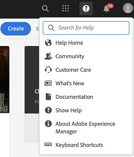

# [!DNL Adobe Experience Manager] Notas de versão do Service Pack 6.5 {#aem-service-pack-release-notes}

## Informações da versão {#release-information}

| Produtos | Adobe Experience Manager 6.5 |
| -------- | ---------------------------- |
| Versão | 6.5.6.0 |
| Tipo | Lançamento do Service Pack |
| Data | 03 de setembro de 2020 |
| URL de download | [Distribuição de software](https://experience.adobe.com/#/downloads/content/software-distribution/en/aem.html?package=/content/software-distribution/en/details.html/content/dam/aem/public/adobe/packages/cq650/servicepack/aem-service-pkg-6.5.6.zip) |

## O que está incluído no Adobe Experience Manager 6.5.6.0 {#what-s-included-in-aem}

O Adobe Experience Manager 6.5.6.0 é uma atualização importante que inclui novos recursos, melhorias importantes solicitadas pelo cliente e melhorias de desempenho, estabilidade e segurança, lançadas desde a disponibilização geral do lançamento do 6.5 em **abril de 2019**. Ele pode ser instalado no Adobe Experience Manager 6.5.

Os principais recursos e melhorias introduzidos no Adobe Experience Manager 6.5.6.0 incluem:

* A publicação das pastas de contribuição de ativos do Brand Portal para os Ativos do Experience Manager agora é suportada também pelo servidor proxy.

* Os grupos gerados automaticamente de pasta privada agora são limpos ao excluir a pasta privada em [!DNL Experience Manager Assets].

* As descrições dos modificadores no editor predefinido do [!UICONTROL Visualizador] de vídeo foram atualizadas em [!DNL Dynamic Media].

* Uma nova configuração de empresa é fornecida para refletir o status do [!DNL Dynamic Media] conector.

* As opções padrão para `test` e `aiprocess` são atualizadas para, `Thumbnail``Rasterize` anteriormente no Dynamic Media, garantir que os usuários precisam criar apenas miniaturas e ignorar a extração da página e a extração da palavra-chave.

* Preencha previamente um formulário adaptável no cliente.

* Integração do modelo de dados de formulário com APIs RESTful em um servidor com implementação SSL bidirecional.

* Aprimoramento do cache para páginas de formulário adaptáveis traduzidas.

* Suporte para Tags de texto da Adobe Sign no serviço de conversão automatizado da Forms.

* Suporte para protocolos SMB 2 e SMB 3.

* Suporte para converter formulários coloridos em formulários adaptáveis usando o serviço Automated Forms Conversion.

* O repositório integrado (Apache Jackrabbit Oak) foi atualizado para a versão 1.22.4.

Para obter uma lista completa dos recursos e aprimoramentos introduzidos no Experience Manager 6.5.6.0, consulte [Novidades do Adobe Experience Manager 6.5 Service Pack 6](new-features-latest-service-pack.md).

A seguir está a lista de correções fornecidas na versão [!DNL Experience Manager] 6.5.6.0.

### [!DNL Sites] {#sites-6560}

* Em [!DNL Sites] ou [!DNL Screens], selecione um Projeto e clique em [!UICONTROL Gerenciamento de publicações]. Os usuários não podem avançar no assistente [!UICONTROL Gerenciar publicação] devido a erros na interface do usuário. Especificamente, a opção [!UICONTROL Publicar] não funciona (NPR-34099).
* A posição do iParsys (Sistema de parágrafo herdado) não é revertida para a posição padrão original após desmarcar [!UICONTROL Cancelar herança] ou [!UICONTROL Desativar opções de herança] (NPR-34097).
* Se não `RolloutConfigManagerFactoryImpl` for possível carregar uma configuração de implementação, ela não tentará carregar as configurações ausentes. Ele retorna as configurações em cache (NPR-34092).
* No componente principal do texto, depois de usar a opção de edição HTML de origem, a classe da `em` tag é removida (NPR-34081).
* Após a atualização do Experience Manager 6.3.3 para o Experience Manager 6.5.3, o processo de implantação leva muito mais tempo e a implantação falha com um erro de tempo limite (NPR-34049).
* O `htmlwriter` não codifica os valores do atributo. A marcação presente na marcação XF é exportada com valores de atributo decodificados (ou seja, `"` em vez de `&#34`). Isso causa problemas no lado do Público alvo com o Visual Experience Composer que usa o XF exportado (NPR-34048).
* Ao mover páginas para dentro [!DNL Experience Manager Sites], aprimore o registro para capturar a falha de criação da versão com razão (NPR-34014).
* Se todo o texto [!DNL Rich Text Editor] for removido, a tag do parágrafo também será removida (NPR-33976).
* Quando a `siteadmin` página (na interface clássica) é aberta ou atualizada, as opções no `New` menu são desativadas (NPR-33949).

   

* Um [!DNL Content Fragment] não pode ser usado como um `TemplatedResource` dado que falha em `ContentFragmentUsePojo` (NPR-33911).
* Operações de movimentação síncronas e assíncronas podem levar a erros devido a transferências simultâneas. As operações de movimentação de página são restritas somente à movimentação síncrona. Evita a movimentação simultânea de páginas (NPR-33875).
* [!UICONTROL A operação Gerenciar publicação] para replicar o conteúdo da instância Autor para publicação falha e gera um erro de JavaScript (NPR-33872).
* Quando várias páginas ou ativos são selecionados para criar versões, a nova versão é criada somente para a última página ou ativo selecionado (NPR-33866).
* Mova uma página de blueprint com cópias online para outra pasta. Ao movê-la para a pasta original, a operação de movimentação falha sem nenhum erro (NPR-33864).
* Quando a ação de mover é usada para renomear uma página da Web no [!DNL Sites] Console, ela exibe duas caixas de diálogo sobrepostas na última etapa do assistente (NPR-33831).

   

* As propriedades `cq:acLinks` e para `cq:acUUID` [!DNL Adobe Campaign] na cópia são removidas durante a operação de copiar e colar (NPR-33794).
* Ao tentar um roll-out em uma página secundária de uma cópia ativa pai desanexada, [!DNL Experience Manager] gera uma exceção de ponteiro nula (NPR-33676).
* Os [!DNL RTE] componentes em um container de layout não ficam visíveis quando o container de layout é copiado e colado novamente na página. Os [!DNL RTE] componentes não são editáveis, mas são exibidos em uma atualização de página (NPR-33662).
* Ao redimensionar um componente de layout para diferentes pontos de interrupção (médio e grande), o layout não se comporta como esperado (NPR-33608).
* No modo de edição incorporado em [!DNL RTE], arrastar uma imagem não funciona para o componente de Texto (NPR-33602).
* É possível criar um componente em uma página do blueprint com o mesmo nome do nome da página. Durante a implantação, `_msm_moved` há sufixo para renomear o componente. O componente é movido para o final do Sistema [!UICONTROL de] parágrafo (NPR-33535).
* Quando offTime ou onTime estiver definido em muitas páginas ou ativos, ele consumirá muitos recursos e retardará o sistema durante a inicialização e o desligamento (NPR-33482).
* Um usuário com permissões CRUD em não `/content/experience-fragment` pode excluir uma pasta (NPR-33436).
* Você pode selecionar [!UICONTROL HTML e JSON] como a opção para o formato [!UICONTROL de exportação] Adobe Target em uma pasta pai na [!DNL Experience Fragments] seção. As mesmas propriedades são exibidas na interface habilitada para toque para as subpastas desta pasta pai. No entanto, no CRXDE, para `cq:adobeTargetExportFormat`, ele exibe apenas o HTML em vez de exibir `html,json` (NPR-33423).
* Publicar ou Cancelar publicação de um alias de página não é suportado. Remova a opção que parece alegar o contrário (NPR-33415).
* Uma tag específica pode ser movida de um local para outro em [!DNL Experience Manager]. Também pode ser aplicado a páginas diferentes antes e depois de mover. Ao editar as propriedades das páginas, a tag não é exibida para edição mesmo que a tag seja a mesma (NPR-33353).
* Um modelo de página não é renderizado corretamente quando um container de layout é excluído de um modelo que contém vários container de layout (NPR-33347).
* No editor de modelos, tente excluir um modelo usado por mais de 100000 páginas em `/content/`. Um erro é exibido sem nenhuma mensagem de erro (NPR-33312).
* O redirecionamento para a [!DNL Experience Manager] página com âncora não funciona na instância Autor, pois `PageRedirectServlets` coloca a string de query após um fragmento de URL ou uma âncora (NPR-34288).
* Criar uma marca em `/content/campaign` uma estrutura que não permite criar campanhas. [!UICONTROL A opção Criar marca] deixa a marca recém-criada sem a capacidade de criar [!UICONTROL Ofertas e Atividades] , pois não há opção de [!UICONTROL criação] (NPR-34113).
* Você pode suspender a ocorrência [!DNL Live Copy] de uma página e a herança será quebrada como visto no modo Editor. Nas propriedades da página, o ícone que representa a herança indica incorretamente que a herança existe e não está quebrada (NPR-34017).
* As páginas com muitas referências não podem ser movidas de forma assíncrona e, às vezes, a operação de movimentação falha (CQ-4297969).
* Uma página da Web com `/` caractere no URL não responde durante a criação. Quando um componente é adicionado durante a criação, o uso da CPU aumenta e o navegador para de responder (CQ-4295749).
* No modo de navegação, o NVDA não narra um valor selecionado na opção de menu Tipo/Tamanho. O foco visual não está no elemento selecionado. O usuário que depende de um leitor de tela não pode usar o modo de navegação (CQ-4294993).
* Ao criar uma página da Web, os usuários podem selecionar o modelo Página [!UICONTROL de] conteúdo. Na guia Mídia  social, os usuários selecionam uma variação [!UICONTROL XF]preferencial. Para selecionar um Fragmento de experiência no modo de navegação NVDA, os usuários não podem usar teclas de teclado (CQ-4292669).
* Atualização da biblioteca handlebars para a versão v4.7.3 mais segura (NPR-34484).

### [!DNL Assets] {#assets-6560}

**Aprimoramentos de acessibilidade nos ativos Experience Manager**

* Os usuários agora podem acessar e focar as opções interativas da interface do usuário na lista de [!UICONTROL Referências] de ativos usando teclas de teclado (NPR-34115).

* O leitor de tela agora anuncia as opções no filtro de pesquisa como acordeões expansíveis (NPR-34104).

* A página de pesquisa e a página de resultados de pesquisa agora têm títulos mais informativos para melhor compreensão dos usuários de leitores de tela (NPR-34093).

* Os leitores de tela agora anunciam as opções para excluir as tags selecionadas na guia [!UICONTROL Básico] dos botões de propriedades do ativo para excluir as tags selecionadas (NPR-33972).

* Os elementos em cada linha na visualização da lista agora são anunciados corretamente como os elementos da mesma linha pelos leitores de tela (NPR-33932).

* O foco do usuário ao navegar usando a tecla Tab agora é movido corretamente para a opção Fechar na pré-visualização da versão (NPR-33863).

* O foco do usuário agora se move corretamente para o ícone de pesquisa depois que o Omnisearch é fechado (NPR-33705).

* As opções acionáveis da interface do usuário agora têm foco visual mais proeminente com contraste aprimorado quando focadas no uso de teclas do teclado. Portanto, os usuários de teclado com visão agora podem diferenciar as áreas focadas (NPR-33542).

* A funcionalidade de arrastar usando o teclado agora funciona corretamente no Editor [!UICONTROL de Schemas de] Metadados no modo de navegação do leitor de tela (CQ-4296326).

* Na caixa de diálogo de compartilhamento de links, ao navegar no modo de navegação, os leitores de tela,

   * agora, não narre as informações da tabela assim que a caixa de diálogo for carregada.

   * pode navegar até todas as sugestões automáticas listadas.

   * agora narrar as sugestões automáticas exibidas para [!UICONTROL Adicionar endereço de email/pesquisa] (CQ-4294232).

* O uso da tecla Esc para remover os ícones de ação rápida da visualização em miniatura não remove mais o foco do teclado do último item focado (CQ-4293554).

* O leitor de tela agora anuncia alternativas em texto, que retratam sua funcionalidade, para ícones (como chevrons) em vez de seus nomes literais (CQ-4272943).

* O foco do teclado agora é movido com êxito para [!UICONTROL Flyout], [!UICONTROL InlineZoom], [!UICONTROL Shoppable_Banner], [!UICONTROL Zoom_escuro], [!UICONTROL Zoom_light]  , ZoomVertical_blackOpções de ZoomVertical_light ao navegar usando a tecla Tab do teclado nos detalhes do ativoVisualizadoresDynamic Media (CQ-4290605).

* [!UICONTROL A opção Salvar e fechar] na página [!UICONTROL Propriedades] do ativo agora pode ser acessada usando teclas de teclado (NPR-34107).

* Mensagens de erro devido a combinações incorretas de nome de usuário e senha na página de logon agora são anunciadas pelos leitores de tela toda vez que o erro ocorre (NPR-33722).

* Na seção [!DNL Experience Manager] cabeçalho, ao navegar no modo de navegação, o leitor de tela agora anuncia:

   * sugestões editadas automaticamente em [!UICONTROL Tipo para pesquisar] no Omnisearch.

   * o estado conforme expandido ou recolhido para [!UICONTROL Soluções], [!UICONTROL Ajuda], [!UICONTROL Caixa de entrada] e opções [!UICONTROL de usuário] .

   * a mensagem de status [!UICONTROL Pesquisando a Ajuda] que é exibida quando o usuário digita uma string de pesquisa no campo [!UICONTROL Pesquisar por Ajuda] na opção [!UICONTROL Ajuda] .

   

   *Figura:[!UICONTROL Procurar ajuda]no menu[!UICONTROL Ajuda]*

   * a mensagem de erro se um valor incorreto for inserido no campo [!ICONTROL Representar como] na opção [!UICONTROL Usuário] e o foco for movido corretamente para o campo de texto (NPR-33804).

   

   *Figura:[!UICONTROL Representar como]campo no menu[!UICONTROL Usuário]no cabeçalho*

* Agora, o usuário pode mover o foco usando as teclas do teclado dentro de:

   * [!UICONTROL Pesquisar/Adicionar endereço] de email na caixa de diálogo Compartilhamento [!UICONTROL de] links.

   * [!UICONTROL Adicione o campo Usuário ou Grupo] em Grupo [!UICONTROL de usuários] fechado na guia [!UICONTROL Permissões] das [!UICONTROL Propriedades] da pasta (NPR-34452).

**Problemas corrigidos nos ativos Experience Manager**

[!DNL Adobe Experience Manager] 6.5.6.0 Os ativos fornecem correções para os seguintes problemas:

* A pré-visualização de ativos de garantia de marketing (como Brochure, Flyer e Business Card) criados usando o modelo [!DNL Adobe InDesign] (INDD) não retém quebras de linha e quebras de parágrafo (NPR-34268).

* A extração de texto para os arquivos PDF carregados não funciona e a pesquisa de texto completo por algumas palavras em um arquivo PDF não consegue obter esse arquivo PDF (NPR-34164).

   >[!NOTE]
   >Para fazer essa correção funcionar, reinicie a instância do Adobe Experience Manager após instalar o Service Pack 6.5.6.0.

* A linha do tempo de ativos de várias páginas exibe anotações aplicadas a todos os subativos ao navegar pelo ativo na visualização da Linha do tempo, em vez de exibir as anotações específicas aos subativos específicos (NPR-34100).

* As pastas de ativos não serão publicadas usando a opção [!UICONTROL Gerenciar publicação] se as pastas contiverem recursos nos formatos de arquivo JavaScript, CSS ou JSON (NPR-34090).

* Desmarcar ou remover as tags ou filtros aplicadas no Omnisearch executa o query de pesquisa várias vezes, o que leva a um aumento no tempo de pesquisa (NPR-34078).

* Na visualização do cartão quando um fluxo de trabalho (em um ativo em uma pasta) está em andamento ou pendente, a página é recarregada até que o fluxo de trabalho seja concluído ou encerrado. Portanto, os autores não podem trabalhar nesses ativos na pasta para a qual têm de rolar para baixo (NPR-33986).

* Se o usuário mover um ativo publicado para um novo local, o ativo será republicado mesmo se a opção [!UICONTROL Republicar] estiver desmarcada. Isso resulta em muitos ativos órfãos que ficam na instância de publicação. O comportamento padrão, no entanto, é que a operação de movimentação em um ativo publicado automaticamente a despublica; esse ativo será republicado se o autor selecionar a opção [!UICONTROL Republicar] ao mover o ativo (NPR-33934).

* A página [!UICONTROL Mover ativos] para ativos em coleções não carrega todo o conteúdo HTML, como a opção [!UICONTROL Ajustar/Republicar] . Portanto, os usuários não podem concluir a operação de movimentação (NPR-33860).

* Mover um ativo e adicionar caracteres especiais no nome e no título dos ativos movidos cria uma pasta extra (com o mesmo nome) no novo local do ativo (NPR-33826).

* [!UICONTROL O botão Download] de um ativo é desativado quando a opção [!UICONTROL Email] é selecionada na caixa de diálogo [!UICONTROL Download] (NPR-33730).

* O erro &quot;Request-URI too long&quot; (Solicitação de URI muito longa) é observado na execução de operações em massa em ativos, como edição de metadados em massa (NPR-33723).

* Um erro de JavaScript é observado e os usuários não podem selecionar ou excluir as opções geradas no campo [!UICONTROL Suspenso] ao [!UICONTROL adicionar pela funcionalidade de caminho] JSON no Editor [!UICONTROL de formulário de Schema de Metadados da]Pasta, se o arquivo JSON carregado tiver espaço ou caracteres especiais no valor (NPR-33712).

* As representações estáticas de ativos não são atualizadas quando o ativo é atualizado usando a opção [!UICONTROL Abrir] em [!DNL desktop app] ou [!DNL Adobe Asset Link] e são sincronizadas de volta para [!DNL Adobe Experience Manager] (CQ-4296279).

* Na visualização da coluna, a operação de movimentação em um conjunto de ativos também move os ativos que foram selecionados antes de usar a opção [!UICONTROL Filtro] para eles. Observe que o uso da opção [!UICONTROL Filtro] cancela a seleção anterior (NPR-34018).

* As barras invertidas são adicionadas antes de caracteres especiais em sugestões de ativos de pesquisa, que têm caracteres especiais em seu nome (NPR-33834).

* Ao criar regras para a lista suspensa no Formulário [!UICONTROL de Schema de Metadados de]Pasta, o usuário não pode selecionar valores na coluna Opções [!UICONTROL de] campo (CQ-4297530).

* A cópia em tempo de execução do modelo de fluxo de trabalho personalizado de ativos (criado em `/var/workflow/models/dam`) é excluída quando você instala o 6.5 Service Pack 5 ou versões anteriores no 6.5 GA (NPR-34532).

   >[!NOTE]
   >
   >A atualização para o [!DNL Experience Manager] 6.5 Service Pack 6 não recupera sua cópia em tempo de execução, se sua cópia em tempo de execução for excluída na instalação do [!DNL Experience Manager] 6.5 Service Pack 5 ou de versões anteriores no 6.5 GA. Para recuperar a cópia em tempo de execução, sincronize a cópia em tempo de design do modelo de fluxo de trabalho com a cópia em tempo de execução usando a API HTTP:
   `<designModelPath>/jcr:content.generate.json`.

**Problemas corrigidos no Dynamic Media**

* Se o usuário definir as configurações de codificação nas edições após a criação do perfil de vídeo, as configurações de recorte inteligente serão removidas dos perfis de vídeo (CQ-4299177).

* Os ativos oscilam no carregamento da página quando o usuário alterna entre as opções do painel lateral (por exemplo, [!UICONTROL Visão geral], [!UICONTROL Linha do tempo], [!UICONTROL Visualizadores]) na página de detalhes do ativo (NPR-34235).

* Os seguintes problemas são observados com o trabalho de reprocessamento:

   * A ID do trabalho está ausente no identificador do trabalho retornado pelo trabalho de reprocessamento.

   * Reprocessar trabalho para registros de vídeo somente como nome de arquivo e não como caminho completo.

   * A tarefa de reprocessamento não tem a opção de definir o tipo de ativo como estático.

   * `ExcludeFromAVS` não é fornecida (CQ-4298401).

* A funcionalidade Recorte inteligente falha com erro quando o perfil de imagem é adicionado a uma pasta com várias (por exemplo, 11) proporções (NPR-34082).

* O fluxo de trabalho de ativos de atualização do DAM é acionado quando o usuário rola para baixo na página Arquivo [!UICONTROL de] fluxo de trabalho na guia [!UICONTROL Fluxo de trabalho] em [!UICONTROL Ferramentas] na [!DNL Adobe Experience Manager] configuração com o Dynamic Media Scene7 (CQ-4299727).

* Os símbolos na guia [!UICONTROL Comportamento] do Editor [!UICONTROL de predefinições do] visualizador não estão localizados (CQ-4299026).

* A visualização principal exibe uma imagem em layout incorreto que não se encaixa no visualizador, se o visualizador estiver no modo responsivo (CQ-4298293).

* As alterações nas predefinições de imagens no [!UICONTROL Adobe Experience Manager] não são sincronizadas com o Scene7 Publishing System (CQ-4299713).

### [!DNL Commerce] {#commerce-6560}

* Os links para ativos de produtos não são refatorizados quando os ativos são movidos (NPR-34098).

### Plataforma {#platform-6560}

* Não é possível baixar registros usando a ferramenta Diagnóstico em uma instância de Experience Manager atualizada (NPR-34336).
* A atualização falha com um erro devido às dependências em uma versão específica do pacote de `cq-wcm-api` fundação (CQ-4300520).
* Os valores padrão para as configurações de Tempo limite **[!UICONTROL do]** Connect e Tempo limite do **[!UICONTROL soquete]** para a configuração do Agente padrão (publicação) não são especificados (NPR-33707).
* As atualizações da configuração de mapeamento em `/etc/map.publish` não refletem nas páginas do site (NPR-34015).
* [A documentação](https://helpx.adobe.com/experience-manager/6-5/sites/developing/using/reference-materials/javadoc/com/day/cq/tagging/package-summary.html) de referência da API não inclui a documentação do `com.day.cq.tagging` pacote (CQ-4295864).

### Interface do usuário {#ui-6560}

* A interface do navegador de descarga não exibe todos os tópicos de trabalho (NPR-34308).
* A interface do navegador de configuração não exibe todas as configurações (NPR-33644).
* Ao pressionar a `Esc` tecla ao procurar usuários para representar, a caixa de diálogo **[!UICONTROL Usuário]** é fechada em vez da lista do usuário (NPR-34084).

### Integrações {#integrations-6560}

* Atividades com nomes longos não são sincronizadas com [!DNL Adobe Target] (NPR-34254).

### Projetos de tradução {#translation-6560}

* Um projeto de tradução não é criado se o usuário `authorizableID` incluir caracteres especiais (NPR-33828).

### Sling {#sling-6560}

* A Verificação de integridade e o Detector de padrão têm funcionalidade sobreposta. Como resultado, a verificação de integridade é removida do produto (NPR-33928).

### WCM {#wcm-6560}

* Componentes básicos - Quando você adiciona um componente de imagem de base a uma página e faz referência a uma imagem, a `Undo` operação não funciona (NPR-34516).

* Não é possível usar a operação Mover página (CQ-4303028).

### [!DNL Communities] {#communities-6560}

* O compartilhamento de uma publicação em redes sociais está mostrando uma opção obsoleta do Google+ (NPR-33877).

* O membro da comunidade não pode modificar o modelo de grupo ou outras configurações de Função de grupo (NPR-33530).

* As tags de hiperlink em imagens não são geradas corretamente em uma publicação do fórum (NPR-33464).

* As falhas de acessibilidade são identificadas no recurso Atribuição da comunidade (NPR-33442).

* Os usuários existentes de um grupo da comunidade adicionados por meio do Admin Console são removidos da lista do usuário em qualquer modificação no console do grupo da comunidade (NPR-34315).

<!--
* Tag filters are vulnerable to sensitive information disclosure (NPR-33868).
-->

### [!DNL Forms] {#forms-6560}

>[!NOTE]
>
>[!DNL Experience Manager] O Service Pack não inclui correções para [!DNL Forms]. They are delivered using a separate [!DNL Forms] add-on package. In addition, a cumulative installer is released that includes fixes for [!DNL Experience Manager Forms] on JEE. For more information, see [Install AEM Forms add-on](#install-aem-forms-add-on-package) and [Install AEM Forms on JEE](#install-aem-forms-jee-installer).

**Formulários adaptáveis**

* Quando há um fragmento de formulário adaptável ausente, o formulário adaptável falha na renderização (NPR-34302).

* A descrição do conteúdo da ajuda para campos de formulário adaptáveis exibe uma tag HTML de parágrafo (NPR-34116).

* Quando você seleciona a propriedade **[!UICONTROL Revalidate on Server]** , o formulário adaptativo falha ao enviar (NPR-33876).

* A ação de envio de **[!UICONTROL Enviar para ponto de extremidade]** REST não funciona para um formulário adaptável (CQ-4299044).

* Acessibilidade: Quando você tenta enviar um formulário adaptável sem fazer upload de um anexo para um campo obrigatório, o foco não muda automaticamente para o campo de anexo (CQ-4298065).

* Ao adicionar linhas a uma tabela de um formulário adaptável, as opções **[!UICONTROL Adicionar ao início]** e **[!UICONTROL Adicionar ao fim]** não exibem os resultados apropriados (CQ-4297511).

* O script [!UICONTROL Value Commit] é acionado incorretamente, resultando em perda de dados em um formulário adaptável (CQ-4296874).

* O Seletor de datas não funciona corretamente para formulários adaptativos localizados (NPR-34333).

* Quando há um sublinhado ou espaço no nome do arquivo, você não pode anexar o arquivo a um formulário adaptável (CQ-4301001).

* Quando um painel repetível aninhado tem mais ocorrências do que seu pai, todas as ocorrências desse painel repetível aninhado não conseguem preencher previamente (NPR-33666).

* Os formulários adaptáveis têm alguns resolvedores de recursos abertos. Isso resulta em falhas de envio. O problema ocorre intermitentemente (CQ-4299407).

**Fluxo de trabalho**

* Quando um aprovador de fluxo de trabalho carrega um anexo, o anexo é renomeado para `undefined` (NPR-33699).

* [!DNL Experience Manager] Falha na operação de Expurgação do Fluxo de Trabalho e exibe a seguinte mensagem de erro (NPR-33575):

   `java.lang.UnsupportedOperationException: The query read more than 500000 nodes in memory`

* [!DNL Experience Manager Forms] o aplicativo para [!DNL Windows] parar de responder após enviar um formulário (NPR-34409).

* Quando você instala AEM Service Pack, a lista **Para** fazer dos itens não é exibida como links. O texto dos itens **Para fazer** incluem tags HTML (NPR-34317).

**Comunicação interativa**

* Quando você inclui um fragmento de documento de texto com componentes repetitivos aninhados, a Comunicação interativa falha ao salvar (NPR-34095).

**Gerenciamento de correspondência**

* Quando você modifica um fragmento de documento de texto que inclui valores de dicionário de dados, a interface do usuário do agente para de responder (NPR-33930).

* Copiar e colar conteúdo de um [!DNL Microsoft Word] documento em um fragmento de documento de texto em uma carta resulta em problemas de formatação (NPR-33536).

**Serviços de documentação**

* Ao gerar um arquivo PDF a partir de um arquivo XDP usando os serviços de Saída e Forms, isso resulta em texto ausente e sobreposto (NPR-34237, CQ-4299331).

* Quando você converte um arquivo HTML em PDF, o `MaxReuseCount` atributo não é configurável (NPR-33470).

* Ao baixar um arquivo PDF que inclui recursos interativos de Extensões de Reader, não é possível adicionar um anexo ao arquivo PDF usando [!DNL Adobe Reader] (NPR-33729).

**Segurança de documentos**

* Não é possível executar a operação Assinar com certificados baseados em HSM em um arquivo PDF após a instalação do [!DNL Experience Manager] Service Pack (NPR-34310).

**Designer**

* Não é possível abrir XForms no Designer versão 6.5.x (CQ-4295322).

* Quando você abre o Designer, a tela Bem-vindo exibe um ano incorreto (CQ-4295289).

* Quando você instala [!DNL Acrobat DC] no servidor, a opção **[!UICONTROL Distribuir formulário]** fica inativa (CQ-4296304).

## Install 6.5.6.0 {#install}

**Requisitos de configuração**

* AEM 6.5.6.0 requires AEM 6.5. See [upgrade documentation](/help/sites-deploying/upgrade.md) for detailed instructions.
* O download do service pack está disponível na Adobe [Software Distribution](https://experience.adobe.com/#/downloads/content/software-distribution/en/aem.html).
* Em uma implantação com MongoDB e várias instâncias, instale o AEM 6.5.6.0 em uma das instâncias do autor usando o Gerenciador de pacotes.
* Antes de instalar, faça um instantâneo ou um backup atualizado da instância AEM.
* Reinicie a instância antes da instalação. Embora isso seja necessário apenas quando a instância ainda está no modo de atualização (e esse é o caso quando a instância foi atualizada de uma versão anterior), é recomendável se a instância estava em execução por um período mais longo.

>[!NOTE]
>
>O Adobe não recomenda remover ou desinstalar o pacote Adobe Experience Manager 6.5.6.0.

### Instale o Service Pack {#install-service-pack}

Execute as seguintes etapas para instalar o Service Pack em uma instância Adobe Experience Manager 6.5 existente:

1. Baixe o service pack da [Software Distribution (Distribuição](https://experience.adobe.com/#/downloads/content/software-distribution/en/aem.html?package=/content/software-distribution/en/details.html/content/dam/aem/public/adobe/packages/cq650/servicepack/aem-service-pkg-6.5.6.zip)de software).

1. Abra o Gerenciador de pacotes e clique em **[!UICONTROL Carregar pacote]** para fazer upload do pacote. Para saber como usá-lo, consulte [Gerenciador](https://docs.adobe.com/content/help/en/experience-manager-65/administering/contentmanagement/package-manager.html)de pacotes.

1. Select the package and click **[!UICONTROL Install]**.

>[!NOTE]
>
>Às vezes, a caixa de diálogo na interface do usuário do Package Manager sai durante a instalação do service pack. O Adobe recomenda que você aguarde a estabilização dos registros de erros antes de acessar a implantação. Aguarde os registros específicos relacionados à desinstalação do pacote do atualizador antes de ter certeza de que as instalações foram bem-sucedidas. Typically, this happens on [!DNL Safari] but can intermittently happen on any browser.

**Instalação automática**

Há duas maneiras de instalar automaticamente o Adobe Experience Manager 6.5.6.0 em uma instância em funcionamento:

A. Coloque o pacote na `../crx-quickstart/install` pasta quando o servidor estiver disponível on-line. O pacote é instalado automaticamente.

B. Use a API [HTTP do Gerenciador](https://docs.adobe.com/content/docs/pt/crx/2-3/how_to/package_manager.html)de pacotes. Use `cmd=install&recursive=true` para que os pacotes aninhados sejam instalados.

>[!NOTE]
>
>O Adobe Experience Manager 6.5.6.0 não suporta a instalação do Bootstrap.

**Validar instalação**

1. A página de informações do produto (`/system/console/productinfo`) exibe a string da versão atualizada `Adobe Experience Manager (6.5.6.0)` em Produtos instalados.

1. All OSGi bundles are either **[!UICONTROL ACTIVE]** or **[!UICONTROL FRAGMENT]** in the OSGi Console (Use Web Console: `/system/console/bundles`).

1. The OSGI bundle `org.apache.jackrabbit.oak-core` is version 1.22.3 or higher (Use Web Console: `/system/console/bundles`).

Para conhecer as plataformas certificadas para trabalhar com esta versão, consulte os requisitos [](/help/sites-deploying/technical-requirements.md)técnicos.

### Instalar o pacote suplementar do Adobe Experience Manager Forms {#install-aem-forms-add-on-package}

>[!NOTE]
>
>Pule se você não estiver usando o AEM Forms. Correções no Adobe Experience Manager Forms são fornecidas por meio de um pacote complementar separado.

1. Verifique se você instalou o Adobe Experience Manager Service Pack.
1. Download the corresponding Forms add-on package listed at [AEM Forms releases](https://helpx.adobe.com/br/aem-forms/kb/aem-forms-releases.html) for your operating system.
1. Install the Forms add-on package as described in [Installing AEM Forms add-on packages](../forms/using/installing-configuring-aem-forms-osgi.md#install-aem-forms-add-on-package).

### Instalar o Adobe Experience Manager Forms no JEE {#install-aem-forms-jee-installer}

>[!NOTE]
>
>Pule se você não estiver usando o AEM Forms no JEE. Correções no Adobe Experience Manager Forms em JEE são entregues por meio de um instalador separado.

For information about installing the cumulative installer for Experience Manager Forms on JEE and post-deployment configuration, see the [release notes for patch 0018](jee-patch-installer-65.md).

### UberJar {#uber-jar}

O UberJar para Experience Manager 6.5.6.0 está disponível no repositório [do](https://repo.maven.apache.org/maven2/com/adobe/aem/uber-jar/6.5.6/)Adobe Public Maven.

Para usar o UberJar em um projeto Maven, consulte [como usar o UberJar](/help/sites-developing/ht-projects-maven.md) e incluir a seguinte dependência no POM do projeto:

```shell
<dependency>
      <groupId>com.adobe.aem</groupId>
      <artifactId>uber-jar</artifactId>
      <version>6.5.6</version>  
      <scope>provided</scope>
</dependency>
```

## Recursos obsoletos {#removed-deprecated-features}

Esta seção lista recursos e recursos que foram marcados como obsoletos com o AEM 6.5.6.0. Os recursos que estão planejados para serem removidos em uma versão futura são definidos como obsoletos primeiro, com uma opção alternativa a ser usada.

Recomenda-se que os clientes revisem se utilizam o recurso ou a capacidade em sua implantação atual e façam planos para alterar sua implementação para usar a opção alternativa.

| Área | Recurso | Substituição |
|---|---|---|
| Integrações | A tela Aceitação **[!UICONTROL dos serviços da]** AEM Cloud está obsoleta. Com a integração de AEM e Público alvo atualizada no AEM 6.5 para suportar a API do Target Standard, que usa autenticação via Adobe IMS e E/S, e a função crescente de inicialização de Adobe para instrumentar AEM páginas para análise e personalização, o assistente de aceitação se tornou funcionalmente irrelevante. | Configure as conexões do sistema, a autenticação Adobe IMS e as integrações de E/S de Adobe por meio dos respectivos serviços em nuvem do AEM. |
| Conectores | O Conector JCR do Adobe para Microsoft SharePoint 2010 e Microsoft SharePoint 2013 está obsoleto para o AEM 6.5. | N/A |

## Problemas conhecidos {#known-issues}

* Se você instalar o [!DNL Experience Manager] 6.5 Service Pack 5 ou versões anteriores no GA 6.5, a cópia em tempo de execução do modelo de fluxo de trabalho personalizado de ativos (criado em `/var/workflow/models/dam`) será excluída.
Para recuperar sua cópia em tempo de execução, o Adobe sugere sincronizar a cópia em tempo de design do modelo de fluxo de trabalho personalizado com sua cópia em tempo de execução usando a API HTTP:
   `<designModelPath>/jcr:content.generate.json`.

* Entre em contato com o Suporte ao Adobe se tiver problemas ao editar e criar regras em cascata no Schema de Metadados da [!UICONTROL Pasta Editor] Forms e no Editor [!UICONTROL de Forms de Schema de] Metadados usando a caixa de diálogo [!UICONTROL Definir regra] . Observe que as regras que já foram criadas e salvas estão funcionando como esperado.

* Se uma pasta na hierarquia for renomeada [!DNL Experience Manager Assets] e a pasta aninhada que contém um ativo for publicada, o título da pasta não será atualizado [!DNL Brand Portal][!DNL Brand Portal] até que a pasta raiz seja publicada novamente.

* Quando um usuário seleciona configurar um campo pela primeira vez em um formulário adaptável, a opção para salvar uma configuração não é exibida no Navegador de propriedades. Selecionar para configurar outro campo do formulário adaptável no mesmo editor resolve o problema.

* Se o Assistente de configuração [!UICONTROL de ativos] conectados retornar uma mensagem de erro 404 após a instalação, reinstale manualmente os pacotes `cq-remotedam-client-ui-content` e `cq-remotedam-client-ui-components` o usando o Gerenciador de pacotes.

* Os seguintes erros e mensagens de aviso podem ser exibidos durante a instalação do AEM 6.5.x.x:
   * &quot;Quando a integração do Target é configurada no AEM usando a API do Target Standard (autenticação IMS), a exportação de Fragmentos de experiência para o Target resulta na criação de tipos de ofertas incorretos. Em vez do tipo &quot;Fragmento de experiência&quot;/fonte &quot;Adobe Experience Manager&quot;, o Target cria várias ofertas com o tipo &quot;HTML&quot;/fonte &quot;Adobe Target Classic&quot;.
   * `com.adobe.granite.maintenance.impl.TaskScheduler`: Nenhuma janela de manutenção encontrada em granito/operações/manutenção.
   * A validação do lado do servidor do Formulário adaptável falha quando funções de agregação, como SUM, MAX e MIN são usadas. CQ-4274424
   * `com.adobe.granite.maintenance.impl.TaskScheduler` - Não foram encontradas janelas de manutenção no granito/operações/manutenção.
   * O ponto de acesso em uma imagem interativa do Dynamic Media não é visível ao visualizar o ativo por meio do visualizador de banner que pode ser comprado.

## OSGi bundles and content packages included {#osgi-bundles-and-content-packages-included}

Os seguintes documentos de texto listam os pacotes OSGi e os Pacotes de conteúdo incluídos no AEM 6.5.6.0:

* [Lista de pacotes OSGi incluídos no AEM 6.5.6.0](assets/6560_bundles.txt)

* [Lista de pacotes de conteúdo incluídos no AEM 6.5.6.0](assets/6560_packages.txt)

## Restricted sites {#restricted-sites}

Estes sites estão disponíveis somente para clientes. Se você for um cliente e precisar de acesso, entre em contato com o gerente de contas da Adobe.

* [Baixe o produto em licensing.adobe.com](https://licensing.adobe.com/)
* [Entre em contato com o suporte](https://docs.adobe.com/content/help/en/customer-one/using/home.html)ao cliente Para obter mais informações sobre como acessar o portal de suporte, consulte [Acesso ao portal](https://helpx.adobe.com/experience-manager/kb/accessing-aem-support-portal.html)de suporte.

>[!MORELIKETHIS]
>
>* [Notas de versão do AEM 6.5](/help/release-notes/release-notes.md)
>* [Página do produto AEM](https://www.adobe.com/br/marketing/experience-manager.html)
>* [Documentação do AEM 6.5](https://helpx.adobe.com/support/experience-manager/6-5.html)
>* Subscribe to [Adobe priority product updates](https://www.adobe.com/subscription/priority-product-update.html)

