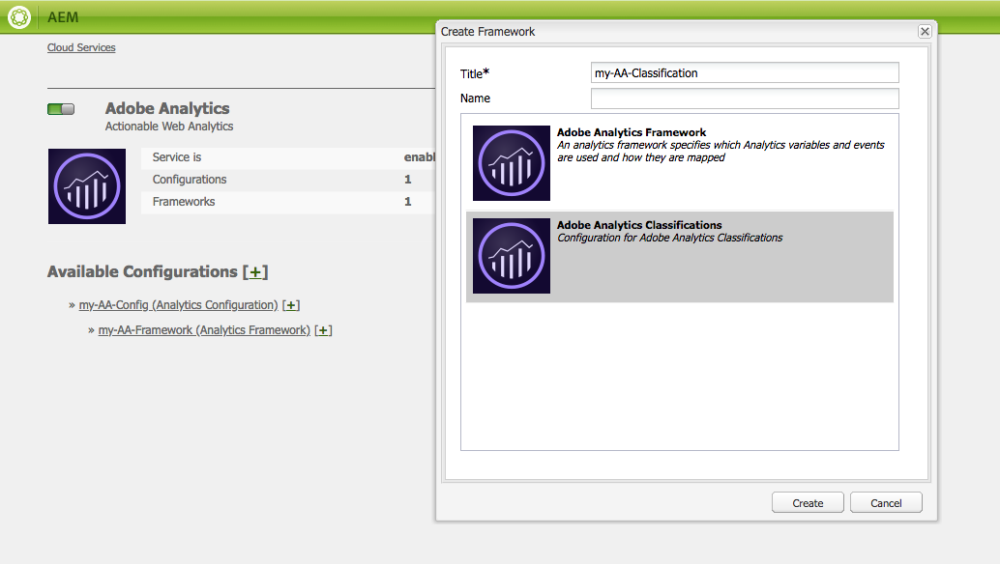

# Adobe Classifications{#adobe-classifications}

As Classificações da Adobe exportam dados de classificações para o [Adobe Analytics](/help/sites-administering/adobeanalytics.md) de maneira programada. O exportador é uma implementação de um **com.adobe.cq.scheduled.export.Exporter**.

Para configurar isso:

1. Usando a **Navegação**, selecione **Ferramentas**, Serviços **** em nuvem e Serviços **** herdados em nuvem.
1. Role até **Adobe Analytics** e selecione **Mostrar configurações**.
1. Clique no link **[+]** ao lado da configuração do Adobe Analytics.

1. Na caixa de diálogo **Criar estrutura** :

   * Especifique um **Título**.
   * Opcionalmente, você pode especificar o **Nome**, para o nó que armazena os detalhes da estrutura no repositório.
   * Selecionar classificações **do Adobe Analytics**
   E clique em **Criar**.

   

1. A caixa de diálogo Configurações **de** classificações é aberta para edição.

   

   As propriedades incluem:

   | **Texto** | **Descrição** |
   |---|---|
   | Ativado | Selecione **Sim** para ativar as configurações de Classificações da Adobe. |
   | Substituir quando houver conflito | Selecione **Sim** para substituir qualquer colisão de dados. Por padrão, isso é definido como **Não**. |
   | Exclusão processada | Se estiver definido como **Sim**, excluirá os nós processados após serem exportados. O padrão é **Falso**. |
   | Exportar descrição da tarefa | Insira uma descrição para o trabalho de Classificações da Adobe. |
   | Email de notificação | Insira um endereço de email para a notificação de Classificações da Adobe. |
   | Conjunto de relatórios | Informe o Conjunto de relatórios para o qual executar a tarefa de importação. |
   | Conjunto de Dados | Informe a ID de relação do conjunto de dados para executar o trabalho de importação. |
   | Transformador | No menu suspenso, selecione uma implementação de transformador. |
   | Fonte de Dados | Navegue até o caminho para o container de dados. |
   | Exportar programação | Selecione o agendamento para a exportação. O padrão é a cada 30 minutos. |

1. Click **OK** to save your settings.

## Modificando o tamanho da página {#modifying-page-size}

Os registros são processados em páginas. Por padrão, as Classificações da Adobe criam páginas com um tamanho de página de 1000.

Uma página pode ter no máximo 25000 páginas por definição em Classificações da Adobe e pode ser modificada no console do Felix. Durante a exportação, as Classificações da Adobe bloqueiam o nó de origem para evitar modificações simultâneas. O nó é desbloqueado após a exportação, por erro ou quando a sessão é fechada.

Para alterar o tamanho da página:

1. Navegue até o console do OSGI em **https://&lt;host>:&lt;porta>/system/console/configMgr** e selecione Exportador **de classificações do** Adobe AEM.

   

1. Atualize o Tamanho **da página de** exportação, conforme necessário, e clique em **Salvar**.

## SAINTDefaultTransformer {#saintdefaulttransformer}

>[!NOTE]
>
>As Classificações da Adobe eram anteriormente conhecidas como Exportador SAINT.

Um exportador pode utilizar um Transformador para transformar os dados de exportação para um formato específico. Para Classificações da Adobe, foi fornecida uma subinterface `SAINTTransformer<String[]>` que implementa a interface Transformer. Essa interface é usada para restringir o tipo de dados ao `String[]` qual a API SAINT usa e para ter uma interface de marcador para localizar tais serviços para seleção.

Na implementação padrão SAINTDefaultTransformer, os recursos filho da origem do exportador são tratados como registros com nomes de propriedade como chaves e valores de propriedade como valores. A coluna **Chave** é adicionada automaticamente como primeira coluna - seu valor será o nome do nó. As propriedades namespaced (contendo `:`) são desconsideradas.

*Estrutura do nó:*

* id-classification `nt:unstructured`

   * 1 `nt:unstructured`

      * Produto = Meu nome do produto (string)
      * Preço = 120,90 (String)
      * Tamanho = M (String)
      * Cor = preto (string)
      * Cor^Código = 101 (String)

**Cabeçalho e registro SAINT:**

| **Chave** | **Produto** | **Preço** | **Tamanho** | **Cor** | **Cor^Código** |
|---|---|---|---|---|---|
| 1 | Meu nome do produto | 120.90 | M | black | 101 |

As propriedades incluem:

<table>
 <tbody>
  <tr>
   <td><strong>Caminho da propriedade</strong></td>
   <td><strong>Descrição</strong></td>
  </tr>
  <tr>
   <td>transformador</td>
   <td>Um nome de classe de uma implementação SAINTTransformer</td>
  </tr>
  <tr>
   <td>email</td>
   <td>Endereço de email de notificação.</td>
  </tr>
  <tr>
   <td>report suites</td>
   <td>IDs de conjunto de relatórios para executar o trabalho de importação. </td>
  </tr>
  <tr>
   <td>conjunto de dados</td>
   <td>ID de relação do conjunto de dados para executar o trabalho de importação. </td>
  </tr>
  <tr>
   <td>descrição</td>
   <td>Descrição do trabalho.   </td>
  </tr>
  <tr>
   <td>substituir</td>
   <td>Sinalizador para substituir colisões de dados. O padrão é <strong>falso</strong>.</td>
  </tr>
  <tr>
   <td>divisões de verificação</td>
   <td>Sinalize para verificar a compatibilidade dos conjuntos de relatórios. Default is <strong>true</strong>.</td>
  </tr>
  <tr>
   <td>deletprocessado</td>
   <td>Sinalizador para excluir os nós processados após a exportação. O padrão é <strong>falso</strong>.</td>
  </tr>
 </tbody>
</table>

## Automatizando a exportação de classificações da Adobe {#automating-adobe-classifications-export}

Você pode criar seu próprio fluxo de trabalho, de modo que qualquer nova importação inicie o fluxo de trabalho para criar os dados apropriados e estruturados corretamente em **/var/export/** para que possa ser exportado para as Classificações da Adobe.
