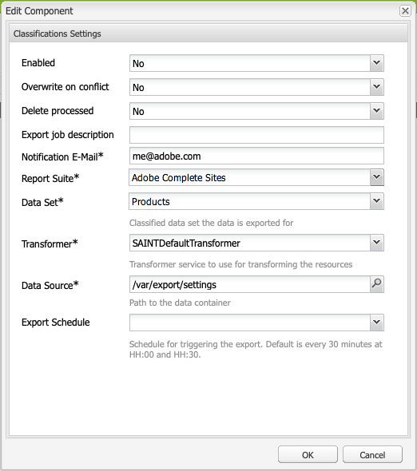

# Classificações de Adobe{#adobe-classifications}

Classificações de Adobe exportam dados de classificações para [Adobe Analytics](/help/sites-administering/adobeanalytics.md) de maneira programada. O exportador é uma implementação de **com.adobe.cq.scheduled.export.Exporter**.

Para configurar isso:

1. Usando **Navegação**, selecione **Ferramentas**, **Cloud Services** e, em seguida, **Cloud Services herdados**.
1. Role até **Adobe Analytics** e selecione **Mostrar configurações**.
1. Clique no link **[+]** ao lado da configuração do Adobe Analytics.

1. Na caixa de diálogo **Criar Estrutura**:

   * Especifique um **Título**.
   * Opcionalmente, você pode especificar **Name** para o nó que armazena os detalhes da estrutura no repositório.
   * Selecione **Classificações Adobe Analytics**

   E clique em **Criar**.

   

1. A caixa de diálogo **Configurações de classificações** é aberta para edição.

   

   As propriedades incluem:

   | **Texto** | **Descrição** |
   |---|---|
   | Ativado | Selecione **Yes** para ativar as definições de Classificações de Adobe. |
   | Substituir quando houver conflito | Selecione **Yes** para substituir qualquer colisão de dados. Por padrão, isso está definido como **No**. |
   | Exclusão processada | Se estiver definido como **Yes**, excluirá os nós processados após serem exportados. O padrão é **False**. |
   | Exportar descrição da tarefa | Informe uma descrição para o trabalho Classificações de Adobe. |
   | Email de notificação | Digite um endereço de email para a notificação de Classificações de Adobe. |
   | Conjunto de relatórios | Informe o Conjunto de relatórios para o qual executar a tarefa de importação. |
   | Conjunto de Dados | Informe a ID de relação do conjunto de dados para executar o trabalho de importação. |
   | Transformador | No menu suspenso, selecione uma implementação de transformador. |
   | Fonte de Dados | Navegue até o caminho para o container de dados. |
   | Exportar programação | Selecione o agendamento para a exportação. O padrão é a cada 30 minutos. |

1. Clique em **OK** para salvar suas configurações.

## Modificando o tamanho da página {#modifying-page-size}

Os registros são processados em páginas. Por padrão, as Classificações de Adobe criam páginas com um tamanho de página de 1000.

Uma página pode ter tamanho máximo de 25000, por definição em Classificações de Adobe e pode ser modificada no console do Felix. Durante a exportação, as Classificações de Adobe bloqueiam o nó de origem para impedir modificações simultâneas. O nó é desbloqueado após a exportação, por erro ou quando a sessão é fechada.

Para alterar o tamanho da página:

1. Navegue até o console OSGI em **https://&lt;host>:&lt;porta>/system/console/configMgr** e selecione **Adobe AEM Classificações Exportador**.

   

1. Atualize **Exportar tamanho da página** conforme necessário e clique em **Salvar**.

## SAINTDefaultTransformer {#saintdefaulttransformer}

>[!NOTE]
>
>Classificações de Adobe eram anteriormente conhecidas como Exportador de SAINT.

Um exportador pode utilizar um Transformador para transformar os dados de exportação para um formato específico. Para Classificações de Adobe, foi fornecida uma subinterface `SAINTTransformer<String[]>` que implementa a interface de Transformer. Essa interface é usada para restringir o tipo de dados a `String[]`, que é usada pela API SAINT e para ter uma interface de marcador para localizar tais serviços para seleção.

Na implementação padrão SAINTDefaultTransformer, os recursos filho da origem do exportador são tratados como registros com nomes de propriedade como chaves e valores de propriedade como valores. A coluna **Key** é adicionada automaticamente como primeira coluna - seu valor será o nome do nó. As propriedades namespaced (contendo `:`) não são consideradas.

*Estrutura do nó:*

* id-classification `nt:unstructured`

   * 1 `nt:unstructured`

      * Produto = Meu nome do produto (string)
      * Preço = 120,90 (String)
      * Tamanho = M (String)
      * Cor = preto (string)
      * Cor^Código = 101 (String)

**Cabeçalho e registro do SAINT:**

| **Chave** | **Produto** | **Preço** | **Tamanho** | **Cor** | **Cor^Código** |
|---|---|---|---|---|---|
| 1 | Meu nome do produto | 120,90 | M | black | 101 |

As propriedades incluem:

<table>
 <tbody>
  <tr>
   <td><strong>Caminho da propriedade</strong></td>
   <td><strong>Descrição</strong></td>
  </tr>
  <tr>
   <td>transformador</td>
   <td>Um nome de classe de uma implementação SAINTTransformer</td>
  </tr>
  <tr>
   <td>email</td>
   <td>Endereço de email de notificação.</td>
  </tr>
  <tr>
   <td>report suites</td>
   <td>IDs de conjunto de relatórios para executar o trabalho de importação. </td>
  </tr>
  <tr>
   <td>conjunto de dados</td>
   <td>ID de relação do conjunto de dados para executar o trabalho de importação. </td>
  </tr>
  <tr>
   <td>descrição</td>
   <td>Descrição do trabalho.   </td>
  </tr>
  <tr>
   <td>substituir</td>
   <td>Sinalizador para substituir colisões de dados. O padrão é <strong>false</strong>.</td>
  </tr>
  <tr>
   <td>divisões de verificação</td>
   <td>Sinalize para verificar a compatibilidade dos conjuntos de relatórios. O padrão é <strong>true</strong>.</td>
  </tr>
  <tr>
   <td>deletprocessado</td>
   <td>Sinalizador para excluir os nós processados após a exportação. O padrão é <strong>false</strong>.</td>
  </tr>
 </tbody>
</table>

## Automatizando a exportação de classificações Adobe {#automating-adobe-classifications-export}

Você pode criar seu próprio fluxo de trabalho, de modo que qualquer nova importação inicie o fluxo de trabalho para criar os dados apropriados e estruturados corretamente em **/var/export/** para que possa ser exportado para Classificações de Adobe.
