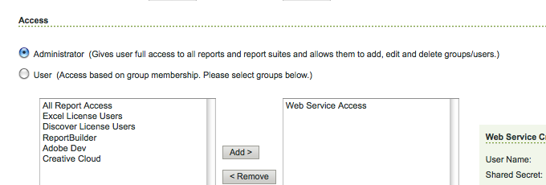

# Conectando-se ao Adobe Analytics e criando estruturas {#connecting-to-adobe-analytics-and-creating-frameworks}

Para rastrear dados da Web de suas páginas de AEM no Adobe Analytics, crie uma configuração dos Serviços Adobe Analytics Cloud e uma estrutura do Adobe Analytics:

* **Configuração do Adobe Analytics:** as informações sobre sua conta do Adobe Analytics. A configuração do Adobe Analytics permite AEM conexão com o Adobe Analytics. Crie uma configuração Adobe Analytics para cada conta que você usa.
* **Adobe Analytics Framework:** um conjunto de mapeamentos entre as propriedades do conjunto de relatórios Adobe Analytics e as variáveis CQ. Use uma estrutura para configurar como os dados do seu site preenchem seus relatórios do Adobe Analytics. As estruturas estão associadas a uma configuração Adobe Analytics. É possível criar várias estruturas para cada configuração.

Quando você associa uma página da Web a uma estrutura, a estrutura executa o rastreamento para essa página e para os descendentes dessa página. As visualizações de página podem ser recuperadas do Adobe Analytics e exibidas no console Sites.

## Pré-requisitos {#prerequisites}

### Conta Adobe Analytics {#adobe-analytics-account}

Para rastrear AEM dados no Adobe Analytics, é necessário ter uma conta Adobe Marketing Cloud Adobe Analytics válida.

A conta da Adobe Analytics precisa:

* Possuir privilégios de **Administrador**
* Seja atribuído ao grupo de usuários **Acesso ao serviço da Web**.

>[!CAUTION]
>
>Fornecer **privilégios de Administrador** (no Adobe Analytics) não é suficiente para permitir que um usuário se conecte de AEM ao Adobe Analytics. A conta também deve ter privilégios **Acesso ao Serviço Web**.

Antes de continuar, verifique se suas credenciais permitem que você faça logon na Adobe Analytics. Através de:

* [Login no Adobe Experience Cloud](https://login.experiencecloud.adobe.com/exc-content/login.html)

* [Login no Adobe Analytics](https://sc.omniture.com/login/)

### Configuração do AEM para usar seus data centers Adobe Analytics {#configuring-aem-to-use-your-adobe-analytics-data-centers}

A Adobe Analytics [data centers](https://developer.omniture.com/en_US/content_page/concepts-terminology/c-how-is-data-stored) coleta, processa e armazena dados associados ao seu conjunto de relatórios da Adobe Analytics. Você deve configurar AEM para usar o data center que hospeda seu conjunto de relatórios Adobe Analytics. A tabela a seguir lista os data centers disponíveis e seu URL.

| Centro de dados | URL |
|---|---|
| San Jose | https://api.omniture.com/admin/1.4/rest/ |
| Dallas | https://api2.omniture.com/admin/1.4/rest/ |
| Londres | https://api3.omniture.com/admin/1.4/rest/ |
| Cingapura | https://api4.omniture.com/admin/1.4/rest/ |
| Oregon | https://api5.omniture.com/admin/1.4/rest/ |

AEM usa o data center San Jose (https://api.omniture.com/admin/1.4/rest/) por padrão.

Use o [Console da Web para configurar o pacote OSGi](/help/sites-deploying/configuring-osgi.md#osgi-configuration-with-the-web-console) **Adobe AEM Cliente HTTP do Analytics**. Adicione o **URL do data center** para o data center que hospeda um conjunto de relatórios para o qual suas páginas AEM coletam dados.

1. Abra o console da Web no navegador da Web. ([https://localhost:4502/system/console/configMgr](https://localhost:4502/system/console/configMgr))
1. Digite suas credenciais para acessar o console.

   >[!NOTE]
   >
   >Entre em contato com o administrador do site para descobrir se você tem acesso a este console.

1. Selecione o item Configuração chamado **Adobe AEM Cliente HTTP do Analytics**.
1. Para adicionar o URL de um data center, pressione o botão + ao lado da lista **URLs** do Data Center e digite o URL na caixa.

1. Para remover um URL da lista, clique no botão - ao lado do URL.
1. Clique em Salvar.

## Configurando a conexão com o Adobe Analytics {#configuring-the-connection-to-adobe-analytics}

>[!CAUTION]
>
>Devido a alterações de segurança na API do Adobe Analytics, não é mais possível usar a versão do Activity Map incluída no AEM.
>
>O plug-in [ActivityMap fornecido pela Adobe Analytics](https://docs.adobe.com/content/help/br/analytics/analyze/activity-map/getting-started/get-started-users/activitymap-install.html) agora deve ser usado.

## Configuração para o Activity Map {#configuring-for-the-activity-map}

>[!CAUTION]
>
>Devido a alterações de segurança na API do Adobe Analytics, não é mais possível usar a versão do Activity Map incluída no AEM.
>
>O plug-in [ActivityMap fornecido pela Adobe Analytics](https://docs.adobe.com/content/help/en/analytics/analyze/activity-map/getting-started/get-started-users/activitymap-install.html) agora deve ser usado.

## Criação de um Adobe Analytics Framework {#creating-a-adobe-analytics-framework}

Para a ID do conjunto de relatórios (RSID) que você está usando, é possível controlar quais instâncias do servidor (autor, publicação ou ambas) contribuem com dados para o conjunto de relatórios:

* **Todos**: As informações do autor e da instância de publicação preenchem o Conjunto de relatórios.
* **Autor**: Somente as informações da instância do autor preenchem o Conjunto de relatórios.
* **Publicar**: Somente as informações da instância de publicação preenchem o Conjunto de relatórios.

>[!NOTE]
>
>A seleção do tipo de instância do servidor não restringe chamadas ao Adobe Analytics, mas controla quais chamadas incluem o RSID.
>
>Por exemplo, uma estrutura é configurada para usar o conjunto de relatórios *diiweretail* e o autor é a instância selecionada do servidor. Quando as páginas são publicadas junto com a estrutura, as chamadas ainda são feitas para a Adobe Analytics, no entanto, essas chamadas não contêm a RSID. Somente as chamadas da instância do autor incluem o RSID.

1. Usando **Navegação**, selecione **Ferramentas**, **Cloud Services** e, em seguida, **Cloud Services herdados**.
1. Role até **Adobe Analytics** e selecione **Mostrar configurações**.
1. Clique no link **[+]** ao lado da configuração do Adobe Analytics.

1. Na caixa de diálogo **Criar Estrutura**:

   * Especifique um **Título**.
   * Opcionalmente, você pode especificar **Name** para o nó que armazena os detalhes da estrutura no repositório.
   * Selecione **Adobe Analytics Framework**

   E clique em **Criar**.

   A estrutura é aberta para edição.

1. Na seção **Report Suites** do pod lateral (lado direito do painel principal), clique em **Adicionar item**. Em seguida, use o menu suspenso para selecionar a ID do conjunto de relatórios (por exemplo, `geometrixxauth`) com a qual a estrutura interagirá.

   >[!NOTE]
   >
   >O localizador de conteúdo à esquerda é preenchido com variáveis Adobe Analytics (Variáveis de SiteCatalyst) quando você seleciona uma ID de conjunto de relatórios.

1. Em seguida, use o menu suspenso **Run Mode** (ao lado da ID do Report Suite) para selecionar as instâncias do servidor para as quais deseja enviar informações para o Report Suite.

   

1. Para disponibilizar a estrutura na instância de publicação do site, na guia **Página** do sidekick, clique em **Ativar Estrutura.**

### Configuração das configurações do servidor para Adobe Analytics {#configuring-server-settings-for-adobe-analytics}

O sistema de estrutura permite alterar as configurações do servidor em cada estrutura do Adobe Analytics.

>[!CAUTION]
>
>Essas configurações determinam onde seus dados são enviados e como, portanto, é imperativo que você *não altere essas configurações* e permita que seu representante da Adobe Analytics os configure.

Start abrindo o painel. Pressione a seta para baixo ao lado de **Servidores**:

* **Servidor de controle**

   * contém o URL usado para enviar chamadas do Adobe Analytics

      * cname - o padrão é *nome da Empresa* da conta Adobe Analytics
      * d1 - corresponde ao data center para o qual as informações serão enviadas (pode ser d1, d2 ou d3)
      * sc.omtrdc.net - nome do domínio

* **Servidor de rastreamento protegido**

   * Tem os mesmos segmentos do servidor de rastreamento
   * Isso é usado para enviar dados de páginas seguras (https://)

* **Namespace do visitante**

   * A namespace determina a primeira parte do URL de rastreamento.
   * Por exemplo, alterar a namespace para **CNAME** fará com que as chamadas efetuadas para a Adobe Analytics se pareçam com **CNAME.d1.omtrdc.net** em vez do padrão.

## Associando uma página a um Adobe Analytics Framework {#associating-a-page-with-a-adobe-analytics-framework}

Quando uma página é associada a uma estrutura do Adobe Analytics, ela envia dados para a Adobe Analytics quando a página é carregada. As variáveis que a página preenche são mapeadas e recuperadas das variáveis do Adobe Analytics na estrutura. Por exemplo, visualizações de página são recuperadas do Adobe Analytics.

Os descendentes da página herdam a associação com a estrutura. Por exemplo, quando você associa a página raiz do site a uma estrutura, todas as páginas do site são associadas à estrutura.

1. No console **Sites**, selecione a página que deseja configurar com o rastreamento.
1. Abra o **[Propriedades da página](/help/sites-authoring/editing-page-properties.md)**, diretamente do console ou do editor de páginas.
1. Abra a guia** Cloud Services**.

1. Use o menu suspenso **Adicionar configuração** para selecionar **Adobe Analytics** nas opções disponíveis. Se a herança estiver no local, você precisará desativá-la antes que o seletor fique disponível.

1. O seletor suspenso para **Adobe Analytics** será anexado às opções disponíveis. Use essa opção para selecionar a configuração de estrutura necessária.

1. Selecione **Salvar e fechar**.
1. **** Publique a página para ativar a página e quaisquer configurações/arquivos conectados.
1. A etapa final é visitar a página na instância de publicação e procurar uma palavra-chave (por exemplo, eggPlant) usando o componente **Pesquisar**.
1. Você pode verificar as chamadas feitas para a Adobe Analytics usando uma ferramenta apropriada; por exemplo, [Adobe Experience Cloud Debugger](https://docs.adobe.com/content/help/en/debugger/using/experience-cloud-debugger.html).
1. Usando o exemplo fornecido, a chamada deve conter o valor digitado (ou seja, eggPlant) no eVar 7 e a lista eventos deve conter evento 3.

### Exibições da página {#page-views}

Quando uma página é associada a uma estrutura do Adobe Analytics, o número de visualizações de página pode ser mostrado na visualização de Lista do console Sites.

Consulte [Ver os dados analíticos da página](/help/sites-authoring/page-analytics-using.md) para obter mais detalhes.

### Configurando o Intervalo de Importação {#configuring-the-import-interval}

Configure a instância apropriada do serviço **Adobe AEM Managed Polling Configuration**:

* **Intervalo** de pesquisa: O intervalo, em segundos, no qual o serviço recupera os dados de visualização da página da Adobe Analytics.
O intervalo padrão é de 43200000 ms (12 horas).

* **Ativar**: Ative ou desative o serviço. Por padrão, o serviço é ativado.

Para configurar esse serviço OSGi, você pode usar o [Web Console](/help/sites-deploying/configuring-osgi.md#osgi-configuration-with-the-web-console) ou um nó [osgiConfig no repositório](/help/sites-deploying/configuring-osgi.md#osgi-configuration-in-the-repository) (o PID do serviço é `com.day.cq.polling.importer.impl.ManagedPollConfigImpl`).

## Editar configurações e/ou estruturas do Adobe Analytics {#editing-adobe-analytics-configurations-and-or-frameworks}

Como ao criar uma configuração ou estrutura do Adobe Analytics, navegue até a tela (herdada) **Cloud Services**. Selecione **Mostrar configurações** e clique no link para a configuração específica que deseja atualizar.

Ao editar uma configuração do Adobe Analytics, você também precisa pressionar o botão **Editar** na própria página de configuração para abrir a caixa de diálogo **Editar componente**.

## Excluindo Estruturas Adobe Analytics {#deleting-adobe-analytics-frameworks}

Para excluir uma estrutura do Adobe Analytics, primeiro [abra-a para edição](#editing-adobe-analytics-configurations-and-or-frameworks).

Em seguida, selecione **Excluir estrutura** na guia **Página** do sidekick.

