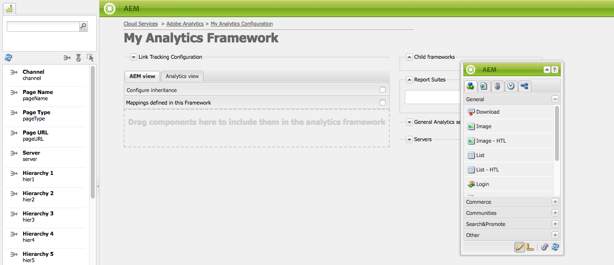
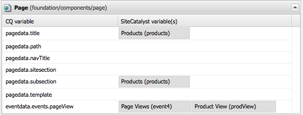

# Mapeamento de dados de componente com propriedades do Adobe Analytics{#mapping-component-data-with-adobe-analytics-properties}

Adicione componentes à estrutura que coletam os dados para enviar à Adobe Analytics. Os componentes projetados para coletar dados de análise armazenam os dados na **variável CQ apropriada**. Quando você adiciona esse componente a uma estrutura, a estrutura exibe a lista das variáveis CQ para que você possa cada uma delas para a **variável do Analytics** apropriada.

Quando **AEM visualização** estiver aberta, as variáveis do Analytics aparecerão no localizador de conteúdo.

Você pode mapear várias variáveis do Analytics com a mesma **variável CQ**.

Os dados mapeados são enviados à Adobe Analytics quando a página é carregada e as seguintes condições são atendidas:

* A página está associada à estrutura.
* A página usa os componentes adicionados à estrutura.

Use o procedimento a seguir para mapear variáveis de componente CQ com propriedades de relatório da Adobe Analytics.

1. Na visualização **AEM**, arraste um componente de rastreamento do sidekick para a estrutura. Por exemplo, arraste o componente **Page** da categoria **General**.

   

   Há vários grupos de componentes padrão: **Geral**, **Comércio**, **Comunidades**, **Search &amp; Promote** e **Outros**. Sua instância AEM pode estar configurada para exibir grupos e componentes diferentes.

1. Para mapear variáveis do Adobe Analytics com variáveis definidas no componente, arraste uma **variável do Analytics** do localizador de conteúdo para um campo no componente de rastreamento. Por exemplo, arraste `Page Name (pageName)` para `pagedata.title`.

   

   >[!NOTE]
   >
   >A ID do conjunto de relatórios (RSID) selecionada para a estrutura determina as variáveis do Adobe Analytics que aparecem no localizador de conteúdo.

1. Repita as duas etapas anteriores para outros componentes e variáveis.

   >[!NOTE]
   >
   >É possível mapear várias variáveis do Analytics (por exemplo, `props`, `eVars`, `events`) para a mesma variável CQ (por exemplo, `pagedata.title`)

   >[!CAUTION]
   >
   >Recomenda-se que:
   >    
   >    * `eVars` e  `props` são mapeados para variáveis CQ que começam com  `pagedata.X` ou  `eventdata.X`
      >    
      >    
   * considerando que os eventos devem ser mapeados para variáveis que começam com `eventdata.events.X`

1. Para disponibilizar a estrutura na instância de publicação do site, abra a guia **Página** do sidekick e clique em **Ativar Estrutura.**

## Mapeamento de variáveis relacionadas ao produto {#mapping-product-related-variables}

AEM usa uma convenção para nomear variáveis e eventos relacionados ao produto que devem ser mapeados para propriedades relacionadas ao produto Adobe Analytics:

| Variável CQ | Variável do Analytics | Descrição |
|---|---|---|
| `product.category` | `product.category` (variável de conversão) | A categoria do produto. |
| `product.sku` | `product.sku` (variável de conversão) | O sku do produto. |
| `product.quantity` | `product.quantity` (variável de conversão) | O número de produtos que estão sendo comprados. |
| `product.price` | `product.price` (variável de conversão) | O preço do produto. |
| `product.events.<eventName>` | Os eventos bem-sucedidos para associar ao produto em seu relatório. | `product.events` é o prefixo para eventos chamados  *eventName.* |
| `product.evars.<eVarName>` | As variáveis de conversão ( `eVar`) a serem associadas ao produto. | `product.evars` é o prefixo para variáveis de eVar chamadas de  *eVarName.* |

Vários componentes de Comércio AEM usam esses nomes de variáveis.

>[!NOTE]
>
>Não mapeie a propriedade Produtos Adobe Analytics para uma variável CQ. A configuração de mapeamentos relacionados ao produto, conforme descrito na tabela, equivale efetivamente ao mapeamento da variável Produtos.

### Verificando relatórios no Adobe Analytics {#checking-reports-on-adobe-analytics}

1. Faça logon no site da Adobe Analytics usando as mesmas credenciais fornecidas ao AEM.
1. Verifique se o RSID selecionado é o usado nas etapas anteriores.
1. Em **Relatórios** (no lado esquerdo da página), selecione **Conversão personalizada**, **Conversão personalizada 1-10** e selecione a variável que corresponde a `eVar7`

1. Dependendo da versão do Adobe Analytics que você estiver usando, é necessário aguardar em média 45 minutos para que o relatório seja atualizado com o termo de pesquisa usado; Por exemplo, beringela no exemplo

## Usar o Localizador de conteúdo (cf#) com estruturas Adobe Analytics {#using-the-content-finder-cf-with-adobe-analytics-frameworks}

Inicialmente, quando você abre uma estrutura do Adobe Analytics, o localizador de conteúdo contém variáveis predefinidas do Analytics em:

* Tráfego
* Conversão
* Eventos

Quando um RSID é selecionado, todas as variáveis pertencentes a esse RSID são adicionadas à lista.\
O `cf#` é necessário para mapear as variáveis do Analytics para as variáveis CQ presentes nos diferentes componentes de rastreamento. Consulte Configurando uma estrutura para rastreamento básico.

Dependendo da visualização selecionada para a estrutura, o localizador de conteúdo será preenchido pelas variáveis do Analytics (na visualização AEM) ou CQ (na visualização do Analytics).

A lista pode ser manipulada das seguintes maneiras:

1. Quando em **AEM visualização**, a lista pode ser filtrada dependendo do tipo de variável selecionado usando os botões de filtro 3:

   * Se *nenhum botão* estiver selecionado, a lista mostrará a lista completa.
   * Se o botão **Traffic** for selecionado, a lista mostrará somente as variáveis pertencentes à seção Tráfego.
   * Se o botão **Conversão** for selecionado, a lista mostrará somente as variáveis que pertencem à seção Conversão.
   * Se o botão **Eventos** for selecionado, a lista mostrará apenas as variáveis pertencentes à seção Eventos.

   >[!NOTE]
   >
   >Somente um botão de filtro pode estar ativo de uma vez.

   >[!NOTE]
   >
   >As variáveis de Search &amp; Promote também pertencem à seção Conversão.

   1. A lista também tem um recurso de pesquisa, que filtros os elementos de acordo com o texto digitado no campo de pesquisa.
   1. Se uma opção de filtro for ativada durante a pesquisa por elementos na lista, os resultados exibidos também serão filtrados de acordo com o botão ativo.
   1. A lista pode ser recarregada a qualquer momento usando o botão de setas para espirrar.
   1. Se vários RSIDs forem selecionados na estrutura, todas as variáveis na lista serão exibidas usando todos os rótulos usados nos RSIDs selecionados.

1. Quando estiver na visualização do Adobe Analytics, o Localizador de conteúdo exibirá todas as variáveis CQ pertencentes aos componentes de rastreamento arrastados na visualização do CQ.

   * Por exemplo, se o **componente de download** for o *somente um arrastado* na visualização CQ (que tem duas variáveis mapeáveis *eventdata.downloadLink* e *eventdata.eventos.startDownload*), o Localizador de conteúdo terá esta aparência ao alternar para o Adobe Analytics visualização:

   

   * As variáveis podem ser arrastadas&amp;soltas em qualquer variável do Adobe Analytics pertencente a uma das três seções de variável (**Traffic**, **Conversion** e **Eventos**).

   * Ao arrastar um novo componente de rastreamento para a estrutura na visualização do CQ, as variáveis do CQ pertencentes ao componente são automaticamente adicionadas ao Localizador de conteúdo (cf#) na visualização do Adobe Analytics.
   >[!NOTE]
   >
   >Somente uma variável CQ pode ser mapeada para uma variável Adobe Analytics de uma vez

## Uso AEM visualização e da visualização do Analytics {#using-aem-view-and-analytics-view}

A qualquer momento, os usuários têm a opção de alternar entre duas formas de visualizar os mapeamentos do Adobe Analytics quando estiverem em uma página de estrutura. As duas visualizações fornecem uma visão geral melhor dos mapeamentos dentro da estrutura, a partir de duas perspectivas distintas.

### visualização AEM {#aem-view}

Tomando a imagem acima como exemplo, a **AEM visualização** tem as seguintes propriedades:

1. Essa é a visualização padrão quando a estrutura é aberta.
1. Lado esquerdo: o localizador de conteúdo(cf#) é preenchido pelas variáveis do Adobe Analytics com base nos RSIDs selecionados.
1. Cabeçalhos de tabulação (**AEM visualização** e **visualização do Analytics**): use-os para alternar entre as duas visualizações.

1. **Visualização AEM**:

   1. Se a estrutura tiver componentes herdados de seu pai, eles serão listados aqui, juntamente com as variáveis mapeadas para os componentes.

      1. Os componentes herdados estão bloqueados.
      1. Para desbloquear um componente herdado, basta clicar com o duplo no cadeado ao lado do nome do componente
      1. Para reverter a herança, você deve excluir o componente desbloqueado; depois disso, recuperará o status bloqueado.
   1. **Arraste os componentes aqui para incluí-los na estrutura** de análise: Os componentes podem ser arrastados do Sidekick e soltos aqui.
   1. Você pode encontrar todos os componentes que estão incluídos atualmente na estrutura de análise:

      1. Para adicionar um componente, arraste um da guia Componentes do sidekick
      1. Para excluir um componente e todos os seus mapeamentos, selecione Excluir no menu de contexto do componente e aceite a exclusão na caixa de diálogo de confirmação.
      1. Lembre-se de que um componente só pode ser excluído da estrutura em que foi criado e não pode ser excluído das estruturas secundárias no sentido tradicional (eles só podem ser sobrescritos).

### Visualização do Analytics {#analytics-view}

1. Essa visualização pode ser acessada ao alternar para a guia **visualização do Analytics** na estrutura.
1. Lado esquerdo: Localizador de conteúdo (cf#) preenchido pelas variáveis CQ com base nos componentes arrastados para a estrutura na visualização do CQ.
1. Cabeçalhos de tabulação (**AEM visualização** e **visualização do Analytics**): use-os para alternar entre as duas visualizações.

1. As três tabelas (Tráfego, Conversão, Evento) lista todas as variáveis Adobe Analytics disponíveis. pertencente aos RSID selecionados. Os mapeamentos mostrados aqui devem ser os mesmos da visualização AEM:

   * **Tráfego**:

      * Variável de tráfego ( `prop1`) mapeada para uma variável CQ ( `eventdata.downloadLink`)

      * Quando o componente tem um Cadeado ao lado dele, isso significa que ele é herdado de uma estrutura pai e, portanto, não pode ser editado
   * **Conversão**:

      * Variável de conversão ( `eVar1`) mapeada para uma variável CQ ( `pagedata.title`)

      * Variável de conversão ( `eVar3`) mapeada para uma expressão javascript adicionada em linha ao clicar no duplo no campo de variável CQ e inserir o código manualmente
   * **Evento**:

      * Variável de evento ( `event1`) mapeada para um evento CQ ( `eventdata.events.pageView`)

>[!NOTE]
>
>A coluna variável CQ de qualquer tabela também pode ser preenchida em linha, clicando-se no duplo do campo e adicionando texto a ele. Esses campos aceitam javascript como entrada.
>
>* Por exemplo, ao lado de `prop3` você pode adicionar
>* `'`* `Adobe:'+pagedata.title+':'+pagedata.sitesection`\
   >  para enviar o *título* de uma página concatenada com o respectivo *sitesection* utilizando *:* (dois pontos) e prefixado com *Adobe* como `prop3`

>

>[!CAUTION]
>
>Somente uma variável CQ pode ser mapeada para uma variável do Adobe Analytics em um determinado momento.

