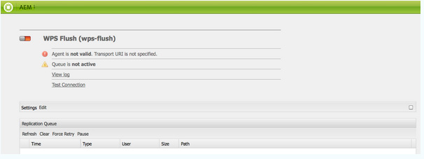

# Portais e portlets AEM{#aem-portals-and-portlets}

Este documento descreve o seguinte:

* Arquitetura do AEM Portal
* Administração e configuração de AEM como portal
* Uso do AEM como portal
* Instalar, configurar e exibir AEM conteúdo em um portlet (por exemplo, um servidor da Web)

## Arquitetura do AEM Portal {#aem-portal-architecture}

AEM arquitetura de portal inclui definições de portais e portlets.

### O que é um portal? {#what-is-a-portal}

Um portal é uma aplicação Web que fornece personalização, logon único, integração de conteúdo de diferentes fontes e hospeda a camada de apresentação dos sistemas de informações.

Você pode executar portlets compatíveis com JSR 286 em AEM. O componente de portlet permite incorporar um portlet na página. Consulte [Administração do portlet de conteúdo AEM](#administeringthecqcontentportlet).

### O que é um portlet? {#what-is-a-portlet}

Os portlets são componentes da Web implantados dentro de um contêiner que gera conteúdo dinâmico. A interface do portlet é empacotada e implantada como um arquivo .war dentro de um contêiner de portlet. Se estiver executando o AEM como um portal, será necessário que o arquivo .war do portlet execute o portlet.

Para configurar AEM conteúdo para aparecer em um portal, consulte [Instalação, configuração e uso de AEM em um portlet](#installingconfiguringandusingcqinaportlet).

### Director do AEM Portal {#aem-portal-director}

>[!CAUTION]
>
>O AEM Portal Director está obsoleto a partir do AEM 6.4. Consulte [Recursos obsoletos e removidos](https://helpx.adobe.com/experience-manager/6-4/release-notes/deprecated-removed-features.html).

## Administração do portlet de conteúdo AEM {#administering-the-aem-content-portlet}

O AEM portlet de conteúdo permite exibir AEM conteúdo em um portal. O portlet está disponível em `/crx-quickstart/opt/portal`e podem ser personalizadas de várias maneiras. Por exemplo, você pode personalizar o controle de SSO/Autenticação ao implantar seu próprio serviço de autenticação gerando as informações de autenticação necessárias para o AEM para substituir o comportamento padrão. Os plug-ins usam uma API definida que permite adicionar sua própria funcionalidade, criando o plug-in em relação à API. O plug-in pode ser implantado no portlet em execução. Para funcionar adequadamente, ele precisa de uma configuração da instância de criação e publicação do AEM juntamente com o caminho de conteúdo para ser exibido na inicialização.

Algumas configurações podem ser alteradas por meio das preferências do portlet e outras por meio das configurações do serviço OSGi. Você altera essas configurações usando **configuração** arquivos ou o console da Web OSGi.

### Preferências do portlet {#portlet-preferences}

As preferências do portlet podem ser configuradas no momento da implantação no servidor do portal ou editando o **WEB-INF/portlet.xml** antes de implantar o aplicativo web portlet. O arquivo portlet.xml aparece da seguinte maneira por padrão:

```xml
<?xml version="1.0" encoding="UTF-8"?>
<portlet-app xmlns="https://java.sun.com/xml/ns/portlet/portlet-app_1_0.xsd"
             xmlns:xsi="https://www.w3.org/2001/XMLSchema-instance"
             xsi:schemaLocation="https://java.sun.com/xml/ns/portlet/portlet-app_1_0.xsd /opt/SUNWps/dtd/portlet.xsd"
             version="1.0">
   <portlet>
      <portlet-name>RSSWeatherPortlet</portlet-name>
      <portlet-class>org.jboss.portlet.weather.WeatherPortlet</portlet-class>
      <init-param>
         <name>default_zipcode</name>
         <value>05673</value>
      </init-param>
      <init-param>
         <name>RSS_XSL</name>
         <value>/WEB-INF/Rss.xsl</value>
      </init-param>
      <init-param>
         <name>base_url</name>
         <value>https://xml.weather.yahoo.com/forecastrss?p=</value>
      </init-param>
      <expiration-cache>180</expiration-cache>
      <supports>
         <mime-type>text/html</mime-type>
         <portlet-mode>VIEW</portlet-mode>
         <portlet-mode>EDIT</portlet-mode>
      </supports>
      <portlet-info>
         <title>Weather Portlet</title>
      </portlet-info>
      <portlet-preferences>
         <preference>
            <name>expires</name>
            <value>180</value>
         </preference>
         <preference>
            <name>RssXml</name>
            <value>https://xml.weather.yahoo.com/forecastrss?p=33145</value>
            <read-only>false</read-only>
         </preference>
      </portlet-preferences>
   </portlet>
</portlet-app>
```

O portlet pode ser configurado com as seguintes preferências:

<table>
 <tbody>
  <tr>
   <td>startPath</td>
   <td><p>Este é o caminho inicial do portlet: ele define o conteúdo exibido inicialmente.</p> <p><strong>Importante</strong>: Se o portlet estiver configurado para se conectar AEM instâncias de autor e publicação em execução em um caminho de contexto diferente de<strong> /</strong>, você precisa ativar a força <strong>CQUrlInfo</strong> na configuração do Html Library Manager dessas instâncias de AEM (por exemplo, por meio do Felix Webconsole) ou a edição não funcionará e a caixa de diálogo de preferências não aparecerá.</p> </td>
  </tr>
  <tr>
   <td>htmlSeletor</td>
   <td>O seletor que é anexado a cada url. Por padrão, isso é <strong>portlet</strong>, portanto, todas as solicitações para páginas html usam urls que terminam em <strong>.portlet.html.</strong> Isso permite o uso de scripts personalizados no AEM para renderização de portlet.</td>
  </tr>
  <tr>
   <td>addCssToPortalHeader</td>
   <td><p>Por padrão, os arquivos css incluídos na página HTML do AEM são incluídos no portlet. Desativar essa opção exclui os arquivos css padrão.</p> <p>Se essa opção estiver ativada, os arquivos CSS serão adicionados ao cabeçalho da página html ou incorporados à página html, dependendo do comportamento do portal.</p> </td>
  </tr>
  <tr>
   <td>includeToolbar</td>
   <td>Por padrão, uma barra de ferramentas é renderizada no portlet de conteúdo para a funcionalidade de gerenciamento. Ao desativar essa opção, nenhuma barra de ferramentas é renderizada.</td>
  </tr>
  <tr>
   <td>urlParameterNames</td>
   <td><p>Lista de nomes de parâmetros de URL alternativos que podem conter o novo URL de conteúdo a ser exibido para o portlet. A lista é processada de cima para baixo, o primeiro parâmetro contendo um valor é usado. Se nenhum URL for encontrado, o parâmetro de URL padrão será usado. O URL fornecido é usado, como está, sem qualquer modificação adicional.</p> <p>Essa configuração é por portlet implantado - também é para configurar globalmente alguns parâmetros de url na configuração OSGi para o "Day Portal Director Portlet Bridge".</p> </td>
  </tr>
  <tr>
   <td>preferredDialog</td>
   <td>Caminho para a caixa de diálogo de preferências no AEM - se deixado em branco, a caixa de diálogo de preferências integradas será usada. O padrão é /libs/portal/content/prefs.html.</td>
  </tr>
  <tr>
   <td>initialRedirect</td>
   <td>Por padrão, o portlet executa um redirecionamento javascript de toda a página do portal na primeira invocação. Isso é para dar suporte ao cenário de arrastar e soltar dos servidores de portal modernos. Na produção, esse redirecionamento raramente é necessário e, portanto, pode ser desativado, com essa preferência definida como <em>false</em>.</td>
  </tr>
 </tbody>
</table>

#### Console da Web OSGi {#osgi-web-console}

Supondo que o servidor de portal seja executado no host localhost, na porta 8080 e que o aplicativo Web AEM portlet seja montado no contexto do aplicativo da Web *cqportlet*, o url para do console da Web é `https://localhost:8080/cqportlet/cqbridge/system/console`. O usuário e a senha padrão são **administrador**.

Abra o **Configurações** e selecione **Configuração do Servidor CQ do Diretório do Portal**. Aqui você especifica o URL base para o autor e a instância de publicação. Este procedimento é descrito em [Configuração do portlet](#configuring-the-portlet).

>[!NOTE]
>
>O console da Web OSGi destina-se apenas a alterar configurações durante o desenvolvimento (ou testes). Certifique-se de bloquear solicitações para o console para sistemas de produção.

### Fornecimento de configurações {#providing-configurations}

Para oferecer suporte a implantações automatizadas e provisionamento de configuração, o AEM portlet de conteúdo tem suporte integrado de configuração que tenta ler configurações do classpath fornecido para o aplicativo portlet.

Na inicialização, a propriedade do sistema **com.day.cq.portet.config** é lido para detectar o ambiente atual. Normalmente, o valor dessa propriedade é algo como **dev**, **prod**, **teste** e assim por diante. Se nenhum ambiente estiver definido, nenhuma configuração será lida.

Se um ambiente estiver definido, um arquivo de configuração será pesquisado no classpath em * ***com/day/cq/portlet/{env}.config** em que **env** é substituída pelo valor real para o ambiente. Esse arquivo deve listar todos os arquivos de configuração desse ambiente. Esses arquivos são pesquisados de acordo com o local do arquivo de configuração. Por exemplo, se o arquivo contiver uma linha `my.service.xml,` este arquivo é lido do classpath em `com/day/cq/portlet/my.service.config.` O nome do arquivo consiste na ID de persistência do serviço, seguido por **.config**. No exemplo anterior, a ID de persistência é **my.service**. O formato do arquivo de configuração é o formato usado pelo instalador do Apache Sling OSGi.

Isso significa que, para cada ambiente, um arquivo de configuração correspondente precisa ser adicionado. Uma configuração que deve ser aplicada a todos os ambientes precisa ser inserida em todos esses arquivos. Se for apenas para um único ambiente, ela será inserida nesse arquivo. Esse mecanismo garante controle total sobre qual configuração é lida em qual ambiente.

É possível usar uma propriedade do sistema diferente para detectar o ambiente. Especificar a propriedade do sistema **com.day.cq.portet.configproperty** contendo o nome da propriedade do sistema a ser usada em vez de **com.day.cq.portet.config**.

#### Invalidação de armazenamento em cache e armazenamento em cache {#caching-and-caching-invalidation}

O portlet, em sua configuração padrão, armazena em cache as respostas recebidas AEM WCM em um cache específico do usuário. Os caches precisam ser invalidados quando ocorrerem alterações no conteúdo da instância de publicação. Para essa finalidade, em AEM WCM, um agente de replicação deve ser configurado na instância do autor. O cache também pode ser liberado manualmente. Esta seção descreve ambos os procedimentos.

O portlet pode ser configurado com seu próprio cache, para que o conteúdo no portlet seja exibido sem precisar de acesso ao AEM. O portal está disponível como conteúdo em /libs/portal/diretor. Para acessar o conteúdo, inicie uma instância de AEM e baixe, usando o CRXDE Lite ou o Webdav, o arquivo desse local.

Você pode implantar esse pacote no tempo de execução ou adicioná-lo ao aplicativo web portlet em `WEB-INF/lib/resources/bundles` antes da implantação.

Depois que o cache é implantado, o portlet armazena em cache o conteúdo da instância de publicação. O cache do portlet pode ser invalidado com uma liberação do dispatcher do AEM. Para configurar o portlet para usar seu próprio cache:

1. Configure um agente de replicação no autor que seja direcionado ao servidor de portal.
1. Supondo que o servidor de portal seja executado no host **localhost**, **porta 8080 **e o aplicativo web portlet AEM é montado no contexto **cqportlet**, o url para liberar o cache é `https://localhost:8080/cqportlet/cqbridge/cqpcache?Path=$(path)`. Use GET como método.
   **Observação:** Em vez de usar um parâmetro de solicitação, você pode enviar um cabeçalho http chamado **Caminho**.

#### Liberando o Cache pelo Agente de Replicação {#flushing-the-cache-via-replication-agent}

Assim como a invalidação normal do dispatcher, um agente de replicação pode ser configurado para direcionar o cache do AEM portlet do portal. Após configurar o agente de replicação, cada ativação de página regular libera o cache do portal.

Se você operar vários nós de portal executando o portlet AEM, será necessário criar um agente para cada nó, conforme descrito neste procedimento.

Para configurar um agente de replicação para o portal:

1. Faça logon na instância do autor.
1. Na guia Sites , clique no botão *Ferramentas* guia .
1. Clique em **Nova página...** nos agentes de replicação **Novo...** menu.

   

1. Em *Modelo*, selecione *Agente de replicação* e insira um nome para o agente. Clique em *Criar*.

   

1. Clique duas vezes no agente de replicação que acabou de criar. Ele é exibido como inválido, pois ainda não foi configurado.

   

1. Clique em **Editar.**
1. No **Configurações** selecione a guia **Ativado** caixa de seleção, selecione **Liberação do Dispatcher** como o tipo de serialização e insira um tempo limite de nova tentativa (por exemplo, 60000).

   

1. Clique no botão **Transportes** guia .
1. No **URI** , insira o URL de liberação (URL) do portlet. O URI está no seguinte formato:

   ```xml
   https://<wps-host>:<port>/<wps-context>/<cq5-portlet-context>/cqbridge/cqpcache
   ```

   

1. Clique no botão **Estendido** guia .

   

1. No **Método HTTP** campo, tipo **GET**.
1. No **Cabeçalhos HTTP** , clique em **+** para adicionar uma nova entrada e digite **Caminho: {path}**.
1. Se necessário, clique no botão **Proxy** e insira informações de proxy no agente.
1. Clique em **OK** para salvar as alterações.
1. Para testar a conexão, clique no botão **Testar conexão** link . Uma mensagem de log é exibida indicando se o teste de replicação foi bem-sucedido. Por exemplo:

   

#### Liberando manualmente o cache do portlet {#manually-flushing-the-portlet-cache}

Você pode liberar manualmente o cache do portlet acessando o mesmo URL configurado para o agente de replicação. Consulte [Liberando o Cache](#flushing-the-cache-via-replication-agent) para o formulário do URL. Além disso, o URL precisa ser estendido com um parâmetro de URL Path=&lt;path> para indicar o que liberar.

Por exemplo:

`https://10.0.20.99:10040/wps/PA_CQ5_Portlet/cqbridge/cqpcache?Path=*` libera o cache completo. `https://10.0.20.99:10040/wps/PA_CQ5_Portlet/cqbridge/cqpcache?Path=/content/mypage/xyz` enxaguamento `/content/mypage/xyz` do cache.

### Segurança do portal {#portal-security}

O portal é o mecanismo de autenticação de condução. Você pode fazer logon no AEM com um usuário técnico, o usuário do portal, um grupo e assim por diante. O portlet não tem acesso à senha para o usuário no portal; portanto, se o portlet não souber todas as credenciais para fazer logon de usuário com êxito, uma solução SSO deverá ser usada. Nesse caso, o portlet AEM encaminha todas as informações necessárias para o AEM, o que, por sua vez, encaminha essas informações para o repositório AEM subjacente. Esse comportamento é plugável e pode ser personalizado.

### Autenticação na publicação {#authentication-on-publish}

Esta seção descreve os modos de autenticação disponíveis que o portlet pode usar na comunicação com as instâncias AEM WCM subjacentes.

Por padrão, nenhuma informação do usuário é enviada para a instância de publicação do AEM; o conteúdo é sempre exibido como o usuário anônimo. Se as informações específicas do usuário devem ser fornecidas pelo AEM ou se a autenticação do usuário para publicação for necessária, isso deve ser ativado.

#### Acessar a configuração de autenticação do portlet {#accessing-the-portlet-s-authentication-configuration}

As opções de configuração de autenticação que o portlet usa AEM instâncias WCM estão disponíveis no console da Web (configuração OSGi).

>[!NOTE]
>
>Ao trabalhar com AEM, há vários métodos de gerenciamento das configurações para serviços OSGi (console ou nós de repositório).
>
>Consulte [Configuração do OSGi](/help/sites-deploying/configuring-osgi.md) para obter detalhes completos.

Para acessar a configuração de autenticação do portlet:

1. Acesse o console da Web no seguinte URL:

   `https://localhost:8080/cqportlet/cqbridge/system/console`

   Por exemplo, em sua configuração padrão:

   `https://wps-host:10040/wps/PA_CQ5_Portlet/cqbridge/system/console`

1. Faça logon no console da Web. As credenciais padrão são `admin/admin`.
1. No console, selecione **Configuração**.
1. No **Configuração** selecione um serviço específico para configurar. Os serviços são fornecidos pelo portlet na estrutura OSGi.

   | Nome do serviço | Descrição |
   |---|---|
   | Autenticador Director do portal do dia | Configure qual modo de autenticação é usado para instâncias AEM WCM. Dependendo do modo selecionado, é possível especificar um usuário técnico ou o nome do cookie SSO. Além disso, é possível ativar a autenticação para AEM instâncias de publicação do WCM. |
   | Cache de Arquivo Director do Portal do Dia | Configure os parâmetros de como o portlet armazena em cache as respostas recebidas AEM instâncias do WCM. |
   | Serviço de cliente HTTP do Day Portal Director | Configure como o portlet se conecta via HTTP às instâncias subjacentes AEM WCM. Você pode, por exemplo, especificar um servidor proxy. |
   | Manipulador de localidade do Director do Portal do dia | Configure quais localidades o portlet suporta. As solicitações para AEM instâncias do WCM são baseadas na localidade do usuário; por exemplo, idioma do usuário *alemão *solicitação `/content/geometrixx/de/`.... |
   | Gerenciador de Privilégios do Director do Portal do Dia | Configure se o portlet deve testar a guia Sites com base no usuário conectado no momento. |
   | Renderizador da Barra de Ferramentas Director do Portal do Dia | Personalize a renderização da barra de ferramentas do portlet. |

1. Além disso, você pode configurar o console da Web e o serviço de registro. Por exemplo, você pode alterar as credenciais do administrador para o console da Web clicando no link Apache Felix OSGi Management Console .

#### Modo de usuário técnico {#technical-user-mode}

No modo padrão, todas as solicitações emitidas pelo portlet para a instância do autor do WCM AEM são autenticadas usando o mesmo usuário técnico, independentemente do usuário do portal atual. O modo Usuário técnico é ativado por padrão. Ative/desative esse modo na tela de configuração respectiva no console de gerenciamento OSGi:

O usuário técnico especificado deve existir na instância do autor do WCM AEM e na instância de publicação se **Autenticar ao publicar** estiver ativado. Certifique-se de conceder ao usuário privilégios de acesso suficientes para criar trabalho.

#### SSO {#sso}

O portlet suporta SSO com AEM pronto para uso. O serviço autenticador pode ser configurado para usar o SSO e transmitir o usuário do portal atual com o formato **Básico** como um cookie chamado `cqpsso` para AEM. AEM deve ser configurado para usar o manipulador de autenticação SSO para caminho /. O nome do cookie também precisa ser configurado aqui.

O `crx-quickstart/repository/repository.xml` para AEM repositório precisa ser configurado adequadamente:

```xml
<LoginModule class="com.day.crx.security.authentication.CRXLoginModule">
  ...
  <param name="trust_credentials_attribute" value="TrustedInfo"/>
  <param name="anonymous_principal" value="anonymous"/>
</LoginModule>
```

#### Modo de Autenticação SSO {#sso-authentication-mode}

O portlet pode autenticar para AEM WCM usando o esquema Single Sign On (SSO). Nesse modo, o usuário que está conectado no portal é encaminhado AEM WCM no formato de um cookie SSO. Se o modo SSO for usado, todos os usuários do portal com acesso ao AEM portlet deverão ser conhecidos pelas instâncias AEM WCM subjacentes, mais comumente na forma de AEM WCM conectado ao LDAP ou por terem criado os usuários manualmente antecipadamente. Além disso, antes de ativar o SSO no portlet, a instância subjacente do autor do WCM AEM (e a instância de publicação, se **Autenticar ao publicar** está ativado) precisa ser configurado para aceitar solicitações baseadas em SSO.

Para configurar o portlet para usar o modo de autenticação SSO, conclua as seguintes etapas (descritas detalhadamente nas seções a seguir):

* Habilite AEM repositório do WCM para aceitar credenciais confiáveis.
* Ative a autenticação SSO no WCM AEM.
* Ative a Autenticação SSO no portlet AEM.

#### Habilitando AEM repositório do WCM para aceitar credenciais confiáveis {#enabling-aem-wcm-s-repository-to-accept-trusted-credentials}

Antes que o SSO possa ser ativado para AEM WCM, o repositório subjacente precisa ser configurado para aceitar as credenciais confiáveis fornecidas AEM WCM. Para fazer isso, configure AEM repository.xml.

1. No sistema de arquivos onde AEM WCM está instalado, abra o seguinte arquivo:

   `//crx-quickstart/repository/repository.xml`

1. No arquivo XML, localize a entrada para a variável **LoginModule** e adicione o trust_credentials_attribute a sua configuração:

   ```xml
   <LoginModule class="com.day.crx.security.authentication.CRXLoginModule">
     ...
     <param name="trust_credentials_attribute" value="TrustedInfo"/>
     <param name="anonymous_principal" value="anonymous"/>
   </LoginModule>
   ```

1. Reinicie AEM WCM para que as alterações entrem em vigor.

#### Ativação da autenticação SSO no WCM AEM {#enabling-sso-authentication-in-the-aem-wcm}

Para ativar o SSO AEM WCM, acesse a entrada de configuração relevante no Apache Felix Web Management Console (OSGi) do AEM WCM:

1. Acesse o console por meio de seu URI em https://&lt;aem-host>:&lt;port>/system/console.
1. No menu Configuração, selecione Manipulador de Autenticação SSO. Neste exemplo, o manipulador de SSO aceita solicitações de SSO para todos os caminhos com base no cookie fornecido pelo portlet de AEM. Sua configuração pode variar.

   | Caminho  | / | Habilita o manipulador de SSO para todas as solicitações |
   |---|---|---|
   | Nomes de cookies | cqpsso | Nome do cookie fornecido pelo portlet, conforme configurado no console OSGi do portlet. |

1. Clique em **Salvar** para ativar o SSO. O SSO agora é o esquema de autenticação principal.

Para cada solicitação AEM o WCM recebe, primeiro a autenticação baseada em SSO é tentada. Após a falha, é executado um fallback do esquema de autenticação básico normal. Assim, as conexões normais com AEM WCM sem SSO permanecem possíveis.

#### Ativando a Autenticação SSO em um portlet AEM {#enabling-sso-authentication-in-a-aem-portlet}

Para que a instância AEM WCM subjacente aceite solicitações SSO, o modo de autenticação do portlet deve ser alternado de **Técnica** para **SSO**.

Para habilitar a autenticação SSO em um portlet de AEM:

1. Acesse o console por meio de seu URI em https://&lt;aem-host>:&lt;port>/system/console.
1. No menu Configuração, selecione Day Portal Director Authenticator na lista de configurações disponíveis.
1. No Modo, selecione SSO. Deixe os outros parâmetros com seus valores padrão.

   

1. Clique em Salvar para ativar o SSO no portlet.

   Para fins de teste, acesse o portlet com o usuário administrativo do portal, depois de criar o mesmo usuário AEM WCM com privilégios de administrador.

Depois de executar esse procedimento, as solicitações são autenticadas usando o SSO. Um snippet típico da comunicação HTTP revela a presença dos seguintes cabeçalhos específicos de SSO e Portlet:

```xml
C-12-#001898 -> [GET /mynet/en/_jcr_content/par/textimage/image.img.png HTTP/1.1 ]
C-12-#001963 -> [cq5:locale: en ]
C-12-#001979 -> [cq5:used-locale: en ]
C-12-#002000 -> [cq5:locales: en,en_US ]
C-12-#002023 -> [cqp:user: wpadmin ]
C-12-#002042 -> [cqp:portal: IBM WebSphere Portal/6.1 ]
C-12-#002080 -> [cqp:windowid: 7_CGAH47L000CE302V2KFNOG0084 ]
C-12-#002124 -> [cqp:windowstate: normal ]
C-12-#002149 -> [cqp:portletmode: view ]
C-12-#002172 -> [User-Agent: Jakarta Commons-HttpClient/3.1 ]
C-12-#002216 -> [Host: 10.0.0.68:4502 ]
C-12-#002238 -> [Cookie: $Version=0; cqpsso=Basic+d3BhZG1pbg%3D%3D ]
C-12-#002289 -> [ ]
```

### Ativar autenticação PIN {#enabling-pin-authentication}

Se você não estiver usando os recursos padrão de edição em linha do portlet de conteúdo AEM, mas quiser a parte de criação e administração do portlet fora do portal diretamente na instância do autor AEM, ative a autenticação PIN. Também é necessário alterar a configuração dos botões de gerenciamento.

Para abrir a página de administração do site ou editar uma página no portlet, o portlet de conteúdo AEM usa a nova autenticação de pino. Por padrão, a autenticação de pino está desativada, portanto, as seguintes alterações de configuração devem ser feitas em AEM:

1. Ative a autenticação confiável no AEM adicionando as informações confiáveis no arquivo repository.xml:

   ```xml
   <LoginModule class="com.day.crx.security.authentication.CRXLoginModule">
     ...
     <param name="trust_credentials_attribute" value="TrustedInfo"/>
   </LoginModule>
   ```

1. No console de configuração do OSGi, por padrão localizado em https://localhost:4502/system/console/configMgr, selecione **Manipulador de Autenticação do PIN CQ** no menu suspenso.
1. Edite o **Caminho raiz do URL** para conter apenas o valor único **/**.

### Privilégios {#privileges}

Algumas funções do portlet são protegidas por privilégios. O usuário atual precisa ter esse privilégio para poder acessar essa função. Há os seguintes privilégios predefinidos:

* &quot;barra de ferramentas&quot; : Esse é o privilégio geral de ver/usar a barra de ferramentas no portlet.
* &quot;prefs&quot; : Se o usuário tiver esse privilégio, ele poderá ver/alterar as preferências do portlet.
* &quot;cq-author:edit&quot; : Com esse privilégio, o usuário tem permissão para invocar a visualização de edição do conteúdo.
* &quot;cq-author:preview&quot; : Com esse privilégio, o usuário tem permissão para ver a visualização.
* &quot;cq-author:siteadmin&quot; : Com esse privilégio, o usuário tem permissão para abrir o siteadmin no AEM.

A melhor abordagem para gerenciar os privilégios é usar funções de portal e atribuir funções a esses privilégios. Isso pode ser feito por meio de uma configuração OSGi. O &quot;Day Portal Director Privilege Manager&quot; pode ser configurado com um conjunto de funções para cada privilégio. Se o usuário tiver uma das funções, ele terá o privilégio correspondente.

Além disso, é possível definir essa função com base no acesso por instância de portlet. A caixa de diálogo Preferências do portlet contém um campo de entrada para cada um dos privilégios acima. Para cada privilégio, uma lista separada por vírgulas de funções de portlet pode ser configurada. Se um valor for configurado, isso substituirá a configuração global do serviço &quot;Day Portal Director Privilege Manager&quot; e talvez seja necessário adicionar as mesmas funções dessa configuração global, pois as funções não são mescladas! Se nenhum valor for especificado, a configuração global será usada.

### Personalização do aplicativo AEM portlet {#customizing-the-aem-portlet-application}

O aplicativo AEM portlet fornecido inicia um contêiner OSGi dentro do aplicativo Web, como AEM. Essa arquitetura permite utilizar todos os benefícios do OSGi:

* Fácil de atualizar e estender
* Fornece atualizações instantâneas do portlet sem qualquer interação do servidor do portal
* Fácil de personalizar o portlet

### Botões da barra de ferramentas {#toolbar-buttons}

A barra de ferramentas e seus botões são configuráveis e podem ser personalizados. Você pode adicionar seus próprios botões à barra de ferramentas ou definir quais botões serão exibidos em qual modo. Cada botão é um serviço OSGi configurável por meio de uma configuração OSGi.

O console da Web OSGi lista todas as configurações de botão no **Configuração** guia . Para cada botão, você pode definir em qual modo esse botão é exibido. Isso permite desativar um botão, removendo todos os modos, por exemplo.

Por padrão, o portlet de conteúdo AEM usa a funcionalidade de edição em linha. No entanto, se você preferir alternar para a instância do autor do AEM para edição, ative a opção **Botão de administração do site** e **Botão ContentFinder**, mas desative o **Botão Editar**. Nesse caso, certifique-se de configurar corretamente a autenticação PIN no AEM.

O layout da barra de ferramentas do portlet pode ser personalizado instalando um pacote pelo Felix Web Console do portlet, que contém CSS/HTML personalizado em um local predefinido.

#### Estrutura do pacote {#bundle-structure}

Veja a seguir um exemplo de estrutura do pacote:

```xml
$ jar tvf target/toolbarlayout-0.0.1-SNAPSHOT.jar | awk '{print $8}'
META-INF/
META-INF/MANIFEST.MF
/com/day/cq/portlet/toolbar/layout/
/com/day/cq/portlet/toolbar/layout/author.gif
/com/day/cq/portlet/toolbar/layout/back.gif
/com/day/cq/portlet/toolbar/layout/button.html
/com/day/cq/portlet/toolbar/layout/edit.gif
/com/day/cq/portlet/toolbar/layout/manage.html
/com/day/cq/portlet/toolbar/layout/publish.html
/com/day/cq/portlet/toolbar/layout/refresh.gif
/com/day/cq/portlet/toolbar/layout/siteadmin.gif
/com/day/cq/portlet/toolbar/layout/toolbar.css
```

A pasta META-INF contém o arquivo MANIFEST.MF necessário para o OSGi identificá-lo como um pacote. Ele aparece da seguinte maneira:

```xml
Manifest-Version: 1.0
Built-By: djaeggi
Created-By: Apache Maven Bundle Plugin
Import-Package: com.day.cq.portlet.toolbar.layout
Bnd-LastModified: 1234178347159
Export-Package: com.day.cq.portlet.toolbar.layout
Bundle-Version: 0.0.1.SNAPSHOT
Bundle-Name: Company CQ5 Portal Director Portlet Toolbar Layout
Bundle-Description: This bundle provides a custom layout for the CQ5 P
 ortal Director Portlet Toolbar.
Build-Jdk: 1.5.0_16
Bundle-ManifestVersion: 2
Bundle-SymbolicName: com.day.cq.portlet.company.toolbarlayout
Tool: Bnd-0.0.255
```

O fato de que o HTML/CSS/images está dentro da pasta /com/day/cq/portlet/toolbar/layout é obrigatório no portlet e não pode ser alterado. Nas mesmas linhas, os cabeçalhos Import-Package e Export-Package em MANIFEST.MF também devem ser chamados /com/day/cq/portlet/toolbar/layout. O Bundle-SymbólicaName deve ser um nome de pacote exclusivo e totalmente qualificado.

Você pode criá-lo usando uma ferramenta, como maven ou criar manualmente um arquivo jar com o cabeçalho relevante definido como mostrado nesta seção.

#### Visualizações da barra de ferramentas do portlet {#portlet-toolbar-views}

A barra de ferramentas do portlet tem basicamente dois estados de exibição. Cada exibição e botões associados podem ser personalizados com um respectivo arquivo de HTML.

#### Exibição de publicação {#publish-view}

A exibição de publicação tem apenas um botão que alterna a barra de ferramentas para a exibição Gerenciar. A exibição de publicação é representada pelo arquivo publish.html em [pacote anterior](/help/sites-deploying/configuring-osgi.md#bundles). No HTML, você pode usar os seguintes espaços reservados, que são substituídos pelo portlet pelo respectivo conteúdo quando renderizado:

#### Publicar exibir espaços reservados {#publish-view-placeholders}

| String de espaço reservado | Descrição |
|---|---|
| {buttonManage} | O espaço reservado é substituído por **Gerenciar** , que altera o estado do portlet para o estado de gerenciamento. |

#### Gerenciar Exibição {#manage-view}

A visualização de gerenciamento tem quatro botões: Editar, guia Sites, Atualizar e Voltar. A exibição de gerenciamento é representada pelo arquivo manage.html na [pacote anterior](/help/sites-deploying/configuring-osgi.md#bundles). No HTML, você pode usar os seguintes espaços reservados, que são substituídos pelo portlet pelo respectivo conteúdo quando renderizado:

#### Gerenciar marcadores de posição da exibição {#manage-view-placeholders}

| String de espaço reservado | Descrição |
|---|---|
| {buttonEdit} | O espaço reservado é substituído por **Editar** , que abre uma nova janela com a página atual no modo de edição AEM. |
| {guia buttonWebsites} | Espaço reservado, substituído por um botão que abre a guia Sites AEM WCM. |
| {buttonRefresh} | Atualiza a vista atual. |
| {buttonBack} | Alterna o portlet de volta para a exibição de publicação. |

#### Botões {#buttons}

Os botões, na exibição exibida, usam o mesmo HTML comum, definido em button.html.

No HTML, você pode usar os seguintes espaços reservados, que são substituídos pelo portlet pelo respectivo conteúdo quando renderizado:

#### Botões Gerenciar e publicar visualização {#manage-and-publish-view-buttons}

| String de espaço reservado | Descrição |
|---|---|
| {name} | Nome do botão, por exemplo, autor**, retornar, atualizar** e assim por diante. |
| {id} | ID CSS do botão. |
| {url} | URL para a meta do botão. |
| {text} | Rótulo do botão. |
| {onclick} | Javascript **onclick** (contém {url}). |

Exemplo de um arquivo button.html:

```xml
<div class="cqp_button">

 <a href="#" onclick="{onclick}">

 

 </a>
</div>
```

#### Instalar um layout personalizado {#installing-a-custom-layout}

Para instalar um layout personalizado, acesse a seção console OSGI Web do portlet **Pacotes **e faça upload do pacote.

#### Pacotes {#packages}

Se precisar fazer upload ou criar pacotes para sua instalação, consulte o Gerenciador de pacotes na documentação de AEM para obter instruções detalhadas.

### Manuseio de link {#link-handling}

Todos os links são reescritos para funcionar no contexto do portal. Por padrão, links com parâmetros de renderização são usados. A regravação do HTML do Portal Director pode ser configurada para usar links de ação.

Você também pode definir parâmetros de solicitação adicionais a serem consultados para o caminho de conteúdo a ser exibido. Isso é útil, por exemplo, se houver um link de fora para um conteúdo específico.

Além disso, o Portal Director HTML Rewriter pode ser configurado com uma lista de expressões regulares definidas como excluídas para regravação de links. Por exemplo, se você tiver links relativos para sistemas externos, deverá adicioná-los a essa lista de exclusões.

### Localização {#localization}

O AEM portlet de conteúdo tem um recurso de localização integrado, o que garante que o conteúdo do AEM esteja no idioma correto.

Isso é feito em duas etapas:

1. O Detector de Localidade do Diretório de Portal detecta a localidade do usuário do portal obtendo a configuração de localidade do portal. Este serviço deve ser configurado com a lista de idiomas disponíveis em AEM.
1. O Manipulador de Localidade do Director do Portal lida com a localização da solicitação atual. Ele segue o caminho do conteúdo solicitado, por exemplo `/content/geometrixx/en/company.html`e de acordo com a configuração, ele reescreve a variável **en** com a localidade real do usuário.

O Manipulador de localidade do Director do portal pode ser configurado com os caminhos para verificar as informações de localidade - normalmente isso inclui tudo em `/content` e com a posição das informações de local no caminho. Por padrão, o manipulador de localidade segue a recomendação de estruturar sites de vários idiomas no AEM.

Se o site não tiver uma regra estrita para lidar com as informações do local dentro do caminho, é possível substituir o manipulador do local pela sua própria implementação.

### Serviços OSGi opcionais {#optional-osgi-services}

É possível implementar serviços OSGi opcionais para personalizar várias partes do portlet. Cada serviço corresponde a uma interface Java. Essa interface pode ser implementada e implantada por meio de um pacote no portlet.

<table>
 <tbody>
  <tr>
   <td>RequestTracker</td>
   <td>O rastreador de solicitações é notificado sempre que o conteúdo é exibido pelo portlet. Isso permite que você acompanhe as invocações do portlet.</td>
  </tr>
  <tr>
   <td>InvocationContextListener</td>
   <td>Ouvinte que é chamado no início e no fim de cada solicitação para o portlet. O ouvinte pode ser usado para alterar ou adicionar informações para a solicitação atual.<br /> </td>
  </tr>
  <tr>
   <td>ErrorHandler</td>
   <td>Manipulador de erros personalizado para erros durante a fase de renderização.</td>
  </tr>
  <tr>
   <td>HttpProcessor</td>
   <td>Esse serviço pode ser usado para adicionar informações a cada invocação http para AEM.</td>
  </tr>
  <tr>
   <td>PortletAction</td>
   <td>Adicionar uma própria ação ao portlet - essa ação pode ser invocada por meio de um link de ação do portlet.</td>
  </tr>
  <tr>
   <td>PortletDecoratorService</td>
   <td>Esse serviço pode ser usado para decorar o conteúdo do portlet.</td>
  </tr>
  <tr>
   <td>ResourceProvider</td>
   <td>Adicione seu próprio provedor de recursos para fornecer algum recurso por meio de um link de recurso de portlet para o cliente.</td>
  </tr>
  <tr>
   <td>TextMapper</td>
   <td>Permite que você publique arquivos HTML, CSS e Javascript de processo.</td>
  </tr>
  <tr>
   <td>ToolbarButton</td>
   <td>Adicione seu próprio botão à barra de ferramentas.</td>
  </tr>
  <tr>
   <td>UrlMapper</td>
   <td>Adicione um serviço para aplicar um mapeamento ou regravação de url personalizado.</td>
  </tr>
  <tr>
   <td>UserInfoProvider</td>
   <td>Adicione suas próprias informações sobre o usuário. Esse serviço pode ser usado para obter informações do portal para o portlet.</td>
  </tr>
 </tbody>
</table>

#### Substituição de serviços padrão {#replacing-default-services}

Os seguintes serviços têm uma implementação padrão no portlet de conteúdo (com uma interface Java correspondente). Para personalizar, um pacote contendo a nova implementação de serviço precisa ser implantado no aplicativo portlet.

Ao implementar esse serviço, certifique-se de definir a variável **service.ranking** propriedade do serviço para um valor positivo. A implementação padrão usa a classificação** 0** e o portlet usa o serviço com a classificação mais alta.

| **Nome** | **Descrição** | **Comportamento padrão** |
|---|---|---|
| Autenticador | Fornece as informações de autenticação para AEM | Usa um usuário técnico configurável para autor e publicação. Ou o SSO pode ser usado. |
| HTMLRewriter | Substitui links, imagens etc. | Substitui AEM links para links de portal, podem ser estendidos por um UrlMapper e um TextMapper |
| HttpClientService | Gerencia todas as conexões http | Implementação padrão |
| LocaleHandler | Gerencia as informações da localidade | Substitui um link para o conteúdo em relação à localidade. |
| LocaleDetector | Detecta o local do usuário. | Usa a localidade fornecida pelo portal. |
| PrivilegeManager | Verifica os direitos do usuário | Verifica o acesso à instância do autor se o usuário tiver permissão para editar conteúdo |
| ToolbarRenderer | Renderiza a barra de ferramentas | Adiciona uma funcionalidade da barra de ferramentas |

### Eventos de portlet {#portlet-events}

A API de portlet (JSR-286) especifica eventos de portlet. O portlet de conteúdo AEM tem uma ponte integrada, distribuindo eventos de portlet para o portlet AEM como eventos OSGi - isso torna o manuseio de eventos de portlet plugável.

Se quiser lidar com eventos específicos, declare esses eventos como eventos de recebimento no descritor de implantação (ou configure-o pelo servidor de portal) e implemente um serviço OSGi declarando a interface EventHandler (consulte a especificação OSGi EventAdmin ).

Sempre que um evento de portlet ocorre, um evento OSGi específico é enviado chamando seu manipulador. O manipulador obtém todas as informações de contexto e pode atualizar o status do portlet de acordo ou enviar novos eventos. Basicamente, dentro do método handle, toda a funcionalidade da fase de evento do portlet pode ser usada.

## Usar o AEM como portal {#using-aem-as-a-portal}

Use o componente Portlet para adicionar janelas portlet a páginas AEM. As bibliotecas compartilhadas que você instala no servidor de aplicativos permitem que o componente Portlet detecte os aplicativos de portlet implantados.

Para usar o AEM como um portal, execute as seguintes tarefas:

1. Instale o componente Portlet e as bibliotecas compartilhadas.
1. Adicione o componente Portlet ao Sidekick.
1. Configure e implante a aplicação Web que contém os portlets que você deseja que apareçam no componente Portal.
1. Adicione o componente Portlet a uma página e selecione o portlet a ser exibido.

>[!NOTE]
>
>Você pode usar o componente portlet somente quando o AEM for implantado como uma aplicação Web. ([Consulte Instalar AEM com um servidor de aplicativos](/help/sites-deploying/application-server-install.md).)

### Instalação do componente de portlet {#installing-the-portlet-component}

O arquivo AEM Quickstart JAR contém os arquivos do componente do portlet. Para obter os arquivos (cq-portlet-components.zip), você pode executar o Quickstart ou extrair o conteúdo.

1. Execute ou extraia o conteúdo do arquivo JAR do Quickstart e localize o arquivo cq-portlet-components.zip apropriadamente:

   * Executar Início Rápido: crx-quickstart/opt/portal
   * Extrair conteúdo de Início Rápido: static/opt/portal

1. Abra o Gerenciador de Pacotes da instância do autor do CQ5 que é implantada no servidor de aplicativos. (https://)*appserverhost*:*porta*/cq5author/crx/packmgr)

1. Use o Gerenciador de Pacotes para [Fazer upload e instalar](/help/sites-administering/package-manager.md#uploading-packages-from-your-file-system) o pacote cq-portlets-components.zip .

   O pacote instala o cq-portlet-diretor-sharedlibs-x.x.x.jar na pasta /libs/portal/diretor no repositório.

1. Copie cq-portlet-diretor-sharedlibs-x.x.x.jar para o disco rígido. Use qualquer meio para obter o arquivo, por exemplo, FileVault ou um cliente WebDAV.
1. Mova o arquivo cq-portlet-diretor-sharedlibs.x.x.jar para a pasta da biblioteca compartilhada do servidor de aplicativos, de modo que as classes estejam disponíveis para os aplicativos de portlet implantados.

### Adicionar o componente de portlet ao Sidekick {#adding-the-portlet-component-to-sidekick}

Adicione o componente de portlet ao sistema de parágrafo para que ele esteja disponível para os autores.

1. No Sidekick, clique no ícone da régua para entrar no modo Design .
1. Ao lado do `Design of par` acima do primeiro parágrafo, clique em **Editar**.

1. No **Geral** categoria de componente, marque a caixa de seleção ao lado do componente Portlet e clique em OK.


### Configuração e implantação de aplicativos de portlet {#configuring-and-deploying-your-portlet-applications}

Implante os portlets no contêiner da Web do servidor de aplicativos para que eles fiquem disponíveis no componente Portal . Antes de implantar o aplicativo portlet, é necessário configurar o aplicativo para que ele carregue o servlet do contêiner do portal AEM. Essa configuração permite que o componente Portlet acesse os portlets.

1. Extraia o conteúdo do arquivo WAR do aplicativo portlet.

   **Dica:** O jar xf *nameofapp* O comando .war extrai os arquivos.

1. Abra o arquivo web.xml em um editor de texto.
1. Adicione a seguinte configuração de servlet dentro do elemento do aplicativo web:

   ```xml
   <servlet>
           <servlet-name>slingportal</servlet-name>
           <servlet-class>org.apache.sling.portal.container.api.ContainerServlet</servlet-class>
           <load-on-startup>1</load-on-startup>
   </servlet>
   <servlet-mapping>
           <servlet-name>slingportal</servlet-name>
           <url-pattern>/SlingPortletInvoker</url-pattern>
   </servlet-mapping>
   ```

1. Salve o arquivo web.xml e reempacote o arquivo WAR.

   **Dica:** O `jar cvf nameofapp.war *` adiciona o conteúdo do diretório atual ao arquivo nameofapp.war.

1. Implante o aplicativo portlet no servidor de aplicativos. Para obter informações, consulte a documentação do servidor de aplicativos.

### Adicionar portlets à página de AEM {#adding-portlets-to-your-aem-page}

Use o componente Portal para adicionar uma janela de portlet à página da Web. Use as propriedades do componente para especificar o portlet a ser exibido.

1. Na página da Web, arraste o **Portlet** componente do grupo Geral no Sidekick para a página.

   >[!NOTE]
   >
   >Depois de arrastar o componente para a página, recarregue-o para garantir que funcione corretamente.

1. Clique duas vezes no componente para abrir as propriedades do Portlet.
1. No **Entidade do Portlet** selecione o portlet na lista.
1. Marque ou desmarque a caixa de seleção **Ocultar barra de título **dependendo se deseja ver a barra de título do portlet.
1. No **Janela do portlet** , informe uma ID de janela de portlet exclusiva, se desejar.

   >[!NOTE]
   >
   >Se você planeja usar o mesmo portlet mais de uma vez na mesma página, dê a cada portlet uma ID de janela diferente.

1. Clique em **OK**. O portlet é exibido na página de AEM.

   

## Instalar, configurar e usar AEM em um portlet {#installing-configuring-and-using-aem-in-a-portlet}

Para acessar o conteúdo fornecido pelo WCM AEM, o servidor de portal precisa ser equipado com o portlet AEM Portal Director. Para isso, instale, configure e adicione o portlet à página do portal usando as etapas fornecidas nesta seção.

Por padrão, o portlet se conecta à instância de publicação em localhost:4503 e à instância do autor em localhost:4502. Esses valores podem ser alterados durante a implantação do portlet. O diretor do portal está disponível como conteúdo no repositório em /libs/portal/diretory. Você precisará baixar o arquivo war do aplicativo antes de usá-lo.

### Download do arquivo war {#downloading-the-war-file}

1. Usando o Webdav ou o CRXDE Lite, navegue até /libs/portal/diretor.

1. Baixar *cq-portlet-webapp.war*.

>[!NOTE]
>
>Estes procedimentos utilizam o portal Websphere como exemplo, embora sejam o mais genéricos possível; esteja ciente de que os procedimentos variam para outros portais da web. Embora as etapas sejam essencialmente idênticas para todos os portais da Web, é necessário redefinir as etapas para seu portal da Web específico.

#### Instalação do portlet {#installing-the-portlet}

Para instalar o portlet:

1. Faça logon no portal com privilégios de administrador.
1. Navegue até a parte Gerenciamento de portlet do portal da Web.
1. Clique em Instalar e navegue até o aplicativo AEM portlet (cq-portlet-webapp.war) que você baixou e insira outras informações importantes sobre o portlet.

   Para outras informações essenciais do portlet, é possível aceitar os padrões ou alterar os valores. Se você aceitar os valores padrão, o portlet estará disponível em https://&lt;wps-host>:&lt;port>/wps/PA_CQ5_Portlet. O console de administração OSGi fornecido pelo portlet está disponível em https://&lt;wps-host>:&lt;port>/wps/ PA_CQ5_Portlet/cqbridge/system/console (nome de usuário/senha padrão é admin/admin).

1. Certifique-se de que o aplicativo portlet seja iniciado automaticamente selecionando essa opção ou caixa de seleção e salve as alterações. Você vê uma mensagem de que sua instalação foi bem-sucedida.

#### Configuração do portlet {#configuring-the-portlet}

Após instalar o portlet, é necessário configurá-lo para que ele saiba os URLs das instâncias AEM subjacentes (autor e publicação). Você também pode configurar outras opções.

Para configurar o portlet:

1. Na janela de administração do Portal do servidor de aplicativos, navegue até o gerenciamento de portlets, onde todos os portlets estão listados, e selecione o portlet Director do Portal AEM.
1. Configure o portlet, conforme necessário. Por exemplo, talvez seja necessário alterar o URL das instâncias de autor e publicação e o URL do caminho de início. As configurações padrão são descritas em [Preferências do portlet](/help/sites-administering/aem-as-portal.md#portlet-preferences).

   >[!NOTE]
   >
   >Se o portlet estiver configurado para se conectar AEM criar e publicar instâncias que estão sendo executadas em um caminho de contexto diferente de** /**, será necessário ativar a força **CQUrlInfo** na configuração do Html Library Manager dessas instâncias de AEM (por exemplo, por meio do Felix Webconsole) ou a edição não funcionará e a caixa de diálogo de preferências não aparecerá.

1. Salve as alterações de configuração no servidor de aplicativos.

1. Navegue até o console de administração OSGI para o portlet. O local padrão é `https://<wps-host>:<port>/wps/PA_CQ5_Portlet/cqbridge/system/console/configMgr`. O nome de usuário/senha padrão é **admin/admin**.

1. Selecione o **Configuração do servidor CQ do Director Portal do dia** e edite os seguintes valores:

   * **URL base do autor**: O URL base da instância do autor do AEM.
   * **Publicar URL básico**: O URL base da instância de publicação do AEM.
   * **Autor É Usado Como Publicação**: A instância do autor é usada como uma instância de publicação (para desenvolvimento)?

   

1. Clique em **Salvar**. Agora você pode adicionar o portlet às páginas do portal e usar o portal.

### URLs de conteúdo {#content-urls}

Quando o conteúdo é solicitado do AEM, o portlet usa o modo de exibição atual (publicação ou autor) e o caminho atual para reunir um URL completo. Com os valores padrão, o primeiro url é `https://localhost:4503/content/geometrixx/en.portlet.html`. O valor da variável `htmlSelector` é adicionado automaticamente ao URL antes da extensão do .

Se o portlet alternar para o modo de ajuda e o `appendHelpViewModeAsSelector` estiver selecionada, em seguida, a variável `help` o seletor também é anexado, por exemplo, `https://localhost:4503/content/geometrixx/en.portlet.html.help`. Se a janela do portlet estiver maximizada e o `appendMaxWindowStateAsSelector` estiver selecionado, o seletor também será anexado, por exemplo, `https://localhost:4503/content/geometrixx/en.portlet.max.help`.

Os seletores podem ser avaliados em AEM e um modelo diferente pode ser usado para seletores diferentes.

### Usar um mapa de URL de conteúdo no AEM {#using-a-content-url-map-in-aem}

Normalmente, o caminho de início aponta diretamente para o conteúdo no AEM. No entanto, se você quiser manter os caminhos de início no AEM em vez de nas preferências do portlet, poderá apontar o caminho de início para um mapa de conteúdo no AEM, como `/var/portlets`. Nesse caso, um script em execução no AEM pode usar as informações enviadas do portlet para decidir qual url é o URL inicial. Ele deve emitir um redirecionamento para o URL correto.

#### Adicionar o portlet à página do portal {#adding-the-portlet-to-the-portal-page}

Para adicionar o portlet à página do portal:

1. Certifique-se de estar na janela de administração do servidor de aplicativos e navegue até o local onde você gerencia páginas. (por exemplo, no WebSphere 6.1, clique em **Gerenciar páginas**).
1. Selecione o nome do portlet e selecione uma página existente ou crie uma nova página.
1. Edite o layout da página.
1. Selecione o portlet e adicione-o a um contêiner.
1. Salve as alterações.

#### Uso do portlet {#using-the-portlet}

Para acessar a página adicionada ao portlet:

1. No menu de personalização do portlet, configure o portlet conforme você o configurou no portal.
1. Abra a configuração (o portlet exibe o URL de início da publicação configurado na configuração do portlet) e faça as edições conforme necessário e, em seguida, salve-as.
