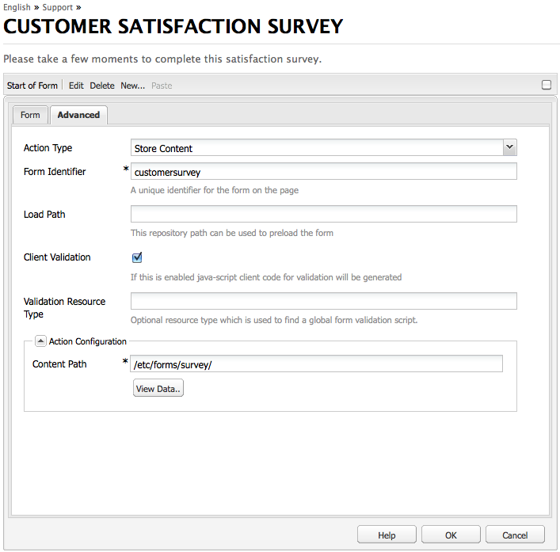

# O editor em massa{#the-bulk-editor}

O Editor de itens em massa permite uma edição muito eficiente quando o contexto da página visual não é necessário, pois permite:

* procurar (e exibir) conteúdo de várias páginas; isso é feito usando o GQL (Google Query Language)
* editar este conteúdo diretamente no editor em massa
* salvar as alterações (nas páginas de origem)
* exportar este conteúdo para um arquivo de planilha (.tsv) separado por tabulações

>[!NOTE]
>
>Você também pode importar conteúdo para o repositório, mas por padrão isso está desativado para o Editor de itens em massa, como disponível na variável **Ferramentas** console.

Esta seção descreve como trabalhar com o editor em massa no **Ferramentas** console. Normalmente, os administradores usam o editor em massa para pesquisar e editar vários itens. Isso é feito preenchendo a tabela usando uma consulta GQL e, em seguida, selecionando os itens de conteúdo nos quais deseja trabalhar. Os autores geralmente usam o editor em massa como parte de um aplicativo de editor em massa personalizado acessível por meio do [lista de produtos](/help/sites-authoring/default-components.md#productlist) componente.

>[!CAUTION]
>
>Com o [descontinuação da interface clássica](/help/release-notes/deprecated-removed-features.md) no AEM 6.4, o Editor de itens em massa também foi descontinuado e, portanto, o Adobe não planeja aprimorar ainda mais o Editor de itens em massa.

## Exemplo de caso de uso para o editor em massa {#example-use-case-for-the-bulk-editor}

Por exemplo, se você precisar de todos os nomes e endereços de email de usuários que preencheram uma pesquisa específica, o Editor de itens em massa poderá fornecer essas informações e você poderá exportá-las para uma planilha.

Um exemplo para ilustrar esse caso de uso está incluído no site do Geometrixx:

1. Navegue até o **Suporte** e depois para a **Satisfação do Serviço de Atendimento ao Cliente** pesquisa.
1. **Editar** o **Início do formulário** parágrafo. Na caixa de diálogo, clique no botão **Avançado** , expanda a **Configuração de ação**, depois clique em **Exibir Dados...**.

   

1. O Editor de itens em massa é totalmente personalizável. No entanto, neste exemplo, o editor de itens em massa não permite que os usuários editem o conteúdo, mas somente permite que eles exportem as informações para uma planilha.

   

## Como usar o editor em massa {#how-to-use-the-bulk-editor}

O editor em massa permite:

* [pesquise conteúdo com base em parâmetros de consulta, para exibir propriedades especificadas dos resultados em colunas, editar esse conteúdo e salvar as alterações](#searching-and-editing-content)
* [para exportar esse conteúdo para uma planilha separada por tabulações](#exporting-content)

* [para importar conteúdo de uma planilha separada por tabulações](#importing-content)

### Pesquisar e editar conteúdo {#searching-and-editing-content}

Para usar o editor em massa para editar vários itens simultaneamente:

1. No **Ferramentas** clique no **Importadores** para expandi-la.
1. Clique duas vezes no botão **Editor em massa** para abri-lo.
1. Insira seus requisitos de seleção:

<table>
 <tbody>
  <tr>
   <td>Texto</td>
   <td>Propriedade</td>
  </tr>
  <tr>
   <td>Caminho raiz</td>
   <td>Indica o caminho raiz que o editor em massa pesquisa.  Por exemplo, <code>/content/geometrixx/en</code>. O editor em massa pesquisa todos os nós secundários.</td>
  </tr>
  <tr>
   <td>Parâmetros de consulta </td>
   <td>Usando parâmetros GQL, insira a string de pesquisa que o editor em massa deve procurar no repositório; por exemplo, <code>type:Page</code> procura todas as páginas no caminho raiz, <code>text:professional</code> procura todas as páginas com a palavra "profissional" e <code>"jcr:title":English</code> O busca por todas as páginas que tenham "inglês" como título. Você só pode pesquisar por cadeias de caracteres.</td>
  </tr>
  <tr>
   <td>Caixa de seleção Modo de conteúdo</td>
   <td>Marque essa caixa de seleção para ler as propriedades dentro do <code>jcr:content</code> subnó dos resultados da pesquisa, se existir. Use somente para páginas. Nomes de propriedades recebem o prefixo <code>"jcr:content/"</code></td>
  </tr>
  <tr>
   <td>Propriedades / Colunas</td>
   <td>Marque as caixas de seleção das propriedades que você deseja que o editor em massa retorne. As propriedades selecionadas são os cabeçalhos de coluna no painel de resultados. Por padrão, o caminho do nó é exibido nos resultados.</td>
  </tr>
  <tr>
   <td>Propriedades / Colunas personalizadas</td>
   <td>Insira quaisquer outras propriedades que não estejam listadas na variável <strong>Propriedades/colunas</strong> campo. Essas propriedades personalizadas aparecem no painel de resultados. É possível adicionar várias propriedades usando uma vírgula para separar as propriedades. <i>Observação:</i> Se você adicionar uma propriedade personalizada que ainda não existe, AEM WCM exibirá uma célula vazia. Quando você modifica a célula vazia e a salva, a propriedade é adicionada ao nó . A propriedade recém-criada deve respeitar as restrições do tipo de nó e os namespaces da propriedade.</td>
  </tr>
 </tbody>
</table>

Por exemplo:

1. Clique em **Pesquisar**. O Editor de itens em massa exibe os resultados.
Para o exemplo acima, todas as páginas que atendem aos seus critérios de pesquisa são retornadas e exibidas com as colunas solicitadas.

   

1. Faça as alterações necessárias clicando duas vezes em uma célula.

   

1. Clique em **Salvar** para salvar suas alterações (o **Salvar** será ativada após a edição de uma célula).

   >[!CAUTION]
   >
   >As alterações feitas aqui são gravadas no conteúdo do repositório; por exemplo, a página referenciada em **Caminho**.

#### Parâmetros de consulta GQL adicionais {#additional-gql-query-parameters}

* **caminho:** somente pesquisar nós abaixo desse caminho. Se você especificar mais de um termo com um prefixo de caminho, somente o último será considerado.
* **tipo:** retornam somente nós dos tipos de nó especificados. Isso inclui os tipos principal e mixin. Você pode especificar vários tipos de nó separados por vírgula. O GQL retornará nós que sejam de qualquer um dos tipos especificados.
* **pedido:** ordene o resultado pelas propriedades fornecidas. Você pode especificar vários nomes de propriedades separados por vírgula. Para ordenar o resultado em ordem decrescente, basta prefixar o nome da propriedade com um sinal de menos. Por exemplo: order:-name. Usar um sinal de mais retornará o resultado em ordem crescente, que também é o padrão.
* **limite:** limita o número de resultados usando um intervalo. Por exemplo: limite:10.20 Observe que o intervalo é baseado em zero, o início é inclusivo e o fim é exclusivo. Você também pode especificar um intervalo aberto:limit:10. ou limite:..20 Se os pontos forem omitidos e apenas um valor for especificado, o GQL retornará no máximo esse número de resultados. Por exemplo, limit:10 (retornará os primeiros 10 resultados)

### Exportar conteúdo {#exporting-content}

Talvez seja necessário exportar conteúdo e fazer alterações em ele em uma planilha do Excel. Por exemplo, você pode exportar uma lista de endereçamento e alterar o código de área de todos os números de telefone listados diretamente no Excel, adicionar outras linhas e assim por diante.

Para exportar conteúdo:

1. Pesquise o conteúdo conforme descrito em [Pesquisar e editar conteúdo](#searching-and-editing-content).
1. Clique em **Exportar** para exportar as alterações para uma planilha do Excel separada por tabulações. AEM WCM pergunta onde deseja baixar o arquivo.

   >[!NOTE]
   >
   >Por padrão, as alterações são codificadas em [Windows-1252](https://en.wikipedia.org/wiki/Windows-1252) (também conhecido como CP-1252). Você pode verificar UTF-8 para exportar as alterações em UTF-8.

   

1. Selecione o local e confirme que deseja baixar o arquivo.
1. Após baixar o arquivo, é possível abri-lo a partir do programa de planilha, por exemplo, Microsoft Excel. O programa de planilha importa o arquivo e o converte em um formato de planilha.

   

### Importar conteúdo {#importing-content}

Por padrão, a funcionalidade de importação fica oculta quando você abre o Editor de itens em massa. Basta adicionar o parâmetro `hib=false` para que o URL exiba a variável **Importar** na página Editor de itens em massa . É possível importar conteúdo de qualquer guia separada por tabulação ( `.tsv`). Para que a importação funcione corretamente, os cabeçalhos da coluna (primeira linha de células) devem corresponder aos cabeçalhos da coluna da tabela para a qual você está importando.

>[!NOTE]
>
>Ao reimportar conteúdo, você apaga qualquer conteúdo anterior para esses nós. Tenha cuidado para não substituir informações importantes.

Para importar conteúdo:

1. Abra o Editor de itens em massa.
1. Adicionar `?hib=false` ao URL, por exemplo:
   `https://localhost:4502/etc/importers/bulkeditor.html?hib=false`
1. Clique em **Importar**.
1. Selecione o `.tsv` arquivo. Os dados são importados para o repositório.
