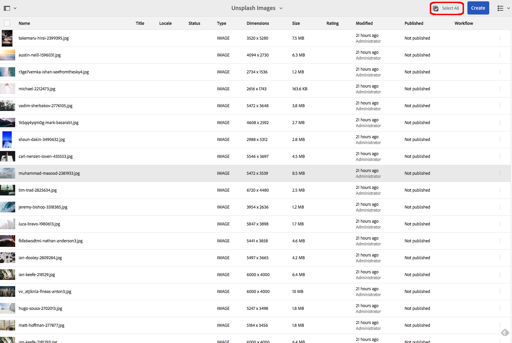

# Operações de processamento em massa {#bulk-processing-operations}

## Introdução {#introduction}

Com a versão mais recente do AEM, o botão de seleção de todos foi estendido para todas as visualizações: Lista, coluna e visualização de cartão. O botão selecionar tudo agora seleciona todo o conteúdo em uma determinada pasta ou coleção e não apenas os Ativos e Páginas que são carregados e visíveis no navegador do cliente.

As ações principais foram ativadas para a operação em massa: **Move**, **Delete** e **Copy**. Uma nova caixa de diálogo permitirá que os clientes saibam para quais ações o processamento em massa não está disponível.

## Como usar {#how-to-use}

Um novo botão chamado **Selecionar tudo** foi adicionado às visualizações de cartão, Lista ou coluna. Esse botão pode ser usado em qualquer uma das visualizações para selecionar todos os elementos no conjunto de dados.

Nas versões anteriores do AEM, a seleção era limitada ao que era carregado no navegador cliente. Estas novas alterações foram introduzidas para evitar confusões quanto ao número de elementos em que uma operação em massa está a ser efetuada.

Por enquanto, foram adicionadas três operações à transformação em massa:

* Mover
* Copiar
* Excluir

O suporte para mais operações será adicionado no futuro.
Para usar esse recurso, você precisa navegar até a pasta ou coleção na qual deseja executar a operação em massa em Páginas ou Ativos.

Em seguida, escolha uma das visualizações, como mostrado abaixo:

### Exibição de cartão {#card-view}

### Seleção em massa na Visualização do cartão {#bulk-selection-in-card-view}

Os ativos ou as páginas podem ser selecionados em massa usando o botão **Selecionar tudo** no canto superior direito:

 

### Exibição de lista   {#list-view}

O mesmo se aplica à Visualização de Listas:

### Seleção em massa na Visualização da Lista {#bulk-selection-in-list-view}

Na Visualização da Lista, use o botão **Selecionar tudo** ou use a caixa de seleção à esquerda para seleção em massa.

 

### Exibição de coluna {#column-view}

### Seleção em massa na Visualização de coluna {#bulk-selection-in-column-view}

## Operações ativadas em massa {#bulk-enabled-operations}

Após a seleção, uma das três ações ativadas em massa pode ser executada: **Mover**, **Copiar** ou **Eliminar**.

Aqui, a operação **Mover** é executada nos Ativos selecionados acima. Em qualquer uma das visualizações, isso resultará na movimentação de todos os Ativos para o local escolhido e não apenas para os que são carregados na tela.

Para outras operações que não são ativadas em massa, como **Download,** será mostrado um aviso informando que somente os elementos carregados no navegador serão incluídos na operação.

