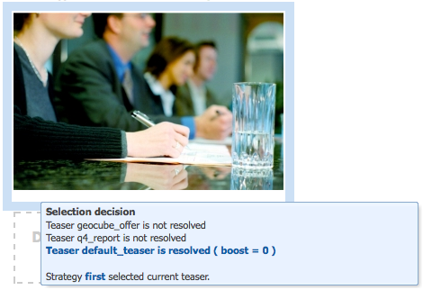

# Configuração da segmentação {#configuring-segmentation}

>[!NOTE]
>
>Este documento aborda a configuração da segmentação, conforme usada com o Client Context. Para configurar segmentos com o ContextHub usando a interface para toque, consulte [Configuração de segmentação com o ContextHub](/help/sites-administering/segmentation.md).

A segmentação é uma consideração importante ao criar uma campanha. Consulte [Glossário de segmentação](/help/sites-authoring/segmentation-overview.md) para obter informações sobre como a segmentação funciona e os termos principais.

Dependendo das informações que você já coletou sobre os visitantes do seu site e das metas que deseja alcançar, é necessário definir os segmentos e as estratégias necessárias para o seu conteúdo direcionado.

Esses segmentos são usados para fornecer conteúdo direcionado especificamente a um visitante. Esse conteúdo é mantido no [Campanhas](/help/sites-classic-ui-authoring/classic-personalization-campaigns.md) seção do site. As páginas de teaser definidas aqui podem ser incluídas como parágrafos de teaser em qualquer página e definem para qual segmento de visitante o conteúdo especializado se aplica.

O AEM permite criar e atualizar facilmente segmentos, teasers e campanhas. Também permite verificar os resultados das definições.

A variável **Editor de segmentos** O permite definir facilmente um segmento:

Você pode **Editar** cada segmento para especificar um **Título**, **Descrição** e **Aumentar** fator. Usando o sidekick você pode adicionar **E** e **OU** contêineres para definir o **Lógica do segmento** e, em seguida, adicione o **Características do segmento** para definir os critérios de seleção.

## Fator de reforço {#boost-factor}

Cada segmento tem um **Aumentar** parâmetro usado como fator de ponderação; um número mais alto indica que o segmento será selecionado em detrimento de um segmento com um número mais baixo.

* Valor mínimo: `0`
* Valor máximo: `1000000`

## Lógica do segmento {#segment-logic}

Os seguintes contêineres lógicos estão disponíveis prontamente e permitem construir a lógica da seleção de segmentos. Eles podem ser arrastados do sidekick para o editor:

<table>
 <tbody>
  <tr>
   <td> E Contêiner  </td>
   <td> O operador AND boolean.  </td>
  </tr>
  <tr>
   <td> Recipiente OR  </td>
   <td> O operador OR boolean.</td>
  </tr>
 </tbody>
</table>

## Características do segmento {#segment-traits}

As seguintes características de segmento estão disponíveis prontas para uso; elas podem ser arrastadas do sidekick para o editor:

<table>
 <tbody>
  <tr>
   <td> Intervalo de IP  </td>
   <td>Define um intervalo de endereços IP que o visitante pode ter.  </td>
  </tr>
  <tr>
   <td> Visita à página  </td>
   <td>Com que frequência a página foi solicitada.   </td>
  </tr>
  <tr>
   <td> Propriedade da página  </td>
   <td>Qualquer propriedade da página visitada.  </td>
  </tr>
  <tr>
   <td> Palavras-chave de referência  </td>
   <td>Palavras-chave para corresponder às informações do site de referência.   </td>
  </tr>
  <tr>
   <td> Script</td>
   <td>Expressão JavaScript a ser avaliada.  </td>
  </tr>
  <tr>
   <td> Referência do segmento   </td>
   <td>Referência a outra definição de segmento.  </td>
  </tr>
  <tr>
   <td> Nuvem de tags  </td>
   <td>Tags a serem correspondidas com aquelas das páginas visitadas.  </td>
  </tr>
  <tr>
   <td> Idade do usuário  </td>
   <td>Conforme retirado do perfil do usuário.  </td>
  </tr>
  <tr>
   <td> Propriedade do usuário  </td>
   <td>Quaisquer outras informações disponíveis no perfil do usuário. </td>
  </tr>
 </tbody>
</table>

É possível combinar essas características usando os operadores booleanos OR e AND (consulte [Criar um novo segmento](#creating-a-new-segment)) para definir o cenário exato para selecionar esse segmento.

Quando a declaração inteira for avaliada como verdadeira, esse segmento será resolvido. Caso vários segmentos sejam aplicáveis, o fator de **[reforço](/help/sites-administering/campaign-segmentation.md#boost-factor)** também é usado.

>[!CAUTION]
>
>O editor de segmentos não verifica se há referências circulares. Por exemplo, o segmento A faz referência a outro segmento B, que por sua vez faz referência ao segmento A. Você deve garantir que seus segmentos não contenham referências circulares.

>[!NOTE]
>
>Propriedades com o **_i18n** são definidos por um script que faz parte da clientlib da interface do usuário da personalização. Todas as clientlibs relacionadas à interface do usuário são carregadas no autor somente se a interface do usuário não for necessária na publicação.
>
>Portanto, ao criar um segmento com essas propriedades, normalmente é necessário confiar em **browserFamily** por exemplo, em vez de **browserFamily_i18n**.

### Criar um novo segmento {#creating-a-new-segment}

Para definir seu novo segmento:

1. No painel, escolha **Ferramentas > Operações > Configuração**.
1. Clique no link **Segmentação** no painel esquerdo e navegue até o local desejado.
1. Criar um [nova página](/help/sites-authoring/editing-content.md#creatinganewpage) usando o **Segmento** modelo.
1. Abra a nova página para ver o editor de segmentos:

   

1. Use o sidekick ou o menu de contexto (normalmente clique com o botão direito do mouse e selecione **Novo...** para abrir a janela Inserir novo componente) para encontrar a característica do segmento que você precisa. Em seguida, arraste-o para a **Editor de segmentos** ele aparecerá no padrão **E** recipiente.
1. Clique duas vezes na nova característica para editar os parâmetros específicos; por exemplo, a posição do mouse:

   

1. Clique em **OK** para salvar suas definições:
1. Você pode **Editar** a definição de segmento para fornecer uma **Título**, **Descrição** e **[Aumentar](#boost-factor)** fator:

   

1. Adicione mais características, se necessário. É possível formular expressões boolean usando o **E Contêiner** e **Contêiner OR** componentes encontrados em **Lógica do segmento**. Com o editor de segmentos, é possível excluir características ou contêineres que não são mais necessários ou arrastá-los para novas posições na instrução.

### Uso de contêineres AND e OR {#using-and-and-or-containers}

Você pode construir segmentos complexos no AEM. Isso ajuda a estar ciente de alguns pontos básicos:

* O nível superior da definição é sempre o contêiner AND criado inicialmente; isso não pode ser alterado, mas não afeta o restante da definição do segmento.
* Certifique-se de que o aninhamento do seu contêiner faça sentido. Os contêineres podem ser exibidos como colchetes da expressão boolean.

O exemplo a seguir é usado para selecionar visitantes que são:

Masculino e entre 16 e 65 anos

OU

Feminino e entre 16 e 62 anos

Como o operador principal é OU, você precisa começar com um **Contêiner OR**. Dentro deste, você tem duas instruções AND. Para cada uma delas, você precisa de uma **E Contêiner**, em que você pode adicionar as características individuais.

## Testar a aplicação de um segmento {#testing-the-application-of-a-segment}

Depois que o segmento é definido, os resultados potenciais podem ser testados com o auxílio do **[Client Context](/help/sites-administering/client-context.md)**:

1. Selecione o segmento a ser testado.
1. Pressione **[Ctrl-Alt-C](/help/sites-authoring/page-authoring.md#keyboardshortcuts)** para abrir o **[Client Context](/help/sites-administering/client-context.md)**, que mostra os dados coletados. Para fins de teste, é possível **Editar** determinados valores, ou **Carregar** outro perfil para ver o impacto.

1. Dependendo das características definidas, os dados disponíveis para a página atual podem ou não corresponder à definição do segmento. O status da correspondência é mostrado abaixo da definição.

Por exemplo, uma definição de segmento simples pode ser baseada na idade e no gênero do usuário. O carregamento de um perfil específico mostra que o segmento foi resolvido com êxito:

Ou não:

>[!NOTE]
>
>Todas as características são resolvidas imediatamente, embora a maioria seja alterada somente no recarregamento da página. As alterações na posição do mouse ficam visíveis imediatamente, portanto são úteis para fins de teste.

Esses testes também podem ser executados em páginas de conteúdo e em combinação com **Teaser** componentes.

Passar o mouse sobre um parágrafo de teaser mostrará os segmentos aplicados, se eles estão sendo resolvidos no momento e, portanto, por que a instância de teaser atual foi selecionada:

### Usar seu segmento {#using-your-segment}

Os segmentos são usados atualmente no [Campanhas](/help/sites-classic-ui-authoring/classic-personalization-campaigns.md). Eles são usados para orientar o conteúdo real visualizado por públicos-alvo específicos. Consulte [Noções básicas sobre segmentos](/help/sites-authoring/segmentation-overview.md) para obter mais informações.
