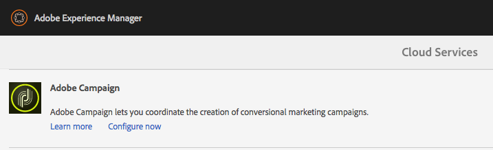

# Integração com o Adobe Campaign Classic{#integrating-with-adobe-campaign-classic}

>[!NOTE]
>
>Esta documentação descreve como integrar o AEM com a Adobe Campaign Classic, a solução local. Se estiver usando o Adobe Campaign Standard, consulte [Integração com o Adobe Campaign Standard](/help/sites-administering/campaignstandard.md) para essas instruções.

O Adobe Campaign permite gerenciar o conteúdo e os formulários de delivery de email diretamente no Adobe Experience Manager.

Para usar ambas as soluções em conjunto ao mesmo tempo, primeiro você deve configurá-las para se conectarem. Isso envolve etapas de configuração no Adobe Campaign e no Adobe Experience Manager. Essas etapas são descritas detalhadamente neste documento.

Trabalhar com o Adobe Campaign no AEM inclui a capacidade de enviar emails pelo Adobe Campaign e está descrita em [Trabalhar com o Adobe Campaign](/help/sites-authoring/campaign.md). Também inclui o uso de formulários em páginas AEM para manipular dados.

Além disso, os seguintes tópicos podem ser de interesse ao integrar AEM com o [Adobe Campaign](https://helpx.adobe.com/support/campaign/classic.html):

* [Práticas recomendadas para modelos de email](/help/sites-administering/best-practices-for-email-templates.md)
* [Solução de problemas da integração do Adobe Campaign](/help/sites-administering/troubleshooting-campaignintegration.md)

Se estiver estendendo sua integração com o Adobe Campaign, você pode querer ver as seguintes páginas:

* [Criação de extensões personalizadas](/help/sites-developing/extending-campaign-extensions.md)
* [Criação de mapeamentos de formulário personalizados](/help/sites-developing/extending-campaign-form-mapping.md)

## Fluxo de trabalho de integração do AEM e Adobe Campaign {#aem-and-adobe-campaign-integration-workflow}

Esta seção descreve um fluxo de trabalho típico entre o AEM e o Adobe Campaign ao criar campanhas e fornecer conteúdo.

O fluxo de trabalho típico envolve o seguinte e é descrito detalhadamente:

1. Comece a criar sua campanha (tanto no Adobe Campaign quanto no AEM).
1. Antes de vincular o conteúdo e o delivery, personalize o conteúdo no AEM e crie um delivery no Adobe Campaign.
1. Vincule o conteúdo e o delivery no Adobe Campaign.

### Comece a criar sua campanha {#start-building-your-campaign}

Você começa a criar uma campanha a qualquer momento. Antes de vincular o conteúdo, o AEM e o AC são independentes, o que significa que os profissionais de marketing podem começar a criar campanhas e direcionar no Adobe Campaign, enquanto os criadores de conteúdo estão trabalhando no design no AEM.

### Antes de vincular conteúdo e delivery {#before-linking-content-and-delivery}

Antes de vincular o conteúdo e criar um mecanismo de delivery, é necessário fazer o seguinte:

**Em AEM**

* Personalize usando os campos de personalização no **Texto e personalização** componente

**No Adobe Campaign**

* Criar um delivery do tipo **aemContent**

### Vinculação de conteúdo e definição de delivery {#linking-content-and-setting-delivery}

Após preparar o conteúdo para vinculação e entrega, você determinará exatamente como e onde vincular o conteúdo.

Todas essas etapas são concluídas no Adobe Campaign.

1. Especifique qual instância de AEM usar.
1. Sincronize o conteúdo clicando no botão Synchronize .
1. Abra o seletor de conteúdo para escolher seu conteúdo.

### Se você é novo em AEM {#if-you-are-new-to-aem}

Se você nunca AEM, poderá achar os seguintes links úteis para entender AEM:

* [AEM inicial](/help/sites-deploying/deploy.md)
* [Noções básicas sobre agentes de replicação](/help/sites-deploying/replication.md)
* [Como localizar e trabalhar com arquivos de log](/help/sites-deploying/monitoring-and-maintaining.md#working-with-audit-records-and-log-files)
* [Introdução à plataforma de AEM](/help/sites-deploying/platform.md)

## Configuração do Adobe Campaign {#configuring-adobe-campaign}

A configuração do Adobe Campaign envolve o seguinte:

1. Instalação do pacote de integração de AEM no Adobe Campaign.
1. Configuração de uma conta externa.
1. Verificando se AEMResourceTypeFilter está configurado corretamente.

Além disso, há configurações avançadas que você pode fazer, incluindo :

* Gerenciamento de blocos de conteúdo
* Gerenciamento de campos de personalização

Consulte [Configurações avançadas](#advanced-configurations).

>[!NOTE]
>
>Para executar essas operações, é necessário ter a variável **administração** na Adobe Campaign.

### Pré-requisitos {#prerequisites}

Verifique se você tem os seguintes elementos antecipadamente:

* [Uma instância de criação de AEM](/help/sites-deploying/deploy.md#getting-started)
* [Uma instância de publicação AEM](/help/sites-deploying/deploy.md#author-and-publish-installs)
* [Uma instância do Adobe Campaign Classic](https://helpx.adobe.com/support/campaign/classic.html) - incluindo um cliente e um servidor
* Internet Explorer 11

>[!NOTE]
>
>Se você estiver executando uma versão anterior à Adobe Campaign Classic build 8640, consulte o [documentação de atualização](https://docs.campaign.adobe.com/doc/AC6.1/en/PRO_Updating_Adobe_Campaign_Upgrading.html) para obter mais informações. Observe que o cliente e o banco de dados devem ser atualizados para a mesma build.

>[!CAUTION]
>
>Operações detalhadas na [Configuração do Adobe Campaign](#configuring-adobe-campaign) e [Configuração do Adobe Experience Manager](#configuring-adobe-experience-manager) são necessárias para que as funcionalidades de integração entre o AEM e o Adobe Campaign funcionem corretamente.

### Instalação do pacote de integração AEM {#installing-the-aem-integration-package}

Você deve instalar o **Integração de AEM** no Adobe Campaign. Para fazer isso:

1. Vá para a instância do Adobe Campaign que deseja vincular com o AEM.
1. Selecione *Ferramentas* > *Avançado* > *Importar pacote...*.

   

1. Clique em **Instale um pacote padrão**, em seguida, selecione o **Integração de AEM** pacote.

   

1. Clique em **Próximo** e depois **Iniciar**.

   Este pacote contém **aemserver** operador que será usado para conectar o servidor AEM ao Adobe Campaign.

   >[!CAUTION]
   >
   >Por padrão, nenhuma zona de segurança é configurada para esse operador. Para se conectar ao Adobe Campaign por meio do AEM, é necessário selecionar um.
   >
   >No **serverConf.xml** , o **allowUserPassword** deve ser definido como **true** autorizar AEM a conectar o Adobe Campaign via login/senha.
   >
   >É altamente recomendável criar uma zona de segurança dedicada ao AEM para evitar problemas de segurança. Para obter mais informações, consulte [Guia de instalação](https://docs.campaign.adobe.com/doc/AC/en/INS_Additional_configurations_Configuring_Campaign_server.html).

   

### Configuração de uma conta externa AEM {#configuring-an-aem-external-account}

Você deve configurar uma conta externa que permita conectar o Adobe Campaign à instância do AEM.

>[!NOTE]
>
>* Ao instalar o **Integração de AEM** , uma conta AEM externa é criada. Você pode configurar a conexão com a instância do AEM a partir dela ou criar uma nova.
>* Em AEM, certifique-se de definir a senha para o usuário remoto da campanha. É necessário definir essa senha para conectar o Adobe Campaign com o AEM. Faça logon como administrador e no console de administração do usuário, procure pelo usuário remoto da campanha e clique em **Definir senha**.
>


Para configurar uma conta AEM externa:

1. Vá para o **Administração** > **Plataforma** > **Contas externas** nó .
1. Crie uma nova conta externa e selecione o **AEM** tipo .
1. Insira os parâmetros de acesso para a instância de criação do AEM: o endereço do servidor, bem como a ID e a senha usadas para se conectar a esta instância. A senha da conta de usuário da api de campanha é a mesma do usuário remoto de campanha para o qual você definiu uma senha no AEM.

   >[!NOTE]
   >
   >Certifique-se de que o endereço do servidor **not** termine em uma barra à direita. Por exemplo, insira `https://yourserver:4502` em vez de `https://yourserver:4502/`

    

1. Certifique-se de que a variável **Ativado** está marcada.

### Verificação da opção AEMResourceTypeFilter {#verifying-the-aemresourcetypefilter-option}

O **AEMResourceTypeFilter** é usada para filtrar tipos de recursos AEM que podem ser usados no Adobe Campaign. Isso permite que o Adobe Campaign recupere AEM conteúdo especificamente projetado para ser usado somente no Adobe Campaign.

Essa opção deve vir pré-configurada; no entanto, se você alterar essa opção, ela poderá levar a uma integração inoperante.

Para verificar a **AEMResourceTypeFilter** está configurada:

1. Ir para **Plataforma** >**Opções**.
1. No **AEMResourceTypeFilter** verifique se os caminhos estão corretos. Este campo deve conter o valor :

   **mcm/campaign/components/newsletter,mcm/campaign/components/campaign_newsletterpage,mcm/neolane/components/newsletter**

   Ou, em alguns casos, o valor é o seguinte:

   **mcm/campaign/components/newsletter**

   

## Configuração do Adobe Experience Manager {#configuring-adobe-experience-manager}

Para configurar o AEM, você deve fazer o seguinte:

* Configure a replicação entre instâncias.
* Conecte o AEM ao Adobe Campaign via Cloud Services.
* Configure o externalizador.

### Configuração da replicação entre instâncias AEM {#configuring-replication-between-aem-instances}

O conteúdo criado da instância de criação do AEM é enviado primeiro para a instância de publicação. Você precisa publicar para que as imagens no boletim informativo estejam disponíveis na instância de publicação e nos destinatários do boletim informativo. Portanto, o agente de replicação deve ser configurado para replicar da instância de criação de AEM para a instância de publicação de AEM.

>[!NOTE]
>
>Se você não quiser usar o URL de replicação, mas usar o URL voltado para o público, poderá definir a variável **URL público** na seguinte configuração no OSGi (**Logotipo AEM** >  **Ferramentas** ícone >  **Operações** > **Console da Web** > **Configuração do OSGi** > **Integração do AEM Campaign - Configuração**):
**URL público:** com.day.cq.mcm.campaign.impl.IntegrationConfigImpl#aem.mcm.campaign.publicUrl

Essa etapa também é necessária para replicar determinadas configurações de instância de criação na instância de publicação.

Para configurar a replicação entre instâncias AEM:

1. Na instância de criação, selecione **Logotipo AEM**> **Ferramentas** ícone > **Implantação** > **Replicação** > **Agentes do autor**, depois clique em **Agente padrão**.

   

   >[!NOTE]
   Evite usar o host local (que é uma cópia local do AEM) ao configurar sua integração com o Adobe Campaign, a menos que a instância de publicação e autor esteja no mesmo computador.

1. Toque ou clique **Editar** em seguida, selecione o **Transportes** guia .
1. Configure o URI substituindo **localhost** com o endereço IP ou o endereço da instância de publicação AEM.

   

### Conectando AEM ao Adobe Campaign {#connecting-aem-to-adobe-campaign}

Antes de usar o AEM e o Adobe Campaign juntos, você deve estabelecer o link entre as duas soluções para que elas possam se comunicar.

1. Conecte-se à sua instância de criação de AEM.
1. Selecionar **Logotipo AEM** > **Ferramentas** ícone > **Implantação** > **Cloud Services**, em seguida **Configurar agora** na seção Adobe Campaign .

   

1. Crie uma nova configuração inserindo uma **Título** e clique em **Criar** ou escolha a configuração existente que deseja vincular à instância do Adobe Campaign.
1. Edite a configuração para que corresponda aos parâmetros da instância do Adobe Campaign.

   * **Nome do usuário**: **aemserver**, o operador do pacote de Integração do Adobe Campaign AEM usado para estabelecer o link entre as duas soluções.
   * **Senha**: Senha do operador do servidor do Adobe Campaign. Talvez seja necessário especificar novamente a senha desse operador diretamente no Adobe Campaign.
   * **Ponto final da API**: URL da instância do Adobe Campaign.

1. Selecionar **Conectar-se ao Adobe Campaign** e clique em **OK**.

   

   >[!NOTE]
   Depois de [crie seu email e publique-o](/help/sites-authoring/campaign.md), é necessário republicar a configuração na instância de publicação.

   

>[!NOTE]
Se a conexão falhar, verifique o seguinte:
* Você pode encontrar um problema de certificado ao usar uma conexão segura com uma instância do Adobe Campaign (https). Será necessário adicionar o certificado da instância do Adobe Campaign à variável **acertos** arquivo do JDK da instância do AEM.
* Uma zona de segurança deve ser configurada para a variável [operador aemserver](#connecting-aem-to-adobe-campaign) no Adobe Campaign. Além disso, no **serverConf.xml** , o **allowUserPassword** deve ser definido como **true** para autorizar AEM conexão com o Adobe Campaign usando o modo de logon/senha.
>
Além disso, consulte [Solução de problemas da integração do AEM/Adobe Campaign](/help/sites-administering/troubleshooting-campaignintegration.md).

### Configurar o externalizador {#configuring-the-externalizer}

Você precisa [configurar o externalizador](/help/sites-developing/externalizer.md) no AEM na instância do autor. O Externalizador é um serviço OSGi que permite transformar um caminho de recurso em um URL externo e absoluto. Esse serviço fornece um local central para configurar esses URLs externos e criá-los.

Consulte [Configurar o externalizador](/help/sites-developing/externalizer.md) para instruções gerais. Para a integração do Adobe Campaign, certifique-se de configurar o servidor de publicação em `https://<host>:<port>/system/console/configMgr/com.day.cq.commons.impl.ExternalizerImpl`não apontar para `localhost:4503` mas para um servidor que pode ser acessado pelo console do Adobe Campaign.

Se ela apontar para `localhost:4503` Para outro servidor que não possa ser acessado pelo Adobe Campaign, as imagens não serão exibidas no console Adobe Campaign.


## Configurações avançadas {#advanced-configurations}

Você também pode executar algumas configurações avançadas, a saber:

* Gerenciar campos e blocos de personalização.
* Desativar um bloco de personalização.
* Gerenciar dados de extensão do target.

### Gerenciamento de campos e blocos de personalização {#managing-personalization-fields-and-blocks}

Os campos e blocos disponíveis para adicionar personalização ao seu conteúdo de email no AEM são gerenciados pelo Adobe Campaign.

Uma lista padrão é fornecida, mas pode ser modificada. Também é possível adicionar ou ocultar campos e blocos de personalização.

#### Adição de um campo de personalização {#adding-a-personalization-field}

Para adicionar um novo campo de personalização àqueles que já estão disponíveis, é necessário estender o Adobe Campaign **nms:seedMember** schema como mostrado a seguir:

>[!CAUTION]
O campo que você precisa adicionar já deve ter sido adicionado por meio de uma extensão de schema do recipient (**nms:recipient**). Para obter mais informações, consulte o [Configuração](https://docs.campaign.adobe.com/doc/AC6.1/en/CFG_Editing_schemas_Editing_schemas.html) guia.

1. Vá para o **Administração** > **Configuração** > **Schemas de dados** na navegação do Adobe Campaign.
1. Selecionar **Novo**.

   

1. Na janela pop-up , selecione **Estender os dados na tabela usando um schema de extensão** e clique em **Próximo**.

   

1. Insira os diferentes parâmetros do schema estendido:

   * **Esquema**: selecione o **nms:seedMember** esquema. Os outros campos na janela são automaticamente preenchidos.
   * **Namespace**: personalize o namespace do schema estendido.

1. Edite o código XML do schema para especificar o campo que deseja adicionar lá. Para obter mais informações sobre a extensão de schemas no Adobe Campaign, consulte [Guia de configuração](https://docs.campaign.adobe.com/doc/AC6.1/en/CFG_Editing_schemas_Extending_a_schema.html).
1. Salve o schema e atualize a estrutura do banco de dados do Adobe Campaign por meio do **Ferramentas** > **Avançado** > **Atualizar estrutura do banco de dados** no console.
1. Desconecte e reconecte ao console Adobe Campaign para salvar as alterações. O novo campo agora aparece na lista de campos de personalização disponíveis no AEM.

#### Exemplo {#example}

Para adicionar uma **Número de registro** , você deve ter os seguintes elementos:

* O **nms:recipient** extensão de schema chamada **cus:recipient** contém:

```xml
<element desc="Recipient table (profiles)" img="nms:recipient.png" label="Recipients" labelSingular="Recipient" name="recipient">

  <attribute dataPolicy="smartCase" desc="Recipient registration number"
  label="Registration Number"
  length="50" name="registrationNumber" type="string"/>

</element>
```

O **nms:seedMember** extensão de schema chamada **cus:seedMember** contém:

```xml
<element desc="Seed to insert in the export files" img="nms:unknownad.png" label="Seed addresses" labelSingular="Seed" name="seedMember">

  <element name="custom_nms_recipient">
    <attribute name="registrationNumber"
    template="cus:recipient:recipient/@registrationNumber"/>
  </element>

</element>
```

O **Número de registro** agora faz parte dos campos de personalização disponíveis:


#### Ocultar um campo de personalização {#hiding-a-personalization-field}

Para ocultar um campo de personalização entre aqueles já disponíveis, é necessário estender o Adobe Campaign **nms:seedMember** conforme detalhado na [Adição de um campo de personalização](#adding-a-personalization-field) seção. Siga as etapas abaixo:

1. Copie o campo que deseja remover do **nms:seedMember** no schema estendido (**cus:seedMember** por exemplo).
1. Adicione o **advanced=&quot;true&quot;** Atributo XML ao campo. Ela não é mais exibida na lista de campos de personalização disponíveis no AEM.

   Por exemplo, para ocultar a variável **Nome do meio** , o **cud:seedMember** schema deve conter o seguinte elemento:

   ```xml
   <element desc="Seed to insert in the export files" img="nms:unknownad.png" label="Seed addresses" labelSingular="Seed" name="seedMember">
   
     <element name="custom_nms_recipient">
       <attribute advanced="true" name="middleName"/>
     </element>
   
   </element>
   ```

### Desativação de um bloco de personalização {#deactivating-a-personalization-block}

Para desativar um bloco de personalização entre os disponíveis:

1. Vá para o **Recursos** > **Campaign Management** > **Blocos de personalização** na navegação do Adobe Campaign.
1. Selecione o bloco de personalização que deseja desativar no AEM.
1. Limpe o **Visível nos menus de personalização** e salve as alterações. O bloco não é mais exibido na lista de blocos de personalização disponíveis no Adobe Campaign.

   

### Gerenciamento de dados de extensão do target {#managing-target-extension-data}

Você também pode inserir dados de extensão do target para personalização. Os dados de extensão do Target (também chamados &quot;Dados do Target&quot;) são provenientes do enriquecimento ou adição de dados em um query em um workflow de campanha, por exemplo. Para obter mais informações, consulte [Criação de consultas](https://docs.campaign.adobe.com/doc/AC/en/PTF_Creating_queries_About_queries_in_Campaign.html) e [Enriquecimento de dados](https://docs.campaign.adobe.com/doc/AC/en/WKF_Use_cases_Enriching_data.html) seções.

>[!NOTE]
Os dados no target só estarão disponíveis se o conteúdo AEM for sincronizado com um delivery do Adobe Campaign. Consulte [Sincronizar o conteúdo criado no AEM com um delivery do Adobe Campaign](/help/sites-authoring/campaign.md#synchronizing-content-created-in-aem-with-a-delivery-from-adobe-campaign-classic).


