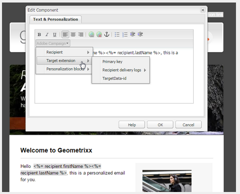

# Integração com o Adobe Campaign Classic{#integrating-with-adobe-campaign-classic}

>[!NOTE]
>
>Esta documentação descreve como integrar AEM com a Adobe Campaign Classic, a solução local. Se você estiver usando o Adobe Campaign Standard, consulte [Integração com o Adobe Campaign Standard](/help/sites-administering/campaignstandard.md) para obter essas instruções.

A Adobe Campaign permite gerenciar o conteúdo e os formulários dos delivery de email diretamente no Adobe Experience Manager.

Para usar as duas soluções juntas ao mesmo tempo, primeiro configure-as para se conectarem umas às outras. Isso envolve etapas de configuração no Adobe Campaign e no Adobe Experience Manager. Essas etapas são descritas detalhadamente neste documento.

Trabalhar com a Adobe Campaign no AEM inclui a capacidade de enviar emails via Adobe Campaign e está descrita em [Trabalhar com a Adobe Campaign](/help/sites-authoring/campaign.md). Também inclui o uso de formulários em páginas AEM para manipular dados.

Além disso, os seguintes tópicos podem ser de interesse ao integrar AEM com [Adobe Campaign](https://helpx.adobe.com/support/campaign/classic.html):

* [Práticas recomendadas para modelos de e-mail](/help/sites-administering/best-practices-for-email-templates.md)
* [Solução de problemas da integração com o Adobe Campaign](/help/sites-administering/troubleshooting-campaignintegration.md)

Se você estiver estendendo sua integração com o Adobe Campaign, talvez deseje ver as seguintes páginas:

* [Criação de extensões personalizadas](/help/sites-developing/extending-campaign-extensions.md)
* [Criação de mapeamentos de formulário personalizados](/help/sites-developing/extending-campaign-form-mapping.md)

## Fluxo de trabalho de integração AEM e Adobe Campaign {#aem-and-adobe-campaign-integration-workflow}

Esta seção descreve um fluxo de trabalho típico entre AEM e Adobe Campaign ao criar campanhas e fornecer conteúdo.

O fluxo de trabalho típico envolve o seguinte e é descrito em detalhes:

1. Start que cria sua campanha (tanto no Adobe Campaign quanto no AEM).
1. Antes de vincular o conteúdo e o delivery, personalize seu conteúdo no AEM e crie um delivery no Adobe Campaign.
1. Vincule conteúdo e delivery no Adobe Campaign.

### Start que cria sua campanha {#start-building-your-campaign}

Você start construindo uma campanha a qualquer momento. Antes de vincular o conteúdo, o AEM e o AC são independentes, o que significa que os profissionais de marketing podem criar suas campanhas e segmentar no Adobe Campaign, enquanto os criadores de conteúdo estão trabalhando no design no AEM.

### Antes de vincular conteúdo e delivery {#before-linking-content-and-delivery}

Antes de vincular o conteúdo e criar um mecanismo de delivery, é necessário fazer o seguinte:

**Em AEM**

* Personalize usando os campos de personalização no componente **Texto e personalização**

**No Adobe Campaign**

* Crie um delivery do tipo **aemContent**

### Vincular conteúdo e configurar delivery {#linking-content-and-setting-delivery}

Depois de preparar o conteúdo para vinculação e delivery, você determina exatamente como e onde vincular o conteúdo.

Todas essas etapas foram concluídas no Adobe Campaign.

1. Especifique qual instância AEM usar.
1. Sincronize o conteúdo clicando no botão Sincronizar.
1. Abra o seletor de conteúdo para selecionar seu conteúdo.

### Se você for novo em AEM {#if-you-are-new-to-aem}

Se você for novo em AEM, poderá achar os seguintes links úteis para entender a AEM:

* [Iniciando AEM](/help/sites-deploying/deploy.md)
* [Noções básicas sobre os agentes de replicação](/help/sites-deploying/replication.md)
* [Como localizar e trabalhar com arquivos de registro](/help/sites-deploying/monitoring-and-maintaining.md#working-with-audit-records-and-log-files)
* [Introdução à plataforma AEM](/help/sites-deploying/platform.md)

## Configurando o Adobe Campaign {#configuring-adobe-campaign}

A configuração do Adobe Campaign envolve o seguinte:

1. Instalação do pacote de integração AEM no Adobe Campaign.
1. Configuração de uma conta externa.
1. Verificando se AEMResourceTypeFilter está configurado corretamente.

Além disso, há configurações avançadas que você pode fazer, incluindo:

* Gerenciamento de blocos de conteúdo
* Gerenciamento de campos de personalização

Consulte [Configurações avançadas](#advanced-configurations).

>[!NOTE]
>
>Para executar essas operações, você deve ter a função **administration** no Adobe Campaign.

### Pré-requisitos {#prerequisites}

Verifique se você tem os seguintes elementos antecipadamente:

* [Uma instância de criação de AEM](/help/sites-deploying/deploy.md#getting-started)
* [Uma instância de publicação AEM](/help/sites-deploying/deploy.md#author-and-publish-installs)
* [Uma instância](https://helpx.adobe.com/support/campaign/classic.html)  do Adobe Campaign Classic - incluindo um cliente e um servidor
* Internet Explorer 11

>[!NOTE]
>
>Se você estiver executando uma versão anterior ao Adobe Campaign Classic build 8640, consulte a [documentação de atualização](https://docs.campaign.adobe.com/doc/AC6.1/en/PRO_Updating_Adobe_Campaign_Upgrading.html) para obter mais informações. Observe que tanto o cliente quanto o banco de dados precisam ser atualizados para a mesma compilação.

>[!CAUTION]
>
>As operações detalhadas nas seções [Configurar o Adobe Campaign](#configuring-adobe-campaign) e [Configurar o Adobe Experience Manager](#configuring-adobe-experience-manager) são necessárias para que as funcionalidades de integração entre o AEM e o Adobe Campaign funcionem corretamente.

### Instalando o Pacote de Integração AEM {#installing-the-aem-integration-package}

Você deve instalar o pacote **AEM Integration** no Adobe Campaign. Para fazer isso:

1. Vá para a instância do Adobe Campaign com a qual você gostaria de vincular AEM.
1. Selecione *Ferramentas* > *Avançado* > *Importar pacote...*.

   

1. Clique em **Instalar um pacote padrão** e selecione o pacote **AEM Integration**.

   

1. Clique em **Próximo** e em **Start**.

   Este pacote contém o operador **aemserver** que será usado para conectar o servidor AEM à Adobe Campaign.

   >[!CAUTION]
   >
   >Por padrão, nenhuma zona de segurança está configurada para esse operador. Para se conectar ao Adobe Campaign via AEM, é necessário selecionar um.
   >
   >No arquivo **serverConf.xml**, o atributo **allowUserPassword** da zona de segurança selecionada deve ser definido como **true** para autorizar AEM a conectar a Adobe Campaign via login/senha.
   >
   >Recomendamos criar uma zona de segurança dedicada à AEM para evitar problemas de segurança. Para obter mais informações, consulte o [Guia de instalação](https://docs.campaign.adobe.com/doc/AC/en/INS_Additional_configurations_Configuring_Campaign_server.html).

   

### Configuração de uma conta externa AEM {#configuring-an-aem-external-account}

Você deve configurar uma conta externa que permita conectar o Adobe Campaign à sua instância AEM.

>[!NOTE]
>
>* Ao instalar o pacote **AEM Integration**, uma conta AEM externa é criada. Você pode configurar a conexão com sua instância AEM a partir dela ou criar uma nova.
>* Em AEM, certifique-se de definir a senha para o usuário remoto da campanha. É necessário definir essa senha para conectar o Adobe Campaign com o AEM. Faça logon como administrador e no console de administração do usuário, procure o usuário remoto-campanha e clique em **Definir senha**.

>


Para configurar uma conta AEM externa:

1. Vá para o nó **Administration** > **Platform** > **Conta externa**.
1. Crie uma nova conta externa e selecione o tipo **AEM**.
1. Insira os parâmetros de acesso para a instância de criação de AEM: o endereço do servidor, bem como a ID e a senha usadas para conectar-se a essa instância. A senha da conta de usuário de api de campanha é a mesma do usuário remoto de campanha para o qual você definiu uma senha no AEM.

   >[!NOTE]
   >
   >Certifique-se de que o endereço do servidor **não** termine em uma barra à direita. Por exemplo, digite `https://yourserver:4502` em vez de `https://yourserver:4502/`

    

1. Verifique se a caixa de seleção **Enabled** está selecionada.

### Verificação da opção AEMResourceTypeFilter {#verifying-the-aemresourcetypefilter-option}

A opção **AEMResourceTypeFilter** é usada para filtrar tipos de recursos AEM que podem ser usados no Adobe Campaign. Isso permite que a Adobe Campaign recupere AEM conteúdo especificamente projetado para ser usado apenas no Adobe Campaign.

Essa opção deve vir pré-configurada; no entanto, se você alterar essa opção, ela poderá resultar em uma integração inoperante.

Para verificar se a opção **AEMResourceTypeFilter** está configurada:

1. Vá para **Plataforma** >**Opções**.
1. Na opção **AEMResourceTypeFilter**, verifique se os caminhos estão corretos. Este campo deve conter o valor:

   **mcm/campanha/componentes/newsletter,mcm/campanha/components/campanha_newsletterpage,mcm/neolane/components/newsletter**

   Ou, em alguns casos, o valor é o seguinte:

   **mcm/campanha/componentes/newsletter**

   

## Configurando o Adobe Experience Manager {#configuring-adobe-experience-manager}

Para configurar o AEM, faça o seguinte:

* Configure a replicação entre instâncias.
* Conecte AEM ao Adobe Campaign via Cloud Services.
* Configure o externalizador.

### Configurando a replicação entre instâncias AEM {#configuring-replication-between-aem-instances}

O conteúdo criado da instância de criação de AEM é enviado primeiro para a instância de publicação. É necessário publicar para que as imagens no boletim informativo estejam disponíveis na instância de publicação e nos recipient do boletim informativo. O agente de replicação deve, portanto, ser configurado para replicar da instância de criação AEM para a instância de publicação AEM.

>[!NOTE]
>
>Se você não quiser usar o URL de replicação, mas em vez disso usar o URL voltado para o público, poderá definir o **URL Público** na seguinte configuração no OSGi (**AEM logo** > **ícone Ferramentas** > **Operações** > **Console Web** > Configuração do OSGi **>** AEM Integração de Campanha - Configuração **):**
**URL público:** com.day.cq.mcm.campanha.impl.IntegrationConfigImpl#aem.mcm.campanha.publicUrl

Essa etapa também é necessária para replicar determinadas configurações de instância de criação na instância de publicação.

Para configurar a replicação entre instâncias AEM:

1. Na instância de criação, selecione **AEM logo**> **ícone Ferramentas** > **Implantação** > **Replicação** > **Agentes no autor** e clique em **Agente Predefinido**.

   

   >[!NOTE]
   Evite usar localhost (ou seja, uma cópia local de AEM) ao configurar sua integração com o Adobe Campaign, a menos que as instâncias de publicação e autor estejam ambas no mesmo computador.

1. Toque ou clique em **Editar** e selecione a guia **Transporte**.
1. Configure o URI substituindo **localhost** pelo endereço IP ou pelo endereço da instância de publicação AEM.

   

### Conectando AEM ao Adobe Campaign {#connecting-aem-to-adobe-campaign}

Antes de poder usar o AEM e o Adobe Campaign juntos, você deve estabelecer o link entre as duas soluções para que elas possam se comunicar.

1. Conecte-se à sua instância de criação de AEM.
1. Selecione **AEM logo** > **Ferramentas** ícone > **Implantação** > **Cloud Services** e **Configure now** na seção Adobe Campaign.

   

1. Crie uma nova configuração inserindo um **Título** e clique em **Criar**, ou escolha a configuração existente que deseja vincular à sua instância do Adobe Campaign.
1. Edite a configuração para que ela corresponda aos parâmetros da sua instância do Adobe Campaign.

   * **Nome de usuário**:  **aemserver**, o operador do pacote de Integração de AEM da Adobe Campaign usado para estabelecer o link entre as duas soluções.
   * **Senha**: Senha do operador do servidor Adobe Campaign. Talvez seja necessário especificar novamente a senha desse operador diretamente no Adobe Campaign.
   * **Ponto** final da API: URL da instância do Adobe Campaign.

1. Selecione **Ligar ao Adobe Campaign** e clique em **OK**.

   

   >[!NOTE]
   Depois de [criar seu email e publicá-lo](/help/sites-authoring/campaign.md), você precisa publicar novamente a configuração na instância de publicação.

   

>[!NOTE]
Se a conexão falhar, verifique o seguinte:
* Você pode encontrar um problema de certificado ao usar uma conexão segura com uma instância do Adobe Campaign (https). Será necessário adicionar o certificado de instância do Adobe Campaign ao arquivo **cacerts** do JDK da instância AEM.
* Uma zona de segurança deve ser configurada para o operador [aemserver](#connecting-aem-to-adobe-campaign) no Adobe Campaign. Além disso, no arquivo **serverConf.xml**, o atributo **allowUserPassword** da zona de segurança deve ser definido como **true** para autorizar AEM conexão com o Adobe Campaign usando o modo de logon/senha.

Além disso, consulte [Resolução de problemas da integração AEM/Adobe Campaign](/help/sites-administering/troubleshooting-campaignintegration.md).

### Configuração do externalizador {#configuring-the-externalizer}

É necessário [configurar o externalizador](/help/sites-developing/externalizer.md) no AEM na instância do autor. O Externalizador é um serviço OSGi que permite transformar um caminho de recurso em um URL externo e absoluto. Este serviço fornece um local central para configurar esses URLs externos e criá-los.

Consulte [Configure o externalizador](/help/sites-developing/externalizer.md) para obter instruções gerais. Para a integração com o Adobe Campaign, certifique-se de configurar o servidor de publicação em `https://<host>:<port>/system/console/configMgr/com.day.cq.commons.impl.ExternalizerImpl`não aponte para `localhost:4503`, mas para um servidor que possa ser acessado pelo console do Adobe Campaign.

Se ele apontar para `localhost:4503` ou outro servidor que a Adobe Campaign não pode acessar, suas imagens não aparecerão no console do Adobe Campaign.


## Configurações avançadas {#advanced-configurations}

Você também pode executar algumas configurações avançadas, a saber:

* Gerencie campos de personalização e blocos.
* Desative um bloco de personalização.
* Gerencie dados de extensão do target.

### Gerenciamento de campos de personalização e blocos {#managing-personalization-fields-and-blocks}

Os campos e blocos disponíveis para adicionar personalização ao seu conteúdo de email no AEM são gerenciados pela Adobe Campaign.

Uma lista padrão é fornecida, mas pode ser modificada. Você também pode adicionar ou ocultar campos de personalização e blocos.

#### Adicionar um campo de personalização {#adding-a-personalization-field}

Para adicionar um novo campo de personalização àqueles que já estão disponíveis, é necessário estender o schema Adobe Campaign **nms:sementeMember** da seguinte maneira:

>[!CAUTION]
O campo que você precisa adicionar já deve ter sido adicionado por meio de uma extensão de schema de recipient (**nms:recipient**). Para obter mais informações, consulte o guia [Configuração](https://docs.campaign.adobe.com/doc/AC6.1/en/CFG_Editing_schemas_Editing_schemas.html).

1. Vá para o nó **Administration** > **Configuration** > **schemas de dados** na navegação do Adobe Campaign.
1. Selecione **Novo**.

   

1. Na janela pop-up, selecione **Estender os dados na tabela usando um schema de extensão** e clique em **Próximo**.

   

1. Insira os diferentes parâmetros do schema estendido:

   * **Schema**: selecione os  **nms:** sementeMemberschema. Os outros campos na janela são automaticamente concluídos.
   * **Namespace**: personalize a namespace do schema estendido.

1. Edite o código XML do schema para especificar o campo que deseja adicionar. Para obter mais informações sobre como estender schemas no Adobe Campaign, consulte o [Guia de configuração](https://docs.campaign.adobe.com/doc/AC6.1/en/CFG_Editing_schemas_Extending_a_schema.html).
1. Salve seu schema e atualize a estrutura do banco de dados Adobe Campaign pelo menu **Ferramentas** > **Avançado** > **Atualizar estrutura do banco de dados** no console.
1. Desconecte e reconecte-se ao console do Adobe Campaign para salvar suas alterações. O novo campo agora aparece na lista de campos de personalização disponíveis no AEM.

#### Exemplo {#example}

Para adicionar um campo **Número de Registro**, você deve ter os seguintes elementos:

* A extensão de schema **nms:recipient** chamada **cus:recipient** contém:

```xml
<element desc="Recipient table (profiles)" img="nms:recipient.png" label="Recipients" labelSingular="Recipient" name="recipient">

  <attribute dataPolicy="smartCase" desc="Recipient registration number"
  label="Registration Number"
  length="50" name="registrationNumber" type="string"/>

</element>
```

A extensão de schema **nms:sementeMember** chamada **cus:sementeMember** contém:

```xml
<element desc="Seed to insert in the export files" img="nms:unknownad.png" label="Seed addresses" labelSingular="Seed" name="seedMember">

  <element name="custom_nms_recipient">
    <attribute name="registrationNumber"
    template="cus:recipient:recipient/@registrationNumber"/>
  </element>

</element>
```

O campo **Número de Registro** agora faz parte dos campos de personalização disponíveis:


#### Ocultar um campo de personalização {#hiding-a-personalization-field}

Para ocultar um campo de personalização entre aqueles que já estão disponíveis, você deve estender o schema Adobe Campaign **nms:sementeMember**, conforme detalhado na seção [Adicionar um campo de personalização](#adding-a-personalization-field). Aplique as seguintes etapas:

1. Copie o campo que você deseja retirar do schema **nms:sementeMember** no schema estendido (**cus:sementeMember** por exemplo).
1. Adicione o atributo XML **advanced=&quot;true&quot;** ao campo. Ela não aparece mais na lista de campos de personalização disponíveis no AEM.

   Por exemplo, para ocultar o campo **Nome do Meio**, o schema **cud:sementeMember** deve conter o seguinte elemento:

   ```xml
   <element desc="Seed to insert in the export files" img="nms:unknownad.png" label="Seed addresses" labelSingular="Seed" name="seedMember">
   
     <element name="custom_nms_recipient">
       <attribute advanced="true" name="middleName"/>
     </element>
   
   </element>
   ```

### Desativação de um bloco de personalização {#deactivating-a-personalization-block}

Para desativar um bloco de personalização entre os disponíveis:

1. Vá para o nó **Resources** > **Gestão de campanha** > **Alocos de personalização** na navegação do Adobe Campaign.
1. Selecione o bloco de personalização que deseja desativar no AEM.
1. Desmarque a caixa de seleção **Visível nos menus de personalização** e salve as alterações. O bloco não aparece mais na lista de alocos de personalização disponíveis no Adobe Campaign.

   

### Gerenciamento de dados de extensão do target {#managing-target-extension-data}

Você também pode inserir dados de extensão do target para personalização. Os dados de extensão do target (também chamados de &quot;Dados de Público alvo&quot;) vêm do enriquecimento ou adição de dados em um query em um fluxo de trabalho de campanha, por exemplo. Para obter mais informações, consulte as seções [Criação de query](https://docs.campaign.adobe.com/doc/AC/en/PTF_Creating_queries_About_queries_in_Campaign.html) e [Enriquecimento de dados](https://docs.campaign.adobe.com/doc/AC/en/WKF_Use_cases_Enriching_data.html).

>[!NOTE]
Os dados no público alvo só estarão disponíveis se o conteúdo do AEM for sincronizado com um delivery Adobe Campaign. Consulte [Sincronizar conteúdo criado em AEM com um delivery do Adobe Campaign](/help/sites-authoring/campaign.md#synchronizing-content-created-in-aem-with-a-delivery-from-adobe-campaign-classic).



