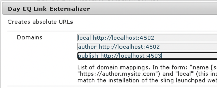

# Integração com o Adobe Campaign Classic {#integrating-campaign-classic}

Ao integrar AEM com o Adobe Campaign, você pode gerenciar a entrega de e-mails, conteúdo e formulários diretamente no AEM. As etapas de configuração no Adobe Campaign Classic e no AEM são necessárias para permitir a comunicação bidirecional entre as soluções.

Essa integração permite que o AEM e o Adobe Campaign Classic sejam usados de forma independente. Os profissionais de marketing podem criar campanhas e usar o direcionamento no Adobe Campaign, enquanto os criadores de conteúdo podem trabalhar em paralelo no design de conteúdo no AEM. Com a integração, o conteúdo e o design da campanha criada no AEM podem ser direcionados e entregues pelo Adobe Campaign.

## Etapas de integração {#integration-steps}

A integração entre o AEM e o Campaign requer várias etapas em ambas as soluções.

1. [Instalar o pacote de integração do AEM no Campaign.](#install-package)
1. [Criar um operador para o AEM no Campaign](#create-operator)
1. [Configurar a integração do Campaign no AEM](#campaign-integration)
1. [Configurar o externalizador do AEM](#externalizer)
1. [Configurar o usuário remoto de campanha no AEM](#configure-user)
1. [Configurar a conta externa do AEM no Campaign](#acc-setup)

Este documento aborda detalhadamente cada uma dessas etapas.

## Pré-requisitos {#prerequisites}

* Acesso de administrador ao Adobe Campaign Classic
   * Para executar a integração, é necessário ter uma instância do Adobe Campaign Classic em funcionamento, incluindo um banco de dados configurado.
   * Se você precisar de detalhes adicionais sobre como definir e configurar o Adobe Campaign Classic, consulte a [documentação do Adobe Campaign Classic,](https://experienceleague.adobe.com/docs/campaign-classic/using/campaign-classic-home.html?lang=pt-BR) em particular, o Guia de instalação e configuração.
* Acesso do administrador ao AEM

## Instalar o pacote de integração do AEM no Campaign {#install-package}

O pacote de **Integração do AEM** no Adobe Campaign inclui várias configurações padrão necessárias para se conectar ao AEM.

1. Como administrador, faça logon na instância do Adobe Campaign usando o console do cliente.

1. Selecione **Ferramentas** > **Avançado** > **Importar pacote...**.

   

1. Clique em **Instalar um pacote padrão** e, em seguida, clique em **Próximo**.

1. Verifique o pacote de **integração do AEM**.

   

1. Clique em **Próximo** e, em seguida, em **Iniciar** para começar a instalação.

   

1. Quando a instalação for concluída, clique em **Fechar**.

O pacote de integração agora está instalado.

## Criar o operador para AEM no Campaign {#create-operator}

O pacote de integração cria automaticamente o operador `aemserver` que o AEM usa para conectar-se ao Adobe Campaign. Você deve definir uma zona de segurança para esse operador e definir sua senha.

1. Faça logon no Adobe Campaign como administrador usando o console do cliente.

1. Selecione **Ferramentas** -> **Explorador** na barra de menus.

1. No explorador, navegue até o nó **Administração** > **Gerenciamento de acesso** > **Operadores**.

1. Selecione o operador `aemserver`.

1. Na guia **Editar** do operador, selecione a subguia **Direitos de acesso** e clique no link **Editar os parâmetros de acesso...**.

   

1. Selecione a zona de segurança apropriada e defina a máscara IP confiável conforme necessário.

1. Clique em **Salvar**.

1. Faça logout do cliente do Adobe Campaign.

1. No sistema de arquivos do servidor do Adobe Campaign, navegue até o local de instalação do Campaign e edite o arquivo `serverConf.xml` como administrador. Normalmente, esse arquivo está localizado em:
   * `C:\Program Files\Adobe\Adobe Campaign Classic v7\conf` no Windows.
   * `/usr/local/neolane/nl6/conf/eng` no Linux.

1. Procure por `securityZone` e certifique-se de que os seguintes parâmetros estejam definidos para a zona de segurança do operador do AEM.

   * `allowHTTP="true"`
   * `sessionTokenOnly="true"`
   * `allowUserPassword="true"`.

1. Salve o arquivo.

1. Certifique-se de que a zona de segurança não seja substituída pela respectiva configuração no arquivo `config-<server name>.xml`.

   * Se o arquivo de configuração contiver uma configuração de zona de segurança separada, altere o atributo `allowUserPassword` para `true`.

1. Se quiser alterar a porta do servidor do Adobe Campaign Classic, substitua `8080` pela porta desejada.

   >[!CAUTION]
   >
   >Por padrão, não há zona de segurança configurada para o operador. Para conectar o AEM ao Adobe Campaign, você deve selecionar uma zona conforme detalhado nas etapas anteriores.
   >
   >A Adobe recomenda fortemente a criação de uma zona de segurança dedicada ao AEM para evitar quaisquer problemas de segurança. Para obter mais informações sobre esse tópico, consulte a [Documentação do Adobe Campaign Classic.](https://experienceleague.adobe.com/docs/campaign-classic/using/installing-campaign-classic/additional-configurations/security-zones.html?lang=pt-BR)

1. No cliente do Campaign, retorne ao operador `aemserver` e selecione a guia **Geral**.

1. Clique no link **Redefinir senha...**.

1. Especifique uma senha e armazene-a em um local seguro para uso futuro.

1. Clique em **OK** para salvar a senha do operador `aemserver`.

## Configurar a integração do Campaign no AEM {#campaign-integration}

O AEM usa [o operador já configurado no Campaign](#create-operator) para se comunicar com o Campaign

1. Faça logon na instância de criação do AEM como administrador.

1. No painel lateral da navegação global, selecione **Ferramentas** > **Cloud Services** > **Cloud Services herdado** > **Adobe Campaign** e, depois, clique em **Configurar agora**.

   

1. Na caixa de diálogo, crie uma configuração do serviço do Campaign inserindo um **Título** e clique em **Criar**.

   

1. Uma nova janela e uma nova caixa de diálogo são abertas para editar a configuração. Forneça as informações necessárias.

   * **Nome do usuário** - este é [o operador do pacote de integração do AEM com o Adobe Campaign criado na etapa anterior.](#create-operator) Por padrão, é `aemserver`.
   * **Senha** - esta é a senha do [operador do pacote de integração do AEM com o Adobe Campaign criado na etapa anterior.](#create-operator)
   * **Endpoint da API** - este é o URL da instância do Adobe Campaign.

   

1. Selecione **Conectar ao Adobe Campaign** para verificar a conexão e clique em **OK**.

Agora, o AEM pode se comunicar com o Adobe Campaign.

>[!NOTE]
>
>Certifique-se de que o servidor do Adobe Campaign possa ser acessado pela Internet. AEM não pode acessar redes privadas.

## Configurar replicação para a instância de publicação do AEM {#replication}

O conteúdo da campanha é criado pelos autores de conteúdo na instância de criação do AEM. Normalmente, essa instância só está disponível internamente em sua organização. Para que conteúdo como imagens e ativos sejam acessíveis aos recipients da sua campanha, é necessário publicar esse conteúdo.

O agente de replicação é responsável pela publicação do conteúdo da instância do autor de AEM para a instância de publicação e deve ser configurado para que a integração funcione corretamente. Essa etapa também é necessária para replicar determinadas configurações de instância de criação na instância de publicação.

Para configurar a replicação da instância do autor do AEM para a instância de publicação:

1. Faça logon na instância de criação do AEM como administrador.

1. No painel lateral de navegação global, selecione **Ferramentas** > **Implantação** > **Replicação** > **Agentes do autor**, em seguida, toque ou clique em **Agente padrão (publicar)**.

   

1. Toque ou clique **Editar** em seguida, selecione o **Transportes** guia .

1. Configure o **URI** substituindo o campo padrão `localhost` com o endereço IP da instância de publicação AEM.

   

1. Toque ou clique **OK** para salvar as alterações nas configurações do agente.

Você configurou a replicação para a instância de publicação do AEM para que os recipients da campanha possam acessar o conteúdo.

>[!NOTE]
>
>Se você não quiser usar o URL de replicação, mas usar o URL voltado para o público, poderá definir o URL público na seguinte configuração por meio do OSGi
>
>No painel lateral de navegação global, selecione **Ferramentas** > **Operações** > **Console da Web** > **Configuração do OSGi** e procurar **Integração do AEM Campaign - Configuração**. Edite a configuração e altere o campo **URL público** (`com.day.cq.mcm.campaign.impl.IntegrationConfigImpl#aem.mcm.campaign.publicUrl`).

## Configurar o externalizador do AEM {#externalizer}

[O Externalizador é um serviço OSGi no AEM que transforma um caminho de recurso em um URL externo e absoluto, que é necessário para o AEM fornecer conteúdo que o Campaign possa usar. ](/help/sites-developing/externalizer.md) Você deve configurá-lo para que a integração do Campaign funcione.

1. Faça logon na instância de criação do AEM como administrador.
1. No painel lateral de navegação global, selecione **Ferramentas** > **Operações** > **Console da Web** > **Configuração do OSGi** e procurar **Externalizador de link CQ do dia**.
1. Por padrão, a última entrada no **Domínios** O campo destina-se à instância de publicação. Alterar o URL do padrão `http://localhost:4503` para sua instância de publicação disponível publicamente.

   

1. Toque ou clique em **Salvar**.

Você configurou o Externalizador e o Adobe Campaign agora pode acessar o conteúdo.

>[!NOTE]
A instância de publicação deve ser acessível através do servidor do Adobe Campaign. Se ela apontar para `localhost:4503` Para outro servidor que o Adobe Campaign não pode acessar, as imagens do AEM não serão exibidas no console do Adobe Campaign.

## Configure o usuário remoto de campanha no AEM {#configure-user}

Para que o Campaign se comunique com o AEM, é necessário definir uma senha para o usuário `campaign-remote` no AEM.

1. Faça logon no AEM como administrador.
1. No console de navegação principal, clique em **Ferramentas** no painel esquerdo.
1. Em seguida, clique em **Segurança** -> **Usuários** para abrir o console de administração do usuário.
1. Localize o usuário `campaign-remote`.
1. Selecione o usuário `campaign-remote` e clique em **Propriedades** para editá-lo.
1. Na janela **Editar configurações de usuário**, clique em **Alterar senha**.
1. Forneça uma nova senha para o usuário e anote-a em um local seguro para uso futuro.
1. Clique em **Salvar** para salvar a alteração da senha.
1. Clique em **Salvar e fechar** para salvar as alterações no usuário `campaign-remote`.

## Configurar a conta externa do AEM no Campaign {#acc-setup}

Ao [instalar o pacote de **integração do AEM** no Campaign,](#install-package) uma conta externa é criada para o AEM. Ao configurar essa conta externa, o Adobe Campaign pode se conectar ao AEM, permitindo a comunicação bidirecional entre as soluções.

1. Faça logon no Adobe Campaign como administrador usando o console do cliente.

1. Selecione **Ferramentas** -> **Explorador** na barra de menus.

1. No explorador, navegue até o nó **Administração** > **Plataforma** > **Contas externas**.

   

1. Localize a conta externa do AEM. Por padrão, ela tem os valores:

   * **Tipo** - `AEM`
   * **Rótulo** - `AEM Instance`
   * **Nome interno** - `aemInstance`

1. Na guia **Geral** dessa conta, insira as informações de usuário definidas na etapa [Definir senha do usuário remoto de campanha](#set-campaign-remote-password).

   * **Servidor** - O endereço do servidor do autor do AEM
      * O servidor do autor do AEM deve ser acessível através da instância do servidor do Adobe Campaign Classic.
      * Certifique-se de que o endereço do servidor **não** termine em uma barra.
   * **Conta** - Por padrão, esse é o usuário `campaign-remote` definido no AEM na etapa [Definir senha do usuário remoto de campanha](#set-campaign-remote-password).
   * **Senha** - Esta senha é igual à do usuário `campaign-remote` definido no AEM na etapa [Definir senha do usuário remoto de campanha](#set-campaign-remote-password).

1. Marque a caixa de seleção **Ativado**.

1. Clique em **Salvar**.

O Adobe Campaign agora pode se comunicar com o AEM.

## Próximas etapas {#next-steps}

Com o Adobe Campaign Classic e o AEM configurados, a integração agora é concluída.

Agora você pode aprender a criar um informativo no Adobe Experience Manager seguindo para [este documento.](/help/sites-authoring/campaign.md)
