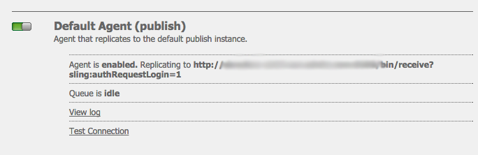

# Integração com o Adobe Campaign Standard {#integrating-with-adobe-campaign-standard}

Ao integrar o AEM ao Adobe Campaign, é possível gerenciar a entrega de emails, o conteúdo e os formulários diretamente no AEM. As etapas de configuração no Adobe Campaign Standard e no AEM são necessárias para permitir a comunicação bidirecional entre as soluções.

Essa integração permite que o AEM e o Adobe Campaign Standard sejam usados de forma independente. Os profissionais de marketing podem criar campanhas e usar o direcionamento no Adobe Campaign, enquanto os criadores de conteúdo podem trabalhar em paralelo no design de conteúdo no AEM. Usando a integração, o conteúdo e o design da campanha criada no AEM podem ser direcionados e entregues pelo Adobe Campaign.

## Etapas de integração {#integration-steps}

A configuração da integração entre o AEM e o Adobe Campaign Standard requer várias etapas em ambas as soluções.

1. [Configure o ](#aemserver-user)
1. [Verifique se ](#resource-type-filter)
1. [Criar um template do delivery de email específico para AEM no Campaign](#aem-email-delivery-template)
1. [Configurar a integração do Campaign no AEM](#campaign-integration)
1. [Configurar replicação para a instância de publicação do AEM](#replication)
1. [Configurar o externalizador do AEM](#externalizer)
1. [Configure o ](#campaign-remote-user)
1. [Configurar a conta externa do AEM no Campaign](#acc-external-user)

Este documento aborda detalhadamente cada uma dessas etapas.

## Pré-requisitos {#prerequisites}

* Acesso de administrador ao Adobe Campaign Standard
   * Se você precisar de detalhes adicionais sobre como instalar e configurar o Adobe Campaign Standard, consulte o [Documentação do Adobe Campaign Standard.](https://experienceleague.adobe.com/docs/campaign-standard/using/campaign-standard-home.html)
* Acesso de administrador ao AEM

## Configurar o usuário aemserver no Campaign {#aemserver-user}

O Adobe Campaign Standard, por padrão, vem com uma `aemserver` usuário que o AEM usa para se conectar ao Adobe Campaign. Você deve atribuir um grupo de segurança apropriado para este usuário e definir sua senha.

1. Faça logon no Adobe Campaign como administrador.

1. Toque ou clique no Logotipo do Adobe Campaign na parte superior esquerda da barra de menus para abrir a navegação global e selecione **Administração** > **Usuários e segurança** > **Usuários** no menu de navegação.

1. Toque ou clique no `aemserver` usuário no console de usuários.

1. Certifique-se de que o `aemserver` o usuário for atribuído, no mínimo, a um grupo de segurança que tenha a função `deliveryPrepare` atribuído a ele. Por padrão, o grupo `Standard Users` O tem essa função.

   

1. Toque ou clique **Salvar** para salvar as alterações.

Seu `aemserver` Agora o usuário do tem os direitos necessários para que o AEM possa usá-lo para se comunicar com o Adobe Campaign.

No entanto, antes que o AEM possa usar o `aemserver` usuário, sua senha deve ser definida. Isso não pode ser feito por meio do Adobe Campaign. Deve ser executado por um engenheiro de suporte de Adobe. [Crie um tíquete junto ao Atendimento ao cliente do Adobe](https://experienceleague.adobe.com/?support-tab=home&amp;lang=pt-BR#support) para solicitar a redefinição do `aemserver` senha. Depois de receber a senha do Atendimento ao cliente do Adobe, mantenha-a em um local seguro.

## Verificar o AEMResourceTypeFilter no Campaign {#resource-type-filter}

A variável `AEMResourceTypeFilter` no Adobe Campaign, é uma opção usada para filtrar recursos AEM que podem ser usados no Adobe Campaign. Como o AEM tem muito conteúdo, essa opção atua como um filtro que permite que o Adobe Campaign recupere somente o conteúdo do AEM de tipos especificamente projetados para serem usados no Adobe Campaign.

Essa opção vem pré-configurada. No entanto, talvez seja necessário atualizá-la se você tiver personalizado os componentes do Campaign do AEM. Para verificar se o `AEMResourceTypeFilter` estiver configurada, siga estas etapas.

1. Faça logon no Adobe Campaign como administrador.

1. Toque ou clique no Logotipo do Adobe Campaign na parte superior esquerda da barra de menus para abrir a navegação global e selecione **Administração** > **Configurações do aplicativo** > **Opções** no menu de navegação.

1. Toque ou clique no `AEMResourceTypeFilter` no console opções.

1. Confirme a configuração do `AEMResourceTypeFilter`. Os caminhos são delimitados com vírgulas e, por padrão, contêm:

   * `mcm/campaign/components/newsletter`
   * `mcm/campaign/components/campaign_newsletterpage`
   * `mcm/neolane/components/newsletter`

   

1. Toque ou clique **Salvar** para salvar as alterações.

Seu `AEMResourceTypeFilter` O agora está configurado para recuperar o conteúdo correto do AEM.

## Criar um template do delivery de email específico para AEM no Campaign {#aem-email-delivery-template}

Por padrão, o AEM não está ativado nos templates de email do Adobe Campaign. Você deve configurar um novo template do delivery de email que possa ser usado para criar emails usando conteúdo AEM. Para criar um template do delivery de email específico para AEM, siga estas etapas.

1. Faça logon no Adobe Campaign como administrador.

1. Toque ou clique no Logotipo do Adobe Campaign na parte superior esquerda da barra de menus para abrir a navegação global e selecione **Recursos** > **Modelos** > **Modelos de entrega** no menu de navegação.

1. No console de templates do delivery, localize o template de email padrão **Enviar por email (email)** e passe o mouse sobre a placa (ou linha) que a representa para revelar as opções. Clique em **Duplicar elemento**.

   

1. No **Confirmação** clique em **Confirmar o** para duplicar o template.

   

1. O editor de modelo é aberto com a sua cópia do **Enviar por email (email)** modelo. Clique em **Editar propriedades** ícone na parte superior direita da janela.

   

1. Na janela de propriedades, altere a variável **Rótulo** para descrever seu novo modelo de AEM.

1. Clique em **Conteúdo** cabeçalho para expandi-lo e selecionar **Adobe Experience Manager** no **Fonte de conteúdo** menu suspenso.

1. Isso revela o **Conta do Adobe Experience Manager** campo. Use o menu suspenso para selecionar **Instância do Adobe Experience Manager (aemInstance)** usuário. Esse é o usuário externo padrão para a integração com o AEM.

1. Clique em **Confirmar o** para salvar as alterações nas propriedades.

1. No editor de modelo, clique em **Salvar** para salvar sua cópia modificada do modelo de email para uso com AEM.

Agora você tem um template de email que pode usar conteúdo AEM.

## Configurar a integração do Campaign no AEM {#campaign-integration}

O AEM se comunica com o Adobe Campaign usando uma integração integrada e o `aemserver` usuário que você configurou no Adobe Campaign. Siga estas etapas para configurar essa integração.

1. Faça logon na instância de criação do AEM como administrador.

1. No painel lateral da navegação global, selecione **Ferramentas** > **Cloud Services** > **Cloud Services herdado** > **Adobe Campaign** e, depois, clique em **Configurar agora**.

   

1. Na caixa de diálogo, crie uma configuração do serviço do Campaign inserindo um **Título** e clique em **Criar**.

   

1. Uma nova janela e uma nova caixa de diálogo são abertas para editar a configuração. Forneça as informações necessárias.

   * **Nome de usuário** - Isto é [o `aemserver` usuário no Adobe Campaign que você configurou em uma etapa anterior.](#aemserver-user) Por padrão, é `aemserver`.
   * **Senha** - Esta é a senha para [o `aemserver` usuário na Adobe Campaign que você solicitou do Atendimento ao cliente da Adobe em uma etapa anterior.](#aemserver-user)
   * **Endpoint da API** - este é o URL da instância do Adobe Campaign.

   

1. Selecione **Conectar ao Adobe Campaign** para verificar a conexão e clique em **OK**.

Agora, o AEM pode se comunicar com o Adobe Campaign.

>[!NOTE]
>
>Certifique-se de que o servidor do Adobe Campaign possa ser acessado pela Internet. O AEM não pode acessar redes privadas.

## Configurar replicação para a instância de publicação do AEM {#replication}

O conteúdo da campanha é criado por autores de conteúdo na instância de criação do AEM. Normalmente, essa instância só está disponível internamente em sua organização. Para que conteúdo como imagens e ativos seja acessível aos recipients da sua campanha, é necessário publicar esse conteúdo.

O agente de replicação é responsável pela publicação do conteúdo da instância do autor do AEM na instância de publicação e deve ser configurado para que a integração funcione corretamente. Essa etapa também é necessária para replicar determinadas configurações de instância de criação na instância de publicação.

Para configurar a replicação da instância do autor do AEM para a instância de publicação:

1. Faça logon na instância de criação do AEM como administrador.

1. No painel lateral da navegação global, selecione **Ferramentas** > **Implantação** > **Replicação** > **Agentes sobre o autor** e toque ou clique **Agente padrão (publicação)**.

   

1. Toque ou clique **Editar** em seguida, selecione o **Transporte** guia.

1. Configure o **URI** substituindo o padrão `localhost` com o endereço IP da instância de publicação AEM.

   

1. Toque ou clique **OK** para salvar as alterações nas configurações do agente.

Você configurou a replicação para a instância de publicação do AEM para que os recipients da campanha possam acessar o conteúdo.

>[!NOTE]
>
>Se você não quiser usar o URL de replicação, mas usar o URL voltado para o público, poderá definir o URL público na seguinte definição de configuração via OSGi
>
>No painel lateral da navegação global, selecione **Ferramentas** > **Operações** > **Console da Web** > **Configuração OSGi** e pesquisar **Integração da campanha AEM - Configuração**. Editar a configuração e alterar o campo **URL público** (`com.day.cq.mcm.campaign.impl.IntegrationConfigImpl#aem.mcm.campaign.publicUrl`).

## Configurar o externalizador do AEM {#externalizer}

[O Externalizador é um serviço OSGi no AEM que transforma um caminho de recurso em um URL externo e absoluto, que é necessário para o AEM fornecer conteúdo que o Campaign possa usar. ](/help/sites-developing/externalizer.md) Você deve configurá-la para que a integração do Campaign funcione.

1. Faça logon na instância de criação do AEM como administrador.
1. No painel lateral da navegação global, selecione **Ferramentas** > **Operações** > **Console da Web** > **Configuração OSGi** e pesquisar **Day CQ link Externalizer**.
1. Por padrão, a última entrada na variável **Domínios** O campo é destinado à instância de publicação. Alterar o URL do padrão `http://localhost:4503` à sua instância de publicação disponível publicamente.

   

1. Toque ou clique em **Salvar**.

Você configurou o Externalizador e o Adobe Campaign agora pode acessar o conteúdo.

>[!NOTE]
A instância de publicação deve ser acessível através do servidor do Adobe Campaign. Se ele apontar para `localhost:4503` Para outro servidor que o Adobe Campaign não pode acessar, as imagens do AEM não aparecerão no console do Adobe Campaign.

## Configurar o usuário remoto de campanha no AEM {#campaign-remote-user}

Assim como você precisa de um usuário no Adobe Campaign que o AEM possa usar para se comunicar com o Adobe Campaign, o Adobe Campaign AEM AEM também precisa de um usuário no para se comunicar com o. Por padrão, a integração do Campaign cria a variável `campaign-remote` usuário no AEM. Siga estas etapas para configurar esse usuário.

1. Faça logon no AEM como administrador.
1. No console de navegação principal, clique em **Ferramentas** no painel esquerdo.
1. Clique em **Segurança** > **Usuários** para abrir o console administração de usuários.
1. Localize o usuário `campaign-remote`.
1. Selecione o usuário `campaign-remote` e clique em **Propriedades** para editá-lo.
1. Na janela **Editar configurações de usuário**, clique em **Alterar senha**.
1. Forneça uma nova senha para o usuário e anote-a em um local seguro para uso futuro.
1. Clique em **Salvar** para salvar a alteração da senha.
1. Clique em **Salvar e fechar** para salvar as alterações no usuário `campaign-remote`.

## Configurar a conta externa do AEM no Campaign {#acc-external-user}

Quando você [criou um template do delivery de email específico para AEM,](#aem-email-delivery-template) você especificou que o modelo deve usar a variável `aemInstance` conta externa para se comunicar com o AEM. Para habilitar a comunicação bidirecional entre as duas soluções, é necessário configurar essa conta no Adobe Campaign.

1. Faça logon no Adobe Campaign como administrador.

1. Toque ou clique no Logotipo do Adobe Campaign na parte superior esquerda da barra de menus para abrir a navegação global e selecione **Administração** > **Configurações do aplicativo** > **Contas externas** no menu de navegação.

1. Toque ou clique no **Instância do Adobe Experience Manager (aemInstance)** usuário no console de usuários.

1. Verifique se o usuário tem **Adobe Experience Manager** como o **Tipo**.

1. No **Conexão** defina os seguintes campos:

   1. Servidor: este é o URL do seu servidor de criação AEM. Isso não deve terminar com uma barra.
   1. Conta: esta é a `campaign-remote` usuário você [previamente configurado no AEM.](#campaign-remote-user)
   1. Senha: esta é a senha para o `campaign-remote`usuário você [previamente configurado no AEM.](#campaign-remote-user)

   

1. Certifique-se de que o **Ativado** estiver marcada e clique em **Salvar** para salvar as alterações.

Parabéns! Você concluiu a integração entre o AEM e o Adobe Campaign Standard!

## Próximas etapas {#next-steps}

Com o Adobe Campaign Classic e o AEM configurados, a integração está concluída.

Agora você pode aprender a criar um informativo no Adobe Experience Manager seguindo para [este documento.](/help/sites-authoring/campaign.md)
