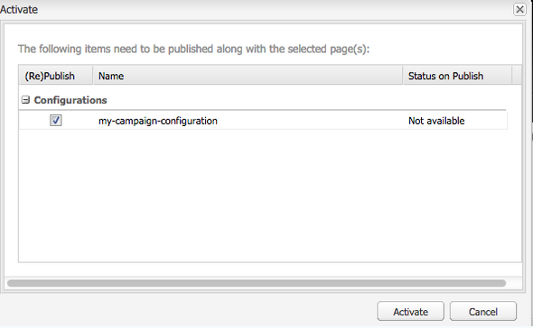

# Integração com o Adobe Campaign Standard{#integrating-with-adobe-campaign-standard}

>[!NOTE]
>
>Esta documentação descreve como integrar o AEM com a Adobe Campaign Standard, a solução por assinatura. Se estiver usando o Adobe Campaign 6.1, consulte [Integração com o Adobe Campaign 6.1](/help/sites-administering/campaignonpremise.md) para essas instruções.

O Adobe Campaign permite gerenciar o conteúdo e os formulários de delivery de email diretamente no Adobe Experience Manager.

Para usar ambas as soluções em conjunto ao mesmo tempo, primeiro você deve configurá-las para se conectarem. Isso envolve etapas de configuração no Adobe Campaign e no Adobe Experience Manager. Essas etapas são descritas detalhadamente neste documento.

Trabalhar com o Adobe Campaign no AEM inclui a capacidade de enviar emails e formulários por meio do Adobe Campaign e está descrita em [Trabalhar com o Adobe Campaign](/help/sites-authoring/campaign.md).

Além disso, os seguintes tópicos podem ser de interesse ao integrar AEM com o [Adobe Campaign](https://docs.campaign.adobe.com/doc/standard/en/home.html):

* [Práticas recomendadas para modelos de email](/help/sites-administering/best-practices-for-email-templates.md)
* [Solução de problemas da integração do Adobe Campaign](/help/sites-administering/troubleshooting-campaignintegration.md)

Se estiver estendendo sua integração com o Adobe Campaign, você pode querer ver as seguintes páginas:

* [Criação de extensões personalizadas](/help/sites-developing/extending-campaign-extensions.md)
* [Criação de mapeamentos de formulário personalizados](/help/sites-developing/extending-campaign-form-mapping.md)

## Configuração do Adobe Campaign {#configuring-adobe-campaign}

A configuração do Adobe Campaign envolve o seguinte:

1. Configurar a **aemserver** usuário.
1. Criação de uma conta externa dedicada.
1. Verificando a opção AEMResourceTypeFilter .
1. Criação de um template de delivery dedicado.

>[!NOTE]
>
>Para executar essas operações, é necessário ter a variável **administração** na Adobe Campaign.

### Pré-requisitos {#prerequisites}

Verifique se você tem os seguintes elementos antecipadamente:

* [Uma instância de criação de AEM](/help/sites-deploying/deploy.md#getting-started)
* [Uma instância de publicação AEM](/help/sites-deploying/deploy.md#author-and-publish-installs)
* [Uma instância do Adobe Campaign](https://docs.adobe.com/content/docs/en/campaign/ACS.html)

>[!CAUTION]
>
>Operações detalhadas na [Configuração do Adobe Campaign](#configuring-adobe-campaign) e [Configuração do Adobe Experience Manager](#configuring-adobe-experience-manager) são necessárias para que as funcionalidades de integração entre o AEM e o Adobe Campaign funcionem corretamente.

### Configurar o usuário aemserver {#configuring-the-aemserver-user}

O **aemserver** O usuário deve ser configurado no Adobe Campaign. O **aemserver** é um usuário técnico que será usado para conectar o servidor de AEM ao Adobe Campaign.

Ir para **Administração** >  **Usuários e segurança** >  **Usuários** e selecione o **aemserver** usuário. Clique para abrir as configurações do usuário.

* Tem de definir uma senha para este utilizador. Isso não pode ser feito por meio da interface do usuário do . Essa configuração deve ser feita em REST por um administrador técnico.
* Você pode atribuir funções específicas a esse usuário, como **deliveryPrepare**, que permite que o usuário crie e edite deliveries.

### Configuração de uma conta externa Adobe Experience Manager {#configuring-an-adobe-experience-manager-external-account}

Você deve configurar uma conta externa que permita conectar o Adobe Campaign à instância do AEM.

>[!NOTE]
>
>Em AEM, certifique-se de definir a senha para o usuário remoto da campanha. É necessário definir essa senha para conectar o Adobe Campaign com o AEM. Faça logon como administrador e no console de administração do usuário, procure pelo usuário remoto da campanha e clique em **Definir senha**.

Para configurar uma conta externa AEM:

1. Ir para **Administração** > **Configurações do aplicativo** > **Contas externas**.

   

1. Selecione o padrão **aemInstance** conta externa ou crie uma nova clicando no botão **Criar** botão.
1. Selecionar **Adobe Experience Manager** i na **Tipo** e insira os parâmetros de acesso usados para sua instância de criação de AEM: endereço do servidor, nome da conta e senha.

   >[!NOTE]
   >
   >Certifique-se de não adicionar um final **/** barra no final do URL ou a conexão não funcionará.

1. Certifique-se de que a variável **Ativado** estiver marcada, em seguida, clique em **Salvar** para salvar as modificações.

### Verificação da opção AEMResourceTypeFilter {#verifying-the-aemresourcetypefilter-option}

O **AEMResourceTypeFilter** é usada para filtrar tipos de recursos AEM que podem ser usados no Adobe Campaign. Isso permite que o Adobe Campaign recupere AEM conteúdo especificamente projetado para ser usado somente no Adobe Campaign.

Essa opção vem pré-configurada; no entanto, se você alterar essa opção, ela poderá levar a uma integração inoperante.

Para verificar a **AEMResourceTypeFilter** está configurada:

1. Ir para **Administração** > **Configurações do aplicativo** > **Opções**.
1. Na lista, você pode garantir que a variável **AEMResourceTypeFilter** estiver listada e os caminhos estiverem corretos.

### Criação de um template do delivery de email específico do AEM {#creating-an-aem-specific-email-delivery-template}

Por padrão, o recurso AEM não está ativado nos modelos de email do Adobe Campaign. Você pode configurar um novo template do delivery de email que será usado para criar emails com conteúdo AEM.

Para criar um template do delivery de email específico do AEM:

1. Ir para **Recursos** > **Modelos** > **Templates de delivery**.
1. **Habilitar seleção** clicando na marca de seleção na barra de ações e selecionando o **Email padrão (email)** modelo padrão, em seguida, duplique-o clicando no botão **Copiar** ícone e clicando em **Confirmar**.
1. Desative o modo de seleção clicando no botão **x** e abra o **Cópia do email padrão (email)** e selecione **Editar propriedades** na barra de ações do painel de modelos.

   Você pode modificar o **Rótulo**.

1. Nas propriedades **Conteúdo** altere a seção **Fonte de conteúdo** para **Adobe Experience Manager**. Em seguida, selecione a conta externa que foi criada anteriormente e clique em **Confirmar**.

   Salve as modificações clicando em **Confirmar** e clicando em **Salvar.**

   Os deliveries de email criados a partir desse modelo terão o recurso de conteúdo AEM ativado.

   

## Configuração do Adobe Experience Manager {#configuring-adobe-experience-manager}

Para configurar o AEM, você deve fazer o seguinte:

* Configure a replicação entre instâncias.
* Conecte AEM ao Adobe Campaign.
* Configure o externalizador.

### Configuração da replicação entre instâncias AEM {#configuring-replication-between-aem-instances}

O conteúdo criado da instância de criação do AEM é enviado primeiro para a instância de publicação. Essa instância de publicação transfere o conteúdo para o Adobe Campaign. Portanto, o agente de replicação deve ser configurado para replicar da instância de criação de AEM para a instância de publicação de AEM.

>[!NOTE]
>
>Se você não quiser usar o URL de replicação, mas usar o URL voltado para o público, poderá definir a variável **URL público** na seguinte configuração no OSGi (**Ferramentas** > **Console da Web** > **Configuração do OSGi > Integração do AEM Campaign - Configuração**):
**URL público:** com.day.cq.mcm.campaign.impl.IntegrationConfigImpl#aem.mcm.campaign.publicUrl

Essa etapa também é necessária para replicar determinadas configurações de instância de criação na instância de publicação.

Para configurar a replicação entre instâncias AEM:

1. Na instância de criação, selecione **Logotipo AEM**> **Ferramentas** > **Implantação** > **Replicação** > **Agentes do autor**, depois clique em **Agente padrão**.

   

   >[!NOTE]
   Evite usar o host local (que é uma cópia local do AEM) ao configurar sua integração com o Adobe Campaign, a menos que a instância de publicação e autor esteja no mesmo computador.

1. Clique em **Editar** em seguida, selecione o **Transportes** guia .
1. Configure o URI substituindo **localhost** com o endereço IP ou o endereço da instância de publicação AEM.

   

### Conectando AEM ao Adobe Campaign {#connecting-aem-to-adobe-campaign}

Antes de usar o AEM e o Adobe Campaign juntos, você deve estabelecer o link entre as duas soluções para que elas possam se comunicar.

1. Conecte-se à sua instância de criação de AEM.
1. Selecionar **Ferramentas** > **Operações** > **Cloud** > **Cloud Services**, em seguida **Configurar agora** na seção Adobe Campaign .

   

1. Crie uma nova configuração inserindo uma **Título** e clique em **Criar** ou escolha a configuração existente que deseja vincular à instância do Adobe Campaign.
1. Edite a configuração para que corresponda aos parâmetros da instância do Adobe Campaign.

   * **Nome do usuário**: **aemserver**, o operador do pacote de Integração do Adobe Campaign AEM usado para estabelecer o link entre as duas soluções.
   * **Senha**: Senha do operador do servidor do Adobe Campaign. Talvez seja necessário especificar novamente a senha desse operador diretamente no Adobe Campaign.
   * **Ponto final da API**: URL da instância do Adobe Campaign.

1. Selecionar **Conectar-se ao Adobe Campaign** e clique em **OK**.

   

   >[!NOTE]
   Depois de [crie seu email e publique-o](/help/sites-authoring/campaign.md), é necessário republicar a configuração na instância de publicação.

   

>[!NOTE]
Se a conexão falhar, verifique o seguinte:
* Você pode encontrar um problema de certificado ao usar uma conexão segura com uma instância do Adobe Campaign (https). Será necessário adicionar o certificado da instância do Adobe Campaign ao arquivo **cacerts **do JDK.
* Além disso, consulte [Solução de problemas da integração do AEM/Adobe Campaign](/help/sites-administering/troubleshooting-campaignintegration.md).
>

### Configurar o externalizador {#configuring-the-externalizer}

Você precisa [configurar o externalizador](/help/sites-developing/externalizer.md) no AEM na instância do autor. O Externalizador é um serviço OSGi que permite transformar um caminho de recurso em um URL externo e absoluto. Esse serviço fornece um local central para configurar esses URLs externos e criá-los.

Consulte [Configurar o externalizador](/help/sites-developing/externalizer.md) para instruções gerais. Para a integração do Adobe Campaign, certifique-se de configurar o servidor de publicação em `https://<host>:<port>/system/console/configMgr/com.day.cq.commons.impl.ExternalizerImpl` não apontar para `localhost:4503` mas para um servidor que pode ser acessado pelo console do Adobe Campaign.

Se ela apontar para `localhost:4503` Para outro servidor que não possa ser acessado pelo Adobe Campaign, as imagens não serão exibidas no console Adobe Campaign.

