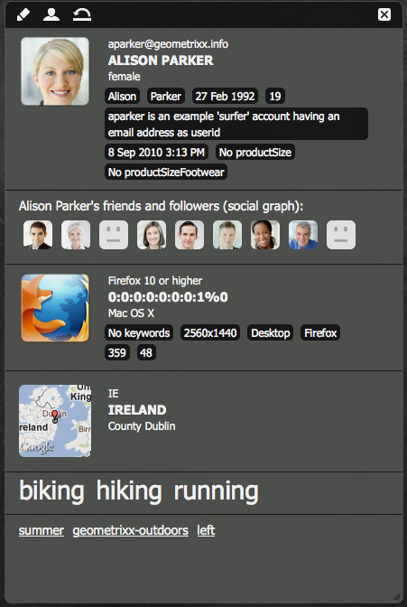
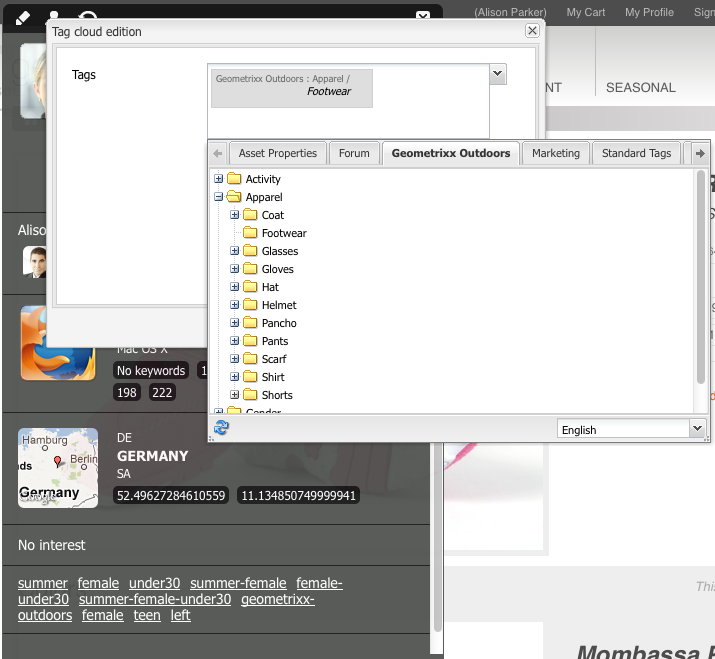

# ClientContext{#client-context}

>[!NOTE]
>
>O Client Context foi substituído pelo ContextHub. Para obter mais detalhes, consulte a seção [configuração](/help/sites-developing/ch-configuring.md) e [desenvolvedor](/help/sites-developing/contexthub.md) documentação.

O Contexto do cliente é um mecanismo que fornece determinadas informações sobre a página atual e o visitante. Pode ser aberto usando **Ctrl-Alt-c** (janelas) ou **control-option-c** (Mac)

No ambiente de publicação e criação, ele mostra informações sobre:

* O visitante; dependendo da sua instância, certas informações são solicitadas ou derivadas.
* Tags de página e o número de vezes que essas tags foram acessadas pelo visitante atual (isso é mostrado quando você move o mouse sobre uma tag específica) .
* Informações da página.
* Informações sobre o ambiente técnico, como endereço IP, navegador e resolução de tela.
* Quaisquer segmentos que estão atualmente resolvidos.

Os ícones (disponíveis apenas no ambiente de criação) permitem configurar os detalhes do contexto do cliente:

* **Editar**
Uma nova página será aberta, permitindo que você [editar, adicionar ou remover uma propriedade de perfil](#editingprofiledetails).

* **Carregar**
Você pode [selecione em uma lista de perfis e carregue o perfil](#loading-a-new-user-profile) você quer testar.

* **Redefinir**
Você pode [redefinir o perfil](#resetting-the-profile-to-the-current-user) ao do usuário atual.

## Componentes disponíveis do Client Context {#available-client-context-components}

O Client Context pode mostrar as seguintes propriedades ([dependendo do que foi selecionado com a opção Editar](#adding-a-property-component)):

**Informação do Surfer** Mostra as seguintes informações do lado do cliente:

* o **Endereço IP**
* **palavras-chave** usado para referência de mecanismo de pesquisa
* o **navegador** em uso
* o **SO** (sistema operacional) em uso
* a tela **resolution**
* o **mouse X** position
* o **mouse Y** position

**Fluxo de atividades** Isso fornece informações sobre a atividade social do usuário em várias plataformas; por exemplo, os fóruns AEM, blogs, classificações, etc.

**Campaign** Permite que os autores simulem uma experiência específica para uma campanha. Esse componente substitui a resolução normal da campanha e a seleção de experiência para permitir o teste de várias permutações.

A resolução da campanha normalmente é baseada na propriedade priority da campanha. Normalmente, a experiência é selecionada com base na segmentação.

**Carrinho** Mostra informações do carrinho de compras, incluindo entradas de produto (título, quantidade, priceFormatted etc.), promoções resolvidas (título, mensagem etc.) e vouchers (código, descrição, etc.).

O armazenamento de sessão do carrinho também notifica o servidor sobre alterações promocionais resolvidas (com base em alterações de segmentação) usando o ClientContextCartServlet.

**Loja genérica** É um componente genérico que exibe o conteúdo de um armazenamento. É uma versão de nível inferior do componente Propriedades de armazenamento genérico.

O armazenamento genérico deve ser configurado com um renderizador JS que exibirá os dados de maneira personalizada.

**Propriedades de armazenamento genérico** É um componente genérico que exibe o conteúdo de um armazenamento. É uma versão de nível superior do componente de Loja genérica.

O componente Propriedades de armazenamento genérico inclui um renderizador padrão que lista as propriedades configuradas (junto com uma miniatura).

**Localização geográfica** Mostra a latitude e a longitude do cliente. Ele usa a API de geolocalização do HTML5 para consultar o navegador quanto à localização atual. Isso resulta na exibição de um pop-up para o visitante, onde o navegador pergunta se ele concorda em compartilhar sua localização.

Quando exibido na Context Cloud, o componente usa uma API do Google para exibir um mapa como miniatura. O componente está sujeito à API do Google [limites de uso](https://developers.google.com/maps/documentation/staticmaps/intro#Limits).

>[!NOTE]
>
>No AEM 6.1, a loja de geolocalização não fornece mais o recurso de geocodificação reversa. Portanto, a loja de Geolocalização não recupera mais detalhes sobre a localização atual, como o nome da cidade ou o código do país. Os segmentos que usam esses dados de armazenamento não funcionarão corretamente. O armazenamento de Geolocalização contém apenas a latitude e a longitude de um local.

**Armazenamento JSONP** Um componente que exibe o conteúdo que é dependente da sua instalação.

O padrão JSONP é um complemento do JSON que permite contornar a mesma política de origem (impossibilitando que um aplicativo da Web se comunique com servidores que estão em outro domínio). Consiste em envolver o objeto JSON em uma chamada de função para poder carregá-lo como um `<script>` do outro domínio (que é uma exceção permitida para a mesma política de origem).

O JSONP Store é como qualquer outro armazenamento, mas carrega informações que vêm de outro domínio sem a necessidade de ter um proxy para essas informações no domínio atual. Veja o exemplo em [Armazenamento de dados no contexto do cliente por meio do JSONP](/help/sites-administering/client-context.md#storing-data-in-client-context-via-jsonp).

>[!NOTE]
>
>O JSONP Store não armazena as informações em cache no cookie, mas recupera esses dados em cada carregamento de página.

**Dados do perfil** Mostra informações coletadas no perfil do usuário. Por exemplo, sexo, idade, endereço de email, entre outros.

**Segmentos resolvidos** Mostra quais segmentos são resolvidos no momento (geralmente depende de outras informações mostradas no contexto do cliente). Isso é interessante ao configurar uma campanha.

Por exemplo, se o mouse estiver sobre a parte esquerda ou direita da janela. Esse segmento é usado principalmente para testes, pois as alterações podem ser vistas imediatamente.

**Gráfico social** Mostra o gráfico social dos amigos e seguidores do usuário.

>[!NOTE]
>
>Atualmente, este é um recurso de demonstração que depende do conjunto de dados pré-configurado nos nós de perfil de nossos usuários de demonstração. Por exemplo, consulte:
>
>`/home/users/geometrixx/aparker@geometrixx.info/profile` => propriedade friends

**Nuvem de tags** Mostra as tags definidas na página atual e as obtidas durante a navegação no site. Mover o mouse sobre uma tag mostra o número de vezes que o usuário atual acessou páginas que contêm essa tag específica.

>[!NOTE]
>
As tags definidas nos ativos DAM exibidos nas páginas visitadas não serão contadas.

**Loja Technographics** Esse componente depende da sua instalação.

**Produtos visualizados** Rastreia os produtos que o comprador visualizou. Pode ser consultado sobre o produto visualizado mais recentemente ou sobre o produto visualizado mais recentemente que ainda não está no carrinho.

Este repositório de sessão não tem um componente de contexto de cliente padrão.

Para obter informações adicionais, consulte [Contexto do cliente em detalhes](/help/sites-developing/client-context.md).

>[!NOTE]
>
Os dados de página não estão mais no contexto do cliente como um componente padrão. Se necessário, você pode adicionar isso editando o contexto do cliente, adicionando o **Propriedades de armazenamento genérico** e, em seguida, configurar para definir a variável **Loja** as `pagedata`.

## Alterar o perfil do Client Context {#changing-the-client-context-profile}

O Client Context permite alterar interativamente os detalhes:

* Alterar o perfil que está sendo usado no Contexto do cliente permite ver as diferentes experiências que os vários usuários verão na página atual.
* Além de alterar o perfil do usuário, você pode alterar alguns detalhes do perfil para ver como a experiência da página difere em várias condições.

### Carregando um novo perfil de usuário {#loading-a-new-user-profile}

É possível alterar o perfil ao:

* [usando o ícone carregar](#loading-a-new-visitor-profile-with-the-load-profile-icon)
* [usando o controle deslizante de seleção](#loadinganewvisitorprofilewiththeselectionslider)

Quando terminar, você poderá [redefinir o perfil](#resetting-the-profile-to-the-current-user).

#### Carregamento de um novo perfil de visitante com o ícone Carregar perfil {#loading-a-new-visitor-profile-with-the-load-profile-icon}

1. Clique no ícone Carregar perfil:

   

1. Isso abrirá a caixa de diálogo, onde é possível selecionar o perfil que deseja carregar:

   

1. Clique em **OK** para carregar.

#### Carregando um Novo Perfil de Usuário com o Controle Deslizante de Seleção {#loading-a-new-user-profile-with-the-selection-slider}

Também é possível selecionar um perfil com o controle deslizante de seleção:

1. Clique duas vezes no ícone que representa o usuário atual. O seletor será aberto, use as setas para navegar e ver os perfis disponíveis:

   

1. Clique no perfil que deseja carregar. Quando os detalhes tiverem sido carregados, clique fora do seletor para fechar.

#### Redefinir o perfil para o usuário atual {#resetting-the-profile-to-the-current-user}

1. Use o ícone de redefinição para retornar o perfil no Contexto do cliente para o do usuário atual:

   

### Alterar a plataforma do navegador {#changing-the-browser-platform}

1. Clique duas vezes no ícone que representa a plataforma do navegador. O seletor será aberto, use as setas para navegar e ver as plataformas/navegadores disponíveis:

   

1. Clique no navegador da plataforma que deseja carregar. Quando os detalhes tiverem sido carregados, clique fora do seletor para fechar.

### Alterar a geolocalização {#changing-the-geolocation}

1. Clique duas vezes no ícone de localização geográfica. Um mapa expandido será aberto, onde você pode arrastar o marcador para um novo local:

   

1. Clique fora do mapa para fechar.

### Alteração da seleção de tags {#changing-the-tag-selection}

1. Clique duas vezes na seção Nuvem de tags do Contexto do cliente. A caixa de diálogo será aberta, onde é possível selecionar tags:

   

1. Clique em OK para carregar no Client Context.

## Editar o Client Context {#editing-the-client-context}

A edição de um contexto de cliente pode ser usada para definir (ou redefinir) os valores de determinadas propriedades, adicionar uma nova propriedade ou remover uma que não é mais necessária.

### Editar detalhes da propriedade {#editing-property-details}

A edição de um contexto de cliente pode ser usada para definir (ou redefinir) os valores de determinadas propriedades. Isso permite testar cenários específicos (particularmente úteis para [segmentação](/help/sites-administering/campaign-segmentation.md) e [campanhas](/help/sites-classic-ui-authoring/classic-personalization-campaigns.md)).

### Adição de um componente de propriedade {#adding-a-property-component}

Depois de abrir o **página de design do ClientContext**, você também pode **Adicionar** uma propriedade completamente nova usando os componentes disponíveis (os componentes estão listados no sidekick ou no **Inserir novo componente** que é aberta depois de clicar duas vezes na variável **Arraste componentes ou ativos para cá** caixa):

### Remoção de um componente de propriedade {#removing-a-property-component}

Depois de abrir o **página de design do ClientContext**, você também pode **Remover** uma propriedade se não for mais necessária. Isso inclui propriedades fornecidas prontas para uso; **Redefinir** O os restabelecerá se tiverem sido removidos.

## Armazenamento de dados no contexto do cliente por meio do JSONP {#storing-data-in-client-context-via-jsonp}

Siga este exemplo para usar o componente de armazenamento de contexto do JSONP Store para adicionar dados externos ao Client Context. Em seguida, crie um segmento com base nas informações desses dados. O exemplo usa o serviço JSONP fornecido pelo WIPmania.com. O serviço retorna informações de geolocalização com base no endereço IP do cliente Web.

Este exemplo usa o site de amostra do Geometrixx Outdoors para acessar o Contexto do cliente e testar o segmento criado. Você pode usar um site diferente se a página tiver ativado o Contexto do cliente. (Consulte [Adicionar o Client Context a uma página](/help/sites-developing/client-context.md#adding-client-context-to-a-page).)

### Adicionar o componente de armazenamento JSONP {#add-the-jsonp-store-component}

Adicione o componente JSONP Store ao Client Context e use-o para recuperar e armazenar informações de geolocalização sobre o cliente Web.

1. Abra a página inicial em inglês do site Geometrixx Outdoors na instância do autor AEM. ([https://localhost:4502/content/geometrixx-outdoors/en.html](https://localhost:4502/content/geometrixx-outdoors/en.html)).
1. Para abrir o Client Context, pressione Ctrl-Alt-c (windows) ou control-option-c (Mac).
1. Clique no ícone de edição na parte superior do Client Context para abrir o Client Context Designer.

   

1. Arraste o componente de Armazenamento JSONP para o Contexto do cliente.

   

1. Clique duas vezes no componente para abrir a caixa de diálogo de edição.
1. Na caixa URL do serviço JSONP, digite o seguinte URL e clique em Buscar armazenamento:

   `https://api.wipmania.com/jsonp?callback=${callback}`

   O componente chama o serviço JSONP e lista todas as propriedades que os dados retornados contêm. As propriedades que estão na lista são aquelas que estarão disponíveis no Client Context.

   

1. Clique em OK.
1. Retorne à página inicial do Geometrixx Outdoors e atualize a página. O Contexto do cliente agora inclui as informações do componente de Armazenamento JSONP.

   

### Criar o segmento {#create-the-segment}

Use os dados do armazenamento de sessão criado por meio do componente de armazenamento JSONP. O segmento usa a latitude do armazenamento de sessão e a data atual para determinar se é a hora de inverno no local do cliente.

1. Abra o console Ferramentas no navegador da Web (`https://localhost:4502/miscadmin#/etc`).
1. Na árvore de pastas, clique na pasta Ferramentas/Segmentação e, em seguida, clique em Nova > Nova pasta. Especifique os seguintes valores de propriedade e clique em Criar:

   * Nome: mysegments
   * Título: Meus segmentos

1. Selecione a pasta Meus segmentos e clique em Nova > Nova página:

   1. Para o Título, digite inverno.
   1. Selecione o modelo de Segmento.
   1. Clique em Criar.

1. Clique com o botão direito do mouse no segmento Winter e clique em Open.
1. Arraste a Propriedade de armazenamento genérico para o contêiner AND padrão.

   

1. Clique duas vezes no componente para abrir a caixa de diálogo de edição, especifique os seguintes valores de propriedade e clique em OK:

   * Loja: wipmania
   * Nome da propriedade: latitude
   * Operador: é maior que
   * Valor da propriedade: 30

1. Arraste o componente Script para o mesmo contêiner AND e abra a caixa de diálogo de edição. Adicione o script a seguir e clique em OK:

   `3 < new Date().getMonth() < 12`
