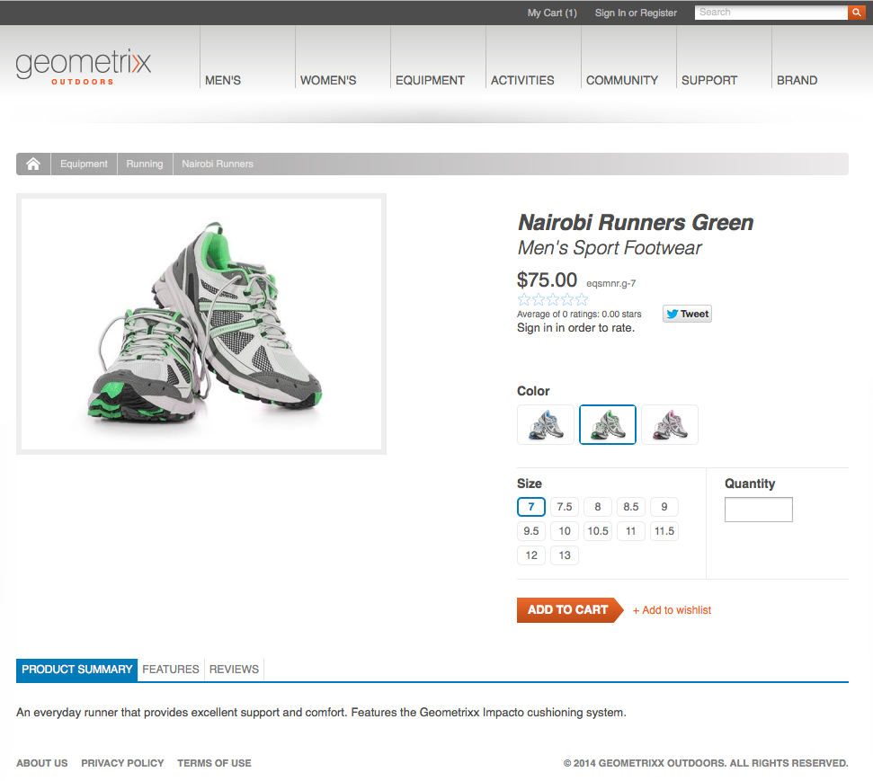
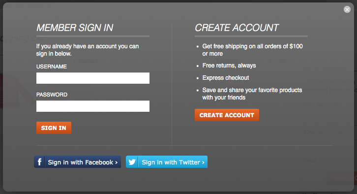

# Conceitos {#concepts}

A estrutura de integração fornece os mecanismos e componentes para:

* conexão com um mecanismo de comércio eletrônico
* como extrair dados para o AEM
* exibição desses dados e coleta as respostas do comprador
* detalhes da transação de devolução
* pesquisar os dados de ambos os sistemas

Isso significa que:

* Os compradores podem se registrar e comprar sem esperar.
* As alterações de preços serão vistas pelos compradores sem demora.
* Os produtos podem ser adicionados conforme necessário.

>[!NOTE]
>
>A estrutura de comércio eletrônico pode ser usada com:
>
>* [Magento](https://www.adobe.io/apis/experiencecloud/commerce-integration-framework/integrations.html#!AdobeDocs/commerce-cif-documentation/master/integrations/02-AEM-Magento.md)
>* [SAP Commerce Cloud](/help/sites-administering/sap-commerce-cloud.md)
>* [Salesforce Commerce Cloud](https://github.com/adobe/commerce-salesforce)
>

>[!CAUTION]
>
>A estrutura [de integração do](https://www.adobe.com/solutions/web-experience-management/commerce.html) eCommerce é um complemento do AEM.
>
>Seu representante de vendas poderá fornecer todos os detalhes, de acordo com o mecanismo apropriado.

>[!CAUTION]
>
>A estrutura fornece os requisitos básicos para seu próprio projeto.
>
>É sempre necessário um certo trabalho de desenvolvimento para adaptar a estrutura às suas especificações.

>[!CAUTION]
>
>A instalação padrão do AEM inclui a implementação genérica de eCommerce do AEM (JCR).
>
>Atualmente, isso se destina a fins de demonstração ou como base básica para uma implementação personalizada de acordo com suas necessidades.

Para otimizar a operação, o AEM e o mecanismo de comércio eletrônico se concentram em sua própria área de especialização. A informação é transferida entre os dois em tempo real; por exemplo:

* O AEM pode:

   * Solicitação:

      * Informações do produto do mecanismo de comércio eletrônico.
   * Fornecer:

      * visualizações do usuário para obter informações sobre produtos, carrinho de compras e check-out.
      * Informações sobre carrinho de compras e check-out para o mecanismo de comércio eletrônico.
      * Otimização do mecanismo de pesquisa (SEO).
      * Funcionalidade da comunidade.
      * Interações de marketing não estruturadas.

* O mecanismo de comércio eletrônico pode:

   * Fornecer:

      * Informações do produto do banco de dados.
      * Gerenciamento de variantes do produto.
      * Gerenciamento de pedidos.
      * ERP (Enterprise Resource Planning).
      * Pesquise nas informações do produto.
   * Processo:

      * O carrinho de compras.
      * O check-out.
      * Cumprimento do pedido.

>[!NOTE]
>
>Os detalhes exatos dependerão do mecanismo de comércio eletrônico e da implementação do projeto.

Vários componentes prontos para uso do AEM são fornecidos para usar a camada de integração. Atualmente, eles incluem:

* Informações sobre o produto
* Carrinho de compras
* Check-out
* Minha conta

Várias opções de pesquisa também estão disponíveis.

## Arquitetura {#architecture}

A estrutura de integração fornece a API, uma variedade de componentes para ilustrar a funcionalidade e várias extensões para fornecer exemplos de métodos de conexão:

A estrutura oferece acesso a funcionalidades como:

### Implementações {#implementations}

O eCommerce do AEM é implementado com um mecanismo de comércio eletrônico:

* A estrutura de integração de eCommerce foi criada para permitir a integração fácil de um mecanismo de eCommerce com o AEM. O mecanismo de comércio eletrônico criado para fins específicos controla os dados do produto, os carrinhos de compras, o check-out e o cumprimento de pedidos, enquanto o AEM controla a exibição de dados e as campanhas de marketing.

>[!NOTE]
>
>A instalação padrão do AEM inclui a implementação genérica de eCommerce do AEM (JCR).
>
>Atualmente, isso se destina a fins de demonstração ou como base básica para uma implementação personalizada de acordo com suas necessidades.
>
>O eCommerce do AEM implementado no AEM usando desenvolvimento genérico baseado no JCR é:
>
>* Um exemplo independente de comércio eletrônico nativo do AEM para ilustrar o uso da API. Isso pode ser usado para controlar dados de produtos, carrinhos de compras e checkout em conjunto com a exibição de dados e campanhas de marketing existentes. Nesse caso, o banco de dados do produto é armazenado no repositório nativo do AEM (implementação do [JCR](https://docs.adobe.com/content/docs/en/spec/jcr/2.0/index.html)pela Adobe).
>
>  
A instalação padrão do AEM contém as noções básicas da implementação [genérica do eCommerce](/help/sites-administering/generic.md).

### Provedores de comércio {#commerce-providers}

Ao importar dados de um mecanismo de comércio para o site de comércio eletrônico do AEM, um provedor de comércio é usado para fornecer dados aos importadores. Um único provedor de comércio pode suportar vários importadores.

Um provedor de comércio é um código AEM personalizado para:

* interface para um mecanismo de comércio back-end
* implementar um sistema de comércio sobre o repositório JCR

Dois exemplos de provedores de comércio estão disponíveis no momento para o AEM:

* um para geometrixx-hybris
* outro para geometrixx-genérico (JCR)

Embora normalmente um projeto precise desenvolver seu próprio provedor de comércio personalizado e específico para o PIM e o schema de dados do produto.

>[!NOTE]
>
>Os importadores geometrixx utilizam arquivos CSV; há uma descrição do schema aceito (com propriedades personalizadas permitidas) nos comentários acima de sua implementação.

O [ProductServicesManager](https://helpx.adobe.com/experience-manager/6-5/sites/developing/using/reference-materials/javadoc/com/adobe/cq/commerce/pim/api/ProductServicesManager.html) mantém (por meio do [OSGi](/help/sites-deploying/configuring.md#osgi-configuration-settings))uma lista de implementações das interfaces [ProductImporter](https://helpx.adobe.com/experience-manager/6-5/sites/developing/using/reference-materials/javadoc/com/adobe/cq/commerce/pim/api/ProductImporter.html) e [CatalogBlueprintImporter](https://helpx.adobe.com/experience-manager/6-5/sites/developing/using/reference-materials/javadoc/com/adobe/cq/commerce/pim/api/CatalogBlueprintImporter.html) . Eles estão listados no campo suspenso **Importador/Provedor** de comércio do assistente do importador (usando a `commerceProvider` propriedade como nome).

Quando um importador/provedor de comércio específico estiver disponível na lista suspensa, todos os dados suplementares necessários devem ser definidos (dependendo do tipo de importador) em:

* `/apps/commerce/gui/content/catalogs/importblueprintswizard/importers`
* `/apps/commerce/gui/content/products/importproductswizard/importers`

A pasta na `importers` pasta apropriada deve corresponder ao nome do importador; por exemplo:

* `.../importproductswizard/importers/geometrixx/.content.xml`

O formato do arquivo de importação de origem é definido pelo importador. Ou o importador pode estabelecer uma conexão (por exemplo, WebDAV ou http) com o mecanismo de comércio.

## Funções {#roles}

O sistema integrado atende às seguintes funções para manter os dados:

* Usuário do Gerenciamento de Informações do Produto (PIM) que mantém:

   * Informações sobre o produto.
   * Taxonomia, categorização, aprovação.
   * Interage com o gerenciamento de ativos digitais.
   * Preços - muitas vezes isso vem de um sistema ERP e não é explicitamente mantido no sistema de comércio.

* Autor/Gerente de marketing que mantém:

   * Conteúdo de marketing para todos os canais.
   * Promoções.
   * Vouchers.
   * Campanhas.

* Surfista/Comprador que:

   * Visualização suas informações do produto.
   * Coloca itens no carrinho de compras.
   * Verifica seus pedidos.
   * Esperar o cumprimento do pedido.

Embora a localização real possa depender da implementação; por exemplo, genérico ou com um mecanismo de comércio eletrônico:

## Produtos {#products}

### Produto Dados versus dados de marketing {#product-data-versus-marketing-data}

#### Categorias estruturais versus de marketing {#structural-versus-marketing-categories}

Se as duas categorias a seguir puderem ser diferenciadas, isso permitirá que você defina URLs claros com uma estrutura significativa (árvores de `cq:Page` nós) e, portanto, muito próximos à gestão de conteúdo clássica do AEM):

* *categorias estruturais *

   A árvore categoria que define *o que é um produto*; por exemplo:

   `/products/mens/shoes/sneakers`

* *categorias de marketing*

   Todas as outras categorias a que um *produto pode pertencer*; por exemplo:

   `/special-offers/christmas/shoes`)

### Data do produto {#product-data}

Para retratar e gerenciar seu produto, você desejará manter uma variedade de informações sobre ele.

Os dados do produto podem ser:

* mantido diretamente no AEM (genérico).
* mantido no mecanismo de comércio eletrônico e disponibilizado no AEM.

   Dependendo do tipo de dados, é [sincronizada](#catalog-maintenance-data-synchronization) conforme necessário ou é acessada diretamente; por exemplo, dados altamente voláteis e críticos, como preços de produtos, são recuperados do mecanismo de comércio eletrônico em cada solicitação de página para garantir que eles estejam sempre atualizados.

Em ambos os casos, quando os dados do produto são inseridos/importados para o AEM, eles podem ser vistos no console **Produtos** . Aqui, as visualizações de cartão e lista de um produto mostram informações como:

* a imagem
* o código SKU
* quando modificado pela última vez

### Variantes do produto {#product-variants}

Para os produtos adequados, podem também ser mantidas informações sobre as variantes. Por exemplo, para os artigos de vestuário, as diferentes cores disponíveis são mantidas como variantes:

### Atributos do produto {#product-attributes}

Os atributos individuais mantidos em cada produto podem depender do mecanismo de comércio eletrônico que está sendo usado e da implementação do AEM. Eles estão disponíveis (conforme apropriado) ao visualizar páginas de produtos e/ou editar informações de produtos e podem incluir:

* **Imagem**

   Uma imagem do produto.

* **Título**

   O nome do produto.

* **Descrição**

   Uma descrição textual do produto.

* **Tags**

   Tags usadas para agrupar produtos relacionados.

* **Categoria do ativo padrão**

   Uma categoria padrão para ativos.

* **Dados de ERP**

   Informações de ERP (Enterprise Resource Planning, planejamento de recursos empresariais).

   * **SKU**

      Informações sobre a unidade de manutenção de reservas (SKU).

   * **Cor**
   * **Tamanho**
   * **Preço**

      O preço unitário do produto.

* **Resumo**

   Um resumo dos recursos do produto.

* **Recursos**

   Detalhes completos dos recursos do produto.

### Ativos do produto {#product-assets}

Uma seleção de ativos pode ser mantida para produtos individuais. Normalmente, isso inclui imagens e vídeos.

## Catálogos {#catalogs}

Um catálogo agrupa os dados do produto para facilitar o gerenciamento e a representação para o comprador. Muitas vezes um catálogo é estruturado de acordo com atributos como língua, área geográfica, marca, estação, hobby, esporte, entre muitos outros.

### Estrutura do catálogo {#catalog-structure}

#### Catálogos em vários idiomas {#catalogs-in-multiple-languages}

O AEM oferece suporte ao conteúdo do produto em vários idiomas. Ao solicitar dados, a estrutura de integração recupera o idioma da árvore atual (por exemplo, `en_US` para páginas em `/content/geometrixx-outdoors/en_US`).

Para uma loja multilíngue, é possível importar o catálogo para cada árvore de idioma individualmente (ou copiá-lo por meio do [MSM](/help/sites-administering/msm.md)).

#### Catálogos para várias marcas {#catalogs-for-multiple-brands}

Assim como com os idiomas, as grandes empresas multinacionais podem precisar atender a várias marcas.

#### Catálogos por tags {#catalogs-by-tags}

As tags também podem ser usadas para agrupar produtos em um catálogo. Eles podem ser usados para catálogos mais dinâmicos, como ofertas sazonais.

### Configuração do Catálogo (Importação Inicial) {#catalog-setup-initial-import}

Dependendo da sua implementação, você pode importar os dados do produto necessários para o catálogo base para o AEM de:

* um arquivo CSV (para a implementação genérica)
* o mecanismo de comércio eletrônico

### Manutenção do catálogo (Sincronização de dados) {#catalog-maintenance-data-synchronization}

Outras alterações nos dados do produto serão inevitáveis:

* para a implementação genérica, eles podem ser gerenciados com o editor de [produtos](/help/sites-administering/generic.md#editing-product-information)
* ao usar um mecanismo de [comércio eletrônico, as alterações devem ser sincronizadas](#data-synchronization-with-an-ecommerce-engine-ongoing)

#### Sincronização de dados com um mecanismo de comércio eletrônico (em andamento) {#data-synchronization-with-an-ecommerce-engine-ongoing}

Após a importação inicial, as alterações nos dados do produto são inevitáveis.

Ao usar um mecanismo de comércio eletrônico, os dados do produto são mantidos lá e precisam estar disponíveis no AEM. Esses dados do produto precisam ser sincronizados quando as atualizações forem feitas.

Isso pode depender do tipo de dados:

* Uma sincronização [periódica é usada juntamente com um feed de dados de alterações](/help/sites-developing/sap-commerce-cloud.md#product-synchronization-and-publishing).

   Além disso, você pode selecionar atualizações específicas para uma atualização expressa.

* Dados altamente voláteis, como informações sobre preços, são recuperados do mecanismo de comércio para cada solicitação de página, para garantir que estejam sempre atualizados.

### Catálogos - Desempenho e dimensionamento {#catalogs-performance-and-scaling}

Importar um catálogo grande com um grande número de produtos (normalmente mais de 100.000) de um mecanismo de eCommerce (PIM) pode afetar o sistema devido ao grande número de nós. Também pode retardar a instância de criação se os produtos tiverem ativos associados (por exemplo, imagens de produtos). Isso se deve ao fato de que o pós-processamento desses ativos consome muita CPU e memória.

Existem várias estratégias que você pode escolher para resolver esses problemas:

* [Período](#bucketing) - para atender ao grande número de nós
* [Descarregar o processamento posterior do ativo para uma instância dedicada](#offload-asset-post-processing-to-a-dedicated-instance)
* [Importar apenas dados de produtos](#only-import-product-data)
* [Importar limitação e salvar em lote](#import-throttling-and-batch-saves)
* [Teste de desempenho](#performance-testing)
* [Desempenho - Diversos](#performance-miscellaneous)

#### Encargos {#bucketing}

Se um nó JCR tiver muitos nós secundários diretos (por exemplo, 1000 e mais), os buckets (pastas fantasmas) são necessários para garantir que o desempenho não seja afetado. Eles são gerados de acordo com um algoritmo ao importar.

Esses compartimentos assumem a forma de pastas fantasmas que são introduzidas na estrutura do catálogo, mas podem ser configurados para que não fiquem visíveis em URLs públicos.

#### Descarregar o processamento posterior do ativo para uma instância dedicada {#offload-asset-post-processing-to-a-dedicated-instance}

Esse cenário envolve a configuração de duas instâncias do autor:

1. instância do autor Principal

   Importa dados do produto do PIM, no qual o pós-processamento dos caminhos do ativo está desativado.

1. Instância dedicada do autor DAM

   Importa e pós-processa ativos de produtos do PIM, em seguida, os replica de volta para a instância do autor principal para uso.

#### Importar apenas dados de produtos {#only-import-product-data}

Nos casos em que os produtos não contêm ativos (imagens) a serem importados, é possível importar os dados do produto sem ser afetado pelo pós-processamento do ativo.

<!--delete
#### Import Throttling and Batch Saves {#import-throttling-and-batch-saves}

[Import throttling](/help/sites-deploying/scaling.md#import-throttling) and [batch saves](/help/sites-deploying/scaling.md#batch-saves) are two general [scaling](/help/sites-deploying/scaling.md) mechanisms that can help when importing large volumes of data.-->

#### Teste de desempenho {#performance-testing}

Os testes de desempenho devem ser levados em consideração nas implementações de eCommerce do AEM:

* ambiente do autor:

   A atividade em segundo plano (por exemplo, a importação) pode ocorrer ao mesmo tempo que a atividade normal do usuário (por exemplo, edição de página) e mesmo se o desempenho do front-end for (em geral) dado uma prioridade mais alta, um mau desempenho observado por autores online pode levar a frustração capaz de bloquear uma decisão ao vivo.

* ambiente de publicação:

   A replicação é um processo essencial para garantir que o conteúdo seja publicado de forma rápida e confiável. Isso pode ser afetado pela forma como o autor agrupa o conteúdo a ser publicado.

* Front-end:

   A mistura de invalidações de front-end e cache pode levar a surpresas de desempenho. Testar ajuda a evitar isso.

Observe que este teste de desempenho requer conhecimento e análise do seu público alvo:

* Volumes de conteúdo

   * Ativos
   * Produtos e SKUs localizados e de tecnologia I18

* atividade do usuário:

   * Edição em massa
   * Publicação em massa
   * Solicitações de pesquisa intensas

* Processos em segundo plano

   * Importações
   * Atualizações de sincronização (por exemplo, preços)

* Requisitos de manutenção (backup, otimização do Tar PM, coleta de lixo do armazenamento de dados etc.)

#### Desempenho - Diversos {#performance-miscellaneous}

Para todas as implementações, é possível ter em mente os seguintes pontos:

* Como produto, as unidades de manutenção de estoque e as categorias podem ser numerosas, tente usar o menor número possível de nós para modelar o conteúdo.

   Quanto mais nós você tiver, mais flexível será o seu conteúdo (por exemplo, parsys). No entanto, tudo é uma troca e você precisa de flexibilidade individual (por padrão) ao manipular (por exemplo) produtos 30K?

* Evite a duplicação o máximo possível (veja a localização) ou, quando o fizer, pense em quantos nós sua duplicação resultará.
* Tente marcar o seu conteúdo o máximo possível para preparar a otimização do query.

   Por exemplo:

   `/content/products/france/fr/shoe/reebok/pump/46 SKU`

   deve ter uma tag por nível de conteúdo (por exemplo, país, idioma, categoria, marca, produto). Procurando por

   `//element(*,my:Sku)[@country=’france’ and @language=’fr’`

   e

   `@category=’shoe’ and @brand=’reebok’ and @product=’pump’]`

   será drasticamente mais rápido do que procurar por

   `/jcr:root/content/france/fr/shoe/reebok/pump/element(*,my:Sku)`

* Em sua pilha técnica, planeje modelos e serviços de acesso a conteúdo muito fatorizados. Esta é uma prática recomendada geral, mas é ainda mais crucial para ela, pois você pode, em fases de otimização, adicionar caches de aplicativos para dados lidos com muita frequência (e com os quais você não deseja preencher o cache de pacotes).

   Por exemplo, o gerenciamento de atributos é, com frequência, um bom candidato para armazenamento em cache, pois se refere a dados atualizados por meio da importação de produtos.
* Considere o uso de páginas proxy.

### Páginas de seção do catálogo {#catalog-section-pages}

As seções de catálogo fornecem a você, por exemplo:

* Uma introdução (imagem e/ou texto) à categoria; isso também pode ser usado para banners e teasers para promover ofertas especiais
* links para os produtos individuais nessa categoria
* links para outras categorias

### Páginas de produto {#product-pages}

As páginas de produtos fornecem informações abrangentes sobre produtos individuais. As atualizações dinâmicas de também são refletidas; por exemplo, alterações de preço registradas no mecanismo de comércio eletrônico.

As páginas de produto são páginas do AEM que usam o componente **Produto** ; por exemplo, no modelo de Produto **de** Comércio:

O componente Produto fornece:

* Informações gerais sobre o produto; incluindo texto e imagens.
* Preços; isso geralmente é recuperado do mecanismo de comércio eletrônico toda vez que a página é mostrada/atualizada.
* Informação sobre a variante do produto; por exemplo, cor e tamanho.

Essas informações permitem que o comprador selecione o seguinte ao adicionar um item à sua cesta:

* Variantes de cor e tamanho
* Quantidade

#### Landings page de produtos {#product-landing-pages}

São páginas do AEM que fornecem principalmente informações estáticas; por exemplo, uma introdução e uma visão geral com links para as páginas de produtos subjacentes.

### Componente do produto {#product-component}

O componente **Produto** pode ser adicionado a qualquer página com uma página pai que fornece os metadados necessários (ou seja, os caminhos para `cartPage` e `cartObject`). No local da manifestação, Geometrixx Outdoors, é fornecido por `UserInfo.jsp`.

O componente **Produto** também pode ser personalizado de acordo com seus requisitos individuais.

### Páginas de proxy {#proxy-pages}

As páginas de proxy são usadas para simplificar a estrutura do repositório e otimizar o armazenamento para catálogos grandes.

A criação de um catálogo usará dez nós por produto, pois fornece componentes individuais para cada produto que você pode atualizar e personalizar no AEM. Esse grande número de nós pode se tornar um problema se seu catálogo contiver centenas ou até milhares de produtos. Para evitar qualquer problema, você pode criar seu catálogo usando páginas de proxy.

As páginas de proxy usam uma estrutura de dois nós ( `cq:Page` e `jcr:content`) que não contém nenhum conteúdo real do produto. O conteúdo é gerado, no momento da solicitação, referenciando os dados do produto e a página do modelo.

No entanto, há uma compensação. Não será possível personalizar as informações do produto no AEM, um modelo padrão (definido para o site) será usado.

>[!NOTE]
>
>Nenhum problema ocorrerá se você importar um catálogo grande sem páginas de proxy.
>
>Você pode converter de uma metodologia para a outra a qualquer momento. Também é possível converter uma subseção do catálogo.

## Promoções e Vouchers {#promotions-and-vouchers}

### Vouchers {#vouchers}

Os vendedores são um método testado e testado de oferecer descontos para atrair os compradores a fazer uma compra e/ou recompensar a fidelidade do cliente.

* Fornecimento de cupons:

   * Um código de comprovante (a ser digitado no carrinho pelo comprador).
   * Um rótulo de comprovante (a ser exibido depois que o comprador o tiver inserido no carrinho).
   * Um caminho de promoção (que define a ação que o comprovante aplica).

* Motores de comércio externo também podem fornecer comprovantes.

No AEM:

* Um comprovante é um componente baseado em página que é criado/editado com o console Sites.
* O componente **Voucher** fornece:

   * Um renderizador para a administração de comprovantes; isso mostra os vales que estão atualmente no carrinho.
   * As caixas de diálogo de edição (formulário) para administrar (adicionar/remover) os comprovantes.
   * As ações necessárias para adicionar/remover comprovantes de/para o carrinho.

* Os vendedores não têm data/hora de entrada e saída próprias, mas usam as campanhas pai.

>[!NOTE]
>
>O AEM usa o termo **Voucher**, que é sinônimo do termo **Cupom**.

### Promoções {#promotions}

As promoções, juntamente com comprovantes, permitem que você realize cenários como:

* Uma empresa fornece preços personalizados para os funcionários, o que é uma lista artesanal de usuários.
* Os clientes de longo prazo recebem descontos em todos os pedidos.
* Um preço de venda oferecido durante um período bem definido.
* Um cliente recebe um comprovante quando seu pedido anterior excedeu uma quantia específica.
* Um cliente que compra um *produto X* recebe um desconto no *produto Y* (produtos de pares).

Geralmente, as promoções não são mantidas pelos gerentes de informações do produto, mas pelos gerentes de marketing:

* Uma Promoção é um componente baseado em página que é criado/editado com o console Sites. ``
* Promoção da oferta:

   * Uma prioridade
   * Um caminho do manipulador de promoção

* Você pode conectar promoções a uma campanha para definir a data/hora de ativação/desativação.
* Você pode conectar promoções a uma experiência para definir seus segmentos.
* As promoções que não estão ligadas a uma experiência não serão acionadas por si mesmas, mas ainda poderão ser acionadas por um Voucher.
* O componente de Promoção contém:

   * renderizadores e diálogos para administração de promoção
   * subcomponentes para renderizar e editar parâmetros de configuração específicos para os manipuladores de promoção

No AEM, as promoções também são integradas à [Gestão de campanha](/help/sites-authoring/personalization.md):

* uma [campanha](/help/sites-authoring/personalization.md) especifica os tempos de ativação/desativação
* [as experiências](/help/sites-authoring/personalization.md) *dentro* da campanha são usadas para agrupar ativos (páginas de grupo, promoções etc.) de acordo com o segmento de audiência ao qual elas correspondem

Uma promoção pode ser realizada em uma experiência ou diretamente na campanha:

* Se uma promoção for mantida em uma experiência, ela poderá ser automaticamente aplicada a um segmento de audiência.

   Por exemplo, no site de amostra geometrixx-outdoors, a promoção:

   `/content/campaigns/geometrixx-outdoors/big-spender/ordervalueover100/free-shipping`

   está em uma experiência e, portanto, é acionado automaticamente sempre que o segmento ( `ordervalueover100`) é resolvido.

* Se uma promoção não for exibida em uma experiência (somente na campanha), ela não poderá ser automaticamente aplicada a uma audiência. No entanto, ele ainda pode ser acionado se o comprador inserir um comprovante em seu carrinho e esse comprovante fizer referência à promoção.

   Por exemplo, a promoção:

   `/content/campaigns/geometrixx-outdoors/article/10-bucks-off`

   está fora de uma experiência e, portanto, nunca é acionado automaticamente (isto é: com base na segmentação). No entanto, ele é referenciado pelos comprovantes que podem ser encontrados em várias experiências dentro da campanha do artigo. A inserção desses códigos de comprovante no carrinho resultará no acionamento da promoção.

>[!NOTE]
>
>[promoções](https://www.hybris.com/modules/promotion) de hiperbilidades e cupons [de](https://www.hybris.com/en/modules/voucher) hiperbilidades abrangem tudo o que influencia no carrinho de compras e está relacionado ao preço. O conteúdo de marketing específico de promoção (como banners, etc.) não faz parte da promoção de híbridos.

## Personalização {#personalization}

### Registro e contas do cliente {#customer-registration-and-accounts}

Quando um comprador se registra, os detalhes da conta precisam ser sincronizados entre o AEM e o mecanismo de comércio eletrônico. Os dados confidenciais são mantidos independentemente, mas os perfis são compartilhados:

O mecanismo exato pode depender do cenário:

1. As contas de usuário existem em ambos os sistemas:

   1. Nenhuma ação necessária.

1. A conta de usuário existe somente no AEM:

   1. O usuário será criado no mecanismo de comércio eletrônico com a mesma ID de conta e uma senha aleatória que será armazenada no AEM.
   1. A senha aleatória é necessária, pois o AEM tenta se conectar ao mecanismo de comércio eletrônico na primeira chamada (por exemplo, quando uma página de produto é solicitada e o mecanismo de comércio eletrônico é referenciado pelo preço). Como isso acontece após o logon do AEM, a senha não está disponível.

1. A conta de usuário existe somente no mecanismo de comércio eletrônico:

   1. A conta será criada no AEM com a mesma ID de conta e senha.

Ao usar um mecanismo de comércio eletrônico, o AEM só armazena a ID da conta e a senha (opcionalmente, um grupo de usuários). Todas as outras informações são armazenadas no mecanismo de comércio eletrônico.

>[!NOTE]
>
>Ao usar um mecanismo de comércio eletrônico, é necessário garantir que as contas criadas para usuários que fazem logon em uma instância do AEM sejam replicadas (por exemplo, por meio de workflows) para qualquer outra instância do AEM que se comunique com esse mecanismo.
>
>Caso contrário, essas outras instâncias do AEM também tentarão criar contas para os mesmos usuários no mecanismo. Essas ações falharão com uma `DuplicateUidException` saída do mecanismo.

### Inscrição no cliente {#customer-sign-up}

Muitas vezes, a inscrição é necessária para que o comprador tenha acesso ao carrinho de compras. Isso requer o registro (Criar conta) para que uma conta específica do cliente possa ser criada.

>[!NOTE]
>
>Um carrinho de compras anônimo e check-out também são suportados.

### Logon do cliente {#customer-sign-in}

Após a inscrição, o comprador pode fazer logon com sua conta para que suas ações possam ser rastreadas e seus pedidos atendidos.

### Logon único {#single-sign-on}

O logon único (SSO) é fornecido, de modo que os autores sejam conhecidos tanto no AEM quanto no sistema de comércio eletrônico sem precisar fazer logon duas vezes.

### myAccount {#myaccount}

Os dados de transação do mecanismo de comércio eletrônico são combinados com informações pessoais sobre o comprador. O AEM usa alguns desses dados como dados de perfil. A ação de um formulário no AEM grava informações de volta no mecanismo de comércio eletrônico.

Há uma página que permite gerenciar facilmente as informações de sua conta. Você pode acessá-la clicando em **Minha conta** na parte superior de uma página geometrixx ou navegando até `/content/geometrixx-outdoors/en/user/account.html`.

### Agenda de endereços {#address-book}

Seu site precisará armazenar uma seleção de endereços; incluindo endereços de delivery, faturamento e alternativos. Isso pode ser implementado usando formulários com base no formato de endereço padrão ou você pode usar o componente Catálogo de endereços fornecido pelo AEM.

Esse componente do Catálogo de endereços permite que você:

* editar endereços no livro
* selecione um endereço do livro para o endereço de entrega
* selecione um endereço do livro para o endereço de cobrança

Você pode escolher o endereço desejado como padrão.

O componente do catálogo de endereços pode ser acessado na página **Minha conta** clicando em Catálogo de **endereços** ou navegando até `/content/geometrixx-outdoors/en/user/account/address-book.html`.

Você pode clicar em **Adicionar novo endereço...** para adicionar um novo endereço ao seu catálogo de endereços. Ele abre um formulário que pode ser preenchido e, em seguida, clique em **Adicionar endereço**.

>[!NOTE]
>
>Você pode inserir vários endereços em seu Catálogo de endereços.

O Catálogo de Endereços é usado ao fazer check-out do carrinho:

Os endereços são mantidos abaixo `user_home/profile/addresses`.
Por exemplo, para Alison Parker, estaria em /home/users/geometrixx/aparker@geometrixx.info/perfil/address

Você pode escolher qual endereço deseja como padrão, essas informações são mantidas no perfil do comprador em vez de no endereço. A propriedade perfil `address.default` é definida com o caminho do endereço selecionado para o valor.

### Preço específico do cliente {#customer-specific-pricing}

O mecanismo de comércio eletrônico usa o contexto (essencialmente as informações do comprador) para determinar o preço que está retendo e, em seguida, fornece as informações corretas para o AEM.

## Carrinho de compras e pedidos {#shopping-cart-and-orders}

Ao comprar, o comprador irá procurar as páginas de produtos e selecionar itens para colocá-los em seus carrinhos de compras. Quando eles forem fazer check-out, um pedido poderá ser feito.

### Compradores anônimos {#anonymous-shoppers}

Um cliente anônimo pode:

* produtos de Visualização
* Adicionar produtos ao carrinho
* Faça check-out para colocar seu pedido

>[!NOTE]
>
>Dependendo da configuração de suas informações de endereço da instância, ou do registro do cliente, pode ser necessário antes do check-out.

### Compradores registrados {#registered-shoppers}

Um cliente registrado pode:

* Efetuar login em sua conta
* produtos de Visualização
* Adicionar produtos ao carrinho
* Faça check-out para colocar seu pedido
* Visualização e rastreamento de pedidos anteriores

### Visão geral do conteúdo do carrinho de compras {#shopping-cart-content-overview}

O carrinho de compras fornece:

* uma visão geral dos itens selecionados
* links para as páginas de produtos dos itens selecionados
* a capacidade de:

   * atualizar o número/quantidade de itens individuais
   * remover itens individuais

O carrinho de compras é salvo de acordo com o mecanismo usado:

* O AEM genérico armazena o carrinho em um cookie.
* Determinados mecanismos de comércio eletrônico podem armazenar o carrinho em uma sessão.

Em ambos os casos, os itens permanecem no carrinho (e podem ser restaurados) durante o logon/logout (mas somente no mesmo computador/navegador). Por exemplo:

* navegar como `anonymous` e adicionar produtos ao carrinho
* entrar como `Allison Parker` - o carrinho está vazio
* adicionar produtos ao carrinho
* desconectar - o carrinho mostrará os produtos para `anonymous`

* faça logon novamente como `Allison Parker` - seus produtos são restaurados

>[!NOTE]
>
>Um carrinho anônimo só pode ser restaurado no mesmo computador/navegador.

>[!NOTE]
>
>Não é recomendável testar a restauração do conteúdo do carrinho com a `admin` conta, pois isso pode entrar em conflito com a `admin` conta do mecanismo de comércio eletrônico (por exemplo, híbridos).

>[!NOTE]
>
>os híbridos podem ser configurados para remover carrinhos pendentes após um período de tempo definido.

Antes do check-out, as alterações de preços são refletidas (em ambos os sistemas) à medida que ocorrem.

### Informações do pedido {#order-information}

Dependendo das informações de implementação sobre um pedido, elas serão mantidas no mecanismo de comércio eletrônico ou no AEM, essas informações serão renderizadas pelo AEM.

São armazenadas várias informações, que podem incluir:

* **ID do pedido**

   O número de referência do pedido.

* **Instalado**

   A data em que o pedido foi feito.

* **Status**

   O estado da encomenda; por exemplo, Entregue.

* **Moeda**

   A moeda do pedido.

* **Itens de conteúdo**

   Uma lista de itens pedidos.

* **Subtotal**

   O custo total dos itens solicitados.

* **Imposto**

   A quantia de quaisquer impostos devidos no pedido.

* **Envio**

   Custos de envio.

* **Total**

   O valor total do pedido; itens encomendados, impostos e compras.

* **Endereço de cobrança**

   O endereço para o qual a fatura deve ser enviada.

* **Token de pagamento**

   O método de pagamento.

* **Status do pagamento**

   O status do pagamento.

* **Endereço de envio**

   O endereço para o qual as mercadorias devem ser enviadas.

* **Método de envio**

   O método de navegação; por exemplo, terra, mar ou ar.

* **Número de rastreamento**

   Qualquer número de rastreamento usado pela empresa de envio.

* **Link de rastreamento**

   O link usado para rastrear o pedido durante o envio.

>[!NOTE]
>
>Os campos usados no assistente de criação de pedido dependem de haver um andaime otimizado ao toque definido para o local. No exemplo genérico, isso pode ser encontrado em:
>`/etc/scaffolding/geometrixx-outdoors/order/jcr:content/cq:dialog`

Quando o pedido é feito dentro do AEM, o console Pedido mostra o seguinte para cada pedido:

* o número de itens no carrinho
* o valor total do pedido
* quando o pedido foi feito
* o status

### Rastreamento de pedidos {#order-tracking}

Depois de fazer um pedido, os compradores geralmente retornarão para:

* Verifique o status do pedido
* Remover produtos do pedido
* Adicionar produtos ao pedido

Depois de receber o delivery do pedido, os compradores também podem desejar visualização do histórico de pedidos feitos durante um período de tempo.

O atendimento e o rastreamento de pedidos geralmente são gerenciados pelo mecanismo de comércio eletrônico. As informações podem ser exibidas pelo AEM usando o componente Histórico de pedidos, que mostra todos os detalhes relevantes, incluindo os comprovantes e as promoções aplicadas. Por exemplo:

## Check-out {#checkout}

O check-out é implementado com formulários AEM padrão. Isso permite que o gerente de marketing personalize a experiência com conteúdo de marketing.

Em seguida, o eCommerce gerencia o processo de checkout com a entrada dos formulários AEM.

### Segurança de pagamento {#payment-security}

Os detalhes do pagamento, incluindo as informações de cartão de crédito, são geralmente gerenciados pelo mecanismo de comércio eletrônico. O AEM encaminha essas informações transacionais para o mecanismo (de onde são encaminhadas para um serviço de processamento de pagamentos).

A conformidade do setor de cartões de pagamento (PCI) pode ser alcançada.

### Confirmação do despacho {#confirmation-of-order}

A ordem é confirmada na tela e pode ser acompanhada com o rastreamento [do](#order-tracking)pedido.

## Pesquisar {#search-features}

Como o AEM usa páginas padrão para produtos, você pode usar o componente de pesquisa padrão para criar uma página de pesquisa.

Se você precisar de uma implementação mais completa, poderá:

* Estenda o componente de pesquisa padrão com a funcionalidade necessária.
* Implemente o método de pesquisa em sua página de pesquisa `CommerceService` e use o componente de pesquisa eCommerce.

Ao usar um mecanismo de eCommerce, a API de pesquisa de eCommerce pode ser totalmente implementada na solução de mecanismo de eCommerce, para que você possa usar o componente de pesquisa de eCommerce fornecido prontamente. A pesquisa facetada permite pesquisar no JCR e/ou no mecanismo:

