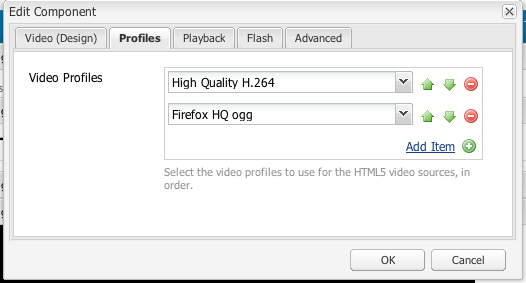

# Configurar o componente Vídeo {#configure-the-video-component}

O componente  Vídeo permite que você coloque um ativo de vídeo predefinido e pronto para uso (OTB) na sua página.

Para que ocorra a transcodificação correta, um administrador instala o FFmpeg separadamente. Consulte [Instalar FFmpeg e configurar o AEM](#install-ffmpeg). Administrators also [Configure Video Profiles](#configure-video-profiles) for use with HTML5 elements.

## Configurar perfis de vídeo {#configure-video-profiles}

Para usar elementos HTML5, defina perfis de vídeo. Os escolhidos aqui são usados em ordem. Para acessar, use o Modo [de](/help/sites-authoring/default-components-designmode.md) design (somente Interface clássica) e selecione a guia **[!UICONTROL Perfis]** :

Nessa caixa de diálogo, você também pode configurar o design do componente Vídeo e os parâmetros para [!UICONTROL Reprodução], [!UICONTROL Flash]e [!UICONTROL Advanced].

## Instalar FFmpeg e configurar o AEM {#install-ffmpeg}

O componente Vídeo depende do produto FFmpeg de código aberto de terceiros para transcodificação de vídeos. Baixado em [https://ffmpeg.org/](https://ffmpeg.org/). Depois de instalar o FFmpeg, configure o AEM para usar um codec de áudio específico e opções específicas de tempo de execução.

Para instalar o FFmpeg no **Windows**, siga estas etapas:

1. Baixe o binário compilado como `ffmpeg.zip`.
1. Desarquivar em uma pasta.
1. Defina a variável de ambiente do sistema `PATH` para &lt;*your-ffmpeg-location*>`\bin`.
1. Reinicie o AEM.

Para instalar o FFmpeg no **Mac OS X**, siga estas etapas:

1. Instale o Xcode disponível em [developer.apple.com/xcode](hhttps://developer.apple.com/xcode/).
1. Instale disponível no [XQuartz](https://www.xquartz.org) para obter o [X11](https://support.apple.com/en-us/HT201341).
1. Instale o MacPorts disponível em [www.macports.org](https://www.macports.org/).
1. No console execute `sudo port install ffmpeg` command e siga as instruções na tela. Verifique se o caminho do `FFmpeg` executável foi adicionado à variável do `PATH` sistema.

Para instalar o FFmpeg no **Mac OS X 10.6**, usando a versão pré-compilada, siga estas etapas:

1. Baixe a versão pré-compilada.
1. Desarquive-o no `/usr/local` diretório.
1. No console, execute `sudo ln -s /usr/local/Cellar/ffmpeg/0.6/bin/ffmpeg /usr/bin/ffmpeg`. Altere os caminhos conforme apropriado.

Para **configurar o AEM**, siga estas etapas:

>[!NOTE]
>
>Essas etapas só são necessárias se for necessária uma personalização adicional dos codecs.

1. Open [!UICONTROL CRXDE Lite] in your web browser. Acesse [http://localhost:4502/crx/de](http://localhost:4502/crx/de).
2. Selecione o `/libs/settings/dam/video/format_aac/jcr:content` nó e verifique se as propriedades do nó são as seguintes:

   * `audioCodec` é `aac`.
   * `customArgs` é `-flags +loop -me_method umh -g 250 -qcomp 0.6 -qmin 10 -qmax 51 -qdiff 4 -bf 16 -b_strategy 1 -i_qfactor 0.71 -cmp chroma -subq 8 -me_range 16 -coder 1 -sc_threshold 40 -b-pyramid normal -wpredp 2 -mixed-refs 1 -8x8dct 1 -fast-pskip 1 -keyint_min 25 -refs 4 -trellis 1 -direct-pred 3 -partitions i8x8,i4x4,p8x8,b8x8`.

3. Para personalizar a configuração, crie uma sobreposição no `/apps/settings/` nó e mova a mesma estrutura sob o `/conf/global/settings/` nó. Não pode ser editado no `/libs` nó. Por exemplo, para sobrepor o caminho `/libs/settings/dam/video/fullhd-bp`, crie-o em `/conf/global/settings/dam/video/fullhd-bp`.

   >[!NOTE]
   >
   >Sobreponha e edite todo o nó do perfil e não apenas a propriedade que precisa de modificação. Tais recursos não são resolvidos através da SlingResourceFusão.

4. If you changed either of the properties, click **[!UICONTROL Save All]**.

>[!NOTE]
>
>As alterações nos modelos de fluxo de trabalho padrão out-of-the-box (OOTB) não são preservadas quando você atualiza sua instância do AEM. A Adobe recomenda que você copie os modelos de fluxo de trabalho modificados antes de editá-los. Por exemplo, copie o modelo de Ativo [!UICONTROL de atualização de] DAM OOTB antes de editar a etapa de Transcodificação de FFmpeg no modelo de Ativo [!UICONTROL de atualização de] DAM para escolher nomes de perfis de vídeo existentes antes da atualização. Em seguida, você pode sobrepor o `/apps` nó para permitir que o AEM recupere as alterações personalizadas no modelo OOTB.
