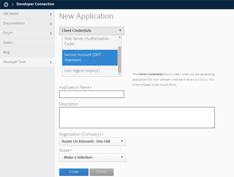

# Configurar a integração do AEM Assets com o Experience Cloud {#configure-aem-assets-integration-with-experience-cloud-and-creative-cloud}

Se você for um cliente do Adobe Experience Cloud, poderá sincronizar os ativos no Adobe Experience Manager Assets com a Adobe Creative Cloud, e vice-versa. Você também pode sincronizar ativos com o Experience Cloud e vice-versa. Você pode configurar essa sincronização por meio de [!DNL Adobe I/O]. O nome atualizado de [!DNL Adobe Marketing Cloud] é [!DNL Adobe Experience Cloud].

O fluxo de trabalho para configurar essa integração é:

1. Crie uma autenticação em [!DNL Adobe I/O] usando um gateway público e obtenha uma ID de aplicativo.
1. Crie um perfil na instância do AEM Assets usando a ID do aplicativo.
1. Use essa configuração para sincronizar ativos.

No back-end, o servidor do AEM autentica seu perfil no gateway e, em seguida, sincroniza os dados entre o Assets e o Experience Cloud.

>[!CAUTION]
>
>Esse recurso foi descontinuado no AEM Assets. Encontre substituições em [Práticas recomendadas de integração do AEM e do Creative Cloud](/help/assets/aem-cc-integration-best-practices.md). Se você tiver qualquer query, [entre em contato com o Atendimento ao Cliente do Adobe](https://www.adobe.com/account/sign-in.supportportal.html).

<!-- Hiding this for now via cqdoc-16834.

>[!NOTE]
>
>Sharing assets between Adobe Experience Cloud and Adobe Creative Cloud requires administrator privileges on the AEM instance.
-->

## Criar um aplicativo {#create-an-application}

1. Acesse a interface do gateway do Desenvolvedor do Adobe fazendo logon em [https://legacy-oauth.cloud.adobe.io](https://legacy-oauth.cloud.adobe.io/).

   >[!NOTE]
   >
   >Você precisa de privilégios de administrador para criar uma ID de aplicativo.

1. No painel esquerdo, navegue até **[!UICONTROL Ferramentas do desenvolvedor]** > **[!UICONTROL Aplicativos]** para exibir uma lista de aplicativos.
1. Clique em **[!UICONTROL Adicionar]**  para criar um aplicativo.
1. Na lista **[!UICONTROL Credenciais do Cliente]**, selecione **[!UICONTROL Conta de Serviço (Asserção JWT)]**, que é um serviço de comunicação de servidor para servidor para autenticação de servidor.

   

1. Especifique um nome para o aplicativo e uma descrição opcional.
1. Na lista **[!UICONTROL Organization]**, selecione a organização para a qual deseja sincronizar ativos.
1. Na lista **[!UICONTROL Scope]**, selecione **[!UICONTROL dam-read]**, **[!UICONTROL dam-sync]**, **[!UICONTROL dam-write]** e **[!UICONTROL cc-share]**.
1. Clique em **[!UICONTROL Criar]**. Uma mensagem notifica que o aplicativo foi criado.

   

1. Copie o **[!UICONTROL ID do aplicativo]** que é gerado para o novo aplicativo.

   >[!CAUTION]
   >
   >Certifique-se de não copiar inadvertidamente o **[!UICONTROL Application Secret]** em vez do **[!UICONTROL Application ID]**.

## Adicionar uma nova configuração ao Experience Cloud {#add-a-new-configuration}

1. Clique no logotipo do AEM na interface do usuário da instância do AEM Assets local e navegue até **[!UICONTROL Ferramentas]** > **[!UICONTROL Cloud Services]** > **[!UICONTROL Cloud Services herdados]**.

1. Localize o serviço **[!UICONTROL Adobe Experience Cloud]**. Se não houver configurações, clique em **[!UICONTROL Configurar agora]**. Se houver configurações, clique em **[!UICONTROL Mostrar configurações]** e clique em `+` para adicionar uma nova configuração.

   >[!NOTE]
   >
   >Use uma conta da Adobe ID que tenha privilégios de administrador para a organização.

1. Na caixa de diálogo **[!UICONTROL Criar configuração]**, especifique um título e nome para a nova configuração e clique em **[!UICONTROL Criar]**.

   

1. No campo **[!UICONTROL URL do locatário]**, especifique o URL do AEM Assets. No passado, se o URL foi definido como `https://<tenant_id>.marketing.adobe.com`, altere-o para `https://<tenant_id>.experiencecloud.adobe.com`.

   1. Navegue até **Ferramentas > Serviços da nuvem > Serviços da nuvem herdados**. Em Adobe Experience Cloud, clique em **Mostrar configurações**.
   1. Selecione a configuração existente a ser editada. Edite a configuração e substitua `marketing.adobe.com` por `experiencecloud.adobe.com`.
   1. Salve a configuração. Teste os agentes de replicação de sincronização MAC.

1. No campo **[!UICONTROL ID do cliente]**, cole a ID do aplicativo copiada no final do procedimento [crie um aplicativo](#create-an-application).

   

1. Em **[!UICONTROL Sincronização]** selecione **[!UICONTROL Ativado]** para ativar a sincronização e clique em **[!UICONTROL OK]**. Se você selecionar **disabled**, a sincronização funcionará em uma única direção.

1. Na página de configuração, clique em **[!UICONTROL Exibir chave pública]** para exibir a chave pública gerada para sua instância. Como alternativa, clique em **[!UICONTROL Baixar chave pública para o Gateway OAuth]** para baixar o arquivo que contém a chave pública. Em seguida, abra o arquivo para exibir a chave pública.

## Habilitar sincronização {#enable-synchronization}

1. Exiba a chave pública usando um dos métodos a seguir mencionados na última etapa do procedimento [adicionar uma nova configuração a Experience Cloud](#add-a-new-configuration). Clique em **[!UICONTROL Exibir chave pública]**.

   

1. Copie a chave pública e cole-a no campo **[!UICONTROL Chave pública]** da interface de configuração do aplicativo que você criou em [criar um aplicativo](#create-an-application).

   

1. Clique em **[!UICONTROL Atualizar]**. Sincronize seus ativos com a instância do AEM Assets agora.

## Testar a sincronização {#test-the-synchronization}

1. Clique no logotipo do AEM na interface do usuário da instância do AEM Assets local e navegue até **[!UICONTROL Ferramentas]**> **[!UICONTROL Implantação]**> **[!UICONTROL Replicação]**para localizar os perfis de replicação criados para sincronização.
1. Na página **[!UICONTROL Replicação]**, clique em **[!UICONTROL Agentes no autor]**.
1. Na lista de perfis, clique no perfil de replicação padrão para sua organização abri-lo.
1. Na caixa de diálogo, clique em **[!UICONTROL Testar conexão]**.

   

1. Quando o restante da replicação for concluído, verifique se há uma mensagem de sucesso no final dos resultados do teste.

## Adicionar usuários ao Experience Cloud {#add-users-to-experience-cloud}

1. Faça logon no Experience Cloud usando as credenciais de administrador.
1. Nos trilhos, vá para **[!UICONTROL Administration]** e clique/toque em **[!UICONTROL Iniciar o Enterprise Dashboard]**.
1. No trilho, clique em **[!UICONTROL Users]** para abrir a página **[!UICONTROL Gerenciamento de usuários]**.
1. Na barra de ferramentas, clique em **Adicionar** .
1. Adicione um ou mais usuários que você deseja fornecer a capacidade de compartilhar ativos com o Creative Cloud.

<!-- TBD: Check.
   >[!NOTE]
   >
   >Only the users that you add to Experience Cloud can share assets from AEM Assets to Creative Cloud.

-->

## Trocar ativos entre o AEM Assets e o Experience Cloud {#exchange-assets-between-aem-and-experience-cloud}

1. Faça logon no AEM Assets.
1. No console Assets, crie uma pasta e faça upload de alguns ativos para ela. Por exemplo, crie uma pasta **mc-demo** e faça upload de um ativo para ela.
1. Selecione a pasta e clique em **Compartilhar** .
1. No menu, selecione **[!UICONTROL Adobe Experience Cloud]** e clique em **[!UICONTROL Compartilhar]**. Uma mensagem notifica que a pasta é compartilhada com o Experience Cloud.

   >[!NOTE]
   >
   >O compartilhamento de uma pasta de Ativos do tipo `sling:OrderedFolder` não é suportado no contexto do compartilhamento no Adobe Experience Cloud. Se quiser compartilhar uma pasta, ao criá-la no AEM Assets, não selecione a opção **[!UICONTROL Ordered]**.

1. Atualize a interface do usuário do AEM Assets. A pasta criada no console Assets da instância local do AEM Assets é copiada para a interface do usuário do Experience Cloud. O ativo que você faz upload para a pasta no AEM Assets aparece na cópia da pasta no Experience Cloud depois de ser processado pelo servidor AEM.
1. Você também pode fazer upload de um ativo na cópia replicada da pasta no Experience Cloud. Após ser processado, o ativo aparece na pasta compartilhada no AEM Assets.

<!-- Removing as per PM guidance via https://jira.corp.adobe.com/browse/CQDOC-16834?focusedCommentId=22881523&page=com.atlassian.jira.plugin.system.issuetabpanels:comment-tabpanel#comment-22881523.

## Exchange assets between AEM Assets and Creative Cloud {#exchange-assets-between-aem-assets-and-creative-cloud}

>[!CAUTION]
>
>The AEM to Creative Cloud Folder Sharing feature is deprecated. Customers are strongly advised to use newer capabilities, like [Adobe Asset Link](https://helpx.adobe.com/enterprise/using/adobe-asset-link.html) or [AEM desktop app](https://helpx.adobe.com/experience-manager/desktop-app/aem-desktop-app.html). Learn more in [AEM and Creative Cloud Integration Best Practices](/help/assets/aem-cc-integration-best-practices.md).

AEM Assets lets you share folders containing assets with Adobe Creative Cloud users.

1. In the Assets console, select the folder to share with Creative Cloud.
1. From the toolbar, click **[!UICONTROL Share]** .
1. From the list, select the **[!UICONTROL Adobe Creative Cloud]** option.

   >[!NOTE]
   >
   >The options are available for users with read permissions on the root. Users must have the required permission to access the replication agent information of Marketing Cloud.

1. In the **[!UICONTROL Creative Cloud Sharing]** page, add the user to share the folder with and choose a role for the user. Click **[!UICONTROL Save]** and click **[!UICONTROL OK]**.

1. Log on to Creative Cloud with the credentials of the user you shared the folder with. The shared folder is available in Creative Cloud.

The AEM Assets-Marketing Cloud synchronization is designed in a way that the user machine instance from where the asset is uploaded retains the right to modify the asset. Only these changes are propagated to the other instance.

For example, if an asset is uploaded from an AEM Assets (on premises) instance, the changes to the asset from this instance are propagated to the Marketing Cloud instance. However, the changes done from the Marketing Cloud instance to the same asset aren’t propagated to the AEM instance and vice versa for asset uploaded from Marketing Cloud.
-->

>[!MORELIKETHIS]
>
>* [Práticas recomendadas de integração de ativos e Creative Cloud](/help/assets/aem-cc-integration-best-practices.md)
>* [Práticas recomendadas de compartilhamento de ativos para a pasta do Creative Cloud](/help/assets/aem-cc-folder-sharing-best-practices.md)

