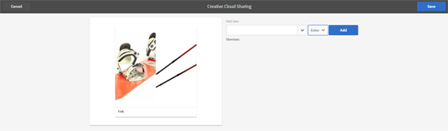

# Compartilhamento de pastas com Adobe Creative Cloud {#folder-sharing-with-adobe-creative-cloud}

>[!CAUTION]
>
>O recurso AEM para compartilhamento de pasta do Creative Cloud está obsoleto. Os clientes são altamente aconselhados a usar recursos mais recentes, como [Adobe Asset Link](https://helpx.adobe.com/br/enterprise/using/adobe-asset-link.html) ou [AEM aplicativo desktop](https://helpx.adobe.com/experience-manager/desktop-app/aem-desktop-app.html). Saiba mais sobre as [Práticas recomendadas de integração de AEM e Creative Cloud](/help/assets/aem-cc-integration-best-practices.md).

Os ativos Adobe Experience Manager (AEM) permitem que você compartilhe pastas que contêm ativos com usuários do Adobe Creative Cloud. Para obter detalhes sobre como configurar o Adobe Marketing Cloud para permitir que você compartilhe ativos com o Adobe Creative Cloud, consulte [Configuração da integração Assets-Creative Cloud](/help/sites-administering/configure-assets-cc-integration.md).

1. No console Ativos, selecione uma pasta para compartilhar com o Creative Cloud.

   

1. Na barra de ferramentas, clique em **Compartilhar**.

   

1. Na lista, selecione a opção **Adobe Creative Cloud**.

   

1. Na página **Compartilhamento de Creative Cloud**, adicione o usuário para compartilhar a pasta e clique em **Salvar**.

   

1. Clique em **Ok** para fechar a mensagem de confirmação.
1. Faça logon no Creative Cloud com as credenciais do usuário com o qual você compartilhou a pasta. A pasta compartilhada está disponível no Creative Cloud.