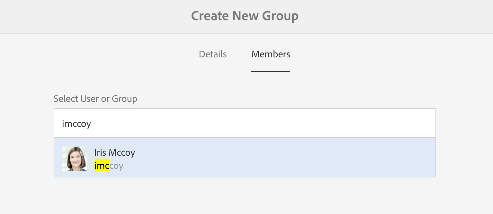
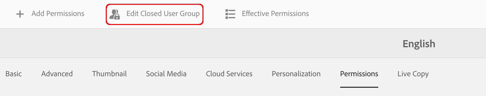

# Criando um grupo de usuários fechado{#creating-a-closed-user-group}

Os CUGs (Closed User Groups, grupos de usuários fechados) são usados para limitar o acesso a páginas específicas que residem em um site da Internet publicado. Tais páginas exigem que os membros atribuídos façam logon e forneçam credenciais de segurança.

Para configurar tal área dentro do seu site, você:

* [crie o grupo de usuários fechado e atribua membros](#creating-the-user-group-to-be-used).

* [aplique esse grupo às ](#applying-your-closed-user-group-to-content-pages) páginas necessárias e selecione (ou crie) a página de logon para uso pelos membros do CUG; também especificado ao aplicar um CUG a uma página de conteúdo.

* [crie um link, de algum formulário, para pelo menos uma página dentro da área](#linking-to-the-realm) protegida, caso contrário ele não estará visível.
* [configure o ](#configure-dispatcher-for-cugs) Dispatcherif em uso.

>[!CAUTION]
>
>Os grupos de usuários fechados (CUGs) devem ser sempre criados tendo em mente o desempenho.
>
>Embora o número de usuários e grupos em um CUG não seja limitado, um número alto de CUGs em uma página pode retardar o desempenho da renderização.
>
>O impacto dos CUGs deve ser sempre considerado ao realizar testes de desempenho.

## Criando O Grupo De Usuários A Ser Usado {#creating-the-user-group-to-be-used}

Para criar um grupo de usuários fechado:

1. Vá para **Ferramentas - Segurança** a partir da tela inicial AEM.

   >[!NOTE]
   >
   >Consulte [Gerenciar usuários e grupos](/help/sites-administering/security.md#managing-users-and-groups) para obter informações completas sobre como criar e configurar usuários e grupos.

1. Selecione o cartão **Grupos** na próxima tela.

   

1. Pressione o botão **Create** no canto superior direito para criar um novo grupo.
1. Dê um nome ao seu novo grupo; por exemplo, `cug_access`.

   

1. Vá para a guia **Membros** e atribua os usuários necessários a esse grupo.

   

1. Ative quaisquer usuários que você tenha atribuído ao CUG; neste caso, todos os membros de `cug_access`.
1. Ative o grupo de usuários fechado para que ele esteja disponível no ambiente de publicação; neste exemplo, `cug_access`.

## Aplicar seu grupo de usuários fechado às páginas de conteúdo {#applying-your-closed-user-group-to-content-pages}

Para aplicar o CUG a uma página:

1. Navegue até a página raiz da seção restrita que deseja atribuir ao CUG.
1. Selecione a página clicando em sua miniatura e, em seguida, clicando em **Propriedades** no painel superior.

   

1. Na seguinte janela, vá para a guia **Avançado**.
1. Role para baixo e ative o tickbox na seção **Authentication Requirements**.

1. Adicione o caminho de configuração abaixo e pressione Salvar.
1. Em seguida, vá para a guia **Permissões** e pressione o botão **Editar grupo de usuários fechado**.

   

   >[OBSERVAÇÃO!]
   >
   > Observe que os CUGs na guia Permissões não podem ser revertidos de Blueprints para Live Copies. Planeje isso ao configurar o Live Copy.
   >
   > Para obter mais informações, consulte [esta página](closed-user-groups.md#aem-livecopy).

1. Procure e adicione seu CUG na seguinte janela - neste caso, adicione o grupo chamado **cug_access**. Finalmente, pressione **Save**.
1. Clique em **Ativado** para definir que esta página (e quaisquer páginas secundárias) pertencem a um CUG.
1. Especifique a **Página de Login** que os membros do grupo usarão; por exemplo:

   `/content/geometrixx/en/toolbar/login.html`

   Isso é opcional, se deixado em branco, a página de logon padrão será usada.

1. Adicione os **Grupos Admitidos**. Use + para adicionar grupos ou - para remover. Somente os membros desses grupos poderão fazer logon e acessar as páginas.
1. Atribua um **Realm** (um nome para os grupos de páginas), se necessário. Deixe em branco para utilizar o título da página.
1. Clique em **OK** para salvar a especificação.

Consulte [Identity Management](/help/sites-administering/identity-management.md) para obter informações sobre perfis no ambiente de publicação e fornecer formulários para fazer logon e logout.

## Vinculação ao Realm {#linking-to-the-realm}

Como o público alvo de qualquer link para o Realm CUG não está visível para o usuário anônimo, o verificador de links removerá esses links.

Para evitar isso, é aconselhável criar páginas de redirecionamento não protegidas que apontem para páginas dentro do território CUG. As entradas de navegação são renderizadas sem causar problemas ao verificador de links. Somente ao acessar a página de redirecionamento, o usuário será redirecionado dentro do território CUG - depois de fornecer suas credenciais de logon com êxito.

## Configurar o Dispatcher para CUGs {#configure-dispatcher-for-cugs}

Se você estiver usando o Dispatcher, será necessário definir um farm do Dispatcher com as seguintes propriedades:

* [virtualhosts](https://helpx.adobe.com/experience-manager/dispatcher/using/dispatcher-configuration.html#identifying-virtual-hosts-virtualhosts): Corresponde ao caminho para as páginas às quais o CUG se aplica.
* \sessionmanagement: veja abaixo.
* [cache](https://helpx.adobe.com/experience-manager/dispatcher/using/dispatcher-configuration.html#configuring-the-dispatcher-cache-cache): Um diretório de cache dedicado aos arquivos aos quais o CUG se aplica.

### Configurando o Dispatcher Session Management para CUGs {#configuring-dispatcher-session-management-for-cugs}

Configure [o gerenciamento de sessão no dispatcher.any file](https://helpx.adobe.com/experience-manager/dispatcher/using/dispatcher-configuration.html#enabling-secure-sessions-sessionmanagement) para o CUG. O manipulador de autenticação usado quando o acesso é solicitado para páginas CUG determina como você configura o gerenciamento de sessões.

```xml
/sessionmanagement
    ...
    /header "Cookie:login-token"
    ...
```

>[!NOTE]
>
>Quando um farm do Dispatcher tem o gerenciamento de sessões ativado, todas as páginas que manipulam o farm não são armazenadas em cache. Para armazenar em cache as páginas que estão fora do CUG, crie um segundo farm no dispatcher.any
>que manipula as páginas não-CUG.

1. Configure [/sessionmanagement](https://helpx.adobe.com/experience-manager/dispatcher/using/dispatcher-configuration.html#enabling-secure-sessions-sessionmanagement) definindo `/directory`; por exemplo:

   ```xml
   /sessionmanagement
     {
     /directory "/usr/local/apache/.sessions"
     ...
     }
   ```

1. Defina [/allowAuthorized](https://helpx.adobe.com/experience-manager/dispatcher/using/dispatcher-configuration.html#caching-when-authentication-is-used) como `0`.

