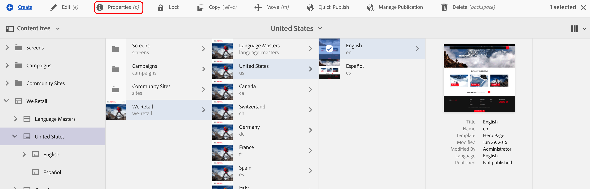

# Criando um grupo de usuários fechado{#creating-a-closed-user-group}

Grupos de usuários fechados (CUGs) são usados para limitar o acesso a páginas específicas que residem em um site da Internet publicado. Essas páginas exigem que os membros atribuídos façam logon e forneçam credenciais de segurança.

Para configurar essa área no seu site, você:

* [criar o grupo de usuários fechado real e atribuir membros](#creating-the-user-group-to-be-used).

* [aplicar este grupo às páginas necessárias](#applying-your-closed-user-group-to-content-pages) e selecionar (ou criar) a página de logon para ser usada pelos membros do CUG; também especificado ao aplicar um CUG a uma página de conteúdo.

* [criar um link, de algum formulário, para pelo menos uma página dentro da área protegida](#linking-to-the-cug-pages)caso contrário, não estará visível.

* [configurar o Dispatcher](#configure-dispatcher-for-cugs) se estiver em uso.

>[!CAUTION]
>
>Os grupos de usuários fechados (CUGs) devem sempre ser criados tendo em mente o desempenho.
>
>Embora o número de usuários e grupos em um CUG não seja limitado, um alto número de CUGs em uma página pode retardar o desempenho de renderização.
>
>O impacto dos CUGs deve ser sempre considerado ao realizar testes de desempenho.

## Criação Do Grupo De Usuários A Ser Usado {#creating-the-user-group-to-be-used}

Para criar um grupo de usuários fechado:

1. Ir para **Ferramentas - Segurança** do AEM homescreen.

   >[!NOTE]
   >
   >Consulte [Gerenciar usuários e grupos](/help/sites-administering/security.md#managing-users-and-groups) para obter informações completas sobre como criar e configurar usuários e grupos.

1. Selecione o **Grupos** cartão da próxima tela.

   

1. Pressione a tecla **Criar** no canto superior direito para criar um novo grupo.
1. Dê um nome ao novo grupo; por exemplo, `cug_access`.

   

1. Vá para o **Membros** e atribua os usuários necessários a esse grupo.

   

1. Ative quaisquer usuários que você tenha atribuído ao CUG; neste caso, todos os membros do `cug_access`.
1. Ative o grupo de usuários fechado para que ele esteja disponível no ambiente de publicação; neste exemplo, `cug_access`.

## Aplicar Seu Grupo De Usuários Fechado Às Páginas De Conteúdo {#applying-your-closed-user-group-to-content-pages}

Para aplicar o CUG a uma página ou páginas:

1. Navegue até a página raiz da seção restrita que deseja atribuir ao CUG.
1. Selecione a página clicando na miniatura e depois selecionando **Propriedades** na barra de ferramentas superior.

   

1. Na janela a seguir, abra o **Avançado** guia .

1. Role para baixo até a **Requisito de autenticação** seção.

   1. Ative o **Habilitar** tickbox.

   1. Adicione o caminho ao seu **Página de logon**.
Isso é opcional, se deixado em branco, a página de logon padrão será usada.

   

1. Em seguida, acesse o **Permissões** e selecione **Editar grupo de usuários fechado**.

   

   >[!NOTE]
   >
   >Os CUGs na guia Permissões não podem ser implantados em Live Copies de Blueprints. Planeje isso ao configurar a Live Copy.
   >
   >Para obter mais informações, consulte [esta página](closed-user-groups.md#aem-livecopy).

1. O **Editar grupo de usuários fechado** será aberta. Aqui você pode pesquisar e selecionar seu CUG e, em seguida, confirmar a seleção de grupo com **Salvar**.

   O grupo será adicionado à lista; por exemplo, o grupo **cug_access**.

   

1. Confirme as alterações com **Salvar e fechar**.

>[!NOTE]
>
>Consulte [Identity Management](/help/sites-administering/identity-management.md) para obter informações sobre perfis no ambiente de publicação e fornecer formulários para fazer logon e sair.

## Vinculação às páginas CUG {#linking-to-the-cug-pages}

Como o destino de qualquer link para as páginas CUG não é visível para o usuário anônimo, o linkchecker removerá esses links.

Para evitar isso, é aconselhável criar páginas de redirecionamento não protegidas que apontem para páginas dentro da área CUG. As entradas de navegação são renderizadas sem causar problemas ao linkchecker. Somente ao acessar a página de redirecionamento, o usuário será redirecionado dentro da área CUG - depois de fornecer com sucesso suas credenciais de logon.

## Configurar o Dispatcher para CUGs {#configure-dispatcher-for-cugs}

Se você estiver usando o Dispatcher, precisará definir um farm do Dispatcher com as seguintes propriedades:

* [virtualhosts](https://experienceleague.adobe.com/docs/experience-manager-dispatcher/using/configuring/dispatcher-configuration.html?lang=en#identifying-virtual-hosts-virtualhosts): Corresponde ao caminho para as páginas às quais o CUG se aplica.
* \sessionmanagement: veja abaixo.
* [cache](https://experienceleague.adobe.com/docs/experience-manager-dispatcher/using/configuring/dispatcher-configuration.html?lang=en#configuring-the-dispatcher-cache-cache): Um diretório de cache dedicado aos arquivos aos quais o CUG se aplica.

### Configurando o Gerenciamento de Sessão do Dispatcher para CUGs {#configuring-dispatcher-session-management-for-cugs}

Configurar [gerenciamento de sessão no arquivo dispatcher.any](https://experienceleague.adobe.com/docs/experience-manager-dispatcher/using/configuring/dispatcher-configuration.html?lang=en#enabling-secure-sessions-sessionmanagement) para o CUG. O manipulador de autenticação usado quando o acesso é solicitado para páginas CUG determina como configurar o gerenciamento de sessões.

```xml
/sessionmanagement
    ...
    /header "Cookie:login-token"
    ...
```

>[!NOTE]
>
>Quando um farm do Dispatcher tem o gerenciamento de sessão ativado, todas as páginas que os identificadores de farm não são armazenadas em cache. Para armazenar páginas em cache fora do CUG, crie um segundo farm no dispatcher.any
>que manipula as páginas que não são CUG.

1. Configurar [/sessionmanagement](https://experienceleague.adobe.com/docs/experience-manager-dispatcher/using/configuring/dispatcher-configuration.html?lang=en#enabling-secure-sessions-sessionmanagement) definindo `/directory`; por exemplo:

   ```xml
   /sessionmanagement
     {
     /directory "/usr/local/apache/.sessions"
     ...
     }
   ```

1. Definir [/allowAuthorized](https://experienceleague.adobe.com/docs/experience-manager-dispatcher/using/configuring/dispatcher-configuration.html?lang=en#caching-when-authentication-is-used) para `0`.
