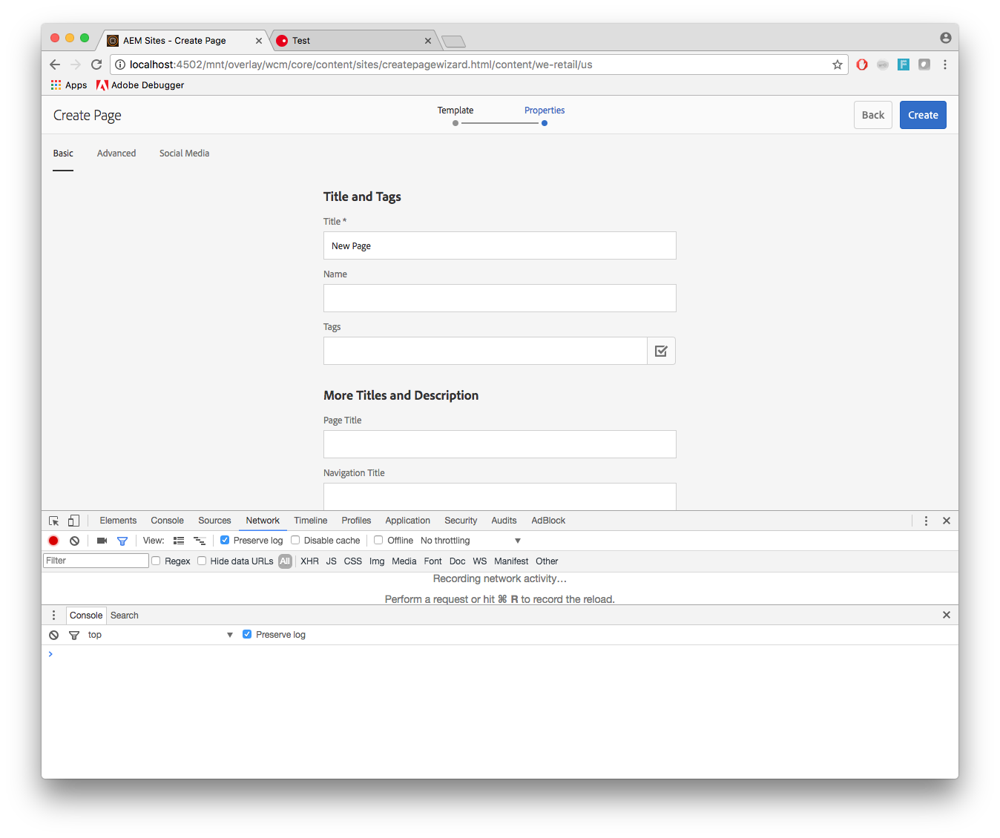

# Uso do cURL com o AEM{#using-curl-with-aem}

Geralmente, os administradores precisam automatizar ou simplificar tarefas comuns em qualquer sistema. Por exemplo, no AEM, gerenciar usuários, instalar pacotes e gerenciar pacotes OSGi são tarefas que devem ser realizadas com frequência.

Devido à natureza RESTful da estrutura Sling na qual o AEM é criado, a maioria das tarefas pode ser reduzida a uma chamada de URL. cURL pode ser usado para executar tais chamadas de URL e pode ser uma ferramenta útil para administradores de AEM.

## O que é cURL {#what-is-curl}

cURL é uma ferramenta de linha de comando de código aberto usada para executar manipulações de URL. Ele suporta uma grande variedade de protocolos de Internet, incluindo HTTP, HTTPS, FTP, FTPS, SCP, SFTP, TFTP, LDAP, DAP, DICT, TELNET, FILE, IMAP, POP3, SMTP e RTSP.

cURL é uma ferramenta bem estabelecida e amplamente usada para obter ou enviar dados usando a sintaxe do URL e foi originalmente lançada em 1997. O nome cURL originalmente significava &quot;consulte URL&quot;.

Devido à natureza RESTful da estrutura Sling na qual o AEM é criado, a maioria das tarefas pode ser reduzida a uma chamada de URL, que pode ser executada com cURL. [Tarefas](/help/sites-administering/curl.md#common-content-manipulation-aem-curl-commands) de manipulação de conteúdo, como ativação de páginas e início de fluxos de trabalho, bem como tarefas [](/help/sites-administering/curl.md#common-operational-aem-curl-commands) operacionais, como gerenciamento de pacotes e gerenciamento de usuários, podem ser automatizadas usando cURL. Além disso, você pode [criar seus próprios comandos cURL](/help/sites-administering/curl.md#building-a-curl-ready-aem-command) para a maioria das tarefas no AEM.

>[!NOTE]
>
>Qualquer comando do AEM executado por meio de cURL deve ser autorizado, assim como qualquer usuário do AEM. Todas as ACLs e direitos de acesso são respeitados ao usar cURL para executar um comando do AEM.

## Download do cURL {#downloading-curl}

cURL é uma parte padrão do macOS e algumas distrações do Linux. No entanto, ele está disponível para a maioria dos sistemas operacionais. Os downloads mais recentes podem ser encontrados em [https://curl.haxx.se/download.html](https://curl.haxx.se/download.html).

O repositório de origem do cURL também pode ser encontrado no GitHub.

## Criação de um comando AEM pronto para cURL {#building-a-curl-ready-aem-command}

Os comandos cURL podem ser criados para a maioria das operações no AEM, como acionar fluxos de trabalho, verificar configurações do OSGi, disparar comandos JMX, criar agentes de replicação e muito mais.

Para encontrar o comando exato necessário para sua operação específica, é necessário usar as ferramentas do desenvolvedor em seu navegador para capturar a chamada POST para o servidor ao executar o comando AEM.

As etapas a seguir descrevem como fazer isso usando a criação de uma nova página no navegador Chrome como exemplo.

1. Prepare a ação que deseja invocar no AEM. Nesse caso, continuamos até o final do assistente **Criar página** , mas ainda não clicamos em **Criar**.

   

1. Inicie as ferramentas do desenvolvedor e selecione a guia **Rede** . Clique na opção **Preservar registro** antes de limpar o console.

   

1. Clique em **Criar** no assistente **Criar página** para realmente criar o fluxo de trabalho.
1. Clique com o botão direito do mouse na ação POST resultante e selecione **Copiar** -> **Copiar como cURL**.

   

1. Copie o comando cURL para um editor de texto e remova todos os cabeçalhos do comando, que começam com `-H` (realçado em azul na imagem abaixo) e adicione o parâmetro de autenticação apropriado, como `-u admin:admin`.

   

1. Execute o comando cURL pela linha de comando e visualize a resposta.

   

## Comandos Comuns do AEM Operacional cURL {#common-operational-aem-curl-commands}

Esta é uma lista de comandos cURL do AEM para tarefas administrativas e operacionais comuns.

>[!NOTE]
>
>Os exemplos a seguir presumem que o AEM está sendo executado `localhost` na porta `4502` e usa o usuário `admin` com senha `admin`. Marcadores de posição de comando adicionais são definidos em colchetes angulares.

### Gerenciamento de pacotes {#package-management}

#### Criar um pacote {#create-a-package}

```shell
curl -u admin:admin -X POST http://localhost:4502/crx/packmgr/service/.json/etc/packages/mycontent.zip?cmd=create -d packageName=<name> -d groupName=<name>
```

#### Visualizar um pacote {#preview-a-package}

```shell
curl -u admin:admin -X POST http://localhost:4502/crx/packmgr/service/.json/etc/packages/mycontent.zip?cmd=preview
```

#### Conteúdo do pacote de lista {#list-package-content}

```shell
curl -u admin:admin -X POST http://localhost:4502/crx/packmgr/service/console.html/etc/packages/mycontent.zip?cmd=contents
```

#### Criar um pacote {#build-a-package}

```shell
curl -X POST http://localhost:4502/crx/packmgr/service/.json/etc/packages/mycontent.zip?cmd=build
```

#### Revincular um pacote {#rewrap-a-package}

```shell
curl -u admin:admin -X POST http://localhost:4502/crx/packmgr/service/.json/etc/packages/mycontent.zip?cmd=rewrap
```

#### Renomear um pacote {#rename-a-package}

```shell
curl -u admin:admin -X POST -Fname=<New Name> http://localhost:4502/etc/packages/<Group Name>/<Package Name>.zip/jcr:content/vlt:definition
```

#### Carregar um pacote {#upload-a-package}

```shell
curl -u admin:admin -F cmd=upload -F force=true -F package=@test.zip http://localhost:4502/crx/packmgr/service/.json
```

#### Instalar um pacote {#install-a-package}

```shell
curl -u admin:admin -F cmd=install http://localhost:4502/crx/packmgr/service/.json/etc/packages/my_packages/test.zip
```

#### Desinstalar um pacote {#uninstall-a-package}

```shell
curl -u admin:admin -F cmd=uninstall http://localhost:4502/crx/packmgr/service/.json/etc/packages/my_packages/test.zip
```

#### Excluir um pacote {#delete-a-package}

```shell
curl -u admin:admin -F cmd=delete http://localhost:4502/crx/packmgr/service/.json/etc/packages/my_packages/test.zip
```

#### Download de um pacote {#download-a-package}

```shell
curl -u admin:admin http://localhost:4502/etc/packages/my_packages/test.zip
```

### Gerenciamento de usuários {#user-management}

#### Create a New User {#create-a-new-user}

```shell
curl -u admin:admin -FcreateUser= -FauthorizableId=hashim -Frep:password=hashim http://localhost:4502/libs/granite/security/post/authorizables
```

#### Create a New Group {#create-a-new-group}

```shell
curl -u admin:admin -FcreateGroup=group1 -FauthorizableId=testGroup1 http://localhost:4502/libs/granite/security/post/authorizables
```

#### Adicionar uma propriedade a um usuário existente {#add-a-property-to-an-existing-user}

```shell
curl -u admin:admin -Fprofile/age=25 http://localhost:4502/home/users/h/hashim.rw.html
```

#### Criar um usuário com um perfil {#create-a-user-with-a-profile}

```shell
curl -u admin:admin -FcreateUser=testuser -FauthorizableId=hashimkhan -Frep:password=hashimkhan -Fprofile/gender=male http://localhost:4502/libs/granite/security/post/authorizables
```

#### Criar um novo usuário como membro de um grupo {#create-a-new-user-as-a-member-of-a-group}

```shell
curl -u admin:admin -FcreateUser=testuser -FauthorizableId=testuser -Frep:password=abc123 -Fmembership=contributor http://localhost:4502/libs/granite/security/post/authorizables
```

#### Adicionar um usuário a um grupo {#add-a-user-to-a-group}

```shell
curl -u admin:admin -FaddMembers=testuser1 http://localhost:4502/home/groups/t/testGroup.rw.html
```

#### Remover um usuário de um grupo {#remove-a-user-from-a-group}

```shell
curl -u admin:admin -FremoveMembers=testuser1 http://localhost:4502/home/groups/t/testGroup.rw.html
```

#### Definir a associação de um grupo de usuários {#set-a-user-s-group-membership}

```shell
curl -u admin:admin -Fmembership=contributor -Fmembership=testgroup http://localhost:4502/home/users/t/testuser.rw.html
```

#### Excluir um usuário {#delete-a-user}

```shell
curl -u admin:admin -FdeleteAuthorizable= http://localhost:4502/home/users/t/testuser

```

#### Excluir um grupo {#delete-a-group}

```shell
curl -u admin:admin -FdeleteAuthorizable= http://localhost:4502/home/groups/t/testGroup
```

### Backup {#backup}

Consulte [Backup e restauração](/help/sites-administering/backup-and-restore.md#automating-aem-online-backup) para obter detalhes.

### OSGi {#osgi}

#### Iniciar um pacote {#starting-a-bundle}

```shell
curl -u admin:admin -Faction=start http://localhost:4502/system/console/bundles/<bundle-name>
```

#### Parando um pacote {#stopping-a-bundle}

```shell
curl -u admin:admin -Faction=stop http://localhost:4502/system/console/bundles/<bundle-name>
```

### Dispatcher {#dispatcher}

#### Invalidar o cache {#invalidate-the-cache}

```shell
curl -H "CQ-Action: Activate" -H "CQ-Handle: /content/test-site/" -H "CQ-Path: /content/test-site/" -H "Content-Length: 0" -H "Content-Type: application/octet-stream" http://localhost:4502/dispatcher/invalidate.cache
```

#### Despeje o cache {#evict-the-cache}

```shell
curl -H "CQ-Action: Deactivate" -H "CQ-Handle: /content/test-site/" -H "CQ-Path: /content/test-site/" -H "Content-Length: 0" -H "Content-Type: application/octet-stream" http://localhost:4502/dispatcher/invalidate.cache
```

### Agente de replicação {#replication-agent}

#### Verifique o status de um agente {#check-the-status-of-an-agent}

```shell
curl -u admin:admin "http://localhost:4502/etc/replication/agents.author/publish/jcr:conten t.queue.json?agent=publish"
http://localhost:4502/etc/replication/agents.author/publish/jcr:content.queue.js on?agent=publish
```

#### Excluir um agente {#delete-an-agent}

```shell
curl -X DELETE http://localhost:4502/etc/replication/agents.author/replication99 -u admin:admin
```

#### Criar um agente {#create-an-agent}

```shell
curl -u admin:admin -F "jcr:primaryType=cq:Page" -F "jcr:content/jcr:title=new-replication" -F "jcr:content/sling:resourceType=/libs/cq/replication/components/agent" -F "jcr:content/template=/libs/cq/replication/templates/agent" -F "jcr:content/transportUri=http://localhost:4503/bin/receive?sling:authRequestLogin=1" -F "jcr:content/transportUser=admin" -F "jcr:content/transportPassword={DES}8aadb625ced91ac483390ebc10640cdf"http://localhost:4502/etc/replication/agents.author/replication99
```

#### Pausar um agente {#pause-an-agent}

```shell
curl -u admin:admin -F "cmd=pause" -F "name=publish"  http://localhost:4502/etc/replication/agents.author/publish/jcr:content.queue.js on
```

#### Limpar uma fila de agentes {#clear-an-agent-queue}

```shell
curl -u admin:admin -F "cmd=clear" -F "name=publish"  http://localhost:4502/etc/replication/agents.author/publish/jcr:content.queue.js on
```

### Communities {#communities}

#### Atribuir e Revogar Crachás {#assign-and-revoke-badges}

Consulte Pontuação de [comunidades e emblemas](/help/communities/implementing-scoring.md#assign-and-revoke-badges) para obter detalhes.

Consulte [Scoring e Badges Essentials](/help/communities/configure-scoring.md#example-setup) para obter detalhes.

#### Reindexação MSRP {#msrp-reindexing}

Consulte [MSRP - Provedor](/help/communities/msrp.md#running-msrp-reindex-tool-using-curl-command) de recursos de armazenamento MongoDB para obter detalhes.

### Segurança {#security}

#### Ativação e desativação do CRX DE Lite {#enabling-and-disabling-crx-de-lite}

Consulte [Ativar o CRXDE Lite no AEM](/help/sites-administering/enabling-crxde-lite.md) para obter detalhes.

### Coleta de lixo do armazenamento de dados {#data-store-garbage-collection}

Consulte Coleta [de lixo do armazenamento](/help/sites-administering/data-store-garbage-collection.md#automating-data-store-garbage-collection) de dados para obter detalhes.

### Integração do Analytics e do Target {#analytics-and-target-integration}

Consulte [Opting In Adobe Analytics e Adobe Target](/help/sites-administering/opt-in.md#configuring-the-setup-and-provisioning-via-script) para obter detalhes.

### Logon único {#single-sign-on}

#### Enviar cabeçalho de teste {#send-test-header}

Consulte Logon [único](/help/sites-deploying/single-sign-on.md) para obter detalhes.

## Comandos AEM cURL de gerenciamento de conteúdo comum {#common-content-manipulation-aem-curl-commands}

Esta é uma lista de comandos cURL do AEM para manipulação de conteúdo.

>[!NOTE]
>
>Os exemplos a seguir presumem que o AEM está sendo executado `localhost` na porta `4502` e usa o usuário `admin` com senha `admin`. Marcadores de posição de comando adicionais são definidos em colchetes angulares.

### Gerenciamento de página {#page-management}

#### Ativação de página {#page-activation}

```shell
curl -u admin:admin -X POST -F path="/content/path/to/page" -F cmd="activate" http://localhost:4502/bin/replicate.json
```

#### Desativação da página {#page-deactivation}

```shell
curl -u admin:admin -X POST -F path="/content/path/to/page" -F cmd="deactivate" http://localhost:4502/bin/replicate.json
```

#### Ativação da árvore {#tree-activation}

```shell
curl -u admin:admin -F cmd=activate -F ignoredeactivated=true -F onlymodified=true -F path=/content/geometrixx http://localhost:4502/etc/replication/treeactivation.html
```

#### Bloquear página {#lock-page}

```shell
curl -u admin:admin -X POST -F cmd="lockPage" -F path="/content/path/to/page" -F "_charset_"="utf-8" http://localhost:4502/bin/wcmcommand
```

#### Desbloquear a página {#unlock-page}

```shell
curl -u admin:admin -X POST -F cmd="unlockPage" -F path="/content/path/to/page" -F "_charset_"="utf-8" http://localhost:4502/bin/wcmcommand
```

#### Página de cópia {#copy-page}

```shell
curl -u admin:admin -F cmd=copyPage -F destParentPath=/path/to/destination/parent -F srcPath=/path/to/source/location http://localhost:4502/bin/wcmcommand
```

### Fluxos de trabalhos {#workflows}

Consulte [Interação com fluxos de trabalho programaticamente](/help/sites-developing/workflows-program-interaction.md) para obter detalhes.

### Sling Content {#sling-content}

#### Create a Folder {#create-a-folder}

```shell
curl -u admin:admin -F jcr:primaryType=sling:Folder http://localhost:4502/etc/test
```

#### Excluir um nó {#delete-a-node}

```shell
curl -u admin:admin -F :operation=delete http://localhost:4502/etc/test/test.properties
```

#### Mover um nó {#move-a-node}

```shell
curl -u admin:admin -F":operation=move" -F":applyTo=/sourceurl"  -F":dest=/target/parenturl/" https://localhost:4502/content
```

#### Copiar um nó {#copy-a-node}

```shell
curl -u admin:admin -F":operation=copy" -F":applyTo=/sourceurl"  -F":dest=/target/parenturl/" https://localhost:4502/content
```

#### Carregar arquivos usando Sling PostServlet {#upload-files-using-sling-postservlet}

```shell
curl -u admin:admin -F"*=@test.properties"  http://localhost:4502/etc/test
```

#### Carregar arquivos usando o Sling PostServlet e especificar o nome do nó {#upload-files-using-sling-postservlet-and-specifying-node-name}

```shell
curl -u admin:admin -F"test2.properties=@test.properties"  http://localhost:4502/etc/test
```

#### Carregar arquivos especificando um tipo de conteúdo {#upload-files-specifying-a-content-type}

```shell
curl -u admin:admin -F "*=@test.properties;type=text/plain" http://localhost:4502/etc/test
```

### Manipulação de ativos {#asset-manipulation}

Consulte API [HTTP de](/help/assets/mac-api-assets.md) ativos para obter detalhes.
