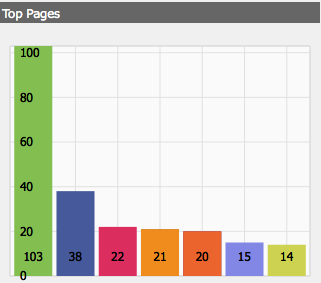

# Painéis{#dashboards}

Ao usar AEM, é possível gerenciar muitos conteúdos de tipos diferentes (por exemplo, páginas, ativos). AEM Painéis fornecem uma maneira fácil de usar e personalizável de definir páginas que exibem dados consolidados.

>[!NOTE]
>
>AEM Os painéis são criados por usuário, de modo que o usuário só pode acessar seu próprio painel.
>
>No entanto, [Modelos do painel](#creating-a-dashboard-template) pode ser usada para compartilhar configurações comuns e layout do painel.


## Administração de painéis {#administering-dashboards}

### Criar Um Painel {#creating-a-dashboard}

Para criar um novo Painel, proceda da seguinte maneira:

1. No **Ferramentas** seção , clique em **Console de configuração**.
1. Na árvore, clique duas vezes em **Painel**.
1. Clique em **Novo painel**.
1. Digite o **Título** (por exemplo, Meu painel) e o **Nome**.
1. Clique em **Criar**.

### Clonar Um Painel {#cloning-a-dashboard}

Você pode querer ter vários painéis para ver rapidamente as informações sobre o seu conteúdo de diferentes visualizações. Para ajudar você a criar um novo Painel, o AEM fornece um recurso de clone que pode ser usado para duplicar um Painel existente. Para clonar um painel, proceda da seguinte maneira:

1. No **Ferramentas** seção , clique em **Console de configuração**.

1. Na árvore, clique em **Painel**.
1. Clique no painel que deseja clonar.

1. Clique em **Clonar**.

1. Digite o **Nome** do novo painel.

### Remover Um Painel {#removing-a-dashboard}

1. No **Ferramentas** seção , clique em **Console de configuração**.

1. Na árvore, clique em **Painel**.
1. Clique no painel que deseja excluir.

1. Clique em **Remover**.

1. Clique em **Sim** para confirmar.

## Componentes do painel {#dashboard-components}

### Visão geral {#overview}

Os componentes do painel não são mais do que regulares [Componentes AEM](/help/sites-developing/developing-components-samples.md). Esta seção descreve os componentes de relatório fornecidos com o AEM.

### Componentes de relatórios do Web Analytics {#web-analytics-reporting-components}

AEM vem com um conjunto de componentes que renderizam várias métricas de seu [SiteCatalyst](/help/sites-administering/adobeanalytics.md) dados. Esses componentes estão listados no Sidekick sob a **Painel** seção.

Cada componente de relatório fornece pelo menos três guias:

* **Básico**: contém a configuração principal.

* **Relatório:** contém a configuração específica de cada relatório.
* **Estilo**: contém configuração de estilo, como tamanho e margem do gráfico.

Os componentes de relatório são inicializados com uma configuração padrão que ajuda você a configurar rapidamente seu painel.

#### Configuração básica {#basic-configuration}

O **Básico** A guia fornece acesso às seguintes entradas de configuração:

**Título** O título exibido no painel.

**Tipo de solicitação** A forma como os dados são solicitados.

**Configuração do SiteCatalyst (opcional)** A configuração que você deseja usar para se conectar ao SiteCatalyst. Se não fornecido, presume-se que a configuração foi configurada na página Painel (por meio das propriedades da página).

**ID de conjunto de relatórios (opcional)** O conjunto de relatórios do SiteCatalyst que você deseja usar para gerar o gráfico.

#### Configuração do relatório {#report-configuration}

Para exibir estatísticas da Web, é necessário definir o intervalo de datas dos dados que deseja veicular. O **Relatório** A guia fornece dois campos para definir esse intervalo.

>[!NOTE]
>
>Definir um intervalo de datas grande pode diminuir a capacidade de resposta do painel.

**Data de** Data absoluta ou relativa a partir da qual os dados são buscados.

**Data para** Data absoluta ou relativa para a qual os dados são buscados.

Cada componente também define configurações específicas.

#### Relatório de horas extras {#overtime-report}


**Granularidade de data** Unidade de tempo do eixo X (por exemplo, dia, hora).

**Métricas** A lista de eventos que você deseja exibir.

**Elementos** A lista de elementos que analisa os dados das métricas no gráfico.

#### Relatório da lista classificada {#ranked-list-report}


**Elementos** O elemento que analisa os dados das métricas no gráfico.

**Métricas** O evento que você deseja exibir.

**Não. dos itens superiores** Número de itens exibidos pelo relatório.

#### Relatório classificado {#ranked-report}



**Métricas** O evento que você deseja exibir.

**Elementos** O elemento que analisa os dados das métricas no gráfico.

#### Relatório principal da seção do site {#top-site-section-report}

Esse componente exibe um gráfico que mostra a seção mais visitada de um site de acordo com a configuração a seguir.


**Não. dos itens superiores** Número de seção exibida pelo no relatório.

#### Relatório de tendências {#trended-report}


**Granularidade de data** Unidade de tempo do eixo X (por exemplo, dia, hora).

**Métricas** O evento que você deseja exibir.

**Elementos** O elemento que analisa os dados das métricas no gráfico.

## Estender painel {#extending-dashboard}

### Visão geral {#overview-1}

Painéis são páginas normais ( `cq:Page`), portanto, qualquer componente pode ser usado para montar Painéis.

Há um grupo de componentes padrão `Dashboard` que contém componentes de relatórios do analytics que são ativados no modelo por padrão.

### Criar Um Modelo De Painel {#creating-a-dashboard-template}

Um modelo define o conteúdo padrão de um novo Painel. Você pode usar vários modelos para criar diferentes tipos de painéis.

Os modelos de painel são criados como outros modelos de página, exceto que são armazenados em `/libs/cq/dashboards/templates/`. Consulte a [Criação de um modelo de página de conteúdo](/help/sites-developing/website.md#creating-the-contentpage-template) seção.

>[!NOTE]
>
>Os modelos de painel são compartilhados entre usuários.

### Desenvolvimento de um componente de painel {#developing-a-dashboard-component}

O desenvolvimento de um componente de Painel consiste na criação de um Componente de AEM comum. Esta seção descreve um exemplo de um componente que exibe os 10 principais contribuidores.


Os principais componentes do autor são armazenados no repositório em `/apps/geometrixx-outdoors/components/reporting` e é composto por :

1. a `jsp` arquivo que lê dados do jcr e define o `html` espaço reservado.

1. uma biblioteca do lado do cliente contendo uma `js` arquivo que busca e solicita os dados, em seguida, preenche a variável `html` espaço reservado.


O arquivo Javascript a seguir é definido na variável `geout.reporting.topauthors` [Biblioteca do cliente](/help/sites-developing/clientlibs.md) como filho do próprio componente.

O [QueryBuilder](/help/sites-developing/querybuilder-api.md) é usado para consultar o repositório a ser lido `cq:AuditEvent` nós. O resultado da consulta é um objeto JSON do qual as contribuições do autor são extraídas.

#### top_authors.js {#top-authors-js}

```
$.ajax({
  url: "/bin/querybuilder.json",
  cache: false,
  data: {
       "orderby": "cq:time",
       "orderby.sort": "desc",
       "p.hits": "full",
       "p.limit": 100,
       "path": "/var/audit/com.day.cq.wcm.core.page/",
       "type": "cq:AuditEvent"
   },
  dataType: "json"
}).done(function( res ) {
    var authors = {};
    // from JSON to Object
    for(var r in res.hits) {
        var userId = res.hits[r].userId;
        if(userId == undefined) {
            continue;
        }
        var auth = authors[userId] || {userId : userId};
        auth.contrib = (auth.contrib || 0) +1;

        authors[userId] = auth;
    }

    // order by contribution
    var orderedByContrib = [];
    for(var a in authors) {
        orderedByContrib.push(authors[a]);
    }
    orderedByContrib.sort(function(a,b){return b.contrib - a.contrib});

    // produce the list
    for (var i=0, tot=orderedByContrib.length; i < tot; i++) {
        var current = orderedByContrib[i];
        $("<div> #" + (i + 1) +" "+ current.userId + " (" + current.contrib +" contrib.)</div>").appendTo("#authors-list");

    }
});
```

O `JSP` inclui ambos `global.jsp` e `clientlib`.

#### top_authors.jsp {#top-authors-jsp}

```java
<%@page session="false" contentType="text/html; charset=utf-8" %><%
%><%
%><%@include file="/libs/foundation/global.jsp" %><%
%>
<ui:includeClientLib categories="geout.reporting.topauthors" />
<%
String reportletTitle = properties.get("title", "Top Authors");
%>
<html>
     <h3><%=xssAPI.encodeForHTML(reportletTitle) %></h3>
     <div id="authors-list"></div>
</html>
```
