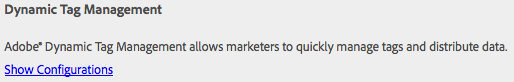

# Integração com o Adobe Dynamic Tag Management {#integrating-with-adobe-dynamic-tag-management}

Integrar [Adobe Dynamic Tag Management](https://www.adobe.com/solutions/digital-marketing/dynamic-tag-management.html) com o AEM para que você possa usar suas propriedades da Web do Dynamic Tag Management para rastrear AEM sites. O Dynamic Tag Management permite que os profissionais de marketing gerenciem tags para coleta de dados e distribuam dados pelos sistemas de marketing digital. Por exemplo, use o Dynamic Tag Management para coletar dados de uso do seu site de AEM e distribuir os dados para análise no Adobe Analytics ou Adobe Target.

Antes de se integrar, é necessário criar o Tag Management dinâmico [propriedade da web](https://microsite.omniture.com/t2/help/en_US/dtm/#Web_Properties) que rastreia o domínio do site de AEM. O [opções de hospedagem](https://microsite.omniture.com/t2/help/en_US/dtm/#Hosting__Embed_Tab) da propriedade da Web deve ser configurada para que você possa configurar o AEM para acessar as bibliotecas do Dynamic Tag Management.

Após configurar a integração, as alterações nas ferramentas e regras de implantação do Dynamic Tag Management não exigem que você altere a configuração do Dynamic Tag Management no AEM. As alterações são disponibilizadas automaticamente para AEM.

>[!NOTE]
>
>Se você estiver usando o DTM com uma configuração de proxy personalizada, precisará configurar ambas as configurações de proxy do cliente HTTP, pois algumas funcionalidades do AEM estão usando as APIs 3.x e outras as APIs 4.x:
>
>* A 3.x está configurada com [http://localhost:4502/system/console/configMgr/com.day.commons.httpclient](http://localhost:4502/system/console/configMgr/com.day.commons.httpclient)
>* A 4.x está configurada com [http://localhost:4502/system/console/configMgr/org.apache.http.proxyconfigurator](http://localhost:4502/system/console/configMgr/org.apache.http.proxyconfigurator)
>

## Opções de implantação {#deployment-options}

As opções de implantação a seguir afetam a configuração da integração com o Dynamic Tag Management.

### Hospedagem dinâmica de Tag Management {#dynamic-tag-management-hosting}

AEM suporta o Dynamic Tag Management que está hospedado na nuvem ou hospedado no AEM.

* Hospedado na nuvem: As bibliotecas JavaScript do Dynamic Tag Management são armazenadas na nuvem e suas páginas de AEM fazem referência diretamente a elas.
* AEM hospedado: O Dynamic Tag Management gera bibliotecas javascript. O AEM usa um modelo de fluxo de trabalho para obter e instalar as bibliotecas do .

O tipo de hospedagem que sua implementação usa determina algumas das tarefas de configuração e implementação que você executa. Para obter informações sobre as opções de hospedagem, consulte [Hospedagem - guia Incorporar](https://microsite.omniture.com/t2/help/en_US/dtm/#Hosting__Embed_Tab) na Ajuda do Dynamic Tag Management.

### Biblioteca de preparo e produção {#staging-and-production-library}

Decida se a instância do autor do AEM usa o código de preparo ou produção do Dynamic Tag Management.

Normalmente, sua instância de autor usa as bibliotecas de preparo do Dynamic Tag Management e a instância de produção usa as bibliotecas de produção. Esse cenário permite usar a instância do autor para testar configurações não aprovadas do Dynamic Tag Management.

Se desejar, a instância do autor poderá usar as bibliotecas de produção. Estão disponíveis plug-ins de navegadores da Web que permitem alternar entre o uso de bibliotecas de preparo para fins de teste quando as bibliotecas estiverem hospedadas na nuvem.

### Usar o gancho de implantação do Dynamic Tag Management {#using-the-dynamic-tag-management-deployment-hook}

Quando o AEM hospeda as bibliotecas do Dynamic Tag Management, você pode usar o serviço de gancho de implantação do Dynamic Tag Management para enviar automaticamente as atualizações da biblioteca para o AEM. As atualizações da biblioteca são enviadas quando alterações são feitas nas bibliotecas, como quando as propriedades da Web do Dynamic Tag Management são editadas.

Para usar o gancho de implantação, o Dynamic Tag Management deve ser capaz de se conectar à instância de AEM que hospeda as bibliotecas. Você deve [habilitar o acesso ao AEM](/help/sites-administering/dtm.md#enabling-access-for-the-deployment-hook-service) para os servidores do Dynamic Tag Management.

Em algumas circunstâncias, AEM pode ser inacessível, como quando AEM por trás de um firewall. Nesses casos, você pode usar a opção AEM importador de pesquisa para recuperar periodicamente as bibliotecas. Uma expressão de trabalho cron determina o agendamento dos downloads da biblioteca.

## Ativando o Acesso para o Serviço de Gancho de Implantação {#enabling-access-for-the-deployment-hook-service}

Ative o serviço de gancho de implantação do Dynamic Tag Management para acessar o AEM para que o serviço possa atualizar as bibliotecas hospedadas pelo AEM. Especifique o endereço IP dos servidores do Dynamic Tag Management que atualizam as bibliotecas de preparo e produção, conforme necessário:

* Estágios: `107.21.99.31`
* Produção: `23.23.225.112` e `204.236.240.48`

Execute a configuração usando o [Console da Web](/help/sites-deploying/configuring-osgi.md#osgi-configuration-with-the-web-console) ou [`sling:OsgiConfig`](/help/sites-deploying/configuring-osgi.md#osgi-configuration-in-the-repository) nó:

* No Console da Web, use o item Adobe DTM Deploy Hook Configuration na página Configuração .
* Para uma configuração OSGi, o PID do serviço é `com.adobe.cq.dtm.impl.servlets.DTMDeployHookServlet`.

A tabela a seguir descreve as propriedades a serem configuradas.

| Propriedade do Console da Web | Propriedade OSGi | Descrição |
|---|---|---|
| Lista técnica do DTM de preparo | `dtm.staging.ip.whitelist` | O endereço IP do servidor do Dynamic Tag Management que atualiza as bibliotecas de preparo. |
| Lista branca do IP do DTM de produção | `dtm.production.ip.whitelist` | O endereço IP do servidor do Dynamic Tag Management que atualiza as bibliotecas de produção. |

## Criação da configuração do Dynamic Tag Management {#creating-the-dynamic-tag-management-configuration}

Crie uma configuração de nuvem para que a instância do AEM possa se autenticar com o Dynamic Tag Management e interagir com sua propriedade da Web.

>[!NOTE]
>
>Evite a inclusão de dois códigos de rastreamento do Adobe Analytics nas páginas quando a propriedade da Web do DTM incluir a ferramenta Adobe Analytics e você também estiver usando [Content Insight](/help/sites-authoring/content-insights.md). Em seu [Configuração da nuvem do Adobe Analytics](/help/sites-administering/adobeanalytics-connect.md#configuring-the-connection-to-adobe-analytics), selecione a opção Não incluir código de rastreamento .

### Configurações gerais {#general-settings}

<table>
 <tbody>
  <tr>
   <th>Propriedade</th>
   <th>Descrição</th>
  </tr>
  <tr>
   <td>Token de API</td>
   <td>O valor da propriedade Token da API da conta de usuário do Dynamic Tag Management. AEM usa essa propriedade para autenticar com o Dynamic Tag Management.</td>
  </tr>
  <tr>
   <td>Empresa</td>
   <td>A empresa à qual a ID de logon está associada.</td>
  </tr>
  <tr>
   <td>Propriedade</td>
   <td>O nome da propriedade da Web que você criou para gerenciar as tags do seu site de AEM.</td>
  </tr>
  <tr>
   <td>Incluir código de produção em Autor</td>
   <td>
Selecione essa opção para fazer com que as instâncias de autor e publicação do AEM usem a versão de produção das bibliotecas do Dynamic Tag Management. 
 
Quando essa opção não está selecionada, as Configurações de preparo se aplicam à instância do autor e as Configurações de produção se aplicam à instância de publicação.
 </td>
  </tr>
 </tbody>
</table>

### Propriedades de auto hospedagem - Preparo e produção {#self-hosting-properties-staging-and-production}

As seguintes propriedades da configuração do Dynamic Tag Management permitem que o AEM hospede as bibliotecas Tag Management dinâmicas. As propriedades permitem que o AEM baixe e instale as bibliotecas do . Como opção, você pode atualizar automaticamente as bibliotecas para garantir que elas reflitam qualquer alteração feita no aplicativo de gerenciamento dinâmico do Tag Management.

Algumas propriedades usam valores obtidos na seção Download da biblioteca da guia Incorporar para sua propriedade da Web do Dynamic Tag Management. Para obter mais informações, consulte [Download da biblioteca](https://microsite.omniture.com/t2/help/en_US/dtm/#Library_Download) na Ajuda do Dynamic Tag Management.

>[!NOTE]
>
>Quando você hospeda o pacote Tag Management dinâmico no AEM, o Download da biblioteca deve ser ativado no Tag Management dinâmico antes de criar a configuração. Além disso, Akamai deve estar habilitado, pois Akamai fornece as bibliotecas para download.

Ao hospedar as bibliotecas Tag Management dinâmicas em AEM, o AEM configura automaticamente algumas propriedades da propriedade da Web de acordo com sua configuração. Consulte as descrições na tabela a seguir.

<table>
 <tbody>
  <tr>
   <th>Propriedade</th>
   <th>Descrição</th>
  </tr>
  <tr>
   <td>Usar Auto Hospedagem</td>
   <td>Selecione quando estiver hospedando o arquivo da biblioteca Tag Management dinâmica no AEM. Selecionar essa opção faz com que as outras propriedades desta tabela sejam exibidas.</td>
  </tr>
  <tr>
   <td>URL do pacote de DTM</td>
   <td>O URL a ser usado para baixar a biblioteca Tag Management dinâmica. Obtenha esse valor na seção Download de URLs da página Download da biblioteca do Dynamic Tag Management. Por motivos de segurança, esse valor deve ser configurado manualmente.</td>
  </tr>
  <tr>
   <td>Download do fluxo de trabalho</td>
   <td>
O modelo de fluxo de trabalho a ser usado para baixar e instalar a biblioteca do Dynamic Tag Management. O modelo padrão é o download padrão do pacote DTM. Use esse modelo, a menos que tenha criado um modelo personalizado.
 
Observe que o fluxo de trabalho de download padrão ativa automaticamente as bibliotecas quando elas são baixadas.
 </td>
  </tr>
  <tr>
   <td>Dica de domínio</td>
   <td>
(Opcional) O domínio do servidor de AEM que está hospedando a biblioteca do Dynamic Tag Management. Especifique um valor para substituir o domínio padrão configurado para a variável <a href="/help/sites-developing/externalizer.md">Serviço Day CQ Link Externalizer</a>.
 
Quando conectado ao Dynamic Tag Management, o AEM usa esse valor para configurar o Caminho HTTP de preparo ou o Caminho HTTP de produção das propriedades de Download da biblioteca para a propriedade da Web Dynamic Tag Management.
 </td>
  </tr>
  <tr>
   <td>Dica do domínio segura</td>
   <td>
(Opcional) O domínio do servidor de AEM que está hospedando a biblioteca do Dynamic Tag Management por HTTPS. Especifique um valor para substituir o domínio padrão configurado para a variável <a href="/help/sites-developing/externalizer.md">Serviço Day CQ Link Externalizer</a>.
 
Quando conectado ao Dynamic Tag Management, o AEM usa esse valor para configurar o Caminho HTTPS de preparo ou o Caminho HTTPS de produção das propriedades de Download da biblioteca para a propriedade da Web do Dynamic Tag Management.
 </td>
  </tr>
  <tr>
   <td>Segredo compartilhado</td>
   <td>
(Opcional) O segredo compartilhado a ser usado para descriptografar o download. Obtenha esse valor do campo Segredo compartilhado da página Download da biblioteca do Dynamic Tag Management.
 
<strong>Observação:</strong> Você deve ter o <a href="https://www.openssl.org/docs/apps/openssl.html">OpenSSL</a> bibliotecas instaladas no computador onde o AEM está instalado para que o AEM possa descriptografar as bibliotecas baixadas.
 </td>
  </tr>
  <tr>
   <td>Ativar o importador de pesquisa</td>
   <td>
(Opcional) Selecione para baixar e instalar periodicamente a biblioteca do Dynamic Tag Management para garantir que você esteja usando uma versão atualizada. Quando selecionado, o Dynamic Tag Management não envia solicitações HTTP POST para o URL de gancho de implantação.
 
AEM configura automaticamente a propriedade Implantar URL de gancho das propriedades de Download da biblioteca para a propriedade da Web do Dynamic Tag Management. Quando selecionada, a propriedade é configurada sem valor. Quando não selecionada, a propriedade é configurada com o URL da sua configuração do Dynamic Tag Management.
 
Ative o importador de pesquisa quando o gancho de implantação do Dynamic Tag Management não puder se conectar a AEM, por exemplo, quando AEM estiver por trás de um firewall.
 </td>
  </tr>
  <tr>
   <td>Expressão de programação</td>
   <td>(Aparece e é necessário quando a opção Ativar Importador de Pesquisa está selecionada.) Uma expressão cron que controla quando as bibliotecas do Dynamic Tag Management são baixadas.</td>
  </tr>
 </tbody>
</table>

### Propriedades da hospedagem na nuvem - Preparo e produção {#cloud-hosting-properties-staging-and-production}

As seguintes propriedades são configuradas para a configuração do Dynamic Tag Management quando a Configuração de Dynamic Tag é hospedada na nuvem.

<table>
 <tbody>
  <tr>
   <th>Propriedade</th>
   <th>Descrição</th>
  </tr>
  <tr>
   <td>Usar Auto Hospedagem</td>
   <td>Limpe essa opção quando o arquivo da biblioteca Tag Management dinâmica estiver hospedado na nuvem.</td>
  </tr>
  <tr>
   <td>Código do cabeçalho</td>
   <td>
O código do cabeçalho para preparo obtido do Dynamic Tag Management para seu host. Esse valor é preenchido automaticamente ao se conectar ao Dynamic Tag Management.
 
 Para ver o código no Dynamic Tag Management, clique na guia Incorporado e, em seguida, clique no nome do host. Expanda a seção Código do cabeçalho e clique na área Copiar código incorporado do código incorporado de armazenamento temporário ou Código incorporado de produção , conforme necessário.
 </td>
  </tr>
  <tr>
   <td>Código de rodapé</td>
   <td>
O código do rodapé para o armazenamento temporário obtido do Dynamic Tag Management para seu host. Esse valor é preenchido automaticamente ao se conectar ao Dynamic Tag Management.
 
Para ver o código no Dynamic Tag Management, clique na guia Incorporado e, em seguida, clique no nome do host. Expanda a seção Código do rodapé e clique na área Copiar código incorporado do código incorporado de armazenamento temporário ou Código incorporado de produção , conforme necessário.
 </td>
  </tr>
 </tbody>
</table>

O procedimento a seguir usa a interface otimizada para toque para configurar a integração com o Dynamic Tag Management.

1. No trilho, clique em Ferramentas > Operações > Nuvem > Cloud Services.
1. Na área Dynamic Tag Management , um dos links a seguir é exibido para adicionar uma configuração:

   * Clique em Configurar agora , se esta for a primeira configuração que você está adicionando.
   * Clique em Mostrar configurações e, em seguida, clique no link + ao lado de Configurações disponíveis , se uma ou mais configurações tiverem sido criadas.

   

1. Digite um título para a configuração e clique em Criar.
1. No campo Token da API , insira o valor da propriedade Token da API da conta de usuário do Dynamic Tag Management.

   Para obter o valor do token de API, entre em contato com o Atendimento ao cliente do DTM.

   >[!NOTE]
   >
   >O token da API não expira até que o usuário do Dynamic Tag Management o solicite explicitamente.

   

1. Clique em Conectar-se ao DTM. O AEM é autenticado no Dynamic Tag Management e recupera a lista de empresas às quais sua conta está associada.
1. Selecione a Empresa e selecione a Propriedade que você está usando para rastrear seu site AEM.
1. Se você estiver usando o código de preparo na instância do autor, desmarque Incluir código de produção no autor.
1. Forneça valores para as propriedades na guia Configurações de preparo e na guia Configurações de produção , se necessário, e clique em OK.

## Download manual da biblioteca dinâmica do Tag Management {#manually-downloading-the-dynamic-tag-management-library}

Baixe manualmente as bibliotecas do Dynamic Tag Management para atualizá-las imediatamente no AEM. Por exemplo, baixe manualmente quando quiser testar uma biblioteca atualizada antes que o importador de pesquisa seja agendado para baixar automaticamente a biblioteca.

1. No trilho, clique em Ferramentas > Operações > Nuvem > Cloud Services.
1. Na área Dynamic Tag Management , clique em Mostrar configurações e, em seguida, clique em sua configuração.
1. Na área Configurações de preparo ou Configurações de produção, clique no botão Fluxo de trabalho do acionador para baixar e implantar o pacote de biblioteca.

   

>[!NOTE]
>
>Os arquivos baixados são armazenados em `/etc/clientlibs/dtm/my config/companyID/propertyID/servertype`.
>
>Os itens a seguir são obtidos diretamente do [Configuração do DTM](#creating-the-dynamic-tag-management-configuration).
>
>* `myconfig`
>* `companyID`
>* `propertyID`
>* `servertype`
>

## Associar uma configuração dinâmica do Tag Management ao seu site {#associating-a-dynamic-tag-management-configuration-with-your-site}

Associe sua configuração do Dynamic Tag Management às páginas do site para que o AEM adicione o script necessário às páginas. Associe a página raiz do site à configuração . Todos os descendentes dessa página herdam a associação. Se necessário, é possível substituir a associação em uma página descendente.

Use o procedimento a seguir para associar uma página e os descendentes a uma configuração do Tag Management dinâmico.

1. Abra a página raiz do seu site na interface clássica.
1. Use o Sidekick para abrir as propriedades da página.
1. Na guia Cloud Services , clique em Adicionar serviço, selecione Dynamic Tag Management e clique em OK.

   

1. Use o menu suspenso Dynamic Tag Management para selecionar sua configuração e clique em OK.

Use o procedimento a seguir para substituir a associação de configuração herdada de uma página. A substituição afeta a página e todos os descendentes da página.

1. Abra a página na interface clássica.
1. Use o Sidekick para abrir as propriedades da página.
1. Na guia Cloud Services , clique no ícone de cadeado ao lado da propriedade Herdado de e, em seguida, clique em Sim na caixa de diálogo de confirmação.

   

1. Remova ou selecione uma configuração diferente do Dynamic Tag Management e clique em OK.
