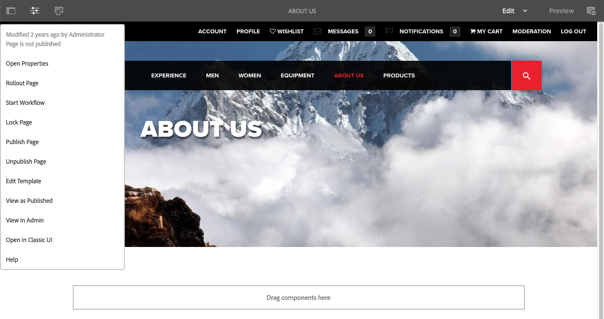

# Editor{#editor}

Por padrão, a capacidade de alternar para a interface clássica do editor foi desativada.

Para reativar a opção **Abrir na interface clássica** no **Informações da página** siga estas etapas.

1. Usando o CRXDE Lite, localize o seguinte nó:

   `/libs/wcm/core/content/editor/jcr:content/content/items/content/header/items/headerbar/items/pageinfopopover/items/list/items/classicui`

   Por exemplo

   ` [https://localhost:4502/crx/de/index.jsp#/libs/wcm/core/content/editor/jcr%3Acontent/content/items/content/header/items/headerbar/items/pageinfopopover/items/list/items/classicui](https://localhost:4502/crx/de/index.jsp#/libs/wcm/core/content/editor/jcr%3Acontent/content/items/content/header/items/headerbar/items/pageinfopopover/items/list/items/classicui)`

1. Criar uma sobreposição usando o **Sobrepor nó** opção; por exemplo:

   * **Caminho**: `/apps/wcm/core/content/editor/jcr:content/content/items/content/header/items/headerbar/items/pageinfopopover/items/list/items/classicui`
   * **Local de sobreposição**: `/apps/`
   * **Corresponder tipos de nós**: ativo (marque a caixa de seleção)

1. Adicione a seguinte propriedade de texto de vários valores ao nó sobreposto:

   `sling:hideProperties = ["granite:hidden"]`

1. A variável **Abrir na interface clássica** está novamente disponível na **Informações da página** ao editar páginas.

   
