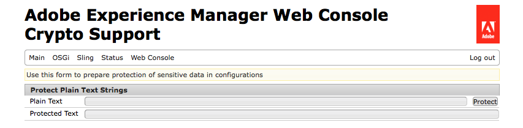

# Suporte a criptografia para propriedades de configuração{#encryption-support-for-configuration-properties}

## Visão geral {#overview}

Esse recurso permite que todas as propriedades de configuração do OSGi sejam armazenadas em um formulário criptografado protegido em vez de limpar texto. O formulário na interface do usuário do console da Web é usado para criar texto criptografado a partir do texto limpo usando a chave principal de criptografia do sistema inteiro.

O suporte ao plug-in de configuração OSGi foi adicionado para descriptografar a propriedade antes de ela ser usada por um serviço.

>[!NOTE]
>
>Os serviços que esperam um valor criptografado precisam usar a verificação IsProtected para ver se o valor está criptografado antes de tentar descriptografá-lo, pois ele já pode ter sido descriptografado.

## Ativação do suporte a criptografia {#enabling-encryption-support}

Essas etapas mostram como criptografar a senha SMTP para o serviço de email. Você pode concluir essas etapas para uma propriedade OSGI que deseja criptografar.

1. Vá para o Console da Web AEM em *https://&lt;serveraddress>:&lt;serverport>/system/console/configMgr*
1. No canto superior esquerdo, vá para **Principal - Suporte de criptografia**

   

1. A página **Adobe Experience Manager Web Console Crypto Support** é exibida.

   

1. No campo **Plain Text**, insira o texto dos dados confidenciais que deseja proteger.
1. Selecione **Protect**. O texto protegido é exibido como texto criptografado.

   

1. Copie o texto protegido da etapa 5 e cole-o no valor do formulário OSGI. Neste exemplo, a **senha SMTP criptografada** é adicionada ao *Day CQ Mail Service*.

   

1. Salve as propriedades do Day CQ Mail Service. A senha SMTP agora será enviada como um valor criptografado.

## Suporte para descriptografia {#decryption-support}

AEM agora fornece um plug-in de configuração para descriptografar propriedades de configuração. Este plug-in AEM descriptografará e recuperará automaticamente as propriedades de texto limpo.
