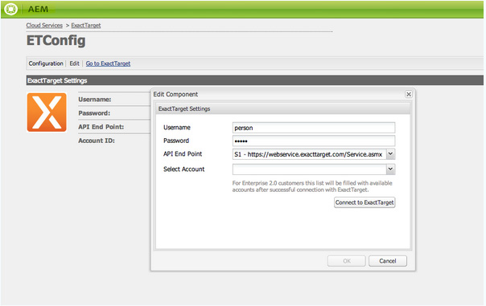

# Integração com ExactTarget{#integrating-with-exacttarget}

Integrar AEM com o Público alvo Exato permite gerenciar e enviar emails criados no AEM por meio do Público alvo Exato. Também permite usar os recursos de gerenciamento de lead do Público alvo Exato por meio de formulários AEM em páginas AEM.

A integração oferece os seguintes recursos:

* A capacidade de criar e-mails em AEM e publicá-los no Público alvo Exato para distribuição.
* A capacidade de definir uma ação de um formulário AEM para criar um assinante Exato do Público alvo.

Depois que o ExactTarget for configurado, você poderá publicar boletins informativos ou emails no ExactTarget. Consulte [Publicar Newsletters em um serviço de e-mail](/help/sites-authoring/personalization.md).

## Criando uma Configuração ExactTarget {#creating-an-exacttarget-configuration}

As configurações ExactTarget podem ser adicionadas por meio dos serviços Cloudservices ou das Ferramentas. Ambos os métodos estão descritos nesta seção.

### Configuração do ExactTarget via Cloudservices {#configuring-exacttarget-via-cloudservices}

Para criar uma configuração ExactTarget em Cloud Services:

1. Na página de boas-vindas, clique em **Cloud Services**. (Ou acesse diretamente em `https://<hostname>:<port>/etc/cloudservices.html`.)
1. Clique em **ExactTarget** e **Configurar**. A janela de configuração ExactTarget é aberta.

   

1. Insira um título e, opcionalmente, um nome e clique em **Criar**. A janela de configuração **ExactTarget Settings** é aberta.

   

1. Digite o nome de usuário, a senha e selecione um ponto de extremidade da API (por exemplo, **https://webservice.exacttarget.com/Service.asmx**).
1. Clique em **Conectar-se ao ExactTarget.** Quando você se conectou com êxito, verá uma caixa de diálogo de sucesso. Clique em **OK** para sair da janela.

   

1. Selecione uma conta, se disponível. A conta é para clientes do Enterprise 2.0. Clique em **OK**.

   ExactTarget foi configurado. Você pode editar a configuração clicando em **Editar**. Você pode acessar o ExactTarget clicando em **Ir para ExactTarget**.

1. AEM agora fornece um recurso de Extensão de dados. É possível importar colunas de extensão de dados ExactTarget. Isso pode ser configurado clicando no sinal &quot;+&quot; que aparece além de ter criado com êxito a configuração ExactTarget. Qualquer extensão de dados existente pode ser selecionada na lista suspensa. Para obter mais informações sobre como configurar extensões de dados, consulte [Documentação do ExactTarget](https://help.exacttarget.com/en/documentation/exacttarget/subscribers/data_extensions_and_data_relationships).

   Colunas de extensão de dados importadas podem ser usadas posteriormente por meio do componente **Texto e Personalização**.

   

### Configurando o ExactTarget por meio das Ferramentas {#configuring-exacttarget-via-tools}

Para criar uma configuração ExactTarget em Ferramentas:

1. Na página de boas-vindas, clique em **Ferramentas**. Ou navegue diretamente para lá indo para `https://<hostname>:<port>/misadmin#/etc`.
1. Selecione **Ferramentas**, em seguida **Configurações de Cloud Services,** em seguida **ExactTarget**.
1. Clique em **Novo** para abrir a janela **Criar página **i.

   

1. Digite o **Título** e opcionalmente o **Nome** e clique em **Criar**.
1. Digite as informações de configuração conforme descrito na etapa 4 do procedimento anterior. Siga esse procedimento para concluir a configuração do ExactTarget.

### Adicionar várias configurações {#adding-multiple-configurations}

Para adicionar várias configurações:

1. Na página de boas-vindas, clique em **Cloud Services** e em **ExactTarget**. Clique no botão **Mostrar configurações** que será exibido se uma ou mais configurações ExactTarget estiverem disponíveis. Todas as configurações disponíveis são listadas.
1. Clique no sinal de **+** ao lado de Configurações disponíveis. Isso abre a janela **Criar configurações**. Siga o procedimento de configuração anterior para criar uma nova configuração.