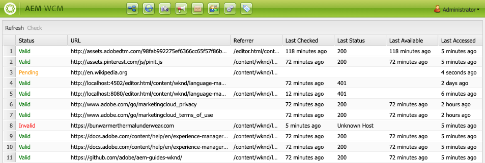

# O Verificador de links {#the-link-checker}

Os autores de conteúdo não devem se preocupar em validar cada link incluído em suas páginas de conteúdo.

O Verificador de links é executado para auxiliar automaticamente os autores de conteúdo com seus links, incluindo:

* Validação de links à medida que são adicionados ao conteúdo
* Mostrando uma lista de todos os links externos no conteúdo
* Execução de transformações de link

O Verificador de links tem várias [opções de configuração](#configuring), como definir a validação interna, permitir que certos links ou padrões de links sejam omitidos da validação e regravar regras de regravação de links.

O Verificador de links valida [links internos](#internal) e [links externos.](#external)

>[!NOTE]
>
>Como o Verificador de links verifica os links de cada página de conteúdo, o Verificador de links pode afetar o desempenho em repositórios grandes. Nesses casos, pode ser necessário [configurar a frequência com que o Verificador de links executa](#configuring) ou [desativá-lo.](#disabling)

## Verificação de link interno {#internal}

Links internos são links para outro conteúdo no repositório AEM. Os links internos podem ser adicionados usando o seletor de caminho no RTE ou usando um componente personalizado. Por exemplo:

* Sua página `/content/wknd/us/en/adventures/ski-touring.html`
* Contém um link para `/content/wknd/us/en/adventures/extreme-ironing.html` em um [Componente de texto.](https://experienceleague.adobe.com/docs/experience-manager-core-components/using/components/text.html)

Os links internos são validados assim que o autor do conteúdo adiciona links internos a uma página. Se o link se tornar inválido:

* Ele é removido do editor. O texto do link permanece, mas o link em si é removido.
* É mostrado como um link quebrado na interface de criação.

## Verificação de link externo {#external}

Links externos são links para conteúdo fora do repositório AEM. Os links externos podem ser adicionados usando o RTE ou um componente personalizado. Por exemplo:

* Sua página `/content/wknd/us/en/adventures/ski-touring.html`
* Contém um link para `https://bunwarmerthermalunderwear.com` em um [Componente de texto.](https://experienceleague.adobe.com/docs/experience-manager-core-components/using/components/text.html)

Links externos são validados para sintaxe e verificando sua disponibilidade. Esta verificação é feita de forma assíncrona em um interno configurável. Se o Verificador de links localizar um link externo inválido:

* Ele é removido do editor. O texto do link permanece, mas o link em si é removido.
* É mostrado como um link quebrado na interface de criação.

Além disso, a interface [Verificador de links externos](#external-link-checker) fornece uma visão geral de todos os links externos em suas páginas de conteúdo.

### Usando o Verificador de links externos {#external-link-checker}

Para usar o Verificador de links externos:

1. Usando **Navegação**, selecione **Ferramentas** e, em seguida, **Sites**.
1. Selecione **Verificador de links externos** e uma lista de todos os links externos será exibida.

As seguintes informações são exibidas:

* **Status**  - O status de validação do link
   * **Válido**  - o link externo pode ser acessado pelo Verificador de links
   * **Pendente**  - o link externo foi adicionado ao conteúdo do site, mas ainda não foi validado pelo Verificador de links
   * **Inválido**  - o link externo não pode ser alcançado pelo Verificador de links.
* **URL**  - O link externo
* **Quem indicou**  - A página de conteúdo que contém o link externo
   * Isso só é preenchido [se configurado.](#configuring)
* **Última verificação**  - A última vez que o Verificador de links validou o link externo
   * Com que frequência os links são marcados [é configurável.](#configuring)
* **Último status**  - O último código de status HTML retornado quando o link marcado pela última vez verificou o link externo
* **Última Disponível**  - Tempo desde que o link foi disponibilizado pela última vez para o Verificador de links
* **Última hora de acesso**  desde que o link foi acessado pela última vez pelo Verificador de links

É possível manipular o conteúdo da janela usando os dois botões na parte superior da lista dos links:

* **Atualizar**  - Para atualizar o conteúdo da lista
* **Verificar**  - Para verificar um link externo individual selecionado na lista

### Como o verificador de links externos funciona {#how-it-works}

Embora fácil de usar, o Verificador de links externos depende de vários serviços e para entender como eles funcionam, é útil entender como [configurar o Verificador de links](#configuring) para atender às suas necessidades.

1. Sempre que um autor de conteúdo salva qualquer link para uma página, um manipulador de eventos é acionado.
1. O manipulador de eventos atravessa todo o conteúdo em `/content` e verifica se há links novos ou atualizados e os adiciona a um cache do Verificador de links.
1. O **Day CQ Link Checker Service** é executado em um agendamento regular para verificar se há sintaxe válida nas entradas no cache.
1. Os links validados pela sintaxe são exibidos na janela [Verificador de links externos](#external-link-checker). No entanto, eles estarão em um estado **Pendente**.
1. A GET **Verificador de links do Day CQ** é executada regularmente para validar os links.
1. A GET **Verificador de links do Day CQ** atualiza as entradas na janela Verificador de links externos com os resultados das chamadas.

## Configuração do Verificador de links {#configuring}

O Verificador de links está disponível automaticamente e pronto para uso no AEM. No entanto, há várias configurações OSGi que podem ser modificadas para alterar seu comportamento:

* **Serviço**  de Armazenamento de Informações do Verificador de Link do Day CQ - Esse serviço define o tamanho do cache do Verificador de Link no repositório.
* **Serviço**  Verificador de links CQ de dia - Este serviço realiza uma verificação assíncrona da sintaxe de links externos. Você pode definir o período de verificação e quais tipos de links são ignorados pelo verificador entre outras opções.
* **Tarefa**  do Verificador de links do Day CQ - Este serviço realiza a validação de GET de links externos. Ela permite definições separadas de intervalos para verificar links ruins e bons entre outras opções.
* **Transformador**  do verificador de links do Day CQ - permite a conversão de links com base em um conjunto de regras definido pelo usuário.

Consulte o documento [Configurações do OSGi](/help/sites-deploying/osgi-configuration-settings.md) para obter mais detalhes sobre como alterar as configurações do OSGi.

## Desabilitando o Verificador de links {#disabling}

Você pode optar por desativar totalmente o Verificador de links. Para isso:

1. Abra o console do OSGi.
1. Edite o **Transformador do Verificador de Link do Day CQ**
1. Marque as opções que deseja desativar:
   * **Desativar verificação**  - para desativar a validação de links
   * **Desabilitar regravação**  - para desabilitar transformações de link

>[!NOTE]
>
>Se você desativar a verificação de links após começar a criar o conteúdo, ainda poderá ver entradas na [janela Verificador de links externos](#external-link-checker), mas elas não serão mais atualizadas.
