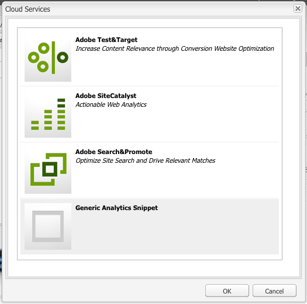

# Analytics com provedores externos {#analytics-with-external-providers}

O Analytics pode fornecer informações importantes e interessantes sobre como seu site está sendo usado.

Várias configurações prontas para uso estão disponíveis para integração com o serviço apropriado, por exemplo:

* [Adobe Analytics](/help/sites-administering/adobeanalytics.md)
* [Adobe Target](/help/sites-administering/target.md)

Você também pode configurar sua própria instância do **Trechos de análise genéricos** para definir novas configurações de serviço.

As informações são então coletadas por meio de pequenos trechos de código que são adicionados às páginas da web. Por exemplo:

>[!CAUTION]
>
>Os scripts não devem estar entre `script` específicos.

```
var _gaq = _gaq || [];
_gaq.push(['_setAccount', 'UA-XXXXX-X']);
_gaq.push(['_trackPageview']);

(function() {
    var ga = document.createElement('script'); ga.type = 'text/javascript'; ga.async = true;
    ga.src = ('https:' == document.location.protocol ? 'https://ssl' : 'https://www') + '.google-analytics.com/ga.js';
    var s = document.getElementsByTagName('script')[0]; s.parentNode.insertBefore(ga, s);
})();
```

Esses snippets permitem que os dados sejam coletados e os relatórios gerados. Os dados reais coletados dependem do provedor e do trecho de código real usado. As estatísticas de exemplo incluem:

* quantos visitantes ao longo do tempo
* quantas páginas visitadas
* termos de pesquisa usados
* landing pages

>[!CAUTION]
>
>O site de demonstração Geometrixx-Outdoors é configurado de modo que os atributos fornecidos nas Propriedades da página sejam anexados ao código fonte html (logo acima da tag `</html>` endtag) no correspondente `js` script.
>
>Se o seu `/apps` não herdar do componente de página padrão ( `/libs/foundation/components/page`) você (ou seus desenvolvedores) devem se certificar de que as tags `js` scripts são incluídos, por exemplo, incluindo `cq/cloudserviceconfigs/components/servicescomponents`ou utilizando um mecanismo semelhante.
>
>Sem isso, nenhum dos serviços (Genérico, Analytics, Target etc.) funcionará.

## Criação de um novo serviço com um trecho genérico {#creating-a-new-service-with-a-generic-snippet}

Para a configuração básica:

1. Abra o **Ferramentas** console.
1. No painel esquerdo, expanda **Configurações do Cloud Services**.
1. Clique duas vezes em **Fragmento da análise genérica** para abrir a página:

   

1. Clique no + para adicionar uma nova configuração usando a caixa de diálogo; no mínimo, atribua um nome, por exemplo google analytics:

   

1. Clique em **Criar**, a caixa de diálogo de trecho será aberta imediatamente - cole o trecho javascript apropriado no campo:

   

1. Clique em **OK** para salvar.

## Usar seu novo serviço nas páginas {#using-your-new-service-on-pages}

Após criar a configuração do serviço, agora é necessário configurar as páginas necessárias para usá-lo:

1. Navegue até a página.
1. Abra o **Propriedades da página** no sidekick, depois o **Cloud Services** guia.
1. Clique em **Adicionar serviço** e selecione o serviço necessário; por exemplo, o **Fragmento da análise genérica**:

   

1. Clique em **OK** para salvar.
1. Você será redirecionado para a **Cloud Services** guia. A variável **Fragmento da análise genérica** agora está listado com a mensagem `Configuration reference missing`. Use a lista suspensa para selecionar sua instância de serviço específica; por exemplo, google-analytics:

   

1. Clique em **OK** para salvar.

   O trecho agora poderá ser visto se você exibir a Origem da página para a página.

   Após um período de tempo adequado, você poderá exibir as estatísticas coletadas.

   >[!NOTE]
   >
   >Se a configuração for anexada a uma página que tem páginas secundárias, o serviço também será herdado por elas.
