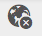
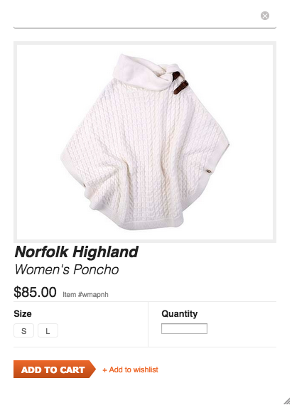
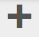

# Administração de eCommerce genérico {#administering-generic-ecommerce}

A solução genérica AEM fornece métodos de gerenciamento das informações comerciais armazenadas no repositório (em vez de usar um mecanismo externo de comércio eletrônico). Isso inclui:

* [Produtos](/help/sites-administering/concepts.md#products)
* [Variantes do produto](/help/sites-administering/concepts.md#product-variants)
* [Catálogo(s)](/help/sites-administering/concepts.md#catalogs)
* [Promoções](/help/sites-administering/concepts.md#promotions)
* [Vouchers](/help/sites-administering/concepts.md#vouchers)
* [Pedidos](/help/sites-administering/concepts.md#shopping-cart-and-orders)
* [Páginas de proxy](/help/sites-administering/concepts.md#proxy-pages)

>[!NOTE]
>
>A instalação de AEM padrão inclui a implementação de eCommerce AEM genérico (JCR).
>
>Atualmente, isso se destina a fins de demonstração ou como base básica para uma implementação personalizada de acordo com suas necessidades.

## Produtos e variações do produto {#products-and-product-variations}

>[!NOTE]
>
>Os procedimentos a seguir se aplicam a Produtos e Variações de Produto.

Antes de criar produtos, é necessário definir um [suporte](/help/sites-authoring/scaffolding.md). Isso especifica os campos necessários para definir os produtos e como eles são editados.

É necessário um suporte para cada tipo de produto distinto. O suporte apropriado está associado aos produtos:

* path
* o produto pode fazer referência ao suporte

>[!NOTE]
>
>A loja Geometrixx-Outdoors tem um único tipo de produto (e, portanto, um único suporte):
>
>`/etc/scaffolding/geometrixx-outdoors`
>
>O tipo de produto Geometrixx-Outdoors está ativo em:
>
>`/etc/commerce/products/geometrixx-outdoors`
>
>Você pode criar uma nova definição de produto em qualquer lugar sob ela, sem nenhuma configuração adicional.

### Importing Products {#importing-products}

#### Importar produtos - IU otimizada ao toque {#importing-products-touch-optimized-ui}

1. Navegue até o console **Produtos** , via **Comércio**.
1. Usando o console **Produtos** , navegue até o local desejado.
1. Use o ícone **Importar produtos** para abrir o assistente.

   

1. Especifique:

   * **Importador**

      O importador do provedor [de](/help/sites-administering/concepts.md#commerce-providers)comércio específico, por padrão `Geometrixx`.

   * **Fonte**

      O arquivo que você deseja importar; você pode usar o navegador para selecionar um arquivo.

   * **Importação incremental**

      Indique se esta é uma importação incremental (em vez de completa).
   >[!NOTE]
   >
   >A importação incremental (do importador externo da amostra geometrixx) opera a nível do produto.
   >
   >Um importador personalizado pode ser definido para operar conforme necessário.

1. Selecione **Avançar** para importar os produtos, um log das ações realizadas será exibido.

   >[!NOTE]
   >
   >Os produtos serão importados para o local atual ou serão relativos a ele.

   >[!NOTE]
   >
   >O uso repetido de **Próximo** e **Voltar** importará repetidamente as definições do produto. No entanto, como eles têm os mesmos SKUs, as informações existentes no repositório serão simplesmente substituídas.

1. Selecione **Concluído** para fechar o assistente.

#### Importar produtos - IU clássica {#importing-products-classic-ui}

1. Usando o console **Ferramentas** , abra a pasta **Comércio** .
1. Clique no duplo para abrir o Importador **** do produto:

   

1. Especifique:

   * **Armazenar nome**

      Os produtos serão importados para:

      `/etc/commerce/products/<*store name*>/`

   * **Provedor de comércio**

      O importador do seu provedor [de](/help/sites-administering/concepts.md#commerce-providers)comércio; por padrão.

   * **Arquivo de origem**

      O local no repositório do arquivo que você deseja importar.

   * **Importação incremental**

      Indique se esta é uma importação incremental (em vez de completa).

1. Clique em **Importar produtos**.

### Criando informações sobre produtos {#creating-product-information}

>[!NOTE]
>
>O gerenciamento de produtos padrão é básico, pois o conjunto de produtos Geometrixx-Outdoors foi mantido básico. A complexidade é baseada no [andaime](/help/sites-authoring/scaffolding.md)do produto, de modo que, com o andaime do seu próprio produto, é possível obter uma edição mais sofisticada.

#### Criar informações do produto - IU otimizada ao toque {#creating-product-information-touch-optimized-ui}

1. Usando o console **Produtos** (via **Comércio**), navegue até o local desejado.
1. Use o ícone **Criar** para selecionar (dependendo da estrutura e do local):

   * **Criar produto**
   * **Criar variação de produto**

   

1. O assistente abrirá. Use as guias **Básico** e **Produto** para inserir os atributos [do](/help/sites-administering/concepts.md#product-attributes) produto para o novo produto ou variante do produto.

   >[!NOTE]
   >
   >**Título** e **SKU** são os mínimos necessários para criar um produto ou uma variante.

1. Selecione **Criar** para salvar as informações.

>[!NOTE]
>
>Muitos produtos são oferecidos em várias cores e/ou tamanhos. As informações sobre o produto básico e as variantes de produto relacionadas podem ser gerenciadas no console **Produtos** .
>
>Os produtos e suas variantes são armazenados como uma estrutura em árvore, as informações do produto ficam na parte superior, com as variantes abaixo (essa estrutura é imposta pela interface do usuário).

### Editar informações do produto {#editing-product-information}

>[!NOTE]
>
>As imagens de produtos no geometrixx-outdoors são fornecidas de:
>
>`/etc/commerce/products/...`
>
>Isso significa que, por padrão, eles são bloqueados pelo [dispatcher](https://helpx.adobe.com/experience-manager/dispatcher/using/dispatcher-configuration.html), portanto, configure-os conforme necessário.

#### Editar informações do produto - IU otimizada ao toque {#editing-product-information-touch-optimized-ui}

1. Usando o console **Produtos** (via **Comércio**), navegue até suas informações do produto.
1. Usar:

   * [ações rápidas](/help/sites-authoring/basic-handling.md#quick-actions)
   * [modo de seleção](/help/sites-authoring/basic-handling.md#navigating-and-selection-mode)

   Selecione o ícone Dados **do produto de** Visualização:

   

1. Os atributos [do](/help/sites-administering/concepts.md#product-attributes) produto serão exibidos. Use **Editar** e **Concluído** para fazer quaisquer alterações.

### Mostrando referências de produtos {#showing-product-references}

#### Showing Product References - Touch-optimized UI {#showing-product-references-touch-optimized-ui}

1. Usando o console **Produtos** (via **Comércio**), navegue até suas informações do produto.
1. Abra o trilho secundário para Referências com o ícone:

   

1. Selecione o produto desejado - o trilho secundário será atualizado para mostrar os tipos de referência disponíveis:

   

1. Clique/toque no tipo de referência (por exemplo, Páginas de produto) para expandir a lista.
1. Selecione uma referência específica para mostrar as opções:

   * Navegar até a página do produto
   * Editar página do produto

   

### Search for Products {#search-for-products}

1. Navegue até o console **Produtos** , via **Comércio**.
1. Abra o trilho secundário para Pesquisa com o ícone:

   

1. Várias facetas estão disponíveis para você procurar produtos. Você pode usar apenas uma ou várias facetas para uma pesquisa. Os produtos encontrados serão exibidos:

   

1. Clicar/tocar em um produto o abre. Você também pode publicá-lo ou visualização os dados do produto.

#### Extensão da pesquisa {#extending-search}

Você pode modificar uma faceta existente ou adicionar novas, usando CRXDE Lite:

1. Vá até:

   `http://localhost:4502/crx/de/index.jsp#/libs/commerce/gui/content/products/aside/items/search/items/searchpanel/facets`

1. Você pode modificar, por exemplo, os tamanhos que aparecerão na página de pesquisa do produto. Clique no `sizegroup` nó.
1. Clique em `items` node (Nó) e, em seguida, clique em `propertypredicate` node (Nó).
1. Você pode modificar o `propertyValues`. Por exemplo, você pode adicionar XS, ou XXL, ou remover um tamanho.
1. Clique em **Salvar tudo** e navegue até a página de pesquisa de produtos. Suas alterações devem ser exibidas.

### Vários ativos {#multiple-assets}

Você pode adicionar vários ativos no componente do produto e, em seguida, especificar o ativo que aparecerá na página do produto.

>[!NOTE]
>
>Tudo relacionado a vários ativos é feito com a interface otimizada ao toque.

#### Adicionar vários ativos {#adding-multiple-assets}

1. Navegue até o console **Produtos** , via **Comércio**.
1. Usando o console **Produtos** , navegue até o produto desejado.

   >[!NOTE]
   >
   >Você tem que estar no nível do produto, não no nível da variante.

1. Toque/clique no ícone Dados **do produto de** Visualização com o modo de seleção ou ações rápidas.
1. Toque/clique no ícone Editar.
1. Role até **Adicionar**.

   

1. Toque/clique em **Adicionar**. Um novo espaço reservado para ativos é exibido.
1. Tocar/clicar em **Alterar **abre uma caixa de diálogo que permite escolher um ativo.
1. Selecione o ativo que deseja adicionar.

   >[!NOTE]
   >
   >Os ativos que você pode selecionar são de [Ativos](https://helpx.adobe.com/experience-manager/aem-previous-versions.html#assets).

1. Toque/clique no ícone Concluído.

Dois ativos agora são armazenados no componente do produto. Você pode configurar qual aparecerá na página do produto. Isso funciona com um sistema de categoria. Primeiro, é necessário adicionar uma categoria aos ativos individuais:

1. Toque/clique em Dados **de produto de** Visualização.
1. Digite uma Categoria **de** ativo nos ativos, por exemplo `cat1` e `cat2`.

   >[!NOTE]
   >
   >Você também pode usar tags para categoria.

1. Toque/clique no ícone Concluído. Agora é necessário [implementar](#rolling-out-a-catalog) as alterações.

Agora seus ativos no componente do produto têm uma categoria. Você pode configurar qual categoria será exibida em três níveis diferentes:

* [Página do Produto](#product-page)
* [Catálogo](#catalog)
* [Console de produtos](#products-console)

>[!NOTE]
>
>Se você não definir categorias, o primeiro ativo será exibido na página do produto.

O mecanismo para selecionar a imagem a ser exibida é o seguinte:

1. Verifique se uma categoria está definida para a Página do produto.
1. Caso contrário, verifique se uma categoria está definida para o catálogo.
1. Caso contrário, verifique se uma categoria está definida para o console Produtos.

>[!NOTE]
>
>Para o nível do Catálogo e do Console de produtos, é necessário implementar as alterações para aplicar as modificações e ver a diferença na página do produto.

#### Página do Produto {#product-page}

1. Navegue até a página do produto.
1. **Edite** o componente do produto.
1. Digite a Categoria **de** imagem escolhida ( `cat1` por exemplo).
1. Toque/clique em **Concluído**. A página é atualizada e o ativo correto deve ser exibido.

#### Catálogo  {#catalog}

1. Navegue até o catálogo.
1. Toque/clique em Propriedades **da** Visualização.
1. Tap/click **Edit**.
1. Toque/clique na guia **Ativos** .
1. Digite a Categoria **de ativos do** produto necessária.
1. Toque/clique em **Concluído**.
1. [Implantar](#rolling-out-a-catalog) suas alterações.

#### Console de produtos {#products-console}

1. Usando o console **Produtos** , navegue até o Produto desejado.
1. Toque/clique em Dados **de produto de** Visualização.
1. Tap/click **Edit**.
1. Digite uma Categoria **** de ativo padrão.
1. Toque/clique em **Concluído**.
1. [Implantar](#rolling-out-a-catalog) suas alterações.

### Publicar/Desfazer publicação de informações sobre o produto {#publishing-unpublishing-product-information}

#### Publicar/Desfazer publicação de informações do produto - IU otimizada ao toque {#publishing-unpublishing-product-information-touch-optimized-ui}

>[!NOTE]
>
>Muitas vezes, as informações do produto são publicadas pelas páginas que fazem referência a elas. Por exemplo, ao publicar a página X que faz referência ao produto Y, AEM perguntará se você também deseja publicar o produto Y.
>
>Para casos especiais, AEM também oferece suporte à publicação direta dos dados do produto.

1. Usando o console **Produtos** (via **Comércio**), navegue até suas informações do produto.
1. Usar:

   * [ações rápidas](/help/sites-authoring/basic-handling.md#quick-actions)
   * [modo de seleção](/help/sites-authoring/basic-handling.md#navigating-and-selection-mode)

   Selecione o ícone **Publicar** ou **Cancelar publicação** , conforme necessário:

    

   As informações sobre o produto serão publicadas ou não serão publicadas, conforme apropriado.

### Product Feed {#product-feed}

A integração de Search &amp; Promote permite:

* use a API eCommerce, independentemente da estrutura do repositório subjacente e da plataforma de comércio.
* aproveite o recurso Conector de índice do Search &amp; Promote para fornecer um feed de produto no formato XML.
* aproveitar o recurso de Controle remoto do Search &amp; Promote para executar solicitações sob demanda ou programadas do feed do produto
* geração de feed para diferentes contas de Search &amp; Promote, configurada como configurações de serviços em nuvem.

Para obter mais informações, leia Feed [do](/help/sites-administering/product-feed.md)produto.

### Manipulador de eventos para atualizações de produtos {#event-handler-for-product-updates}

Há um Manipulador de Eventos que registra um evento quando um produto é adicionado, modificado ou excluído e quando uma página de produto é adicionada, modificada ou excluída. Há os seguintes eventos OSGi:

* `com/adobe/cq/commerce/pim/PRODUCT_ADDED`
* `com/adobe/cq/commerce/pim/PRODUCT_MODIFIED`
* `com/adobe/cq/commerce/pim/PRODUCT_DELETED`
* `com/adobe/cq/commerce/pim/PRODUCT_PAGE_ADDED`
* `com/adobe/cq/commerce/pim/PRODUCT_PAGE_MODIFIED`
* `com/adobe/cq/commerce/pim/PRODUCT_PAGE_DELETED`

Para os `PRODUCT_*` eventos, o caminho aponta para o produto base em `/etc/commerce/products`. Para os `PRODUCT_PAGE_*` eventos, o caminho aponta para o `cq:Page` nó.

Você pode observá-los no Console da Web em eventos OSGI ( `/system/console/events`), por exemplo:

>[!NOTE]
>
>Leia também a manipulação de [Eventos no AEM](https://blogs.adobe.com/experiencedelivers/experience-management/event_handling_incq/). 

### Imagem com Links para adicionar ao carrinho {#image-with-add-to-cart-links}

O componente Imagem com Adicionar ao carrinho permite que você adicione rapidamente um produto ao carrinho criando um ponto de conexão vinculado a um produto em uma imagem.

Clicar no ponto de acesso abre uma caixa de diálogo que permite escolher o tamanho e a quantidade do produto.

1. Navegue até a página onde deseja adicionar o componente.
1. Arraste e solte o componente na página.
1. Arraste e solte uma imagem no componente do navegador de [ativos](/help/sites-authoring/author-environment-tools.md#assets-browser).
1. Você pode:

   * clique no componente e, em seguida, clique no ícone Editar
   * faça um clique lento no duplo

1. Clique no ícone de tela cheia.

   

1. Clique no ícone do Mapa de lançamento.

   

1. Clique em um dos ícones de forma.

   

1. Modifique e mova a forma conforme necessário.
1. Clique na forma.
1. Clicar no ícone Procurar abre o Seletor [de ativos](../assets/search-assets.md#assetpicker).

   >[!NOTE]
   >
   >Como alternativa, você pode digitar diretamente o caminho do produto que deve estar no nível do produto, não no nível da variante.

   

1. Clique duas vezes no ícone de confirmação e clique em sair da tela cheia.
1. Clique em algum lugar na página ao lado do componente. A página deve ser atualizada e você deve ver o seguinte símbolo na imagem:

   

1. Switch to [preview](/help/sites-authoring/editing-content.md#previewingpagestouchoptimizedui) mode.
1. Clique no ponto de conexão +. Uma caixa de diálogo é aberta onde você pode escolher o tamanho e a quantidade do produto inserido no **Caminho**.

   

1. Insira um tamanho e uma quantidade.
1. Clique no botão Adicionar ao carrinho. A caixa de diálogo é fechada.
1. Navegue até o carrinho. O produto deve estar aqui.

#### Configuration Options {#configuration-options}

Você pode configurar a aparência da caixa de diálogo ao clicar no ponto de acesso:

1. Clique no componente e no ícone de configuração.

   

1. Rolar para baixo. Há uma guia **ADICIONAR AO CARRINHO** .

   

1. Clique em **ADICIONAR AO CARRINHO**. Existem três opções de configuração que você pode usar.

   

1. Clique no ícone Concluído.

## Catálogos {#catalogs}

### Gerando um catálogo {#generating-a-catalog}

#### Geração de um catálogo - IU otimizada ao toque {#generating-a-catalog-touch-optimized-ui}

>[!NOTE]
>
>O catálogo fará referência aos seus dados do produto.

Para gerar um catálogo:

1. Abra o console Sites (por exemplo, [http://localhost:4502/sites.html/content](http://localhost:4502/sites.html/content)).
1. Navegue até o local onde deseja criar a nova página.
1. Para abrir a lista de opções, use o ícone **Criar**:

   

1. From the list select **Create Catalog**, the Create Catalog wizard will open.

   

1. Navegue até o Blueprint do catálogo necessário.
1. Toque/clique no botão **Selecionar** e toque/clique no Catálogo desejado Blueprint.
1. Tap/click **Next**.

   

1. Digite um **Título** e um **Nome**.
1. Toque/clique no botão **Criar** . O catálogo é criado e uma caixa de diálogo é aberta.

   

1. Tocar/clicar no botão **Concluído** leva você de volta ao console Sites, onde você poderá ver seu catálogo.

   Tocar/clicar no botão **Abrir catálogo** abre seu catálogo (por exemplo `http://localhost:4502/editor.html/content/test-catalog.html`).

#### Geração de um catálogo - IU clássica {#generating-a-catalog-classic-ui}

>[!NOTE]
>
>O catálogo fará referência aos Dados do produto.

1. Usando o console **Sites** , navegue até seu **Catalog Blueprint** e depois o Base Catalog.

   Por exemplo:

   `http://localhost:4502/siteadmin#/content/catalogs/geometrixx-outdoors/base-catalog`

1. Crie uma nova página usando o modelo **Seção do Blueprint** .

   Por exemplo, `Swimwear`.

1. Abra a nova `Swimwear` página e clique em **Editar Blueprint** para abrir a caixa de diálogo **Propriedades** , onde você pode configurar a seleção **Produtos** .

   Por exemplo, abra o campo **Tags/Palavras-chave** para selecionar Atividade e, em seguida, Nadando na seção Geometrixx-Externo.

1. Clique em **OK** para salvar suas propriedades; os produtos de exemplo serão mostrados nos Critérios **de seleção de** produto na página do blueprint.
1. Clique em **Alterações de implantação...**, selecione a página **Rollout e todas as subpáginas**, em seguida, clique em **Avançar** e em **Rollout**. Quando a implementação for concluída com êxito, o indicador **Status** será mostrado como verde.
1. Agora você pode clicar em **Fechar** e verificar a nova seção do catálogo; por exemplo, on e under:

   `http://localhost:4502/cf#/content/geometrixx-outdoors/en/swimwear.html`

1. Novamente na página de blueprints, clique em **Editar Blueprint** e, na caixa de diálogo **Propriedades** , abra a guia Página **** gerada. No campo lista do banner, selecione a imagem que deseja mostrar; por exemplo, `summer.jpg`
1. Clique em **OK** para salvar suas propriedades; as informações do banner serão mostradas nos Critérios **de seleção de** produto na página do blueprint.
1. Implantar essas novas alterações.

### Desligando um catálogo {#rolling-out-a-catalog}

#### Distribuição de um catálogo - IU otimizada ao toque {#rolling-out-a-catalog-touch-optimized-ui}

Para implementar um catálogo:

1. Navegue até o console **Catálogos** , via **Comércio**.
1. Navegue até o catálogo que deseja implantar.
1. Usar:

   * [ações rápidas](/help/sites-authoring/basic-handling.md#quick-actions)
   * [modo de seleção](/help/sites-authoring/basic-handling.md#navigating-and-selection-mode)

   Selecione o ícone Alterações **de implantação** :

   

1. No assistente, defina a implementação conforme necessário e toque/clique em **Alterações** de implantação.
1. Uma caixa de diálogo é aberta. Toque/clique em **Concluído** quando o processo estiver concluído.

#### Distribuição de um catálogo - IU clássica {#rolling-out-a-catalog-classic-ui}

Para implementar um catálogo:

1. Navegue até o Catálogo que deseja implantar. Por exemplo:

   `http://localhost:4502/cf#/content/catalogs/geometrixx-outdoors/base-catalog.html`

1. Clique em **Alterações de implantação...**
1. Defina a implementação conforme necessário.
1. Clique em **Rollout**.

### Importador de Blueprint {#blueprint-importer}

#### Importador de Blueprint - IU otimizada ao toque {#blueprint-importer-touch-optimized-ui}

1. Navegue até o console **Catálogos** , via **Comércio**.
1. Navegue até o local onde deseja importar o diagrama do catálogo.
1. Toque/clique no ícone **Importar Blueprints** .

   

1. No assistente, selecione a Origem conforme necessário e toque/clique em **Avançar**.

   

1. Toque/clique em **Concluído** assim que a importação for concluída.

#### Importador do Blueprint - IU clássica {#blueprint-importer-classic-ui}

1. Usando o console **Ferramentas** , navegue até **Comércio**.

   Por exemplo:

   `http://localhost:4502/miscadmin#/etc/commerce`

1. Abra o Importador **Bluprint do** catálogo.
1. Defina a importação conforme necessário.
1. Clique em **Importar Esquemas** de Catálogo.

## Promoções {#promotions}

### Criação de uma promoção {#creating-a-promotion}

#### Criar uma promoção - IU clássica {#creating-a-promotion-classic-ui}

>[!NOTE]
>
>O exemplo a seguir trata de uma promoção realizada diretamente em uma [campanha](/help/sites-classic-ui-authoring/classic-personalization-campaigns.md), que é usada para comprovantes.
>
>Uma promoção também pode estar em uma [experiência](/help/sites-authoring/personalization.md) dentro de uma campanha.
>
>Para obter mais informações, consulte [Promoções e Vouchers](#promotions-and-vouchers).

1. Abra o console **Sites** da sua instância do autor.
1. No painel esquerdo, selecione a **Campanha** desejada.
1. Clique em **Novo**, selecione o modelo de **Promoção** e especifique um **Título** (e **Nome** , se necessário) para seu novo comprovante.
1. Clique em **Criar**. A nova página de promoção será exibida no painel direito.

1. Edite as **Propriedades** :

   * abrir a página e, em seguida, clicar no botão Editar para abrir a caixa de diálogo Propriedades
   * selecionando a página no console Sites e usando o menu de contexto (geralmente o botão direito do mouse) para selecionar **Propriedades...** e abrir a caixa de diálogo de propriedades

   Especifique o Tipo **de** promoção, o Tipo **de** desconto, o Valor **de** desconto e quaisquer outros campos, conforme necessário.

1. Clique em **OK** para salvar.

1. Agora você pode ativar sua promoção, para que os compradores a vejam na instância de publicação.

## Vouchers {#vouchers}

### Criação de um comprovante {#creating-a-voucher}

#### Criar um comprovante - IU clássica {#creating-a-voucher-classic-ui}

1. Abra o console **Sites** da sua instância do autor.
1. No painel esquerdo, selecione a **Campanha** desejada.
1. Clique em **Novo**, selecione o modelo **Comprovante** e especifique um **Título** (e **Nome** , se necessário) para seu novo comprovante.
1. Clique em **Criar**. A nova página de comprovante será exibida no painel direito.

1. Abra a nova página de comprovante com um clique de duplo e clique em **Editar** para configurar as informações conforme necessário.
1. Clique em **OK** para salvar.

1. Agora você pode ativar seu comprovante, para que os compradores possam usá-lo em seus carrinhos na instância de publicação.

### Remoção de Vouchers {#removing-vouchers}

#### Remoção de Vouchers - IU clássica {#removing-vouchers-classic-ui}

Para tornar um comprovante indisponível para os clientes, você pode:

* Desativar o comprovante - ele permanecerá disponível no ambiente do autor para que você possa reativá-lo posteriormente.
* Exclua-o completamente.

Ambas as ações podem ser realizadas no console **Sites** .

### Modificando Vouchers {#modifying-vouchers}

#### Modificação de Vouchers - IU clássica {#modifying-vouchers-classic-ui}

Para alterar as propriedades de um comprovante ou promoção, clique com o botão duplo no console **Sites** e clique em **Editar**. Depois de salvá-la, você deve ativá-la para que as alterações sejam encaminhadas para as instâncias de publicação.

### Adicionando vendedores a um carrinho {#adding-vouchers-to-a-cart}

Para permitir que os usuários adicionem vouchers aos seus carrinhos, você pode usar o componente **Vouchers** incorporado (categoria de Comércio). É necessário adicionar isso à mesma página em que o carrinho é exibido (mas não é obrigatório). O componente de comprovantes é apenas um formulário no qual o usuário pode digitar um código de comprovante, é o componente do carrinho de compras que realmente mostra a lista dos comprovantes aplicados e seu desconto.

No site de demonstração (Geometrixx Outdoors - Inglês) você pode ver o formulário de comprovante na página do carrinho, sob o carrinho de compras.

## Pedidos {#orders}

>[!NOTE]
>
>Convém lembrar que a AEM predefinida não tem ações necessárias para a funcionalidade padrão relacionada a pedidos, como devolução de mercadoria, atualização do status do pedido, realização, geração de guias de remessa. Ela é principalmente destinada como uma pré-visualização tecnológica.
>
>A gestão genérica das encomendas no AEM foi mantida como base; os campos disponíveis no assistente dependem do suporte:
>`/etc/scaffolding/geometrixx-outdoors/order/jcr:content/cq:dialog`
>
>Se você criar um suporte personalizado, poderá armazenar mais informações sobre o pedido.

>[!NOTE]
>
>O console de pedidos expõe as informações de pedido do fornecedor, que nunca são publicadas.
>
>As informações sobre o pedido do cliente são mantidas em seus diretórios domésticos e são expostas pelo Histórico do pedido para sua Conta. Essas informações são publicadas junto com o restante do diretório inicial.

### Criando Informações do Pedido {#creating-order-information}

#### Criação de informações do pedido - IU otimizada ao toque {#creating-order-information-touch-optimized-ui}

1. Usando o console **Pedidos** , navegue até o local desejado.
1. Use o ícone **Criar** para selecionar **Criar pedido**.

   

1. O assistente abrirá. Use as guias **Básico**, **Conteúdo**, **Pagamento** e **Preenchimento** para inserir as [informações sobre o novo pedido](/help/sites-administering/concepts.md#order-information).

1. Selecione **Criar** para salvar as informações.

### Editando informações do pedido {#editing-order-information}

#### Editar informações do pedido - IU otimizada ao toque {#editing-order-information-touch-optimized-ui}

1. Usando o console **Pedidos** , navegue até o pedido.
1. Usar:

   * [ações rápidas](/help/sites-authoring/basic-handling.md#quick-actions)
   * [modo de seleção](/help/sites-authoring/basic-handling.md#navigating-and-selection-mode)

   Selecione o ícone Dados **da Ordem de** Visualização:

   

1. As informações [do](/help/sites-administering/concepts.md#order-information) pedido serão exibidas. Use **Editar** e **Concluído** para fazer quaisquer alterações.

