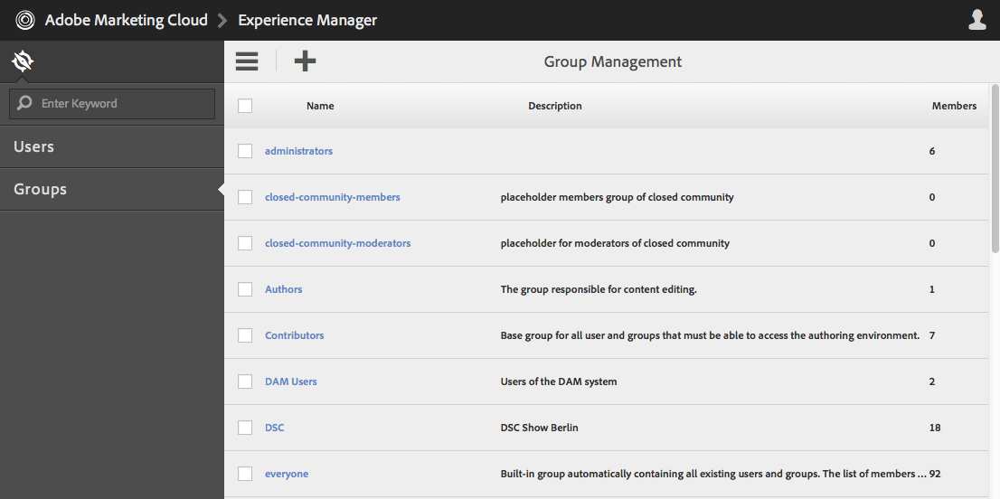

# Operações do Granite - Administração de usuários e grupos{#granite-operations-user-and-group-administration}

Como o Granite incorpora a implementação do Repositório CRX da Especificação da API JCR, ele tem sua própria administração de usuários e grupos.

Estas contas são a base subjacente da [Contas AEM](/help/sites-administering/security.md) e qualquer alteração de conta feita com a administração do Granite será refletida se/quando as contas forem acessadas do [AEM console Usuários](/help/sites-administering/security.md#accessing-user-administration-with-the-security-console) (por exemplo, `http://localhost:4502/useradmin`). No console Usuários do AEM, também é possível gerenciar os privilégios e outras AEM específicas.

Os consoles de administração de usuários e grupos do Granite estão disponíveis no **[Ferramentas](/help/sites-administering/tools-consoles.md)** console da interface otimizada para toque:

Como escolher **Usuários** ou **Grupos** no console Ferramentas , o console apropriado será aberto. Em ambos, você pode tomar uma ação usando a caixa de clique e, em seguida, as ações da barra de ferramentas ou abrindo os detalhes da conta através do link em **Nome**.

* [Administração do usuário](#user-administration)

   

   O **Usuários** listas de console:

   * o nome de usuário
   * o nome de logon do usuário (nome da conta)
   * qualquer título dado à conta

* [Administração de grupo](#group-administration)

   

   O **Grupos** listas de console:

   * o nome do grupo
   * a descrição do grupo
   * o número de usuários/grupos no grupo

## Administração do usuário {#user-administration}

### Adicionar um novo usuário {#adding-a-new-user}

1. Use o **Adicionar usuário** ícone :

   

1. O **Criar usuário** o formulário será aberto:

   

   Aqui você pode inserir os detalhes do usuário para a conta (a maioria é padrão e autoexplicativa):

   * **ID**

      Essa é a identificação exclusiva da conta de usuário. É obrigatório e não pode conter espaços.

   * **Endereço de email**
   * **Senha**

      Uma senha é obrigatória.

   * **Digite a senha novamente**

      Isso é obrigatório, pois é necessário para a confirmação da senha.

   * **Nome**
   * **Sobrenome**
   * **Número de telefone**
   * **Cargo**
   * **Rua**
   * **Móvel**
   * **Cidade**
   * **Código postal**
   * **País**
   * **Estado**
   * **Título**
   * **Sexo**
   * **Sobre**
   * **Configurações da conta**

      * **Status**
Você pode sinalizar a conta como 
**ative** ou **inativo**.
   * **Foto**

      Aqui você pode fazer upload de uma foto para usar como avatar.

      Tipos de arquivo aceitos: `.jpg .png .tif .gif`

      Tamanho preferencial: `240x240px`

   * **Adicionar usuário aos grupos**

      Use o menu suspenso de seleção para selecionar grupos dos quais o usuário deve ser membro. Depois de selecionado, use a **X** pelo nome a ser desmarcado antes de salvar.

   * **Grupos**

      Uma lista de grupos dos quais o usuário é membro no momento. Use o **X** pelo nome a ser desmarcado antes de salvar.

1. Ao definir o uso da conta do usuário, faça o seguinte:

   * **Cancelar** para suspender o registro.
   * **Salvar** para concluir o registro. A criação da conta de usuário será confirmada com uma mensagem.

### Editar um usuário existente {#editing-an-existing-user}

1. Acesse os detalhes do usuário no link sob o nome do usuário no console Usuários .

1. Agora você pode editar os detalhes como em [Adicionar um novo usuário](#adding-a-new-user).

1. Acesse os detalhes do usuário no link sob o nome do usuário no console Usuários .

1. Agora você pode editar os detalhes como em [Adicionar um novo usuário](#adding-a-new-user).

### Alterar a senha de um usuário existente {#changing-the-password-for-an-existing-user}

1. Acesse os detalhes do usuário no link sob o nome do usuário no console Usuários .

1. Agora você pode editar os detalhes como em [Adicionar um novo usuário](#adding-a-new-user). Em **Configurações da conta** há um link para **Alterar senha**.

   

1. O **Alterar senha** será aberta. Digite e digite novamente a nova senha, juntamente com a senha. Use **OK** para confirmar as alterações.

   

   Uma mensagem confirmará que a senha foi alterada.

### Atribuição de grupo rápido {#quick-group-assignment}

1. Use a caixa de clique para sinalizar um ou mais usuários.
1. Use o **Grupos** ícone :

   

   Para abrir o menu suspenso de seleção de grupo:

   

1. Na caixa de seleção, você pode selecionar ou desmarcar grupos aos quais a conta de usuário deve pertencer.

1. Quando você atribuiu ou não atribuiu os grupos, conforme necessário, use:

   * **Cancelar** para suspender as alterações
   * **Salvar** para confirmar as alterações

### Excluindo Detalhes do Usuário Existente {#deleting-existing-user-details}

1. Use a caixa de clique para sinalizar um ou mais usuários.
1. Use o **Excluir** ícone para excluir os detalhes do usuário:

   

1. Você receberá uma solicitação para confirmar a exclusão e, em seguida, uma mensagem confirmará que a exclusão real ocorreu.

## Administração de grupo {#group-administration}

### Adicionar um novo grupo {#adding-a-new-group}

1. Use o ícone Adicionar grupo :

   

1. O **Criar grupo** o formulário será aberto:

   

   Aqui você pode inserir os detalhes do grupo:

   * **ID**

      Esse é um identificador exclusivo do grupo. Isso é obrigatório e não pode conter espaços.

   * **Nome**

      Um nome para o grupo; será exibido no console Grupos .

   * **Descrição**

      Uma descrição do grupo.

   * **Adicionar membros ao grupo**

      Use o menu suspenso de seleção para selecionar usuários a serem adicionados ao grupo. Depois de selecionado, use a **X** pelo nome a ser desmarcado antes de salvar.

   * **Membros do grupo**

      Uma lista de usuários no grupo. Use o **X** pelo nome a ser desmarcado antes de salvar.

1. Após definir o grupo, use:

   * **Cancelar** para suspender o registro.
   * **Salvar** para concluir o registro. A criação do grupo será confirmada com uma mensagem.

### Editar um grupo existente {#editing-an-existing-group}

1. Acesse os detalhes do grupo no link sob o nome do grupo no console Grupos .

1. Agora você pode editar e salvar os detalhes como em [Adicionar um novo grupo](#adding-a-new-group).

### Copiando um grupo existente {#copying-an-existing-group}

1. Use a caixa de clique para sinalizar um grupo.
1. Use o **Copiar** ícone para copiar os detalhes do grupo:

   

1. O **Editar configurações de grupo** será aberto.

   A ID do grupo será a mesma do original, mas terá o prefixo `Copy of`. Você deve editar isso, pois a ID não pode conter espaços. Todos os outros detalhes serão iguais ao original.

   Agora você pode editar e salvar os detalhes como em [Adicionar um novo grupo](#adding-a-new-group).

### Excluindo um grupo existente {#deleting-an-existing-group}

1. Use a caixa de clique para sinalizar um ou mais grupos.
1. Use o **Excluir** ícone para excluir os detalhes do grupo:

   

1. Você receberá uma solicitação para confirmar a exclusão e, em seguida, uma mensagem confirmará que a exclusão real ocorreu.
