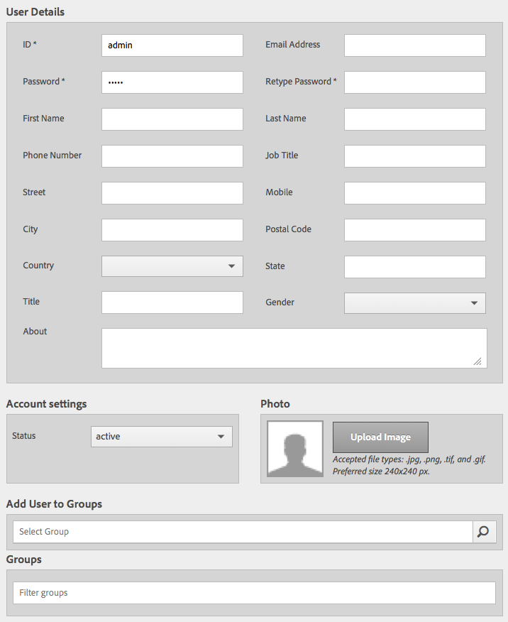

# Operações Granite - Administração de usuários e grupos{#granite-operations-user-and-group-administration}

Como o Granite incorpora a implementação do Repositório CRX da Especificação da API JCR, ele tem sua própria administração de usuários e grupos.

Essas contas são a base subjacente das contas [do](/help/sites-administering/security.md) AEM e qualquer alteração de conta feita com a administração do Granite será refletida se/quando as contas forem acessadas pelo console [Usuários do](/help/sites-administering/security.md#accessing-user-administration-with-the-security-console) AEM (por exemplo, `http://localhost:4502/useradmin`). No console Usuários do AEM, você também pode gerenciar os privilégios e outras especificações do AEM.

Os consoles de administração de grupo e usuário granite estão disponíveis no console **[Ferramentas](/help/sites-administering/tools-consoles.md)**da interface otimizada ao toque:

Escolher **Usuários** ou **Grupos** no console Ferramentas abrirá o console apropriado. Em ambos, você pode agir usando a caixa de clique e as ações da barra de ferramentas, ou abrindo os detalhes da conta por meio do link em **Nome**.

* [Administração do usuário](#user-administration)

   

   O console **Usuários** lista:

   * o nome do usuário
   * o nome de login do usuário (nome da conta)
   * qualquer título que tenha recebido

* [Administração de grupos](#group-administration)

   

   O console **Grupos** lista:

   * o nome do grupo
   * a descrição do grupo
   * o número de usuários/grupos no grupo

## Administração do usuário {#user-administration}

### Adicionando um novo usuário {#adding-a-new-user}

1. Use o ícone **Adicionar usuário** :

   

1. O formulário **Criar usuário** abrirá:

   

   Aqui você pode inserir os detalhes do usuário para a conta (a maioria é padrão e autoexplicativa):

   * **ID**

      Esta é a identificação exclusiva da conta de usuário. É obrigatório e não pode conter espaços.

   * **Endereço de email**
   * **Senha**

      Uma senha é obrigatória.

   * **Digite a senha novamente**

      É obrigatório, uma vez que é necessário para a confirmação da senha.

   * **Nome**
   * **Sobrenome**
   * **Número de telefone**
   * **Cargo**
   * **Rua**
   * **Móvel**
   * **Cidade**
   * **Código postal**
   * **País**
   * **Estado**
   * **Título**
   * **Sexo**
   * **Sobre**
   * **Configurações da conta**

      * **Status** Você pode sinalizar a conta como **ativa** ou **inativa**.
   * **Foto**

      Aqui você pode carregar uma foto para usar como avatar.

      Tipos de arquivo aceitos: `.jpg .png .tif .gif`

      Tamanho preferencial: `240x240px`

   * **Adicionar usuário aos grupos**

      Use o menu suspenso de seleção para selecionar grupos dos quais o usuário deve ser membro. Depois de selecionado, use o **X** pelo nome para desmarcar antes de salvar.

   * **Grupos**

      Uma lista de grupos dos quais o usuário é membro no momento. Use o **X** pelo nome para desmarcar antes de salvar.

1. Depois de definir a conta de usuário, use:

   * **Cancelar** para suspender o registro.
   * **Salvar** para concluir o registro. A criação da conta de usuário será confirmada com uma mensagem.

### Editar um usuário existente {#editing-an-existing-user}

1. Acesse os detalhes do usuário no link sob o nome do usuário no console Usuários.

1. Agora você pode editar os detalhes como em [Adicionar um novo usuário](#adding-a-new-user).

1. Acesse os detalhes do usuário no link sob o nome do usuário no console Usuários.

1. Agora você pode editar os detalhes como em [Adicionar um novo usuário](#adding-a-new-user).

### Alteração da senha para um usuário existente {#changing-the-password-for-an-existing-user}

1. Acesse os detalhes do usuário no link sob o nome do usuário no console Usuários.

1. Agora você pode editar os detalhes como em [Adicionar um novo usuário](#adding-a-new-user). Em Configurações **de** conta há um link para **Alterar senha**.

   

1. A caixa de diálogo **Alterar senha** será aberta. Digite e digite novamente a nova senha, juntamente com sua senha. Use **OK** para confirmar as alterações.

   

   Uma mensagem confirmará que a senha foi alterada.

### Atribuição de grupo rápido {#quick-group-assignment}

1. Use a caixa de clique para sinalizar um ou mais usuários.
1. Use the **Groups** icon:

   

   Para abrir o menu suspenso de seleção de grupo:

   

1. Na caixa de seleção, é possível selecionar ou desmarcar grupos aos quais a conta de usuário deve pertencer.

1. Quando você atribuiu ou não atribuiu os grupos, conforme necessário, use:

   * **Cancelar** para suspender as alterações
   * **Salvar** para confirmar as alterações

### Excluindo Detalhes de Usuário Existentes {#deleting-existing-user-details}

1. Use a caixa de clique para sinalizar um ou mais usuários.
1. Use o ícone **Excluir** para excluir os detalhes do usuário:

   

1. Será solicitado que você confirme a exclusão e uma mensagem confirmará que a exclusão real ocorreu.

## Administração de grupos {#group-administration}

### Adicionando um novo grupo {#adding-a-new-group}

1. Use o ícone Adicionar grupo:

   

1. O formulário **Criar grupo** abrirá:

   

   Aqui você pode inserir os detalhes do grupo:

   * **ID**

      Este é um identificador exclusivo do grupo. Isso é obrigatório e não pode conter espaços.

   * **Nome**

      Um nome para o grupo; será exibido no console Grupos.

   * **Descrição**

      Uma descrição do grupo.

   * **Adicionar membros ao grupo**

      Use o menu suspenso de seleção para selecionar usuários a serem adicionados ao grupo. Depois de selecionado, use o **X** pelo nome para desmarcar antes de salvar.

   * **Membros do grupo**

      Uma lista de usuários no grupo. Use o **X** pelo nome para desmarcar antes de salvar.

1. Depois de definir o grupo, use:

   * **Cancelar** para suspender o registro.
   * **Salvar** para concluir o registro. A criação do grupo será confirmada com uma mensagem.

### Editando um grupo existente {#editing-an-existing-group}

1. Acesse os detalhes do grupo no link abaixo do nome do grupo no console Grupos.

1. Agora você pode editar e salvar os detalhes como em [Adicionar um novo grupo](#adding-a-new-group).

### Copiando um grupo existente {#copying-an-existing-group}

1. Use a caixa de clique para sinalizar um grupo.
1. Use o ícone **Copiar** para copiar os detalhes do grupo:

   

1. O formulário **Editar configurações** de grupo será aberto.

   A ID do grupo será a mesma do original, mas terá o prefixo `Copy of`. É necessário editar isso, pois a ID não pode conter espaços. Todos os outros detalhes serão os mesmos do original.

   Agora você pode editar e salvar os detalhes como em [Adicionar um novo grupo](#adding-a-new-group).

### Excluindo um grupo existente {#deleting-an-existing-group}

1. Use a caixa de clique para sinalizar um ou mais grupos.
1. Use o ícone **Excluir** para excluir os detalhes do grupo:

   

1. Será solicitado que você confirme a exclusão e uma mensagem confirmará que a exclusão real ocorreu.

