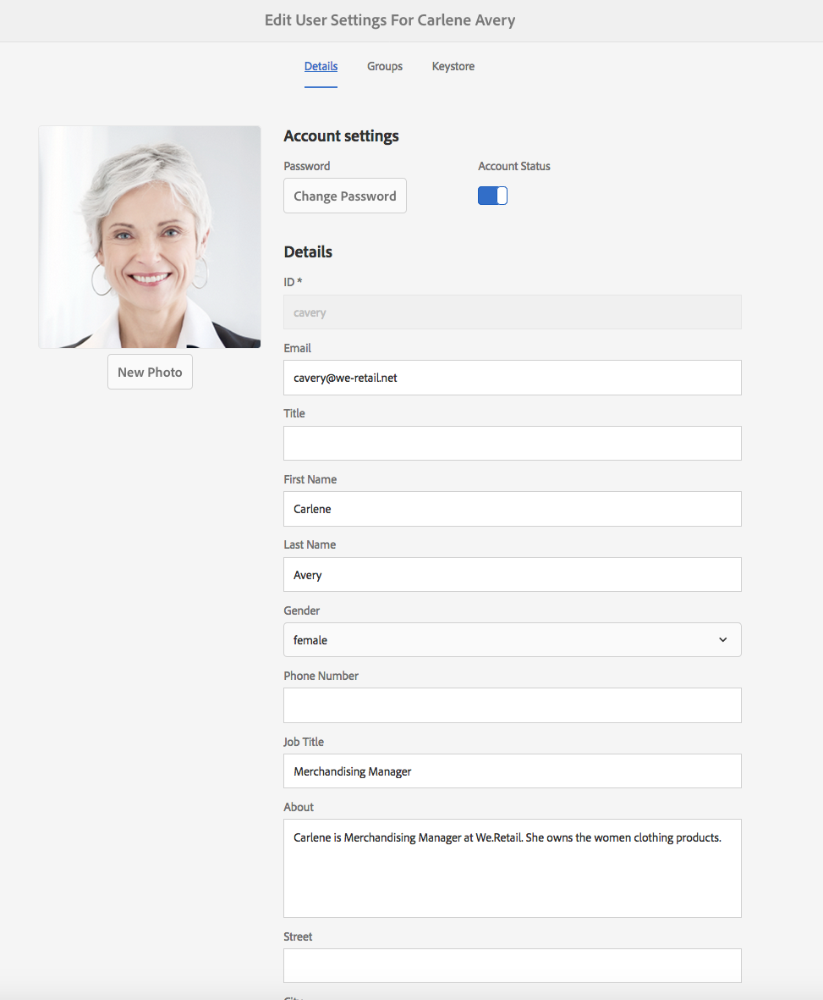
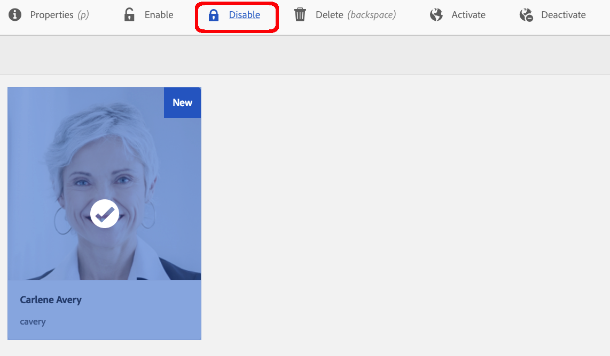

# Tratamento de solicitações GDPR para o AEM Foundation{#handling-gdpr-requests-for-the-aem-foundation}

>[!IMPORTANT]
>
>O RGPD é utilizado como exemplo nas seções abaixo, mas os detalhes abrangidos são aplicáveis a todas as normas de proteção de dados e privacidade; como o RGPD, o CCPA, etc.

## Suporte ao AEM Foundation GDPR {#aem-foundation-gdpr-support}

No nível AEM Foundation, os Dados Pessoais armazenados são o Perfil Usuário. Portanto, as informações neste artigo tratam principalmente de como acessar e excluir perfis de usuários, para atender às solicitações de acesso e exclusão do RGPD, respectivamente.

## Acessar um Perfil de usuário {#accessing-a-user-profile}

### Etapas Manuais {#manual-steps}

1. Abra o console Administração do usuário, navegando até **[!UICONTROL Configurações - Segurança - Usuários]** ou navegando diretamente para `https://<serveraddress>:<serverport>/libs/granite/security/content/useradmin.html`

   

1. Em seguida, procure o usuário em questão digitando o nome na barra de pesquisa na parte superior da página:

   

1. Por fim, abra o perfil do usuário clicando nele e, em seguida, marque a guia **[!UICONTROL Detalhes]**.

   

### API HTTP {#http-api}

Como mencionado, o Adobe fornece APIs para acessar dados do usuário, a fim de facilitar a automação. Existem vários tipos de APIs que você pode usar:

**API UserProperties**

```shell
curl -u user:password http://localhost:4502/libs/granite/security/search/profile.userproperties.json\?authId\=cavery
```

**API Sling**

*Descobrindo a página inicial do usuário:*

```xml
curl -g -u user:password 'http://localhost:4502/libs/granite/security/search/authorizables.json?query={"condition":[{"named":"cavery"}]}'
     {"authorizables":[{"type":"user","authorizableId_xss":"cavery","authorizableId":"cavery","name_xss":"Carlene Avery","name":"Carlene Avery","home":"/home/users/we-retail/DSCP-athB1NYLBXvdTuN"}],"total":1}
```

*Recuperando dados do usuário*

Usando o caminho do nó da propriedade home da carga JSON retornada do comando acima:

```shell
curl -u user:password  'http://localhost:4502/home/users/we-retail/DSCP-athB1NYLBXvdTuN/profile.-1.json'
```

```shell
curl -u user:password  'http://localhost:4502/home/users/we-retail/DSCP-athB1NYLBXvdTuN/profiles.-1.json'
```

## Desabilitando um usuário e excluindo os Perfis associados {#disabling-a-user-and-deleting-the-associated-profiles}

### Desabilitar Usuário {#disable-user}

1. Abra o console Administração do usuário e procure o usuário em questão, conforme descrito acima.
1. Passe o mouse sobre o usuário e clique no ícone de seleção. O perfil ficará cinza, indicando que está selecionado.

1. Pressione o botão Disable (Desativar) no menu superior para desativar o usuário:

   

1. Por último, confirme a ação:

   

   A interface do usuário indicará que o usuário foi desativado ao ficar acinzentado e adicionar um bloqueio à placa de perfil:

   

### Excluir informações de Perfil do usuário {#delete-user-profile-information}

1. Faça logon no CRXDE Lite e, em seguida, procure `[!UICONTROL userId]`:

   

1. Abra o nó do usuário localizado em `[!UICONTROL /home/users]` por padrão:

   

1. Exclua os nós do perfil e todos os seus filhos. Há dois formatos para os nós de perfil, dependendo da versão AEM:

   1. O perfil particular padrão em `[!UICONTROL /profile]`
   1. `[!UICONTROL /profiles]`, para novos perfis criados usando o AEM 6.5.

   

### API HTTP {#http-api-1}

Os procedimentos a seguir usam a ferramenta de linha de comando `curl` para ilustrar como desativar o usuário com a **[!UICONTROL cavery]** `userId` e excluir seus perfis disponíveis no local padrão.

* *Descobrindo a página inicial do usuário*

```shell
curl -g -u user:password 'http://localhost:4502/libs/granite/security/search/authorizables.json?query={"condition":[{"named":"cavery"}]}'
     {"authorizables":[{"type":"user","authorizableId_xss":"cavery","authorizableId":"cavery","name_xss":"Carlene Avery","name":"Carlene Avery","home":"/home/users/we-retail/DSCP-athB1NYLBXvdTuN"}],"total":1}
```

* *Desativar o usuário*

Usando o caminho do nó da propriedade home da carga JSON retornada do comando acima:

```shell
curl -X POST -u user:password -FdisableUser="describe the reasons for disabling this user (GDPR in this case)" 'http://localhost:4502/home/users/we-retail/DSCP-athB1NYLBXvdTuN.rw.userprops.html'
```

* *Excluindo perfis de usuário*

Usando o caminho do nó da propriedade home da carga JSON retornada do comando descoberta de conta e os locais conhecidos do nó do perfil out da caixa:

```shell
curl -X POST -u user:password -H "Accept: application/json,**/**;q=0.9" -d ':operation=delete' 'http://localhost:4502/home/users/we-retail/DSCP-athB1NYLBXvdTuN/profile'
```

```shell
curl -X POST -u user:password -H "Accept: application/json,**/**;q=0.9" -d ':operation=delete' 'http://localhost:4502/home/users/we-retail/DSCP-athB1NYLBXvdTuN/profile'
```

