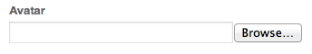

# Gerenciamento de identidade{#identity-management}

Os visitantes individuais do seu site só podem ser identificados quando você fornece a capacidade para fazer logon. Há vários motivos pelos quais você pode querer fornecer um recurso de logon:

* [AEM Communities](/help/communities/overview.md)Os visitantes do site precisam fazer logon para postar conteúdo na comunidade.
* [Grupos de usuários fechados](/help/sites-administering/cug.md)

   Talvez seja necessário limitar o acesso ao seu site (ou a seções dele) a visitantes específicos.

* [Personalização](/help/sites-administering/personalization.md) Permitir que os visitantes configurem determinados aspectos de como eles acessam seu site.

A funcionalidade de logon (e saída) é fornecida por um [com uma **Perfil**](#profiles-and-user-accounts), que contém informações adicionais sobre o visitante registrado (usuário). Os processos reais de registro e de autorização podem diferir:

* Autoregistro no website

   A [Site da comunidade](/help/communities/sites-console.md) pode ser configurada para permitir que os visitantes se registrem ou façam logon próprio em suas contas do Facebook ou Twitter.

* Pedido de registro no sítio web

   Para um grupo de usuários fechado, você pode permitir que os visitantes solicitem o registro, mas impor a autorização por meio de um workflow.

* Registrar cada conta no ambiente de criação

   Se você tiver um pequeno número de perfis, que precisará de autorização de qualquer maneira, poderá decidir registrar-se diretamente.

Para permitir que os visitantes se registrem, uma série de componentes e formulários pode ser usada para coletar as informações de identificação necessárias e, em seguida, as informações adicionais (geralmente opcionais) do perfil. Depois de se terem registrado, devem também poder verificar e atualizar os dados que apresentaram.

Funcionalidade adicional pode ser configurada ou desenvolvida:

* Configure qualquer replicação inversa necessária.
* Permitir que um usuário remova seu perfil, desenvolvendo um formulário junto com um fluxo de trabalho.

>[!NOTE]
>
>As informações especificadas no perfil também podem ser usadas para fornecer ao usuário conteúdo direcionado por meio de [Segmentos](/help/sites-administering/campaign-segmentation.md) e [Campanhas](/help/sites-classic-ui-authoring/classic-personalization-campaigns.md).

## Forms de registro {#registration-forms}

A [formulário](/help/sites-authoring/default-components.md#form-component) pode ser usada para coletar as informações de registro e gerar a nova conta e perfil.

Por exemplo, os usuários podem solicitar um novo perfil usando a página Geometrixx
`http://localhost:4502/content/geometrixx-outdoors/en/user/register.html`


Após enviar a solicitação, a página de perfil é aberta, onde o usuário pode fornecer detalhes pessoais.


A nova conta também é visível no [Console Usuários](/help/sites-administering/security.md).

## Logon {#login}

O componente de logon pode ser usado para coletar as informações de logon e, em seguida, para ativar o processo de logon.

Isso fornece ao visitante os campos padrão de **Nome do usuário** e **Senha** com um **Logon** para ativar o processo de logon quando as credenciais forem inseridas.

Por exemplo, os usuários podem fazer logon ou criar uma nova conta usando a **Fazer logon** na barra de ferramentas do Geometrixx, que usa a página:

`http://localhost:4502/content/geometrixx-outdoors/en/user/sign-in.html`


## Logout {#logging-out}

Como há um mecanismo de logon, também é necessário um mecanismo de logout. Isso está disponível como a variável **Fazer logoff** no Geometrixx.

## Visualização e atualização de um perfil {#viewing-and-updating-a-profile}

Dependendo do formulário de registro, o visitante pode ter registrado informações em seu perfil. Eles devem poder visualizar e/ou atualizar isso em uma fase posterior. Isso pode ser feito com uma forma semelhante; por exemplo, no Geometrixx:

```
http://localhost:4502/content/geometrixx-outdoors/en/user/profile.html
```

Para ver os detalhes do seu perfil, clique em **Meu perfil** no canto superior direito de qualquer página; por exemplo, com a variável `admin` conta:
`http://localhost:4502/home/users/a/admin/profile.form.html/content/geometrixx-outdoors/en/user/profile.html.`

Você pode exibir outro perfil usando o [contexto do cliente](/help/sites-administering/client-context.md) (no ambiente do autor e com privilégios suficientes):

1. Abrir uma página; por exemplo, a página Geometrixx:

   `http://localhost:4502/cf#/content/geometrixx/en.html`

1. Clique em **Meu perfil** no canto superior direito. Você verá o perfil da sua conta atual; por exemplo, o administrador.
1. Press **control-alt-C** para abrir o contexto do cliente.
1. No canto superior esquerdo do contexto do cliente, clique no link **Carregar um perfil** botão.

   

1. Selecione outro perfil na lista suspensa da janela de diálogo; por exemplo, **Alison Parker**.
1. Clique em **OK**.
1. Clique novamente em **Meu perfil**. O formulário será atualizado com os detalhes de Alison.

   

1. Agora você pode usar **Editar perfil** ou **Alterar senha** para atualizar os detalhes.

## Adicionar campos à definição de perfil {#adding-fields-to-the-profile-definition}

Você pode adicionar campos à definição do perfil. Por exemplo, para adicionar um campo &quot;Cor favorita&quot; ao perfil do Geometrixx:

1. No console Sites, navegue até Geometrixx Outdoors Site > Inglês > Usuário > Meu perfil.
1. Clique duas vezes no **Meu perfil** para abri-la para edição.
1. No **Componentes** guia do sidekick expanda a **Formulário** seção.
1. Arraste um **Lista suspensa** do sidekick para o formulário, logo abaixo da variável **Sobre mim** campo.
1. Clique duas vezes no botão **Lista suspensa** componente para abrir a caixa de diálogo para configuração e inserir:

   * **Nome do elemento** - `favoriteColor`
   * **Título** - `Favorite Color`
   * **Itens** - Adicionar várias cores como itens

   Clique em **OK** para salvar.

1. Feche a página e retorne ao **Sites** e ative a página Meu perfil .

   Na próxima vez que exibir um perfil, você poderá selecionar uma cor favorita:

   

   O campo será salvo na variável **perfil** seção da conta de utilizador relevante:

   

## Estados do perfil {#profile-states}

Há vários casos de uso que exigem saber se um usuário (ou seu perfil) está em um *estado específico* ou não.

Isso envolve definir uma propriedade apropriada no perfil do usuário de uma maneira que:

* é visível e acessível ao usuário
* define dois estados para cada propriedade
* permite alternar entre os dois estados definidos

Isso é feito com:

* [Provedores de estado](#state-providers)

   Para gerenciar os dois estados de uma propriedade específica e as transições entre os dois.

* [Fluxos de trabalhos](#workflows)

   Para gerenciar ações relacionadas aos estados.

Vários estados podem ser definidos; por exemplo, no Geometrixx, incluem:

* assinatura (ou cancelamento de assinatura) de notificações em informativos ou encadeamentos de comentários
* adicionar e remover uma conexão com um amigo

### Provedores de estado {#state-providers}

Um provedor de estado gerencia o estado atual da propriedade em questão, juntamente com as transições entre os dois estados possíveis.

Os provedores de estado são implementados como componentes, portanto, pode ser personalizado para o seu projeto. Na Geometrixx, incluem:

* Assinar/Cancelar assinatura de tópico do fórum
* Adicionar/remover amigos

### Fluxos de trabalhos {#workflows}

Provedores de estado gerenciam uma propriedade de perfil e seus estados.

Um workflow é necessário para implementar as ações relacionadas aos estados. Por exemplo, ao assinar notificações, o workflow manipula a ação de assinatura real; ao cancelar a assinatura das notificações, o workflow tratará da remoção do usuário da lista de assinaturas.

## Perfis e contas de usuário {#profiles-and-user-accounts}

Os perfis são armazenados no Repositório de conteúdo como parte do[conta do usuário](/help/sites-administering/user-group-ac-admin.md).

O perfil pode ser encontrado em `/home/users/geometrixx`:


Em uma instalação padrão (autor ou publicação), todos têm acesso de leitura a todas as informações de perfil de todos os usuários. todos são um &quot;*Grupo integrado contendo automaticamente todos os usuários e grupos existentes. Não é possível editar a lista de membros*&quot;.

Esses direitos de acesso são definidos pela seguinte ACL curinga:

/home todos permitem jcr:read rep:glob = &#42;/perfil&#42;

Isso permite:

* fórum, comentários ou postagens do blog para exibir informações (como ícone ou nome completo) do perfil apropriado
* links para páginas de perfil do geometrixx

Se esse acesso não for apropriado para sua instalação, você poderá alterar essas configurações padrão.

Isso pode ser feito usando o **[Controle de acesso](/help/sites-administering/user-group-ac-admin.md#access-right-management)** guia :


## Componentes de perfil {#profile-components}

Uma variedade de componentes do perfil também está disponível para definir os requisitos de perfil para seu site.

### Campo de senha marcado {#checked-password-field}

Esse componente fornece dois campos para:

* inserir uma senha
* uma verificação para confirmar que a senha foi inserida corretamente.

Com as configurações padrão, o componente será exibido da seguinte forma:


### Foto de avatar do perfil  {#profile-avatar-photo}

Esse componente fornece ao usuário um mecanismo para selecionar e carregar um arquivo Avatar Photo.



### Nome detalhado de perfil {#profile-detailed-name}

Esse componente permite que o usuário insira um nome detalhado.


### Gênero do perfil {#profile-gender}

Esse componente permite que o usuário insira seu gênero.


