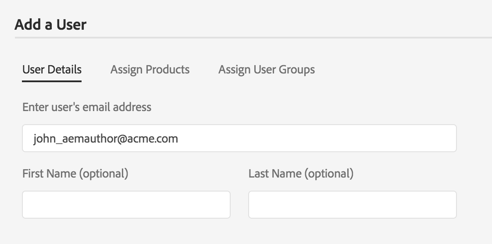
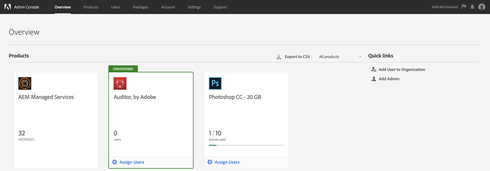

# Autenticação e [!DNL Admin Console] suporte do Adobe IMS para AEM Managed Services {#adobe-ims-authentication-and-admin-console-support-for-aem-managed-services}

>[!NOTE]
>
>Observe que esse recurso está disponível somente para clientes do Adobe Managed Services.

## Introdução {#introduction}

AEM 6.4.3.0 apresenta [!DNL Admin Console] suporte para instâncias AEM e autenticação baseada no Adobe IMS (Identity Management System) para clientes **AEM Managed Services** .

AEM a integração com o permitirá que AEM clientes Managed Services gerenciem todos os usuários do Experience Cloud em um console. [!DNL Admin Console] Usuários e grupos podem ser atribuídos a perfis de produtos associados a instâncias AEM, permitindo que eles façam logon em uma instância específica.

## Destaques principais {#key-highlights}

* O suporte à autenticação AEM IMS é somente para autores, administradores ou desenvolvedores do AEM, e não para usuários finais externos de visitantes do site como  do site do cliente
* O [!DNL Admin Console] representará AEM clientes da Managed Services como Organizações IMS e suas Instâncias como Contextos de produtos. Os administradores de sistemas e produtos do cliente poderão gerenciar o acesso às instâncias
* AEM Managed Services sincronizará as topologias do cliente com o [!DNL Admin Console]. Haverá uma instância AEM Contexto de produto Managed Services por instância no [!DNL Admin Console].
* Product Profiles in [!DNL Admin Console] will determine which instances a user can access
* A autenticação federada usando provedores de identidade compatíveis com SAML 2 dos próprios clientes é suportada
* Somente Enterprise ID ou Federated ID(para logon único do cliente) serão suportadas, não as IDs de Adobe pessoais.
* [!DNL User Management] (no Adobe [!DNL Admin Console]) continuará a ser propriedade dos administradores do cliente.

## Arquitetura {#architecture}

A Autenticação IMS funciona usando o protocolo OAuth entre o AEM e o terminal Adobe IMS. Depois que um usuário é adicionado ao IMS e tem uma Adobe Identity, ele pode fazer logon nas instâncias do AEM Managed Services usando as credenciais do IMS.

O fluxo de logon do usuário é mostrado abaixo, o usuário será redirecionado para o IMS e, opcionalmente, para o IDP do cliente para validação SSO e, em seguida, redirecionado para o AEM.

## How To Set Up {#how-to-set-up}

### Onboarding Organizations to [!DNL Admin Console] {#onboarding-organizations-to-admin-console}

The customer onboarding to [!DNL Admin Console] is a pre-requisite to using Adobe IMS for AEM authentication.

Como primeira etapa, os clientes devem ter uma Organização provisionada no Adobe IMS. Os clientes Adobe Enterprise são representados como Organizações IMS no [Adobe [!DNL Admin Console]](https://helpx.adobe.com/br/enterprise/using/admin-console.html).

AEM Managed Services customers should already have an organization provisioned, and as part of the IMS provisioning, the customer instances will be made available in the [!DNL Admin Console] for managing user entitlements and access.

A mudança para o IMS para autenticação do usuário será um esforço conjunto entre o AMS e os clientes, cada um com suas workflows de conclusão.

Quando um cliente existe como uma Organização IMS e o AMS é feito com o provisionamento do cliente para o IMS, este é o resumo dos workflows de configuração necessários:

1. The designated System Admin receives an invite to log in to the [!DNL Admin Console]
1. O administrador do sistema reclama o domínio para confirmar a propriedade do domínio (neste exemplo, acme.com)
1. O administrador do sistema configura os diretórios do usuário
1. O administrador do sistema configura o provedor de identidade (IDP) na configuração [!DNL Admin Console] para SSO.
1. O administrador do AEM gerencia os grupos, permissões e privilégios locais, como de costume. Consulte Sincronização de usuários e grupos

>[!NOTE]
>
>Para obter mais informações sobre as noções básicas sobre o Adobe Identity Management, incluindo a configuração do IDP, consulte o artigo [nesta página.](https://helpx.adobe.com/br/enterprise/using/set-up-identity.html)
>
>Para obter mais informações sobre a Administração corporativa e [!DNL Admin Console] consulte o artigo [nesta página](https://helpx.adobe.com/br/enterprise/managing/user-guide.html).

### Usuários integrados ao [!DNL Admin Console] {#onboarding-users-to-the-admin-console}

Existem três maneiras de os usuários integrados dependerem do tamanho do cliente e de suas preferências:

1. Criar manualmente usuários e grupos em [!DNL Admin Console]
1. Carregar um arquivo CSV com usuários
1. Sincronizar usuários e grupos do Ative Diretory corporativo do cliente.

#### Manual Addition through [!DNL Admin Console] UI {#manual-addition-through-admin-console-ui}

Users and Groups can be manually created in the [!DNL Admin Console] UI. Esse método pode ser usado se não tiver um grande número de usuários para gerenciar. Por exemplo, um número de usuários com menos de 50 AEM.

Os usuários também podem ser criados manualmente se o cliente já estiver usando esse método para administrar outros produtos do Adobe, como aplicativos do Analytics, do Público alvo ou do Creative Cloud.

#### Upload de arquivo na [!DNL Admin Console] interface do usuário {#file-upload-in-the-admin-console-ui}

Para facilitar a manipulação da criação do usuário, um arquivo CSV pode ser carregado para adicionar usuários em massa:

#### Ferramenta de sincronização de usuários {#user-sync-tool}

A User Sync Tool (UST) permite que os clientes corporativos criem ou gerenciem usuários do Adobe usando o Ative Diretory ou outros serviços de diretório OpenLDAP testados. Os usuários do público alvo são administradores de identidade de TI (Enterprise Diretory e administradores de sistema) que poderão instalar e configurar a ferramenta. A ferramenta de código aberto é personalizável para que os clientes possam ter um desenvolvedor que a modifique de acordo com seus próprios requisitos específicos.

When User Sync runs, it fetches a list of users from the organization’s Active Directory (or any other compatible data source) and compares it with the list of users within the [!DNL Admin Console]. It then calls the Adobe [!DNL User Management] API so that the [!DNL Admin Console] is synchronized with the organization’s directory. O fluxo de mudança é totalmente unidirecional; as edições feitas no diretório [!DNL Admin Console] não são enviadas para o diretório.

A ferramenta permite que o administrador do sistema mapeie grupos de usuários no diretório do cliente com a configuração do produto e grupos de usuários no [!DNL Admin Console], a nova versão do UST também permite a criação dinâmica de grupos de usuários no [!DNL Admin Console].

To set up User Sync, the organization needs to create a set of credentials in the same way they would use the [[!DNL User Management] API](https://www.adobe.io/apis/cloudplatform/usermanagement/docs/setup.html).

A Sincronização do usuário é distribuída pelo repositório do Adobe Github neste local:

[https://github.com/adobe-apiplatform/user-sync.py/releases/latest](https://github.com/adobe-apiplatform/user-sync.py/releases/latest)

Observe que uma versão de pré-lançamento 2.4RC1 está disponível com suporte à criação de grupos dinâmicos e pode ser encontrada aqui: [https://github.com/adobe-apiplatform/user-sync.py/releases/tag/v2.4rc1](https://github.com/adobe-apiplatform/user-sync.py/releases/tag/v2.4rc1)

The major features for this release are the ability to dynamically map new LDAP groups for user membership in the [!DNL Admin Console], as well as dynamic user group creation.

Mais informações sobre os novos recursos do grupo podem ser encontradas aqui:

[https://github.com/adobe-apiplatform/user-sync.py/blob/v2/docs/en/user-manual/advanced_configuration](https://github.com/adobe-apiplatform/user-sync.py/blob/v2/docs/br/user-manual/advanced_configuration.md#additional-group-options)

>[!NOTE]
>
>Para obter mais informações sobre a Ferramenta de sincronização do usuário, consulte a página [da](https://adobe-apiplatform.github.io/user-sync.py/br/)documentação.
>
>
>The User Sync Tool needs to register as an Adobe I/O client UMAPI using the procedure described [here](https://adobe-apiplatform.github.io/umapi-documentation/br/UM_Authentication.html).
>
>The Adobe I/O Console Documentation can be found [here](https://www.adobe.io/apis/cloudplatform/console.html).
>
>
>A [!DNL User Management] API usada pela Ferramenta de sincronização de usuário é abordada neste [local](https://www.adobe.io/apis/cloudplatform/umapi-new.html).

>[!NOTE]
>
>A configuração AEM IMS será gerenciada pela equipe de Serviços gerenciados da Adobe. No entanto, o administrador do cliente pode modificá-lo de acordo com seus requisitos (por exemplo, Associação de grupo automático ou Mapeamento de grupo). O cliente IMS também será registrado pela sua equipe Managed Services.

## Como usar {#how-to-use}

### Managing Products and User Access in [!DNL Admin Console] {#managing-products-and-user-access-in-admin-console}

When the customer Product Administrator logs in to [!DNL Admin Console], they will see multiple instances of the AEM Managed Services Product Context as shown below:

In this example, the org *AEM-MS-Onboard* has 32 instances spanning different topologies and environments like Stage, Prod, etc.

Os detalhes da instância podem ser verificados para identificar a instância:

Em cada instância do Contexto do produto, haverá um Perfil do Produto associado. Este perfil de produto é usado para atribuir acesso a usuários e grupos.

Todos os usuários e grupos adicionados sob este perfil de produto poderão fazer logon nessa instância, como mostra o exemplo abaixo:

### Efetuar login no AEM {#logging-into-aem}

#### Logon de administrador local {#local-admin-login}

AEM pode continuar a suportar logons locais para usuários administradores, já que a tela de logon tem uma opção para fazer logon localmente:

#### Logon baseado no IMS {#ims-based-login}

Para outros usuários, o logon baseado no IMS pode ser usado assim que o IMS for configurado na instância. The user will first click on the **Sign in with Adobe** button as shown below:

Eles serão redirecionados para a tela de login do IMS e inserirão suas credenciais:

If a federated IDP is configured during initial [!DNL Admin Console] setup, then the user will be redirected to the customer IDP for SSO.

O IDP é Okta no exemplo abaixo:

Após a conclusão da autenticação, o usuário será redirecionado de volta para o AEM e conectado:

### Migração de usuários existentes {#migrating-existing-users}

Para instâncias AEM existentes que estejam usando outro método de autenticação e que agora estejam sendo migradas para o IMS, é necessário uma etapa de migração.

Os usuários existentes no repositório AEM (originados localmente, via LDAP ou SAML) podem ser migrados para o IMS como o IDP usando o Utilitário de migração do usuário.

Este utilitário será executado pela equipe do AMS como parte do provisionamento de IMS.

### Gerenciando permissões e ACLs em AEM {#managing-permissions-and-acls-in-aem}

O controle de acesso e as permissões continuarão a ser gerenciados no AEM, isso pode ser feito usando a separação dos Grupos de usuários provenientes do IMS (por exemplo, AEM-GRP-008 no exemplo abaixo) e dos grupos locais onde as permissões e o controle de acesso são definidos. Os grupos de usuários sincronizados do IMS podem ser atribuídos a grupos locais e herdar as permissões.

No exemplo abaixo, adicionamos grupos sincronizados ao grupo local *Dam_Users*, como exemplo.

Aqui, um usuário também foi atribuído a alguns grupos no [!DNL Admin Console]. (Observe que os usuários e grupos podem ser sincronizados do LDAP usando a ferramenta de sincronização do usuário ou criados localmente, consulte a seção Usuários **integrados[!DNL Admin Console]** acima).

&amp;ast;Observe que grupos de usuários só são sincronizados quando os usuários fazem logon na instância, para clientes que têm um grande número de usuários e grupos, um utilitário de sincronização de grupo pode ser executado pelo AMS para obter previamente grupos para o gerenciamento de controles de acesso e permissões descrito acima.

O usuário faz parte dos seguintes Grupos no IMS:

Quando o usuário faz logon, as Associações de grupo são sincronizadas, como mostrado abaixo:

Em AEM, os grupos de usuários sincronizados do IMS podem ser adicionados como membros a grupos locais existentes, por exemplo, Usuários do DAM.

Como mostrado abaixo, o grupo *AEM-GRP_008* herda as Permissões e privilégios de usuários DAM. Essa é uma maneira eficaz de gerenciar permissões para grupos sincronizados e também é comumente usada em métodos de autenticação baseados em LDAP.

