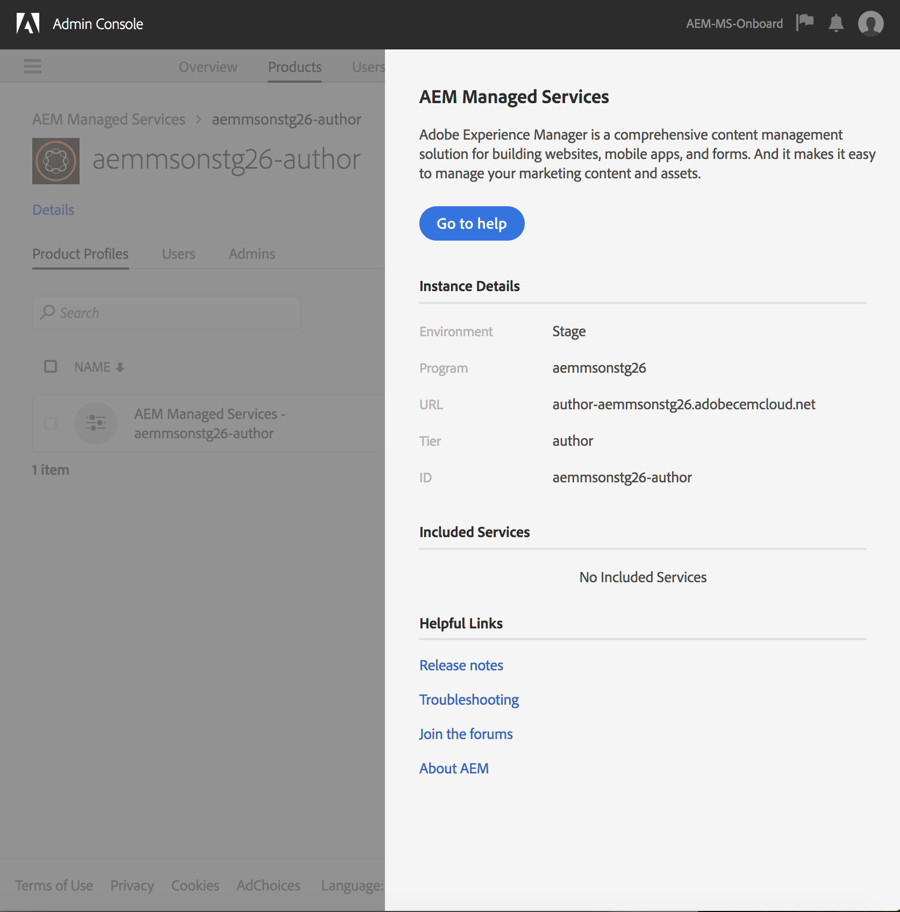

# Autenticação do Adobe IMS e suporte ao Admin Console para serviços gerenciados do AEM {#adobe-ims-authentication-and-admin-console-support-for-aem-managed-services}

>[!NOTE]
>
>Observe que esse recurso está disponível somente para clientes do Adobe Managed Services.

## Introdução {#introduction}

O AEM 6.4.3.0 apresenta suporte ao Admin Console para instâncias do AEM e autenticação baseada no Adobe IMS (Identity Management System) para clientes do **AEM Managed Services** .

A integração do AEM ao Admin Console permitirá que os clientes do AEM Managed Services gerenciem todos os usuários da Experience Cloud em um console. Usuários e grupos podem ser atribuídos a perfis de produtos associados a instâncias do AEM, permitindo que eles façam logon em uma instância específica.

## Destaques principais {#key-highlights}

* O suporte à autenticação do AEM IMS é somente para autores, administradores ou desenvolvedores do AEM, e não para usuários finais externos de visitantes do site como os do cliente
* O Admin Console representará os clientes dos Serviços gerenciados do AEM como Organizações IMS e suas Instâncias como Contextos de produtos. Os administradores de sistemas e produtos do cliente poderão gerenciar o acesso às instâncias
* Os serviços gerenciados do AEM sincronizarão as topologias do cliente com o Admin Console. Haverá uma instância do Contexto de produto de serviços gerenciados do AEM por instância no Admin Console.
* Perfis de produto no Admin Console determinará quais instâncias um usuário pode acessar
* A autenticação federada usando provedores de identidade compatíveis com SAML 2 dos próprios clientes é suportada
* Somente Enterprise ID ou Federated ID(para logon único do cliente) serão compatíveis, não com Adobe IDs pessoais.
* O gerenciamento de usuários (no Adobe Admin Console) continuará sendo de propriedade dos administradores do cliente.

## Arquitetura {#architecture}

A autenticação IMS funciona usando o protocolo OAuth entre o AEM e o terminal Adobe IMS. Depois que um usuário é adicionado ao IMS e tem uma Adobe Identity, ele pode fazer logon em instâncias do AEM Managed Services usando credenciais IMS.

O fluxo de logon do usuário é mostrado abaixo, o usuário será redirecionado para o IMS e, opcionalmente, para o IDP do cliente para validação SSO e, em seguida, redirecionado para o AEM.

## Como configurar {#how-to-set-up}

### Organizações onboard para o Admin Console {#onboarding-organizations-to-admin-console}

O cliente que se conecta ao Admin Console é um pré-requisito para usar o Adobe IMS para autenticação AEM.

Como primeira etapa, os clientes devem ter uma organização provisionada no Adobe IMS. Os clientes do Adobe Enterprise são representados como Organizações IMS no [Adobe Admin Console](https://helpx.adobe.com/enterprise/using/admin-console.html).

Os clientes dos Serviços gerenciados do AEM já devem ter uma organização provisionada e, como parte do provisionamento do IMS, as instâncias do cliente serão disponibilizadas no Admin Console para gerenciar direitos de usuário e acesso.

A mudança para o IMS para autenticação de usuário será um esforço conjunto entre o AMS e os clientes, com cada um tendo seus fluxos de trabalho para concluir.

Quando um cliente existe como uma Organização IMS e o AMS é feito com o provisionamento do cliente para o IMS, este é o resumo dos fluxos de trabalho de configuração necessários:

1. O administrador do sistema designado recebe um convite para fazer logon no Admin Console
1. O administrador do sistema reclama o domínio para confirmar a propriedade do domínio (neste exemplo, acme.com)
1. O administrador do sistema configura os diretórios do usuário
1. O administrador do sistema configura o provedor de identidade (IDP) no Admin Console para configuração SSO.
1. O administrador do AEM gerencia grupos locais, permissões e privilégios, como de costume. Consulte Sincronização de usuários e grupos

>[!NOTE]
>
>Para obter mais informações sobre as noções básicas do Adobe Identity Management, incluindo a configuração do IDP, consulte o artigo [nesta página.](https://helpx.adobe.com/enterprise/using/set-up-identity.html)
>
>Para obter mais informações sobre a Enterprise Administration and Admin Console, consulte o artigo [nesta página](https://helpx.adobe.com/enterprise/managing/user-guide.html).

### Usuários integrados ao Admin Console {#onboarding-users-to-the-admin-console}

Existem três maneiras de os usuários integrados dependerem do tamanho do cliente e de suas preferências:

1. Criar usuários e grupos manualmente no Admin Console
1. Carregar um arquivo CSV com usuários
1. Sincronizar usuários e grupos do Ative Diretory corporativo do cliente.

#### Adição manual por meio da interface do usuário do Admin Console {#manual-addition-through-admin-console-ui}

Usuários e grupos podem ser criados manualmente na interface do usuário do Admin Console. Esse método pode ser usado se não tiver um grande número de usuários para gerenciar. Por exemplo, um número menor de usuários do AEM.

Os usuários também podem ser criados manualmente se o cliente já estiver usando esse método para administrar outros produtos da Adobe, como aplicativos do Analytics, Target ou Creative Cloud.

#### Upload de arquivo na interface do usuário do Admin Console {#file-upload-in-the-admin-console-ui}

Para facilitar a manipulação da criação do usuário, um arquivo CSV pode ser carregado para adicionar usuários em massa:

#### Ferramenta de sincronização do usuário {#user-sync-tool}

A User Sync Tool (UST) permite que clientes corporativos criem ou gerenciem usuários da Adobe que utilizam o Ative Diretory ou outros serviços de diretório OpenLDAP testados. Os usuários de destino são administradores de identidade de TI (Enterprise Diretory e administradores de sistema) que poderão instalar e configurar a ferramenta. A ferramenta de código aberto é personalizável para que os clientes possam ter um desenvolvedor que a modifique de acordo com seus próprios requisitos específicos.

Quando a Sincronização de usuários é executada, ela obtém uma lista de usuários do Ative Diretory da organização (ou de qualquer outra fonte de dados compatível) e a compara com a lista de usuários no Admin Console. Em seguida, chama a API de gerenciamento de usuários da Adobe para que o Admin Console seja sincronizado com o diretório da organização. O fluxo de mudança é totalmente unidirecional; as edições feitas no Admin Console não são enviadas para o diretório.

A ferramenta permite que o administrador do sistema mapeie grupos de usuários no diretório do cliente com a configuração do produto e grupos de usuários no Admin Console, a nova versão UST também permite a criação dinâmica de grupos de usuários no Admin Console.

Para configurar a Sincronização de usuários, a organização precisa criar um conjunto de credenciais da mesma forma que usaria a API [de Gerenciamento de](https://www.adobe.io/apis/cloudplatform/usermanagement/docs/setup.html)usuários.

A Sincronização do usuário é distribuída pelo repositório do Adobe Github neste local:

[https://github.com/adobe-apiplatform/user-sync.py/releases/latest](https://github.com/adobe-apiplatform/user-sync.py/releases/latest)

Observe que uma versão de pré-lançamento 2.4RC1 está disponível com suporte à criação de grupos dinâmicos e pode ser encontrada aqui: [https://github.com/adobe-apiplatform/user-sync.py/releases/tag/v2.4rc1](https://github.com/adobe-apiplatform/user-sync.py/releases/tag/v2.4rc1)

Os principais recursos desta versão são a capacidade de mapear dinamicamente novos grupos LDAP para associação de usuários no Admin Console, bem como a criação dinâmica de grupos de usuários.

Mais informações sobre os novos recursos do grupo podem ser encontradas aqui:

[https://github.com/adobe-apiplatform/user-sync.py/blob/v2/docs/en/user-manual/advanced_configuration](https://github.com/adobe-apiplatform/user-sync.py/blob/v2/docs/en/user-manual/advanced_configuration.md#additional-group-options)

>[!NOTE]
>
>Para obter mais informações sobre a Ferramenta de sincronização do usuário, consulte a página [da](https://adobe-apiplatform.github.io/user-sync.py/en/)documentação.
>
>
>A Ferramenta de sincronização de usuário precisa se registrar como um UMAPI cliente de E/S da Adobe usando o procedimento descrito [aqui](https://adobe-apiplatform.github.io/umapi-documentation/en/UM_Authentication.html).
>
>A Documentação do console de E/S da Adobe pode ser encontrada [aqui](https://www.adobe.io/apis/cloudplatform/console.html).
>
>
>A API de gerenciamento de usuários usada pela Ferramenta de sincronização de usuários é abordada neste [local](https://www.adobe.io/apis/cloudplatform/umapi-new.html).

>[!NOTE]
>
>A configuração do AEM IMS será gerenciada pela equipe de Serviços gerenciados da Adobe. No entanto, o administrador do cliente pode modificá-lo de acordo com seus requisitos (por exemplo, Associação de grupo automático ou Mapeamento de grupo). O cliente IMS também será registrado pela equipe de Serviços gerenciados.

## Como usar {#how-to-use}

### Gerenciamento de produtos e acesso do usuário no Admin Console {#managing-products-and-user-access-in-admin-console}

Quando o Administrador de produtos do cliente fizer logon no Admin Console, verá várias instâncias do Contexto de produto de serviços gerenciados do AEM, como mostrado abaixo:

Neste exemplo, a organização *AEM-MS-Onboard* tem 32 instâncias abrangendo topologias e ambientes diferentes como Stage, Prod etc.

Os detalhes da instância podem ser verificados para identificar a instância:

Em cada instância do Contexto do produto, haverá um Perfil do produto associado. Esse perfil de produto é usado para atribuir acesso a usuários e grupos.

Todos os usuários e grupos adicionados sob este perfil de produto poderão fazer logon nessa instância, como mostra o exemplo abaixo:

### Fazer logon no AEM {#logging-into-aem}

#### Logon de administrador local {#local-admin-login}

O AEM pode continuar a suportar logons locais para usuários administradores, já que a tela de logon tem uma opção para fazer logon localmente:

#### Logon baseado em IMS {#ims-based-login}

Para outros usuários, o logon com base em IMS pode ser usado assim que o IMS for configurado na instância. O usuário primeiro clicará no botão **Fazer logon com a Adobe** , conforme mostrado abaixo:

Eles serão redirecionados para a tela de login do IMS e inserirão suas credenciais:

Se um IDP federado for configurado durante a configuração inicial do Admin Console, o usuário será redirecionado para o IDP do cliente para SSO.

O IDP é Okta no exemplo abaixo:

Após a conclusão da autenticação, o usuário será redirecionado de volta para o AEM e conectado:

### Migração de usuários existentes {#migrating-existing-users}

Para instâncias AEM existentes que estejam usando outro método de autenticação e que agora estejam sendo migradas para o IMS, é necessário uma etapa de migração.

Os usuários existentes no repositório do AEM (originados localmente, via LDAP ou SAML) podem ser migrados para apontar para o IMS como o IDP usando o Utilitário de migração do usuário.

Este utilitário será executado pela equipe do AMS como parte do provisionamento de IMS.

### Gerenciamento de permissões e ACLs no AEM {#managing-permissions-and-acls-in-aem}

O controle de acesso e as permissões continuarão a ser gerenciados no AEM, isso pode ser feito usando a separação dos Grupos de usuários provenientes do IMS (por exemplo, AEM-GRP-008 no exemplo abaixo) e dos grupos locais onde as permissões e o controle de acesso são definidos. Os grupos de usuários sincronizados do IMS podem ser atribuídos a grupos locais e herdar as permissões.

No exemplo abaixo, adicionamos grupos sincronizados ao grupo local *Dam_Users* como exemplo.

Aqui, um usuário também foi atribuído a alguns grupos no Admin Console. (Observe que os usuários e grupos podem ser sincronizados do LDAP usando a ferramenta de sincronização do usuário ou criados localmente, consulte a seção Usuários **onboard no Admin Console** acima).

&amp;ast;Observe que grupos de usuários só são sincronizados quando os usuários fazem logon na instância, para clientes que têm um grande número de usuários e grupos, um utilitário de sincronização de grupo pode ser executado pelo AMS para obter previamente grupos para controle de acesso e gerenciamento de permissões descritos acima.

O usuário faz parte dos seguintes Grupos no IMS:

Quando o usuário faz logon, suas Associações de grupo são sincronizadas, como mostrado abaixo:

No AEM, os grupos de usuários sincronizados do IMS podem ser adicionados como membros a grupos locais existentes, por exemplo, Usuários do DAM.

Como mostrado abaixo, o grupo *AEM-GRP_008* herda as Permissões e privilégios de usuários DAM. Essa é uma maneira eficaz de gerenciar permissões para grupos sincronizados e também é comumente usada em métodos de autenticação baseados em LDAP.

