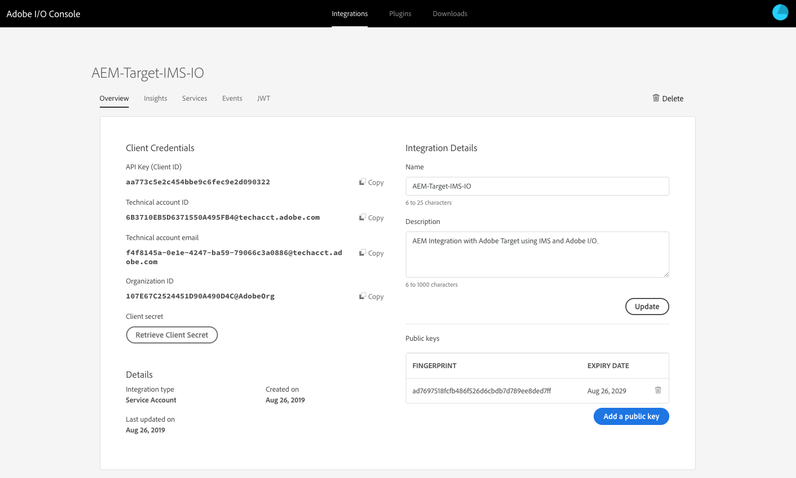

# Integração com o Adobe Target usando o Adobe I/O{#integration-with-adobe-target-using-adobe-i-o}

A integração do AEM com o Adobe Target por meio da API do Target Standard requer a configuração do Adobe IMS (Identity Management System) e da E/S da Adobe.

>[!NOTE]
>
>O suporte para a API do Adobe Target Standard é novo no AEM 6.5. A API do Target Standard usa autenticação IMS.
>
>O uso da API do Adobe Target Classic no AEM ainda é compatível com compatibilidade retroativa. A API do [Target Classic usa autenticação](/help/sites-administering/target-configuring.md#manually-integrating-with-adobe-target)de credenciais de usuário.
>
>A seleção da API é orientada pelo método de autenticação usado para a integração do AEM/Target.

## Pré-requisitos {#prerequisites}

Antes de iniciar este procedimento, o suporte [da](https://helpx.adobe.com/contact/enterprise-support.ec.html) Adobe deve provisionar sua conta para:

* Adobe Console
* E/S da Adobe
* Adobe Target e
* Adobe IMS (Identity Management System)

## Configuração de IMS - Geração de uma chave pública {#configuring-an-ims-configuration-generating-a-public-key}

A primeira etapa da configuração é criar uma Configuração IMS no AEM e gerar a Chave pública.

1. No AEM, abra o menu **Ferramentas** .
1. Na seção **Segurança** , selecione Configurações **do** Adobe IMS.
1. Selecione **Criar** para abrir a Configuração **de conta técnica** do Adobe IMS.
1. Usando o menu suspenso em Configuração **da** nuvem, selecione **Adobe Target**.
1. Ativar **Criar novo certificado** e inserir um novo alias.
1. Confirme com **Criar certificado**.

   

1. Selecione **Baixar** (ou **Baixar chave** pública) para baixar o arquivo na unidade local, de modo que ele esteja pronto para uso ao [configurar a integração de E/S do Adobe Target com o AEM](#configuring-adobe-i-o-for-adobe-target-integration-with-aem).

   >[!CAUTION]
   >
   >Mantenha essa configuração aberta, ela será necessária novamente ao [Concluir a configuração do IMS no AEM](#completing-the-ims-configuration-in-aem).

   

## Configuração de E/S da Adobe para integração do Adobe Target com o AEM {#configuring-adobe-i-o-for-adobe-target-integration-with-aem}

É necessário criar a integração de E/S da Adobe com o Adobe Target que o AEM usará e, em seguida, atribuir os privilégios necessários.

### Criação da integração {#creating-the-integration}

Abra o console de E/S da Adobe para criar uma integração de E/S com o Adobe Target que o AEM usará:

>[!NOTE]
>
>Consulte também os tutoriais [de E/S da](https://www.adobe.io/apis/experienceplatform/home/tutorials/alltutorials.html)Adobe.

1. Abra o console de E/S da Adobe para integrações:

   * [https://console.adobe.io/integrations](https://console.adobe.io/integrations)

1. Selecione **Nova integração**:

   >[!NOTE]
   >
   >Se você já tiver integrações existentes, elas serão listadas e o botão **Nova integração** estará no canto superior direito.

   

1. Selecione **Acessar uma API** seguido de **Continuar**:

   

1. Selecione **Adobe Target** e **Continue**:

   

1. Adicione os detalhes necessários para a configuração da integração:

   * **Nome**

      Insira o nome.

   * **Descrição**

      Uma descrição é opcional.

   * **Certificado de chave pública**

      Carregar o arquivo de chave pública; conforme gerado em [Configuração de IMS - Gerando uma chave](#configuring-an-ims-configuration-generating-a-public-key)pública.

      Depois de carregado, o certificado será listado em **Certificados**.

   * **Perfis de produto**

      Perfis de produto equiparam com Espaços de trabalho no Target que o AEM pode usar para exportação de conteúdo e criação de ofertas. Por padrão, o Target Default Workspace é selecionado. Selecione quaisquer outros Perfis/espaços de trabalho que devem ser expostos no AEM como destinos de exportação.
   Por exemplo:

   

1. Confirme com **Criar integração**.
1. A criação será confirmada; agora você pode **Continuar para os detalhes** da integração; são necessários para [concluir a configuração do IMS no AEM](#completing-the-ims-configuration-in-aem).

   

### Atribuindo privilégios à integração {#assigning-privileges-to-the-integration}

Agora, você deve atribuir os privilégios necessários à integração:

1. Abra o Adobe **Admin Console**:

   * [https://adminconsole.adobe.com](https://adminconsole.adobe.com/)

1. Navegue até **Produtos** (barra de ferramentas superior) e selecione **Adobe Target - &lt;*your-locatário-id*>** (no painel esquerdo).
1. Selecione Perfis **de** produto e, em seguida, seu espaço de trabalho necessário na lista apresentada. Por exemplo, Espaço de trabalho padrão.
1. Selecione **Integrações** e a configuração de integração necessária.
1. Selecione **Editor** como a Função **** do Produto; em vez de **Observer**.

## Detalhes armazenados para a integração de E/S da Adobe {#details-stored-for-the-adobe-i-o-integration}

No console de integrações de E/S da Adobe você pode ver uma lista de todas as suas integrações:

* [https://console.adobe.io/integrations](https://console.adobe.io/integrations)

Selecione **Exibir** (à direita de uma entrada de integração específica) para mostrar mais detalhes sobre a configuração. Dentre elas:

* Visão geral
* Insights
* Serviços
* Eventos
* JWT (token da Web JSON)

Alguns deles, você precisará concluir a integração de E/S da Adobe para o Target no AEM.

1. **Visão geral**:

   

1. **JWT**:

   

## Concluindo a configuração do IMS no AEM {#completing-the-ims-configuration-in-aem}

Retornando ao AEM, você pode concluir a configuração do IMS adicionando os valores necessários da integração de E/S da Adobe para o Target:

1. Retorne à Configuração [IMS aberta no AEM](#configuring-an-ims-configuration-generating-a-public-key).
1. Selecione **Próximo**.

1. Aqui você pode usar os [detalhes da E/S](#details-stored-for-the-adobe-i-o-integration)da Adobe:

   * **Título**: Seu texto.
   * **Servidor** de autorização: Copie/cole na `"aud"` linha da seção **Carga** abaixo, por exemplo, `"https://ims-na1.adobelogin.com"` no exemplo abaixo
   * **Chave** da API: Copie isso da seção [Visão geral](#details-stored-for-the-adobe-i-o-integration) da integração de E/S da Adobe para o Target
   * **Segredo** do cliente: Gerar isso na seção [Visão geral](#details-stored-for-the-adobe-i-o-integration) da integração de E/S da Adobe para o Target e copiar
   * **Carga**: Copie isso da seção [JWT](#details-stored-for-the-adobe-i-o-integration) da integração de E/S da Adobe para o Target
   

1. Confirme com **Criar**.

1. Sua configuração do Adobe Target será exibida no console do AEM.

   

## Confirmando a configuração do IMS {#confirming-the-ims-configuration}

Para confirmar se a configuração está funcionando como esperado:

1. Abrir:

   * `https://localhost<port>/libs/cq/adobeims-configuration/content/configurations.html`
   Por exemplo:

   * `https://localhost:4502/libs/cq/adobeims-configuration/content/configurations.html`

1. Selecione sua configuração.
1. Selecione **Verificar integridade** na barra de ferramentas, seguida por **Verificar**.

   

1. Se bem-sucedido, você verá a mensagem:

   

## Configuração do serviço Adobe Target Cloud {#configuring-the-adobe-target-cloud-service}

A configuração agora pode ser referenciada para um Serviço em nuvem usar a API do Target Standard:

1. Abra o menu **Ferramentas** . Em seguida, na seção Serviços **em** nuvem, selecione Serviços **em nuvem** herdados.
1. Role para baixo até o **Adobe Target** e selecione **Configurar agora**.

   The **Create Configuration** dialog will open.

1. Insira um **Título** e, se desejar, um **Nome** (se deixado em branco, isso será gerado a partir do título).

   Você também pode selecionar o modelo necessário (se houver mais de um disponível).

1. Confirme com **Criar**.

   A caixa de diálogo **Editar componente** será aberta.

1. Digite os detalhes na guia Configurações **do** Adobe Target:

   * **Código** do cliente: a ID do locatário do Adobe IMS

      >[!CAUTION]
      >
      >A ID do locatário do Adobe IMS deve ser inserida no campo Código do cliente.

   * **Autenticação**: IMS
   * **Configuração** IMS: selecione o nome da Configuração IMS
   * **Tipo** de API: REST
   * **Configuração** da nuvem do A4T Analytics: Selecione a configuração de nuvem do Analytics usada para segmentar as métricas e metas de atividade. Isso é necessário se você estiver usando o Adobe Analytics como a fonte de geração de relatórios ao direcionar conteúdo. Se você não visualizar a configuração da nuvem, consulte a observação em [Configuração](/help/sites-administering/target-configuring.md#configuring-a-t-analytics-cloud-configuration)da nuvem do A4T Analytics.
   * **Usar direcionamento** preciso: Por padrão, essa caixa de seleção é selecionada. Se selecionada, a configuração do serviço de nuvem aguardará o contexto ser carregado antes de carregar o conteúdo. Veja a seguir.
   * **Sincronizar segmentos do Adobe Target**: Selecione essa opção para baixar segmentos definidos no Target para usá-los no AEM. Você deve selecionar essa opção quando a propriedade Tipo de API for REST, pois os segmentos em linha não são suportados e você sempre precisa usar segmentos do Target. (Observe que o termo AEM de &quot;segmento&quot; equivale ao &quot;público-alvo&quot; do Target.)
   * **Biblioteca** do cliente: Selecione se deseja a biblioteca do cliente AT.js ou mbox.js (obsoleto).
   * **Use o Sistema de gerenciamento de tags para fornecer a biblioteca** do cliente: Use o DTM (obsoleto), o Adobe Launch ou qualquer outro sistema de gerenciamento de tags.
   * **AT.js** personalizado: Deixe em branco se tiver marcado a caixa Gerenciamento de tags ou para usar o padrão AT.js. Como alternativa, carregue seu AT.js personalizado. Será exibido somente se você tiver selecionado AT.js.
   >[!NOTE]
   >
   >[A configuração de um serviço em nuvem para usar a API](/help/sites-administering/target-configuring.md#manually-integrating-with-adobe-target) do Target Classic foi substituída (usa a guia Configurações do Adobe Recommendations).

   Por exemplo:

   

1. Clique em **Conectar-se ao Target** para inicializar a conexão com o Adobe Target.

   Se a conexão for bem-sucedida, será exibida a mensagem **Conexão bem-sucedida** .

1. Selecione **OK** na mensagem, seguido por **OK** na caixa de diálogo para confirmar a configuração.
1. Agora você pode continuar a [Adicionar uma Estrutura](/help/sites-administering/target-configuring.md#adding-a-target-framework) do Target para configurar parâmetros ContextHub ou ClientContext que serão enviados para o Target. Observe que isso pode não ser necessário para exportar fragmentos de experiência do AEM para o Target.

