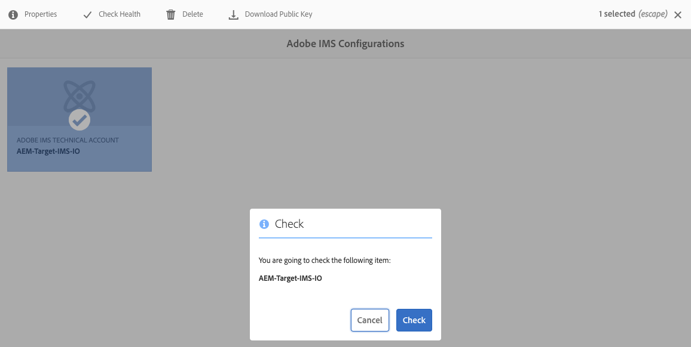

# Integração com o Adobe Target usando o Adobe I/O{#integration-with-adobe-target-using-adobe-i-o}

A integração do AEM com o Adobe Target por meio da API do Target Standard requer a configuração do Adobe IMS (Identity Management System) e do Adobe I/O.

>[!NOTE]
>
>O suporte para a API do Adobe Target Standard é novo no AEM 6.5. A API do Target Standard usa a autenticação IMS.
>
>O uso da API do Adobe Target Classic no AEM ainda é compatível com versões anteriores. O [A API do Target Classic usa a autenticação de credenciais do usuário](/help/sites-administering/target-configuring.md#manually-integrating-with-adobe-target).
>
>A seleção da API é orientada pelo método de autenticação usado para a integração do AEM/Target.
>Consulte também a [ID do locatário e código do cliente](#tenant-client) seção.

## Pré-requisitos {#prerequisites}

Antes de iniciar este procedimento:

* [Suporte a Adobe](https://helpx.adobe.com/br/contact/enterprise-support.ec.html) precisa provisionar sua conta para:

   * Console Adobe
   * Adobe I/O
   * Adobe Target e
   * Adobe IMS (Sistema Identity Management)

* O Administrador de sistema da sua organização deve usar o Admin Console para adicionar os desenvolvedores necessários em sua organização aos perfis de produto relevantes.

   * Isso fornece aos desenvolvedores específicos permissões para ativar integrações no Adobe I/O.
   * Para obter mais detalhes, consulte [Gerenciar desenvolvedores](https://helpx.adobe.com/enterprise/admin-guide.html/enterprise/using/manage-developers.ug.html).

## Configuração de um IMS - Geração de uma chave pública {#configuring-an-ims-configuration-generating-a-public-key}

O primeiro estágio da configuração é criar uma Configuração IMS no AEM e gerar a Chave pública.

1. Em AEM abra o **Ferramentas** menu.
1. No **Segurança** seção selecionar **Configurações do Adobe IMS**.
1. Selecionar **Criar** para abrir o **Configuração de conta técnica do Adobe IMS**.
1. Uso da lista suspensa em **Configuração na nuvem**, selecione **Adobe Target**.
1. Ativar **Criar novo certificado** e insira um novo alias.
1. Confirme com **Criar certificado**.

   

1. Selecionar **Baixar** ou **Baixar chave pública**) para baixar o arquivo na unidade local, de modo que ele esteja pronto para uso quando [configuração do Adobe I/O para integração do Adobe Target com o AEM](#configuring-adobe-i-o-for-adobe-target-integration-with-aem).

   >[!CAUTION]
   >
   >Mantenha essa configuração aberta, ela será necessária novamente quando [Concluir a configuração IMS no AEM](#completing-the-ims-configuration-in-aem).

   

## Configuração do Adobe I/O para integração do Adobe Target com o AEM {#configuring-adobe-i-o-for-adobe-target-integration-with-aem}

Você precisa criar o Adobe I/O Project (integração) com o Adobe Target que AEM usará e, em seguida, atribuir os privilégios necessários.

### Criação do projeto {#creating-the-project}

Abra o console Adobe I/O para criar um Projeto de E/S com o Adobe Target que AEM usará:

>[!NOTE]
>
>Consulte também a [Tutoriais do Adobe I/O](https://www.adobe.io/apis/experienceplatform/home/tutorials/alltutorials.html).

1. Abra o console Adobe I/O para Projetos:

   [https://console.adobe.io/projects](https://console.adobe.io/projects)

1. Quaisquer projetos que você tiver serão mostrados. Selecionar **Criar novo projeto** - a localização e utilização dependerão:

   * Se você ainda não tiver um projeto, **Criar novo projeto** será central, inferior.
      
   * Caso já tenha projetos existentes, eles serão listados e **Criar novo projeto** estará no canto superior direito.
      

1. Selecionar **Adicionar ao projeto** seguida de **API**:

   

1. Selecionar **Adobe Target**, em seguida **Próximo**:

   >[!NOTE]
   >
   >Se você estiver inscrito no Adobe Target, mas não o vir listado, verifique a variável [Pré-requisitos](#prerequisites).

   

1. **Fazer upload de sua chave pública** e quando terminar, continue com **Próximo**:

   

1. Revise as credenciais e continue com **Próximo**:

   

1. Selecione os perfis de produto necessários e continue com **Salvar API configurada**:

   >[!NOTE]
   >
   >Os perfis de produto exibidos com o dependem se você:
   >
   >* Adobe Target Standard - somente **Espaço de trabalho padrão** está disponível
   >* Adobe Target Premium - todos os espaços de trabalho disponíveis são listados, conforme mostrado abaixo

   

1. A criação será confirmada.

<!--
1. The creation will be confirmed, you can now **Continue to integration details**; these are needed for [Completing the IMS Configuration in AEM](#completing-the-ims-configuration-in-aem).

   
-->

### Atribuir privilégios à integração {#assigning-privileges-to-the-integration}

Agora, você deve atribuir os privilégios necessários à integração:

1. Abra o Adobe **Admin Console**:

   * [https://adminconsole.adobe.com](https://adminconsole.adobe.com/)

1. Navegar para **Produtos** (barra de ferramentas superior), em seguida, selecione **Adobe Target - &lt;*your-tenant-id*>** (no painel esquerdo).
1. Selecionar **Perfis de produto**, seu espaço de trabalho necessário na lista apresentada. Por exemplo, Espaço de trabalho padrão.
1. Selecionar **Integrações**, em seguida, a configuração de integração necessária.
1. Selecionar **Editor** como **Função do produto**; em vez de **Observador**.

## Detalhes armazenados para o Projeto de integração do Adobe I/O {#details-stored-for-the-adobe-io-integration-project}

No console Projetos do Adobe I/O, é possível ver uma lista de todos os seus projetos de integração:

* [https://console.adobe.io/projects](https://console.adobe.io/projects)

Selecionar **Exibir** (à direita de uma entrada de projeto específica) para mostrar mais detalhes sobre a configuração. Dentre elas:

* Visão geral do projeto
* Insights
* Credenciais
   * Conta de serviço (JWT)
      * Detalhes da credencial
      * Gerar JWT
* APIS
   * Por exemplo, Adobe Target

Alguns deles, você precisará concluir a integração do Adobe I/O para o Target em AEM.

## Concluir a configuração IMS no AEM {#completing-the-ims-configuration-in-aem}

Ao retornar para AEM, é possível concluir a configuração do IMS adicionando valores necessários da integração do Adobe I/O para o Target:

1. Retorne ao [Configuração IMS aberta no AEM](#configuring-an-ims-configuration-generating-a-public-key).
1. Selecione **Próximo**.

1. Aqui você pode usar o [detalhes do Adobe I/O](#details-stored-for-the-adobe-io-integration-project):

   * **Título**: Seu texto.
   * **Servidor de autorização**: Copie/cole no `"aud"` da **Carga** seção abaixo, por exemplo `"https://ims-na1.adobelogin.com"` no exemplo abaixo
   * **Chave da API**: Copie isso do [Visão geral](#details-stored-for-the-adobe-io-integration-project) seção de integração do Adobe I/O para o Target
   * **Segredo do cliente**: Gere isso no [Visão geral](#details-stored-for-the-adobe-io-integration-project) seção da integração do Adobe I/O para Target e cópia
   * **Carga**: Copie isso do [Gerar JWT](#details-stored-for-the-adobe-io-integration-project) seção de integração do Adobe I/O para o Target

   

1. Confirme com **Criar**.

1. Sua configuração do Adobe Target será exibida no console AEM.

   

## Confirmação da configuração IMS {#confirming-the-ims-configuration}

Para confirmar que a configuração está funcionando como esperado:

1. Abrir:

   * `https://localhost<port>/libs/cq/adobeims-configuration/content/configurations.html`

   Por exemplo:

   * `https://localhost:4502/libs/cq/adobeims-configuration/content/configurations.html`

1. Selecione sua configuração.
1. Selecionar **Verificar integridade** na barra de ferramentas, seguida por **Verificar**.

   

1. Se bem-sucedido, você verá a mensagem:

   

## Configuração do Cloud Service Adobe Target {#configuring-the-adobe-target-cloud-service}

A configuração agora pode ser mencionada para um Cloud Service para usar a API do Target Standard:

1. Abra o **Ferramentas** menu. Em seguida, no **Cloud Services** seção , selecione **Cloud Services herdados**.
1. Role para baixo até **Adobe Target** e selecione **Configurar agora**.

   O **Criar configuração** será aberta.

1. Insira um **Título** e, se quiser, um **Nome** (se deixado em branco, isso será gerado a partir do título).

   Você também pode selecionar o modelo necessário (se mais de um estiver disponível).

1. Confirme com **Criar**.

   O **Editar componente** será aberta.

1. Insira os detalhes na **Configurações do Adobe Target** guia :

   * **Autenticação**: IMS
   * **ID do locatário**: a ID de locatário do Adobe IMS. Consulte também a [ID do locatário e código do cliente](#tenant-client) seção.

      >[!NOTE]
      >
      >Para o IMS, esse valor precisa ser obtido do próprio Target. Você pode fazer logon no Target e extrair a ID do locatário do URL.
      >
      >Por exemplo, se o URL for:
      >
      >`https://experience.adobe.com/#/@yourtenantid/target/activities`
      >
      >Em seguida, você usaria `yourtenantid`.
   * **Código do cliente**: Consulte a [ID do locatário e código do cliente](#tenant-client) seção.
   * **Configuração IMS**: selecione o nome da Configuração IMS
   * **Tipo de API**: REST
   * **Configuração do A4T Analytics Cloud**: Selecione a configuração de nuvem do Analytics usada para métricas e metas de atividade do Target. Isso é necessário se estiver usando o Adobe Analytics como fonte de relatórios ao direcionar conteúdo. Se você não vir a configuração da nuvem, consulte a observação em [Configuração do A4T Analytics Cloud](/help/sites-administering/target-configuring.md#configuring-a-t-analytics-cloud-configuration).
   * **Usar direcionamento preciso**: Por padrão, essa caixa de seleção está marcada. Se selecionada, a configuração do serviço de nuvem aguardará o contexto carregar antes de carregar o conteúdo. Veja a observação a seguir.
   * **Sincronizar segmentos do Adobe Target**: Selecione essa opção para baixar segmentos definidos no Target para usá-los em AEM. Você deve selecionar essa opção quando a propriedade Tipo de API for REST, pois os segmentos em linha não são compatíveis e você sempre precisa usar segmentos do Target. (Observe que o termo AEM de &quot;segmento&quot; equivale ao &quot;público-alvo&quot; do Target.)
   * **Biblioteca do cliente**: Selecione se deseja a biblioteca do cliente AT.js ou mbox.js (obsoleto).
   * **Usar o sistema de gerenciamento de tags para fornecer a biblioteca do cliente**: Use o DTM (obsoleto), o Adobe Launch ou qualquer outro sistema de gerenciamento de tags.
   * **AT.js personalizada**: Deixe em branco se tiver marcado a caixa Tag Management ou para usar a AT.js padrão. Como alternativa, carregue sua AT.js personalizada. Somente será exibido se tiver selecionado AT.js.

   >[!NOTE]
   >
   >[Configuração de um Cloud Service para usar a API do Target Classic](/help/sites-administering/target-configuring.md#manually-integrating-with-adobe-target) foi substituída (usa a guia Configurações do Adobe Recommendations ).
1. Clique em **Conectar-se ao Target** para inicializar a conexão com o Adobe Target.

   Se a conexão for bem-sucedida, a mensagem **Conexão bem-sucedida** é exibida.

1. Selecionar **OK** na mensagem, seguida de **OK** na caixa de diálogo para confirmar a configuração.
1. Agora você pode continuar com [Adicionar uma estrutura do Target](/help/sites-administering/target-configuring.md#adding-a-target-framework) para configurar parâmetros do ContextHub ou do ClientContext que serão enviados para o Target. Observe que isso pode não ser necessário para exportar AEM Fragmentos de experiência para o Target.

### ID do locatário e código do cliente {#tenant-client}

Com [Adobe Experience Manager 6.5.8.0](/help/release-notes/release-notes.md), o campo Código do cliente foi adicionado à janela Configuração do Target.

Ao configurar os campos ID do locatário e Código do cliente , esteja ciente do seguinte:

1. Para a maioria dos clientes, a ID do locatário e o código do cliente são os mesmos. Isso significa que ambos os campos contêm as mesmas informações e são idênticos. Certifique-se de inserir a ID do locatário em ambos os campos.
2. Para fins herdados, você também pode inserir valores diferentes nos campos ID do locatário e Código do cliente .

Em ambos os casos, esteja ciente de que:

* Por padrão, o Código do cliente (se adicionado primeiro) também será copiado automaticamente para o campo ID do locatário .
* Você tem a opção de alterar o conjunto padrão de ID de locatário.
* Assim, as chamadas de back-end para o Target serão baseadas na ID do locatário e as chamadas do lado do cliente para o Target serão baseadas no Código do cliente.

Como dito anteriormente, o primeiro caso é o mais comum para o AEM 6.5. De qualquer forma, verifique se **both** Os campos contêm as informações corretas, dependendo de suas necessidades.

>[!NOTE]
>
> Se quiser alterar uma Configuração do Target existente:
>
> 1. Insira novamente a ID do locatário.
> 2. Conecte-se novamente ao Target.
> 3. Salve a configuração.

