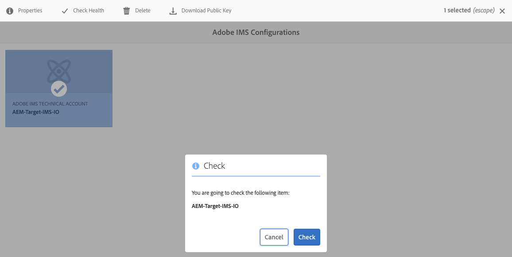

# Integração com o Adobe Target usando IMS{#integration-with-adobe-target-using-ims}

A integração do AEM com o Adobe Target por meio da API do Target Standard requer a configuração do Adobe IMS (Identity Management System) usando o console do Adobe Developer.

>[!NOTE]
>
>A compatibilidade com a API do Adobe Target Standard é nova no AEM 6.5. A API do Target Standard usa autenticação IMS.
>
>O uso da API do Adobe Target Classic no AEM ainda é compatível com versões anteriores. A variável [A API do Target Classic usa autenticação de credenciais do usuário](/help/sites-administering/target-configuring.md#manually-integrating-with-adobe-target).
>
>A seleção da API é orientada pelo método de autenticação usado para a integração do AEM/Target.
>Consulte também a [ID do locatário e código do cliente](#tenant-client) seção.

## Pré-requisitos {#prerequisites}

Antes de iniciar este procedimento:

* O [Suporte da Adobe](https://experienceleague.adobe.com/?support-solution=General&amp;support-tab=home#support) precisa provisionar sua conta com:

   * Adobe Console
   * Console do desenvolvedor da Adobe
   * Adobe Target e
   * Adobe IMS (Identity Management System)

* O administrador de sistemas da sua organização deve usar o Admin Console para adicionar os desenvolvedores necessários em sua organização aos perfis de produto relevantes.

   * Isso fornece aos desenvolvedores específicos permissões para ativar integrações no Console do Adobe Developer.
   * Consulte [Gerenciar desenvolvedores](https://helpx.adobe.com/enterprise/using/manage-developers.html).

## Configuração de IMS - Geração de uma Chave pública {#configuring-an-ims-configuration-generating-a-public-key}

O primeiro estágio da configuração é criar uma configuração do IMS no AEM e gerar a Chave pública.

1. No AEM, abra o menu **Ferramentas**.
1. No **Segurança** , selecione **Configurações do Adobe IMS**.
1. Selecione **Criar** para abrir a **Configuração de contas técnicas do Adobe IMS**.
1. Usando a lista suspensa em **Configuração na nuvem**, selecione **Adobe Target**.
1. Ative **Criar novo certificado** e insira um novo alias.
1. Confirme com **Criar certificado**.

   

1. Selecione **Baixar** (ou **Baixar Chave pública**) para baixar o arquivo na unidade local, de modo que ele esteja pronto para uso ao [configurar o IMS para integração do Adobe Target com o AEM](#configuring-ims-for-adobe-target-integration-with-aem).

   >[!CAUTION]
   >
   >Mantenha essa configuração aberta; ela será necessária novamente quando [Concluir a configuração do IMS no AEM](#completing-the-ims-configuration-in-aem).

   

## Configuração do IMS para integração do Adobe Target com o AEM {#configuring-ims-for-adobe-target-integration-with-aem}

Usando o Console do Adobe Developer, crie um Projeto (integração) com o Adobe Target que o AEM possa usar e, em seguida, atribua os privilégios necessários.

### Criação do projeto {#creating-the-project}

Para criar um projeto com o Adobe Target que o AEM possa usar, abra o Adobe Developer Console:

>[!CAUTION]
>
>No momento, o Adobe só é compatível com o console do Adobe Developer **Conta de serviço (JWT)** tipo de credencial.
>
>Não use o **Servidor OAuth para servidor** tipo de credencial, que terá suporte no futuro.

1. Abra os projetos do Adobe Developer Console:

   [https://developer.adobe.com/console/projects](https://developer.adobe.com/console/projects)

1. Quaisquer projetos que você tiver serão mostrados. Selecionar **Criar novo projeto** - a localização e utilização dependem do seguinte:

   * Se você ainda não tiver um projeto, **Criar novo projeto** estará na parte inferior central.
     
   * Caso já tenha projetos existentes, eles são listados e **Criar novo projeto** está no canto superior direito.
     

1. Selecione **Adicionar ao projeto** e, em seguida, **API**:

   

1. Selecione **Adobe Target** e, em seguida, **Próximo**:

   >[!NOTE]
   >
   >Se estiver inscrito no Adobe Target, mas ele não estiver listado, verifique os [Pré-requisitos](#prerequisites).

   

1. **Fazer upload de sua chave pública**, e quando terminar, continue com **Próximo**:

   

1. Revise as credenciais e continue com **Próximo**:

   

1. Selecione os perfis de produto necessários e continue com **Salvar API configurada**:

   >[!NOTE]
   >
   >Os perfis de produto que são exibidos dependem se você:
   >
   >* Adobe Target Standard - somente o **Espaço de trabalho padrão** está disponível
   >* Adobe Target Premium - todos os espaços de trabalho disponíveis são listados, conforme mostrado abaixo

   

1. A criação é confirmada.

<!--
1. The creation is confirmed, you can now **Continue to integration details**; these are needed for [Completing the IMS Configuration in AEM](#completing-the-ims-configuration-in-aem).

   
-->

### Atribuir privilégios à integração {#assigning-privileges-to-the-integration}

Agora atribua os privilégios necessários à integração:

1. Abra o Adobe **Admin Console**:

   * [https://adminconsole.adobe.com](https://adminconsole.adobe.com/)

1. Navegue até **Produtos** (barra de ferramentas superior) e, em seguida, selecione **Adobe Target - &lt;*seu-id-de-locatário*>** (no painel esquerdo).
1. Selecione **Perfis de produto** e, em seguida, o espaço de trabalho necessário. Por exemplo, Espaço de trabalho padrão.
1. Selecione **Credenciais da API** e, em seguida, a configuração de integração necessária.
1. Selecione **Editor** como **Função do produto**, em vez de **Observador**.

## Detalhes armazenados para o projeto de integração do Adobe Developer Console {#details-stored-for-the-ims-integration-project}

No Console do desenvolvedor da Adobe - Projetos, você pode ver uma lista de todos os seus projetos de integração:

* [https://developer.adobe.com/console/projects](https://developer.adobe.com/console/projects)

Para mostrar mais detalhes sobre a configuração, selecione **Exibir** (à direita de uma entrada de projeto específica). Dentre elas:

* Visão geral do projeto
* Insights
* Credenciais
   * Conta de serviço (JWT)
      * Detalhes da credencial
      * Gerar JWT
* APIS
   * Por exemplo, Adobe Target

Em alguns desses, você deve concluir a integração do Adobe Target no AEM com base no IMS.

## Concluir a configuração do IMS no AEM {#completing-the-ims-configuration-in-aem}

Ao retornar para o AEM, é possível concluir a configuração do IMS adicionando os valores necessários da integração do Adobe Developer Console com o Target:

1. Retorne à [configuração do IMS aberta no AEM](#configuring-an-ims-configuration-generating-a-public-key).
1. Selecione **Próximo**.

1. Aqui, é possível usar os [detalhes da configuração do projeto no Console do Desenvolvedor da Adobe](#details-stored-for-the-ims-integration-project):

   * **Título**: seu texto.
   * **Servidor de autorização**: copie/cole essa informação da linha `aud` da seção **Carga** abaixo, por exemplo, `https://ims-na1.adobelogin.com` no exemplo abaixo
   * **Chave de API**: copie isso da lista [Visão geral](#details-stored-for-the-ims-integration-project) seção
   * **Segredo do cliente**: gere isso no [Visão geral](#details-stored-for-the-ims-integration-project) seção e cópia
   * **Carga**: copie isso da seção [Gerar JWT](#details-stored-for-the-ims-integration-project)

   

1. Confirme com **Criar**.

1. Sua configuração do Adobe Target será exibida no console do AEM.

   

## Confirmação da configuração do IMS {#confirming-the-ims-configuration}

Para confirmar que a configuração está funcionando como esperado:

1. Abrir:

   * `https://localhost<port>/libs/cq/adobeims-configuration/content/configurations.html`

   Por exemplo:

   * `https://localhost:4502/libs/cq/adobeims-configuration/content/configurations.html`

1. Selecione sua configuração.
1. Selecione **Verificar integridade** na barra de ferramentas, seguido por **Verificar**.

   

1. Se tiver êxito, você verá a mensagem:

   

## Configuração do Cloud Service Adobe Target {#configuring-the-adobe-target-cloud-service}

A configuração agora pode ser referenciada para um Cloud Service usar a API do Target Standard:

1. Abra o **Ferramentas** menu. Em seguida, no prazo de **Cloud Service** , selecione **Cloud Service herdados**.
1. Role para baixo até **Adobe Target** e selecione **Configurar agora**.

   A variável **Criar configuração** é aberta.

1. Insira um **Título** e, se desejar, um **Nome** (se deixado em branco, é gerado a partir do título).

   Você também pode selecionar o modelo necessário (se mais de um estiver disponível).

1. Confirme com **Criar**.

   A variável **Editar componente** é aberta.

1. Insira os detalhes na **Configurações do Adobe Target** guia:

   * **Autenticação**: IMS

   * **ID do inquilino**: a ID do locatário do Adobe IMS. Consulte também a [ID do locatário e código do cliente](#tenant-client) seção.

     >[!NOTE]
     >
     >Para IMS, esse valor deve ser retirado do próprio Target. Você pode fazer logon no Target e extrair a ID do locatário do URL.
     >
     >Por exemplo, se o URL for:
     >
     >`https://experience.adobe.com/#/@yourtenantid/target/activities`
     >
     >Então você usaria `yourtenantid`.

   * **Código do cliente**: Consulte a [ID do locatário e código do cliente](#tenant-client) seção.

   * **Configuração do IMS**: selecione o nome da configuração IMS

   * **Tipo de API**: REST

   * **Configuração do A4T Analytics Cloud**: selecione a configuração do Analytics Cloud usada para métricas e metas da atividade de direcionamento. Isso é necessário se estiver usando o Adobe Analytics como fonte de relatórios ao direcionar conteúdo. Se você não vir a configuração da nuvem, consulte a observação em [Definição da Configuração do A4T Analytics Cloud](/help/sites-administering/target-configuring.md#configuring-a-t-analytics-cloud-configuration).

   * **Usar a segmentação precisa**: por padrão, essa caixa de seleção está marcada. Se selecionada, a configuração do Cloud Service aguarda o contexto ser carregado antes de carregar o conteúdo. Veja a observação a seguir.

   * **Sincronizar segmentos do Adobe Target**: selecione essa opção para baixar segmentos definidos no Target e usá-los no AEM. Selecione essa opção quando a propriedade Tipo de API for REST, pois os segmentos em linha não são compatíveis e você sempre deve usar segmentos do Target. (O termo AEM de &quot;segmento&quot; é equivalente ao termo &quot;público-alvo&quot; do Target.)

   * **Biblioteca do cliente**: selecione se deseja a biblioteca do cliente AT.js ou mbox.js (descontinuada).

   * **Usar o sistema Tag Management para disponibilizar a biblioteca do cliente**: Use o DTM (obsoleto), o Adobe Launch ou qualquer outro sistema de gerenciamento de tags.

   * **AT.js personalizada**: Deixe em branco se tiver marcado a caixa Tag Management ou para usar a AT.js padrão. Como alternativa, faça upload do seu AT.js personalizado. Aparece somente se tiver selecionado AT.js.

   >[!NOTE]
   >
   >[Configuração de um Cloud Service para usar a API do Target Classic](/help/sites-administering/target-configuring.md#manually-integrating-with-adobe-target) foi descontinuado (usa a guia Configurações do Adobe Recommendations ).

1. Clique em **Conectar ao Target** para inicializar a conexão com o Adobe Target.

   Se a conexão for bem-sucedida, a mensagem **Conexão bem-sucedida** é exibido.

1. Selecionar **OK** na mensagem, seguido por **OK** na caixa de diálogo para que você possa confirmar a configuração.

1. Agora você pode prosseguir para [Adição de uma estrutura do Target](/help/sites-administering/target-configuring.md#adding-a-target-framework) para configurar os parâmetros do ContextHub ou do ClientContext que são enviados para o Target. Observe que isso pode não ser necessário para exportar fragmentos de experiência do AEM para o Target.

### ID do locatário e código do cliente {#tenant-client}

Com [Adobe Experience Manager 6.5.8.0](/help/release-notes/release-notes.md), o campo Código do cliente foi adicionado à janela de configuração do Target.

Ao configurar os campos ID de locatário e Código do cliente, esteja ciente do seguinte:

1. Para a maioria dos clientes, a ID do locatário e o Código do cliente são iguais. Isso significa que ambos os campos contêm as mesmas informações e são idênticos. Insira a ID do locatário em ambos os campos.
2. Para fins herdados, você também pode inserir valores diferentes nos campos ID do locatário e Código do cliente.

Em ambos os casos, esteja ciente do seguinte:

* Por padrão, o código de cliente (se adicionado primeiro) também é copiado automaticamente para o campo ID de locatário.
* Opcionalmente, é possível alterar o conjunto padrão de ID do locatário.
* Portanto, as chamadas de back-end para o Target são baseadas na ID do locatário e as chamadas do lado do cliente para o Target são baseadas no Código do cliente.

Como dito anteriormente, o primeiro caso é o mais comum para o AEM 6.5. De qualquer maneira, verifique se **ambos** Os campos contêm as informações corretas, dependendo das suas necessidades.

>[!NOTE]
>
>Se quiser alterar uma Configuração do Target existente:
>
>1. Insira novamente a ID do locatário.
>2. Conecte-se novamente ao Target.
>3. Salve a configuração.
