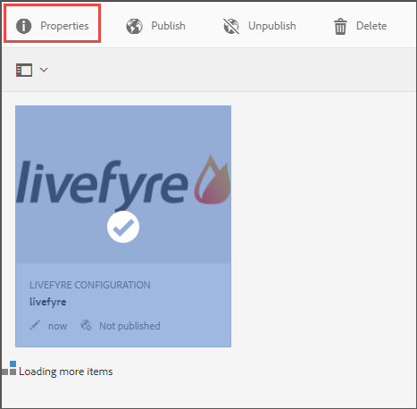
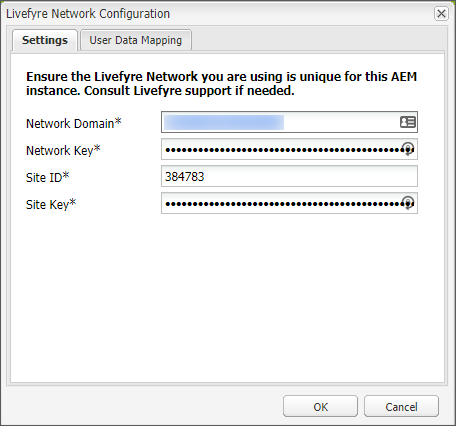

# Integração com o Livefyre{#integrating-with-livefyre}

Saiba como integrar os recursos de curadoria líderes do setor da Livefyre à sua instância AEM 6.5, permitindo que você publique conteúdo valioso gerado pelo usuário (UGC) das redes sociais para o seu site em minutos.

## Introdução {#getting-started}

### Instale o Livefyre Package for AEM {#install-livefyre-package-for-aem}

AEM 6.5 vem com o Livefyre feature package 1.2.6 pré-instalado. Este pacote inclui apenas uma integração limitada do Livefyre com a AEM Sites e deve ser desinstalado antes da instalação de um pacote atualizado. Com o pacote mais recente, você pode experimentar a integração total do Livefyre com AEM, incluindo Sites, Ativos e Comércio.

>[!NOTE]
>
>Alguns recursos do pacote AEM-LF dependem da Estrutura de componentes sociais (SCF). Se estiver usando o pacote de recursos do Livefyre como parte de um site que não seja de comunidades, você deve declarar *cq.social.scf* como uma dependência nos clientlibs do autor do site. Se você estiver usando o pacote de recursos LF como parte de um site de comunidades, essa dependência já deve ser declarada.

1. Na página inicial AEM, clique no ícone **Ferramentas** no painel esquerdo.
1. Navegue até **Implantação > Pacotes**.
1. No Gerenciador de pacotes, role até ver o pacote de recursos do Livefyre pré-instalado e clique no título do pacote **cq-social-livefyre-pkg-1.2.6.zip** para expandir as opções.
1. Clique em **Mais > Desinstalar**.

   

1. Baixe o pacote Livefyre da Distribuição [de](https://experience.adobe.com/#/downloads/content/software-distribution/en/aem.html)software.

1. No Gerenciador de pacotes, instale o pacote baixado. Consulte [Como trabalhar com pacotes](/help/sites-administering/package-manager.md) para obter mais informações sobre como usar a Distribuição de software e os pacotes no AEM

   

   Seu pacote Livefyre-AEM agora está instalado. Antes de começar a usar os recursos de integração, é necessário configurar o AEM para usar o Livefyre.

   Para obter mais informações e notas de versão sobre pacotes de recursos, consulte Pacotes de [recursos](https://helpx.adobe.com/experience-manager/6-3/release-notes/feature-packs-release-notes.html).

### Configure AEM para usar o Livefyre: Criar uma pasta de configuração {#configure-aem-to-use-livefyre-create-a-configuration-folder}

1. Na página inicial AEM, clique no ícone **Ferramentas** no painel esquerdo e navegue até **Geral > Navegador** de configuração.
   * See the [Configuration Browser](/help/sites-administering/configurations.md) documentation for more information.
1. Clique em **Criar** para abrir a caixa de diálogo Criar configuração.
1. Nomeie sua configuração e marque a caixa de seleção Configurações **da** nuvem.

   Isso criará uma pasta em **Ferramentas > Implantação > Configuração** do Livefyre com o nome fornecido.

   

### Configure AEM para usar o Livefyre: Criar uma configuração do Livefyre {#configure-aem-to-use-livefyre-create-a-livefyre-configuration}

Configure AEM para usar as credenciais de licença do Livefyre de sua organização, permitindo a comunicação entre o Livefyre e a AEM.

1. Na página inicial AEM, clique no ícone **Ferramentas** no painel esquerdo e navegue até **Implantação > Configuração** do Livefyre.
1. Selecione a pasta de configuração na qual deseja criar uma nova configuração do Livefyre e clique em **Criar**.

   

   >[!NOTE]
   >
   >As pastas devem ter as Configurações de nuvem ativadas em suas propriedades antes que as configurações do Livefyre possam ser adicionadas a elas. As pastas de configuração são criadas e gerenciadas no Navegador [de configuração.](/help/sites-administering/configurations.md)
   >
   >Não é possível criar um nome para uma configuração; ele é referenciado pelo caminho da pasta em que está. Você só pode ter uma configuração por pasta.

1. Selecione o cartão de configuração do Livefyre recém-criado e clique em **Propriedades**.

   

1. Digite as credenciais do Livefyre da sua organização e clique em **OK**.

   

   Para acessar essas informações, abra o estúdio Livefyre e navegue até **Configurações > Configurações de integração > Credenciais**.

   Sua instância de AEM agora está configurada para usar o Livefyre e você pode usar os recursos de integração.

### Personalizar a integração de logon único {#customize-single-sign-on-integration}

O Livefyre para AEM pacote inclui uma integração predefinida entre os perfis AEM Communities e o serviço SSO da Livefyre.

Quando os usuários fazem logon no seu site AEM, eles também são conectados aos componentes sociais do Livefyre. Quando um usuário desconectado tenta usar um recurso do componente Livefyre que requer autenticação (como fazer upload de uma foto), o componente Livefyre inicia a autenticação do usuário.

A integração de autenticação padrão pode não ser perfeita para todos os sites. Para melhor corresponder ao fluxo de autenticação nos modelos do site, você pode substituir o Representante de autenticação do Livefyre padrão para atender às suas necessidades. Use estas etapas:

1. Usando o CRXDE Lite, copie */libs/social/integrations/livefyre/components/autorizablecomponent/authclientlib* para */apps/social/integrations/livefyre/components/autorizablecomponent/authclientlib*.
1. Edite e salve */apps/social/integrations/livefyre/components/authorizablecomponent/authclientlib/auth.js* para implementar um delegado Livefyre Auth que atenda às suas necessidades.

   Para obter mais informações sobre como personalizar um representante de autenticação, consulte Integração [de](https://answers.livefyre.com/developers/identity-integration/)identidade.

   Para obter mais informações sobre AEM Clientlibs, consulte [Uso de bibliotecas](https://helpx.adobe.com/experience-manager/6-3/sites/developing/using/clientlibs.html)do lado do cliente.

## Use o Livefyre com AEM Sites {#use-livefyre-with-aem-sites}

### Adicionar componentes do Livefyre a uma página {#add-livefyre-components-to-a-page}

Antes de adicionar componentes do Livefyre a uma página no Sites, é necessário ativar o Livefyre para a página ao herdar uma configuração da nuvem do Livefyre de uma página principal ou ao adicionar a configuração diretamente à página. Consulte sua implementação para saber como incluir serviços em nuvem no site.

Assim que o Livefyre for ativado para a página, os container deverão ser configurados para permitir componentes do Livefyre. Consulte [Configuração de componentes no Modo](https://helpx.adobe.com/experience-manager/6-3/sites/authoring/using/default-components-designmode.html) de design para obter instruções sobre como ativar diferentes componentes.

>[!NOTE]
>
>Os aplicativos que exigem autenticação para publicação não funcionam até que a autenticação seja configurada em Personalizar integração de logon único.

1. No painel **Componentes** no modo de design, selecione **Livefyre** no menu para limitar a lista aos componentes disponíveis do Livefyre.

   

1. Selecione um componente do Livefyre e arraste-o para a posição na sua página.
1. Selecione se deseja criar um novo aplicativo Livefyre ou incorporar um existente.

   Se estiver incorporando um aplicativo existente, AEM solicita que você selecione o aplicativo. Se estiver criando um novo aplicativo, o aplicativo precisará ser preenchido antes que qualquer conteúdo seja exibido. O aplicativo será criado no site e na rede do Livefyre selecionados quando a configuração da nuvem do Livefyre for ativada para a página.

   Para obter mais informações sobre como inserir componentes, consulte [Edição de conteúdo](https://helpx.adobe.com/experience-manager/6-3/sites/authoring/using/editing-content.html)da página.

### Edite um componente Livefyre para uma página AEM. {#edit-a-livefyre-component-for-an-aem-page}

Você só pode configurar e editar um componente Livefyre no Livefyre Studio. De AEM:

1. Clique no componente Livefyre para configurar.
1. Clique no ícone **Configurar** (chave) para abrir a caixa de diálogo de configuração.
1. Click **To edit this component, go to Livefyre Studio**.
1. Edite o aplicativo no Livefyre Studio.

## Use o Livefyre com AEM Assets {#use-livefyre-with-aem-assets}

### Solicitar direitos e importar UGC para o AEM Assets {#request-rights-and-import-ugc-into-aem-assets}

Você pode importar conteúdo gerado pelo usuário (UGC) do Twitter e do Instagram do Livefyre Studio para o AEM Assets usando o Importador UGC. Depois de selecionar o conteúdo a ser importado, você deve solicitar direitos para o conteúdo antes que a importação possa ser concluída.

>[!NOTE]
>
>Antes de usar os Ativos para importar o UGC, você deve configurar contas de Contas sociais e Solicitações de direitos no Livefyre Studio. Consulte [Configuração: Solicitações](https://docs.adobe.com/content/help/en/livefyre/using/rights-requests/c-how-requesting-rights-works.html) de direitos para obter mais informações.

Para importar o UGC para o AEM Assets:

1. Na página inicial AEM, navegue até **Ativos > Arquivos**.
1. Clique em **Criar** e em **Importar UGC.**

   

1. Localizar conteúdo:

   * No Livefyre, clique na guia Biblioteca UGC. Use os filtros e pesquise para encontrar conteúdo da Biblioteca UGC.
   * No Twitter e no Instagram, clicando na guia Twitter ou Instagram. Use a pesquisa ou os filtros para localizar conteúdo.

1. Selecione os ativos que deseja importar. Os ativos selecionados são contados e salvos automaticamente na guia **Selecionados** .
1. **Opcional**: Clique na guia **Selecionado** e reveja o conteúdo UGC selecionado para importação.
1. Clique em **Avançar**.

   

1. Para solicitações de direitos, escolha uma das seguintes opções para cada ativo:

   Para o Instagram:

   * **Solicite manualmente direitos** para obter uma mensagem que possa ser copiada, colada e enviada manualmente para os proprietários de conteúdo por meio do Instagram.
   * **Atribua manualmente direitos** de conteúdo para substituir os direitos de ativos individuais.

   >[!NOTE]
   >
   >Devido a atualizações que afetam a agregação de conteúdo de contas de usuários não comerciais, não podemos mais postar comentários em seu nome ou verificar automaticamente as respostas do autor. [Clique aqui para saber mais](https://developers.facebook.com/blog/post/2018/04/04/facebook-api-platform-product-changes/).

   

   Para o Twitter:

   * **Autor** de mensagem para enviar uma mensagem ao proprietário do conteúdo solicitando direitos ao ativo.
   * **Atribua manualmente direitos** de conteúdo para substituir os direitos de ativos individuais.

1. Clique em **Importar**.

   Se você enviar uma solicitação de direitos do Twitter, o proprietário do conteúdo visualizará a mensagem de solicitação de direitos em sua conta:

   

   >[!NOTE]
   >
   >O Twitter tem limites para solicitações idênticas provenientes da mesma conta. Ao importar mais de dois ativos, modifique as mensagens individualmente para evitar que elas sejam sinalizadas.

1. Clique em **Concluído** no canto superior direito para concluir o fluxo de trabalho da Solicitação de direitos.

   Você pode ver o status de uma Solicitação de direitos pendente para um ativo no Livefyre Studio. Se o conteúdo estiver pendente de uma solicitação de direitos, o ativo não será exibido na AEM Assets até que os direitos sejam concedidos. O ativo aparece automaticamente no AEM Assets quando uma Solicitação de direitos é concedida.

   Para o Instagram, você deve rastrear a resposta do proprietário do conteúdo e conceder direitos manualmente se receber direitos sobre o conteúdo.

## Use o Livefyre com AEM Commerce {#use-livefyre-with-aem-commerce}

### Importar catálogos de produtos para o Livefyre com comércio AEM {#import-product-catalogs-into-livefyre-with-aem-commerce}

Os usuários do AEM Commerce podem integrar perfeitamente seu catálogo de produtos existente ao Livefyre para incentivar a participação dos usuários nos aplicativos de visualização do Livefyre.

Depois de importar o catálogo de produtos, os produtos são exibidos em tempo real na sua instância do Livefyre. Se você editar ou excluir itens em seu Catálogo de produtos de comércio AEM, as alterações serão automaticamente atualizadas no Livefrye.

1. Verifique se você tem o Livefyre mais recente para AEM pacote instalado em sua instância AEM.
1. Na página inicial AEM, navegue até **AEM Commerce**.
1. Crie uma nova coleção ou use uma coleção existente.
1. Passe o mouse sobre a coleção e clique em Propriedades **da** coleção (ícone de lápis).
1. Marque **Sync (Sincronizar) para Livefyre**.
1. Preencha o prefixo **da página do** Livefyre para vincular essa coleção a uma página específica no AEM.

   O prefixo da página define o caminho raiz no seu ambiente onde a pesquisa por páginas de produtos começa. O Livefyre escolhe a primeira página que tem um produto correspondente associado ao mesmo. Para obter páginas diferentes para produtos diferentes, são necessárias várias coleções.

## Matriz de suporte AEM para aplicativos Livefyre {#aem-support-matrix-for-livefyre-apps}

| Aplicativos Livefyre | AEM 6.1 | AEM 6.2 | AEM 6.3 | AEM 6.4 |
|---|---|---|---|---|
| Carrossel | X | X | X | X |
| Bate-papo | X | X | X | X |
| Comentários | X | X | X | X |
| Película fotográfica |  | X | X | X |
| LiveBlog | X | X | X | X |
| Mapa | X | X | X | X |
| Mídia | X | X | X | X |
| Mosaico | X | X | X | X |
| Pesquisa |  | X | X | X |
| Revisões |  | X | X | X |
| Cartão único | X | X | X | X |
| Storify 2 |  | X | X | X |
| Em tendência |  | X | X | X |
| Botão Upload |  | X | X | X |

